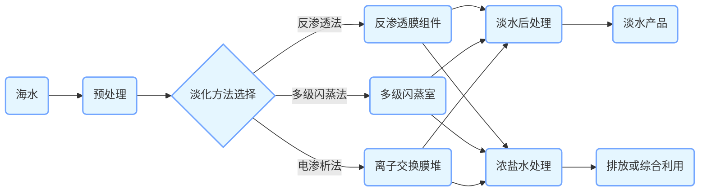

# 价值投资中的海水淡化技术前景

> 关键词：价值投资、海水淡化技术、前景分析、市场趋势、技术发展

> 摘要：本文围绕价值投资视角下的海水淡化技术前景展开深入探讨。首先介绍了研究的背景、目的、预期读者和文档结构等信息，明确了相关术语。接着阐述了海水淡化技术的核心概念、原理和架构，给出了相应的示意图和流程图。详细讲解了海水淡化的核心算法原理，并结合Python代码进行说明。通过数学模型和公式进一步剖析了海水淡化的成本、效率等关键指标。以实际项目为例，展示了开发环境搭建、源代码实现和解读。分析了海水淡化技术在多个领域的实际应用场景。推荐了学习该技术的资源、开发工具框架以及相关论文著作。最后总结了海水淡化技术的未来发展趋势与挑战，并提供了常见问题解答和扩展阅读参考资料，旨在为价值投资者全面评估海水淡化技术的投资价值提供参考。

## 1. 背景介绍 
### 1.1 目的和范围
随着全球人口的增长和经济的发展，水资源短缺问题日益严峻。海水淡化作为一种重要的水资源补充手段，正逐渐受到广泛关注。本研究的目的在于从价值投资的角度，全面分析海水淡化技术的发展前景，为投资者提供决策依据。研究范围涵盖海水淡化技术的原理、市场现状、发展趋势、成本效益等多个方面。

### 1.2 预期读者
本文预期读者主要包括价值投资者、金融分析师、海水淡化技术相关企业管理人员、科研人员以及对水资源问题和投资领域感兴趣的人士。

### 1.3 文档结构概述
本文将按照以下结构展开：首先介绍海水淡化技术的核心概念和联系，包括原理和架构；接着阐述核心算法原理和具体操作步骤，并给出Python代码示例；然后通过数学模型和公式对海水淡化进行详细讲解和举例说明；进行项目实战，展示代码实际案例和详细解释；分析海水淡化技术的实际应用场景；推荐相关的学习资源、开发工具框架和论文著作；最后总结未来发展趋势与挑战，提供常见问题解答和扩展阅读参考资料。

### 1.4 术语表
#### 1.4.1 核心术语定义
- **海水淡化**：将海水中的盐分和其他杂质去除，使海水转化为可饮用或可用于工业生产的淡水的过程。
- **反渗透法**：一种常见的海水淡化方法，通过半透膜在压力作用下使海水分离出淡水。
- **多级闪蒸法**：利用蒸汽在多个压力逐渐降低的闪蒸室中闪蒸，使海水蒸发并冷凝成淡水的方法。
- **电渗析法**：基于离子交换膜的选择透过性，在电场作用下使海水中的离子定向迁移，从而实现海水淡化的方法。

#### 1.4.2 相关概念解释
- **脱盐率**：指海水淡化过程中去除盐分的比例，是衡量海水淡化效果的重要指标。
- **能源消耗**：海水淡化过程中所消耗的能源，包括电力、蒸汽等，是影响海水淡化成本的关键因素。
- **浓盐水排放**：海水淡化过程中产生的高浓度盐水排放问题，对海洋生态环境可能造成一定影响。

#### 1.4.3 缩略词列表
- **RO**：Reverse Osmosis，反渗透法
- **MSF**：Multi-Stage Flash Distillation，多级闪蒸法
- **ED**：Electrodialysis，电渗析法

## 2. 核心概念与联系 
### 核心概念原理
海水淡化技术主要基于物理和化学原理，通过去除海水中的盐分和其他杂质来获得淡水。常见的海水淡化方法有反渗透法、多级闪蒸法和电渗析法。

- **反渗透法原理**：反渗透法是利用半透膜的特性，在压力作用下，使海水中的水分子通过半透膜，而盐分等杂质被截留，从而实现海水淡化。半透膜具有选择性透过性，只允许水分子通过，而阻止其他离子和大分子物质通过。
- **多级闪蒸法原理**：多级闪蒸法是将加热后的海水依次引入多个压力逐渐降低的闪蒸室中，在每个闪蒸室中，海水因压力降低而迅速蒸发，蒸汽在冷凝器中冷凝成淡水。通过多级闪蒸，可以提高海水的蒸发效率，降低能源消耗。
- **电渗析法原理**：电渗析法是利用离子交换膜的选择透过性，在电场作用下，使海水中的阳离子向阴极迁移，阴离子向阳极迁移，从而实现盐分的分离和海水淡化。离子交换膜分为阳离子交换膜和阴离子交换膜，分别允许阳离子和阴离子通过。

### 架构的文本示意图
```plaintext
海水淡化系统架构
|-- 海水预处理系统
|   |-- 过滤装置
|   |-- 杀菌装置
|-- 海水淡化核心装置
|   |-- 反渗透膜组件（RO法）
|   |-- 多级闪蒸室（MSF法）
|   |-- 离子交换膜堆（ED法）
|-- 淡水后处理系统
|   |-- 脱气装置
|   |-- 水质调节装置
|-- 浓盐水处理系统
|   |-- 排放装置
|   |-- 综合利用装置
```

### Mermaid流程图


## 3. 核心算法原理 & 具体操作步骤 
### 反渗透法核心算法原理
反渗透法的核心是计算膜通量和脱盐率。膜通量是指单位时间内通过单位面积膜的水量，脱盐率是指去除盐分的比例。

膜通量的计算公式为：
$J = A(\Delta P - \Delta \pi)$
其中，$J$ 是膜通量，$A$ 是膜的水渗透系数，$\Delta P$ 是操作压力与渗透压之差，$\Delta \pi$ 是膜两侧的渗透压之差。

脱盐率的计算公式为：
$R = \frac{C_{in}-C_{out}}{C_{in}} \times 100\%$
其中，$R$ 是脱盐率，$C_{in}$ 是进水盐浓度，$C_{out}$ 是产水盐浓度。

### Python代码示例
```python
# 定义反渗透法参数计算函数
def reverse_osmosis_flux(A, delta_P, delta_pi):
    """
    计算反渗透膜通量
    :param A: 膜的水渗透系数
    :param delta_P: 操作压力与渗透压之差
    :param delta_pi: 膜两侧的渗透压之差
    :return: 膜通量
    """
    return A * (delta_P - delta_pi)

def reverse_osmosis_rejection_rate(C_in, C_out):
    """
    计算反渗透脱盐率
    :param C_in: 进水盐浓度
    :param C_out: 产水盐浓度
    :return: 脱盐率
    """
    return ((C_in - C_out) / C_in) * 100

# 示例参数
A = 0.01  # 膜的水渗透系数
delta_P = 50  # 操作压力与渗透压之差
delta_pi = 10  # 膜两侧的渗透压之差
C_in = 35000  # 进水盐浓度（mg/L）
C_out = 500  # 产水盐浓度（mg/L）

# 计算膜通量和脱盐率
flux = reverse_osmosis_flux(A, delta_P, delta_pi)
rejection_rate = reverse_osmosis_rejection_rate(C_in, C_out)

print(f"膜通量: {flux} L/(m^2·h)")
print(f"脱盐率: {rejection_rate}%")
```

### 具体操作步骤
1. **海水预处理**：对海水进行过滤、杀菌等预处理，去除海水中的悬浮物、微生物等杂质，以保护反渗透膜。
2. **增压**：将预处理后的海水通过高压泵增压，使其压力高于渗透压，以便水分子能够通过反渗透膜。
3. **反渗透分离**：将增压后的海水引入反渗透膜组件，水分子通过半透膜形成淡水，盐分等杂质被截留形成浓盐水。
4. **淡水后处理**：对反渗透产水进行脱气、水质调节等后处理，使其达到饮用水或工业用水的标准。
5. **浓盐水处理**：对浓盐水进行排放或综合利用，如用于盐化工生产等。

## 4. 数学模型和公式 & 详细讲解 & 举例说明 
### 反渗透法成本模型
反渗透法的成本主要包括设备投资成本、运行成本和维护成本。设备投资成本主要与膜组件、高压泵等设备的购置费用有关；运行成本主要包括能源消耗、药剂消耗等费用；维护成本主要包括膜清洗、设备维修等费用。

设设备投资成本为 $C_{inv}$，运行成本为 $C_{op}$，维护成本为 $C_{main}$，则总成本 $C_{total}$ 为：
$C_{total} = C_{inv} + C_{op} + C_{main}$

运行成本中的能源消耗成本 $C_{energy}$ 可以通过以下公式计算：
$C_{energy} = P \times t \times C_{e}$
其中，$P$ 是设备的功率，$t$ 是运行时间，$C_{e}$ 是电价。

### 举例说明
假设一个反渗透海水淡化项目的设备投资成本为 1000 万元，运行时间为每年 8000 小时，设备功率为 500 kW，电价为 0.8 元/kWh，每年的药剂消耗费用为 50 万元，膜清洗和设备维修等维护成本为每年 100 万元。

首先计算能源消耗成本：
$C_{energy} = 500 \times 8000 \times 0.8 \div 10000 = 320$（万元）

运行成本 $C_{op} = C_{energy} + 50 = 320 + 50 = 370$（万元）

总成本 $C_{total} = 1000 + 370 + 100 = 1470$（万元）

### 多级闪蒸法效率模型
多级闪蒸法的效率主要与闪蒸级数、蒸汽温度和压力等因素有关。闪蒸级数越多，蒸汽利用率越高，效率也越高。

设多级闪蒸系统的闪蒸级数为 $n$，每级的蒸汽利用率为 $\eta_i$，则总蒸汽利用率 $\eta_{total}$ 为：
$\eta_{total} = \prod_{i=1}^{n} \eta_i$

### 举例说明
假设一个多级闪蒸系统有 10 级闪蒸，每级的蒸汽利用率分别为 0.9、0.92、0.93、0.94、0.95、0.96、0.97、0.98、0.99、1.0，则总蒸汽利用率为：
$\eta_{total} = 0.9 \times 0.92 \times 0.93 \times 0.94 \times 0.95 \times 0.96 \times 0.97 \times 0.98 \times 0.99 \times 1.0 \approx 0.66$

## 5. 项目实战：代码实际案例和详细解释说明 
### 5.1  开发环境搭建
本项目使用Python进行开发，开发环境搭建步骤如下：
1. **安装Python**：从Python官方网站（https://www.python.org/downloads/）下载并安装Python 3.x版本。
2. **安装开发工具**：推荐使用PyCharm作为开发工具，从JetBrains官方网站（https://www.jetbrains.com/pycharm/download/）下载并安装。
3. **创建虚拟环境**：在命令行中使用以下命令创建虚拟环境：
```sh
python -m venv seawater_desalination_env
```
4. **激活虚拟环境**：
    - 在Windows系统中，使用以下命令激活虚拟环境：
```sh
seawater_desalination_env\Scripts\activate
```
    - 在Linux或Mac系统中，使用以下命令激活虚拟环境：
```sh
source seawater_desalination_env/bin/activate
```
5. **安装必要的库**：在激活的虚拟环境中，使用以下命令安装必要的库：
```sh
pip install numpy pandas matplotlib
```

### 5.2  源代码详细实现和代码解读
```python
import numpy as np
import pandas as pd
import matplotlib.pyplot as plt

# 定义反渗透法参数计算函数
def reverse_osmosis_flux(A, delta_P, delta_pi):
    """
    计算反渗透膜通量
    :param A: 膜的水渗透系数
    :param delta_P: 操作压力与渗透压之差
    :param delta_pi: 膜两侧的渗透压之差
    :return: 膜通量
    """
    return A * (delta_P - delta_pi)

def reverse_osmosis_rejection_rate(C_in, C_out):
    """
    计算反渗透脱盐率
    :param C_in: 进水盐浓度
    :param C_out: 产水盐浓度
    :return: 脱盐率
    """
    return ((C_in - C_out) / C_in) * 100

# 示例参数
A = 0.01  # 膜的水渗透系数
delta_P_values = np.linspace(10, 100, 100)  # 操作压力与渗透压之差的取值范围
delta_pi = 10  # 膜两侧的渗透压之差
C_in = 35000  # 进水盐浓度（mg/L）
C_out = 500  # 产水盐浓度（mg/L）

# 计算不同操作压力下的膜通量
flux_values = []
for delta_P in delta_P_values:
    flux = reverse_osmosis_flux(A, delta_P, delta_pi)
    flux_values.append(flux)

# 计算脱盐率
rejection_rate = reverse_osmosis_rejection_rate(C_in, C_out)

# 绘制膜通量与操作压力的关系曲线
plt.plot(delta_P_values, flux_values)
plt.xlabel('操作压力与渗透压之差 (MPa)')
plt.ylabel('膜通量 (L/(m^2·h))')
plt.title('反渗透膜通量与操作压力的关系')
plt.grid(True)
plt.show()

# 输出脱盐率
print(f"脱盐率: {rejection_rate}%")

# 将数据保存到CSV文件
data = {'操作压力与渗透压之差 (MPa)': delta_P_values, '膜通量 (L/(m^2·h))': flux_values}
df = pd.DataFrame(data)
df.to_csv('reverse_osmosis_flux.csv', index=False)
```

### 代码解读与分析
1. **导入必要的库**：导入`numpy`、`pandas`和`matplotlib.pyplot`库，分别用于数值计算、数据处理和绘图。
2. **定义反渗透法参数计算函数**：定义`reverse_osmosis_flux`函数用于计算反渗透膜通量，定义`reverse_osmosis_rejection_rate`函数用于计算反渗透脱盐率。
3. **设置示例参数**：设置膜的水渗透系数、操作压力与渗透压之差的取值范围、膜两侧的渗透压之差、进水盐浓度和产水盐浓度等参数。
4. **计算不同操作压力下的膜通量**：使用`for`循环遍历不同的操作压力值，调用`reverse_osmosis_flux`函数计算膜通量，并将结果存储在列表中。
5. **计算脱盐率**：调用`reverse_osmosis_rejection_rate`函数计算脱盐率。
6. **绘制膜通量与操作压力的关系曲线**：使用`matplotlib.pyplot`库绘制膜通量与操作压力的关系曲线，直观展示膜通量随操作压力的变化情况。
7. **输出脱盐率**：打印脱盐率的值。
8. **将数据保存到CSV文件**：使用`pandas`库将操作压力和膜通量的数据保存到CSV文件中，方便后续分析和处理。

## 6. 实际应用场景 
### 饮用水供应
在一些沿海地区和岛屿，由于淡水资源匮乏，海水淡化技术成为解决饮用水供应问题的重要途径。通过建设海水淡化厂，可以将海水转化为符合饮用水标准的淡水，满足当地居民的生活用水需求。例如，沙特阿拉伯、阿联酋等国家大量采用海水淡化技术来解决国内的饮用水问题。

### 工业用水
许多工业生产过程需要大量的淡水，如电力、化工、冶金等行业。海水淡化技术可以为这些工业企业提供稳定的水源，减少对传统淡水水源的依赖。例如，一些沿海的发电厂采用海水淡化技术制取淡水用于锅炉补水，提高了发电效率和可靠性。

### 农业灌溉
在一些干旱地区，农业灌溉用水短缺问题严重。海水淡化技术可以为农业灌溉提供一定的水源补充。通过将淡化后的海水与其他水源混合使用，可以满足农作物的生长需求。例如，以色列在农业灌溉中广泛应用海水淡化技术，提高了农业生产的效率和可持续性。

### 海岛开发
随着海岛旅游和海洋资源开发的不断发展，海岛对淡水的需求日益增加。海水淡化技术可以为海岛提供独立的淡水供应系统，保障海岛的正常运转。例如，我国在南海的一些海岛建设了海水淡化装置，解决了岛上居民和游客的用水问题。

## 7. 工具和资源推荐
### 7.1 学习资源推荐
#### 7.1.1 书籍推荐
- 《海水淡化技术与工程》：本书系统介绍了海水淡化的各种技术和工程应用，包括反渗透法、多级闪蒸法、电渗析法等，是学习海水淡化技术的经典教材。
- 《水资源可持续利用与海水淡化》：本书从水资源可持续利用的角度出发，探讨了海水淡化技术在解决水资源短缺问题中的作用和发展前景。
- 《膜技术与应用》：本书详细介绍了膜技术的原理、分类和应用，其中包括反渗透膜在海水淡化中的应用，对于深入理解反渗透法海水淡化技术有很大帮助。

#### 7.1.2 在线课程
- Coursera平台上的“海水淡化技术与应用”课程：该课程由国际知名专家授课，内容涵盖海水淡化的基本原理、技术发展趋势、工程设计等方面。
- edX平台上的“水资源与海水淡化”课程：该课程结合实际案例，介绍了海水淡化技术在不同场景下的应用和挑战。

#### 7.1.3 技术博客和网站
- 中国海水淡化与水再利用学会官网：提供海水淡化领域的最新政策、技术动态和研究成果。
- 国际海水淡化协会官网：汇集了全球海水淡化行业的信息和数据，是了解国际海水淡化市场的重要渠道。

### 7.2 开发工具框架推荐
#### 7.2.1 IDE和编辑器
- PyCharm：功能强大的Python集成开发环境，提供代码编辑、调试、版本控制等功能，适合Python开发。
- Visual Studio Code：轻量级的代码编辑器，支持多种编程语言，具有丰富的插件扩展功能，可用于海水淡化相关代码的开发。

#### 7.2.2 调试和性能分析工具
- Py-Spy：用于分析Python代码的性能，找出性能瓶颈。
- PDB：Python自带的调试工具，可用于调试Python代码。

#### 7.2.3 相关框架和库
- NumPy：用于数值计算和数组操作，在海水淡化技术的算法实现中经常使用。
- Pandas：用于数据处理和分析，可用于处理海水淡化项目中的数据。
- Matplotlib：用于数据可视化，可将海水淡化过程中的数据以图表的形式展示出来。

### 7.3 相关论文著作推荐
#### 7.3.1 经典论文
- “Reverse Osmosis Desalination: A State-of-the-Art Review”：该论文对反渗透法海水淡化技术进行了全面的综述，包括技术原理、发展历程、应用现状和未来趋势。
- “Multi-Stage Flash Distillation: A Comprehensive Review”：该论文详细介绍了多级闪蒸法海水淡化技术的原理、工艺和性能，是多级闪蒸法领域的经典文献。

#### 7.3.2 最新研究成果
- 关注《Desalination》、《Journal of Membrane Science》等国际知名期刊，这些期刊经常发表海水淡化技术的最新研究成果。

#### 7.3.3 应用案例分析
- 《海水淡化工程案例集》：本书收集了国内外多个海水淡化工程的实际案例，包括项目背景、技术方案、运行效果等方面的介绍，对于了解海水淡化项目的实际应用具有重要参考价值。

## 8. 总结：未来发展趋势与挑战
### 未来发展趋势
- **技术创新**：随着材料科学、纳米技术等领域的不断发展，海水淡化技术将不断创新。例如，开发新型的反渗透膜材料，提高膜的通量和脱盐率；研究更高效的能量回收装置，降低海水淡化的能源消耗。
- **成本降低**：通过技术创新和规模化生产，海水淡化的成本将不断降低。未来，海水淡化有望成为一种具有竞争力的水资源解决方案，广泛应用于更多领域。
- **与可再生能源结合**：将海水淡化技术与太阳能、风能等可再生能源相结合，实现能源的可持续供应。这不仅可以降低海水淡化的运行成本，还可以减少对传统能源的依赖，符合可持续发展的要求。
- **综合利用**：加强海水淡化过程中浓盐水的综合利用，如提取盐、镁、溴等有用物质，减少浓盐水排放对海洋生态环境的影响，提高海水资源的利用效率。

### 挑战
- **能源消耗**：目前海水淡化技术的能源消耗仍然较高，是制约其发展的主要因素之一。如何降低能源消耗，提高能源利用效率，是未来需要解决的关键问题。
- **环境影响**：海水淡化过程中产生的浓盐水排放可能对海洋生态环境造成一定影响。如何妥善处理浓盐水，减少其对环境的负面影响，是海水淡化行业面临的重要挑战。
- **膜污染**：反渗透膜在运行过程中容易受到污染，导致膜通量下降和脱盐率降低。如何有效防止膜污染，延长膜的使用寿命，是提高反渗透法海水淡化效率和稳定性的关键。
- **投资成本**：建设海水淡化厂需要大量的投资，包括设备购置、工程建设等方面的费用。对于一些经济欠发达地区来说，投资成本可能是限制海水淡化技术应用的重要因素。

## 9. 附录：常见问题与解答
### 问题1：海水淡化的成本高吗？
答：海水淡化的成本受多种因素影响，如技术类型、能源价格、规模大小等。目前，随着技术的不断进步和规模化生产，海水淡化的成本逐渐降低。在一些地区，海水淡化的成本已经与传统水资源的成本相当甚至更低。

### 问题2：海水淡化后的水质如何？
答：经过严格处理的海水淡化水水质可以达到饮用水或工业用水的标准。一般来说，反渗透法海水淡化水的盐分含量很低，水质纯净，可以满足大多数使用需求。

### 问题3：海水淡化会对环境造成污染吗？
答：海水淡化过程中产生的浓盐水排放可能对海洋生态环境造成一定影响。但通过合理的处理和排放方式，如稀释排放、综合利用等，可以减少其对环境的负面影响。同时，一些新型的海水淡化技术也在不断研发，旨在降低对环境的污染。

### 问题4：海水淡化技术适用于所有地区吗？
答：海水淡化技术主要适用于沿海地区和岛屿等淡水资源匮乏的地区。对于内陆地区，由于运输成本等因素的限制，海水淡化可能不是最经济有效的水资源解决方案。

## 10. 扩展阅读 & 参考资料
### 扩展阅读
- 《海水淡化产业发展报告》：深入分析了全球海水淡化产业的发展现状、市场趋势和政策环境。
- 《水资源管理与海水淡化战略》：探讨了在水资源管理中如何合理应用海水淡化技术，实现水资源的可持续利用。

### 参考资料
- 中国海水淡化与水再利用学会相关报告和研究成果。
- 国际海水淡化协会发布的数据和研究报告。
- 相关学术期刊上发表的论文，如《Desalination》、《Journal of Membrane Science》等。

作者：AI天才研究院/AI Genius Institute & 禅与计算机程序设计艺术 /Zen And The Art of Computer Programming