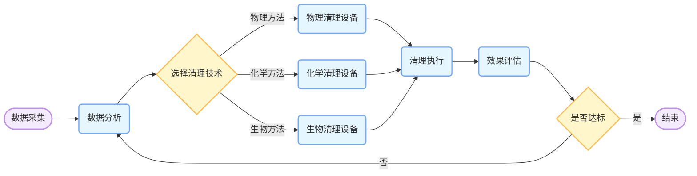

# 价值投资中的海洋微塑料清理技术前景

> 关键词：价值投资、海洋微塑料清理技术、技术前景、投资潜力、环保效益

> 摘要：本文聚焦于价值投资视角下海洋微塑料清理技术的前景。首先介绍了海洋微塑料污染的背景，阐述了进行价值投资分析的目的和范围等内容。接着详细讲解了海洋微塑料清理技术的核心概念、联系及相关架构，分析了其核心算法原理并给出Python代码示例，还从数学模型和公式角度进行了深入剖析。通过项目实战展示了清理技术的代码实现与解读，探讨了该技术的实际应用场景。同时推荐了学习该领域的工具和资源，包括书籍、在线课程、开发工具等。最后总结了海洋微塑料清理技术未来的发展趋势与挑战，解答了常见问题，并提供了扩展阅读和参考资料，旨在为投资者和相关从业者全面了解该技术的投资价值和发展前景提供参考。

## 1. 背景介绍 
### 1.1 目的和范围
海洋微塑料污染已成为全球关注的环境问题之一，这些微小的塑料颗粒对海洋生态系统、人类健康等都造成了潜在威胁。本文章的目的在于从价值投资的角度深入探讨海洋微塑料清理技术的前景，分析其在经济、环境和社会层面的潜在价值。范围涵盖了海洋微塑料清理技术的核心概念、算法原理、实际应用案例、投资潜力以及未来发展趋势等方面，旨在为投资者、环保人士和相关科研人员提供全面的信息和决策依据。

### 1.2 预期读者
预期读者包括对价值投资感兴趣的投资者，他们希望寻找具有长期增长潜力和社会责任感的投资项目；从事环保领域研究和实践的科研人员和从业者，旨在了解海洋微塑料清理技术的最新进展和应用前景；关注海洋生态保护的社会公众，期望了解解决海洋微塑料污染问题的有效途径。

### 1.3 文档结构概述
本文将按照以下结构进行阐述：首先介绍海洋微塑料清理技术的背景信息，包括目的、预期读者和文档结构概述等；接着详细讲解核心概念与联系，通过文本示意图和Mermaid流程图展示技术架构；然后深入分析核心算法原理，并给出Python源代码进行具体操作步骤的说明；再从数学模型和公式的角度进行详细讲解，并举例说明；通过项目实战展示代码实际案例并进行详细解释；探讨该技术的实际应用场景；推荐相关的工具和资源；总结未来发展趋势与挑战；解答常见问题；最后提供扩展阅读和参考资料。

### 1.4 术语表
#### 1.4.1 核心术语定义
- **海洋微塑料**：指粒径小于5毫米的塑料颗粒，它们主要来源于塑料制品的分解、工业生产中的塑料颗粒泄漏以及化妆品和个人护理产品中的微珠等。
- **价值投资**：一种投资策略，强调通过对资产的内在价值进行评估，寻找被低估的投资机会，并长期持有以获取回报。
- **海洋微塑料清理技术**：旨在从海洋环境中去除微塑料的一系列技术和方法，包括物理、化学和生物等多种手段。

#### 1.4.2 相关概念解释
- **微塑料的生态危害**：海洋微塑料可以被海洋生物误食，进入食物链，对海洋生物的健康造成影响，甚至可能通过食物链传递影响人类健康。此外，微塑料还可能吸附环境中的污染物，进一步加剧其危害。
- **投资回报率**：衡量投资收益的指标，通常用投资收益与投资成本的比率来表示。在海洋微塑料清理技术投资中，投资回报率不仅包括经济收益，还应考虑环境和社会效益。

#### 1.4.3 缩略词列表
- **MPs**：Microplastics，微塑料
- **ROI**：Return on Investment，投资回报率

## 2. 核心概念与联系 

### 核心概念原理
海洋微塑料清理技术的核心目标是有效地从海洋环境中分离和去除微塑料颗粒。其原理主要基于微塑料的物理和化学性质，以及海洋环境的特点。

物理方法主要利用微塑料与海水或其他物质的密度、形状、大小等物理差异进行分离。例如，通过过滤、沉淀、浮选等技术，将微塑料从海水中分离出来。过滤是一种常见的方法，利用不同孔径的滤网，将大于滤网孔径的微塑料拦截下来。沉淀则是利用微塑料与海水的密度差异，使微塑料在重力作用下沉淀到水底，然后通过吸泥等方式将其收集。浮选是向海水中通入气体，使微塑料附着在气泡上，浮到水面后进行收集。

化学方法主要是利用化学反应使微塑料发生降解或改变其性质，从而便于分离和处理。例如，一些化学试剂可以与微塑料表面的官能团发生反应，使微塑料变得更容易聚集或沉淀。生物方法则是利用微生物或其他生物的代谢作用，将微塑料分解为无害的物质。一些微生物能够分泌特定的酶，将微塑料中的聚合物链断裂，从而实现降解。

### 架构的文本示意图
海洋微塑料清理技术的架构可以分为以下几个层次：

#### 数据采集层
该层主要负责收集海洋环境中微塑料的相关数据，包括微塑料的分布、浓度、粒径等信息。数据采集的方法包括现场采样、卫星遥感、传感器监测等。现场采样是最直接的方法，通过在海洋中不同地点采集水样或沉积物样本，然后进行实验室分析，确定微塑料的含量和特征。卫星遥感可以利用不同波段的电磁波对海洋表面进行监测，通过分析反射或辐射信号，推断海洋表面微塑料的分布情况。传感器监测则可以实时监测海洋环境中微塑料的浓度和其他参数，为清理决策提供依据。

#### 数据分析层
该层对采集到的数据进行处理和分析，以了解海洋微塑料的污染状况和变化趋势。数据分析的方法包括统计学分析、机器学习算法等。统计学分析可以对微塑料的浓度、粒径分布等数据进行描述性统计，分析其时空变化规律。机器学习算法可以利用历史数据建立预测模型，预测微塑料的分布和迁移趋势，为清理方案的制定提供参考。

#### 清理执行层
该层根据数据分析的结果，选择合适的清理技术和设备，对海洋微塑料进行清理。清理技术包括物理、化学和生物方法，清理设备包括各种类型的滤网、沉淀器、浮选装置、降解反应器等。在清理过程中，需要根据不同的海洋环境和微塑料特征，选择合适的清理方法和设备，以提高清理效率和效果。

#### 效果评估层
该层对清理效果进行评估，以检验清理技术的有效性和可行性。效果评估的指标包括微塑料的去除率、清理成本、对海洋生态环境的影响等。通过对清理前后海洋环境中微塑料的浓度、分布等数据进行对比分析，评估清理效果，并根据评估结果对清理方案进行优化和调整。

### Mermaid流程图


该流程图展示了海洋微塑料清理技术的基本流程。首先进行数据采集，然后对采集到的数据进行分析，根据分析结果选择合适的清理技术和设备进行清理执行。清理完成后，对清理效果进行评估，如果效果未达标，则返回数据分析阶段，重新调整清理方案；如果效果达标，则结束清理过程。

## 3. 核心算法原理 & 具体操作步骤 

### 核心算法原理
在海洋微塑料清理技术中，数据分析和决策制定是关键环节。其中，机器学习算法可以用于预测微塑料的分布和迁移趋势，为清理方案的制定提供依据。这里我们以支持向量机（SVM）算法为例，介绍其在海洋微塑料分布预测中的应用原理。

支持向量机是一种监督学习算法，用于分类和回归分析。在海洋微塑料分布预测中，我们可以将海洋环境的相关参数（如温度、盐度、海流速度等）作为输入特征，将微塑料的浓度作为输出标签，通过训练支持向量机模型，建立输入特征与输出标签之间的映射关系。

支持向量机的核心思想是在特征空间中找到一个最优的超平面，将不同类别的样本分开，并且使分类间隔最大。对于线性可分的情况，支持向量机可以找到一个线性超平面进行分类；对于线性不可分的情况，支持向量机可以通过核函数将输入特征映射到高维空间，使其在高维空间中线性可分。

### Python源代码实现
以下是一个使用Python和Scikit-learn库实现支持向量机回归模型的示例代码：

```python
import numpy as np
from sklearn.svm import SVR
from sklearn.model_selection import train_test_split
from sklearn.metrics import mean_squared_error

# 生成示例数据
# 假设我们有三个特征：温度、盐度、海流速度
# 以及一个标签：微塑料浓度
np.random.seed(0)
n_samples = 100
X = np.random.rand(n_samples, 3)  # 特征矩阵
y = 2 * X[:, 0] + 3 * X[:, 1] + 4 * X[:, 2] + np.random.randn(n_samples)  # 标签

# 划分训练集和测试集
X_train, X_test, y_train, y_test = train_test_split(X, y, test_size=0.2, random_state=42)

# 创建支持向量机回归模型
model = SVR(kernel='rbf', C=100, gamma=0.1)

# 训练模型
model.fit(X_train, y_train)

# 预测测试集
y_pred = model.predict(X_test)

# 计算均方误差
mse = mean_squared_error(y_test, y_pred)
print(f"均方误差: {mse}")
```

### 具体操作步骤
1. **数据准备**：收集海洋环境的相关参数（如温度、盐度、海流速度等）和对应的微塑料浓度数据，将其整理成特征矩阵和标签向量的形式。
2. **数据划分**：将数据集划分为训练集和测试集，通常采用80:20或70:30的比例。训练集用于模型的训练，测试集用于评估模型的性能。
3. **模型创建**：选择合适的支持向量机模型，根据数据的特点选择合适的核函数（如线性核、多项式核、径向基核等）和模型参数（如惩罚因子C、核系数gamma等）。
4. **模型训练**：使用训练集对支持向量机模型进行训练，通过最小化损失函数来优化模型的参数。
5. **模型预测**：使用训练好的模型对测试集进行预测，得到预测结果。
6. **模型评估**：计算预测结果与真实标签之间的误差，如均方误差、平均绝对误差等，评估模型的性能。

## 4. 数学模型和公式 & 详细讲解 & 举例说明 

### 支持向量机的数学模型
支持向量机的目标是在特征空间中找到一个最优的超平面，将不同类别的样本分开，并且使分类间隔最大。对于线性可分的情况，支持向量机的数学模型可以表示为：

$$
\begin{aligned}
\min_{\mathbf{w}, b} &\quad \frac{1}{2} \|\mathbf{w}\|^2 \\
\text{s.t.} &\quad y_i(\mathbf{w}^T \mathbf{x}_i + b) \geq 1, \quad i = 1, 2, \cdots, n
\end{aligned}
$$

其中，$\mathbf{w}$ 是超平面的法向量，$b$ 是偏置项，$\mathbf{x}_i$ 是第 $i$ 个样本的特征向量，$y_i$ 是第 $i$ 个样本的标签（$y_i \in \{-1, 1\}$），$n$ 是样本的数量。

### 拉格朗日对偶问题
为了求解上述优化问题，我们可以引入拉格朗日乘子 $\alpha_i \geq 0$，构造拉格朗日函数：

$$
L(\mathbf{w}, b, \boldsymbol{\alpha}) = \frac{1}{2} \|\mathbf{w}\|^2 - \sum_{i=1}^{n} \alpha_i (y_i(\mathbf{w}^T \mathbf{x}_i + b) - 1)
$$

然后对 $\mathbf{w}$ 和 $b$ 求偏导数并令其为零，得到：

$$
\begin{aligned}
\frac{\partial L}{\partial \mathbf{w}} &= \mathbf{w} - \sum_{i=1}^{n} \alpha_i y_i \mathbf{x}_i = 0 \\
\frac{\partial L}{\partial b} &= -\sum_{i=1}^{n} \alpha_i y_i = 0
\end{aligned}
$$

将上述结果代入拉格朗日函数，得到拉格朗日对偶问题：

$$
\begin{aligned}
\max_{\boldsymbol{\alpha}} &\quad \sum_{i=1}^{n} \alpha_i - \frac{1}{2} \sum_{i=1}^{n} \sum_{j=1}^{n} \alpha_i \alpha_j y_i y_j \mathbf{x}_i^T \mathbf{x}_j \\
\text{s.t.} &\quad \sum_{i=1}^{n} \alpha_i y_i = 0 \\
&\quad \alpha_i \geq 0, \quad i = 1, 2, \cdots, n
\end{aligned}
$$

### 核函数
对于线性不可分的情况，支持向量机可以通过核函数将输入特征映射到高维空间，使其在高维空间中线性可分。常用的核函数包括线性核、多项式核、径向基核等。

- **线性核**：$K(\mathbf{x}_i, \mathbf{x}_j) = \mathbf{x}_i^T \mathbf{x}_j$
- **多项式核**：$K(\mathbf{x}_i, \mathbf{x}_j) = (\gamma \mathbf{x}_i^T \mathbf{x}_j + r)^d$，其中 $\gamma$ 是核系数，$r$ 是偏移量，$d$ 是多项式的次数。
- **径向基核（RBF）**：$K(\mathbf{x}_i, \mathbf{x}_j) = \exp(-\gamma \|\mathbf{x}_i - \mathbf{x}_j\|^2)$，其中 $\gamma$ 是核系数。

### 举例说明
假设我们有两个二维样本点 $\mathbf{x}_1 = [1, 1]^T$ 和 $\mathbf{x}_2 = [2, 2]^T$，标签分别为 $y_1 = 1$ 和 $y_2 = -1$。我们使用线性核进行计算：

$$
K(\mathbf{x}_1, \mathbf{x}_2) = \mathbf{x}_1^T \mathbf{x}_2 = 1 \times 2 + 1 \times 2 = 4
$$

如果使用径向基核，假设 $\gamma = 0.1$，则：

$$
\begin{aligned}
K(\mathbf{x}_1, \mathbf{x}_2) &= \exp(-\gamma \|\mathbf{x}_1 - \mathbf{x}_2\|^2) \\
&= \exp(-0.1 \times ((1 - 2)^2 + (1 - 2)^2)) \\
&= \exp(-0.2) \\
&\approx 0.8187
\end{aligned}
$$

## 5. 项目实战：代码实际案例和详细解释说明 

### 5.1  开发环境搭建
为了实现海洋微塑料清理技术的项目实战，我们需要搭建相应的开发环境。以下是具体的搭建步骤：

#### 安装Python
首先，需要安装Python编程语言。建议使用Python 3.7及以上版本，可以从Python官方网站（https://www.python.org/downloads/）下载并安装。

#### 安装必要的库
在Python环境中，我们需要安装一些必要的库，如NumPy、Pandas、Scikit-learn、Matplotlib等。可以使用pip命令进行安装：

```sh
pip install numpy pandas scikit-learn matplotlib
```

#### 选择开发工具
可以选择使用Jupyter Notebook、PyCharm等开发工具。Jupyter Notebook是一个交互式的开发环境，适合进行数据探索和模型实验；PyCharm是一个专业的Python集成开发环境，适合进行大规模项目的开发。

### 5.2  源代码详细实现和代码解读
以下是一个完整的海洋微塑料分布预测项目的源代码示例：

```python
import numpy as np
import pandas as pd
from sklearn.svm import SVR
from sklearn.model_selection import train_test_split
from sklearn.metrics import mean_squared_error
import matplotlib.pyplot as plt

# 加载数据
data = pd.read_csv('ocean_microplastics_data.csv')

# 提取特征和标签
X = data.drop('microplastics_concentration', axis=1).values
y = data['microplastics_concentration'].values

# 划分训练集和测试集
X_train, X_test, y_train, y_test = train_test_split(X, y, test_size=0.2, random_state=42)

# 创建支持向量机回归模型
model = SVR(kernel='rbf', C=100, gamma=0.1)

# 训练模型
model.fit(X_train, y_train)

# 预测测试集
y_pred = model.predict(X_test)

# 计算均方误差
mse = mean_squared_error(y_test, y_pred)
print(f"均方误差: {mse}")

# 可视化预测结果
plt.scatter(y_test, y_pred)
plt.xlabel('真实值')
plt.ylabel('预测值')
plt.title('海洋微塑料浓度预测结果')
plt.show()
```

### 代码解读与分析
1. **数据加载**：使用Pandas库的`read_csv`函数加载海洋微塑料数据文件`ocean_microplastics_data.csv`。
2. **特征和标签提取**：使用`drop`方法从数据集中提取特征矩阵`X`，并使用列名`microplastics_concentration`提取标签向量`y`。
3. **数据划分**：使用`train_test_split`函数将数据集划分为训练集和测试集，测试集占比为20%。
4. **模型创建**：创建一个支持向量机回归模型，使用径向基核（RBF），惩罚因子`C`设置为100，核系数`gamma`设置为0.1。
5. **模型训练**：使用训练集对支持向量机模型进行训练。
6. **模型预测**：使用训练好的模型对测试集进行预测，得到预测结果`y_pred`。
7. **模型评估**：计算预测结果与真实标签之间的均方误差`mse`，评估模型的性能。
8. **可视化**：使用Matplotlib库绘制散点图，展示真实值和预测值之间的关系。

通过对代码的分析，我们可以了解到如何使用支持向量机模型进行海洋微塑料分布预测，并评估模型的性能。同时，可视化结果可以帮助我们直观地观察模型的预测效果。

## 6. 实际应用场景 
海洋微塑料清理技术具有广泛的实际应用场景，以下是一些主要的应用场景：

### 海洋生态保护
海洋微塑料对海洋生态系统造成了严重的危害，清理海洋微塑料可以保护海洋生物的生存环境，维护海洋生态平衡。例如，在海洋保护区、珊瑚礁区域等生态敏感地带，使用清理技术去除微塑料，可以减少微塑料对海洋生物的误食和伤害，保护海洋生物的多样性。

### 渔业和水产养殖
微塑料可以在海洋生物体内积累，通过食物链传递影响人类健康。在渔业和水产养殖领域，清理海洋微塑料可以减少微塑料对水产品的污染，提高水产品的质量和安全性。例如，在渔场、养殖区域附近进行微塑料清理，可以降低水产品中微塑料的含量，保障消费者的健康。

### 滨海旅游
滨海旅游是许多国家和地区的重要经济产业。海洋微塑料污染会影响海滩的美观和卫生状况，降低游客的旅游体验。清理海洋微塑料可以改善滨海旅游环境，吸引更多的游客，促进滨海旅游产业的发展。例如，在旅游海滩、海滨浴场等区域进行微塑料清理，可以保持海滩的清洁和美观，提高游客的满意度。

### 海洋科学研究
海洋微塑料的分布和迁移规律是海洋科学研究的重要内容。清理海洋微塑料可以为海洋科学研究提供样本和数据，帮助科学家更好地了解海洋微塑料的来源、分布和生态效应。例如，通过对清理出来的微塑料进行分析，可以确定微塑料的种类、粒径分布、化学组成等信息，为海洋微塑料污染的治理提供科学依据。

## 7. 工具和资源推荐
### 7.1 学习资源推荐
#### 7.1.1 书籍推荐
- 《海洋环境科学》：全面介绍了海洋环境的基本概念、海洋污染的来源和危害、海洋环境保护的方法和技术等内容，对于了解海洋微塑料污染问题具有重要的参考价值。
- 《机器学习》：由周志华教授编写，系统地介绍了机器学习的基本概念、算法和应用，对于学习支持向量机等机器学习算法在海洋微塑料清理技术中的应用具有重要的指导意义。
- 《环境科学概论》：涵盖了环境科学的各个方面，包括大气环境、水环境、土壤环境等，对于了解海洋微塑料污染的背景和相关环境问题具有重要的帮助。

#### 7.1.2 在线课程
- Coursera上的“Machine Learning”课程：由斯坦福大学的Andrew Ng教授授课，是一门经典的机器学习在线课程，适合初学者学习机器学习的基本概念和算法。
- edX上的“Data Science MicroMasters Program”：包含了数据科学的各个方面，如数据分析、机器学习、深度学习等，对于学习如何使用数据科学方法解决海洋微塑料清理技术中的问题具有重要的参考价值。
- Udemy上的“Marine Pollution and Conservation”课程：专门介绍了海洋污染的问题和保护措施，对于了解海洋微塑料污染的现状和治理方法具有重要的帮助。

#### 7.1.3 技术博客和网站
- Towards Data Science：是一个专注于数据科学和机器学习的技术博客平台，上面有许多关于机器学习算法、数据分析方法等方面的文章，对于学习海洋微塑料清理技术中的数据分析和建模具有重要的参考价值。
- ScienceDirect：是一个科学文献数据库，提供了大量的学术论文和研究报告，对于了解海洋微塑料清理技术的最新研究成果和发展趋势具有重要的帮助。
- Ocean Conservancy：是一个致力于海洋保护的非营利组织，其官方网站上提供了许多关于海洋微塑料污染的信息和研究报告，对于了解海洋微塑料污染的现状和治理措施具有重要的参考价值。

### 7.2 开发工具框架推荐
#### 7.2.1 IDE和编辑器
- PyCharm：是一个专业的Python集成开发环境，具有代码编辑、调试、版本控制等功能，适合进行大规模Python项目的开发。
- Jupyter Notebook：是一个交互式的开发环境，支持Python、R等多种编程语言，适合进行数据探索、模型实验和文档编写。
- Visual Studio Code：是一个轻量级的代码编辑器，支持多种编程语言和插件扩展，具有丰富的代码编辑和调试功能。

#### 7.2.2 调试和性能分析工具
- PySnooper：是一个Python调试工具，可以自动记录函数的执行过程和变量的值，方便调试代码。
- cProfile：是Python标准库中的性能分析工具，可以分析代码的运行时间和函数调用情况，帮助优化代码性能。
- Scikit-learn的`GridSearchCV`：是一个用于模型参数调优的工具，可以通过网格搜索的方式找到最优的模型参数。

#### 7.2.3 相关框架和库
- NumPy：是Python中用于科学计算的基础库，提供了多维数组对象和各种数学函数，对于进行数据处理和数值计算具有重要的作用。
- Pandas：是Python中用于数据处理和分析的库，提供了数据结构和数据操作方法，方便进行数据清洗、转换和分析。
- Scikit-learn：是Python中用于机器学习的库，提供了各种机器学习算法和工具，如分类、回归、聚类等，对于进行海洋微塑料分布预测等机器学习任务具有重要的帮助。

### 7.3 相关论文著作推荐
#### 7.3.1 经典论文
- Thompson, R. C., Olsen, Y., Mitchell, R. P., Davis, A., Rowland, S. J., John, A. W. G.,... & Galgani, F. (2004). Lost at sea: where is all the plastic?. Science, 304(5672), 838-841. 该论文首次提出了海洋微塑料污染的问题，引起了全球对海洋微塑料污染的关注。
- Geyer, R., Jambeck, J. R., & Law, K. L. (2017). Production, use, and fate of all plastics ever made. Science advances, 3(7), e1700782. 该论文对全球塑料的生产、使用和命运进行了系统的分析，为了解海洋微塑料的来源和数量提供了重要的参考。

#### 7.3.2 最新研究成果
- Cózar, A., Martí, E., Duarte, C. M., Kanhai, S., Spencer, T., Reisser, J.,... & Hardesty, B. D. (2017). Plastic pollution in the open ocean. Proceedings of the National Academy of Sciences, 114(3), 504-509. 该论文对海洋开放区域的塑料污染情况进行了研究，揭示了海洋微塑料在全球海洋中的分布和迁移规律。
- Peng, J., Li, H., & Wang, X. (2020). Microplastics in the marine environment: A review of sources, fates, impacts, and potential solutions. Science of the Total Environment, 740, 140076. 该论文对海洋微塑料的来源、命运、影响和潜在解决方案进行了全面的综述，为海洋微塑料清理技术的研究和发展提供了重要的参考。

#### 7.3.3 应用案例分析
- Lebreton, L. C., Slat, B., Ferrari, F., Sainte-Rose, B., Aitken, J., Marthouse, R.,... & Reisser, J. (2018). Evidence that the Great Pacific Garbage Patch is rapidly accumulating plastic. Scientific reports, 8(1), 1-12. 该论文对大太平洋垃圾带的塑料积累情况进行了研究，并介绍了使用清理技术对大太平洋垃圾带进行清理的案例，为海洋微塑料清理技术的实际应用提供了参考。

## 8. 总结：未来发展趋势与挑战
### 未来发展趋势
- **技术创新**：随着科技的不断进步，海洋微塑料清理技术将不断创新和发展。例如，新型的过滤材料、高效的降解方法、智能化的清理设备等将不断涌现，提高清理效率和效果。
- **多学科融合**：海洋微塑料清理技术涉及到海洋科学、环境科学、材料科学、计算机科学等多个学科领域。未来，多学科融合将成为发展的趋势，通过不同学科的交叉和合作，开发出更加有效的清理技术和解决方案。
- **产业化发展**：随着社会对海洋微塑料污染问题的关注度不断提高，海洋微塑料清理技术的产业化发展将成为趋势。越来越多的企业将参与到海洋微塑料清理技术的研发和应用中，推动该领域的商业化进程。
- **国际合作**：海洋微塑料污染是一个全球性的问题，需要国际社会的共同努力。未来，国际合作将加强，各国将在技术研发、数据共享、政策制定等方面开展更加深入的合作，共同应对海洋微塑料污染挑战。

### 挑战
- **技术难度大**：海洋微塑料具有粒径小、分布广、数量多等特点，清理难度较大。目前的清理技术还存在效率低、成本高、对海洋生态环境影响大等问题，需要进一步研发和改进。
- **数据缺乏**：海洋微塑料的分布和迁移规律还不完全清楚，缺乏准确的监测数据和模型。这给清理技术的研发和应用带来了困难，需要加强数据采集和分析工作。
- **成本高昂**：海洋微塑料清理技术的研发、设备制造和运营成本较高，需要大量的资金投入。如何降低成本，提高经济效益，是海洋微塑料清理技术产业化发展面临的重要挑战。
- **政策和法规不完善**：目前，关于海洋微塑料污染治理的政策和法规还不完善，缺乏有效的监管和激励机制。需要加强政策和法规的制定和实施，推动海洋微塑料清理技术的发展和应用。

## 9. 附录：常见问题与解答
### 问题1：海洋微塑料对人类健康有哪些影响？
海洋微塑料可以通过食物链传递进入人体，对人类健康造成潜在威胁。微塑料可能携带重金属、有机污染物等有害物质，进入人体后可能会影响人体的免疫系统、内分泌系统、生殖系统等。此外，微塑料还可能对人体的消化系统造成损伤。

### 问题2：目前有哪些成熟的海洋微塑料清理技术？
目前，常见的海洋微塑料清理技术包括物理方法（如过滤、沉淀、浮选等）、化学方法（如降解、改性等）和生物方法（如微生物降解等）。这些技术各有优缺点，需要根据不同的海洋环境和微塑料特征选择合适的清理方法。

### 问题3：投资海洋微塑料清理技术有哪些风险？
投资海洋微塑料清理技术存在一定的风险，主要包括技术风险、市场风险和政策风险。技术风险是指清理技术可能无法达到预期的效果，或者在实际应用中遇到技术难题；市场风险是指清理技术的市场需求可能不足，或者市场竞争激烈，导致投资回报率低；政策风险是指相关政策和法规的变化可能对投资项目产生不利影响。

### 问题4：如何评估海洋微塑料清理技术的投资价值？
评估海洋微塑料清理技术的投资价值需要综合考虑多个因素，包括技术的可行性、市场需求、投资回报率、环境和社会效益等。可以通过对技术的研发进展、市场前景、成本效益等方面进行分析和评估，来判断投资项目的价值和风险。

## 10. 扩展阅读 & 参考资料
### 扩展阅读
- 《海洋塑料污染：现状与挑战》：进一步深入了解海洋塑料污染的现状、来源和危害。
- 《机器学习实战》：通过实际案例学习机器学习算法的应用，提升在海洋微塑料清理技术中应用机器学习的能力。
- 《海洋生态系统保护与修复》：了解海洋生态系统的保护和修复方法，以及海洋微塑料清理技术在其中的作用。

### 参考资料
- United Nations Environment Programme. (2018). Marine Plastic Debris and Microplastics: Global Lessons and Research to Inspire Action and Guide Policy Change.
- European Commission. (2018). A European Strategy for Plastics in a Circular Economy.
- National Oceanic and Atmospheric Administration. (2020). Marine Debris Program.

作者：AI天才研究院/AI Genius Institute & 禅与计算机程序设计艺术 /Zen And The Art of Computer Programming