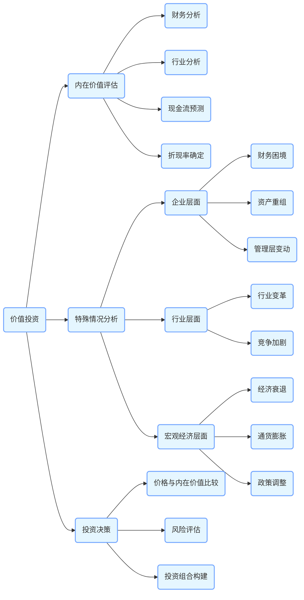

# 价值投资中的特殊情况分析

> 关键词：价值投资、特殊情况、财务困境、行业变革、宏观经济冲击、资产重组、突发事件

> 摘要：本文聚焦于价值投资中的特殊情况分析。价值投资作为一种经典的投资策略，旨在寻找被低估的资产以获取长期回报。然而，市场中存在各种特殊情况会对价值投资产生重大影响。文章将深入探讨这些特殊情况的类型、形成原因、对投资的影响机制，结合数学模型和实际案例进行详细分析，并给出应对策略，同时介绍相关的工具和资源，最后对价值投资在特殊情况下的未来发展趋势与挑战进行总结。

## 1. 背景介绍 
### 1.1 目的和范围
价值投资是一种基于对资产内在价值评估的投资方法，其核心思想是在资产价格低于其内在价值时买入，等待价格回归价值甚至超越价值时卖出以获取收益。然而，市场并非总是处于平稳和可预测的状态，存在许多特殊情况会干扰资产价值的正常判断和投资决策的执行。本文的目的在于全面分析价值投资中可能遇到的特殊情况，包括但不限于企业财务困境、行业变革、宏观经济冲击、资产重组以及突发事件等，探讨这些特殊情况对价值投资的影响，并提供相应的分析方法和应对策略。本文的范围涵盖了理论分析、数学模型构建、实际案例研究以及工具资源推荐等多个方面，旨在为投资者在面对价值投资中的特殊情况时提供全面而深入的指导。

### 1.2 预期读者
本文预期读者主要包括专业投资者、投资机构从业者、金融分析师、对价值投资感兴趣的个人投资者以及相关领域的研究人员。对于专业投资者和投资机构从业者，本文可以帮助他们在复杂多变的市场环境中更准确地识别和应对价值投资中的特殊情况，优化投资组合。金融分析师可以将本文的分析方法和思路应用于实际的研究工作中，提高对投资标的的评估准确性。个人投资者可以通过阅读本文加深对价值投资的理解，学习如何在特殊情况下做出更明智的投资决策。研究人员则可以从本文中获取相关的研究素材和理论依据，进一步拓展价值投资领域的研究。

### 1.3 文档结构概述
本文将按照以下结构进行阐述：首先介绍核心概念与联系，明确价值投资和特殊情况的定义及它们之间的相互关系，并通过文本示意图和 Mermaid 流程图进行直观展示。接着详细讲解核心算法原理和具体操作步骤，使用 Python 源代码实现相关的分析算法。然后引入数学模型和公式，对特殊情况进行量化分析，并通过具体例子进行说明。在项目实战部分，给出实际的代码案例并进行详细解释。之后探讨特殊情况在实际投资中的应用场景。再推荐相关的学习资源、开发工具框架以及论文著作。最后对价值投资在特殊情况下的未来发展趋势与挑战进行总结，并提供附录解答常见问题，同时列出扩展阅读和参考资料。

### 1.4 术语表
#### 1.4.1 核心术语定义
- **价值投资**：一种投资策略，通过对资产的内在价值进行评估，寻找价格低于内在价值的资产进行投资，以获取长期的资本增值。
- **特殊情况**：指在价值投资过程中，由于企业自身、行业环境、宏观经济等因素导致的偏离正常市场状态的情况，这些情况可能会对资产的价值评估和投资决策产生重大影响。
- **内在价值**：资产在未来所能产生的现金流的现值，是价值投资的核心评估指标。
- **财务困境**：企业由于经营不善、债务负担过重等原因导致财务状况恶化，面临偿债困难、盈利能力下降等问题。
- **行业变革**：由于技术创新、政策调整、市场需求变化等因素导致行业的竞争格局、商业模式、发展趋势等发生重大变化。

#### 1.4.2 相关概念解释
- **市场效率**：指市场价格反映资产内在价值的程度。在有效市场中，资产价格能够迅速准确地反映所有可用信息；而在特殊情况下，市场可能会出现失灵，价格与内在价值出现较大偏差。
- **风险溢价**：投资者为承担额外风险而要求的额外回报。在特殊情况下，由于不确定性增加，投资者通常会要求更高的风险溢价。
- **资产重组**：企业通过合并、分立、出售、置换等方式对资产进行重新组合，以优化资源配置、提高企业竞争力。

#### 1.4.3 缩略词列表
- **DCF**：Discounted Cash Flow，现金流折现法，一种常用的评估资产内在价值的方法。
- **PE**：Price-to-Earnings Ratio，市盈率，衡量股票价格相对盈利能力的指标。
- **PB**：Price-to-Book Ratio，市净率，衡量股票价格相对净资产的指标。

## 2. 核心概念与联系 

### 核心概念原理
价值投资的核心原理是基于资产的内在价值进行投资决策。内在价值是资产未来所能产生的现金流的现值，通过对企业的财务状况、行业前景、竞争优势等因素进行分析，评估企业未来的现金流，并使用适当的折现率将其折现到当前时刻，得到资产的内在价值。当资产的市场价格低于其内在价值时，投资者认为该资产被低估，具有投资价值；反之，当市场价格高于内在价值时，资产被高估，应避免投资。

特殊情况则是在价值投资过程中出现的偏离正常市场状态的情况。这些情况可能源于企业自身的问题，如财务困境、管理层变动等；也可能来自行业环境的变化，如行业变革、竞争加剧等；还可能受到宏观经济因素的影响，如经济衰退、通货膨胀等。特殊情况会对资产的内在价值和市场价格产生影响，使得价值投资的决策变得更加复杂。

### 架构的文本示意图
```plaintext
价值投资
|
|-- 内在价值评估
|   |-- 财务分析
|   |-- 行业分析
|   |-- 现金流预测
|   |-- 折现率确定
|
|-- 特殊情况分析
|   |-- 企业层面
|   |   |-- 财务困境
|   |   |-- 资产重组
|   |   |-- 管理层变动
|   |
|   |-- 行业层面
|   |   |-- 行业变革
|   |   |-- 竞争加剧
|   |
|   |-- 宏观经济层面
|   |   |-- 经济衰退
|   |   |-- 通货膨胀
|   |   |-- 政策调整
|
|-- 投资决策
|   |-- 价格与内在价值比较
|   |-- 风险评估
|   |-- 投资组合构建
```

### Mermaid 流程图


从流程图可以看出，价值投资主要包括内在价值评估、特殊情况分析和投资决策三个核心环节。内在价值评估是基础，通过各种分析方法确定资产的内在价值。特殊情况分析则是考虑各种可能影响资产价值的特殊因素。投资决策则是综合考虑内在价值和特殊情况，比较市场价格与内在价值，评估风险，最终构建投资组合。

## 3. 核心算法原理 & 具体操作步骤 

### 现金流折现法（DCF）原理
现金流折现法是评估资产内在价值的常用方法，其核心思想是将资产未来所能产生的现金流折现到当前时刻，得到资产的内在价值。具体公式为：

$$V = \sum_{t=1}^{n} \frac{CF_t}{(1 + r)^t} + \frac{TV}{(1 + r)^n}$$

其中，$V$ 表示资产的内在价值，$CF_t$ 表示第 $t$ 期的现金流，$r$ 表示折现率，$n$ 表示预测期数，$TV$ 表示终值。

### Python 实现 DCF 模型
```python
import numpy as np

def dcf_evaluation(cash_flows, discount_rate, terminal_value):
    """
    计算资产的内在价值
    :param cash_flows: 未来各期的现金流列表
    :param discount_rate: 折现率
    :param terminal_value: 终值
    :return: 资产的内在价值
    """
    n = len(cash_flows)
    present_values = []
    for t in range(n):
        present_value = cash_flows[t] / ((1 + discount_rate) ** (t + 1))
        present_values.append(present_value)
    terminal_present_value = terminal_value / ((1 + discount_rate) ** n)
    intrinsic_value = sum(present_values) + terminal_present_value
    return intrinsic_value

# 示例数据
cash_flows = [100, 120, 150, 180, 200]
discount_rate = 0.1
terminal_value = 2500

# 计算内在价值
intrinsic_value = dcf_evaluation(cash_flows, discount_rate, terminal_value)
print(f"资产的内在价值为: {intrinsic_value}")
```
### 具体操作步骤
1. **确定预测期数 $n$**：根据企业的发展阶段和行业特点，确定合理的预测期数。一般来说，对于成熟企业，可以预测 5 - 10 年的现金流；对于成长型企业，可以适当延长预测期。
2. **预测未来现金流 $CF_t$**：通过对企业的财务报表、行业前景、市场需求等因素进行分析，预测企业未来各期的现金流。可以采用历史数据分析法、行业类比法、专家预测法等方法进行预测。
3. **确定折现率 $r$**：折现率反映了投资者对投资风险的要求。一般来说，可以使用资本资产定价模型（CAPM）来确定折现率：

$$r = R_f + \beta \times (R_m - R_f)$$

其中，$R_f$ 表示无风险利率，$\beta$ 表示资产的系统性风险系数，$R_m$ 表示市场收益率。

4. **计算终值 $TV$**：终值是预测期结束后资产的价值。可以采用永续增长模型来计算终值：

$$TV = \frac{CF_{n+1}}{r - g}$$

其中，$CF_{n+1}$ 表示预测期结束后下一期的现金流，$g$ 表示永续增长率。

5. **计算内在价值 $V$**：将预测的现金流和终值代入 DCF 公式，计算资产的内在价值。

## 4. 数学模型和公式 & 详细讲解 & 举例说明 

### 市盈率模型
市盈率（PE）是衡量股票价格相对盈利能力的指标，其计算公式为：

$$PE = \frac{P}{E}$$

其中，$P$ 表示股票价格，$E$ 表示每股收益。

市盈率模型认为，股票的价格应该与其盈利能力成正比。在价值投资中，可以通过比较目标股票的市盈率与行业平均市盈率或历史市盈率，判断股票是否被低估或高估。

例如，某行业的平均市盈率为 20 倍，某股票的每股收益为 2 元，当前股价为 30 元，则该股票的市盈率为：

$$PE = \frac{30}{2} = 15$$

由于该股票的市盈率低于行业平均市盈率，可能被认为是被低估的股票。

### 市净率模型
市净率（PB）是衡量股票价格相对净资产的指标，其计算公式为：

$$PB = \frac{P}{BV}$$

其中，$P$ 表示股票价格，$BV$ 表示每股净资产。

市净率模型认为，股票的价格应该与其净资产成正比。在价值投资中，可以通过比较目标股票的市净率与行业平均市净率或历史市净率，判断股票是否被低估或高估。

例如，某行业的平均市净率为 2 倍，某股票的每股净资产为 10 元，当前股价为 15 元，则该股票的市净率为：

$$PB = \frac{15}{10} = 1.5$$

由于该股票的市净率低于行业平均市净率，可能被认为是被低估的股票。

### 资本资产定价模型（CAPM）
资本资产定价模型用于确定资产的预期收益率，其公式为：

$$E(R_i) = R_f + \beta_i \times (E(R_m) - R_f)$$

其中，$E(R_i)$ 表示资产 $i$ 的预期收益率，$R_f$ 表示无风险利率，$\beta_i$ 表示资产 $i$ 的系统性风险系数，$E(R_m)$ 表示市场收益率。

例如，无风险利率为 3%，市场收益率为 10%，某股票的 $\beta$ 值为 1.2，则该股票的预期收益率为：

$$E(R_i) = 3\% + 1.2 \times (10\% - 3\%) = 11.4\%$$

### 举例说明
假设我们要评估一家公司的股票价值。该公司的每股收益为 3 元，每股净资产为 15 元，行业平均市盈率为 18 倍，行业平均市净率为 2 倍。当前股票价格为 40 元。

1. **使用市盈率模型评估**：
根据市盈率模型，该股票的合理价格为：

$$P_{PE} = PE_{industry} \times E = 18 \times 3 = 54$$

由于当前股价 40 元低于合理价格 54 元，从市盈率模型来看，该股票被低估。

2. **使用市净率模型评估**：
根据市净率模型，该股票的合理价格为：

$$P_{PB} = PB_{industry} \times BV = 2 \times 15 = 30$$

由于当前股价 40 元高于合理价格 30 元，从市净率模型来看，该股票被高估。

综合考虑两个模型，我们需要进一步分析该公司的财务状况、行业前景等因素，以确定该股票的真实价值。

## 5. 项目实战：代码实际案例和详细解释说明 

### 5.1  开发环境搭建
在进行价值投资的数据分析和模型实现时，我们可以使用 Python 作为开发语言，并结合一些常用的数据分析库和工具。以下是搭建开发环境的步骤：

1. **安装 Python**：从 Python 官方网站（https://www.python.org/downloads/）下载并安装 Python 3.x 版本。
2. **安装必要的库**：使用以下命令安装必要的库：
```sh
pip install numpy pandas matplotlib scikit-learn
```
- `numpy`：用于进行数值计算。
- `pandas`：用于数据处理和分析。
- `matplotlib`：用于数据可视化。
- `scikit-learn`：用于机器学习和数据分析。

### 5.2  源代码详细实现和代码解读
以下是一个使用 Python 实现价值投资分析的完整代码示例，包括数据获取、财务指标计算、估值分析等步骤。

```python
import pandas as pd
import numpy as np
import matplotlib.pyplot as plt

# 模拟获取公司财务数据
data = {
    'Year': [2016, 2017, 2018, 2019, 2020],
    'Revenue': [1000, 1200, 1300, 1500, 1600],
    'NetIncome': [100, 120, 130, 150, 160],
    'TotalAssets': [800, 900, 1000, 1100, 1200],
    'TotalEquity': [500, 550, 600, 650, 700]
}
df = pd.DataFrame(data)

# 计算财务指标
df['ROE'] = df['NetIncome'] / df['TotalEquity']  # 净资产收益率
df['ROA'] = df['NetIncome'] / df['TotalAssets']  # 总资产收益率
df['EPS'] = df['NetIncome'] / 100  # 每股收益（假设总股本为 100）

# 绘制财务指标变化趋势图
plt.figure(figsize=(12, 6))
plt.subplot(1, 3, 1)
plt.plot(df['Year'], df['ROE'])
plt.title('ROE Trend')
plt.xlabel('Year')
plt.ylabel('ROE')

plt.subplot(1, 3, 2)
plt.plot(df['Year'], df['ROA'])
plt.title('ROA Trend')
plt.xlabel('Year')
plt.ylabel('ROA')

plt.subplot(1, 3, 3)
plt.plot(df['Year'], df['EPS'])
plt.title('EPS Trend')
plt.xlabel('Year')
plt.ylabel('EPS')

plt.tight_layout()
plt.show()

# 假设当前股价为 20 元，计算市盈率和市净率
current_price = 20
latest_eps = df['EPS'].iloc[-1]
latest_equity = df['TotalEquity'].iloc[-1]
shares_outstanding = 100
book_value_per_share = latest_equity / shares_outstanding

pe_ratio = current_price / latest_eps
pb_ratio = current_price / book_value_per_share

print(f"当前市盈率: {pe_ratio}")
print(f"当前市净率: {pb_ratio}")

# 假设行业平均市盈率为 18，行业平均市净率为 2，进行估值分析
if pe_ratio < 18:
    print("从市盈率来看，该股票可能被低估。")
else:
    print("从市盈率来看，该股票可能被高估。")

if pb_ratio < 2:
    print("从市净率来看，该股票可能被低估。")
else:
    print("从市净率来看，该股票可能被高估。")
```

### 5.3  代码解读与分析
1. **数据获取与处理**：
    - 使用字典模拟获取公司的财务数据，包括年度、营业收入、净利润、总资产和总权益等信息。
    - 将数据转换为 Pandas 的 DataFrame 格式，方便进行数据处理和分析。

2. **财务指标计算**：
    - 计算净资产收益率（ROE）、总资产收益率（ROA）和每股收益（EPS）等重要财务指标。这些指标可以反映公司的盈利能力和经营效率。

3. **数据可视化**：
    - 使用 Matplotlib 库绘制财务指标的变化趋势图，直观地展示公司的财务状况随时间的变化情况。

4. **估值分析**：
    - 假设当前股价为 20 元，计算该股票的市盈率和市净率。
    - 将计算得到的市盈率和市净率与行业平均水平进行比较，判断该股票是否被低估或高估。

通过以上代码，我们可以对一家公司进行初步的价值投资分析，了解其财务状况和估值水平。

## 6. 实际应用场景 
### 企业财务困境中的价值投资
当企业面临财务困境时，其股价往往会大幅下跌，市场对其前景持悲观态度。然而，对于价值投资者来说，这可能是一个潜在的投资机会。例如，一家公司由于短期的经营困难导致业绩下滑，但公司的核心业务仍然具有竞争力，且资产负债表相对健康。此时，价值投资者可以通过深入分析公司的财务状况和业务前景，评估其内在价值。如果发现公司的内在价值远高于当前股价，并且有迹象表明公司能够摆脱困境，那么就可以考虑买入该股票。

### 行业变革中的价值投资
行业变革是价值投资中常见的特殊情况。例如，随着科技的发展，传统行业可能会受到新兴技术的冲击，导致行业格局发生变化。在这种情况下，一些传统企业可能会面临困境，但也有一些企业能够积极转型，适应新的市场环境。价值投资者需要密切关注行业变革的趋势，分析企业的转型能力和发展潜力。对于那些能够成功转型并在新的行业格局中占据优势的企业，即使其当前股价可能受到行业变革的影响而下跌，但从长期来看，可能具有较高的投资价值。

### 宏观经济冲击下的价值投资
宏观经济冲击如经济衰退、通货膨胀等会对整个市场产生影响。在经济衰退期间，大多数企业的业绩都会受到影响，股价普遍下跌。然而，一些具有较强抗风险能力和稳定现金流的企业，如消费必需品行业的企业，可能受到的影响相对较小。价值投资者可以在宏观经济冲击期间，寻找那些被市场过度抛售但内在价值仍然较高的企业进行投资。当经济复苏时，这些企业的股价可能会率先反弹，为投资者带来丰厚的回报。

### 资产重组中的价值投资
企业的资产重组活动，如合并、分立、收购等，也会对价值投资产生影响。在资产重组过程中，企业的资产结构、业务范围和盈利能力可能会发生重大变化。价值投资者需要仔细分析资产重组的方案和影响，评估重组后企业的内在价值。如果资产重组能够实现资源的优化配置，提高企业的竞争力和盈利能力，那么相关企业的股票可能具有投资价值。

### 突发事件中的价值投资
突发事件如自然灾害、公共卫生事件、政策调整等会对市场造成短期的冲击。例如，新冠疫情的爆发导致全球股市大幅下跌，但也为价值投资者带来了一些机会。一些受疫情影响较小但股价被过度打压的企业，如电商、在线教育等行业的企业，在疫情期间反而迎来了发展机遇。价值投资者可以在突发事件发生后，冷静分析事件对企业的长期影响，寻找被错杀的优质企业进行投资。

## 7. 工具和资源推荐
### 7.1 学习资源推荐
#### 7.1.1 书籍推荐
- 《聪明的投资者》（The Intelligent Investor）：本杰明·格雷厄姆（Benjamin Graham）著，被誉为价值投资的圣经，详细阐述了价值投资的理念和方法。
- 《证券分析》（Security Analysis）：本杰明·格雷厄姆和大卫·多德（David Dodd）著，是价值投资领域的经典著作，对证券分析的基本原理和方法进行了系统的介绍。
- 《巴菲特致股东的信：股份公司教程》（Letters to Shareholders of Berkshire Hathaway）：沃伦·巴菲特（Warren Buffett）著，通过巴菲特致股东的信，展示了他的投资哲学和策略。

#### 7.1.2 在线课程
- Coursera 上的“投资学原理”（Principles of Investing）：由哥伦比亚大学教授授课，涵盖了投资的基本概念、资产定价、投资组合管理等内容。
- edX 上的“金融市场”（Financial Markets）：由耶鲁大学教授罗伯特·席勒（Robert Shiller）授课，介绍了金融市场的运作机制和投资策略。

#### 7.1.3 技术博客和网站
- Seeking Alpha：提供专业的投资分析和研究报告，涵盖了股票、债券、基金等多个领域。
- ValueWalk：专注于价值投资领域，分享价值投资者的观点和研究成果。
- 雪球：国内知名的投资社区，投资者可以在上面交流投资经验、分享研究报告。

### 7.2 开发工具框架推荐
#### 7.2.1 IDE和编辑器
- PyCharm：一款专业的 Python 集成开发环境，提供了丰富的代码编辑、调试和分析功能。
- Jupyter Notebook：一种交互式的开发环境，适合进行数据分析和模型开发，支持代码、文本、图表等多种形式的展示。

#### 7.2.2 调试和性能分析工具
- Py-Spy：一个轻量级的 Python 性能分析工具，可以实时监测 Python 程序的性能瓶颈。
- pdb：Python 内置的调试器，方便进行代码调试和问题排查。

#### 7.2.3 相关框架和库
- Pandas：用于数据处理和分析，提供了高效的数据结构和数据操作方法。
- NumPy：用于进行数值计算，提供了强大的数组和矩阵运算功能。
- Matplotlib：用于数据可视化，支持多种图表类型的绘制。

### 7.3 相关论文著作推荐
#### 7.3.1 经典论文
- “The Arbitrage Pricing Theory of Capital Asset Pricing”：斯蒂芬·罗斯（Stephen Ross）著，提出了套利定价理论，为资产定价提供了新的视角。
- “Efficient Capital Markets: A Review of Theory and Empirical Work”：尤金·法玛（Eugene F. Fama）著，对有效市场假说进行了系统的阐述和实证研究。

#### 7.3.2 最新研究成果
- 关注顶级金融学术期刊如《Journal of Finance》《Review of Financial Studies》等，了解价值投资领域的最新研究动态。

#### 7.3.3 应用案例分析
- 可以参考一些专业的投资研究机构发布的研究报告，了解价值投资在实际案例中的应用和分析方法。

## 8. 总结：未来发展趋势与挑战
### 未来发展趋势
1. **数据驱动的价值投资**：随着大数据、人工智能等技术的发展，价值投资将越来越依赖于数据的分析和挖掘。投资者可以利用海量的财务数据、市场数据和非结构化数据，通过机器学习和深度学习算法，更准确地评估资产的内在价值和风险。
2. **跨学科融合**：价值投资将与经济学、金融学、统计学、计算机科学等多个学科进行深度融合。投资者需要具备更广泛的知识和技能，才能在复杂多变的市场环境中做出准确的投资决策。
3. **社会责任投资的兴起**：越来越多的投资者开始关注企业的社会责任和可持续发展。在价值投资中，将企业的环境、社会和治理（ESG）因素纳入评估体系，寻找具有良好社会形象和可持续发展能力的企业进行投资，将成为未来的发展趋势。
4. **全球一体化投资**：随着全球经济的一体化和金融市场的互联互通，价值投资者将有更多的机会在全球范围内寻找投资标的。同时，也需要考虑不同国家和地区的政治、经济、文化等因素对投资的影响。

### 挑战
1. **市场不确定性增加**：全球政治经济环境的不确定性不断增加，如贸易摩擦、地缘政治冲突、气候变化等，这些因素将对市场产生重大影响，增加了价值投资的难度和风险。
2. **技术变革带来的挑战**：虽然技术的发展为价值投资带来了新的机遇，但也带来了一些挑战。例如，人工智能和机器学习算法的复杂性可能导致模型的解释性和可靠性受到质疑，投资者需要具备更高的技术水平来理解和应用这些技术。
3. **信息过载**：在信息爆炸的时代，投资者面临着海量的信息，如何从这些信息中筛选出有价值的信息，并进行准确的分析和判断，是一个巨大的挑战。
4. **投资者情绪的影响**：投资者情绪在市场中起着重要的作用，情绪的波动可能导致市场价格的过度波动，使得价值投资的决策更加困难。投资者需要具备良好的心理素质和情绪管理能力，避免受到情绪的影响。

## 9. 附录：常见问题与解答
### 1. 价值投资是否适合所有投资者？
价值投资并不适合所有投资者。价值投资需要投资者具备一定的财务知识和分析能力，能够对企业的内在价值进行评估。同时，价值投资通常是一种长期投资策略，需要投资者有耐心和定力，能够承受市场的短期波动。对于那些追求短期高收益、风险承受能力较低的投资者来说，价值投资可能并不是最佳选择。

### 2. 如何确定资产的内在价值？
确定资产的内在价值是价值投资的核心问题。常用的方法包括现金流折现法（DCF）、市盈率模型、市净率模型等。这些方法都需要对企业的财务状况、行业前景、市场需求等因素进行分析和预测。在实际应用中，需要综合考虑多种因素，并结合自己的判断和经验来确定资产的内在价值。

### 3. 特殊情况对价值投资的影响是短期还是长期的？
特殊情况对价值投资的影响可能是短期的，也可能是长期的。一些突发事件如自然灾害、政策调整等可能会对市场造成短期的冲击，但这种影响通常是暂时的，市场会在短期内恢复正常。而一些行业变革、企业财务困境等特殊情况可能会对企业的长期发展产生影响，需要投资者进行深入的分析和评估。

### 4. 如何应对价值投资中的特殊情况？
应对价值投资中的特殊情况需要投资者具备敏锐的洞察力和分析能力。首先，要及时关注市场动态和企业信息，了解特殊情况的发生和发展。其次，要对特殊情况进行深入的分析，评估其对企业内在价值和市场价格的影响。最后，根据分析结果，调整投资策略和投资组合，以降低风险，提高收益。

## 10. 扩展阅读 & 参考资料
1. 《金融炼金术》（The Alchemy of Finance），乔治·索罗斯（George Soros）著
2. 《彼得·林奇的成功投资》（One Up On Wall Street），彼得·林奇（Peter Lynch）著
3. “The Capital Asset Pricing Model: Theory and Evidence”，John Y. Campbell 等著
4. 中国证券监督管理委员会官方网站（https://www.csrc.gov.cn/）
5. 美国证券交易委员会官方网站（https://www.sec.gov/）

作者：AI天才研究院/AI Genius Institute & 禅与计算机程序设计艺术 /Zen And The Art of Computer Programming