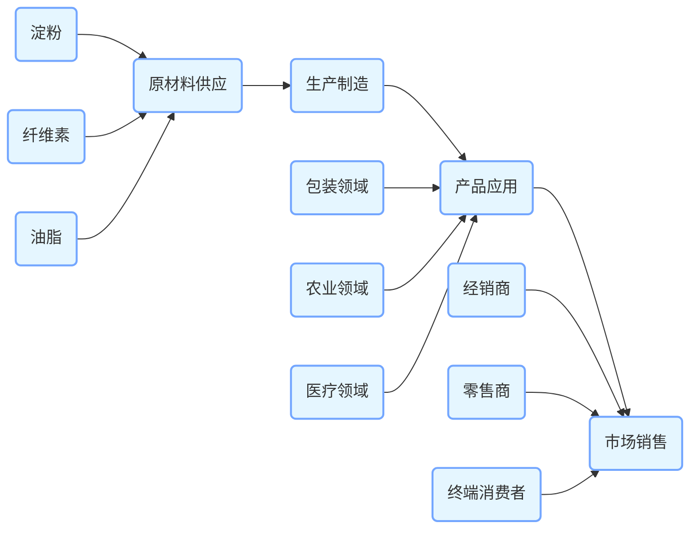

# 价值投资中的生物塑料产业链分析

> 关键词：价值投资、生物塑料、产业链分析、市场趋势、投资机会

> 摘要：本文聚焦于价值投资视角下的生物塑料产业链分析。首先介绍了生物塑料的背景知识，包括其目的和范围、预期读者以及文档结构等。接着阐述了生物塑料的核心概念与联系，详细讲解了核心算法原理和具体操作步骤，通过数学模型和公式进一步深入剖析。在项目实战部分，给出代码实际案例并进行详细解释。分析了生物塑料的实际应用场景，推荐了相关的工具和资源。最后总结了生物塑料产业链的未来发展趋势与挑战，解答了常见问题，并提供了扩展阅读和参考资料，旨在为价值投资者全面了解生物塑料产业链提供有价值的信息和决策依据。

## 1. 背景介绍 
### 1.1 目的和范围
在当今环保意识日益增强、传统塑料污染问题愈发严峻的背景下，生物塑料作为一种可持续的替代材料逐渐受到广泛关注。本文的目的在于从价值投资的角度，全面深入地分析生物塑料产业链，涵盖产业链的各个环节，包括原材料供应、生产制造、产品应用以及市场销售等，以帮助投资者识别产业链中的投资机会和潜在风险，为价值投资决策提供科学依据。

### 1.2 预期读者
本文主要面向对价值投资感兴趣的投资者，包括个人投资者、机构投资者等。同时，也适用于从事生物塑料相关行业的企业管理者、技术研发人员以及关注环保和可持续发展领域的研究人员，帮助他们更好地了解生物塑料产业链的整体情况和发展趋势。

### 1.3 文档结构概述
本文将按照以下结构进行阐述：首先介绍生物塑料的核心概念与联系，通过文本示意图和 Mermaid 流程图直观展示其原理和架构；接着详细讲解核心算法原理和具体操作步骤，并结合 Python 源代码进行说明；然后运用数学模型和公式对生物塑料产业链进行量化分析，并举例说明；在项目实战部分，给出代码实际案例并进行详细解释；分析生物塑料的实际应用场景；推荐相关的工具和资源，包括学习资源、开发工具框架和相关论文著作；最后总结生物塑料产业链的未来发展趋势与挑战，解答常见问题，并提供扩展阅读和参考资料。

### 1.4 术语表
#### 1.4.1 核心术语定义
- **生物塑料**：是指以可再生生物质为原料，通过生物发酵、化学合成等方法制成的塑料材料，具有可生物降解、可再生等特点。
- **价值投资**：是一种投资策略，强调通过对资产的内在价值进行评估，寻找被低估的投资标的，以获取长期稳定的投资回报。
- **产业链**：是指各个产业部门之间基于一定的技术经济关联，并依据特定的逻辑关系和时空布局关系客观形成的链条式关联关系形态。

#### 1.4.2 相关概念解释
- **可再生生物质**：是指通过光合作用而形成的各种有机体，包括植物、动物和微生物等，这些生物质可以在自然环境中不断再生。
- **可生物降解**：是指材料在自然环境中，通过微生物的作用逐渐分解为二氧化碳、水和其他无害物质的过程。

#### 1.4.3 缩略词列表
- **PHA**：聚羟基脂肪酸酯（Polyhydroxyalkanoates）
- **PLA**：聚乳酸（Polylactic Acid）
- **PBAT**：聚己二酸/对苯二甲酸丁二酯（Poly(butylene adipate-co-terephthalate)）

## 2. 核心概念与联系 
生物塑料产业链主要包括原材料供应、生产制造、产品应用和市场销售四个核心环节，各环节之间相互关联、相互影响，形成一个有机的整体。

### 文本示意图
```plaintext
生物塑料产业链
|-- 原材料供应
|   |-- 可再生生物质
|       |-- 淀粉
|       |-- 纤维素
|       |-- 油脂
|-- 生产制造
|   |-- 生物发酵
|   |-- 化学合成
|   |-- 加工成型
|-- 产品应用
|   |-- 包装领域
|   |-- 农业领域
|   |-- 医疗领域
|-- 市场销售
|   |-- 经销商
|   |-- 零售商
|   |-- 终端消费者
```

### Mermaid 流程图


从流程图可以看出，原材料供应是生物塑料产业链的基础，为生产制造提供必要的物质基础；生产制造环节将原材料转化为生物塑料产品；产品应用环节决定了生物塑料的市场需求和发展前景；市场销售环节则将产品推向终端消费者，实现产业链的价值循环。

## 3. 核心算法原理 & 具体操作步骤 
### 核心算法原理
在生物塑料产业链分析中，我们可以使用成本 - 收益分析算法来评估投资项目的可行性和价值。该算法的核心思想是通过比较项目的总成本和总收益，计算出项目的净现值（NPV）和内部收益率（IRR），从而判断项目是否值得投资。

### 具体操作步骤
以下是使用 Python 实现成本 - 收益分析算法的详细步骤：

```python
import numpy as np
from scipy.optimize import newton

def calculate_npv(initial_investment, cash_flows, discount_rate):
    """
    计算净现值（NPV）
    :param initial_investment: 初始投资
    :param cash_flows: 每年的现金流量
    :param discount_rate: 折现率
    :return: 净现值
    """
    npv = -initial_investment
    for i, cash_flow in enumerate(cash_flows):
        npv += cash_flow / ((1 + discount_rate) ** (i + 1))
    return npv

def calculate_irr(initial_investment, cash_flows):
    """
    计算内部收益率（IRR）
    :param initial_investment: 初始投资
    :param cash_flows: 每年的现金流量
    :return: 内部收益率
    """
    def npv_func(irr):
        return calculate_npv(initial_investment, cash_flows, irr)
    try:
        irr = newton(npv_func, 0.1)
        return irr
    except RuntimeError:
        return None

# 示例数据
initial_investment = 1000000  # 初始投资
cash_flows = [200000, 300000, 400000, 500000, 600000]  # 每年的现金流量
discount_rate = 0.1  # 折现率

# 计算净现值
npv = calculate_npv(initial_investment, cash_flows, discount_rate)
print(f"净现值（NPV）: {npv}")

# 计算内部收益率
irr = calculate_irr(initial_investment, cash_flows)
if irr is not None:
    print(f"内部收益率（IRR）: {irr * 100:.2f}%")
else:
    print("无法计算内部收益率")
```

### 代码解释
1. **calculate_npv 函数**：该函数接受初始投资、每年的现金流量和折现率作为输入，通过循环计算每年现金流量的现值，并将其累加得到净现值。
2. **calculate_irr 函数**：该函数接受初始投资和每年的现金流量作为输入，使用 `scipy.optimize.newton` 方法求解净现值为 0 时的折现率，即内部收益率。
3. **示例数据**：定义了初始投资、每年的现金流量和折现率，并调用 `calculate_npv` 和 `calculate_irr` 函数计算净现值和内部收益率。

## 4. 数学模型和公式 & 详细讲解 & 举例说明 
### 净现值（NPV）公式
净现值是指投资项目在未来各期现金流量的现值之和减去初始投资后的余额，其计算公式为：

$$NPV = -I_0 + \sum_{t=1}^{n} \frac{CF_t}{(1 + r)^t}$$

其中，$NPV$ 表示净现值，$I_0$ 表示初始投资，$CF_t$ 表示第 $t$ 期的现金流量，$r$ 表示折现率，$n$ 表示投资项目的寿命期。

### 内部收益率（IRR）公式
内部收益率是指使投资项目的净现值等于 0 的折现率，即满足以下方程的 $r$ 值：

$$-I_0 + \sum_{t=1}^{n} \frac{CF_t}{(1 + IRR)^t} = 0$$

### 详细讲解
净现值是评估投资项目是否可行的重要指标之一。如果净现值大于 0，则说明投资项目的收益大于成本，项目值得投资；如果净现值小于 0，则说明投资项目的收益小于成本，项目不值得投资；如果净现值等于 0，则说明投资项目的收益等于成本，项目处于盈亏平衡状态。

内部收益率是另一个重要的评估指标，它反映了投资项目的实际收益率。如果内部收益率大于投资者要求的最低收益率，则说明投资项目的实际收益率高于投资者的期望，项目值得投资；如果内部收益率小于投资者要求的最低收益率，则说明投资项目的实际收益率低于投资者的期望，项目不值得投资。

### 举例说明
假设一个生物塑料投资项目的初始投资为 100 万元，预计未来 5 年的现金流量分别为 20 万元、30 万元、40 万元、50 万元和 60 万元，投资者要求的最低收益率为 10%。

- **计算净现值**：
将上述数据代入净现值公式，可得：

$$NPV = -100 + \frac{20}{(1 + 0.1)^1} + \frac{30}{(1 + 0.1)^2} + \frac{40}{(1 + 0.1)^3} + \frac{50}{(1 + 0.1)^4} + \frac{60}{(1 + 0.1)^5} \approx 52.34 \text{（万元）}$$

由于净现值大于 0，说明该投资项目值得投资。

- **计算内部收益率**：
使用 Python 代码计算内部收益率，可得：

```python
initial_investment = 1000000
cash_flows = [200000, 300000, 400000, 500000, 600000]
irr = calculate_irr(initial_investment, cash_flows)
if irr is not None:
    print(f"内部收益率（IRR）: {irr * 100:.2f}%")
else:
    print("无法计算内部收益率")
```

运行上述代码，可得内部收益率约为 23.38%。由于内部收益率大于投资者要求的最低收益率 10%，说明该投资项目的实际收益率高于投资者的期望，项目值得投资。

## 5. 项目实战：代码实际案例和详细解释说明 
### 5.1  开发环境搭建
在进行生物塑料产业链分析的项目实战之前，需要搭建相应的开发环境。以下是具体的搭建步骤：

1. **安装 Python**：从 Python 官方网站（https://www.python.org/downloads/）下载并安装 Python 3.x 版本。
2. **安装必要的库**：使用以下命令安装 `numpy` 和 `scipy` 库：
```sh
pip install numpy scipy
```

### 5.2  源代码详细实现和代码解读
以下是一个完整的生物塑料投资项目分析的 Python 代码示例：

```python
import numpy as np
from scipy.optimize import newton

def calculate_npv(initial_investment, cash_flows, discount_rate):
    """
    计算净现值（NPV）
    :param initial_investment: 初始投资
    :param cash_flows: 每年的现金流量
    :param discount_rate: 折现率
    :return: 净现值
    """
    npv = -initial_investment
    for i, cash_flow in enumerate(cash_flows):
        npv += cash_flow / ((1 + discount_rate) ** (i + 1))
    return npv

def calculate_irr(initial_investment, cash_flows):
    """
    计算内部收益率（IRR）
    :param initial_investment: 初始投资
    :param cash_flows: 每年的现金流量
    :return: 内部收益率
    """
    def npv_func(irr):
        return calculate_npv(initial_investment, cash_flows, irr)
    try:
        irr = newton(npv_func, 0.1)
        return irr
    except RuntimeError:
        return None

def analyze_bioplastic_project(initial_investment, cash_flows, discount_rate):
    """
    分析生物塑料投资项目
    :param initial_investment: 初始投资
    :param cash_flows: 每年的现金流量
    :param discount_rate: 折现率
    """
    npv = calculate_npv(initial_investment, cash_flows, discount_rate)
    irr = calculate_irr(initial_investment, cash_flows)

    print(f"初始投资: {initial_investment} 元")
    print(f"每年现金流量: {cash_flows} 元")
    print(f"折现率: {discount_rate * 100}%")
    print(f"净现值（NPV）: {npv:.2f} 元")
    if irr is not None:
        print(f"内部收益率（IRR）: {irr * 100:.2f}%")
    else:
        print("无法计算内部收益率")

    if npv > 0 and (irr is not None and irr > discount_rate):
        print("该生物塑料投资项目值得投资。")
    else:
        print("该生物塑料投资项目不值得投资。")

# 示例数据
initial_investment = 1000000  # 初始投资
cash_flows = [200000, 300000, 400000, 500000, 600000]  # 每年的现金流量
discount_rate = 0.1  # 折现率

# 分析生物塑料投资项目
analyze_bioplastic_project(initial_investment, cash_flows, discount_rate)
```

### 5.3  代码解读与分析
1. **calculate_npv 函数**：该函数用于计算净现值，通过循环计算每年现金流量的现值，并将其累加得到净现值。
2. **calculate_irr 函数**：该函数用于计算内部收益率，使用 `scipy.optimize.newton` 方法求解净现值为 0 时的折现率。
3. **analyze_bioplastic_project 函数**：该函数用于分析生物塑料投资项目，调用 `calculate_npv` 和 `calculate_irr` 函数计算净现值和内部收益率，并根据计算结果判断项目是否值得投资。
4. **示例数据**：定义了初始投资、每年的现金流量和折现率，并调用 `analyze_bioplastic_project` 函数分析生物塑料投资项目。

## 6. 实际应用场景 
生物塑料具有可生物降解、可再生等优点，在多个领域具有广泛的应用前景。

### 包装领域
生物塑料可以用于制造各种包装材料，如食品包装、化妆品包装、电子产品包装等。与传统塑料包装相比，生物塑料包装具有更好的环保性能，可以减少对环境的污染。例如，聚乳酸（PLA）是一种常用的生物塑料，它可以用于制造一次性餐具、饮料瓶等包装产品。

### 农业领域
生物塑料在农业领域也有重要的应用，如农膜、育苗钵等。传统的农膜难以降解，会对土壤环境造成污染，而生物塑料农膜可以在自然环境中逐渐降解，不会对土壤造成污染。此外，生物塑料育苗钵可以提高幼苗的成活率，减少对环境的影响。

### 医疗领域
生物塑料在医疗领域具有独特的优势，如可吸收缝合线、组织工程支架等。可吸收缝合线可以在伤口愈合后自动降解，无需拆线，减少了患者的痛苦。组织工程支架可以为细胞的生长和组织的修复提供支撑，促进组织的再生。

### 汽车工业领域
生物塑料可以用于汽车内饰件、外饰件等的制造。与传统塑料相比，生物塑料具有更好的轻量化性能和环保性能，可以降低汽车的能耗和排放。例如，聚羟基脂肪酸酯（PHA）可以用于制造汽车仪表盘、座椅等内饰件。

## 7. 工具和资源推荐
### 7.1 学习资源推荐
#### 7.1.1 书籍推荐
- 《生物塑料：材料科学与工程》：本书全面介绍了生物塑料的材料科学、制备工艺、性能特点和应用领域，是一本系统学习生物塑料的权威著作。
- 《价值投资：从格雷厄姆到巴菲特》：本书详细阐述了价值投资的理论和方法，通过案例分析介绍了如何运用价值投资策略进行投资决策。

#### 7.1.2 在线课程
- Coursera 上的“生物塑料技术与应用”课程：该课程由知名高校的教授授课，内容涵盖生物塑料的基础知识、制备技术、应用案例等方面。
- Udemy 上的“价值投资实战技巧”课程：该课程结合实际案例，介绍了价值投资的分析方法和投资策略。

#### 7.1.3 技术博客和网站
- 生物降解塑料网（https://www.bioplastics.cn/）：该网站提供了生物塑料行业的最新资讯、技术动态、市场分析等内容。
- 雪球网（https://xueqiu.com/）：该网站是一个投资交流平台，提供了丰富的价值投资案例和分析文章。

### 7.2 开发工具框架推荐
#### 7.2.1 IDE和编辑器
- PyCharm：是一款专业的 Python 集成开发环境，具有代码编辑、调试、代码分析等功能，适合生物塑料产业链分析项目的开发。
- Jupyter Notebook：是一个基于网页的交互式开发环境，支持 Python 代码的编写、运行和可视化展示，方便进行数据分析和模型验证。

#### 7.2.2 调试和性能分析工具
- PDB：是 Python 自带的调试工具，可以帮助开发者定位代码中的错误和问题。
- cProfile：是 Python 的性能分析工具，可以分析代码的运行时间和函数调用情况，帮助开发者优化代码性能。

#### 7.2.3 相关框架和库
- Pandas：是一个强大的数据处理和分析库，提供了丰富的数据结构和数据操作方法，适合生物塑料产业链数据分析。
- Matplotlib：是一个用于数据可视化的 Python 库，可以绘制各种类型的图表，如折线图、柱状图、散点图等，方便展示数据分析结果。

### 7.3 相关论文著作推荐
#### 7.3.1 经典论文
- “Biodegradable Polymers for Sustainable Development”：该论文介绍了生物降解塑料的发展现状、制备方法和应用前景，是生物塑料领域的经典论文之一。
- “Value Investing: The Use of Historical Financial Statement Information to Separate Winners from Losers”：该论文阐述了价值投资的理论基础和分析方法，对价值投资者具有重要的参考价值。

#### 7.3.2 最新研究成果
- 关注《Nature》、《Science》、《Advanced Materials》等国际顶级学术期刊，这些期刊经常发表生物塑料领域的最新研究成果。
- 参加国际生物塑料学术会议，如 International Conference on Bioplastics，了解生物塑料领域的最新研究动态。

#### 7.3.3 应用案例分析
- 《生物塑料在包装领域的应用案例分析》：该报告通过实际案例介绍了生物塑料在包装领域的应用情况和优势，为生物塑料在包装领域的推广提供了参考。
- 《价值投资在生物塑料行业的成功案例研究》：该研究分析了价值投资在生物塑料行业的成功案例，总结了投资经验和策略。

## 8. 总结：未来发展趋势与挑战
### 未来发展趋势
- **市场需求持续增长**：随着环保意识的不断提高和政府对塑料污染治理的加强，生物塑料的市场需求将持续增长。特别是在包装、农业、医疗等领域，生物塑料的应用前景广阔。
- **技术创新不断推进**：生物塑料领域的技术创新将不断推进，新型生物塑料材料的研发和制备技术将不断提高。例如，通过基因工程技术可以培育出高产、优质的生物塑料生产菌株，提高生物塑料的生产效率和质量。
- **产业整合加速**：生物塑料产业链将不断整合，上下游企业之间的合作将更加紧密。大型企业将通过并购、重组等方式扩大规模，提高市场竞争力。

### 挑战
- **成本较高**：目前，生物塑料的生产成本相对较高，主要原因是原材料价格较高、生产工艺复杂等。降低生物塑料的生产成本是生物塑料产业发展的关键。
- **性能有待提高**：与传统塑料相比，生物塑料的某些性能还存在一定的差距，如力学性能、耐热性能等。提高生物塑料的性能是生物塑料产业发展的重要任务。
- **标准和认证体系不完善**：目前，生物塑料的标准和认证体系还不完善，导致市场上生物塑料产品的质量参差不齐。建立健全生物塑料的标准和认证体系是生物塑料产业健康发展的保障。

## 9. 附录：常见问题与解答
### 问题 1：生物塑料是否完全可生物降解？
解答：并非所有的生物塑料都完全可生物降解。生物塑料分为可生物降解生物塑料和不可生物降解生物塑料。可生物降解生物塑料在自然环境中可以通过微生物的作用逐渐分解为二氧化碳、水和其他无害物质；而不可生物降解生物塑料虽然以可再生生物质为原料，但在自然环境中难以降解。

### 问题 2：生物塑料的生产成本为什么较高？
解答：生物塑料的生产成本较高主要有以下原因：一是原材料价格较高，生物塑料的原材料主要是可再生生物质，其种植、收获和加工成本相对较高；二是生产工艺复杂，生物塑料的生产需要经过生物发酵、化学合成等多个环节，生产过程中的设备投资和运行成本较高；三是生产规模较小，目前生物塑料的生产规模相对较小，难以实现规模经济，导致单位生产成本较高。

### 问题 3：价值投资在生物塑料产业链中的应用有哪些？
解答：价值投资在生物塑料产业链中的应用主要包括以下几个方面：一是寻找被低估的生物塑料企业进行投资，通过分析企业的财务状况、市场竞争力、技术创新能力等因素，评估企业的内在价值，选择具有投资价值的企业；二是关注生物塑料产业链中的关键环节和核心技术，投资掌握关键技术和核心资源的企业，以获取长期稳定的投资回报；三是通过投资生物塑料产业基金等方式，间接参与生物塑料产业链的投资，分散投资风险。

## 10. 扩展阅读 & 参考资料
### 扩展阅读
- 《循环经济与生物塑料》：本书介绍了循环经济的理念和生物塑料在循环经济中的作用，为生物塑料的可持续发展提供了新的思路。
- 《投资心理学》：了解投资心理学可以帮助投资者更好地控制情绪，做出理性的投资决策，对于价值投资在生物塑料产业链中的应用具有重要的指导意义。

### 参考资料
- 相关行业报告：如《全球生物塑料市场研究报告》、《中国生物塑料产业发展白皮书》等，这些报告提供了生物塑料行业的市场规模、发展趋势、竞争格局等方面的信息。
- 学术论文：查阅生物塑料领域的学术论文，了解生物塑料的最新研究成果和技术进展。
- 企业年报和公告：关注生物塑料相关企业的年报和公告，了解企业的经营状况、财务状况和发展战略。

作者：AI天才研究院/AI Genius Institute & 禅与计算机程序设计艺术 /Zen And The Art of Computer Programming