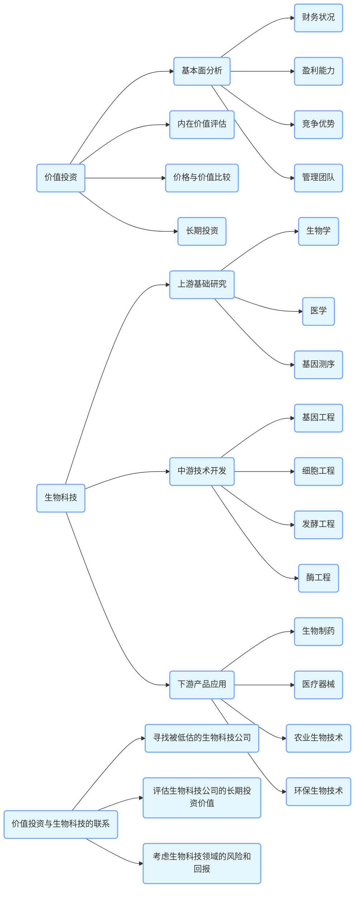

# 价值投资中的生物科技机会

> 关键词：价值投资、生物科技、投资机会、医疗创新、生物技术、医药行业、长期投资

> 摘要：本文聚焦于价值投资领域中的生物科技机会。首先介绍价值投资和生物科技的背景知识，深入剖析生物科技领域的核心概念与内在联系。接着阐述生物科技相关的核心算法原理及操作步骤，用数学模型和公式辅助理解其发展规律。通过项目实战案例，详细解读生物科技投资的代码实现与分析。探讨生物科技在不同场景下的实际应用，推荐相关学习资源、开发工具框架和论文著作。最后总结生物科技价值投资的未来发展趋势与挑战，解答常见问题并提供扩展阅读与参考资料，旨在为投资者全面呈现价值投资中生物科技的机会与前景。

## 1. 背景介绍 
### 1.1 目的和范围
在当今投资领域，价值投资一直是众多投资者遵循的重要理念。而生物科技作为一个充满潜力和创新的领域，正逐渐成为价值投资的热门方向。本文的目的在于深入探讨价值投资与生物科技的结合点，挖掘生物科技领域中具有长期投资价值的机会。范围涵盖生物科技的各个细分领域，包括基因治疗、生物制药、医疗器械、医疗信息化等，分析其市场现状、发展趋势以及投资价值。

### 1.2 预期读者
本文预期读者包括对价值投资感兴趣的个人投资者、专业投资机构的分析师和投资经理、生物科技行业的从业者以及对新兴科技投资趋势关注的研究人员。通过阅读本文，读者能够更全面地了解生物科技领域的投资机会，掌握相关的分析方法和技术，为投资决策提供参考。

### 1.3 文档结构概述
本文首先介绍背景知识，包括价值投资和生物科技的基本概念和发展现状。接着深入探讨生物科技的核心概念与联系，分析其内在的技术原理和产业逻辑。然后阐述核心算法原理和具体操作步骤，用数学模型和公式进行量化分析。通过项目实战案例，详细展示生物科技投资的实际操作和代码实现。探讨生物科技的实际应用场景，推荐相关的学习资源、开发工具框架和论文著作。最后总结生物科技价值投资的未来发展趋势与挑战，解答常见问题并提供扩展阅读与参考资料。

### 1.4 术语表
#### 1.4.1 核心术语定义
- **价值投资**：一种基于对资产内在价值的评估，以低于或合理的价格买入并长期持有的投资策略。通过分析公司的基本面、财务状况、竞争优势等因素，寻找被市场低估的投资标的。
- **生物科技**：利用生物体（包括微生物、动物细胞、植物细胞）或其组成部分（细胞器和酶）来生产有用物质，或为人类提供某种服务的技术。涵盖基因工程、细胞工程、发酵工程、酶工程等多个领域。
- **生物制药**：运用生物技术生产药物的过程，包括基因重组药物、单克隆抗体药物、疫苗等。通过基因编辑、细胞培养等技术，开发具有治疗效果的生物制品。
- **基因治疗**：将正常基因导入靶细胞，以纠正或补偿因基因缺陷和异常引起的疾病，达到治疗目的的方法。通过改变患者的基因组成，实现对疾病的根本性治疗。
- **医疗器械**：直接或者间接用于人体的仪器、设备、器具、体外诊断试剂及校准物、材料以及其他类似或者相关的物品，包括所需要的计算机软件。用于疾病的预防、诊断、治疗、监护等。

#### 1.4.2 相关概念解释
- **创新药**：指含有新的结构明确的、具有药理作用的化合物，或者新的治疗用生物制品的药品。创新药的研发需要大量的资金和时间投入，具有较高的风险和潜在回报。
- **仿制药**：指与商品名药在剂量、安全性和效力、质量、作用以及适应症上相同的一种仿制品。仿制药的研发成本相对较低，上市速度较快，能够降低医疗费用。
- **CRO（Contract Research Organization）**：合同研究组织，是一种专业的科研外包服务机构。为制药企业和生物技术公司提供药物研发过程中的临床试验、药物分析、药理毒理研究等服务。
- **CMO（Contract Manufacturing Organization）**：合同生产组织，主要接受制药公司的委托，为其提供产品生产方面的服务。CMO能够利用自身的生产设施和技术优势，帮助制药企业降低生产成本，提高生产效率。

#### 1.4.3 缩略词列表
- **FDA**：Food and Drug Administration，美国食品药品监督管理局，负责监管美国的食品、药品、医疗器械等产品的安全性和有效性。
- **NMPA**：National Medical Products Administration，国家药品监督管理局，负责中国药品、医疗器械、化妆品等的注册、监管等工作。
- **mRNA**：Messenger Ribonucleic Acid，信使核糖核酸，在基因表达过程中起着传递遗传信息的作用。基于mRNA技术的疫苗和药物研发是当前生物科技领域的热点之一。
- **CRISPR**：Clustered Regularly Interspaced Short Palindromic Repeats，成簇的规律间隔的短回文重复序列，是一种基因编辑技术。CRISPR技术具有高效、准确的特点，为基因治疗和生物医学研究带来了革命性的变化。

## 2. 核心概念与联系 

### 价值投资的核心原理
价值投资的核心原理基于本杰明·格雷厄姆（Benjamin Graham）和沃伦·巴菲特（Warren Buffett）的投资理念。其核心思想是通过对公司基本面的深入分析，评估公司的内在价值，并在价格低于内在价值时买入股票，长期持有以获取投资回报。价值投资者关注公司的财务状况、盈利能力、竞争优势、管理团队等因素，认为股票价格会围绕其内在价值波动，当市场情绪导致股票价格偏离内在价值时，就会出现投资机会。

### 生物科技的核心概念与架构
生物科技是一个多学科交叉的领域，涉及生物学、医学、化学、物理学、工程学等多个学科。其核心概念包括基因、细胞、蛋白质、酶等生物分子，以及基因工程、细胞工程、发酵工程、酶工程等生物技术。生物科技的架构可以分为上游的基础研究、中游的技术开发和下游的产品应用三个层次。

- **上游基础研究**：主要包括生物学、医学等领域的基础研究，探索生命的奥秘和疾病的发生机制。例如，基因测序技术的发展使得人类能够更深入地了解基因的结构和功能，为基因治疗和个性化医疗提供了基础。
- **中游技术开发**：基于上游的基础研究成果，开发各种生物技术和药物研发平台。例如，基因编辑技术（如CRISPR）的出现为基因治疗提供了强大的工具，细胞培养技术的进步使得生物制药的大规模生产成为可能。
- **下游产品应用**：将中游开发的技术和产品应用于医疗、农业、环保等领域。例如，生物制药公司将研发的药物推向市场，用于治疗各种疾病；农业生物技术公司利用基因工程技术培育抗病虫害、高产的农作物品种。

### 价值投资与生物科技的联系
价值投资与生物科技的联系在于生物科技领域存在着许多具有长期投资价值的公司和项目。生物科技的创新和发展为人类健康和社会进步带来了巨大的潜力，一些具有核心技术和竞争优势的生物科技公司在长期内有望实现业绩的快速增长。价值投资者可以通过对生物科技公司的基本面分析，寻找那些被市场低估的优质公司，进行长期投资。同时，生物科技领域的高风险和高回报特点也要求价值投资者具备深入的行业知识和风险评估能力，以做出明智的投资决策。

### 文本示意图
```plaintext
价值投资
|-- 基本面分析
|   |-- 财务状况
|   |-- 盈利能力
|   |-- 竞争优势
|   |-- 管理团队
|-- 内在价值评估
|-- 价格与价值比较
|-- 长期投资

生物科技
|-- 上游基础研究
|   |-- 生物学
|   |-- 医学
|   |-- 基因测序
|-- 中游技术开发
|   |-- 基因工程
|   |-- 细胞工程
|   |-- 发酵工程
|   |-- 酶工程
|-- 下游产品应用
|   |-- 生物制药
|   |-- 医疗器械
|   |-- 农业生物技术
|   |-- 环保生物技术

价值投资与生物科技的联系
|-- 寻找被低估的生物科技公司
|-- 评估生物科技公司的长期投资价值
|-- 考虑生物科技领域的风险和回报
```

### Mermaid 流程图


## 3. 核心算法原理 & 具体操作步骤 

### 生物科技公司估值算法原理
在价值投资中，对生物科技公司的估值是一个关键环节。常用的估值方法包括现金流折现法（DCF）、相对估值法（如市盈率法、市净率法）等。这里我们重点介绍现金流折现法的原理和Python实现。

现金流折现法的基本原理是将公司未来的现金流按照一定的折现率折现到当前时点，以确定公司的内在价值。其数学公式为：

$$V = \sum_{t=1}^{n} \frac{CF_t}{(1 + r)^t} + \frac{TV}{(1 + r)^n}$$

其中：
- $V$ 表示公司的内在价值
- $CF_t$ 表示第 $t$ 期的现金流
- $r$ 表示折现率
- $n$ 表示预测期数
- $TV$ 表示终值

### Python 源代码实现
```python
def dcf_valuation(cash_flows, discount_rate, terminal_value, num_years):
    """
    现金流折现法估值函数

    参数:
    cash_flows (list): 预测期内每年的现金流列表
    discount_rate (float): 折现率
    terminal_value (float): 终值
    num_years (int): 预测期数

    返回:
    float: 公司的内在价值
    """
    present_value = 0
    for t in range(num_years):
        present_value += cash_flows[t] / (1 + discount_rate) ** (t + 1)
    present_value += terminal_value / (1 + discount_rate) ** num_years
    return present_value

# 示例数据
cash_flows = [100, 120, 150, 180, 200]  # 预测期内每年的现金流
discount_rate = 0.1  # 折现率为 10%
terminal_value = 1000  # 终值
num_years = len(cash_flows)  # 预测期数

# 计算内在价值
intrinsic_value = dcf_valuation(cash_flows, discount_rate, terminal_value, num_years)
print(f"公司的内在价值为: {intrinsic_value}")
```

### 具体操作步骤
1. **预测现金流**：对生物科技公司未来的现金流进行预测。这需要对公司的业务模式、市场前景、竞争优势等进行深入分析，结合行业趋势和宏观经济环境，预测公司在未来若干年内的营业收入、成本、利润等指标，进而计算出每年的现金流。
2. **确定折现率**：折现率反映了投资者对投资回报的要求和对风险的评估。一般来说，生物科技行业的风险较高，折现率也相对较高。可以参考市场上类似投资的回报率，结合公司的风险特征，确定合适的折现率。
3. **计算终值**：终值是指预测期结束后公司的价值。可以采用永续增长模型或退出倍数法等方法来计算终值。例如，永续增长模型的公式为：

$$TV = \frac{CF_{n+1}}{r - g}$$

其中：
- $CF_{n+1}$ 表示预测期结束后下一年的现金流
- $g$ 表示永续增长率

4. **计算内在价值**：将预测期内的现金流和终值按照折现率折现到当前时点，求和得到公司的内在价值。
5. **比较价格与内在价值**：将计算得到的内在价值与公司的当前市场价格进行比较。如果市场价格低于内在价值，说明公司可能被低估，具有投资价值；反之，如果市场价格高于内在价值，说明公司可能被高估，需要谨慎投资。

## 4. 数学模型和公式 & 详细讲解 & 举例说明 

### 现金流折现法数学模型和公式
现金流折现法的数学模型和公式在前面已经介绍过，这里再次强调：

$$V = \sum_{t=1}^{n} \frac{CF_t}{(1 + r)^t} + \frac{TV}{(1 + r)^n}$$

#### 详细讲解
- **现金流（$CF_t$）**：现金流是指公司在某一时期内实际收到或支出的现金金额。在生物科技公司的估值中，现金流通常包括经营活动现金流、投资活动现金流和筹资活动现金流。经营活动现金流反映了公司核心业务的盈利能力，是估值的重要依据。
- **折现率（$r$）**：折现率是将未来现金流折现到当前时点的比率。它反映了投资者对投资回报的要求和对风险的评估。折现率越高，未来现金流的现值越低；折现率越低，未来现金流的现值越高。在生物科技行业，由于研发风险、市场竞争风险等因素的存在，折现率通常较高。
- **终值（$TV$）**：终值是指预测期结束后公司的价值。由于生物科技公司的研发周期长、不确定性大，很难对其进行长期的现金流预测。因此，通常采用终值来估算公司在预测期结束后的价值。终值的计算方法有多种，如永续增长模型、退出倍数法等。
- **预测期数（$n$）**：预测期数是指对公司现金流进行预测的时间长度。一般来说，预测期数不宜过长，以免增加预测的不确定性。对于生物科技公司，预测期数可以根据公司的研发进度、产品管线等因素来确定，通常为 5 - 10 年。

#### 举例说明
假设某生物科技公司未来 5 年的现金流预测如下：

| 年份 | 现金流（万元） |
| ---- | ---- |
| 1 | 100 |
| 2 | 120 |
| 3 | 150 |
| 4 | 180 |
| 5 | 200 |

折现率为 10%，预测期结束后下一年的现金流为 220 万元，永续增长率为 3%。

首先，计算终值：

$$TV = \frac{CF_{n+1}}{r - g} = \frac{220}{0.1 - 0.03} = \frac{220}{0.07} \approx 3142.86 \text{（万元）}$$

然后，计算内在价值：

$$V = \frac{100}{(1 + 0.1)^1} + \frac{120}{(1 + 0.1)^2} + \frac{150}{(1 + 0.1)^3} + \frac{180}{(1 + 0.1)^4} + \frac{200}{(1 + 0.1)^5} + \frac{3142.86}{(1 + 0.1)^5}$$

```python
import numpy as np

cash_flows = np.array([100, 120, 150, 180, 200])
discount_rate = 0.1
terminal_cash_flow = 220
perpetual_growth_rate = 0.03
num_years = len(cash_flows)

terminal_value = terminal_cash_flow / (discount_rate - perpetual_growth_rate)
present_value_cash_flows = np.sum(cash_flows / (1 + discount_rate) ** np.arange(1, num_years + 1))
present_value_terminal_value = terminal_value / (1 + discount_rate) ** num_years

intrinsic_value = present_value_cash_flows + present_value_terminal_value
print(f"公司的内在价值为: {intrinsic_value} 万元")
```

计算结果显示，该生物科技公司的内在价值