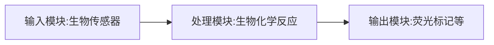

# 价值投资中的生物计算机发展趋势

> 关键词：价值投资、生物计算机、发展趋势、计算技术、生物技术

> 摘要：本文围绕价值投资视角下生物计算机的发展趋势展开深入探讨。首先介绍生物计算机相关背景，包括目的、预期读者等内容。接着阐述生物计算机的核心概念、联系及架构，详细讲解其核心算法原理与操作步骤，借助 Python 代码进行说明。通过数学模型和公式进一步剖析生物计算机的工作机制，并举例说明。以项目实战展示生物计算机在实际开发中的应用，包括环境搭建、代码实现与解读。分析生物计算机的实际应用场景，推荐学习资源、开发工具框架及相关论文著作。最后总结生物计算机未来发展趋势与挑战，解答常见问题并提供扩展阅读和参考资料，为价值投资者和相关技术人员提供全面的参考。

## 1. 背景介绍 
### 1.1 目的和范围
生物计算机作为一种新兴的计算技术，融合了生物学与计算机科学的优势，具有巨大的发展潜力。本文旨在从价值投资的角度出发，深入分析生物计算机的发展趋势，为投资者提供决策依据，同时也为相关技术人员和研究者提供全面的技术解读。文章将涵盖生物计算机的核心概念、算法原理、数学模型、实际应用等多个方面，通过理论分析和实际案例相结合的方式，展现生物计算机的现状和未来走向。

### 1.2 预期读者
本文的预期读者主要包括价值投资者、计算机科学与技术领域的专业人士、生物学相关研究人员、金融分析师以及对新兴技术发展趋势感兴趣的爱好者。对于投资者而言，了解生物计算机的发展趋势有助于发现潜在的投资机会；对于专业技术人员和研究人员，文章提供了深入的技术分析和研究参考；对于金融分析师，可作为行业研究和市场预测的资料；而对于爱好者，则能帮助他们拓宽对新兴技术的认知。

### 1.3 文档结构概述
本文将按照以下结构进行组织：首先介绍生物计算机的背景信息，包括目的、预期读者和文档结构概述等内容；接着阐述生物计算机的核心概念与联系，通过文本示意图和 Mermaid 流程图进行展示；详细讲解核心算法原理和具体操作步骤，并使用 Python 代码进行说明；分析生物计算机的数学模型和公式，通过举例加深理解；进行项目实战，包括开发环境搭建、源代码实现和代码解读；探讨生物计算机的实际应用场景；推荐相关的学习资源、开发工具框架和论文著作；最后总结生物计算机的未来发展趋势与挑战，解答常见问题并提供扩展阅读和参考资料。

### 1.4 术语表
#### 1.4.1 核心术语定义
- **生物计算机**：生物计算机是以生物分子元件构建的计算机，它利用生物分子的特性进行信息存储、处理和传输，如 DNA 分子、蛋白质分子等。
- **价值投资**：价值投资是一种投资策略，投资者通过分析资产的内在价值，寻找被低估的资产进行投资，以期在长期获得稳定的收益。
- **DNA 计算**：DNA 计算是生物计算机的一种重要实现方式，它利用 DNA 分子的碱基对序列来编码信息，通过 DNA 分子的杂交、连接等生物化学反应进行计算。

#### 1.4.2 相关概念解释
- **生物分子**：生物分子是指生物体中存在的各种有机分子，如核酸、蛋白质、糖类等，它们在生物体内具有重要的生理功能。在生物计算机中，生物分子被用作信息存储和处理的载体。
- **计算模型**：计算模型是对计算过程的抽象描述，它定义了计算的基本操作和规则。生物计算机的计算模型与传统计算机有所不同，它基于生物分子的特性和生物化学反应。
- **生物传感器**：生物传感器是一种能够检测生物分子的传感器，它利用生物分子与目标物质之间的特异性相互作用，将生物信号转换为电信号或其他可检测的信号。在生物计算机中，生物传感器可用于信息的输入和输出。

#### 1.4.3 缩略词列表
- **DNA**：脱氧核糖核酸（Deoxyribonucleic Acid）
- **RNA**：核糖核酸（Ribonucleic Acid）
- **FPGA**：现场可编程门阵列（Field - Programmable Gate Array）

## 2. 核心概念与联系 

### 生物计算机的核心概念
生物计算机是一种基于生物分子的计算设备，它的核心思想是利用生物分子的特殊性质来实现信息的存储、处理和传输。与传统计算机使用电子元件不同，生物计算机使用生物分子如 DNA、RNA 和蛋白质作为信息载体。

生物计算机的基本原理是通过生物化学反应来实现计算。例如，DNA 分子由四种碱基（腺嘌呤 A、胸腺嘧啶 T、鸟嘌呤 G 和胞嘧啶 C）组成，这些碱基的排列顺序可以编码信息。通过设计特定的 DNA 序列和生物化学反应，可以实现逻辑运算和数据处理。

### 生物计算机与传统计算机的联系
虽然生物计算机和传统计算机在实现方式上有很大的不同，但它们的目标都是进行信息处理。传统计算机在速度和精度方面具有优势，而生物计算机在存储容量、能耗和并行处理能力方面具有潜力。

生物计算机可以被看作是传统计算机的一种补充和扩展。在某些特定的应用场景中，如生物信息处理、药物研发和基因测序，生物计算机可以发挥其独特的优势，提供更高效的解决方案。

### 生物计算机的架构
生物计算机的架构通常包括输入模块、处理模块和输出模块。

输入模块负责将外部信息转换为生物分子可以识别的信号。例如，可以使用生物传感器来检测生物样本中的特定分子，并将其转换为 DNA 序列。

处理模块是生物计算机的核心部分，它通过生物化学反应来实现计算。处理模块可以由多个生物分子组成，每个分子负责执行特定的计算任务。

输出模块将处理后的信息转换为人类可以理解的形式。例如，可以使用荧光标记来检测 DNA 序列的变化，并将其转换为数字信号。

### 文本示意图
```plaintext
          +----------------+
          |   输入模块     |
          | （生物传感器） |
          +----------------+
                  |
                  v
          +----------------+
          |   处理模块     |
          | （生物化学反应）|
          +----------------+
                  |
                  v
          +----------------+
          |   输出模块     |
          | （荧光标记等） |
          +----------------+
```

### Mermaid 流程图


## 3. 核心算法原理 & 具体操作步骤 

### 核心算法原理
生物计算机的核心算法主要基于 DNA 计算。DNA 计算的基本思想是利用 DNA 分子的碱基配对特性来实现逻辑运算。例如，A 与 T 互补，G 与 C 互补。通过设计特定的 DNA 序列，可以实现与、或、非等基本逻辑门。

下面是一个简单的 Python 代码示例，用于模拟 DNA 计算中的与门操作：

```python
# 定义 DNA 碱基对
base_pairs = {'A': 'T', 'T': 'A', 'G': 'C', 'C': 'G'}

# 定义输入 DNA 序列
input1 = 'ATGC'
input2 = 'TACG'

# 定义与门操作函数
def and_gate(input1, input2):
    output = ''
    for i in range(len(input1)):
        if input1[i] == base_pairs[input2[i]]:
            output += input1[i]
        else:
            output += 'X'  # 表示不匹配
    return output

# 执行与门操作
result = and_gate(input1, input2)
print("与门操作结果:", result)
```

### 具体操作步骤
1. **设计 DNA 序列**：根据需要实现的计算任务，设计合适的 DNA 序列。例如，如果要实现一个加法器，需要设计相应的编码规则来表示数字和操作符。
2. **合成 DNA 分子**：使用化学合成方法合成设计好的 DNA 序列。
3. **进行生物化学反应**：将合成的 DNA 分子混合在一起，让它们发生生物化学反应，如杂交、连接等。
4. **检测反应结果**：使用生物传感器或其他检测技术来检测反应结果，将其转换为数字信息。
5. **分析和处理结果**：对检测到的结果进行分析和处理，得到最终的计算结果。

### 算法复杂度分析
DNA 计算的算法复杂度与传统计算机有所不同。由于 DNA 分子的并行处理能力，一些在传统计算机上难以解决的问题在 DNA 计算中可能具有较低的复杂度。例如，对于一些组合优化问题，DNA 计算可以通过并行搜索所有可能的解来找到最优解。

然而，DNA 计算也面临一些挑战，如反应时间较长、错误率较高等。因此，在实际应用中，需要综合考虑算法复杂度和实际性能。

## 4. 数学模型和公式 & 详细讲解 & 举例说明 

### 数学模型
生物计算机的数学模型主要基于信息论和生物化学动力学。信息论用于描述生物分子中信息的存储和传输，而生物化学动力学用于描述生物化学反应的速率和平衡。

#### 信息熵
信息熵是信息论中的一个重要概念，用于衡量信息的不确定性。在生物计算机中，DNA 序列的信息熵可以用来描述其编码信息的能力。

设 DNA 序列由四种碱基 A、T、G、C 组成，每种碱基出现的概率分别为 $p_A$、$p_T$、$p_G$ 和 $p_C$，则 DNA 序列的信息熵 $H$ 可以表示为：

$$H = - \sum_{i \in \{A, T, G, C\}} p_i \log_2 p_i$$

例如，如果一个 DNA 序列中 A、T、G、C 出现的概率相等，即 $p_A = p_T = p_G = p_C = 0.25$，则其信息熵为：

$$H = - 4 \times 0.25 \log_2 0.25 = 2 \text{ bits/碱基}$$

#### 生物化学动力学模型
生物化学反应可以用化学动力学方程来描述。例如，对于一个简单的 DNA 杂交反应：

$$A + B \rightleftharpoons AB$$

其中 $A$ 和 $B$ 是两条互补的 DNA 链，$AB$ 是杂交后的双链 DNA。反应速率可以用以下方程表示：

$$\frac{d[AB]}{dt} = k_f [A][B] - k_r [AB]$$

其中 $[A]$、$[B]$ 和 $[AB]$ 分别是 $A$、$B$ 和 $AB$ 的浓度，$k_f$ 是正向反应速率常数，$k_r$ 是逆向反应速率常数。

### 详细讲解
信息熵的概念在生物计算机中非常重要。它可以帮助我们评估 DNA 序列的编码效率和信息存储能力。较高的信息熵意味着 DNA 序列可以编码更多的信息。

生物化学动力学模型则用于描述生物化学反应的过程和速率。通过求解动力学方程，我们可以预测反应的平衡状态和反应时间，从而优化生物计算机的设计和操作。

### 举例说明
假设我们要设计一个 DNA 序列来编码一个二进制数。如果我们使用固定长度的 DNA 序列，每个碱基可以编码 2 位二进制信息（因为信息熵为 2 bits/碱基）。例如，一个长度为 10 的 DNA 序列可以编码 $2^{2 \times 10} = 1048576$ 种不同的二进制数。

对于生物化学动力学的例子，假设正向反应速率常数 $k_f = 10^6 \text{ M}^{-1} \text{s}^{-1}$，逆向反应速率常数 $k_r = 10^{-3} \text{ s}^{-1}$，初始时 $[A] = [B] = 10^{-6} \text{ M}$。通过求解动力学方程，我们可以得到反应达到平衡时 $[AB]$ 的浓度。

首先，在平衡状态下，$\frac{d[AB]}{dt} = 0$，即 $k_f [A][B] = k_r [AB]$。设平衡时 $[AB] = x$，则 $[A] = [B] = 10^{-6} - x$。代入方程可得：

$$10^6 (10^{-6} - x)^2 = 10^{-3} x$$

解这个方程可以得到 $x$ 的值，从而得到反应达到平衡时双链 DNA 的浓度。

## 5. 项目实战：代码实际案例和详细解释说明 

### 5.1  开发环境搭建
#### 硬件环境
- **计算机**：建议使用性能较好的个人计算机，如 Intel Core i7 及以上处理器，16GB 及以上内存。
- **生物实验设备**：如果需要进行实际的生物实验，还需要一些生物实验设备，如 PCR 仪、离心机、凝胶成像系统等。

#### 软件环境
- **Python**：建议使用 Python 3.7 及以上版本，可以从 Python 官方网站（https://www.python.org/downloads/）下载安装。
- **相关库**：安装以下 Python 库：
    - `numpy`：用于数值计算。
    - `matplotlib`：用于数据可视化。
    - `biopython`：用于生物信息学分析。

可以使用以下命令来安装这些库：

```sh
pip install numpy matplotlib biopython
```

### 5.2  源代码详细实现和代码解读
以下是一个使用 Python 实现简单 DNA 序列分析的代码示例：

```python
from Bio.Seq import Seq
from Bio.Alphabet import generic_dna

# 定义 DNA 序列
dna_seq = Seq("ATGCATGC", generic_dna)

# 计算序列长度
length = len(dna_seq)
print("DNA 序列长度:", length)

# 计算碱基组成
base_count = dna_seq.count('A'), dna_seq.count('T'), dna_seq.count('G'), dna_seq.count('C')
print("碱基 A、T、G、C 的数量分别为:", base_count)

# 计算碱基频率
base_freq = [count / length for count in base_count]
print("碱基 A、T、G、C 的频率分别为:", base_freq)

# 计算反向互补序列
reverse_complement = dna_seq.reverse_complement()
print("反向互补序列:", reverse_complement)

# 绘制碱基频率柱状图
import matplotlib.pyplot as plt
bases = ['A', 'T', 'G', 'C']
plt.bar(bases, base_freq)
plt.xlabel('碱基')
plt.ylabel('频率')
plt.title('DNA 序列碱基频率')
plt.show()
```

### 代码解读与分析
1. **导入必要的库**：
    - `Bio.Seq` 和 `Bio.Alphabet` 是 Biopython 库中的模块，用于处理生物序列和定义字母表。
2. **定义 DNA 序列**：
    - 使用 `Seq` 类创建一个 DNA 序列对象，并指定字母表为 `generic_dna`。
3. **计算序列长度**：
    - 使用 `len()` 函数计算 DNA 序列的长度。
4. **计算碱基组成**：
    - 使用 `count()` 方法计算每个碱基的数量。
5. **计算碱基频率**：
    - 将每个碱基的数量除以序列长度，得到碱基频率。
6. **计算反向互补序列**：
    - 使用 `reverse_complement()` 方法计算 DNA 序列的反向互补序列。
7. **绘制碱基频率柱状图**：
    - 使用 `matplotlib` 库绘制碱基频率的柱状图，直观展示碱基的分布情况。

通过这个代码示例，我们可以对 DNA 序列进行基本的分析和可视化，这在生物计算机的研究中是非常有用的。

## 6. 实际应用场景 
### 生物信息处理
生物计算机在生物信息处理领域具有巨大的应用潜力。随着基因组学、蛋白质组学等生物技术的发展，产生了大量的生物数据，如 DNA 序列、蛋白质结构等。传统计算机在处理这些复杂的生物数据时面临着巨大的挑战，而生物计算机可以利用其并行处理能力和生物分子的特异性，更高效地处理和分析这些数据。

例如，在基因测序中，生物计算机可以快速准确地对 DNA 序列进行拼接和注释，大大提高测序效率。在蛋白质结构预测中，生物计算机可以模拟蛋白质的折叠过程，预测其三维结构，为药物研发提供重要的依据。

### 药物研发
药物研发是一个复杂而漫长的过程，需要大量的时间和资金投入。生物计算机可以在药物研发的各个环节发挥重要作用。

在药物筛选方面，生物计算机可以通过模拟药物与生物靶点的相互作用，快速筛选出具有潜在治疗效果的化合物，减少实验筛选的工作量和成本。在药物设计方面，生物计算机可以根据生物靶点的结构和功能信息，设计出具有更高亲和力和特异性的药物分子。

### 环境监测
生物计算机可以用于环境监测，检测环境中的污染物和生物标志物。例如，利用生物传感器可以检测水体中的重金属离子、有机污染物等有害物质。生物计算机可以对传感器采集的数据进行实时处理和分析，及时发出警报，为环境保护和生态安全提供保障。

### 人工智能与机器学习
生物计算机的并行处理能力和生物分子的自适应性使其在人工智能和机器学习领域具有潜在的应用价值。例如，生物计算机可以用于神经网络的训练和优化，提高机器学习算法的效率和性能。生物计算机还可以模拟生物神经系统的工作原理，开发出更加智能和自适应的人工智能系统。

### 量子计算辅助
虽然生物计算机和量子计算机是两种不同的计算技术，但它们可以相互辅助。生物计算机可以利用其并行处理能力为量子计算提供数据预处理和优化，而量子计算机可以为生物计算机提供更强大的计算能力，解决一些复杂的计算问题。

## 7. 工具和资源推荐
### 7.1 学习资源推荐
#### 7.1.1 书籍推荐
- 《生物信息学概论》：这本书系统地介绍了生物信息学的基本概念、方法和技术，包括 DNA 序列分析、蛋白质结构预测、基因表达分析等内容，对于理解生物计算机在生物信息处理中的应用非常有帮助。
- 《计算分子生物学》：详细阐述了计算分子生物学的理论和算法，涵盖了 DNA 计算、分子动力学模拟等方面的知识，是深入学习生物计算机的重要参考书籍。
- 《生物计算机原理与应用》：专门介绍生物计算机的原理、架构和应用，书中包含了大量的实际案例和实验数据，对于了解生物计算机的发展现状和未来趋势具有重要的指导意义。

#### 7.1.2 在线课程
- Coursera 上的“生物信息学基础”课程：由知名大学的教授授课，课程内容丰富，涵盖了生物信息学的基本概念、算法和工具，适合初学者学习。
- edX 上的“计算生物学与生物信息学”课程：提供了深入的计算生物学和生物信息学知识，包括 DNA 序列分析、蛋白质结构预测等方面的内容，课程难度适中，适合有一定编程基础的学习者。
- 中国大学 MOOC 上的“生物计算机导论”课程：由国内高校的专家授课，介绍了生物计算机的基本原理、发展历程和应用领域，课程内容通俗易懂，适合广大学习者了解生物计算机的相关知识。

#### 7.1.3 技术博客和网站
- Bioinformatics.org：这是一个专业的生物信息学网站，提供了丰富的生物信息学资源，包括教程、工具、文献等，对于学习生物计算机在生物信息处理中的应用非常有帮助。
- Biotechniques.com：该网站专注于生物技术领域的最新研究成果和技术进展，涵盖了生物计算机、基因编辑、蛋白质工程等方面的内容，是了解生物计算机前沿技术的重要渠道。
- Nature Biotechnology：这是一本权威的生物技术期刊，发表了许多关于生物计算机的高水平研究论文，通过阅读这些论文可以了解生物计算机领域的最新研究动态和发展趋势。

### 7.2 开发工具框架推荐
#### 7.2.1 IDE和编辑器
- PyCharm：是一款专业的 Python 集成开发环境，具有代码编辑、调试、自动完成等功能，适合开发生物计算机相关的 Python 代码。
- Jupyter Notebook：是一个交互式的开发环境，可以在浏览器中编写和运行代码，支持多种编程语言，非常适合进行数据分析和可视化，对于生物计算机的实验和研究非常有用。
- Visual Studio Code：是一款轻量级的代码编辑器，支持多种编程语言和插件扩展，具有丰富的代码编辑和调试功能，可用于开发生物计算机相关的代码。

#### 7.2.2 调试和性能分析工具
- Py-Spy：是一个 Python 性能分析工具，可以实时监控 Python 程序的性能，找出性能瓶颈，对于优化生物计算机相关的 Python 代码非常有帮助。
- GDB：是一个通用的调试器，支持多种编程语言，可以用于调试生物计算机相关的 C、C++ 代码。
- Memory Profiler：是一个 Python 内存分析工具，可以帮助开发者检测 Python 程序的内存使用情况，找出内存泄漏问题，对于优化生物计算机相关的 Python 代码的内存性能非常有用。

#### 7.2.3 相关框架和库
- Biopython：是一个用于生物信息学分析的 Python 库，提供了丰富的生物序列处理、蛋白质结构分析等功能，对于开发生物计算机相关的应用程序非常有帮助。
- TensorFlow：是一个开源的机器学习框架，可用于构建和训练神经网络模型，在生物计算机的人工智能应用中具有广泛的应用前景。
- NumPy 和 SciPy：是 Python 中常用的数值计算库，提供了高效的数组操作和科学计算功能，对于生物计算机的数值模拟和数据分析非常有用。

### 7.3 相关论文著作推荐
#### 7.3.1 经典论文
- “Molecular Computation of Solutions to Combinatorial Problems”：这篇论文是 DNA 计算领域的经典之作，首次提出了利用 DNA 分子进行组合优化问题求解的思想，为生物计算机的发展奠定了基础。
- “Biocomputers: Principles, Progress, and Problems”：该论文全面介绍了生物计算机的原理、发展历程和面临的问题，对于了解生物计算机的发展现状和未来趋势具有重要的参考价值。
- “A DNA - Based Archival Storage System”：提出了一种基于 DNA 的数据存储系统，展示了 DNA 在数据存储方面的巨大潜力，为生物计算机的信息存储提供了新的思路。

#### 7.3.2 最新研究成果
- 近年来，在 Nature、Science 等顶级期刊上发表了许多关于生物计算机的最新研究成果。例如，一些研究团队利用 CRISPR - Cas 系统实现了生物计算机的逻辑运算，展示了生物计算机在基因编辑和生物调控方面的应用前景。
- 还有研究团队开发了基于蛋白质的生物计算机，利用蛋白质的构象变化进行信息处理，为生物计算机的发展开辟了新的方向。

#### 7.3.3 应用案例分析
- 一些科研机构和企业已经开展了生物计算机的应用研究，并取得了一些实际成果。例如，某公司利用生物计算机进行药物筛选，大大提高了筛选效率，缩短了药物研发周期。
- 某科研团队利用生物计算机对环境中的生物标志物进行实时监测，为环境保护提供了重要的技术支持。通过分析这些应用案例，可以了解生物计算机在实际应用中的优势和挑战。

## 8. 总结：未来发展趋势与挑战
### 未来发展趋势
#### 性能提升
未来生物计算机的性能将不断提升。随着生物技术和纳米技术的发展，生物分子元件的尺寸将不断减小，计算速度和存储容量将不断提高。例如，通过改进 DNA 合成和测序技术，可以实现更高效的 DNA 计算，提高生物计算机的处理能力。

#### 与其他技术融合
生物计算机将与其他技术如人工智能、量子计算、物联网等深度融合。与人工智能的融合可以使生物计算机具备更强的智能处理能力，实现更加复杂的任务。与量子计算的结合可以充分发挥两者的优势，解决一些传统计算机难以解决的问题。与物联网的融合可以使生物计算机在环境监测、医疗健康等领域得到更广泛的应用。

#### 应用领域拓展
生物计算机的应用领域将不断拓展。除了生物信息处理、药物研发、环境监测等领域，生物计算机还将在食品安全检测、生物传感器、智能农业等领域发挥重要作用。例如，在食品安全检测中，生物计算机可以快速准确地检测食品中的有害物质，保障食品安全。

#### 产业化发展
随着技术的不断成熟，生物计算机将逐渐实现产业化发展。一些科技企业已经开始涉足生物计算机领域，加大研发投入，推动生物计算机的商业化应用。未来，生物计算机有望成为一个新兴的产业，带动相关产业的发展。

### 挑战
#### 技术难题
生物计算机面临着许多技术难题，如生物分子元件的稳定性、生物化学反应的可控性、信息的准确读取和写入等。目前，生物分子元件的稳定性较差，容易受到外界环境的影响，导致计算结果的准确性降低。生物化学反应的可控性也比较困难，难以精确控制反应的速率和方向。

#### 成本问题
生物计算机的研发和生产成本较高。生物分子的合成和检测需要昂贵的设备和试剂，而且生物实验的操作过程复杂，需要专业的技术人员。这些因素导致生物计算机的成本居高不下，限制了其大规模的应用和推广。

#### 伦理和法律问题
生物计算机的发展也带来了一些伦理和法律问题。例如，生物计算机在基因编辑和生物调控方面的应用可能会引发伦理争议，如人类基因编辑是否符合伦理道德等。此外，生物计算机的应用也需要相应的法律法规来规范，以保障其安全和合理使用。

#### 人才短缺
生物计算机是一个跨学科的领域，需要具备生物学、计算机科学、物理学等多学科知识的专业人才。目前，相关领域的人才短缺，制约了生物计算机的发展。需要加强跨学科人才的培养，提高人才的综合素质和创新能力。

## 9. 附录：常见问题与解答
### 1. 生物计算机与传统计算机有什么本质区别？
生物计算机与传统计算机的本质区别在于信息载体和计算方式。传统计算机使用电子元件（如晶体管）作为信息载体，通过电信号进行信息的存储、处理和传输。而生物计算机使用生物分子（如 DNA、RNA 和蛋白质）作为信息载体，通过生物化学反应进行计算。生物计算机具有并行处理能力强、存储容量大、能耗低等优点，但也存在反应时间长、错误率高、稳定性差等问题。

### 2. 生物计算机目前已经有哪些实际应用？
目前生物计算机已经在生物信息处理、药物研发、环境监测等领域有了一些实际应用。在生物信息处理方面，生物计算机可以快速准确地处理和分析大量的生物数据，如 DNA 序列、蛋白质结构等。在药物研发方面，生物计算机可以用于药物筛选和设计，提高药物研发的效率和成功率。在环境监测方面，生物计算机可以检测环境中的污染物和生物标志物，为环境保护提供保障。

### 3. 生物计算机的发展前景如何？
生物计算机具有广阔的发展前景。随着生物技术和计算机科学的不断发展，生物计算机的性能将不断提升，应用领域将不断拓展。生物计算机有望在生物医学、环境保护、人工智能等领域发挥重要作用，成为未来计算技术的重要发展方向。然而，生物计算机也面临着一些技术难题和挑战，需要科研人员不断努力攻克。

### 4. 学习生物计算机需要具备哪些知识？
学习生物计算机需要具备生物学、计算机科学、数学等多学科的知识。在生物学方面，需要了解生物分子的结构和功能、生物化学反应的原理等。在计算机科学方面，需要掌握编程语言（如 Python）、算法设计、数据结构等知识。在数学方面，需要了解信息论、生物化学动力学等相关知识。此外，还需要具备一定的实验技能和创新能力。

### 5. 生物计算机是否会取代传统计算机？
生物计算机不会完全取代传统计算机。虽然生物计算机具有一些独特的优势，但传统计算机在速度、精度和稳定性方面具有不可替代的优势。生物计算机和传统计算机将相互补充、相互促进，共同推动计算技术的发展。在某些特定的应用场景中，生物计算机可以发挥其优势，提供更高效的解决方案；而在其他场景中，传统计算机仍然是首选。

## 10. 扩展阅读 & 参考资料
### 扩展阅读
- 《人工智能时代的生物计算》：深入探讨了生物计算机在人工智能时代的应用和发展前景，介绍了生物计算机与人工智能的融合技术和应用案例。
- 《生物技术与计算科学的交叉前沿》：涵盖了生物技术和计算科学交叉领域的最新研究成果，包括生物计算机、生物信息学、合成生物学等方面的内容。
- 《未来计算技术的发展趋势》：分析了未来计算技术的发展趋势，包括生物计算机、量子计算、光子计算等新兴计算技术的发展前景和挑战。

### 参考资料
- DNA Computing and Molecular Programming: 该会议是生物计算机领域的重要学术会议，每年都会发表许多关于生物计算机的最新研究成果和技术进展。会议论文集可以作为了解生物计算机领域最新动态的重要参考资料。
- IEEE Transactions on Nanobioscience: 这是 IEEE 出版的纳米生物科学领域的专业期刊，发表了许多关于生物计算机、纳米生物技术等方面的研究论文，具有较高的学术水平和影响力。
- 相关的专利文献：可以通过专利数据库搜索生物计算机相关的专利文献，了解生物计算机领域的技术创新和发展趋势。

作者：AI天才研究院/AI Genius Institute & 禅与计算机程序设计艺术 /Zen And The Art of Computer Programming