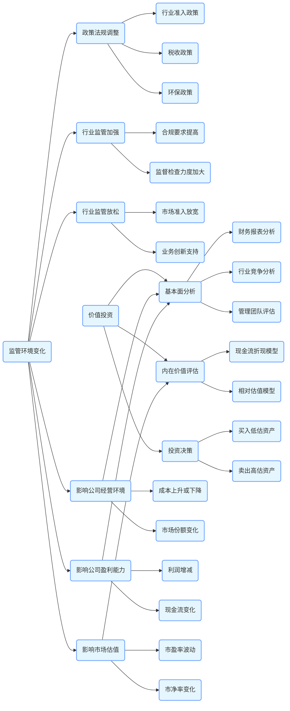

# 价值投资中的监管环境变化应对

> 关键词：价值投资、监管环境变化、应对策略、投资组合、风险管理

> 摘要：本文聚焦于价值投资领域中监管环境变化的应对问题。详细阐述了监管环境变化对价值投资的影响，包括核心概念与联系、核心算法原理及操作步骤，运用数学模型进行分析，并通过项目实战案例加深理解。同时探讨了价值投资在不同监管环境下的实际应用场景，推荐了相关的学习工具、资源和论文著作。最后总结了未来发展趋势与挑战，解答常见问题，为价值投资者在监管环境不断变化的背景下提供全面且深入的指导。

## 1. 背景介绍 
### 1.1 目的和范围
本文章的主要目的是为价值投资者提供全面而深入的指导，帮助他们理解监管环境变化对价值投资的影响，并掌握有效的应对策略。范围涵盖了监管环境变化的各个方面，包括政策法规的调整、行业监管的加强或放松等，以及这些变化如何作用于价值投资的决策过程、投资组合构建和风险管理等环节。通过理论分析、算法讲解、实际案例和资源推荐，旨在使投资者能够在复杂多变的监管环境中做出明智的投资决策，实现资产的保值增值。

### 1.2 预期读者
本文预期读者主要包括从事价值投资的专业人士，如基金经理、投资顾问、分析师等，他们需要深入了解监管环境变化对投资的影响，以便为客户提供更优质的投资建议和服务。同时，也适合有一定投资基础的个人投资者，他们希望提升自己在监管环境变化下的投资能力，更好地管理自己的投资组合。此外，金融领域的研究人员和学者也可以从本文中获取相关的理论和实践参考，进行更深入的学术研究。

### 1.3 文档结构概述
本文将按照以下结构展开：首先介绍监管环境变化与价值投资的核心概念及其相互联系，并通过文本示意图和 Mermaid 流程图进行直观展示。接着阐述核心算法原理和具体操作步骤，使用 Python 源代码进行详细说明。然后介绍相关的数学模型和公式，并结合实际例子进行讲解。通过项目实战部分，展示代码实际案例并进行详细解释。之后探讨价值投资在不同监管环境下的实际应用场景。推荐学习所需的工具、资源和相关论文著作。最后总结未来发展趋势与挑战，解答常见问题，并提供扩展阅读和参考资料。

### 1.4 术语表
#### 1.4.1 核心术语定义
- **价值投资**：一种投资策略，投资者通过分析公司的基本面，如财务状况、盈利能力、竞争优势等，寻找被市场低估的股票或其他资产，并长期持有，以获取资产价值回归带来的收益。
- **监管环境**：政府或监管机构制定的一系列法律法规、政策措施和监管要求，旨在规范金融市场的运行，保护投资者利益，维护市场秩序。
- **投资组合**：投资者将资金分散投资于多种不同的资产，如股票、债券、基金等，以降低单一资产的风险，实现投资目标的资产集合。
- **风险管理**：识别、评估和应对投资过程中可能面临的各种风险，以确保投资组合的稳定性和收益性。

#### 1.4.2 相关概念解释
- **政策法规调整**：政府或监管机构根据经济形势、市场发展和社会需求，对现有的政策法规进行修改、补充或制定新的政策法规，以适应变化的环境。
- **行业监管加强**：监管机构加大对特定行业的监管力度，提高行业准入门槛，加强对企业经营活动的监督检查，以规范行业秩序，防范风险。
- **行业监管放松**：监管机构适当放宽对特定行业的监管要求，减少行政干预，促进市场竞争和创新发展。

#### 1.4.3 缩略词列表
- **GDP**：国内生产总值（Gross Domestic Product），衡量一个国家或地区经济活动总量的指标。
- **PE**：市盈率（Price-to-Earnings Ratio），股票价格与每股收益的比率，用于评估股票的估值水平。
- **ROE**：净资产收益率（Return on Equity），净利润与股东权益的比率，反映公司的盈利能力和股东权益的回报水平。

## 2. 核心概念与联系 

### 核心概念原理
价值投资的核心原理是基于对资产内在价值的评估。投资者通过深入研究公司的财务报表、行业竞争格局、管理团队能力等因素，估算出公司的内在价值。当市场价格低于内在价值时，投资者认为该资产被低估，从而买入并持有，等待市场价格回归内在价值，实现投资收益。

监管环境则是影响价值投资的重要外部因素。监管政策的变化会直接或间接地影响公司的经营环境、盈利能力和市场竞争力。例如，环保监管加强可能导致高污染企业的生产成本上升，利润下降；而金融监管政策的调整可能影响金融机构的业务模式和风险状况。

### 架构的文本示意图
```plaintext
监管环境变化
├── 政策法规调整
│   ├── 行业准入政策
│   ├── 税收政策
│   ├── 环保政策
├── 行业监管加强
│   ├── 合规要求提高
│   ├── 监督检查力度加大
├── 行业监管放松
│   ├── 市场准入放宽
│   ├── 业务创新支持

价值投资
├── 基本面分析
│   ├── 财务报表分析
│   ├── 行业竞争分析
│   ├── 管理团队评估
├── 内在价值评估
│   ├── 现金流折现模型
│   ├── 相对估值模型
├── 投资决策
│   ├── 买入低估资产
│   ├── 卖出高估资产

监管环境变化与价值投资的联系
├── 影响公司经营环境
│   ├── 成本上升或下降
│   ├── 市场份额变化
├── 影响公司盈利能力
│   ├── 利润增减
│   ├── 现金流变化
├── 影响市场估值
│   ├── 市盈率波动
│   ├── 市净率变化
```

### Mermaid 流程图


## 3. 核心算法原理 & 具体操作步骤 

### 核心算法原理
在价值投资中，常用的内在价值评估算法有现金流折现模型（DCF）和相对估值模型。

#### 现金流折现模型（DCF）
现金流折现模型的基本原理是将公司未来的自由现金流按照一定的折现率折现到当前时刻，得到公司的内在价值。其公式为：
$$V = \sum_{t=1}^{n} \frac{FCF_t}{(1 + r)^t} + \frac{TV}{(1 + r)^n}$$
其中，$V$ 表示公司的内在价值，$FCF_t$ 表示第 $t$ 期的自由现金流，$r$ 表示折现率，$n$ 表示预测期数，$TV$ 表示终值。

#### 相对估值模型
相对估值模型是通过比较同行业或类似公司的估值指标，如市盈率（PE）、市净率（PB）等，来评估目标公司的价值。例如，使用市盈率估值的公式为：
$$V = EPS \times PE$$
其中，$V$ 表示公司的内在价值，$EPS$ 表示每股收益，$PE$ 表示可比公司的平均市盈率。

### 具体操作步骤

#### 步骤 1：收集数据
收集目标公司的财务报表、行业数据、宏观经济数据等信息，包括营业收入、净利润、资产负债表、现金流量表等。

#### 步骤 2：进行基本面分析
对目标公司的财务状况、行业竞争地位、管理团队能力等进行分析，评估公司的优势和劣势。

#### 步骤 3：预测未来现金流
根据公司的历史数据和行业发展趋势，预测公司未来的自由现金流。可以采用线性回归、时间序列分析等方法进行预测。

#### 步骤 4：确定折现率
折现率反映了投资者对投资风险的要求。可以使用资本资产定价模型（CAPM）来确定折现率：
$$r = R_f + \beta \times (R_m - R_f)$$
其中，$r$ 表示折现率，$R_f$ 表示无风险利率，$\beta$ 表示公司的贝塔系数，$R_m$ 表示市场收益率。

#### 步骤 5：计算内在价值
使用现金流折现模型或相对估值模型计算目标公司的内在价值。

#### 步骤 6：进行投资决策
将计算得到的内在价值与市场价格进行比较，如果内在价值高于市场价格，则认为该资产被低估，可以考虑买入；反之，则可以考虑卖出或不投资。

### Python 源代码实现

```python
import numpy as np

# 现金流折现模型实现
def dcf_valuation(fcf, growth_rate, discount_rate, n_years):
    """
    计算公司的内在价值
    :param fcf: 初始自由现金流
    :param growth_rate: 自由现金流增长率
    :param discount_rate: 折现率
    :param n_years: 预测期数
    :return: 公司的内在价值
    """
    cash_flows = []
    for i in range(n_years):
        cash_flows.append(fcf * (1 + growth_rate) ** i)
    terminal_value = cash_flows[-1] * (1 + growth_rate) / (discount_rate - growth_rate)
    cash_flows.append(terminal_value)
    present_values = [cf / ((1 + discount_rate) ** i) for i, cf in enumerate(cash_flows)]
    return sum(present_values)

# 相对估值模型实现
def relative_valuation(eps, pe_ratio):
    """
    计算公司的内在价值
    :param eps: 每股收益
    :param pe_ratio: 可比公司的平均市盈率
    :return: 公司的内在价值
    """
    return eps * pe_ratio

# 示例数据
fcf = 100  # 初始自由现金流
growth_rate = 0.05  # 自由现金流增长率
discount_rate = 0.1  # 折现率
n_years = 10  # 预测期数
eps = 5  # 每股收益
pe_ratio = 15  # 可比公司的平均市盈率

# 计算内在价值
dcf_value = dcf_valuation(fcf, growth_rate, discount_rate, n_years)
relative_value = relative_valuation(eps, pe_ratio)

print(f"现金流折现模型计算的内在价值: {dcf_value}")
print(f"相对估值模型计算的内在价值: {relative_value}")
```

## 4. 数学模型和公式 & 详细讲解 & 举例说明 

### 现金流折现模型（DCF）
#### 详细讲解
现金流折现模型的核心思想是将公司未来的现金流入和流出进行折现，以反映货币的时间价值。自由现金流是指公司在满足了所有运营和投资需求后剩余的现金流量，它是公司能够分配给股东或用于再投资的现金。

折现率是投资者要求的最低回报率，它反映了投资的风险程度。风险越高，折现率越高；风险越低，折现率越低。

终值是指预测期结束后公司的价值，通常假设公司在预测期结束后以一个稳定的增长率持续增长。

#### 举例说明
假设一家公司当前的自由现金流为 $100$ 万元，预计未来每年以 $5\%$ 的增长率增长，折现率为 $10\%$，预测期为 $10$ 年。

首先，计算未来 $10$ 年的自由现金流：
$FCF_1 = 100 \times (1 + 0.05)^1 = 105$ 万元
$FCF_2 = 100 \times (1 + 0.05)^2 = 110.25$ 万元
$\cdots$
$FCF_{10} = 100 \times (1 + 0.05)^{10} \approx 162.89$ 万元

然后，计算终值：
假设预测期结束后公司以 $3\%$ 的增长率持续增长，则终值为：
$TV = \frac{FCF_{10} \times (1 + 0.03)}{0.1 - 0.03} \approx \frac{162.89 \times 1.03}{0.07} \approx 2393.57$ 万元

最后，将未来的自由现金流和终值折现到当前时刻：
$V = \sum_{t=1}^{10} \frac{FCF_t}{(1 + 0.1)^t} + \frac{TV}{(1 + 0.1)^{10}}$
$V \approx \frac{105}{1.1^1} + \frac{110.25}{1.1^2} + \cdots + \frac{162.89}{1.1^{10}} + \frac{2393.57}{1.1^{10}}$
$V \approx 1324.57$ 万元

### 相对估值模型
#### 详细讲解
相对估值模型是一种简单直观的估值方法，它通过比较同行业或类似公司的估值指标来评估目标公司的价值。市盈率是最常用的估值指标之一，它反映了市场对公司每股收益的预期。

#### 举例说明
假设一家公司的每股收益为 $5$ 元，同行业可比公司的平均市盈率为 $15$ 倍。则该公司的内在价值为：
$V = EPS \times PE = 5 \times 15 = 75$ 元

### 资本资产定价模型（CAPM）
#### 详细讲解
资本资产定价模型用于确定投资的必要回报率，即折现率。无风险利率通常可以用国债收益率来近似表示，贝塔系数反映了公司股票相对于市场的波动性，市场收益率可以用股票市场指数的平均收益率来表示。

#### 举例说明
假设无风险利率为 $3\%$，市场收益率为 $10\%$，某公司的贝塔系数为 $1.2$。则该公司的折现率为：
$r = R_f + \beta \times (R_m - R_f) = 3\% + 1.2 \times (10\% - 3\%) = 11.4\%$

## 5. 项目实战：代码实际案例和详细解释说明 

### 5.1  开发环境搭建
#### 操作系统
可以选择 Windows、Linux 或 macOS 操作系统。

#### Python 版本
建议使用 Python 3.7 及以上版本。

#### 安装必要的库
使用以下命令安装所需的 Python 库：
```sh
pip install numpy pandas matplotlib
```

### 5.2  源代码详细实现和代码解读

```python
import numpy as np
import pandas as pd
import matplotlib.pyplot as plt

# 模拟监管环境变化对公司现金流的影响
def simulate_regulatory_impact(fcf, growth_rate, regulatory_factor, n_years):
    """
    模拟监管环境变化对公司现金流的影响
    :param fcf: 初始自由现金流
    :param growth_rate: 自由现金流增长率
    :param regulatory_factor: 监管影响因子
    :param n_years: 预测期数
    :return: 受监管影响后的现金流序列
    """
    cash_flows = []
    for i in range(n_years):
        if i == 0:
            cash_flows.append(fcf)
        else:
            new_fcf = cash_flows[-1] * (1 + growth_rate) * regulatory_factor
            cash_flows.append(new_fcf)
    return cash_flows

# 现金流折现模型实现
def dcf_valuation(cash_flows, discount_rate):
    """
    计算公司的内在价值
    :param cash_flows: 现金流序列
    :param discount_rate: 折现率
    :return: 公司的内在价值
    """
    present_values = [cf / ((1 + discount_rate) ** i) for i, cf in enumerate(cash_flows)]
    return sum(present_values)

# 示例数据
fcf = 100  # 初始自由现金流
growth_rate = 0.05  # 自由现金流增长率
discount_rate = 0.1  # 折现率
n_years = 10  # 预测期数

# 模拟不同监管环境下的现金流
regulatory_factors = [0.8, 1.0, 1.2]  # 监管影响因子：负面、无影响、正面
values = []

for factor in regulatory_factors:
    cash_flows = simulate_regulatory_impact(fcf, growth_rate, factor, n_years)
    value = dcf_valuation(cash_flows, discount_rate)
    values.append(value)

# 可视化结果
labels = ['Negative Impact', 'No Impact', 'Positive Impact']
plt.bar(labels, values)
plt.xlabel('Regulatory Impact')
plt.ylabel('Intrinsic Value')
plt.title('Impact of Regulatory Changes on Intrinsic Value')
plt.show()

# 输出结果
data = {'Regulatory Impact': labels, 'Intrinsic Value': values}
df = pd.DataFrame(data)
print(df)
```

### 5.3  代码解读与分析
#### 模拟监管环境变化对公司现金流的影响
`simulate_regulatory_impact` 函数用于模拟监管环境变化对公司现金流的影响。`regulatory_factor` 表示监管影响因子，当 `regulatory_factor` 小于 $1$ 时，表示监管环境对公司产生负面影响，现金流减少；当 `regulatory_factor` 等于 $1$ 时，表示监管环境对公司无影响；当 `regulatory_factor` 大于 $1$ 时，表示监管环境对公司产生正面影响，现金流增加。

#### 现金流折现模型
`dcf_valuation` 函数用于计算公司的内在价值，它将现金流序列按照折现率进行折现，并求和得到公司的内在价值。

#### 模拟不同监管环境下的现金流和内在价值
通过循环遍历不同的监管影响因子，模拟不同监管环境下的现金流，并计算相应的内在价值。

#### 可视化结果
使用 `matplotlib` 库绘制柱状图，直观展示不同监管环境下公司内在价值的变化。

#### 输出结果
使用 `pandas` 库将结果存储在数据框中，并打印输出。

通过这个项目实战，我们可以看到监管环境变化对公司内在价值的影响。投资者可以根据监管环境的变化，调整投资组合，降低风险，提高收益。

## 6. 实际应用场景 
### 金融行业
在金融行业，监管环境的变化对银行、证券、保险等金融机构的经营和投资产生重大影响。例如，银行业的资本充足率监管要求提高，会导致银行需要增加资本储备，从而影响其盈利能力和投资能力。证券行业的监管政策调整，如新股发行制度改革、退市制度完善等，会影响股票市场的供求关系和估值水平。保险行业的监管政策变化，如费率市场化改革、偿付能力监管加强等，会影响保险公司的产品设计、定价和投资策略。

### 医疗行业
医疗行业受到严格的监管，监管环境的变化对医药企业、医疗器械企业和医疗机构的发展至关重要。例如，药品审批制度的改革会影响新药的研发和上市速度，医保政策的调整会影响药品和医疗服务的市场需求。医疗器械行业的监管标准提高，会促使企业加大研发投入，提高产品质量和安全性。

### 能源行业
能源行业是国民经济的重要基础产业，监管环境的变化对能源企业的生产、经营和投资产生深远影响。例如，环保监管加强会促使煤炭、石油等传统能源企业加大节能减排投入，发展清洁能源。新能源行业的补贴政策调整会影响企业的投资决策和市场竞争格局。

### 互联网行业
互联网行业发展迅速，监管环境也在不断变化。例如，数据安全和隐私保护监管加强会促使互联网企业加强数据管理和安全防护。反垄断监管政策的出台会影响互联网巨头的市场地位和竞争策略。网络内容监管政策的调整会影响互联网媒体、社交平台等企业的内容运营和发展方向。

## 7. 工具和资源推荐
### 7.1 学习资源推荐
#### 7.1.1 书籍推荐
- 《聪明的投资者》（The Intelligent Investor）：作者本杰明·格雷厄姆（Benjamin Graham），被誉为价值投资的圣经，详细介绍了价值投资的理念、方法和策略。
- 《证券分析》（Security Analysis）：同样是本杰明·格雷厄姆的经典著作，对证券的分析和估值方法进行了深入探讨。
- 《巴菲特致股东的信：投资者和公司高管教程》（The Essays of Warren Buffett: Lessons for Corporate America）：收录了巴菲特历年致股东的信，展示了他的投资哲学和管理理念。
- 《金融炼金术》（The Alchemy of Finance）：作者乔治·索罗斯（George Soros），介绍了他的反身性理论和投资实践。

#### 7.1.2 在线课程
- Coursera 上的“投资学原理”（Principles of Investments）：由知名大学教授授课，系统介绍投资学的基本原理和方法。
- edX 上的“价值投资基础”（Fundamentals of Value Investing）：深入讲解价值投资的核心概念和分析方法。
- 中国大学 MOOC 上的“金融市场与金融机构”：介绍金融市场和金融机构的运作机制，以及监管政策对金融行业的影响。

#### 7.1.3 技术博客和网站
- Seeking Alpha：提供全球金融市场的分析和评论，包括股票、债券、基金等投资品种的研究报告。
- ValueWalk：专注于价值投资领域，分享价值投资者的观点和研究成果。
- 雪球网：国内知名的投资交流社区，投资者可以在上面分享投资经验、交流投资策略。

### 7.2 开发工具框架推荐
#### 7.2.1 IDE和编辑器
- PyCharm：一款专业的 Python 集成开发环境，具有强大的代码编辑、调试和分析功能。
- Jupyter Notebook：一个交互式的编程环境，适合进行数据分析和可视化，方便快速验证算法和模型。
- Visual Studio Code：一款轻量级的代码编辑器，支持多种编程语言，具有丰富的插件扩展功能。

#### 7.2.2 调试和性能分析工具
- PDB：Python 自带的调试器，可以帮助开发者定位和解决代码中的问题。
- cProfile：Python 的性能分析工具，可以分析代码的运行时间和函数调用情况，帮助优化代码性能。
- Py-Spy：一个跨平台的 Python 性能分析工具，可以实时监控 Python 程序的性能。

#### 7.2.3 相关框架和库
- Pandas：用于数据处理和分析的 Python 库，提供了高效的数据结构和数据操作方法。
- NumPy：用于科学计算的 Python 库，提供了高性能的多维数组对象和数学函数。
- Matplotlib：用于数据可视化的 Python 库，可以绘制各种类型的图表和图形。
- Scikit-learn：用于机器学习的 Python 库，提供了丰富的机器学习算法和工具。

### 7.3 相关论文著作推荐
#### 7.3.1 经典论文
- Eugene F. Fama 和 Kenneth R. French 的“Common Risk Factors in the Returns on Stocks and Bonds”：提出了三因子模型，解释了股票和债券收益率的影响因素。
- Harry Markowitz 的“Portfolio Selection”：开创了现代投资组合理论，提出了均值 - 方差模型。
- Robert C. Merton 的“On the Pricing of Corporate Debt: The Risk Structure of Interest Rates”：提出了期权定价模型在公司债务定价中的应用。

#### 7.3.2 最新研究成果
- 关注顶级金融学术期刊，如《Journal of Finance》、《Review of Financial Studies》、《Journal of Financial Economics》等，了解价值投资和监管环境相关的最新研究成果。
- 参加金融学术会议，如美国金融协会（AFA）年会、西部金融协会（WFA）年会等，与学术界和业界的专家交流最新的研究进展。

#### 7.3.3 应用案例分析
- 研究国内外知名投资机构的投资报告和案例分析，了解他们在不同监管环境下的投资策略和决策过程。
- 分析上市公司的年报和公告，了解监管政策对公司经营和财务状况的影响。

## 8. 总结：未来发展趋势与挑战
### 未来发展趋势
#### 监管科技的应用
随着科技的不断发展，监管机构将越来越多地应用监管科技（RegTech）来提高监管效率和精准度。例如，利用大数据、人工智能和区块链技术，实现对金融市场的实时监测和风险预警，加强对投资者的保护。

#### 国际化监管协调
在全球化的背景下，金融市场的互联互通日益增强，跨国投资和金融交易不断增加。因此，国际间的监管协调将变得更加重要。各国监管机构将加强合作，共同制定和执行监管标准，防范系统性金融风险。

#### 可持续投资的兴起
随着社会对环境保护、社会责任和公司治理（ESG）的关注度不断提高，可持续投资将成为未来价值投资的重要发展方向。投资者将更加注重企业的 ESG 表现，将其纳入投资决策的考虑因素。

#### 数字化资产的监管
随着区块链技术和加密货币的发展，数字化资产市场迅速崛起。监管机构将面临如何对数字化资产进行有效监管的挑战，需要制定相应的监管政策和法规，保护投资者的合法权益，维护市场秩序。

### 挑战
#### 监管政策的不确定性
监管政策的变化往往具有不确定性，投资者难以准确预测监管政策的走向。这给价值投资带来了一定的挑战，投资者需要密切关注监管政策的变化，及时调整投资策略。

#### 信息不对称
在监管环境变化的过程中，监管机构和投资者之间可能存在信息不对称的问题。监管机构掌握着更多的政策信息和市场数据，而投资者可能无法及时获取这些信息，从而影响投资决策的准确性。

#### 合规成本增加
监管要求的提高会导致企业的合规成本增加，这可能会影响企业的盈利能力和市场竞争力。投资者需要评估监管政策对企业的影响，选择合规成本较低、具有竞争优势的企业进行投资。

#### 技术创新带来的监管难题
科技的快速发展带来了许多新的金融产品和服务模式，如金融科技、数字货币等。这些创新给监管带来了新的难题，监管机构需要不断学习和适应新技术，制定相应的监管政策和法规。

## 9. 附录：常见问题与解答
### 问题 1：监管环境变化对价值投资的影响有多大？
监管环境变化对价值投资的影响程度取决于多种因素，如监管政策的强度、行业的敏感性、企业的合规能力等。一般来说，监管政策的重大调整会对相关行业和企业的经营和财务状况产生显著影响，从而影响其内在价值和市场估值。投资者需要密切关注监管环境的变化，及时评估其对投资组合的影响。

### 问题 2：如何应对监管环境变化带来的风险？
投资者可以采取以下措施应对监管环境变化带来的风险：
- 加强研究：深入了解监管政策的内容和影响，分析其对不同行业和企业的作用机制。
- 分散投资：通过构建多元化的投资组合，降低单一行业或企业受监管政策影响的风险。
- 关注合规：选择合规记录良好、具有较强合规能力的企业进行投资。
- 灵活调整：根据监管环境的变化，及时调整投资组合的结构和配置。

### 问题 3：价值投资在监管环境变化下是否仍然有效？
价值投资的核心是基于对资产内在价值的评估，寻找被市场低估的资产。虽然监管环境变化会对企业的经营和财务状况产生影响，但价值投资的基本理念仍然有效。投资者可以通过深入研究和分析，识别出那些在监管环境变化中具有较强适应能力和竞争优势的企业，实现投资收益。

### 问题 4：如何获取监管政策的相关信息？
投资者可以通过以下途径获取监管政策的相关信息：
- 政府官方网站：如中国证监会、银保监会、央行等政府部门的官方网站，会及时发布最新的监管政策和法规。
- 新闻媒体：关注财经新闻、报纸、电视台等媒体的报道，了解监管政策的动态和解读。
- 行业协会：相关行业协会会发布行业监管政策的解读和分析，为投资者提供参考。
- 专业研究机构：一些专业的金融研究机构会对监管政策进行深入研究和分析，投资者可以参考他们的研究报告。

## 10. 扩展阅读 & 参考资料
### 扩展阅读
- 《金融监管的经济学分析》：深入探讨金融监管的理论基础和实践经验，帮助读者理解监管政策的制定和实施。
- 《科技创新与金融监管》：介绍科技创新对金融监管的挑战和机遇，以及如何运用科技手段提高监管效率。
- 《可持续投资：理念、策略与实践》：详细介绍可持续投资的概念、方法和案例，为投资者提供可持续投资的指导。

### 参考资料
- 中国证券监督管理委员会官方网站：https://www.csrc.gov.cn/
- 中国银行保险监督管理委员会官方网站：https://www.cbirc.gov.cn/
- 中国人民银行官方网站：https://www.pbc.gov.cn/
- 国际货币基金组织（IMF）官方网站：https://www.imf.org/
- 世界银行（World Bank）官方网站：https://www.worldbank.org/

作者：AI天才研究院/AI Genius Institute & 禅与计算机程序设计艺术 /Zen And The Art of Computer Programming