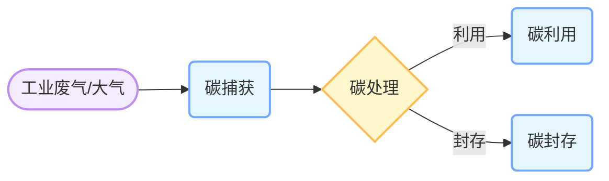

# 价值投资中的碳捕获与利用技术分析

> 关键词：价值投资、碳捕获与利用技术、气候变化、能源转型、投资策略

> 摘要：本文聚焦于价值投资视角下的碳捕获与利用（CCUS）技术。随着全球对气候变化问题的关注度不断提升，CCUS技术作为应对碳排放的关键手段，其商业潜力日益凸显。文章将深入剖析CCUS技术的核心概念、算法原理、数学模型，通过项目实战案例展示其应用，探讨实际应用场景，并推荐相关的学习资源、开发工具和研究论文。旨在为价值投资者提供全面的CCUS技术分析，助力其把握投资机会，同时为应对全球气候变化贡献力量。

## 1. 背景介绍 
### 1.1 目的和范围
本文旨在从价值投资的角度全面分析碳捕获与利用（CCUS）技术。具体目的包括：深入了解CCUS技术的原理、发展现状和应用前景；评估CCUS技术在价值投资中的潜力和风险；为投资者提供基于CCUS技术的投资策略和建议。范围涵盖CCUS技术的各个方面，包括技术原理、核心算法、数学模型、项目实战、应用场景以及相关的工具和资源。

### 1.2 预期读者
本文的预期读者主要包括价值投资者、金融分析师、能源行业从业者、科研人员以及对气候变化和可持续发展感兴趣的人士。投资者可以从中获取关于CCUS技术的投资信息和决策依据；金融分析师可以利用本文的分析框架评估相关企业的价值；能源行业从业者可以了解CCUS技术在行业中的应用和发展趋势；科研人员可以参考本文的技术原理和研究成果进行进一步的研究；对气候变化和可持续发展感兴趣的人士可以通过本文了解CCUS技术在应对气候变化中的重要作用。

### 1.3 文档结构概述
本文将按照以下结构进行组织：首先介绍CCUS技术的背景和相关概念，包括目的和范围、预期读者、文档结构概述以及术语表；接着阐述CCUS技术的核心概念与联系，通过文本示意图和Mermaid流程图展示其原理和架构；然后详细讲解CCUS技术的核心算法原理和具体操作步骤，并使用Python源代码进行说明；随后介绍CCUS技术的数学模型和公式，并通过举例进行详细讲解；通过项目实战案例展示CCUS技术的实际应用，包括开发环境搭建、源代码实现和代码解读；探讨CCUS技术的实际应用场景；推荐相关的学习资源、开发工具和研究论文；最后总结CCUS技术的未来发展趋势与挑战，并提供常见问题与解答和扩展阅读参考资料。

### 1.4 术语表
#### 1.4.1 核心术语定义
- **碳捕获与利用（CCUS）技术**：指将二氧化碳（CO₂）从工业生产、能源利用等过程中分离出来，并加以利用或封存的一系列技术。
- **价值投资**：一种投资策略，通过对企业的基本面进行分析，寻找被低估的股票或资产，以获得长期的投资回报。
- **气候变化**：指由于人类活动排放温室气体导致的全球气候系统的变化，主要表现为全球气温升高、海平面上升、极端气候事件增加等。
- **能源转型**：指从传统的化石能源向清洁能源和可再生能源的转变过程，以减少碳排放，实现可持续发展。

#### 1.4.2 相关概念解释
- **碳捕获**：将CO₂从工业废气或大气中分离出来的过程，常见的方法包括吸收法、吸附法、膜分离法等。
- **碳利用**：将捕获的CO₂转化为有用的产品或资源的过程，例如生产化学品、燃料、建筑材料等。
- **碳封存**：将捕获的CO₂储存于地下地质构造或海洋中的过程，以实现长期的碳减排。

#### 1.4.3 缩略词列表
- **CCUS**：Carbon Capture, Utilization and Storage（碳捕获与利用）
- **CO₂**：Carbon Dioxide（二氧化碳）
- **IGCC**：Integrated Gasification Combined Cycle（整体煤气化联合循环）
- **CCS**：Carbon Capture and Storage（碳捕获与封存）

## 2. 核心概念与联系 

### 核心概念原理
碳捕获与利用（CCUS）技术的核心原理是通过一系列的物理、化学过程将二氧化碳（CO₂）从工业废气或大气中分离出来，并将其转化为有用的产品或进行封存。具体来说，CCUS技术包括以下三个主要环节：

1. **碳捕获**：碳捕获是CCUS技术的第一步，其目的是将CO₂从工业废气或大气中分离出来。常见的碳捕获方法包括吸收法、吸附法、膜分离法等。吸收法是利用化学吸收剂与CO₂发生化学反应，将其从废气中吸收下来；吸附法是利用吸附剂对CO₂的吸附作用，将其从废气中分离出来；膜分离法是利用具有选择性透过性的膜，将CO₂从废气中分离出来。

2. **碳利用**：碳利用是将捕获的CO₂转化为有用的产品或资源的过程。常见的碳利用方式包括生产化学品、燃料、建筑材料等。例如，将CO₂与氢气反应可以生产甲醇、甲烷等燃料；将CO₂注入混凝土中可以提高混凝土的强度和耐久性。

3. **碳封存**：碳封存是将捕获的CO₂储存于地下地质构造或海洋中的过程，以实现长期的碳减排。常见的碳封存方式包括地质封存、海洋封存等。地质封存是将CO₂注入地下深部咸水层、枯竭的油气藏等地质构造中；海洋封存是将CO₂注入海洋深处，使其溶解于海水中。

### 架构的文本示意图
```plaintext
                ┌───────────────┐
                │  工业废气/大气  │
                └───────────────┘
                        │
                        ▼
                ┌───────────────┐
                │    碳捕获    │
                └───────────────┘
                        │
                        ▼
         ┌─────────────────────────────┐
         │                             │
         │ ┌───────────────┐   ┌───────────────┐
         │ │    碳利用    │   │    碳封存    │
         │ └───────────────┘   └───────────────┘
         │                             │
         └─────────────────────────────┘
```

### Mermaid流程图


## 3. 核心算法原理 & 具体操作步骤 

### 核心算法原理
在碳捕获过程中，以吸收法为例，涉及到化学反应的平衡计算和传质过程的模拟。假设使用化学吸收剂（如乙醇胺）吸收CO₂，其主要化学反应为：

$2C_2H_5NH_2 + CO_2 + H_2O \rightleftharpoons (C_2H_5NH_3)_2CO_3$

为了模拟这个过程，我们可以使用质量守恒定律和化学反应动力学原理。质量守恒定律表示在化学反应中，反应物的总质量等于生成物的总质量。化学反应动力学原理描述了化学反应的速率与反应物浓度之间的关系。

### 具体操作步骤
以下是一个简单的Python代码示例，用于模拟吸收法碳捕获过程中CO₂的吸收量：

```python
import numpy as np

# 定义初始条件
initial_co2_concentration = 0.1  # 初始CO₂浓度（mol/L）
absorbent_concentration = 1.0  # 吸收剂浓度（mol/L）
reaction_rate_constant = 0.01  # 反应速率常数（L/mol·s）
time_steps = 100  # 时间步数
time_interval = 0.1  # 时间间隔（s）

# 初始化数组
co2_concentration = np.zeros(time_steps)
co2_concentration[0] = initial_co2_concentration

# 模拟吸收过程
for i in range(1, time_steps):
    # 计算反应速率
    reaction_rate = reaction_rate_constant * co2_concentration[i - 1] * absorbent_concentration
    # 更新CO₂浓度
    co2_concentration[i] = co2_concentration[i - 1] - reaction_rate * time_interval

# 输出结果
for i in range(time_steps):
    print(f"Time: {i * time_interval:.1f} s, CO₂ Concentration: {co2_concentration[i]:.4f} mol/L")
```

### 代码解释
1. **初始条件定义**：定义了初始CO₂浓度、吸收剂浓度、反应速率常数、时间步数和时间间隔。
2. **数组初始化**：创建一个长度为`time_steps`的数组`co2_concentration`，并将初始CO₂浓度赋值给数组的第一个元素。
3. **模拟吸收过程**：使用循环模拟吸收过程，在每个时间步中，计算反应速率，并根据反应速率更新CO₂浓度。
4. **结果输出**：输出每个时间步的时间和CO₂浓度。

## 4. 数学模型和公式 & 详细讲解 & 举例说明 

### 数学模型和公式
在碳捕获与利用技术中，涉及到多个数学模型和公式。以下是一些常见的模型和公式：

#### 化学反应平衡模型
对于一个可逆化学反应$aA + bB \rightleftharpoons cC + dD$，其平衡常数$K$可以表示为：

$$K = \frac{[C]^c[D]^d}{[A]^a[B]^b}$$

其中，$[A]$、$[B]$、$[C]$、$[D]$分别表示反应物和生成物的浓度。

#### 传质模型
在碳捕获过程中，传质过程是一个重要的环节。传质速率$N$可以用菲克定律表示：

$$N = -D\frac{dC}{dz}$$

其中，$D$是扩散系数，$\frac{dC}{dz}$是浓度梯度。

### 详细讲解
#### 化学反应平衡模型
化学反应平衡模型描述了化学反应达到平衡时反应物和生成物的浓度关系。平衡常数$K$是一个与温度有关的常数，它反映了化学反应的进行程度。当$K$值较大时，说明反应向右进行的程度较大，即生成物的浓度较高；当$K$值较小时，说明反应向左进行的程度较大，即反应物的浓度较高。

#### 传质模型
传质模型描述了物质在介质中传递的速率。菲克定律表明，传质速率与扩散系数和浓度梯度成正比。扩散系数$D$是一个与物质的性质和介质有关的常数，它反映了物质在介质中扩散的能力。浓度梯度$\frac{dC}{dz}$表示物质浓度在空间上的变化率，它是传质的驱动力。

### 举例说明
假设我们有一个简单的化学反应$A + B \rightleftharpoons C$，初始时$[A] = 1.0$ mol/L，$[B] = 1.0$ mol/L，$[C] = 0$ mol/L，平衡常数$K = 10$。我们可以通过求解化学反应平衡模型来计算平衡时各物质的浓度。

设平衡时$[A] = x$ mol/L，$[B] = x$ mol/L，$[C] = 1 - x$ mol/L，则有：

$$K = \frac{[C]}{[A][B]} = \frac{1 - x}{x^2} = 10$$

解这个方程可以得到$x$的值，进而得到平衡时各物质的浓度。

```python
import sympy as sp

# 定义变量
x = sp.Symbol('x')

# 定义方程
equation = (1 - x) / (x**2) - 10

# 解方程
solutions = sp.solve(equation, x)

# 筛选合理的解
for solution in solutions:
    if solution > 0 and solution < 1:
        equilibrium_A = solution
        equilibrium_B = solution
        equilibrium_C = 1 - solution
        print(f"Equilibrium Concentration of A: {equilibrium_A:.4f} mol/L")
        print(f"Equilibrium Concentration of B: {equilibrium_B:.4f} mol/L")
        print(f"Equilibrium Concentration of C: {equilibrium_C:.4f} mol/L")
```

## 5. 项目实战：代码实际案例和详细解释说明 

### 5.1  开发环境搭建
为了进行碳捕获与利用技术的项目实战，我们需要搭建一个开发环境。以下是搭建开发环境的步骤：

1. **安装Python**：Python是一种广泛使用的编程语言，我们可以从Python官方网站（https://www.python.org/downloads/）下载并安装Python。
2. **安装必要的库**：在Python中，我们可以使用一些库来进行科学计算和数据分析，例如NumPy、SciPy、Pandas等。可以使用以下命令来安装这些库：

```sh
pip install numpy scipy pandas
```

3. **安装集成开发环境（IDE）**：为了方便代码的编写和调试，我们可以安装一个集成开发环境，例如PyCharm、Jupyter Notebook等。

### 5.2  源代码详细实现和代码解读
以下是一个完整的Python代码示例，用于模拟一个简单的碳捕获与利用系统：

```python
import numpy as np
import matplotlib.pyplot as plt

# 定义参数
initial_co2_emission = 100  # 初始CO₂排放量（吨/年）
capture_efficiency = 0.8  # 碳捕获效率
utilization_ratio = 0.5  # 碳利用比例
time_years = 20  # 模拟时间（年）
annual_growth_rate = 0.02  # CO₂排放量年增长率

# 初始化数组
co2_emission = np.zeros(time_years)
co2_captured = np.zeros(time_years)
co2_utilized = np.zeros(time_years)
co2_emission[0] = initial_co2_emission

# 模拟过程
for i in range(1, time_years):
    # 计算当年的CO₂排放量
    co2_emission[i] = co2_emission[i - 1] * (1 + annual_growth_rate)
    # 计算当年的CO₂捕获量
    co2_captured[i] = co2_emission[i] * capture_efficiency
    # 计算当年的CO₂利用量
    co2_utilized[i] = co2_captured[i] * utilization_ratio

# 绘制图表
years = np.arange(time_years)
plt.plot(years, co2_emission, label='CO₂ Emission')
plt.plot(years, co2_captured, label='CO₂ Captured')
plt.plot(years, co2_utilized, label='CO₂ Utilized')
plt.xlabel('Year')
plt.ylabel('CO₂ (tons/year)')
plt.title('Carbon Capture and Utilization Simulation')
plt.legend()
plt.grid(True)
plt.show()
```

### 代码解读与分析
1. **参数定义**：定义了初始CO₂排放量、碳捕获效率、碳利用比例、模拟时间和CO₂排放量年增长率等参数。
2. **数组初始化**：创建了三个数组`co2_emission`、`co2_captured`和`co2_utilized`，分别用于存储每年的CO₂排放量、捕获量和利用量。
3. **模拟过程**：使用循环模拟了20年的碳捕获与利用过程，在每个年份中，计算当年的CO₂排放量、捕获量和利用量。
4. **图表绘制**：使用`matplotlib`库绘制了CO₂排放量、捕获量和利用量随时间变化的图表，方便直观地观察模拟结果。

## 6. 实际应用场景 
碳捕获与利用（CCUS）技术具有广泛的实际应用场景，以下是一些主要的应用场景：

### 电力行业
在电力行业中，CCUS技术可以应用于燃煤电厂、燃气电厂等。通过在电厂中安装碳捕获设备，可以将燃烧产生的CO₂捕获并进行利用或封存，从而减少电厂的碳排放。例如，美国的一些燃煤电厂已经开始试点使用CCUS技术，将捕获的CO₂用于提高石油采收率。

### 工业生产
在工业生产中，CCUS技术可以应用于钢铁、水泥、化工等行业。这些行业是碳排放的大户，通过采用CCUS技术，可以有效降低其碳排放。例如，在钢铁生产过程中，可以将高炉煤气中的CO₂捕获并进行利用，生产甲醇等化学品；在水泥生产过程中，可以将窑尾废气中的CO₂捕获并注入混凝土中，提高混凝土的强度和耐久性。

### 石油开采
在石油开采中，CCUS技术可以用于提高石油采收率（EOR）。将捕获的CO₂注入油藏中，可以降低原油的粘度，增加油藏的压力，从而提高石油的采收率。同时，注入的CO₂可以被油藏封存，实现碳减排的目的。目前，美国、加拿大等国家已经广泛应用CO₂-EOR技术。

### 农业领域
在农业领域中，CCUS技术可以用于温室气体减排和土壤改良。将捕获的CO₂注入土壤中，可以增加土壤的碳含量，改善土壤结构，提高土壤肥力。同时，CO₂还可以作为肥料，促进植物的生长。例如，在一些温室大棚中，可以使用CO₂施肥技术，提高作物的产量和品质。

## 7. 工具和资源推荐
### 7.1 学习资源推荐
#### 7.1.1 书籍推荐
- 《碳捕获与封存技术》：本书系统介绍了碳捕获与封存技术的原理、方法和应用，是学习CCUS技术的经典教材。
- 《气候变化经济学》：本书从经济学的角度探讨了气候变化问题，包括碳减排的成本和效益分析，对于理解CCUS技术在应对气候变化中的作用具有重要意义。
- 《能源转型：从化石能源到可再生能源》：本书介绍了能源转型的背景、现状和趋势，以及CCUS技术在能源转型中的地位和作用。

#### 7.1.2 在线课程
- Coursera上的“Carbon Capture and Storage”课程：该课程由国际知名学者授课，系统介绍了碳捕获与封存技术的原理、技术和应用。
- edX上的“Climate Change and Energy Policy”课程：该课程从政策的角度探讨了气候变化问题和能源转型，对于理解CCUS技术的政策环境具有重要意义。
- Udemy上的“Renewable Energy and Sustainable Development”课程：该课程介绍了可再生能源的发展现状和趋势，以及CCUS技术在可持续发展中的作用。

#### 7.1.3 技术博客和网站
- Carbon Capture Journal：该网站是CCUS技术领域的专业媒体，提供了最新的技术资讯、研究成果和市场动态。
- International Energy Agency (IEA)：IEA是国际能源领域的权威机构，其网站提供了丰富的能源数据、政策分析和研究报告，包括CCUS技术相关的内容。
- Clean Energy Pipeline：该网站专注于清洁能源领域的项目信息和投资机会，提供了CCUS技术项目的详细信息和分析。

### 7.2 开发工具框架推荐
#### 7.2.1 IDE和编辑器
- PyCharm：一款专业的Python集成开发环境，提供了丰富的代码编辑、调试和分析功能，适合进行CCUS技术相关的Python代码开发。
- Jupyter Notebook：一种交互式的开发环境，支持Python、R等多种编程语言，适合进行数据探索、模型开发和结果展示，非常适合CCUS技术的研究和开发。
- Visual Studio Code：一款轻量级的代码编辑器，支持多种编程语言和插件，具有强大的代码编辑和调试功能，适合进行CCUS技术相关的代码开发。

#### 7.2.2 调试和性能分析工具
- Py-Spy：一款用于Python代码性能分析的工具，可以实时监测Python程序的CPU使用率、函数调用次数等信息，帮助开发者找出性能瓶颈。
- cProfile：Python标准库中的性能分析工具，可以对Python程序进行详细的性能分析，包括函数调用时间、调用次数等信息。
- TensorBoard：一款用于深度学习模型可视化和性能分析的工具，可以用于CCUS技术中涉及到的机器学习和深度学习模型的调试和分析。

#### 7.2.3 相关框架和库
- NumPy：Python中用于科学计算的基础库，提供了高效的数组操作和数学函数，适合进行CCUS技术中的数值计算和模拟。
- SciPy：Python中用于科学计算和数据分析的库，提供了丰富的数值算法和工具，适合进行CCUS技术中的优化、插值、积分等计算。
- Pandas：Python中用于数据处理和分析的库，提供了高效的数据结构和数据操作方法，适合进行CCUS技术中的数据清洗、整理和分析。

### 7.3 相关论文著作推荐
#### 7.3.1 经典论文
- "Carbon Capture and Storage: Issues and Prospects"：该论文是CCUS技术领域的经典论文，系统介绍了CCUS技术的原理、技术和应用，以及面临的挑战和前景。
- "The Economics of Carbon Capture and Storage"：该论文从经济学的角度分析了CCUS技术的成本和效益，对于理解CCUS技术的商业可行性具有重要意义。
- "Carbon Capture and Utilization: A Review"：该论文对碳捕获与利用技术进行了全面的综述，包括技术原理、应用场景和发展趋势。

#### 7.3.2 最新研究成果
- "Advances in Carbon Capture Technologies"：该论文介绍了近年来碳捕获技术的最新研究成果，包括新型吸附剂、膜分离技术等。
- "Carbon Utilization for Sustainable Chemical Production"：该论文探讨了碳利用技术在可持续化学生产中的应用，包括CO₂转化为化学品、燃料等。
- "Integrated Carbon Capture, Utilization, and Storage Systems"：该论文研究了集成碳捕获、利用和封存系统的设计和优化，以提高系统的效率和经济性。

#### 7.3.3 应用案例分析
- "Case Studies of Carbon Capture and Storage Projects"：该论文分析了多个碳捕获与封存项目的案例，包括项目的技术方案、成本效益和环境影响。
- "Carbon Utilization in the Industrial Sector: Case Studies"：该论文介绍了碳利用技术在工业领域的应用案例，包括钢铁、水泥、化工等行业。
- "Carbon Capture and Utilization in the Energy Sector: Case Studies"：该论文分析了碳捕获与利用技术在能源领域的应用案例，包括电力、石油等行业。

## 8. 总结：未来发展趋势与挑战
### 未来发展趋势
- **技术创新加速**：随着科技的不断进步，CCUS技术将不断创新和改进。新型的碳捕获材料、高效的碳利用工艺和安全可靠的碳封存技术将不断涌现，提高CCUS技术的效率和经济性。
- **与可再生能源融合**：CCUS技术将与可再生能源技术（如太阳能、风能、水能等）深度融合。通过将可再生能源产生的电力用于碳捕获和利用过程，可以实现零碳或低碳的能源生产和利用。
- **政策支持加强**：全球各国政府将进一步加强对CCUS技术的政策支持。制定更加严格的碳排放政策和法规，提供财政补贴和税收优惠等激励措施，推动CCUS技术的大规模应用。
- **国际合作加深**：CCUS技术是一个全球性的问题，需要各国之间加强合作。国际组织和各国政府将加强在CCUS技术研发、示范和推广方面的合作，共同应对气候变化挑战。

### 挑战
- **成本较高**：目前，CCUS技术的成本仍然较高，限制了其大规模应用。需要进一步降低碳捕获、利用和封存的成本，提高CCUS技术的经济性。
- **技术可靠性**：CCUS技术涉及到复杂的物理、化学过程和工程系统，其技术可靠性需要进一步提高。确保碳捕获设备的长期稳定运行、碳利用产品的质量和碳封存的安全性是面临的重要挑战。
- **公众接受度**：公众对CCUS技术的接受度也是一个重要问题。需要加强对CCUS技术的宣传和科普，提高公众对其安全性和环境效益的认识，增强公众的接受度。
- **政策不确定性**：政策的不确定性也会影响CCUS技术的发展。政府的碳排放政策、财政补贴政策等可能会发生变化，给CCUS技术的投资和应用带来风险。

## 9. 附录：常见问题与解答
### 1. CCUS技术能完全解决气候变化问题吗？
CCUS技术是应对气候变化的重要手段之一，但不能完全解决气候变化问题。它可以有效减少工业和能源领域的碳排放，但还需要结合其他措施，如发展可再生能源、提高能源效率、改变消费模式等，共同应对气候变化挑战。

### 2. CCUS技术的成本高吗？
目前，CCUS技术的成本相对较高，主要包括碳捕获设备的建设和运行成本、碳利用的生产成本和碳封存的监测和管理成本等。但随着技术的不断进步和规模的扩大，成本有望逐渐降低。

### 3. 碳封存安全吗？
碳封存是将捕获的CO₂储存于地下地质构造或海洋中，一般来说是安全的。但需要进行严格的选址、监测和管理，确保CO₂不会泄漏到大气中，对环境和人类健康造成影响。

### 4. CCUS技术有哪些应用前景？
CCUS技术具有广泛的应用前景，包括电力行业、工业生产、石油开采、农业领域等。它可以帮助这些行业降低碳排放，实现可持续发展。

### 5. 如何投资CCUS技术相关项目？
投资CCUS技术相关项目需要考虑多个因素，如技术成熟度、市场需求、政策环境、成本效益等。可以通过投资相关企业的股票、参与项目的股权投资或购买相关的基金等方式进行投资。

## 10. 扩展阅读 & 参考资料
### 扩展阅读
- 《可持续能源——选择的未来》：本书介绍了可持续能源的发展现状和趋势，以及各种能源技术的优缺点，对于理解CCUS技术在能源转型中的作用具有重要参考价值。
- 《气候变化：科学与解决方案》：本书从科学的角度介绍了气候变化的原因、影响和解决方案，包括CCUS技术在应对气候变化中的作用。
- 《能源与文明》：本书探讨了能源与人类文明发展的关系，以及能源转型对社会经济的影响，对于理解CCUS技术的发展背景和意义具有重要启示。

### 参考资料
- International Energy Agency (IEA). Carbon Capture, Utilization and Storage (CCUS) Technology Roadmap.
- Global CCS Institute. CCS Projects Database.
- Intergovernmental Panel on Climate Change (IPCC). Special Report on Global Warming of 1.5°C.

作者：AI天才研究院/AI Genius Institute & 禅与计算机程序设计艺术 /Zen And The Art of Computer Programming