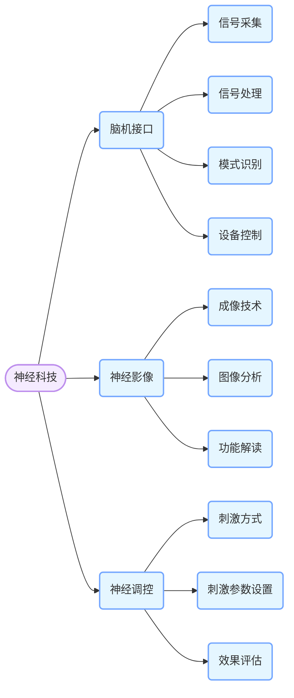

# 价值投资中的神经科技前景分析

> 关键词：价值投资、神经科技、市场前景、技术原理、应用场景

> 摘要：本文聚焦于价值投资视角下的神经科技领域。首先介绍了神经科技的背景知识，包括目的范围、预期读者等。接着阐述了神经科技的核心概念与联系，通过示意图和流程图清晰展示其架构。详细讲解了神经科技相关的核心算法原理及具体操作步骤，结合Python代码进行说明。还给出了数学模型和公式，并举例分析。通过项目实战案例，深入解读代码实现。探讨了神经科技的实际应用场景，推荐了学习资源、开发工具框架以及相关论文著作。最后总结了神经科技未来的发展趋势与挑战，解答了常见问题并提供扩展阅读和参考资料，旨在为价值投资者全面剖析神经科技领域的投资前景。

## 1. 背景介绍 
### 1.1 目的和范围
本文章的主要目的是从价值投资的角度深入分析神经科技领域的发展前景。价值投资强调寻找具有长期增长潜力和内在价值的投资标的，而神经科技作为一个新兴且具有巨大潜力的领域，正逐渐受到投资者的关注。我们将探讨神经科技的核心技术、市场趋势、应用场景等方面，评估其在未来投资中的价值。范围涵盖了神经科技的各个主要分支，包括但不限于脑机接口、神经影像、神经调控等技术，以及它们在医疗、娱乐、教育等领域的应用。

### 1.2 预期读者
本文预期读者主要包括价值投资者、金融分析师、科技爱好者以及对神经科技领域感兴趣的专业人士。对于投资者来说，希望通过本文了解神经科技的投资机会和风险；金融分析师可以从中获取行业数据和趋势分析，为客户提供更专业的投资建议；科技爱好者能够深入了解神经科技的前沿知识；专业人士则可以在技术和应用方面进行交流和探讨。

### 1.3 文档结构概述
本文将按照以下结构展开：首先介绍神经科技的背景知识，包括术语和相关概念。接着阐述核心概念与联系，通过文本示意图和Mermaid流程图展示其架构。详细讲解核心算法原理和具体操作步骤，结合Python代码进行说明。给出数学模型和公式，并举例分析。通过项目实战案例，深入解读代码实现。探讨神经科技的实际应用场景，推荐学习资源、开发工具框架以及相关论文著作。最后总结神经科技未来的发展趋势与挑战，解答常见问题并提供扩展阅读和参考资料。

### 1.4 术语表
#### 1.4.1 核心术语定义
- **神经科技（Neurotechnology）**：是指与神经系统相关的一系列技术，包括对神经系统的监测、诊断、治疗和干预等方面的技术。
- **脑机接口（Brain-Computer Interface, BCI）**：是一种在大脑和外部设备之间建立直接通信通道的技术，允许大脑信号直接控制外部设备。
- **神经影像（Neuroimaging）**：是指利用各种成像技术来观察和研究大脑结构和功能的方法，如磁共振成像（MRI）、正电子发射断层扫描（PET）等。
- **神经调控（Neuromodulation）**：是指通过物理或化学手段对神经系统的活动进行调节的技术，如深部脑刺激（DBS）、经颅磁刺激（TMS）等。

#### 1.4.2 相关概念解释
- **神经元（Neuron）**：是神经系统的基本结构和功能单位，能够接收、处理和传递信息。
- **神经递质（Neurotransmitter）**：是神经元之间传递信息的化学物质，如多巴胺、血清素等。
- **神经网络（Neural Network）**：是由大量神经元相互连接形成的网络，能够模拟大脑的信息处理过程。

#### 1.4.3 缩略词列表
- **BCI**：Brain-Computer Interface（脑机接口）
- **MRI**：Magnetic Resonance Imaging（磁共振成像）
- **PET**：Positron Emission Tomography（正电子发射断层扫描）
- **DBS**：Deep Brain Stimulation（深部脑刺激）
- **TMS**：Transcranial Magnetic Stimulation（经颅磁刺激）

## 2. 核心概念与联系 

### 核心概念原理
神经科技的核心在于对神经系统的理解和干预。神经系统是人体最为复杂和精密的系统之一，由神经元组成的神经网络负责接收、处理和传递信息。神经科技的目标是通过各种技术手段来监测、调控和修复神经系统的功能。

脑机接口技术基于对大脑电信号的采集和分析。大脑中的神经元在活动时会产生微弱的电信号，通过电极可以将这些信号记录下来。然后，利用信号处理和机器学习算法对这些信号进行分析和解读，从而实现大脑与外部设备的交互。

神经影像技术则是通过不同的成像原理来观察大脑的结构和功能。例如，磁共振成像（MRI）利用原子核在磁场内共振所产生的信号经重建成像的一种检查方法，可以清晰地显示大脑的解剖结构；正电子发射断层扫描（PET）则可以通过检测大脑内放射性示踪剂的分布来反映大脑的代谢活动。

神经调控技术通过物理或化学手段来调节神经系统的活动。深部脑刺激（DBS）是将电极植入大脑特定区域，通过电刺激来调节神经元的活动，常用于治疗帕金森病等神经系统疾病；经颅磁刺激（TMS）则是通过外部磁场刺激大脑皮层，调节神经元的兴奋性，可用于治疗抑郁症等精神疾病。

### 架构的文本示意图
```plaintext
神经科技
|-- 脑机接口
|   |-- 信号采集（电极）
|   |-- 信号处理（滤波、特征提取）
|   |-- 模式识别（机器学习算法）
|   |-- 设备控制
|-- 神经影像
|   |-- 成像技术（MRI、PET等）
|   |-- 图像分析（分割、配准）
|   |-- 功能解读
|-- 神经调控
|   |-- 刺激方式（电刺激、磁刺激）
|   |-- 刺激参数设置
|   |-- 效果评估
```

### Mermaid 流程图


## 3. 核心算法原理 & 具体操作步骤 

### 脑机接口中的信号处理算法
在脑机接口中，信号处理是关键的一步。下面我们以Python代码为例，介绍一种常见的信号处理算法——带通滤波。

```python
import numpy as np
import scipy.signal as signal
import matplotlib.pyplot as plt

# 生成模拟脑电信号
fs = 250  # 采样频率
t = np.linspace(0, 1, fs, endpoint=False)
signal_original = np.sin(2 * np.pi * 10 * t) + np.sin(2 * np.pi * 50 * t)  # 包含10Hz和50Hz的信号

# 设计带通滤波器
lowcut = 8  # 低频截止频率
highcut = 30  # 高频截止频率
nyquist = 0.5 * fs
low = lowcut / nyquist
high = highcut / nyquist
b, a = signal.butter(4, [low, high], btype='band')

# 应用滤波器
signal_filtered = signal.lfilter(b, a, signal_original)

# 绘制原始信号和滤波后的信号
plt.figure(figsize=(12, 6))
plt.subplot(2, 1, 1)
plt.plot(t, signal_original)
plt.title('Original Signal')
plt.xlabel('Time (s)')
plt.ylabel('Amplitude')

plt.subplot(2, 1, 2)
plt.plot(t, signal_filtered)
plt.title('Filtered Signal')
plt.xlabel('Time (s)')
plt.ylabel('Amplitude')

plt.tight_layout()
plt.show()
```

### 具体操作步骤
1. **信号采集**：使用电极等设备采集大脑的电信号。
2. **信号预处理**：对采集到的信号进行滤波、去噪等处理，以提高信号质量。例如，使用带通滤波器去除高频噪声和低频漂移。
3. **特征提取**：从预处理后的信号中提取有用的特征，如时域特征（均值、方差等）、频域特征（功率谱等）。
4. **模式识别**：使用机器学习或深度学习算法对提取的特征进行分类或回归分析，以识别不同的大脑状态或意图。例如，使用支持向量机（SVM）进行二分类任务。
5. **设备控制**：根据模式识别的结果，控制外部设备的动作，如控制轮椅的移动、假肢的运动等。

## 4. 数学模型和公式 & 详细讲解 & 举例说明 

### 带通滤波器的数学模型
带通滤波器是一种允许特定频率范围内的信号通过，而抑制其他频率信号的滤波器。在上述代码中，我们使用了巴特沃斯（Butterworth）滤波器，其传递函数的一般形式为：

$$H(s)=\frac{1}{\sqrt{1 + (\frac{s}{\omega_c})^{2n}}}$$

其中，$s$ 是复频率，$\omega_c$ 是截止频率，$n$ 是滤波器的阶数。

在离散时间域中，我们使用差分方程来实现滤波器。对于二阶巴特沃斯带通滤波器，其差分方程为：

$$y[n] = b_0x[n] + b_1x[n - 1] + b_2x[n - 2] - a_1y[n - 1] - a_2y[n - 2]$$

其中，$x[n]$ 是输入信号，$y[n]$ 是输出信号，$b_0, b_1, b_2$ 和 $a_1, a_2$ 是滤波器的系数。

### 举例说明
假设我们有一个包含10Hz和50Hz成分的信号，我们希望通过带通滤波器只保留8 - 30Hz的信号成分。在上述Python代码中，我们首先生成了模拟信号 `signal_original`，然后设计了一个四阶巴特沃斯带通滤波器，其低频截止频率为8Hz，高频截止频率为30Hz。最后，我们将滤波器应用到原始信号上，得到滤波后的信号 `signal_filtered`。通过绘制原始信号和滤波后的信号，我们可以直观地看到滤波器的效果，50Hz的成分被有效抑制，只保留了10Hz的信号成分。

## 5. 项目实战：代码实际案例和详细解释说明 

### 5.1  开发环境搭建
#### 硬件环境
- **脑电采集设备**：如OpenBCI、Emotiv等，用于采集大脑的电信号。
- **计算机**：具备一定的计算能力，建议使用多核处理器和足够的内存。

#### 软件环境
- **操作系统**：Windows、Linux或macOS。
- **Python环境**：建议使用Python 3.7及以上版本，可以通过Anaconda进行安装和管理。
- **相关库**：安装 `numpy`、`scipy`、`matplotlib`、`scikit-learn` 等库，用于信号处理、机器学习和可视化。可以使用以下命令进行安装：
```bash
pip install numpy scipy matplotlib scikit-learn
```

### 5.2  源代码详细实现和代码解读
下面我们实现一个简单的脑机接口项目，通过采集脑电信号来控制一个虚拟的光标移动。

```python
import numpy as np
import scipy.signal as signal
from sklearn.svm import SVC
import matplotlib.pyplot as plt

# 模拟脑电信号采集
def simulate_eeg_signal():
    fs = 250  # 采样频率
    t = np.linspace(0, 1, fs, endpoint=False)
    # 模拟不同大脑状态的信号
    signal_left = np.sin(2 * np.pi * 12 * t) + np.random.normal(0, 0.1, fs)
    signal_right = np.sin(2 * np.pi * 15 * t) + np.random.normal(0, 0.1, fs)
    return signal_left, signal_right

# 信号处理
def preprocess_signal(signal):
    lowcut = 8
    highcut = 30
    nyquist = 0.5 * 250
    low = lowcut / nyquist
    high = highcut / nyquist
    b, a = signal.butter(4, [low, high], btype='band')
    filtered_signal = signal.lfilter(b, a, signal)
    return filtered_signal

# 特征提取
def extract_features(signal):
    mean = np.mean(signal)
    variance = np.var(signal)
    return [mean, variance]

# 训练分类器
def train_classifier():
    signal_left, signal_right = simulate_eeg_signal()
    filtered_left = preprocess_signal(signal_left)
    filtered_right = preprocess_signal(signal_right)
    features_left = extract_features(filtered_left)
    features_right = extract_features(filtered_right)
    X = np.array([features_left, features_right])
    y = np.array([0, 1])
    clf = SVC(kernel='linear')
    clf.fit(X, y)
    return clf

# 实时预测
def real_time_prediction(clf):
    signal, _ = simulate_eeg_signal()
    filtered_signal = preprocess_signal(signal)
    features = extract_features(filtered_signal)
    features = np.array(features).reshape(1, -1)
    prediction = clf.predict(features)
    if prediction[0] == 0:
        print("预测结果：向左移动")
    else:
        print("预测结果：向右移动")

# 主函数
if __name__ == "__main__":
    classifier = train_classifier()
    real_time_prediction(classifier)
```

### 5.3  代码解读与分析
1. **模拟脑电信号采集**：`simulate_eeg_signal` 函数生成模拟的脑电信号，分别模拟向左和向右的大脑状态。
2. **信号处理**：`preprocess_signal` 函数使用带通滤波器对采集到的信号进行预处理，去除噪声和干扰。
3. **特征提取**：`extract_features` 函数从预处理后的信号中提取均值和方差作为特征。
4. **训练分类器**：`train_classifier` 函数使用支持向量机（SVM）对提取的特征进行训练，得到一个分类器。
5. **实时预测**：`real_time_prediction` 函数使用训练好的分类器对实时采集的信号进行预测，判断大脑的意图是向左还是向右。

通过这个项目，我们可以看到一个简单的脑机接口系统的实现流程，包括信号采集、处理、特征提取、分类和预测。

## 6. 实际应用场景 
### 医疗领域
- **神经系统疾病诊断**：神经影像技术如MRI、PET等可以帮助医生观察大脑的结构和功能变化，早期诊断神经系统疾病，如阿尔茨海默病、帕金森病等。
- **神经康复治疗**：脑机接口技术可以帮助瘫痪患者恢复运动功能。通过采集大脑信号，控制外部设备如假肢、轮椅等，实现自主运动。神经调控技术如深部脑刺激（DBS）和经颅磁刺激（TMS）可以用于治疗抑郁症、癫痫等精神疾病和神经系统疾病。
- **药物研发**：神经科技可以用于研究药物对神经系统的作用机制，加速药物研发的进程。例如，通过神经影像技术观察药物对大脑代谢和功能的影响。

### 娱乐领域
- **虚拟现实（VR）和增强现实（AR）**：脑机接口技术可以为VR和AR体验带来更加沉浸式的交互方式。通过检测用户的大脑状态，实时调整虚拟场景的内容和交互方式，提高用户的体验感。
- **游戏开发**：脑机接口技术可以用于开发新型的游戏，玩家可以通过大脑信号控制游戏角色的动作和行为，增加游戏的趣味性和挑战性。

### 教育领域
- **学习状态监测**：通过采集学生的脑电信号，分析学生的学习状态，如注意力、疲劳程度等。教师可以根据监测结果调整教学策略，提高教学效果。
- **个性化学习**：根据学生的大脑特征和学习状态，为学生提供个性化的学习方案和辅导，提高学习效率。

## 7. 工具和资源推荐
### 7.1 学习资源推荐
#### 7.1.1 书籍推荐
- 《神经科学原理》：这是一本经典的神经科学教材，全面介绍了神经系统的结构和功能，对于理解神经科技的基础原理非常有帮助。
- 《脑机接口：原理与实践》：详细介绍了脑机接口技术的原理、方法和应用，是学习脑机接口的重要参考书籍。
- 《神经影像分析》：介绍了神经影像技术的原理和分析方法，对于从事神经影像研究的人员非常有用。

#### 7.1.2 在线课程
- Coursera上的“Neuroscience: The Science of the Brain”：由顶尖大学的教授授课，系统地介绍了神经科学的基础知识。
- edX上的“Brain-Computer Interfaces”：深入讲解了脑机接口技术的原理和应用。
- Udemy上的“Neuroimaging Analysis with Python”：通过Python代码实践，学习神经影像分析的方法。

#### 7.1.3 技术博客和网站
- NeuroTechX：一个专注于神经科技领域的社区，提供最新的技术动态、研究成果和行业资讯。
- BrainTech：分享脑机接口、神经调控等技术的研究和应用案例。
- Scientific American的神经科学板块：发布神经科学领域的前沿研究和科普文章。

### 7.2 开发工具框架推荐
#### 7.2.1 IDE和编辑器
- PyCharm：一个强大的Python集成开发环境，提供代码编辑、调试、版本控制等功能，适合开发神经科技相关的Python项目。
- Jupyter Notebook：一种交互式的开发环境，支持Python代码的编写、运行和可视化，非常适合进行数据分析和模型训练。

#### 7.2.2 调试和性能分析工具
- Spyder：一个轻量级的Python开发环境，具有调试和性能分析功能，方便开发者调试代码和优化性能。
- Profiler：Python自带的性能分析工具，可以帮助开发者找出代码中的性能瓶颈。

#### 7.2.3 相关框架和库
- MNE-Python：一个用于处理和分析脑电、脑磁等神经电生理信号的Python库，提供了丰富的信号处理和分析功能。
- Nilearn：一个用于神经影像数据分析的Python库，支持多种神经影像数据格式的读取和处理。
- TensorFlow和PyTorch：深度学习框架，可用于构建和训练神经科技相关的机器学习模型。

### 7.3 相关论文著作推荐
#### 7.3.1 经典论文
- “Decoding motor imagery using recurrent neural networks”：介绍了使用循环神经网络解码运动想象信号的方法，为脑机接口技术的发展提供了新的思路。
- “The human connectome: a structural description of the human brain”：提出了人类连接组的概念，对于理解大脑的结构和功能具有重要意义。
- “Deep brain stimulation for Parkinson's disease: a systematic review and meta-analysis”：对深部脑刺激治疗帕金森病的效果进行了系统评价和Meta分析，为临床应用提供了参考依据。

#### 7.3.2 最新研究成果
- 关注顶级学术期刊如《Nature》、《Science》、《Neuron》等上发表的神经科技相关研究论文，了解最新的研究动态和技术突破。
- 参加国际学术会议如IEEE Engineering in Medicine and Biology Society (EMBC)、Annual Conference of the International Neural Network Society (INNS)等，与领域内的专家学者交流最新的研究成果。

#### 7.3.3 应用案例分析
- 阅读商业媒体和行业报告，了解神经科技在医疗、娱乐、教育等领域的实际应用案例和市场前景。
- 分析成功的创业公司和项目，学习他们的商业模式和技术应用，为投资和创业提供参考。

## 8. 总结：未来发展趋势与挑战
### 未来发展趋势
- **技术融合**：神经科技将与人工智能、大数据、物联网等技术深度融合，实现更加智能化和个性化的应用。例如，结合人工智能算法对神经影像数据进行分析，提高疾病诊断的准确性；通过物联网技术实现脑机接口设备的远程监控和管理。
- **跨学科合作**：神经科技的发展需要神经科学、计算机科学、工程学、医学等多个学科的合作。未来，跨学科研究团队将不断涌现，推动神经科技的快速发展。
- **市场扩大**：随着人们对健康和生活质量的关注度不断提高，神经科技的市场需求将不断扩大。特别是在医疗领域，神经科技将为神经系统疾病的诊断和治疗提供更加有效的手段，具有巨大的市场潜力。

### 挑战
- **技术瓶颈**：目前，神经科技还面临一些技术瓶颈，如脑电信号的采集精度、信号处理算法的准确性、神经调控技术的安全性等。需要进一步研究和开发新的技术来解决这些问题。
- **伦理和法律问题**：神经科技的发展也带来了一系列伦理和法律问题，如大脑隐私保护、脑机接口技术的滥用、神经调控技术的伦理界限等。需要建立相应的伦理和法律框架来规范神经科技的发展。
- **投资风险**：神经科技是一个高风险、高回报的领域。由于技术研发周期长、不确定性大，投资神经科技项目存在一定的风险。投资者需要具备专业的知识和风险意识，谨慎选择投资项目。

## 9. 附录：常见问题与解答
### 问题1：神经科技投资的风险有哪些？
答：神经科技投资的风险主要包括技术风险、市场风险、伦理和法律风险等。技术方面，神经科技还处于发展阶段，存在技术瓶颈和不确定性，研发失败的可能性较大。市场方面，神经科技产品的市场接受度和推广难度较大，可能面临市场竞争和政策风险。伦理和法律方面，神经科技的发展可能引发一系列伦理和法律问题，如大脑隐私保护、技术滥用等，可能对投资项目产生不利影响。

### 问题2：脑机接口技术在实际应用中还存在哪些问题？
答：脑机接口技术在实际应用中还存在一些问题，如信号采集的准确性和稳定性、信号处理算法的复杂性和实时性、设备的舒适性和便携性等。此外，脑机接口技术的应用还面临伦理和法律问题，如大脑隐私保护、设备的安全性等。

### 问题3：神经科技的发展对社会会产生哪些影响？
答：神经科技的发展将对社会产生多方面的影响。在医疗领域，神经科技将为神经系统疾病的诊断和治疗提供更加有效的手段，提高人们的健康水平。在娱乐和教育领域，神经科技将带来更加沉浸式和个性化的体验，改变人们的生活方式。然而，神经科技的发展也可能带来一些负面影响，如伦理和法律问题、就业结构的变化等，需要社会各界共同关注和应对。

## 10. 扩展阅读 & 参考资料
### 扩展阅读
- 《思考，快与慢》：介绍了人类思维的两种模式，与神经科技中对大脑认知和决策机制的研究相关。
- 《未来简史：从智人到智神》：探讨了科技发展对人类未来的影响，其中涉及到神经科技等新兴技术。
- 《奇点临近》：提出了技术奇点的概念，分析了科技发展的趋势和影响，对理解神经科技的未来发展有一定的启示。

### 参考资料
- [OpenBCI官方网站](https://openbci.com/)
- [Emotiv官方网站](https://www.emotiv.com/)
- [MNE-Python官方文档](https://mne.tools/stable/index.html)
- [Nilearn官方文档](https://nilearn.github.io/)
- [TensorFlow官方文档](https://www.tensorflow.org/)
- [PyTorch官方文档](https://pytorch.org/)

作者：AI天才研究院/AI Genius Institute & 禅与计算机程序设计艺术 /Zen And The Art of Computer Programming