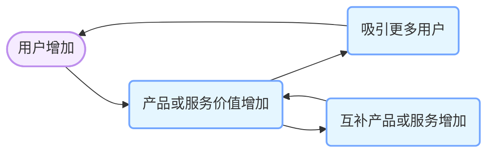

# 价值投资中的网络效应分析

> 关键词：价值投资、网络效应、用户增长、竞争优势、市场估值

> 摘要：本文聚焦于价值投资中的网络效应分析。首先介绍了研究的背景、目的、预期读者和文档结构等内容。详细阐述了网络效应的核心概念与联系，包括其原理、架构，并通过Mermaid流程图展示。深入讲解了核心算法原理及具体操作步骤，同时给出了相关数学模型和公式，并举例说明。通过项目实战，给出代码实际案例及详细解释。探讨了网络效应在实际中的应用场景，推荐了相关的学习资源、开发工具框架和论文著作。最后总结了网络效应在价值投资领域的未来发展趋势与挑战，还设置了附录解答常见问题，并提供扩展阅读和参考资料，旨在帮助投资者深入理解网络效应在价值投资中的重要性和应用方法。

## 1. 背景介绍 
### 1.1 目的和范围
在价值投资领域，准确评估企业的内在价值是关键。而网络效应作为一种能够显著影响企业价值的因素，正逐渐受到投资者的广泛关注。本文章的目的在于深入剖析网络效应在价值投资中的作用机制，帮助投资者更好地识别具有网络效应的企业，并合理评估其价值。范围涵盖了网络效应的基本概念、核心算法、数学模型，以及在实际项目中的应用，同时还会介绍相关的学习资源和工具。

### 1.2 预期读者
本文预期读者主要包括专业的价值投资者、金融分析师、对价值投资感兴趣的初学者，以及从事相关领域研究的学者。无论是希望通过网络效应来优化投资组合的投资者，还是想要深入了解企业价值评估方法的研究者，都能从本文中获得有价值的信息。

### 1.3 文档结构概述
本文将按照以下结构进行阐述：首先介绍核心概念与联系，让读者对网络效应有一个初步的认识；接着讲解核心算法原理和具体操作步骤，为后续的分析提供技术支持；然后给出数学模型和公式，并举例说明；通过项目实战，展示网络效应在实际中的应用；探讨实际应用场景，让读者了解网络效应在不同行业的表现；推荐相关的工具和资源，帮助读者进一步学习和研究；最后总结未来发展趋势与挑战，设置附录解答常见问题，并提供扩展阅读和参考资料。

### 1.4 术语表
#### 1.4.1 核心术语定义
- **价值投资**：一种投资策略，通过分析企业的基本面，寻找被低估的股票，以获取长期的投资回报。
- **网络效应**：指产品或服务的价值随着用户数量的增加而增加的现象。当更多的用户使用某个产品或服务时，它对其他用户的吸引力也会增强，从而形成一个正反馈循环。
- **用户增长**：指在一定时间内，产品或服务的用户数量的增加情况。用户增长是网络效应的一个重要表现，也是评估企业价值的关键指标之一。
- **竞争优势**：企业在市场竞争中相对于竞争对手所具有的优势，网络效应可以帮助企业建立强大的竞争优势。
- **市场估值**：对企业在市场上的价值进行评估的过程，网络效应会对企业的市场估值产生重要影响。

#### 1.4.2 相关概念解释
- **直接网络效应**：指用户数量的增加直接导致产品或服务对其他用户的价值增加。例如，社交网络平台上，用户越多，其他用户就越能方便地与更多人交流，平台的价值也就越高。
- **间接网络效应**：指用户数量的增加通过影响互补产品或服务的供给，从而间接提高产品或服务的价值。例如，操作系统的用户越多，软件开发者就越有动力为该操作系统开发更多的软件，从而提高操作系统的价值。

#### 1.4.3 缩略词列表
- **AI**：Artificial Intelligence，人工智能
- **ML**：Machine Learning，机器学习
- **VC**：Venture Capital，风险投资

## 2. 核心概念与联系 

### 网络效应原理
网络效应的核心原理在于用户数量与产品或服务价值之间的正反馈关系。当一个产品或服务拥有更多的用户时，它会变得更加有用、更有价值，从而吸引更多的用户加入。这种正反馈循环会不断强化，使得产品或服务的价值随着用户数量的增加而呈指数级增长。

例如，在社交网络中，每个用户都希望与更多的人建立联系。当一个社交平台的用户数量很少时，它的吸引力也有限。但随着用户数量的不断增加，新用户加入后能够找到更多的朋友和联系人，平台的价值也随之提高，从而吸引更多的用户加入。

### 网络效应架构
网络效应的架构可以分为三个主要部分：用户、产品或服务、互补产品或服务。用户是网络效应的核心，他们的使用行为决定了产品或服务的价值。产品或服务是连接用户的桥梁，它的功能和特性会影响用户的体验和参与度。互补产品或服务则可以进一步增强产品或服务的价值，例如，手机应用商店中的各种应用程序就是手机操作系统的互补产品。

下面是一个Mermaid流程图，展示了网络效应的架构和正反馈循环：



这个流程图展示了用户增加如何导致产品或服务价值增加，进而吸引更多用户，形成一个正反馈循环。同时，产品或服务价值的增加也会吸引更多的互补产品或服务，进一步提高产品或服务的价值。

## 3. 核心算法原理 & 具体操作步骤 

### 核心算法原理
在价值投资中，评估网络效应的核心算法通常基于用户增长模型和价值评估模型。用户增长模型用于预测产品或服务的用户数量随时间的变化情况，而价值评估模型则用于根据用户数量和其他因素评估企业的价值。

下面是一个简单的用户增长模型的Python代码示例：

```python
import numpy as np
import matplotlib.pyplot as plt

# 定义用户增长模型参数
initial_users = 100  # 初始用户数量
growth_rate = 0.1  # 每月用户增长率
months = 24  # 预测的月数

# 初始化用户数量列表
users = [initial_users]

# 模拟用户增长
for i in range(1, months):
    new_users = users[i - 1] * growth_rate
    total_users = users[i - 1] + new_users
    users.append(total_users)

# 绘制用户增长曲线
plt.plot(range(months), users)
plt.xlabel('Months')
plt.ylabel('Number of Users')
plt.title('User Growth Curve')
plt.show()
```

### 具体操作步骤
1. **数据收集**：收集产品或服务的历史用户数据，包括用户数量、增长率等。
2. **模型选择**：根据数据特点和问题需求，选择合适的用户增长模型和价值评估模型。
3. **参数估计**：使用历史数据估计模型的参数，例如用户增长率、价值系数等。
4. **预测和评估**：使用估计的参数进行用户数量预测和企业价值评估。
5. **敏感性分析**：分析模型参数的变化对预测结果和评估结果的影响，评估模型的稳定性和可靠性。

## 4. 数学模型和公式 & 详细讲解 & 举例说明 

### 数学模型和公式
#### 用户增长模型
常见的用户增长模型包括线性增长模型、指数增长模型和逻辑增长模型。

- **线性增长模型**：$U_t = U_0 + rt$，其中$U_t$表示第$t$期的用户数量，$U_0$表示初始用户数量，$r$表示每期的用户增长率，$t$表示时间。
- **指数增长模型**：$U_t = U_0e^{rt}$，其中$e$是自然常数。
- **逻辑增长模型**：$U_t=\frac{K}{1 + (\frac{K}{U_0}-1)e^{-rt}}$，其中$K$表示市场饱和时的用户数量。

#### 价值评估模型
企业的价值可以表示为用户数量、用户价值和其他因素的函数。一种简单的价值评估模型是：$V = n\times v$，其中$V$表示企业的价值，$n$表示用户数量，$v$表示每个用户的平均价值。

### 详细讲解
线性增长模型假设用户数量随时间呈线性增加，适用于市场处于早期阶段，用户增长较为稳定的情况。指数增长模型假设用户数量随时间呈指数级增加，适用于具有较强网络效应的产品或服务，用户增长速度会越来越快。逻辑增长模型则考虑了市场饱和的因素，当用户数量接近市场饱和时，增长速度会逐渐减缓。

价值评估模型中的用户价值可以根据不同的业务模式进行定义，例如，对于广告驱动的业务，用户价值可以表示为每个用户带来的广告收入；对于订阅制业务，用户价值可以表示为每个用户的订阅费用。

### 举例说明
假设一个社交网络平台的初始用户数量为$1000$，每月用户增长率为$0.1$，市场饱和时的用户数量为$100000$。使用逻辑增长模型预测未来$24$个月的用户数量：

```python
import numpy as np
import matplotlib.pyplot as plt

# 定义参数
U0 = 1000
r = 0.1
K = 100000
t = np.arange(0, 24)

# 计算用户数量
U = K / (1 + ((K / U0) - 1) * np.exp(-r * t))

# 绘制用户增长曲线
plt.plot(t, U)
plt.xlabel('Months')
plt.ylabel('Number of Users')
plt.title('User Growth Curve (Logistic Model)')
plt.show()
```

假设每个用户的平均价值为$10$元，根据价值评估模型计算该社交网络平台在第$24$个月的价值：

```python
V = U[-1] * 10
print(f"企业在第24个月的价值为: {V} 元")
```

## 5. 项目实战：代码实际案例和详细解释说明 

### 5.1  开发环境搭建
为了实现价值投资中的网络效应分析，我们需要搭建一个Python开发环境。以下是具体步骤：

1. **安装Python**：从Python官方网站（https://www.python.org/downloads/）下载并安装Python 3.x版本。
2. **安装必要的库**：使用pip命令安装numpy、matplotlib、pandas等库。
```bash
pip install numpy matplotlib pandas
```

### 5.2  源代码详细实现和代码解读
下面是一个完整的项目实战代码示例，用于分析一个具有网络效应的产品的用户增长和价值评估：

```python
import numpy as np
import matplotlib.pyplot as plt
import pandas as pd

# 定义用户增长模型（逻辑增长模型）
def logistic_growth(U0, r, K, t):
    return K / (1 + ((K / U0) - 1) * np.exp(-r * t))

# 定义价值评估模型
def value_evaluation(n, v):
    return n * v

# 初始化参数
U0 = 1000  # 初始用户数量
r = 0.1  # 每月用户增长率
K = 100000  # 市场饱和时的用户数量
v = 10  # 每个用户的平均价值
months = 24  # 预测的月数

# 生成时间序列
t = np.arange(0, months)

# 计算用户数量
U = logistic_growth(U0, r, K, t)

# 计算企业价值
V = value_evaluation(U, v)

# 绘制用户增长曲线和企业价值曲线
fig, ax1 = plt.subplots()

color = 'tab:red'
ax1.set_xlabel('Months')
ax1.set_ylabel('Number of Users', color=color)
ax1.plot(t, U, color=color)
ax1.tick_params(axis='y', labelcolor=color)

ax2 = ax1.twinx()  # 创建第二个y轴
color = 'tab:blue'
ax2.set_ylabel('Enterprise Value', color=color)
ax2.plot(t, V, color=color)
ax2.tick_params(axis='y', labelcolor=color)

fig.tight_layout()  # 调整布局
plt.show()

# 输出结果
results = pd.DataFrame({'Month': t, 'Number of Users': U, 'Enterprise Value': V})
print(results)
```

### 代码解读与分析
1. **用户增长模型**：`logistic_growth`函数实现了逻辑增长模型，根据初始用户数量、用户增长率、市场饱和用户数量和时间计算用户数量。
2. **价值评估模型**：`value_evaluation`函数根据用户数量和每个用户的平均价值计算企业价值。
3. **参数初始化**：设置初始用户数量、用户增长率、市场饱和用户数量、每个用户的平均价值和预测的月数。
4. **时间序列生成**：使用`np.arange`函数生成时间序列。
5. **用户数量和企业价值计算**：调用`logistic_growth`和`value_evaluation`函数计算用户数量和企业价值。
6. **可视化**：使用`matplotlib`库绘制用户增长曲线和企业价值曲线。
7. **结果输出**：使用`pandas`库将结果保存为DataFrame并输出。

通过这个项目实战，我们可以直观地看到具有网络效应的产品的用户增长和企业价值随时间的变化情况。

## 6. 实际应用场景 
网络效应在许多行业都有广泛的应用，以下是一些常见的实际应用场景：

### 社交网络
社交网络是网络效应最为明显的领域之一。以Facebook为例，随着用户数量的增加，平台上的社交关系变得更加丰富，用户可以更容易地与朋友、家人和同事保持联系。新用户加入时，能够找到更多的联系人，从而提高了平台的吸引力。这种网络效应使得Facebook在社交网络市场占据了主导地位，形成了强大的竞争优势。

### 电子商务
电子商务平台也受益于网络效应。例如，淘宝和京东等平台，随着商家和用户数量的增加，平台上的商品种类更加丰富，用户可以更容易地找到自己需要的商品。同时，商家也可以获得更多的流量和销售机会。这种正反馈循环使得电子商务平台不断发展壮大。

### 在线支付
在线支付领域同样存在网络效应。以支付宝和微信支付为例，随着使用用户的增多，商家更愿意接受这两种支付方式，因为这样可以吸引更多的顾客。而用户也更倾向于使用这两种支付方式，因为它们在更多的场景中都可以使用。这种网络效应使得支付宝和微信支付在在线支付市场占据了主导地位。

### 共享经济
共享经济模式，如共享单车和共享汽车，也具有网络效应。当共享单车的投放数量增加时，用户在更多的地方都可以方便地找到单车，从而提高了使用的便利性。这会吸引更多的用户使用共享单车，进而促使企业投放更多的单车。同样，共享汽车也遵循类似的规律。

## 7. 工具和资源推荐
### 7.1 学习资源推荐
#### 7.1.1 书籍推荐
- 《网络、群体与市场：揭示高度互联世界的行为原理与效应机制》：这本书深入探讨了网络效应在社会、经济和技术领域的应用，是学习网络效应的经典著作。
- 《价值投资：从格雷厄姆到巴菲特》：介绍了价值投资的基本理论和方法，对于理解价值投资中的网络效应有很大的帮助。
- 《创新者的窘境》：探讨了创新和企业竞争的关系，其中涉及到网络效应在企业创新中的作用。

#### 7.1.2 在线课程
- Coursera上的“Networks, Crowds, and Markets”：由康奈尔大学教授讲授，系统介绍了网络效应的理论和应用。
- edX上的“Value Investing: Principles into Practice”：帮助学习者掌握价值投资的实践方法。

#### 7.1.3 技术博客和网站
- Medium上有许多关于价值投资和网络效应的文章，例如“Towards Data Science”和“Data Driven Investor”等专栏。
- Seeking Alpha是一个专业的金融投资网站，提供了大量关于企业价值分析和投资策略的文章。

### 7.2 开发工具框架推荐
#### 7.2.1 IDE和编辑器
- PyCharm：是一款专业的Python集成开发环境，提供了丰富的代码编辑、调试和分析功能。
- Jupyter Notebook：适合进行数据分析和可视化，支持Python等多种编程语言。

#### 7.2.2 调试和性能分析工具
- pdb：Python自带的调试工具，可以帮助开发者定位和解决代码中的问题。
- cProfile：用于分析Python代码的性能，找出性能瓶颈。

#### 7.2.3 相关框架和库
- NumPy：用于进行科学计算，提供了高效的数组操作和数学函数。
- Pandas：用于数据处理和分析，提供了灵活的数据结构和数据操作方法。
- Matplotlib：用于数据可视化，能够绘制各种类型的图表。

### 7.3 相关论文著作推荐
#### 7.3.1 经典论文
- “The Economics of Networks” by Jean Tirole：该论文系统地阐述了网络经济学的基本理论，包括网络效应的概念和影响。
- “Competition and Innovation in the Age of Networks” by Carl Shapiro and Hal R. Varian：探讨了网络时代的竞争和创新问题，对理解网络效应在市场竞争中的作用有重要意义。

#### 7.3.2 最新研究成果
- 可以通过IEEE Xplore、ACM Digital Library等学术数据库搜索关于价值投资和网络效应的最新研究论文。

#### 7.3.3 应用案例分析
- 一些知名的商业杂志，如《哈佛商业评论》《麦肯锡季刊》等，经常会发表关于企业应用网络效应取得成功的案例分析文章。

## 8. 总结：未来发展趋势与挑战
### 未来发展趋势
- **跨行业融合**：网络效应将在更多的行业中发挥作用，并且不同行业之间的融合将更加明显。例如，社交网络与电子商务的融合，使得用户可以在社交平台上直接进行购物。
- **人工智能与网络效应的结合**：人工智能技术可以更好地分析用户行为和需求，从而进一步增强网络效应。例如，通过人工智能算法为用户提供个性化的推荐，提高用户的参与度和忠诚度。
- **全球化发展**：随着互联网的普及和全球化的推进，具有网络效应的企业将更容易在全球范围内扩张。例如，一些跨国社交网络和电子商务平台已经在全球拥有大量的用户。

### 挑战
- **数据隐私和安全问题**：随着用户数量的增加，企业收集和处理的数据量也会大幅增加。如何保护用户的数据隐私和安全，成为了一个重要的挑战。
- **竞争加剧**：网络效应使得市场竞争更加激烈，新进入者很难打破已有的网络效应壁垒。同时，行业内的领先企业也需要不断创新，以保持自己的竞争优势。
- **监管问题**：具有网络效应的企业往往具有较大的市场影响力，如何对其进行有效的监管，防止垄断和不正当竞争，是监管部门面临的挑战。

## 9. 附录：常见问题与解答
### 问题1：如何判断一个企业是否具有网络效应？
答：可以从以下几个方面判断：用户数量与产品或服务价值的关系，如果用户数量增加能显著提高产品或服务的价值，则可能具有网络效应；是否存在正反馈循环，即用户增加导致价值增加，价值增加又吸引更多用户；观察市场竞争格局，如果企业在市场上具有较强的竞争优势，且这种优势与用户数量相关，则可能具有网络效应。

### 问题2：网络效应一定会带来企业价值的增长吗？
答：不一定。虽然网络效应通常会导致企业价值的增长，但还需要考虑其他因素，如市场饱和、竞争压力、技术变革等。如果市场已经饱和，即使有网络效应，企业的用户增长也会受到限制，从而影响企业价值的增长。

### 问题3：如何评估网络效应的强度？
答：可以通过分析用户增长速度、用户留存率、用户活跃度等指标来评估网络效应的强度。用户增长速度越快、用户留存率越高、用户活跃度越高，说明网络效应越强。

## 10. 扩展阅读 & 参考资料
### 扩展阅读
- 《平台革命：改变世界的商业模式》：深入探讨了平台经济和网络效应的相关内容。
- 《智能商业》：介绍了互联网时代的商业创新模式，其中涉及到网络效应在智能商业中的应用。

### 参考资料
- 相关学术论文和研究报告，如IEEE、ACM等学术数据库中的文献。
- 企业的财务报表和年报，用于获取企业的用户数据和财务信息。

作者：AI天才研究院/AI Genius Institute & 禅与计算机程序设计艺术 /Zen And The Art of Computer Programming