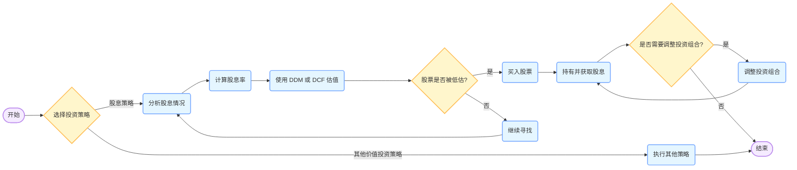

# 价值投资中的股息策略

> 关键词：价值投资、股息策略、股息率、现金流折现模型、投资组合

> 摘要：本文深入探讨了价值投资中的股息策略。首先介绍了股息策略的背景，包括其目的、适用读者、文档结构和相关术语。接着阐述了股息策略的核心概念，如股息、股息率等，并通过示意图和流程图展示其原理和架构。详细讲解了股息策略的核心算法原理，结合 Python 代码说明具体操作步骤。同时给出了相关的数学模型和公式，并举例说明。通过项目实战，展示了股息策略在实际投资中的代码实现和分析。还介绍了股息策略的实际应用场景，推荐了学习该策略的工具和资源。最后总结了股息策略的未来发展趋势与挑战，提供了常见问题解答和扩展阅读资料。

## 1. 背景介绍 
### 1.1 目的和范围
价值投资是一种基于公司内在价值进行投资的策略，而股息策略是价值投资中的重要组成部分。本文的目的是全面深入地探讨股息策略，包括其原理、算法、实际应用等方面。范围涵盖了股息策略的基本概念、核心算法、数学模型，以及在实际投资项目中的应用案例，同时还会推荐相关的学习工具和资源。

### 1.2 预期读者
本文预期读者包括对价值投资感兴趣的投资者、金融从业者、学习金融和投资相关专业的学生，以及希望深入了解股息策略的技术人员。无论是初学者还是有一定投资经验的人士，都能从本文中获取有价值的信息。

### 1.3 文档结构概述
本文将按照以下结构进行阐述：首先介绍股息策略的背景知识，包括目的、读者和文档结构等；接着讲解股息策略的核心概念及其相互联系，通过示意图和流程图展示其原理；然后详细介绍核心算法原理和具体操作步骤，并给出 Python 代码示例；再阐述相关的数学模型和公式，并举例说明；通过项目实战展示股息策略在实际中的应用；介绍股息策略的实际应用场景；推荐学习股息策略的工具和资源；最后总结股息策略的未来发展趋势与挑战，提供常见问题解答和扩展阅读资料。

### 1.4 术语表
#### 1.4.1 核心术语定义
- **股息**：股息是指股份公司从提取了公积金、公益金的税后利润中按照股息率派发给股东的收益。简单来说，就是公司盈利后分配给股东的一部分钱。
- **股息率**：股息率是股息与股票价格之间的比率，通常以百分比表示。它是衡量股票投资收益的一个重要指标，计算公式为：股息率 = （股息 / 股票价格）× 100%。
- **股息贴现模型（DDM）**：这是一种基于股息的股票估值模型，它认为股票的内在价值等于其未来所有股息的现值之和。
- **现金流折现模型（DCF）**：是一种通过预测资产未来的现金流，并将其折现到当前来评估资产价值的方法。在股息策略中，可以用于评估股票的内在价值。

#### 1.4.2 相关概念解释
- **价值投资**：价值投资是一种投资理念，投资者通过分析公司的基本面，如财务状况、盈利能力、竞争优势等，寻找被市场低估的股票进行投资，以期获得长期的投资回报。
- **股息再投资**：是指将获得的股息再次投资于该股票，从而增加持股数量，实现复利增长。
- **分红稳定性**：指公司在过去一段时间内股息分配的稳定程度，通常通过观察股息的连续性、股息增长率等指标来评估。

#### 1.4.3 缩略词列表
- **DDM**：Dividend Discount Model（股息贴现模型）
- **DCF**：Discounted Cash Flow（现金流折现模型）

## 2. 核心概念与联系 

### 核心概念原理
股息策略的核心在于利用股息相关的指标来评估股票的投资价值。股息是公司盈利的一部分分配给股东，反映了公司的盈利能力和对股东的回报意愿。股息率则是衡量股息与股票价格关系的指标，较高的股息率通常意味着投资者可以获得相对较高的现金回报。

股息贴现模型（DDM）基于股票的内在价值等于未来所有股息的现值之和这一原理。通过预测公司未来的股息，并将其折现到当前，就可以得到股票的内在价值。如果股票的市场价格低于其内在价值，那么该股票可能被低估，具有投资价值。

现金流折现模型（DCF）则是更广泛的一种估值方法，它考虑了公司未来所有的现金流，包括股息和其他经营现金流。在股息策略中，DCF 可以帮助投资者更全面地评估公司的价值。

### 架构的文本示意图
```plaintext
价值投资
|
|--股息策略
|   |--股息
|   |   |--现金股息
|   |   |--股票股息
|   |
|   |--股息率
|   |
|   |--股息贴现模型（DDM）
|   |   |--零增长模型
|   |   |--固定增长模型
|   |   |--多阶段增长模型
|   |
|   |--现金流折现模型（DCF）
|
|--其他价值投资策略
```

### Mermaid 流程图


## 3. 核心算法原理 & 具体操作步骤 

### 股息率计算
股息率的计算相对简单，其公式为：
```python
def dividend_yield(dividend, stock_price):
    """
    计算股息率
    :param dividend: 股息
    :param stock_price: 股票价格
    :return: 股息率
    """
    return (dividend / stock_price) * 100

# 示例
dividend = 2  # 假设股息为 2 元
stock_price = 50  # 假设股票价格为 50 元
yield_rate = dividend_yield(dividend, stock_price)
print(f"股息率为: {yield_rate}%")
```

### 股息贴现模型（DDM） - 固定增长模型
固定增长模型假设股息以固定的增长率 $g$ 增长，其公式为：
$V = \frac{D_1}{r - g}$
其中，$V$ 是股票的内在价值，$D_1$ 是下一期预计股息，$r$ 是必要收益率，$g$ 是股息增长率。

```python
def ddm_constant_growth(D1, r, g):
    """
    股息贴现模型 - 固定增长模型
    :param D1: 下一期预计股息
    :param r: 必要收益率
    :param g: 股息增长率
    :return: 股票内在价值
    """
    if r <= g:
        raise ValueError("必要收益率必须大于股息增长率")
    return D1 / (r - g)

# 示例
D1 = 2  # 下一期预计股息为 2 元
r = 0.1  # 必要收益率为 10%
g = 0.05  # 股息增长率为 5%
intrinsic_value = ddm_constant_growth(D1, r, g)
print(f"股票内在价值为: {intrinsic_value} 元")
```

### 具体操作步骤
1. **数据收集**：收集公司的股息数据、股票价格数据、必要收益率等信息。
2. **计算股息率**：使用上述股息率计算公式，计算目标股票的股息率。
3. **选择合适的 DDM 模型**：根据公司的股息增长情况，选择零增长模型、固定增长模型或多阶段增长模型。
4. **计算股票内在价值**：使用选定的 DDM 模型，计算股票的内在价值。
5. **比较内在价值和市场价格**：如果内在价值大于市场价格，说明股票可能被低估，可以考虑买入；反之，则不建议买入。

## 4. 数学模型和公式 & 详细讲解 & 举例说明 

### 股息率公式
股息率的计算公式为：
$$Dividend\ Yield = \frac{Dividend}{Stock\ Price} \times 100\%$$
其中，$Dividend$ 是股息，$Stock\ Price$ 是股票价格。

**举例说明**：假设某股票的股息为每年 3 元，当前股票价格为 60 元，则该股票的股息率为：
$$Dividend\ Yield = \frac{3}{60} \times 100\% = 5\%$$

### 股息贴现模型（DDM）
#### 零增长模型
零增长模型假设股息永远保持不变，即 $D_1 = D_2 = \cdots = D_n = D$。其公式为：
$$V = \frac{D}{r}$$
其中，$V$ 是股票的内在价值，$D$ 是每年的股息，$r$ 是必要收益率。

**举例说明**：假设某股票每年的股息为 2 元，必要收益率为 10%，则该股票的内在价值为：
$$V = \frac{2}{0.1} = 20\ 元$$

#### 固定增长模型
固定增长模型假设股息以固定的增长率 $g$ 增长，其公式为：
$$V = \frac{D_1}{r - g}$$
其中，$V$ 是股票的内在价值，$D_1$ 是下一期预计股息，$r$ 是必要收益率，$g$ 是股息增长率。

**举例说明**：假设某股票下一期预计股息为 2 元，必要收益率为 12%，股息增长率为 5%，则该股票的内在价值为：
$$V = \frac{2}{0.12 - 0.05} = \frac{2}{0.07} \approx 28.57\ 元$$

#### 多阶段增长模型
多阶段增长模型考虑了股息在不同阶段有不同的增长率。假设股息在前 $n$ 年以 $g_1$ 的增长率增长，从第 $n + 1$ 年开始以 $g_2$ 的增长率增长，则股票的内在价值可以通过以下步骤计算：
1. 计算前 $n$ 年股息的现值之和：
$$PV_1 = \sum_{t = 1}^{n} \frac{D_0(1 + g_1)^t}{(1 + r)^t}$$
2. 计算第 $n$ 年末股票的价值：
$$V_n = \frac{D_n(1 + g_2)}{r - g_2}$$
其中，$D_n = D_0(1 + g_1)^n$。
3. 计算第 $n$ 年末股票价值的现值：
$$PV_2 = \frac{V_n}{(1 + r)^n}$$
4. 股票的内在价值为：
$$V = PV_1 + PV_2$$

**举例说明**：假设某股票当前股息 $D_0 = 1$ 元，前 3 年股息增长率 $g_1 = 15\%$，从第 4 年开始股息增长率 $g_2 = 5\%$，必要收益率 $r = 10\%$。
- 计算前 3 年股息的现值之和：
$D_1 = D_0(1 + g_1) = 1\times(1 + 0.15) = 1.15$
$D_2 = D_1(1 + g_1) = 1.15\times(1 + 0.15) = 1.3225$
$D_3 = D_2(1 + g_1) = 1.3225\times(1 + 0.15) = 1.5209$
$PV_1 = \frac{1.15}{(1 + 0.1)^1} + \frac{1.3225}{(1 + 0.1)^2} + \frac{1.5209}{(1 + 0.1)^3} \approx 3.37$
- 计算第 3 年末股票的价值：
$D_4 = D_3(1 + g_2) = 1.5209\times(1 + 0.05) = 1.5969$
$V_3 = \frac{1.5969}{0.1 - 0.05} = 31.938$
- 计算第 3 年末股票价值的现值：
$PV_2 = \frac{31.938}{(1 + 0.1)^3} \approx 23.97$
- 股票的内在价值为：
$V = PV_1 + PV_2 = 3.37 + 23.97 = 27.34$ 元

### 现金流折现模型（DCF）
现金流折现模型的基本公式为：
$$V = \sum_{t = 1}^{n} \frac{CF_t}{(1 + r)^t}$$
其中，$V$ 是资产的内在价值，$CF_t$ 是第 $t$ 期的现金流，$r$ 是折现率，$n$ 是现金流的期数。

在股息策略中，现金流主要是指股息。

**举例说明**：假设某股票未来 3 年的股息分别为 2 元、2.2 元、2.4 元，从第 4 年开始股息保持不变，必要收益率为 10%。
- 计算前 3 年股息的现值之和：
$PV_1 = \frac{2}{(1 + 0.1)^1} + \frac{2.2}{(1 + 0.1)^2} + \frac{2.4}{(1 + 0.1)^3} \approx 5.67$
- 计算第 3 年末股票的价值（永续年金）：
$V_3 = \frac{2.4}{0.1} = 24$
- 计算第 3 年末股票价值的现值：
$PV_2 = \frac{24}{(1 + 0.1)^3} \approx 18.03$
- 股票的内在价值为：
$V = PV_1 + PV_2 = 5.67 + 18.03 = 23.7$ 元

## 5. 项目实战：代码实际案例和详细解释说明 

### 5.1  开发环境搭建
- **编程语言**：Python
- **开发工具**：可以选择 PyCharm、Jupyter Notebook 等。
- **所需库**：需要安装 `pandas`、`numpy` 等库，用于数据处理和计算。可以使用以下命令进行安装：
```bash
pip install pandas numpy
```

### 5.2  源代码详细实现和代码解读
```python
import pandas as pd
import numpy as np

# 假设我们有以下股票数据
data = {
    '股票代码': ['000001', '000002', '000003'],
    '股息': [2, 3, 1],
    '股票价格': [50, 60, 30],
    '必要收益率': [0.1, 0.12, 0.11],
    '股息增长率': [0.05, 0.06, 0.04]
}
df = pd.DataFrame(data)

# 计算股息率
df['股息率'] = (df['股息'] / df['股票价格']) * 100

# 定义股息贴现模型 - 固定增长模型函数
def ddm_constant_growth(D1, r, g):
    if r <= g:
        raise ValueError("必要收益率必须大于股息增长率")
    return D1 / (r - g)

# 计算股票内在价值
df['内在价值'] = df.apply(lambda row: ddm_constant_growth(row['股息'], row['必要收益率'], row['股息增长率']), axis=1)

# 判断股票是否被低估
df['是否被低估'] = df['内在价值'] > df['股票价格']

print(df)
```

### 5.3  代码解读与分析
1. **数据准备**：使用 `pandas` 库创建一个包含股票代码、股息、股票价格、必要收益率和股息增长率的 DataFrame。
2. **计算股息率**：通过对 DataFrame 中的 `股息` 和 `股票价格` 列进行计算，得到 `股息率` 列。
3. **定义 DDM 固定增长模型函数**：定义 `ddm_constant_growth` 函数，用于计算股票的内在价值。
4. **计算股票内在价值**：使用 `apply` 方法对 DataFrame 中的每一行应用 `ddm_constant_growth` 函数，计算出每只股票的内在价值，并添加到 `内在价值` 列。
5. **判断股票是否被低估**：通过比较 `内在价值` 和 `股票价格`，判断股票是否被低估，并将结果添加到 `是否被低估` 列。
6. **输出结果**：打印包含所有计算结果的 DataFrame。

## 6. 实际应用场景 
### 长期投资
股息策略非常适合长期投资者。长期投资者更关注公司的基本面和稳定的现金流回报。通过选择股息稳定、股息率较高的股票进行投资，投资者可以在获得股息收入的同时，享受股票价格的长期上涨。例如，一些大型蓝筹股通常具有较高的股息率和稳定的分红政策，长期持有这些股票可以为投资者带来可观的收益。

### 退休投资组合
对于退休人员来说，股息策略可以作为一种重要的收入来源。退休人员通常希望投资组合能够提供稳定的现金流，以满足日常生活的开支。股息稳定的股票可以作为退休投资组合的一部分，为退休人员提供定期的股息收入。同时，股票的长期增值潜力也可以帮助退休人员抵御通货膨胀的影响。

### 分散投资
股息策略可以作为分散投资的一种方式。不同行业、不同规模的公司具有不同的股息政策和股息率。通过选择不同行业、不同规模的股息股票进行投资，可以降低投资组合的风险。例如，同时投资金融、消费、能源等行业的股息股票，可以在不同行业的经济周期中获得相对稳定的收益。

### 价值投资筛选
股息策略可以作为价值投资筛选的一个重要指标。投资者可以通过筛选股息率较高、股息增长稳定的股票，找到被市场低估的股票。这些股票通常具有较好的基本面和盈利能力，未来有较大的上涨空间。

## 7. 工具和资源推荐
### 7.1 学习资源推荐
#### 7.1.1 书籍推荐
- 《聪明的投资者》（The Intelligent Investor）：作者本杰明·格雷厄姆（Benjamin Graham）是价值投资的鼻祖，这本书是价值投资领域的经典之作，对股息策略等价值投资方法有深入的阐述。
- 《巴菲特致股东的信：股份公司教程》（Letters to Shareholders of Berkshire Hathaway）：沃伦·巴菲特（Warren Buffett）是全球著名的价值投资者，这本书收录了他多年来致股东的信，从中可以学习到巴菲特的投资理念和股息策略应用。
- 《股息投资策略》（The Dividend Investor's Playbook）：这本书专门介绍了股息投资的策略和方法，包括如何选择股息股票、如何构建股息投资组合等。

#### 7.1.2 在线课程
- Coursera 上的“投资学原理”（Principles of Investing）：该课程由知名大学教授授课，涵盖了价值投资、股息策略等投资领域的基础知识和方法。
- edX 上的“金融市场”（Financial Markets）：耶鲁大学教授罗伯特·席勒（Robert Shiller）主讲的课程，对金融市场和投资策略有深入的讲解，其中包括股息策略的相关内容。

#### 7.1.3 技术博客和网站
- Seeking Alpha：这是一个知名的金融投资网站，提供大量的股票分析、股息策略研究等内容，有很多专业的投资者和分析师在上面分享自己的观点和研究成果。
- Dividend.com：专门提供股息相关信息的网站，包括股息股票筛选、股息率排名、股息新闻等，是股息投资者的重要信息来源。

### 7.2 开发工具框架推荐
#### 7.2.1 IDE和编辑器
- PyCharm：是一款专业的 Python 集成开发环境，具有代码自动补全、调试、版本控制等功能，非常适合用于开发股息策略相关的 Python 代码。
- Jupyter Notebook：是一个交互式的开发环境，可以将代码、文本、图表等结合在一起，方便进行数据分析和模型验证。在研究股息策略时，可以使用 Jupyter Notebook 进行数据处理、模型计算和结果可视化。

#### 7.2.2 调试和性能分析工具
- PySnooper：是一个简单易用的 Python 调试工具，可以自动记录函数的调用过程和变量的值，方便开发者快速定位问题。
- cProfile：是 Python 内置的性能分析工具，可以分析代码的运行时间和函数调用次数，帮助开发者优化代码性能。

#### 7.2.3 相关框架和库
- pandas：是一个强大的数据处理和分析库，提供了 DataFrame 等数据结构，方便进行股票数据的处理和分析。
- numpy：是 Python 的数值计算库，提供了高效的数组操作和数学函数，在股息策略的算法实现中经常会用到。
- matplotlib：是一个常用的 Python 绘图库，可以用于绘制股票价格走势图、股息率变化图等，帮助投资者直观地了解数据。

### 7.3 相关论文著作推荐
#### 7.3.1 经典论文
- “Dividend Policy, Growth, and the Valuation of Shares”（《股息政策、增长与股票估值》）：由 Myron J. Gordon 和 Eli Shapiro 发表，该论文提出了股息贴现模型（DDM），是股息策略领域的经典论文。
- “The Dividend Puzzle”（《股息之谜》）：由 Fischer Black 发表，该论文探讨了公司为什么要发放股息这一问题，对理解股息政策有重要的参考价值。

#### 7.3.2 最新研究成果
可以通过学术数据库如 Google Scholar、Web of Science 等搜索关于股息策略的最新研究论文。这些论文通常会探讨股息策略在不同市场环境下的有效性、股息政策与公司治理的关系等前沿问题。

#### 7.3.3 应用案例分析
一些金融研究机构和投资公司会发布关于股息策略的应用案例分析报告。这些报告可以帮助投资者了解股息策略在实际投资中的应用方法和效果，例如如何选择股息股票、如何构建股息投资组合等。

## 8. 总结：未来发展趋势与挑战
### 未来发展趋势
- **智能化和自动化**：随着人工智能和机器学习技术的发展，股息策略的应用将更加智能化和自动化。投资者可以利用算法模型自动筛选股息股票、构建投资组合，并根据市场变化实时调整投资策略。
- **全球化**：全球金融市场的互联互通使得投资者可以更容易地投资于不同国家和地区的股息股票。未来，股息策略将更加注重全球化配置，以降低投资风险，提高投资回报。
- **可持续投资**：越来越多的投资者开始关注企业的社会责任和可持续发展。未来，股息策略可能会与可持续投资相结合，选择那些具有良好环境、社会和治理（ESG）表现的公司进行投资。

### 挑战
- **市场不确定性**：股票市场受到宏观经济、政策法规、行业竞争等多种因素的影响，具有较大的不确定性。股息策略虽然可以提供一定的稳定收益，但无法完全抵御市场风险。
- **股息政策变化**：公司的股息政策可能会随着经营状况、战略调整等因素发生变化。投资者需要密切关注公司的财务状况和股息政策变化，及时调整投资策略。
- **数据质量和准确性**：股息策略的应用需要大量的股票数据和财务数据，数据的质量和准确性直接影响到投资决策的正确性。投资者需要确保获取的数据真实可靠，并进行有效的数据清洗和分析。

## 9. 附录：常见问题与解答
### 问题 1：股息率越高的股票就一定越好吗？
不一定。股息率高可能意味着股票被低估，但也可能是公司经营状况不佳，通过高股息来吸引投资者。投资者需要综合考虑公司的基本面、盈利能力、股息稳定性等因素，而不仅仅依赖股息率来选择股票。

### 问题 2：股息贴现模型（DDM）的假设条件是否合理？
DDM 模型有一些假设条件，如股息以固定增长率增长等，这些假设在现实中可能并不完全成立。但 DDM 模型仍然是一种有用的估值方法，可以帮助投资者大致估算股票的内在价值。在实际应用中，可以根据公司的实际情况对模型进行调整和改进。

### 问题 3：股息再投资有什么好处？
股息再投资可以实现复利增长。通过将股息再次投资于该股票，投资者可以增加持股数量，从而在未来获得更多的股息收入和资本增值。长期来看，股息再投资可以显著提高投资回报。

### 问题 4：如何选择合适的必要收益率？
必要收益率的选择需要考虑投资者的风险偏好、市场利率水平、投资期限等因素。一般来说，风险偏好较高的投资者可以选择较高的必要收益率，而风险偏好较低的投资者可以选择较低的必要收益率。市场利率水平也是一个重要的参考因素，必要收益率通常要高于市场无风险利率。

## 10. 扩展阅读 & 参考资料
- [1] 格雷厄姆, 多德. 证券分析[M]. 海南出版社, 2006.
- [2] 西格尔. 股市长线法宝[M]. 机械工业出版社, 2015.
- [3] 彼得·林奇. 战胜华尔街[M]. 机械工业出版社, 2010.
- [4] Seeking Alpha. https://seekingalpha.com/
- [5] Dividend.com. https://dividend.com/

作者：AI天才研究院/AI Genius Institute & 禅与计算机程序设计艺术 /Zen And The Art of Computer Programming