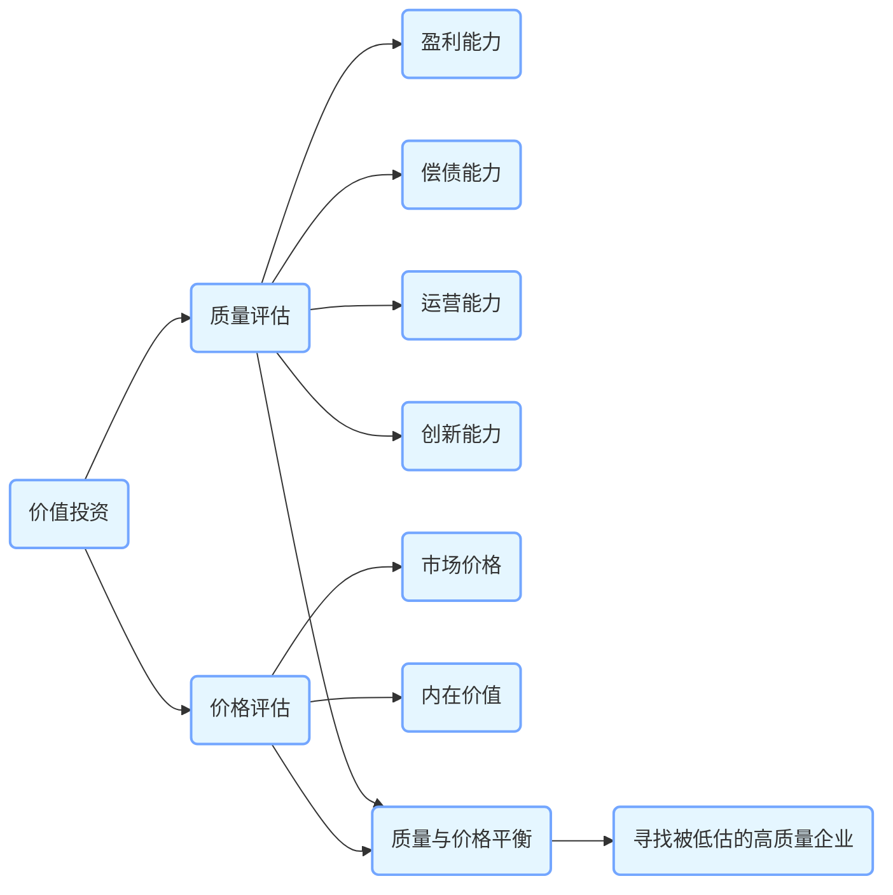

# 价值投资中的质量与价格平衡

> 关键词：价值投资、质量与价格平衡、财务分析、估值模型、投资策略

> 摘要：本文聚焦于价值投资中质量与价格平衡这一核心问题。通过深入剖析质量和价格在价值投资中的内涵、相互关系，详细介绍评估企业质量和合理价格的方法。结合具体的数学模型和公式，运用Python代码进行算法原理的阐述，并给出实际的项目实战案例。同时探讨价值投资在不同场景下的应用，推荐相关的学习资源、开发工具和论文著作。最后总结价值投资中质量与价格平衡的未来发展趋势与挑战，解答常见问题，为投资者在价值投资领域提供全面且深入的指导。

## 1. 背景介绍 
### 1.1 目的和范围
价值投资作为一种经典的投资策略，强调寻找被低估的优质资产以获取长期稳定的回报。然而，在实际操作中，投资者往往面临如何平衡资产质量和价格的难题。本文旨在为投资者提供一套系统的方法和思路，帮助他们在价值投资过程中准确评估企业的质量和合理价格，实现两者的有效平衡。

### 1.2 预期读者
本文适合对价值投资感兴趣的各类投资者，包括个人投资者、专业投资机构从业者等。同时，也为金融专业的学生和研究人员提供了有价值的参考资料。

### 1.3 文档结构概述
本文首先介绍相关背景信息，接着阐述价值投资中质量与价格的核心概念及其联系。然后详细讲解评估企业质量和价格的核心算法原理及具体操作步骤，包括数学模型和公式的运用。通过实际的项目实战案例，展示如何在实际中应用这些方法。之后探讨价值投资在不同场景下的应用，推荐相关的学习资源、开发工具和论文著作。最后总结未来发展趋势与挑战，解答常见问题，并提供扩展阅读和参考资料。

### 1.4 术语表
#### 1.4.1 核心术语定义
- **价值投资**：一种基于对资产内在价值的评估，寻找被低估的资产进行投资的策略。
- **企业质量**：指企业的基本面状况，包括盈利能力、偿债能力、运营能力、创新能力等多个方面。
- **价格**：指在市场上购买企业股票或其他资产所需要支付的货币金额。
- **内在价值**：企业在未来持续经营过程中所产生的现金流量的现值。

#### 1.4.2 相关概念解释
- **财务报表分析**：通过对企业的资产负债表、利润表和现金流量表等财务报表进行分析，评估企业的财务状况和经营成果。
- **估值模型**：用于估算企业内在价值的数学模型，常见的有现金流折现模型、市盈率模型等。
- **安全边际**：指股票的市场价格低于其内在价值的幅度，是价值投资中的重要概念，用于降低投资风险。

#### 1.4.3 缩略词列表
- **PE**：市盈率（Price-to-Earnings Ratio），指股票价格与每股收益的比率。
- **PB**：市净率（Price-to-Book Ratio），指股票价格与每股净资产的比率。
- **DCF**：现金流折现模型（Discounted Cash Flow Model）。

## 2. 核心概念与联系 
### 2.1 价值投资中的质量概念
价值投资中的质量主要体现在企业的基本面状况。一个高质量的企业通常具有以下特点：
- **盈利能力**：企业能够持续稳定地创造利润，具有较高的毛利率、净利率和净资产收益率（ROE）。例如，贵州茅台凭借其强大的品牌优势和独特的酿造工艺，多年来保持着较高的盈利能力。
- **偿债能力**：企业具备足够的能力偿还债务，资产负债率合理，流动比率和速动比率处于健康水平。这表明企业在面临财务风险时具有较强的抵御能力。
- **运营能力**：企业的资产运营效率高，存货周转率、应收账款周转率等指标良好。高效的运营能力意味着企业能够更快地将资产转化为现金，提高资金的使用效率。
- **创新能力**：在当今快速发展的时代，企业需要不断创新以保持竞争力。具有较强创新能力的企业能够推出新产品、新服务，开拓新市场，为企业的长期发展奠定基础。

### 2.2 价值投资中的价格概念
价格是投资者在市场上购买资产所需要支付的成本。在价值投资中，价格与企业的内在价值密切相关。当市场价格低于企业的内在价值时，股票被认为是被低估的，具有投资价值；反之，当市场价格高于企业的内在价值时，股票被高估，投资风险较大。

### 2.3 质量与价格的关系
质量和价格是价值投资中相辅相成的两个方面。高质量的企业通常具有较高的内在价值，但并不意味着其市场价格一定合理。投资者需要在寻找高质量企业的同时，关注其价格是否具有吸引力。如果只注重质量而忽视价格，可能会以过高的成本买入股票，导致投资回报率降低；反之，如果只追求低价而忽略企业质量，可能会陷入价值陷阱，买入一些基本面不佳的企业。

### 2.4 核心概念原理和架构的文本示意图
```plaintext
价值投资
|-- 质量
|   |-- 盈利能力
|   |-- 偿债能力
|   |-- 运营能力
|   |-- 创新能力
|-- 价格
|   |-- 市场价格
|   |-- 内在价值
|-- 质量与价格平衡
    |-- 寻找被低估的高质量企业
```

### 2.5 Mermaid 流程图


## 3. 核心算法原理 & 具体操作步骤 
### 3.1 评估企业质量的算法原理及步骤
#### 3.1.1 盈利能力评估
盈利能力是企业质量的重要体现，常用的指标有毛利率、净利率和净资产收益率（ROE）。

**毛利率**：反映了企业产品或服务的基本盈利空间。计算公式为：
$毛利率 = \frac{营业收入 - 营业成本}{营业收入} \times 100\%$

**净利率**：考虑了企业的所有成本和费用后，反映了企业最终的盈利水平。计算公式为：
$净利率 = \frac{净利润}{营业收入} \times 100\%$

**净资产收益率（ROE）**：衡量了企业运用自有资本的效率。计算公式为：
$ROE = \frac{净利润}{平均净资产} \times 100\%$

以下是使用Python代码计算这些指标的示例：
```python
# 示例数据
revenue = 1000  # 营业收入
cost = 600  # 营业成本
net_income = 200  # 净利润
average_equity = 800  # 平均净资产

# 计算毛利率
gross_margin = (revenue - cost) / revenue * 100
print(f"毛利率: {gross_margin}%")

# 计算净利率
net_profit_margin = net_income / revenue * 100
print(f"净利率: {net_profit_margin}%")

# 计算净资产收益率
roe = net_income / average_equity * 100
print(f"净资产收益率: {roe}%")
```

#### 3.1.2 偿债能力评估
偿债能力主要通过资产负债率、流动比率和速动比率来评估。

**资产负债率**：反映了企业的负债水平。计算公式为：
$资产负债率 = \frac{负债总额}{资产总额} \times 100\%$

**流动比率**：衡量企业短期偿债能力的指标。计算公式为：
$流动比率 = \frac{流动资产}{流动负债}$

**速动比率**：是对流动比率的进一步细化，剔除了存货等变现能力较弱的资产。计算公式为：
$速动比率 = \frac{流动资产 - 存货}{流动负债}$

以下是使用Python代码计算这些指标的示例：
```python
# 示例数据
total_liabilities = 400  # 负债总额
total_assets = 1000  # 资产总额
current_assets = 500  # 流动资产
current_liabilities = 200  # 流动负债
inventory = 100  # 存货

# 计算资产负债率
debt_ratio = total_liabilities / total_assets * 100
print(f"资产负债率: {debt_ratio}%")

# 计算流动比率
current_ratio = current_assets / current_liabilities
print(f"流动比率: {current_ratio}")

# 计算速动比率
quick_ratio = (current_assets - inventory) / current_liabilities
print(f"速动比率: {quick_ratio}")
```

#### 3.1.3 运营能力评估
运营能力主要通过存货周转率、应收账款周转率等指标来评估。

**存货周转率**：反映了企业存货的周转速度。计算公式为：
$存货周转率 = \frac{营业成本}{平均存货余额}$

**应收账款周转率**：衡量了企业收回应收账款的效率。计算公式为：
$应收账款周转率 = \frac{营业收入}{平均应收账款余额}$

以下是使用Python代码计算这些指标的示例：
```python
# 示例数据
cost = 600  # 营业成本
revenue = 1000  # 营业收入
average_inventory = 200  # 平均存货余额
average_accounts_receivable = 150  # 平均应收账款余额

# 计算存货周转率
inventory_turnover = cost / average_inventory
print(f"存货周转率: {inventory_turnover}")

# 计算应收账款周转率
accounts_receivable_turnover = revenue / average_accounts_receivable
print(f"应收账款周转率: {accounts_receivable_turnover}")
```

### 3.2 评估企业价格的算法原理及步骤
#### 3.2.1 市盈率（PE）估值法
市盈率是最常用的估值方法之一，它反映了市场对企业盈利的预期。计算公式为：
$PE = \frac{股票价格}{每股收益}$

通过与同行业其他企业的市盈率进行比较，可以判断该企业的股票价格是否合理。以下是使用Python代码计算市盈率的示例：
```python
# 示例数据
stock_price = 50  # 股票价格
eps = 2  # 每股收益

# 计算市盈率
pe = stock_price / eps
print(f"市盈率: {pe}")
```

#### 3.2.2 现金流折现模型（DCF）
现金流折现模型是一种基于企业未来现金流量的估值方法。其基本原理是将企业未来各期的现金流量折现到当前时点，得到企业的内在价值。计算公式为：
$$V = \sum_{t=1}^{n} \frac{CF_t}{(1 + r)^t} + \frac{TV}{(1 + r)^n}$$
其中，$V$ 为企业的内在价值，$CF_t$ 为第 $t$ 期的现金流量，$r$ 为折现率，$TV$ 为终值，$n$ 为预测期数。

以下是一个简化的DCF模型的Python代码示例：
```python
import numpy as np

# 示例数据
cash_flows = [100, 120, 150, 180, 200]  # 未来5年的现金流量
discount_rate = 0.1  # 折现率
terminal_value = 1000  # 终值

# 计算各期现金流量的现值
present_values = []
for i, cf in enumerate(cash_flows):
    pv = cf / (1 + discount_rate) ** (i + 1)
    present_values.append(pv)

# 计算终值的现值
terminal_pv = terminal_value / (1 + discount_rate) ** len(cash_flows)

# 计算企业的内在价值
intrinsic_value = np.sum(present_values) + terminal_pv
print(f"企业的内在价值: {intrinsic_value}")
```

## 4. 数学模型和公式 & 详细讲解 & 举例说明 
### 4.1 财务指标公式
#### 4.1.1 盈利能力指标
- **毛利率**：$毛利率 = \frac{营业收入 - 营业成本}{营业收入} \times 100\%$
    - **详细讲解**：毛利率反映了企业产品或服务的基本盈利空间。毛利率越高，说明企业在扣除直接成本后剩余的利润越多，产品或服务的竞争力越强。
    - **举例说明**：假设一家企业的营业收入为1000万元，营业成本为600万元，则其毛利率为：$\frac{1000 - 600}{1000} \times 100\% = 40\%$。

- **净利率**：$净利率 = \frac{净利润}{营业收入} \times 100\%$
    - **详细讲解**：净利率考虑了企业的所有成本和费用，包括营业成本、销售费用、管理费用、财务费用等，反映了企业最终的盈利水平。
    - **举例说明**：若该企业的净利润为200万元，则其净利率为：$\frac{200}{1000} \times 100\% = 20\%$。

- **净资产收益率（ROE）**：$ROE = \frac{净利润}{平均净资产} \times 100\%$
    - **详细讲解**：ROE衡量了企业运用自有资本的效率，反映了股东权益的收益水平。ROE越高，说明企业利用自有资本创造利润的能力越强。
    - **举例说明**：假设该企业的平均净资产为800万元，则其ROE为：$\frac{200}{800} \times 100\% = 25\%$。

#### 4.1.2 偿债能力指标
- **资产负债率**：$资产负债率 = \frac{负债总额}{资产总额} \times 100\%$
    - **详细讲解**：资产负债率反映了企业的负债水平。资产负债率越高，说明企业的负债越多，财务风险越大；反之，资产负债率越低，企业的财务状况越稳健。
    - **举例说明**：若企业的负债总额为400万元，资产总额为1000万元，则其资产负债率为：$\frac{400}{1000} \times 100\% = 40\%$。

- **流动比率**：$流动比率 = \frac{流动资产}{流动负债}$
    - **详细讲解**：流动比率衡量了企业短期偿债能力。一般来说，流动比率大于2时，表明企业具有较强的短期偿债能力。
    - **举例说明**：假设企业的流动资产为500万元，流动负债为200万元，则其流动比率为：$\frac{500}{200} = 2.5$。

- **速动比率**：$速动比率 = \frac{流动资产 - 存货}{流动负债}$
    - **详细讲解**：速动比率是对流动比率的进一步细化，剔除了存货等变现能力较弱的资产，更能准确地反映企业的短期偿债能力。一般来说，速动比率大于1时较为合适。
    - **举例说明**：若企业的存货为100万元，则其速动比率为：$\frac{500 - 100}{200} = 2$。

#### 4.1.3 运营能力指标
- **存货周转率**：$存货周转率 = \frac{营业成本}{平均存货余额}$
    - **详细讲解**：存货周转率反映了企业存货的周转速度。存货周转率越高，说明企业存货周转越快，资金占用成本越低。
    - **举例说明**：假设企业的营业成本为600万元，平均存货余额为200万元，则其存货周转率为：$\frac{600}{200} = 3$。

- **应收账款周转率**：$应收账款周转率 = \frac{营业收入}{平均应收账款余额}$
    - **详细讲解**：应收账款周转率衡量了企业收回应收账款的效率。应收账款周转率越高，说明企业收账速度越快，坏账损失的可能性越小。
    - **举例说明**：若企业的营业收入为1000万元，平均应收账款余额为150万元，则其应收账款周转率为：$\frac{1000}{150} \approx 6.67$。

### 4.2 估值模型公式
#### 4.2.1 市盈率（PE）估值法
- **公式**：$PE = \frac{股票价格}{每股收益}$
    - **详细讲解**：市盈率反映了市场对企业盈利的预期。较高的市盈率可能意味着市场对企业的未来发展前景较为乐观，愿意为其支付更高的价格；反之，较低的市盈率可能表示市场对企业的预期较低。
    - **举例说明**：假设某股票的价格为50元，每股收益为2元，则其市盈率为：$\frac{50}{2} = 25$。

#### 4.2.2 现金流折现模型（DCF）
- **公式**：$$V = \sum_{t=1}^{n} \frac{CF_t}{(1 + r)^t} + \frac{TV}{(1 + r)^n}$$
    - **详细讲解**：DCF模型基于企业未来现金流量的折现来计算企业的内在价值。其中，$CF_t$ 为第 $t$ 期的现金流量，$r$ 为折现率，$TV$ 为终值，$n$ 为预测期数。折现率反映了资金的时间价值和投资风险，终值则考虑了企业在预测期之后的持续经营价值。
    - **举例说明**：假设某企业未来5年的现金流量分别为100万元、120万元、150万元、180万元、200万元，折现率为10%，终值为1000万元。则该企业的内在价值计算如下：
        - 各期现金流量的现值分别为：
            - $PV_1 = \frac{100}{(1 + 0.1)^1} \approx 90.91$（万元）
            - $PV_2 = \frac{120}{(1 + 0.1)^2} \approx 99.17$（万元）
            - $PV_3 = \frac{150}{(1 + 0.1)^3} \approx 112.69$（万元）
            - $PV_4 = \frac{180}{(1 + 0.1)^4} \approx 122.94$（万元）
            - $PV_5 = \frac{200}{(1 + 0.1)^5} \approx 124.18$（万元）
        - 终值的现值为：$PV_{TV} = \frac{1000}{(1 + 0.1)^5} \approx 620.92$（万元）
        - 企业的内在价值为：$V = 90.91 + 99.17 + 112.69 + 122.94 + 124.18 + 620.92 \approx 1170.81$（万元）

## 5. 项目实战：代码实际案例和详细解释说明 
### 5.1  开发环境搭建
#### 5.1.1 安装Python
首先，需要安装Python编程语言。可以从Python官方网站（https://www.python.org/downloads/）下载适合自己操作系统的Python安装包，并按照安装向导进行安装。

#### 5.1.2 安装必要的库
在进行价值投资分析时，需要使用一些Python库，如`pandas`用于数据处理，`numpy`用于数值计算。可以使用以下命令来安装这些库：
```sh
pip install pandas numpy
```

### 5.2  源代码详细实现和代码解读
#### 5.2.1 数据获取与处理
假设我们从CSV文件中获取企业的财务数据，以下是一个简单的示例代码：
```python
import pandas as pd

# 读取CSV文件
data = pd.read_csv('financial_data.csv')

# 查看数据基本信息
print(data.info())

# 查看数据集行数和列数
rows, columns = data.shape

# 计算各指标
if rows > 0:
    # 毛利率
    data['gross_margin'] = (data['revenue'] - data['cost']) / data['revenue'] * 100
    # 净利率
    data['net_profit_margin'] = data['net_income'] / data['revenue'] * 100
    # 净资产收益率
    data['roe'] = data['net_income'] / data['average_equity'] * 100
    # 资产负债率
    data['debt_ratio'] = data['total_liabilities'] / data['total_assets'] * 100
    # 流动比率
    data['current_ratio'] = data['current_assets'] / data['current_liabilities']
    # 速动比率
    data['quick_ratio'] = (data['current_assets'] - data['inventory']) / data['current_liabilities']
    # 存货周转率
    data['inventory_turnover'] = data['cost'] / data['average_inventory']
    # 应收账款周转率
    data['accounts_receivable_turnover'] = data['revenue'] / data['average_accounts_receivable']
    # 市盈率
    data['pe'] = data['stock_price'] / data['eps']

# 打印计算结果
print(data[['gross_margin', 'net_profit_margin', 'roe', 'debt_ratio', 'current_ratio', 'quick_ratio', 'inventory_turnover', 'accounts_receivable_turnover', 'pe']])
```
**代码解读**：
- 首先，使用`pandas`库的`read_csv`函数读取CSV文件中的财务数据。
- 然后，通过查看数据的基本信息，了解数据的结构和类型。
- 接着，根据前面介绍的公式，计算各项财务指标，并将结果存储在新的列中。
- 最后，打印计算结果，方便查看。

#### 5.2.2 现金流折现模型（DCF）实现
```python
import numpy as np

def dcf_valuation(cash_flows, discount_rate, terminal_value):
    """
    现金流折现模型计算企业内在价值
    :param cash_flows: 未来各期现金流量列表
    :param discount_rate: 折现率
    :param terminal_value: 终值
    :return: 企业内在价值
    """
    present_values = []
    for i, cf in enumerate(cash_flows):
        pv = cf / (1 + discount_rate) ** (i + 1)
        present_values.append(pv)

    terminal_pv = terminal_value / (1 + discount_rate) ** len(cash_flows)

    intrinsic_value = np.sum(present_values) + terminal_pv
    return intrinsic_value

# 示例数据
cash_flows = [100, 120, 150, 180, 200]
discount_rate = 0.1
terminal_value = 1000

# 计算企业内在价值
intrinsic_value = dcf_valuation(cash_flows, discount_rate, terminal_value)
print(f"企业的内在价值: {intrinsic_value}")
```
**代码解读**：
- 定义了一个名为`dcf_valuation`的函数，用于计算企业的内在价值。
- 在函数内部，首先计算各期现金流量的现值，并将其存储在列表`present_values`中。
- 然后计算终值的现值。
- 最后将各期现金流量的现值和终值的现值相加，得到企业的内在价值。
- 在主程序中，提供了示例数据，并调用`dcf_valuation`函数计算企业的内在价值，最后打印结果。

### 5.3  代码解读与分析
#### 5.3.1 数据获取与处理部分
- 通过`pandas`库读取CSV文件，方便快捷地获取财务数据。
- 对数据进行基本信息查看，有助于了解数据的完整性和准确性。
- 计算各项财务指标时，直接使用`pandas`的向量运算，提高了计算效率。
- 最后打印计算结果，方便后续的分析和决策。

#### 5.3.2 现金流折现模型部分
- 定义函数`dcf_valuation`，将DCF模型的计算逻辑封装起来，提高了代码的复用性。
- 在函数内部，使用循环计算各期现金流量的现值，使用公式计算终值的现值，最后将两者相加得到企业的内在价值。
- 主程序中提供示例数据并调用函数进行计算，验证了函数的正确性。

## 6. 实际应用场景 
### 6.1 个人投资者
个人投资者在进行股票投资时，可以运用价值投资中质量与价格平衡的方法，筛选出被低估的高质量企业。通过对企业的财务报表进行分析，评估企业的质量和合理价格，制定合理的投资策略。例如，个人投资者可以关注那些具有稳定盈利能力、低负债水平和良好运营能力的企业，同时结合估值模型判断其股票价格是否具有吸引力。当发现某只股票的市场价格低于其内在价值时，可以考虑买入该股票，长期持有以获取稳定的回报。

### 6.2 专业投资机构
专业投资机构在进行资产配置和投资组合管理时，也需要考虑价值投资中质量与价格的平衡。投资机构可以利用专业的研究团队和数据分析工具，对大量的企业进行深入研究和评估。通过构建投资组合，将不同质量和价格的资产进行合理搭配，降低投资风险，提高投资回报率。例如，投资机构可以将一部分资金配置到高质量、高估值的蓝筹股，以获取稳定的股息收入和长期增值；同时，将另一部分资金配置到一些被低估的成长型企业，以获取潜在的高收益。

### 6.3 企业并购与重组
在企业并购与重组过程中，价值投资中质量与价格平衡的理念同样重要。收购方需要对目标企业的质量进行全面评估，包括其盈利能力、市场竞争力、技术实力等方面。同时，需要运用估值模型确定目标企业的合理价格，避免支付过高的收购成本。例如，在进行企业并购时，收购方可以通过分析目标企业的财务报表和行业前景，判断其是否具有战略价值，并根据估值结果确定合理的收购价格区间。

## 7. 工具和资源推荐
### 7.1 学习资源推荐
#### 7.1.1 书籍推荐
- 《聪明的投资者》（The Intelligent Investor）：本杰明·格雷厄姆（Benjamin Graham）著，被誉为价值投资的圣经，详细介绍了价值投资的基本理念和方法。
- 《证券分析》（Security Analysis）：本杰明·格雷厄姆和戴维·多德（David Dodd）著，是价值投资领域的经典著作，对财务报表分析和估值方法进行了深入探讨。
- 《巴菲特致股东的信：股份公司教程》（Letters to Shareholders of Berkshire Hathaway）：沃伦·巴菲特（Warren Buffett）著，通过巴菲特写给股东的信，展示了他的投资理念和决策过程。

#### 7.1.2 在线课程
- Coursera上的“投资学原理”（Principles of Investment）课程：由知名高校的教授授课，系统介绍了投资学的基本理论和方法，包括价值投资。
- edX上的“金融市场”（Financial Markets）课程：耶鲁大学教授罗伯特·席勒（Robert Shiller）主讲，涵盖了金融市场的各个方面，对价值投资有深入的讲解。

#### 7.1.3 技术博客和网站
- 雪球网（https://xueqiu.com/）：国内知名的投资交流社区，提供了丰富的股票分析、投资策略和财经资讯。
- Seeking Alpha（https://seekingalpha.com/）：国外专业的投资研究网站，汇聚了众多投资专家和分析师的观点和研究报告。

### 7.2 开发工具框架推荐
#### 7.2.1 IDE和编辑器
- PyCharm：一款专业的Python集成开发环境，提供了丰富的代码编辑、调试和项目管理功能，适合进行价值投资分析的Python代码开发。
- Jupyter Notebook：交互式的开发环境，支持Python代码的编写、运行和可视化展示，方便进行数据分析和模型验证。

#### 7.2.2 调试和性能分析工具
- PDB：Python自带的调试工具，可以帮助开发者定位代码中的问题和错误。
- cProfile：Python的性能分析工具，可以分析代码的运行时间和资源消耗情况，帮助优化代码性能。

#### 7.2.3 相关框架和库
- Pandas：用于数据处理和分析的Python库，提供了高效的数据结构和数据操作方法，非常适合处理财务数据。
- Numpy：用于数值计算的Python库，提供了丰富的数学函数和数组操作功能，在估值模型计算中经常使用。

### 7.3 相关论文著作推荐
#### 7.3.1 经典论文
- “The Capital Asset Pricing Model: Theory and Evidence”（资本资产定价模型：理论与证据）：由威廉·夏普（William Sharpe）等学者撰写，对资本资产定价模型进行了深入研究，是现代金融理论的重要基石。
- “Efficient Capital Markets: A Review of Theory and Empirical Work”（有效资本市场：理论与实证研究综述）：由尤金·法玛（Eugene F. Fama）撰写，提出了有效市场假说，对价值投资的理论基础产生了重要影响。

#### 7.3.2 最新研究成果
- 关注《Journal of Finance》（金融杂志）、《Review of Financial Studies》（金融研究评论）等国际顶级金融学术期刊，了解价值投资领域的最新研究动态和成果。

#### 7.3.3 应用案例分析
- 可以参考一些知名投资机构的研究报告和案例分析，学习他们在价值投资中如何平衡质量和价格，制定投资策略。

## 8. 总结：未来发展趋势与挑战
### 8.1 未来发展趋势
#### 8.1.1 数据驱动的价值投资
随着信息技术的不断发展，数据的获取和分析变得更加容易和高效。未来，价值投资将越来越依赖于大数据、人工智能等技术，通过对海量的财务数据、市场数据和非财务数据进行分析，挖掘出更有价值的投资信息。例如，利用机器学习算法对企业的财务指标进行预测，帮助投资者更准确地评估企业的质量和未来发展前景。

#### 8.1.2 可持续投资的融合
可持续投资已经成为全球投资领域的重要趋势。未来，价值投资将与可持续投资理念更加紧密地融合，投资者不仅关注企业的财务绩效，还将关注企业的环境、社会和治理（ESG）表现。具有良好ESG表现的企业通常具有更高的质量和更稳定的长期发展前景，将更受投资者青睐。

#### 8.1.3 全球投资视野的拓展
随着全球经济一体化的加深，投资者的视野将不再局限于本国市场，而是拓展到全球范围。价值投资者将在全球范围内寻找被低估的优质资产，通过构建全球化的投资组合，降低投资风险，提高投资回报率。

### 8.2 挑战
#### 8.2.1 数据质量和可靠性
虽然数据的获取变得更加容易，但数据质量和可靠性仍然是一个挑战。财务数据可能存在造假、失真等问题，非财务数据的准确性和一致性也难以保证。投资者需要具备较强的数据甄别能力，确保所使用的数据真实可靠。

#### 8.2.2 市场有效性的提高
随着市场的不断发展和成熟，市场有效性逐渐提高。这意味着寻找被低估的资产变得更加困难，价值投资策略的超额收益可能会受到一定影响。投资者需要不断提升自己的分析能力和投资技巧，以适应市场的变化。

#### 8.2.3 宏观经济环境的不确定性
宏观经济环境的不确定性是价值投资面临的另一个挑战。经济周期的波动、政策的变化、地缘政治风险等因素都可能对企业的经营和市场价格产生重大影响。投资者需要密切关注宏观经济环境的变化，及时调整投资策略。

## 9. 附录：常见问题与解答
### 9.1 如何判断企业的质量是否真正优秀？
判断企业的质量是否优秀需要综合考虑多个方面的因素，包括盈利能力、偿债能力、运营能力、创新能力等。可以通过分析企业的财务报表，计算各项财务指标，并与同行业其他企业进行比较。同时，还需要关注企业的品牌优势、市场份额、管理团队等非财务因素。此外，持续跟踪企业的经营业绩和发展动态也是非常重要的。

### 9.2 估值模型的结果一定准确吗？
估值模型的结果只是一个估计值，并不一定准确。估值模型的准确性受到多种因素的影响，如预测期的长度、现金流量的预测、折现率的选择等。不同的估值模型可能会得出不同的结果，因此在使用估值模型时，需要结合多种方法进行综合分析，并对结果进行合理的调整和判断。

### 9.3 价值投资适合短期还是长期投资？
价值投资更适合长期投资。价值投资的核心是寻找被低估的优质资产，并长期持有以获取企业成长带来的回报。短期市场价格可能会受到多种因素的影响而波动，但从长期来看，企业的内在价值会逐渐反映在市场价格上。因此，价值投资者应该具备耐心和长期投资的理念，避免被短期市场波动所左右。

## 10. 扩展阅读 & 参考资料
- 格雷厄姆, 多德. 证券分析[M]. 海南出版社, 2006.
- 巴菲特, 坎宁安. 巴菲特致股东的信：股份公司教程[M]. 机械工业出版社, 2015.
- 夏普. 投资学[M]. 中国人民大学出版社, 2012.
- 法玛. 有效资本市场：理论与实证研究综述[J]. 金融杂志, 1970.

作者：AI天才研究院/AI Genius Institute & 禅与计算机程序设计艺术 /Zen And The Art of Computer Programming