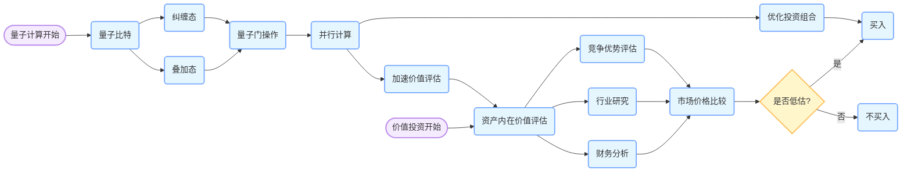

# 价值投资中的量子计算应用前景

> 关键词：价值投资、量子计算、应用前景、金融算法、市场分析

> 摘要：本文聚焦于价值投资领域，深入探讨量子计算在其中的应用前景。首先介绍了价值投资和量子计算的背景知识，包括目的范围、预期读者等内容。接着阐述了价值投资和量子计算的核心概念及其联系，通过文本示意图和Mermaid流程图进行直观展示。详细讲解了相关核心算法原理，用Python代码进行示例说明，并给出数学模型和公式。结合实际项目，展示了开发环境搭建、源代码实现与解读。分析了量子计算在价值投资中的实际应用场景，推荐了学习、开发相关的工具和资源，包括书籍、在线课程、开发框架等。最后总结了未来发展趋势与挑战，解答了常见问题，并提供了扩展阅读和参考资料，旨在为读者全面呈现量子计算在价值投资领域的潜力和发展方向。

## 1. 背景介绍 
### 1.1 目的和范围
价值投资作为一种长期的投资策略，旨在寻找被市场低估的资产，并通过长期持有来获取资产价值回归带来的收益。传统的价值投资分析方法在处理大规模、复杂的数据时面临着计算能力和时间的限制。而量子计算作为一种新兴的计算技术，具有强大的并行计算能力和处理复杂问题的潜力。本文的目的是探讨量子计算在价值投资中的应用前景，研究量子计算如何为价值投资带来新的突破和机遇。范围涵盖了从价值投资的基本概念到量子计算的原理，以及两者结合的具体应用场景和技术实现。

### 1.2 预期读者
本文预期读者包括金融领域的投资者、分析师、基金经理，他们希望了解量子计算技术如何提升价值投资的效率和准确性；计算机科学领域的研究人员和开发者，对量子计算在金融领域的应用感兴趣；以及对新兴技术和金融投资交叉领域有探索欲望的普通读者。

### 1.3 文档结构概述
本文将按照以下结构展开：首先介绍价值投资和量子计算的核心概念及其联系，通过文本示意图和流程图直观呈现；接着详细阐述相关核心算法原理，并使用Python代码进行示例；给出涉及的数学模型和公式，并举例说明；通过项目实战展示开发环境搭建、源代码实现和代码解读；分析量子计算在价值投资中的实际应用场景；推荐学习和开发相关的工具和资源；最后总结未来发展趋势与挑战，解答常见问题并提供扩展阅读和参考资料。

### 1.4 术语表
#### 1.4.1 核心术语定义
- **价值投资**：一种基于对资产内在价值的分析，寻找被低估资产并长期持有的投资策略。
- **量子计算**：利用量子力学原理进行信息处理的计算技术，具有并行计算和处理复杂问题的能力。
- **量子比特**：量子计算中的基本信息单位，与经典比特不同，它可以同时处于多个状态。
- **量子门**：用于操作量子比特的基本逻辑单元，类似于经典计算中的逻辑门。
- **资产定价模型**：用于确定资产内在价值的数学模型，如资本资产定价模型（CAPM）。

#### 1.4.2 相关概念解释
- **量子纠缠**：量子比特之间的一种特殊关联状态，使得一个量子比特的状态改变会瞬间影响另一个量子比特的状态，即使它们相隔很远。
- **量子叠加**：量子比特可以同时处于多个状态的叠加态，这使得量子计算能够同时处理多个计算任务。
- **市场效率**：市场反映资产真实价值的程度，高效市场中资产价格能够迅速反映所有可用信息。

#### 1.4.3 缩略词列表
- **CAPM**：资本资产定价模型（Capital Asset Pricing Model）
- **QUBO**：二次无约束二进制优化问题（Quadratic Unconstrained Binary Optimization）
- **VQE**：变分量子特征求解器（Variational Quantum Eigensolver）

## 2. 核心概念与联系 

### 价值投资核心概念
价值投资的核心在于评估资产的内在价值，并与市场价格进行比较。投资者通过分析公司的财务报表、行业前景、竞争优势等因素，来确定资产的真实价值。如果市场价格低于内在价值，投资者认为该资产被低估，从而进行买入操作；反之，如果市场价格高于内在价值，则考虑卖出。

### 量子计算核心概念
量子计算基于量子力学原理，利用量子比特进行信息处理。量子比特可以同时处于多个状态的叠加态，通过量子门对量子比特进行操作，实现并行计算。例如，一个包含 $n$ 个量子比特的量子计算机可以同时处理 $2^n$ 个状态，这使得量子计算在处理大规模数据和复杂问题时具有巨大的优势。

### 核心概念联系的文本示意图
```plaintext
价值投资
|-- 资产内在价值评估
|   |-- 财务分析
|   |-- 行业研究
|   |-- 竞争优势评估
|-- 市场价格比较
|   |-- 寻找低估资产
|   |-- 投资决策

量子计算
|-- 量子比特
|   |-- 叠加态
|   |-- 纠缠态
|-- 量子门操作
|   |-- 并行计算

价值投资与量子计算联系
|-- 量子计算加速价值评估
|   |-- 处理大规模财务数据
|   |-- 复杂模型求解
|-- 优化投资组合
|   |-- 多目标优化问题求解
```

### Mermaid 流程图


## 3. 核心算法原理 & 具体操作步骤 

### 量子计算加速资产定价模型求解
在价值投资中，资产定价模型是评估资产内在价值的重要工具。以资本资产定价模型（CAPM）为例，其公式为 $R_i = R_f+\beta_i(R_m - R_f)$，其中 $R_i$ 是资产 $i$ 的预期收益率，$R_f$ 是无风险利率，$\beta_i$ 是资产 $i$ 的贝塔系数，$R_m$ 是市场组合的预期收益率。

传统计算方法在处理大规模资产的定价问题时，需要对每个资产进行单独计算，计算复杂度较高。而量子计算可以利用并行计算的优势，同时处理多个资产的定价问题。

以下是使用Python和Qiskit库模拟量子计算加速资产定价模型求解的示例代码：
```python
import numpy as np
from qiskit import QuantumCircuit, Aer, execute

# 定义参数
R_f = 0.02  # 无风险利率
R_m = 0.08  # 市场组合预期收益率
betas = [1.2, 0.8, 1.0]  # 资产的贝塔系数

# 量子比特数量
n_qubits = len(betas)

# 创建量子电路
qc = QuantumCircuit(n_qubits)

# 初始化量子比特为叠加态
for qubit in range(n_qubits):
    qc.h(qubit)

# 模拟量子计算求解预期收益率
qc.measure_all()

# 运行量子电路
backend = Aer.get_backend('qasm_simulator')
job = execute(qc, backend, shots=1000)
result = job.result()
counts = result.get_counts(qc)

# 计算预期收益率
expected_returns = []
for key in counts:
    index = int(key, 2)
    beta = betas[index]
    R_i = R_f + beta * (R_m - R_f)
    expected_returns.append(R_i)

print("预期收益率:", expected_returns)
```
### 具体操作步骤
1. **参数定义**：确定无风险利率 $R_f$、市场组合预期收益率 $R_m$ 和资产的贝塔系数 $\beta$。
2. **量子电路创建**：根据资产数量确定量子比特数量，创建量子电路，并将量子比特初始化为叠加态。
3. **量子计算模拟**：对量子电路进行测量，模拟量子计算过程。
4. **结果分析**：根据测量结果计算每个资产的预期收益率。

## 4. 数学模型和公式 & 详细讲解 & 举例说明 

### 资本资产定价模型（CAPM）
公式：$R_i = R_f+\beta_i(R_m - R_f)$
详细讲解：该公式用于计算资产 $i$ 的预期收益率。$R_f$ 表示无风险利率，通常可以用国债收益率来近似；$\beta_i$ 是资产 $i$ 的贝塔系数，衡量了资产 $i$ 的收益率相对于市场组合收益率的波动程度；$R_m$ 是市场组合的预期收益率。

举例说明：假设无风险利率 $R_f = 0.02$，市场组合预期收益率 $R_m = 0.08$，某资产的贝塔系数 $\beta = 1.2$，则该资产的预期收益率 $R = 0.02+1.2\times(0.08 - 0.02)=0.092$，即 $9.2\%$。

### 二次无约束二进制优化问题（QUBO）在投资组合优化中的应用
QUBO问题的一般形式为：
$$\min_{x\in\{0,1\}^n} \sum_{i=1}^{n}\sum_{j=1}^{n}Q_{ij}x_ix_j$$
其中 $x_i\in\{0,1\}$ 表示资产 $i$ 是否被选中，$Q_{ij}$ 是一个 $n\times n$ 的矩阵，包含了资产之间的相关性和预期收益率等信息。

详细讲解：在投资组合优化中，我们的目标是在一定的约束条件下，选择合适的资产组合，使得投资组合的收益最大化或风险最小化。QUBO问题可以将这个优化问题转化为一个二进制变量的二次优化问题。

举例说明：假设有三个资产，我们希望选择其中一些资产组成投资组合。设 $x_1,x_2,x_3$ 分别表示这三个资产是否被选中（$1$ 表示选中，$0$ 表示不选中），$Q$ 矩阵为：
$$Q=\begin{bmatrix}
-0.1 & 0.05 & 0.02\\
0.05 & -0.15 & 0.03\\
0.02 & 0.03 & -0.08
\end{bmatrix}$$
则QUBO问题为：
$$\min_{x\in\{0,1\}^3} -0.1x_1^2 - 0.15x_2^2 - 0.08x_3^2+0.1x_1x_2 + 0.04x_1x_3+0.06x_2x_3$$
通过求解这个QUBO问题，我们可以得到最优的资产组合。

## 5. 项目实战：代码实际案例和详细解释说明 

### 5.1  开发环境搭建
#### 安装Python
首先，确保你已经安装了Python 3.x版本。可以从Python官方网站（https://www.python.org/downloads/）下载并安装。

#### 安装Qiskit库
Qiskit是一个用于量子计算的开源Python库。可以使用以下命令进行安装：
```sh
pip install qiskit
```

#### 安装必要的依赖库
还需要安装一些其他的依赖库，如NumPy、Matplotlib等：
```sh
pip install numpy matplotlib
```

### 5.2  源代码详细实现和代码解读
以下是一个使用Qiskit解决QUBO问题的完整代码示例：
```python
import numpy as np
from qiskit import Aer
from qiskit.utils import algorithm_globals
from qiskit.algorithms import QAOA
from qiskit_optimization.problems import QuadraticProgram
from qiskit_optimization.algorithms import MinimumEigenOptimizer

# 定义QUBO矩阵
Q = np.array([
    [-0.1, 0.05, 0.02],
    [0.05, -0.15, 0.03],
    [0.02, 0.03, -0.08]
])

# 创建QuadraticProgram对象
qp = QuadraticProgram()
for i in range(Q.shape[0]):
    qp.binary_var(name=f'x{i}')

# 设置目标函数
linear = {f'x{i}': Q[i, i] for i in range(Q.shape[0])}
quadratic = {
    (f'x{i}', f'x{j}'): Q[i, j] for i in range(Q.shape[0]) for j in range(i + 1, Q.shape[0])
}
qp.minimize(linear=linear, quadratic=quadratic)

# 使用QAOA算法求解
algorithm_globals.random_seed = 1234
backend = Aer.get_backend('qasm_simulator')
qaoa = QAOA(reps=2, quantum_instance=backend)
optimizer = MinimumEigenOptimizer(qaoa)
result = optimizer.solve(qp)

# 输出结果
print("最优解:", result.x)
print("最优目标值:", result.fval)
```
### 代码解读
1. **导入必要的库**：导入Qiskit相关的库和NumPy库。
2. **定义QUBO矩阵**：定义一个 $3\times3$ 的QUBO矩阵 $Q$，表示资产之间的相关性和预期收益率。
3. **创建QuadraticProgram对象**：使用Qiskit的QuadraticProgram类创建一个二次规划问题对象，并定义二进制变量 $x_0,x_1,x_2$。
4. **设置目标函数**：将QUBO矩阵的线性项和二次项设置为目标函数。
5. **使用QAOA算法求解**：使用量子近似优化算法（QAOA）求解QUBO问题。设置随机种子，选择模拟器后端，创建QAOA对象和优化器对象，并调用 `solve` 方法求解问题。
6. **输出结果**：输出最优解和最优目标值。

### 5.3  代码解读与分析
通过上述代码，我们可以看到如何使用Qiskit库将QUBO问题转化为一个量子优化问题，并使用QAOA算法进行求解。在实际应用中，QUBO问题可以用于投资组合优化，通过求解最优的资产组合，实现投资收益的最大化或风险的最小化。

量子计算在解决QUBO问题上具有潜在的优势，因为量子算法可以利用量子比特的叠加态和纠缠态，并行地搜索解空间，从而更快地找到最优解。然而，目前量子计算技术还处于发展阶段，实际应用中可能会受到量子比特数量、噪声等因素的限制。

## 6. 实际应用场景 
### 资产定价与估值
量子计算可以加速资产定价模型的求解过程，处理大规模的财务数据和复杂的模型。例如，在对多个公司进行估值时，传统方法可能需要较长的时间来计算每个公司的内在价值，而量子计算可以并行处理这些计算任务，大大提高估值效率。

### 投资组合优化
投资组合优化是价值投资中的一个重要问题，目标是在风险和收益之间找到最佳平衡。量子计算可以用于解决投资组合优化中的多目标优化问题，如QUBO问题。通过利用量子算法的并行计算能力，可以更快地找到最优的资产组合，提高投资组合的绩效。

### 风险管理
在价值投资中，风险管理至关重要。量子计算可以用于风险评估和预测，通过处理大量的市场数据和历史信息，更准确地评估投资组合的风险。例如，量子计算可以用于模拟市场波动和资产价格变化，帮助投资者制定更有效的风险管理策略。

### 市场趋势分析
量子计算可以处理复杂的市场数据，挖掘隐藏的市场趋势和规律。通过对大量的新闻、社交媒体数据和市场交易数据进行分析，量子计算可以帮助投资者更好地理解市场动态，做出更明智的投资决策。

## 7. 工具和资源推荐
### 7.1 学习资源推荐
#### 7.1.1 书籍推荐
- 《量子计算与量子信息》（Quantum Computation and Quantum Information）：由Michael A. Nielsen和Isaac L. Chuang所著，是量子计算领域的经典教材，涵盖了量子计算的基本原理、算法和应用。
- 《价值投资：从格雷厄姆到巴菲特》（Value Investing: From Graham to Buffett and Beyond）：由Bruce C. N. Greenwald等人所著，详细介绍了价值投资的理论和实践方法。

#### 7.1.2 在线课程
- Coursera上的“量子计算基础”（Foundations of Quantum Computing）课程：由University of Maryland提供，介绍了量子计算的基本概念和原理。
- edX上的“价值投资原理”（Principles of Value Investing）课程：由Columbia Business School提供，讲解了价值投资的核心原则和分析方法。

#### 7.1.3 技术博客和网站
- Qiskit官方博客（https://qiskit.org/blog/）：提供了量子计算领域的最新技术和应用案例。
- Seeking Alpha（https://seekingalpha.com/）：是一个金融投资领域的知名网站，提供了大量的价值投资分析文章和研究报告。

### 7.2 开发工具框架推荐
#### 7.2.1 IDE和编辑器
- PyCharm：是一个功能强大的Python集成开发环境，支持Qiskit等量子计算库的开发。
- Visual Studio Code：是一个轻量级的代码编辑器，具有丰富的插件和扩展功能，适合量子计算代码的编写和调试。

#### 7.2.2 调试和性能分析工具
- Qiskit的调试工具：Qiskit提供了一些调试工具，如 `qiskit.visualization` 模块，可以用于可视化量子电路和测量结果。
- Profiling工具：Python的 `cProfile` 模块可以用于性能分析，帮助开发者找出代码中的性能瓶颈。

#### 7.2.3 相关框架和库
- Qiskit：是一个用于量子计算的开源Python库，提供了量子电路构建、模拟和优化等功能。
- PennyLane：是一个用于量子机器学习的开源库，支持多种量子计算硬件和模拟器。

### 7.3 相关论文著作推荐
#### 7.3.1 经典论文
- Shor, P. W. (1994). Algorithms for quantum computation: discrete logarithms and factoring. Proceedings of the 35th Annual Symposium on Foundations of Computer Science, 124–134. 该论文提出了Shor算法，展示了量子计算在因式分解问题上的巨大优势。
- Markowitz, H. M. (1952). Portfolio selection. The Journal of Finance, 7(1), 77–91. 该论文提出了现代投资组合理论，为投资组合优化奠定了基础。

#### 7.3.2 最新研究成果
- “Quantum Computing for Finance: State of the Art and Future Prospects”：该研究报告总结了量子计算在金融领域的最新应用和发展趋势。
- “Quantum Algorithms for Portfolio Optimization”：该论文探讨了量子算法在投资组合优化中的应用和性能。

#### 7.3.3 应用案例分析
- “Quantum Computing in Asset Pricing: A Case Study”：该案例分析了量子计算在资产定价中的应用，展示了量子计算在提高定价效率和准确性方面的优势。
- “Quantum Portfolio Optimization in Real-World Markets”：该案例研究了量子算法在实际市场中的投资组合优化应用，评估了量子计算的实际效果。

## 8. 总结：未来发展趋势与挑战
### 未来发展趋势
- **技术融合**：量子计算将与人工智能、大数据等技术深度融合，为价值投资提供更强大的分析工具和决策支持。例如，结合量子计算和机器学习算法，可以更准确地预测市场趋势和资产价格变化。
- **应用拓展**：量子计算在价值投资中的应用将不断拓展，除了资产定价、投资组合优化和风险管理等领域，还可能应用于金融衍生品定价、信用风险评估等更复杂的金融问题。
- **硬件发展**：随着量子计算硬件技术的不断进步，量子比特数量将不断增加，噪声水平将不断降低，这将使得量子计算在价值投资中的应用更加可行和有效。

### 挑战
- **技术成熟度**：目前量子计算技术还处于发展阶段，量子比特的稳定性和纠错能力仍然是制约其应用的主要因素。在实际应用中，需要解决量子噪声、退相干等问题，提高量子计算的可靠性和准确性。
- **人才短缺**：量子计算和价值投资都是专业性很强的领域，需要既懂量子计算又懂金融投资的复合型人才。目前这类人才相对短缺，限制了量子计算在价值投资中的推广和应用。
- **成本问题**：量子计算设备的研发和维护成本较高，普通投资者和金融机构难以承担。此外，量子计算服务的使用成本也较高，需要进一步降低成本，提高量子计算的性价比。

## 9. 附录：常见问题与解答
### 量子计算在价值投资中的应用是否已经成熟？
目前量子计算在价值投资中的应用还处于研究和实验阶段，尚未完全成熟。虽然量子计算具有强大的计算能力，但在实际应用中还面临着技术、成本等方面的挑战。随着量子计算技术的不断发展和完善，其在价值投资中的应用前景将更加广阔。

### 普通投资者如何参与量子计算在价值投资中的应用？
普通投资者目前可以通过关注相关的研究进展和行业动态，了解量子计算在价值投资中的应用潜力。同时，可以学习量子计算和价值投资的相关知识，提高自己的投资能力。未来，随着量子计算技术的普及和应用，可能会出现一些基于量子计算的投资工具和服务，普通投资者可以根据自己的需求选择合适的产品。

### 量子计算会取代传统的价值投资分析方法吗？
量子计算不会完全取代传统的价值投资分析方法。传统方法在长期的实践中积累了丰富的经验和理论基础，具有一定的可靠性和实用性。量子计算可以作为一种补充和增强的工具，与传统方法相结合，提高价值投资分析的效率和准确性。

## 10. 扩展阅读 & 参考资料
### 扩展阅读
- 《量子计算与金融革命》：探讨了量子计算在金融领域的全面应用和潜在影响。
- 《价值投资实战手册》：提供了更多价值投资的实际案例和操作技巧。

### 参考资料
- Nielsen, M. A., & Chuang, I. L. (2010). Quantum Computation and Quantum Information. Cambridge University Press.
- Greenwald, B. C. N., Kahn, J., Sonkin, P. D., & van Biema, M. (2001). Value Investing: From Graham to Buffett and Beyond. Wiley.
- Qiskit官方文档（https://qiskit.org/documentation/）
- Seeking Alpha网站文章

作者：AI天才研究院/AI Genius Institute & 禅与计算机程序设计艺术 /Zen And The Art of Computer Programming