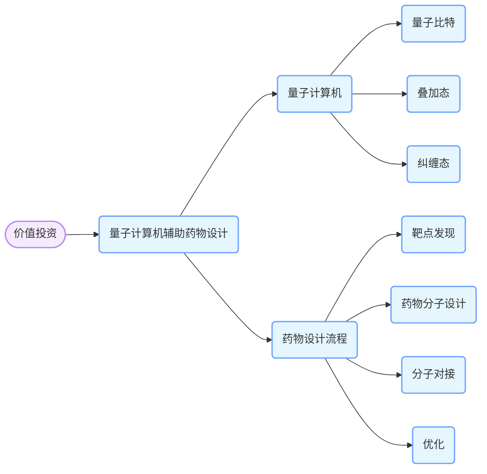

# 价值投资中的量子计算机辅助药物设计分析

> 关键词：价值投资、量子计算机、药物设计、计算化学、投资分析

> 摘要：本文聚焦于价值投资领域中量子计算机辅助药物设计这一新兴且极具潜力的方向。通过深入剖析量子计算机在药物设计中的核心概念、算法原理、数学模型，结合实际项目案例，阐述其在药物研发过程中的应用优势。同时探讨了该领域的实际应用场景、可利用的工具资源，分析了未来发展趋势与挑战，旨在为价值投资者提供全面、深入的技术与投资分析，助力其把握这一前沿领域的投资机会。

## 1. 背景介绍 
### 1.1 目的和范围
本文章的目的在于全面深入地分析价值投资与量子计算机辅助药物设计之间的关联。一方面，详细介绍量子计算机在药物设计中的原理、技术实现和应用场景，让读者了解这一前沿技术的工作机制和潜在价值；另一方面，从价值投资的角度出发，探讨如何评估量子计算机辅助药物设计项目的投资价值，为投资者提供决策依据。范围涵盖了从量子计算机的基本概念到药物设计的具体流程，以及投资分析的相关方法和案例。

### 1.2 预期读者
本文预期读者主要包括价值投资者、药物研发领域的专业人士、计算机科学和量子计算领域的研究人员以及对新兴技术投资感兴趣的爱好者。投资者可以从中获取关于量子计算机辅助药物设计项目的投资分析方法和潜在机会；药物研发人员能够了解量子计算技术在药物设计中的应用，为研发工作提供新思路；计算机科学和量子计算研究人员可以参考文中的技术原理和算法实现；而技术爱好者则可以通过本文对这一前沿领域有一个全面的认识。

### 1.3 文档结构概述
本文将按照以下结构展开：首先介绍相关的背景知识，包括核心术语和概念；接着阐述量子计算机辅助药物设计的核心概念、算法原理和数学模型；然后通过实际项目案例展示该技术的具体应用；之后探讨其实际应用场景和可利用的工具资源；再分析该领域的未来发展趋势与挑战；最后提供常见问题解答和扩展阅读参考资料。

### 1.4 术语表
#### 1.4.1 核心术语定义
- **价值投资**：一种投资策略，投资者通过对资产的内在价值进行评估，寻找被低估的资产进行投资，以期在长期获得超过市场平均水平的回报。
- **量子计算机**：基于量子力学原理运行的计算机，利用量子比特（qubit）的叠加和纠缠特性进行信息处理，具有远超传统计算机的计算能力。
- **药物设计**：运用计算机科学、化学和生物学等多学科知识，设计出具有特定药理活性的药物分子的过程。
- **量子化学计算**：利用量子力学原理计算分子的电子结构和性质，为药物设计提供理论基础。
- **分子对接**：研究小分子（如药物）与生物大分子（如蛋白质）之间相互作用的方法，用于预测药物与靶点的结合模式和亲和力。

#### 1.4.2 相关概念解释
- **量子比特（qubit）**：量子计算机的基本信息单元，与传统计算机的比特不同，qubit 可以同时处于 0 和 1 的叠加态，使得量子计算机能够并行处理大量信息。
- **叠加态**：量子系统可以同时处于多个状态的叠加，例如一个 qubit 可以同时处于 0 和 1 的状态，这使得量子计算机在处理某些问题时具有指数级的速度优势。
- **纠缠态**：多个 qubit 之间存在一种特殊的关联，使得一个 qubit 的状态改变会立即影响其他纠缠 qubit 的状态，即使它们之间的距离很远。纠缠态是量子计算和量子通信的重要基础。
- **药物靶点**：药物在体内作用的特定分子，通常是蛋白质或核酸，药物通过与靶点结合来发挥药理作用。

#### 1.4.3 缩略词列表
- **QC**：量子计算机（Quantum Computer）
- **QM**：量子力学（Quantum Mechanics）
- **MD**：分子动力学（Molecular Dynamics）
- **DOCK**：分子对接（Docking）
- **AI**：人工智能（Artificial Intelligence）

## 2. 核心概念与联系 

### 核心概念原理
量子计算机辅助药物设计是将量子计算机的强大计算能力应用于药物研发过程中的一种新兴技术。传统的药物设计方法在处理复杂的分子结构和相互作用时面临着计算资源和时间的限制，而量子计算机的独特优势可以帮助解决这些问题。

量子计算机利用量子比特的叠加和纠缠特性，能够同时处理大量的计算任务，从而大大加速药物设计中的计算过程。例如，在量子化学计算中，量子计算机可以更准确地计算分子的电子结构和能量，为药物分子的设计和优化提供更精确的理论依据。

### 架构的文本示意图
```plaintext
价值投资
    |
    | 关联
    |
量子计算机辅助药物设计
    |
    | 组成部分
    |
量子计算机         药物设计流程
    |                 |
    | 技术原理        | 环节
    |
量子比特、叠加态、纠缠态  靶点发现、药物分子设计、分子对接、优化
```

### Mermaid 流程图


## 3. 核心算法原理 & 具体操作步骤 

### 量子化学计算算法原理
量子化学计算的核心是求解分子的薛定谔方程，以获得分子的电子结构和能量。传统计算机在处理大规模分子的薛定谔方程时面临着指数级的计算复杂度，而量子计算机可以利用量子算法更高效地求解。

以下是一个简单的基于变分量子特征求解器（VQE）的量子化学计算的 Python 代码示例：

```python
import pennylane as qml
from pennylane import numpy as np

# 定义量子电路
dev = qml.device("default.qubit", wires=2)

@qml.qnode(dev)
def quantum_circuit(params):
    qml.RY(params[0], wires=0)
    qml.CNOT(wires=[0, 1])
    return qml.expval(qml.PauliZ(0))

# 定义哈密顿量
H = qml.Hamiltonian([1.0], [qml.PauliZ(0)])

# 定义损失函数
def cost(params):
    return qml.expval(H)(params)

# 初始化参数
params = np.array([0.1], requires_grad=True)

# 优化参数
opt = qml.GradientDescentOptimizer(stepsize=0.4)
steps = 100
for i in range(steps):
    params = opt.step(cost, params)

print("Optimized energy:", cost(params))
```

### 具体操作步骤
1. **确定研究对象**：明确要研究的药物分子和靶点，获取它们的结构信息。
2. **选择量子算法**：根据研究问题的特点，选择合适的量子算法，如 VQE 用于量子化学计算，量子退火算法用于优化问题。
3. **构建量子电路**：将所选的量子算法转化为量子电路，确定量子比特的数量和操作序列。
4. **初始化参数**：为量子电路中的参数赋初值。
5. **优化参数**：使用优化算法（如梯度下降法）不断调整参数，以最小化损失函数。
6. **分析结果**：根据优化后的参数，计算分子的性质和相互作用，为药物设计提供依据。

## 4. 数学模型和公式 & 详细讲解 & 举例说明 

### 薛定谔方程
薛定谔方程是量子力学的基本方程，用于描述量子系统的状态随时间的演化。对于分子系统，定态薛定谔方程可以表示为：

$$\hat{H}\psi = E\psi$$

其中，$\hat{H}$ 是哈密顿算符，描述了分子系统的总能量；$\psi$ 是波函数，描述了分子系统的量子状态；$E$ 是能量本征值。

### 详细讲解
哈密顿算符 $\hat{H}$ 包含了分子中电子和原子核的动能以及它们之间的相互作用势能。求解薛定谔方程的目的是找到波函数 $\psi$ 和对应的能量本征值 $E$，从而了解分子的电子结构和能量。

### 举例说明
考虑一个简单的氢分子（$H_2$），其哈密顿算符可以表示为：

$$\hat{H} = -\frac{1}{2}\nabla_1^2 - \frac{1}{2}\nabla_2^2 - \frac{1}{r_{1A}} - \frac{1}{r_{1B}} - \frac{1}{r_{2A}} - \frac{1}{r_{2B}} + \frac{1}{r_{12}} + \frac{1}{R_{AB}}$$

其中，$\nabla_1^2$ 和 $\nabla_2^2$ 分别是两个电子的拉普拉斯算符，$r_{1A}$、$r_{1B}$、$r_{2A}$、$r_{2B}$ 分别是电子与原子核的距离，$r_{12}$ 是两个电子之间的距离，$R_{AB}$ 是两个原子核之间的距离。

通过求解这个哈密顿算符对应的薛定谔方程，可以得到氢分子的电子结构和能量，从而了解氢分子的化学性质。

## 5. 项目实战：代码实际案例和详细解释说明 

### 5.1  开发环境搭建
为了实现量子计算机辅助药物设计的项目，我们需要搭建相应的开发环境。以下是具体步骤：

1. **安装 Python**：Python 是一种广泛使用的编程语言，许多量子计算库都支持 Python。可以从 Python 官方网站（https://www.python.org/downloads/）下载并安装 Python。
2. **安装量子计算库**：推荐使用 PennyLane 和 Qiskit 等量子计算库。可以使用 pip 命令进行安装：
```bash
pip install pennylane
pip install qiskit
```
3. **安装分子模拟库**：为了进行分子结构的处理和模拟，可以安装 RDKit 库：
```bash
pip install rdkit-pypi
```

### 5.2  源代码详细实现和代码解读
以下是一个简单的量子计算机辅助药物设计的项目示例，主要实现分子对接的模拟：

```python
import pennylane as qml
import numpy as np
from rdkit import Chem
from rdkit.Chem import AllChem

# 定义量子电路
dev = qml.device("default.qubit", wires=2)

@qml.qnode(dev)
def quantum_docking_circuit(params, ligand_coords, target_coords):
    # 初始化量子比特
    qml.RY(params[0], wires=0)
    qml.RY(params[1], wires=1)
    
    # 模拟分子相互作用
    # 这里简单用一个线性组合表示
    interaction = np.dot(ligand_coords, target_coords)
    qml.RZ(interaction, wires=0)
    
    return qml.expval(qml.PauliZ(0))

# 加载分子结构
ligand = Chem.MolFromSmiles('CCO')
AllChem.EmbedMolecule(ligand)
ligand_coords = ligand.GetConformer().GetPositions()

target = Chem.MolFromSmiles('C=O')
AllChem.EmbedMolecule(target)
target_coords = target.GetConformer().GetPositions()

# 初始化参数
params = np.array([0.1, 0.2], requires_grad=True)

# 定义损失函数
def cost(params):
    return quantum_docking_circuit(params, ligand_coords, target_coords)

# 优化参数
opt = qml.GradientDescentOptimizer(stepsize=0.4)
steps = 100
for i in range(steps):
    params = opt.step(cost, params)

print("Optimized docking score:", cost(params))
```

### 代码解读与分析
1. **量子电路定义**：使用 PennyLane 定义了一个简单的量子电路 `quantum_docking_circuit`，该电路模拟了药物分子（配体）与靶点分子之间的相互作用。
2. **分子结构加载**：使用 RDKit 库加载配体和靶点分子的结构，并生成它们的三维坐标。
3. **参数初始化**：初始化量子电路的参数 `params`。
4. **损失函数定义**：定义了一个损失函数 `cost`，用于评估分子对接的效果。
5. **参数优化**：使用梯度下降优化器 `GradientDescentOptimizer` 对参数进行优化，以最小化损失函数。
6. **结果输出**：输出优化后的分子对接分数。

## 6. 实际应用场景 
### 药物靶点发现
量子计算机可以通过更准确地计算生物大分子的结构和功能，帮助发现潜在的药物靶点。例如，通过量子化学计算可以预测蛋白质的活性位点和结合模式，为药物研发提供新的靶点信息。

### 药物分子设计
利用量子计算机的强大计算能力，可以设计出具有更高活性和选择性的药物分子。量子算法可以在大规模的分子数据库中快速筛选出符合要求的分子结构，并对其进行优化。

### 药物代谢和毒性预测
量子计算机可以模拟药物在体内的代谢过程和毒性反应，帮助评估药物的安全性和有效性。通过计算药物分子与代谢酶和受体的相互作用，可以预测药物的代谢途径和潜在的毒性风险。

### 个性化药物治疗
结合患者的基因信息和量子计算机的计算能力，可以实现个性化的药物治疗。量子算法可以根据患者的基因特征，筛选出最适合的药物分子，提高治疗效果和减少副作用。

## 7. 工具和资源推荐
### 7.1 学习资源推荐
#### 7.1.1 书籍推荐
- 《量子计算与量子信息》（Quantum Computation and Quantum Information）：由 Michael A. Nielsen 和 Isaac L. Chuang 所著，是量子计算领域的经典教材，涵盖了量子计算的基本原理、算法和应用。
- 《药物化学》（Medicinal Chemistry）：介绍了药物设计的基本原理和方法，包括靶点发现、药物分子设计、优化和评价等方面的内容。
- 《计算化学》（Computational Chemistry）：讲述了计算化学的理论和方法，包括量子化学计算、分子动力学模拟等，为量子计算机辅助药物设计提供了理论基础。

#### 7.1.2 在线课程
- Coursera 上的“量子计算基础”（Fundamentals of Quantum Computing）：由知名高校的教授授课，介绍了量子计算的基本概念、算法和编程。
- edX 上的“药物设计与发现”（Drug Design and Discovery）：涵盖了药物设计的各个环节，包括靶点发现、药物分子设计和优化等。
- Udemy 上的“计算化学与量子力学”（Computational Chemistry and Quantum Mechanics）：通过实际案例介绍了计算化学和量子力学在药物设计中的应用。

#### 7.1.3 技术博客和网站
- Quantum Computing Report：提供了量子计算领域的最新技术动态、研究成果和市场分析。
- Drug Discovery Today：关注药物研发领域的前沿进展，包括药物设计、靶点发现和临床试验等方面的内容。
- ChemRxiv：是一个预印本平台，发布了许多计算化学和药物设计领域的最新研究成果。

### 7.2 开发工具框架推荐
#### 7.2.1 IDE和编辑器
- PyCharm：是一款功能强大的 Python 集成开发环境，支持代码编辑、调试、版本控制等功能，适合量子计算和药物设计项目的开发。
- Jupyter Notebook：是一个交互式的开发环境，支持代码、文本和可视化的混合展示，方便进行数据分析和模型验证。
- Visual Studio Code：是一款轻量级的代码编辑器，具有丰富的插件和扩展功能，支持多种编程语言和开发场景。

#### 7.2.2 调试和性能分析工具
- PennyLane 的调试工具：PennyLane 提供了一些调试工具，如量子电路可视化、梯度检查等，帮助开发者调试量子算法。
- Qiskit 的性能分析工具：Qiskit 提供了一些性能分析工具，如量子电路模拟时间分析、资源占用分析等，帮助开发者优化量子算法的性能。
- cProfile：是 Python 标准库中的一个性能分析工具，可以分析 Python 代码的运行时间和函数调用情况。

#### 7.2.3 相关框架和库
- PennyLane：是一个开源的量子机器学习库，支持多种量子计算硬件和模拟器，提供了丰富的量子算法和工具。
- Qiskit：是 IBM 开发的一个开源量子计算框架，提供了量子电路设计、模拟和实验的工具和接口。
- RDKit：是一个开源的化学信息学库，支持分子结构的处理、计算和可视化，广泛应用于药物设计和化学研究领域。

### 7.3 相关论文著作推荐
#### 7.3.1 经典论文
- "A variational eigenvalue solver on a photonic quantum processor"：介绍了变分量子特征求解器（VQE）的原理和实验实现，为量子化学计算提供了一种有效的方法。
- "Quantum docking: A quantum algorithm for molecular docking"：提出了一种基于量子算法的分子对接方法，展示了量子计算机在药物设计中的应用潜力。
- "Quantum algorithms for computational chemistry"：综述了量子算法在计算化学中的应用，包括量子化学计算、分子动力学模拟等方面。

#### 7.3.2 最新研究成果
- 关注 Nature、Science、Journal of the American Chemical Society 等顶级学术期刊，这些期刊经常发表量子计算机辅助药物设计领域的最新研究成果。
- 参加国际量子计算和药物研发领域的学术会议，如 Quantum Computing Conference、American Chemical Society National Meeting 等，了解最新的研究动态和技术进展。

#### 7.3.3 应用案例分析
- 研究一些成功的量子计算机辅助药物设计项目案例，了解其技术路线、算法选择和应用效果，为自己的项目提供参考。
- 分析一些大型制药公司和科研机构在该领域的研究成果和实践经验，学习他们的创新思路和方法。

## 8. 总结：未来发展趋势与挑战
### 未来发展趋势
- **技术融合**：量子计算机辅助药物设计将与人工智能、机器学习等技术深度融合，实现更高效、更准确的药物研发。例如，利用人工智能算法对量子计算结果进行分析和预测，加速药物分子的筛选和优化。
- **云服务普及**：随着量子计算技术的发展，量子计算云服务将逐渐普及，使得更多的科研机构和企业能够利用量子计算资源进行药物设计。这将降低量子计算的使用门槛，促进该领域的发展。
- **个性化医疗发展**：结合患者的基因信息和量子计算机的计算能力，个性化医疗将成为未来药物研发的重要方向。量子计算机可以为每个患者量身定制最适合的药物治疗方案，提高治疗效果和减少副作用。

### 挑战
- **硬件限制**：目前量子计算机的硬件技术还不够成熟，存在量子比特数量有限、量子比特保真度低、量子退相干等问题，限制了量子计算机在药物设计中的应用规模和精度。
- **算法优化**：虽然已经提出了一些量子算法用于药物设计，但这些算法还需要进一步优化和改进，以提高计算效率和准确性。同时，需要开发更多适用于量子计算机的新算法。
- **人才短缺**：量子计算机辅助药物设计是一个跨学科领域，需要既懂量子计算又懂药物设计的复合型人才。目前，该领域的人才短缺问题较为严重，制约了行业的发展。

## 9. 附录：常见问题与解答
### 量子计算机辅助药物设计的计算精度如何？
量子计算机在理论上可以提供更高的计算精度，特别是在处理量子化学计算等问题时。然而，目前量子计算机的硬件技术还存在一些限制，如量子比特保真度低、量子退相干等，可能会影响计算精度。随着量子计算技术的不断发展，计算精度有望得到进一步提高。

### 量子计算机辅助药物设计的成本高吗？
目前，量子计算机的研发和使用成本较高，主要包括硬件设备的购置、维护和运行成本。但是，随着量子计算技术的发展和普及，量子计算云服务的出现将降低使用成本。此外，量子计算机辅助药物设计可以加速药物研发过程，减少研发周期和成本，从长远来看具有一定的经济效益。

### 量子计算机辅助药物设计与传统药物设计方法有什么区别？
传统药物设计方法主要依赖于实验和经验，计算资源和时间有限，难以处理复杂的分子结构和相互作用。而量子计算机辅助药物设计利用量子计算机的强大计算能力，可以更准确地计算分子的电子结构和相互作用，加速药物研发过程，提高药物设计的效率和准确性。

### 如何评估量子计算机辅助药物设计项目的投资价值？
评估量子计算机辅助药物设计项目的投资价值需要综合考虑多个因素，包括技术可行性、市场需求、竞争态势、团队实力等。可以从以下几个方面进行评估：
- **技术创新性**：评估项目所采用的量子算法和技术是否具有创新性和领先性。
- **市场前景**：分析项目所针对的药物研发领域的市场规模和增长潜力。
- **竞争态势**：了解市场上其他类似项目的竞争情况，评估项目的竞争优势。
- **团队实力**：考察项目团队的专业背景和研发能力，包括量子计算、药物设计等方面的专家。

## 10. 扩展阅读 & 参考资料
- Nielsen, M. A., & Chuang, I. L. (2010). Quantum Computation and Quantum Information. Cambridge University Press.
- Silverman, R. B. (2014). The Organic Chemistry of Drug Design and Drug Action. Academic Press.
- Levine, I. N. (2009). Quantum Chemistry. Pearson Prentice Hall.
- PennyLane 官方文档：https://pennylane.ai/
- Qiskit 官方文档：https://qiskit.org/
- RDKit 官方文档：https://www.rdkit.org/

作者：AI天才研究院/AI Genius Institute & 禅与计算机程序设计艺术 /Zen And The Art of Computer Programming