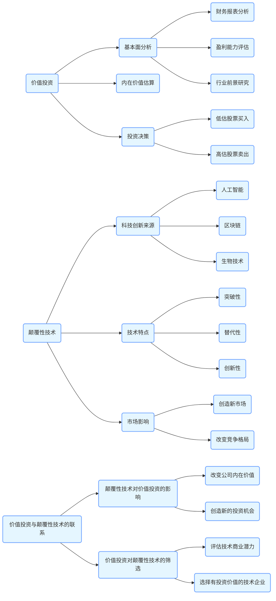

# 价值投资中的颠覆性技术分析

> 关键词：价值投资、颠覆性技术、技术分析、创新评估、投资策略

> 摘要：本文聚焦于价值投资领域中颠覆性技术的分析。旨在探讨如何在价值投资框架下准确识别、评估颠覆性技术，并制定与之适配的投资策略。通过深入剖析颠覆性技术的核心概念、算法原理、数学模型，结合项目实战案例和实际应用场景，为投资者提供全面且具操作性的分析方法。同时，推荐相关的学习资源、开发工具和研究论文，帮助投资者紧跟行业动态，应对未来发展的趋势与挑战。

## 1. 背景介绍 

### 1.1 目的和范围
在当今快速发展的科技时代，颠覆性技术层出不穷，它们不仅改变了行业格局，也为价值投资带来了新的机遇和挑战。本文的目的在于为价值投资者提供一套系统的方法，用于分析颠覆性技术对投资的影响，帮助投资者在复杂的市场环境中做出更明智的决策。范围涵盖了常见的颠覆性技术类型，如人工智能、区块链、生物技术等，以及如何将这些技术分析融入价值投资的流程中。

### 1.2 预期读者
本文主要面向对价值投资有一定了解，希望深入研究颠覆性技术对投资影响的投资者、金融分析师、投资顾问等专业人士。同时，也适合对科技发展和投资感兴趣的初学者，帮助他们建立起对价值投资中颠覆性技术分析的基本认知。

### 1.3 文档结构概述
本文将按照以下结构展开：首先介绍核心概念与联系，明确颠覆性技术和价值投资的基本定义和相互关系；接着阐述核心算法原理和具体操作步骤，通过 Python 代码详细说明如何进行技术分析；然后给出数学模型和公式，并结合实际例子进行讲解；再通过项目实战案例，展示如何将理论应用到实际投资中；之后探讨实际应用场景，分析颠覆性技术在不同行业的投资机会；推荐相关的工具和资源，帮助读者进一步学习和实践；最后总结未来发展趋势与挑战，并提供常见问题的解答和扩展阅读参考资料。

### 1.4 术语表

#### 1.4.1 核心术语定义
- **价值投资**：一种基于公司内在价值进行投资的策略，投资者通过分析公司的财务状况、行业地位、竞争优势等因素，寻找被市场低估的股票进行投资。
- **颠覆性技术**：指能够创造新的市场和价值网络，并最终取代现有技术和市场的创新技术。它通常具有突破传统、改变游戏规则的特点。
- **技术成熟度曲线**：一种描述新技术从诞生到成熟过程中，其可见度和市场预期随时间变化的曲线，通常包括萌芽期、过热期、低谷期、复苏期和成熟期。

#### 1.4.2 相关概念解释
- **创新扩散理论**：该理论描述了新技术如何在社会系统中传播和被采用的过程，包括创新者、早期采用者、早期大众、晚期大众和落后者五个阶段。
- **投资组合理论**：通过分散投资来降低风险的理论，投资者可以通过选择不同的资产构建投资组合，以实现风险和收益的平衡。

#### 1.4.3 缩略词列表
- **AI**：人工智能（Artificial Intelligence）
- **BTC**：比特币（Bitcoin）
- **ETF**：交易型开放式指数基金（Exchange-Traded Fund）

## 2. 核心概念与联系 

### 核心概念原理
#### 价值投资原理
价值投资的核心思想是认为股票价格会围绕其内在价值波动。投资者通过对公司的基本面分析，如财务报表、盈利能力、行业前景等，估算出公司的内在价值。当股票价格低于其内在价值时，投资者认为该股票被低估，具有投资价值；反之，则认为股票被高估，应避免投资。

#### 颠覆性技术原理
颠覆性技术通常源于科技创新，它打破了现有的技术范式和市场格局。这些技术往往具有以下特点：
- **突破性**：能够实现传统技术难以达到的性能或功能。
- **替代性**：对现有技术或产品具有替代作用，从而改变市场竞争态势。
- **创新性**：创造了全新的市场需求和商业模式。

### 核心概念架构的文本示意图
```plaintext
价值投资
|
|-- 基本面分析
|   |-- 财务报表分析
|   |-- 盈利能力评估
|   |-- 行业前景研究
|
|-- 内在价值估算
|
|-- 投资决策
|   |-- 低估股票买入
|   |-- 高估股票卖出

颠覆性技术
|
|-- 科技创新来源
|   |-- 人工智能
|   |-- 区块链
|   |-- 生物技术
|
|-- 技术特点
|   |-- 突破性
|   |-- 替代性
|   |-- 创新性
|
|-- 市场影响
|   |-- 创造新市场
|   |-- 改变竞争格局

价值投资与颠覆性技术的联系
|
|-- 颠覆性技术对价值投资的影响
|   |-- 改变公司内在价值
|   |-- 创造新的投资机会
|
|-- 价值投资对颠覆性技术的筛选
|   |-- 评估技术商业潜力
|   |-- 选择有投资价值的技术企业
```

### Mermaid 流程图


## 3. 核心算法原理 & 具体操作步骤 

### 核心算法原理
在价值投资中分析颠覆性技术，我们可以采用多因素评估算法。该算法综合考虑技术的多个方面，包括技术成熟度、市场潜力、竞争优势等，对颠覆性技术进行量化评估。具体步骤如下：
1. **确定评估因素**：选择对技术投资价值有重要影响的因素，如技术创新性、市场需求、商业模式等。
2. **设定权重**：根据各因素的重要程度，为每个因素分配相应的权重。
3. **量化评分**：对每个因素进行评分，评分范围可以设定为 0 - 10 分。
4. **计算综合得分**：将每个因素的评分乘以其权重，然后求和得到技术的综合得分。

### Python 源代码详细阐述
```python
# 定义评估因素和权重
factors = ['技术创新性', '市场需求', '商业模式', '竞争优势', '技术成熟度']
weights = [0.2, 0.25, 0.2, 0.15, 0.2]

# 定义技术评分函数
def technology_score(scores):
    """
    计算技术的综合得分
    :param scores: 各因素的评分列表
    :return: 技术的综合得分
    """
    if len(scores)!= len(weights):
        raise ValueError("评分列表的长度必须与权重列表的长度一致")
    total_score = 0
    for i in range(len(scores)):
        total_score += scores[i] * weights[i]
    return total_score

# 示例评分
example_scores = [8, 7, 6, 7, 5]
# 计算综合得分
score = technology_score(example_scores)
print(f"该技术的综合得分是: {score}")
```

### 具体操作步骤
1. **确定评估因素**：投资者根据自身的投资目标和经验，确定适合的评估因素。例如，如果关注技术的长期发展潜力，可以增加技术创新性和技术成熟度的权重；如果注重短期市场回报，可以提高市场需求和商业模式的权重。
2. **设定权重**：权重的设定需要综合考虑各因素的重要性和相关性。可以通过专家意见、历史数据分析等方法来确定合理的权重。
3. **量化评分**：对每个因素进行评分时，投资者需要收集相关的信息和数据，如技术报告、市场研究、行业分析等。评分过程可以采用主观判断和客观数据相结合的方法。
4. **计算综合得分**：使用上述 Python 代码，将各因素的评分输入函数中，计算技术的综合得分。根据综合得分，投资者可以对不同的颠覆性技术进行比较和筛选，选择具有较高投资价值的技术进行投资。

## 4. 数学模型和公式 & 详细讲解 & 举例说明 

### 数学模型和公式
多因素评估算法的数学模型可以表示为：
$$S = \sum_{i=1}^{n} w_i \times s_i$$
其中，$S$ 表示技术的综合得分，$w_i$ 表示第 $i$ 个评估因素的权重，$s_i$ 表示第 $i$ 个评估因素的评分，$n$ 表示评估因素的数量。

### 详细讲解
该公式的含义是将每个评估因素的评分乘以其对应的权重，然后将所有结果相加得到技术的综合得分。权重 $w_i$ 反映了该因素在整体评估中的重要程度，评分 $s_i$ 则是对该因素的具体量化。通过这种方式，可以综合考虑多个因素对技术投资价值的影响。

### 举例说明
假设我们要评估一项人工智能技术的投资价值，选择了以下五个评估因素：技术创新性、市场需求、商业模式、竞争优势和技术成熟度，权重分别为 0.2、0.25、0.2、0.15 和 0.2。各因素的评分如下：
- 技术创新性：8 分
- 市场需求：7 分
- 商业模式：6 分
- 竞争优势：7 分
- 技术成熟度：5 分

根据上述公式，计算该技术的综合得分：
$$S = 0.2 \times 8 + 0.25 \times 7 + 0.2 \times 6 + 0.15 \times 7 + 0.2 \times 5$$
$$S = 1.6 + 1.75 + 1.2 + 1.05 + 1$$
$$S = 6.6$$

综合得分 6.6 分可以作为评估该人工智能技术投资价值的一个参考。投资者可以根据这个得分，与其他技术进行比较，判断该技术是否值得投资。

## 5. 项目实战：代码实际案例和详细解释说明 

### 5.1 开发环境搭建
在进行项目实战之前，需要搭建相应的开发环境。以下是具体步骤：
1. **安装 Python**：从 Python 官方网站（https://www.python.org/downloads/）下载并安装 Python 3.x 版本。
2. **安装开发工具**：推荐使用 PyCharm 作为开发工具，它是一款功能强大的 Python IDE。可以从 JetBrains 官方网站（https://www.jetbrains.com/pycharm/download/）下载并安装。
3. **安装必要的库**：在项目中，我们只使用了 Python 内置的库，无需额外安装。

### 5.2 源代码详细实现和代码解读
```python
# 定义评估因素和权重
factors = ['技术创新性', '市场需求', '商业模式', '竞争优势', '技术成熟度']
weights = [0.2, 0.25, 0.2, 0.15, 0.2]

# 定义技术评分函数
def technology_score(scores):
    """
    计算技术的综合得分
    :param scores: 各因素的评分列表
    :return: 技术的综合得分
    """
    if len(scores)!= len(weights):
        raise ValueError("评分列表的长度必须与权重列表的长度一致")
    total_score = 0
    for i in range(len(scores)):
        total_score += scores[i] * weights[i]
    return total_score

# 定义技术列表
technologies = [
    {
        'name': '人工智能技术',
        'scores': [8, 7, 6, 7, 5]
    },
    {
        'name': '区块链技术',
        'scores': [7, 8, 7, 6, 4]
    },
    {
        'name': '生物技术',
        'scores': [6, 6, 5, 7, 6]
    }
]

# 计算各技术的综合得分
for tech in technologies:
    score = technology_score(tech['scores'])
    print(f"{tech['name']} 的综合得分是: {score}")
```

### 代码解读与分析
1. **定义评估因素和权重**：`factors` 列表存储了评估颠覆性技术的因素，`weights` 列表存储了各因素的权重。
2. **定义技术评分函数**：`technology_score` 函数接受一个评分列表作为输入，计算技术的综合得分。如果评分列表的长度与权重列表的长度不一致，会抛出 `ValueError` 异常。
3. **定义技术列表**：`technologies` 列表存储了要评估的技术信息，每个技术是一个字典，包含技术名称和各因素的评分。
4. **计算各技术的综合得分**：通过遍历 `technologies` 列表，调用 `technology_score` 函数计算每个技术的综合得分，并打印输出。

通过这个项目实战，我们可以对不同的颠覆性技术进行量化评估，比较它们的投资价值，为投资决策提供参考。

## 6. 实际应用场景 
### 科技行业
在科技行业，颠覆性技术层出不穷，如人工智能、机器学习、量子计算等。投资者可以通过分析这些技术的创新性、市场需求和商业潜力，选择具有投资价值的科技公司进行投资。例如，在人工智能领域，一些专注于自然语言处理、计算机视觉等细分领域的公司，如果其技术具有较高的创新性和市场竞争力，就可能成为潜在的投资对象。

### 金融行业
金融行业也受到颠覆性技术的深刻影响，如区块链、数字货币等。区块链技术可以提高金融交易的透明度和效率，降低成本。投资者可以关注采用区块链技术的金融科技公司，以及相关的数字货币投资机会。然而，由于数字货币市场的波动性较大，投资者需要谨慎评估风险。

### 医疗行业
生物技术的发展为医疗行业带来了巨大的变革，如基因编辑、细胞治疗等。这些颠覆性技术有望治疗一些传统医学难以治愈的疾病，具有广阔的市场前景。投资者可以关注从事生物技术研发的制药公司和科研机构，评估其技术的成熟度和商业应用潜力。

### 能源行业
新能源技术，如太阳能、风能、电动汽车等，正在逐渐改变能源行业的格局。投资者可以分析这些技术的发展趋势、政策支持和市场需求，选择有竞争力的能源企业进行投资。例如，电动汽车制造商如果能够在电池技术、自动驾驶等方面取得突破，就可能在市场竞争中占据优势。

## 7. 工具和资源推荐
### 7.1 学习资源推荐
#### 7.1.1 书籍推荐
- 《聪明的投资者》（The Intelligent Investor）：本杰明·格雷厄姆（Benjamin Graham）的经典著作，介绍了价值投资的基本原理和方法。
- 《创新者的窘境》（The Innovator's Dilemma）：克莱顿·克里斯坦森（Clayton M. Christensen）探讨了颠覆性技术对企业的影响和挑战。
- 《人工智能：现代方法》（Artificial Intelligence: A Modern Approach）：斯图尔特·罗素（Stuart Russell）和彼得·诺维格（Peter Norvig）的权威教材，介绍了人工智能的基本概念、算法和应用。

#### 7.1.2 在线课程
- Coursera 上的“Machine Learning”课程：由斯坦福大学教授吴恩达（Andrew Ng）讲授，是学习机器学习的经典课程。
- edX 上的“Blockchain and Cryptocurrency Technologies”课程：介绍了区块链和数字货币的技术原理和应用。
- Udemy 上的“Value Investing for Beginners”课程：适合初学者了解价值投资的基本概念和方法。

#### 7.1.3 技术博客和网站
- TechCrunch：提供科技行业的最新动态和创新技术的报道。
- Seeking Alpha：专注于金融市场和投资分析，有很多关于价值投资和颠覆性技术的文章。
- Medium 上的一些技术专栏，如 Towards Data Science，分享了人工智能、机器学习等领域的技术文章和实践经验。

### 7.2 开发工具框架推荐
#### 7.2.1 IDE和编辑器
- PyCharm：功能强大的 Python IDE，提供代码编辑、调试、版本控制等功能。
- Jupyter Notebook：交互式的开发环境，适合数据分析和机器学习项目的开发和演示。
- Visual Studio Code：轻量级的代码编辑器，支持多种编程语言，有丰富的插件扩展。

#### 7.2.2 调试和性能分析工具
- PDB：Python 内置的调试器，可以帮助开发者定位和解决代码中的问题。
- cProfile：Python 的性能分析工具，用于分析代码的运行时间和性能瓶颈。
- Py-Spy：用于实时分析 Python 程序的性能，提供可视化的性能报告。

#### 7.2.3 相关框架和库
- Pandas：用于数据处理和分析的 Python 库，提供了高效的数据结构和数据分析工具。
- NumPy：Python 的数值计算库，提供了多维数组对象和各种数学函数。
- Scikit-learn：用于机器学习的 Python 库，提供了丰富的机器学习算法和工具。

### 7.3 相关论文著作推荐
#### 7.3.1 经典论文
- “A Theory of the Consumption Function”：米尔顿·弗里德曼（Milton Friedman）提出了永久收入假说，对价值投资中的现金流分析有重要影响。
- “The Capital Asset Pricing Model: Theory and Evidence”：威廉·夏普（William F. Sharpe）等人提出了资本资产定价模型（CAPM），用于评估投资的风险和回报。
- “The Lean Startup”：埃里克·莱斯（Eric Ries）提出了精益创业的理念，对颠覆性技术企业的商业模式和创新管理有重要指导意义。

#### 7.3.2 最新研究成果
- 关注顶级学术期刊，如《Journal of Finance》《Management Science》《Nature》《Science》等，了解价值投资和颠覆性技术领域的最新研究进展。
- 参加学术会议和研讨会，如 ACM SIGKDD、NeurIPS 等，与行业专家和学者交流最新的研究成果。

#### 7.3.3 应用案例分析
- CB Insights：提供科技行业的数据分析和研究报告，包括颠覆性技术的应用案例和市场趋势分析。
- McKinsey Global Institute：发布关于科技、金融、医疗等行业的研究报告，有很多关于颠覆性技术对行业影响的案例分析。

## 8. 总结：未来发展趋势与挑战
### 未来发展趋势
- **技术融合加速**：不同的颠覆性技术之间将出现更多的融合，如人工智能与生物技术、区块链与物联网的结合，创造出更具创新性的解决方案和商业模式。
- **应用场景拓展**：颠覆性技术将在更多的行业和领域得到应用，如教育、农业、交通等，推动这些行业的数字化转型和升级。
- **可持续发展导向**：投资者将更加关注颠覆性技术对环境和社会的影响，倾向于投资那些具有可持续发展潜力的技术和企业。

### 挑战
- **技术不确定性**：颠覆性技术的发展具有很大的不确定性，投资者难以准确预测技术的发展方向和市场前景，增加了投资风险。
- **监管政策风险**：随着颠覆性技术的快速发展，监管政策可能滞后，导致市场秩序混乱。投资者需要密切关注监管政策的变化，避免因政策风险导致投资损失。
- **人才竞争激烈**：颠覆性技术领域需要大量的高素质人才，如人工智能工程师、区块链专家等。人才竞争激烈可能导致企业的人力成本上升，影响企业的盈利能力。

## 9. 附录：常见问题与解答
### 问题 1：如何确定评估因素的权重？
答：确定评估因素的权重需要综合考虑多个因素，如投资者的投资目标、行业特点、技术发展阶段等。可以采用专家意见法、层次分析法等方法来确定合理的权重。同时，也可以根据市场反馈和实际投资经验对权重进行调整。

### 问题 2：颠覆性技术的投资风险如何控制？
答：控制颠覆性技术的投资风险可以从以下几个方面入手：
- **分散投资**：将资金分散投资于不同的颠覆性技术和企业，降低单一技术或企业失败带来的风险。
- **深入研究**：对技术和企业进行深入的研究和分析，了解其技术实力、市场竞争力、商业模式等，选择具有较高投资价值的项目。
- **关注市场动态**：及时关注颠覆性技术的市场动态和行业趋势，根据市场变化调整投资策略。
- **设置止损点**：在投资时设置合理的止损点，当投资损失达到一定程度时，及时止损，避免损失进一步扩大。

### 问题 3：如何判断一项技术是否具有颠覆性？
答：判断一项技术是否具有颠覆性可以从以下几个方面考虑：
- **技术创新性**：该技术是否具有突破传统的创新点，能否实现传统技术难以达到的性能或功能。
- **市场影响**：该技术是否能够创造新的市场需求和商业模式，对现有市场格局产生重大影响。
- **替代性**：该技术是否能够替代现有技术或产品，提高生产效率或降低成本。
- **发展潜力**：该技术是否具有广阔的发展前景和应用空间，是否能够持续推动行业的发展和变革。

## 10. 扩展阅读 & 参考资料
- 格雷厄姆，《证券分析》，海南出版社，2006 年。
- 克里斯坦森，《创新者的解答》，中信出版社，2009 年。
- 吴恩达，Coursera 课程“Machine Learning”，https://www.coursera.org/learn/machine-learning。
- TechCrunch 网站，https://techcrunch.com/。
- Seeking Alpha 网站，https://seekingalpha.com/。

作者：AI天才研究院/AI Genius Institute & 禅与计算机程序设计艺术 /Zen And The Art of Computer Programming