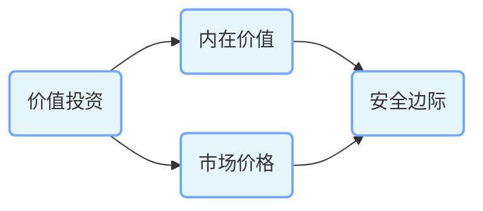

# 价值投资在不同市场环境下的应用

> 关键词：价值投资、市场环境、股票估值、投资策略、风险控制

> 摘要：本文旨在深入探讨价值投资在不同市场环境下的应用。首先介绍了价值投资的背景知识，包括目的、预期读者、文档结构和相关术语。接着阐述了价值投资的核心概念及其联系，通过示意图和流程图进行直观展示。详细讲解了价值投资的核心算法原理和具体操作步骤，结合 Python 代码进行说明。运用数学模型和公式对价值投资进行分析，并举例说明。通过项目实战，展示了价值投资在实际中的代码实现和解读。分析了价值投资在不同市场环境下的实际应用场景，推荐了相关的学习资源、开发工具框架和论文著作。最后总结了价值投资的未来发展趋势与挑战，解答了常见问题，并提供了扩展阅读和参考资料，帮助投资者更好地在不同市场环境中运用价值投资策略。

## 1. 背景介绍 
### 1.1 目的和范围
价值投资作为一种重要的投资理念，旨在通过分析公司的内在价值，寻找被市场低估的股票进行投资，以获取长期稳定的回报。本文的目的是全面探讨价值投资在不同市场环境（如牛市、熊市、震荡市等）下的应用策略，帮助投资者更好地理解和运用价值投资方法，提高投资决策的准确性和收益率。范围涵盖了价值投资的基本概念、核心算法、数学模型、实际案例以及相关的工具和资源等方面。

### 1.2 预期读者
本文的预期读者包括对价值投资感兴趣的个人投资者、金融从业者、投资研究人员以及相关专业的学生等。无论您是投资新手还是有一定经验的投资者，都可以从本文中获取有价值的信息，进一步提升自己的投资知识和技能。

### 1.3 文档结构概述
本文将按照以下结构进行阐述：首先介绍价值投资的背景知识，包括目的、预期读者、文档结构和相关术语；接着深入讲解价值投资的核心概念及其联系，通过示意图和流程图进行直观展示；详细说明价值投资的核心算法原理和具体操作步骤，并结合 Python 代码进行示例；运用数学模型和公式对价值投资进行分析，并举例说明；通过项目实战，展示价值投资在实际中的代码实现和解读；分析价值投资在不同市场环境下的实际应用场景；推荐相关的学习资源、开发工具框架和论文著作；最后总结价值投资的未来发展趋势与挑战，解答常见问题，并提供扩展阅读和参考资料。

### 1.4 术语表
#### 1.4.1 核心术语定义
- **价值投资**：一种基于对公司内在价值的分析，寻找被市场低估的股票进行投资的策略，强调长期投资和基本面分析。
- **内在价值**：公司的真实价值，通常通过对公司的财务状况、盈利能力、行业前景等因素进行综合评估得出。
- **市盈率（P/E）**：股票价格与每股收益的比率，用于衡量股票的估值水平。
- **市净率（P/B）**：股票价格与每股净资产的比率，反映了股票的市场价格相对于其账面价值的倍数。
- **股息率**：股息与股票价格的比率，衡量了股票的分红水平。

#### 1.4.2 相关概念解释
- **基本面分析**：通过研究公司的财务报表、行业竞争地位、管理层能力等基本面因素，评估公司的内在价值和投资价值。
- **安全边际**：股票的内在价值与市场价格之间的差额，为投资者提供了一定的风险缓冲。
- **长期投资**：持有股票的时间较长，通常为数年甚至数十年，以获取公司长期增长带来的收益。

#### 1.4.3 缩略词列表
- **P/E**：Price-to-Earnings Ratio，市盈率
- **P/B**：Price-to-Book Ratio，市净率
- **ROE**：Return on Equity，净资产收益率

## 2. 核心概念与联系 
价值投资的核心概念主要围绕公司的内在价值、市场价格和安全边际展开。内在价值是价值投资的基础，它是公司未来现金流的现值，通过对公司的财务状况、盈利能力、行业前景等因素进行综合分析得出。市场价格则是股票在证券市场上的交易价格，它受到市场供求关系、投资者情绪等多种因素的影响。安全边际是指股票的内在价值与市场价格之间的差额，它为投资者提供了一定的风险缓冲，当市场价格低于内在价值时，投资者可以以较低的价格买入股票，从而获得更高的投资回报。

以下是价值投资核心概念的文本示意图：

```plaintext
            价值投资
               |
               |
       内在价值 <------> 市场价格
               |
               |
           安全边际
```

Mermaid 流程图如下：



在这个流程图中，价值投资的核心在于评估内在价值和市场价格，并通过比较两者来确定安全边际。投资者通过对公司基本面的分析来估算内在价值，同时关注市场价格的波动。当安全边际足够大时，即市场价格低于内在价值，投资者可以考虑买入股票；当市场价格高于内在价值时，投资者可以考虑卖出股票。

## 3. 核心算法原理 & 具体操作步骤 
### 核心算法原理
价值投资的核心算法原理是通过对公司的财务数据进行分析，估算公司的内在价值，并与市场价格进行比较，以确定是否具有投资价值。常用的估值方法包括现金流折现法（DCF）、市盈率法、市净率法等。

#### 现金流折现法（DCF）
现金流折现法是一种基于公司未来现金流的估值方法，其基本原理是将公司未来的现金流按照一定的折现率折现到当前时刻，得到公司的内在价值。具体公式如下：

$$V = \sum_{t=1}^{n} \frac{CF_t}{(1 + r)^t}$$

其中，$V$ 表示公司的内在价值，$CF_t$ 表示第 $t$ 期的现金流，$r$ 表示折现率，$n$ 表示预测期数。

#### 市盈率法
市盈率法是一种相对估值方法，通过比较公司的市盈率与同行业其他公司的市盈率，来评估公司的估值水平。具体公式如下：

$$P = EPS \times P/E$$

其中，$P$ 表示股票价格，$EPS$ 表示每股收益，$P/E$ 表示市盈率。

#### 市净率法
市净率法也是一种相对估值方法，通过比较公司的市净率与同行业其他公司的市净率，来评估公司的估值水平。具体公式如下：

$$P = BVPS \times P/B$$

其中，$P$ 表示股票价格，$BVPS$ 表示每股净资产，$P/B$ 表示市净率。

### 具体操作步骤
#### 步骤 1：选择投资标的
投资者首先需要选择具有投资价值的公司，通常可以从行业前景、公司竞争力、财务状况等方面进行筛选。

#### 步骤 2：收集财务数据
收集所选公司的财务报表，包括资产负债表、利润表和现金流量表，以便进行后续的分析。

#### 步骤 3：估算内在价值
根据所选的估值方法，对公司的内在价值进行估算。例如，使用现金流折现法时，需要预测公司未来的现金流，并确定合适的折现率。

#### 步骤 4：比较内在价值和市场价格
将估算的内在价值与股票的市场价格进行比较，如果市场价格低于内在价值，且具有足够的安全边际，则可以考虑买入股票；如果市场价格高于内在价值，则可以考虑卖出股票。

#### 步骤 5：风险控制
在投资过程中，需要进行风险控制，例如分散投资、设置止损点等，以降低投资风险。

### Python 代码示例
以下是一个使用市盈率法估算股票内在价值的 Python 代码示例：

```python
# 定义每股收益和市盈率
eps = 2.0  # 每股收益
pe_ratio = 15  # 市盈率

# 计算股票内在价值
intrinsic_value = eps * pe_ratio

print(f"股票的内在价值为: {intrinsic_value} 元")
```

在这个代码示例中，我们假设每股收益为 2.0 元，市盈率为 15 倍，通过市盈率法计算出股票的内在价值为 30 元。

## 4. 数学模型和公式 & 详细讲解 & 举例说明 
### 现金流折现法（DCF）
#### 详细讲解
现金流折现法的核心思想是将公司未来的现金流按照一定的折现率折现到当前时刻，得到公司的内在价值。折现率反映了投资者对未来现金流的风险偏好，通常可以使用加权平均资本成本（WACC）作为折现率。预测期数 $n$ 可以根据公司的发展阶段和行业特点进行确定，一般可以预测 5 - 10 年。

#### 举例说明
假设某公司未来 5 年的现金流分别为 100 万元、120 万元、140 万元、160 万元和 180 万元，折现率为 10%，则该公司的内在价值计算如下：

$$V = \frac{100}{(1 + 0.1)^1} + \frac{120}{(1 + 0.1)^2} + \frac{140}{(1 + 0.1)^3} + \frac{160}{(1 + 0.1)^4} + \frac{180}{(1 + 0.1)^5}$$

```python
import numpy as np

# 定义未来 5 年的现金流
cash_flows = np.array([100, 120, 140, 160, 180])
# 定义折现率
discount_rate = 0.1

# 计算折现因子
discount_factors = np.array([(1 + discount_rate) ** i for i in range(1, len(cash_flows) + 1)])

# 计算折现后的现金流
discounted_cash_flows = cash_flows / discount_factors

# 计算内在价值
intrinsic_value = discounted_cash_flows.sum()

print(f"公司的内在价值为: {intrinsic_value} 万元")
```

### 市盈率法
#### 详细讲解
市盈率法是一种相对简单的估值方法，通过比较公司的市盈率与同行业其他公司的市盈率，来评估公司的估值水平。市盈率反映了投资者对公司未来盈利的预期，一般来说，市盈率越高，说明投资者对公司的未来盈利越乐观。

#### 举例说明
假设某公司的每股收益为 3 元，同行业平均市盈率为 20 倍，则该公司的股票内在价值计算如下：

$$P = 3 \times 20 = 60$$（元）

### 市净率法
#### 详细讲解
市净率法通过比较公司的市净率与同行业其他公司的市净率，来评估公司的估值水平。市净率反映了股票的市场价格相对于其账面价值的倍数，一般来说，市净率越低，说明股票的估值越低。

#### 举例说明
假设某公司的每股净资产为 10 元，同行业平均市净率为 2 倍，则该公司的股票内在价值计算如下：

$$P = 10 \times 2 = 20$$（元）

## 5. 项目实战：代码实际案例和详细解释说明 
### 5.1  开发环境搭建
在进行价值投资项目实战之前，需要搭建相应的开发环境。以下是具体的步骤：

#### 安装 Python
Python 是一种广泛使用的编程语言，在数据分析和金融领域有着丰富的库和工具。可以从 Python 官方网站（https://www.python.org/downloads/）下载并安装最新版本的 Python。

#### 安装必要的库
在 Python 中，有一些常用的库可以帮助我们进行财务数据的分析和处理，例如 Pandas、Numpy、Matplotlib 等。可以使用以下命令来安装这些库：

```bash
pip install pandas numpy matplotlib
```

### 5.2  源代码详细实现和代码解读
以下是一个使用 Pandas 库读取和分析财务数据，并使用市盈率法估算股票内在价值的代码示例：

```python
import pandas as pd

# 读取财务数据文件（假设文件名为 financial_data.csv）
data = pd.read_csv('financial_data.csv')

# 提取每股收益和市盈率数据
eps = data['EPS']
pe_ratio = data['P/E']

# 计算股票内在价值
intrinsic_value = eps * pe_ratio

# 将内在价值添加到数据框中
data['Intrinsic Value'] = intrinsic_value

# 打印结果
print(data)
```

#### 代码解读
1. **导入必要的库**：使用 `import pandas as pd` 导入 Pandas 库，用于数据的读取和处理。
2. **读取财务数据文件**：使用 `pd.read_csv('financial_data.csv')` 读取包含财务数据的 CSV 文件，并将其存储在 `data` 变量中。
3. **提取每股收益和市盈率数据**：从 `data` 数据框中提取 `EPS` 和 `P/E` 列的数据，并分别存储在 `eps` 和 `pe_ratio` 变量中。
4. **计算股票内在价值**：使用 `eps * pe_ratio` 计算股票的内在价值，并将结果存储在 `intrinsic_value` 变量中。
5. **将内在价值添加到数据框中**：使用 `data['Intrinsic Value'] = intrinsic_value` 将计算得到的内在价值添加到 `data` 数据框中。
6. **打印结果**：使用 `print(data)` 打印包含内在价值的数据框。

### 5.3  代码解读与分析
通过上述代码，我们可以方便地读取财务数据，并使用市盈率法估算股票的内在价值。在实际应用中，我们可以根据需要对代码进行扩展，例如添加更多的估值方法、进行数据可视化等。同时，需要注意数据的准确性和可靠性，确保估算结果的有效性。

## 6. 实际应用场景 
### 牛市环境
在牛市环境中，市场整体呈现上涨趋势，投资者情绪乐观，股票价格普遍较高。在这种情况下，价值投资仍然具有重要的意义。投资者可以通过深入研究公司的基本面，寻找那些具有持续盈利能力和成长潜力的公司，即使市场价格较高，但如果公司的内在价值能够支撑其股价，仍然可以考虑长期持有。此外，在牛市中，投资者也可以关注一些被市场低估的行业或公司，以获取超额收益。

### 熊市环境
熊市环境中，市场整体下跌，投资者情绪悲观，股票价格普遍较低。这对于价值投资者来说是一个较好的投资机会。投资者可以利用熊市的低迷，以较低的价格买入那些具有良好基本面和较高内在价值的股票。同时，在熊市中，投资者需要更加注重风险控制，避免过度投资和盲目跟风。

### 震荡市环境
震荡市环境中，市场价格波动较大，没有明显的上涨或下跌趋势。在这种情况下，价值投资可以帮助投资者过滤掉市场的短期波动，关注公司的长期价值。投资者可以通过定期评估公司的内在价值和市场价格，适时调整投资组合，以获取稳定的收益。

## 7. 工具和资源推荐
### 7.1 学习资源推荐
#### 7.1.1 书籍推荐
- 《聪明的投资者》（The Intelligent Investor）：本杰明·格雷厄姆（Benjamin Graham）的经典著作，被誉为价值投资的圣经，详细阐述了价值投资的基本原理和方法。
- 《证券分析》（Security Analysis）：同样是本杰明·格雷厄姆的著作，对价值投资的理论和实践进行了系统的阐述，是价值投资者的必读之书。
- 《巴菲特致股东的信》（Letters to Shareholders of Berkshire Hathaway）：沃伦·巴菲特（Warren Buffett）每年写给股东的信，包含了他的投资理念、策略和经验，是学习价值投资的宝贵资料。

#### 7.1.2 在线课程
- Coursera 上的“投资学原理”（Principles of Investing）：由宾夕法尼亚大学的教授授课，系统介绍了投资学的基本原理和方法，包括价值投资。
- edX 上的“金融市场”（Financial Markets）：由耶鲁大学的教授授课，涵盖了金融市场的各个方面，对价值投资有深入的讲解。

#### 7.1.3 技术博客和网站
- 雪球网（https://xueqiu.com/）：国内知名的投资社区，提供了丰富的股票分析、投资策略和价值投资案例。
- Seeking Alpha（https://seekingalpha.com/）：国外知名的投资分析网站，有大量的价值投资文章和研究报告。

### 7.2 开发工具框架推荐
#### 7.2.1 IDE和编辑器
- PyCharm：一款专业的 Python 集成开发环境，具有强大的代码编辑、调试和自动完成功能，适合进行价值投资项目的开发。
- Jupyter Notebook：一种交互式的开发环境，可以方便地进行数据分析和可视化，非常适合进行价值投资的研究和实验。

#### 7.2.2 调试和性能分析工具
- PDB：Python 自带的调试工具，可以帮助开发者定位代码中的错误和问题。
- cProfile：Python 的性能分析工具，可以分析代码的运行时间和资源消耗情况，帮助开发者优化代码性能。

#### 7.2.3 相关框架和库
- Pandas：用于数据处理和分析的 Python 库，提供了丰富的数据结构和函数，方便进行财务数据的处理和分析。
- Numpy：用于科学计算的 Python 库，提供了高效的数组操作和数学函数，在价值投资的计算中经常使用。
- Matplotlib：用于数据可视化的 Python 库，可以绘制各种图表和图形，帮助投资者直观地理解数据。

### 7.3 相关论文著作推荐
#### 7.3.1 经典论文
- “The Relationship Between Earnings' Yields, Market Values, and Return on Investment”：由 Eugene F. Fama 和 Kenneth R. French 发表的论文，研究了市盈率、市净率等估值指标与股票收益率之间的关系。
- “Common Risk Factors in the Returns on Stocks and Bonds”：同样是 Eugene F. Fama 和 Kenneth R. French 的论文，提出了著名的三因子模型，对价值投资的理论和实践产生了重要影响。

#### 7.3.2 最新研究成果
- 关注顶级金融学术期刊，如《Journal of Finance》、《Review of Financial Studies》等，这些期刊上经常发表关于价值投资的最新研究成果。

#### 7.3.3 应用案例分析
- 可以参考一些知名投资机构的研究报告和案例分析，了解他们在不同市场环境下如何应用价值投资策略。

## 8. 总结：未来发展趋势与挑战
### 未来发展趋势
- **数字化和智能化**：随着科技的不断发展，价值投资将越来越多地借助数字化和智能化工具进行分析和决策。例如，利用大数据和人工智能技术对公司的财务数据、行业信息和市场动态进行实时监测和分析，提高投资决策的准确性和效率。
- **全球化**：全球经济一体化的趋势将促使价值投资者更加关注国际市场，寻找具有投资价值的公司和项目。同时，不同国家和地区的市场环境和投资机会也将为价值投资带来更多的选择和挑战。
- **可持续投资**：越来越多的投资者开始关注企业的社会责任和可持续发展，将环境、社会和治理（ESG）因素纳入价值投资的考量范围。未来，可持续投资有望成为价值投资的重要发展方向。

### 挑战
- **市场不确定性**：市场环境充满不确定性，如宏观经济波动、政策变化、突发事件等，这些因素都会对公司的内在价值和市场价格产生影响，增加了价值投资的难度和风险。
- **信息不对称**：在投资过程中，投资者往往面临信息不对称的问题，难以获取全面、准确的公司信息。这可能导致投资者对公司的内在价值评估出现偏差，从而影响投资决策的正确性。
- **竞争加剧**：随着价值投资理念的普及，越来越多的投资者开始采用价值投资策略，市场竞争日益激烈。这使得寻找被市场低估的股票变得更加困难，投资者需要具备更高的分析能力和投资技巧。

## 9. 附录：常见问题与解答
### 问题 1：价值投资是否只适用于长期投资？
解答：价值投资强调对公司内在价值的分析和长期持有，但并不意味着只能进行长期投资。在某些情况下，当市场价格明显高于公司的内在价值时，投资者也可以选择卖出股票，实现短期获利。然而，从价值投资的本质来看，长期投资更符合其理念，因为公司的内在价值需要时间来体现，短期市场波动可能会掩盖公司的真实价值。

### 问题 2：如何确定公司的内在价值？
解答：确定公司的内在价值是价值投资的核心问题，常用的方法包括现金流折现法、市盈率法、市净率法等。不同的方法适用于不同的行业和公司，投资者需要根据具体情况选择合适的估值方法。同时，内在价值的估算还需要考虑公司的财务状况、盈利能力、行业前景、管理层能力等多种因素，是一个综合分析的过程。

### 问题 3：价值投资是否能保证盈利？
解答：价值投资并不能保证投资者一定能够盈利。虽然价值投资通过寻找被市场低估的股票来降低投资风险，但市场环境是复杂多变的，存在很多不确定性因素。即使公司的内在价值被低估，但如果市场价格长期不回归内在价值，或者公司的基本面发生恶化，投资者仍然可能面临亏损的风险。因此，价值投资需要投资者具备一定的风险意识和投资经验。

## 10. 扩展阅读 & 参考资料
### 扩展阅读
- 《穷查理宝典》（Poor Charlie's Almanack）：收录了查理·芒格（Charlie Munger）的演讲和文章，包含了他的投资智慧和人生哲学，对价值投资者有很大的启发。
- 《投资最重要的事》（The Most Important Thing Illuminated）：霍华德·马克斯（Howard Marks）的著作，阐述了投资过程中需要关注的重要因素和原则，对价值投资有深入的探讨。

### 参考资料
- 相关的财务报表分析书籍和教材，如《财务报表分析与证券定价》（Financial Statement Analysis and Security Valuation）等。
- 证券交易所和金融监管机构发布的相关法规和政策文件。

作者：AI天才研究院/AI Genius Institute & 禅与计算机程序设计艺术 /Zen And The Art of Computer Programming