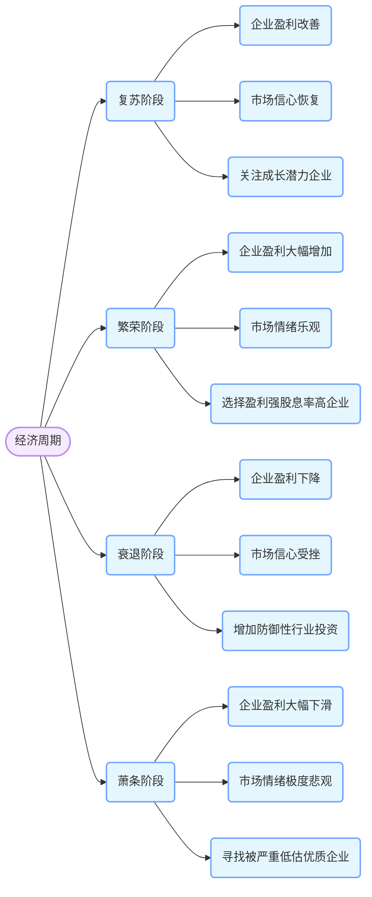

# 价值投资在不同经济周期中的策略调整

> 关键词：价值投资、经济周期、策略调整、股票市场、宏观经济

> 摘要：本文深入探讨了价值投资在不同经济周期中的策略调整问题。首先介绍了价值投资的基本概念和经济周期的不同阶段，分析了它们之间的相互关系。接着详细阐述了在经济复苏、繁荣、衰退和萧条四个阶段，价值投资应采取的具体策略，并结合数学模型和实际案例进行说明。同时，提供了相关的工具和资源推荐，帮助投资者更好地实施价值投资策略。最后总结了价值投资在不同经济周期中的发展趋势与挑战，并对常见问题进行了解答。

## 1. 背景介绍 
### 1.1 目的和范围
价值投资作为一种长期投资策略，旨在寻找被市场低估的资产，并在其价值回归时获得收益。然而，经济环境并非一成不变，不同的经济周期会对资产的价值产生显著影响。因此，了解价值投资在不同经济周期中的策略调整具有重要的现实意义。本文的目的在于系统地分析价值投资在经济复苏、繁荣、衰退和萧条四个主要经济周期阶段的策略选择，为投资者提供理论支持和实践指导。研究范围涵盖了股票市场、宏观经济指标以及相关的投资理论和方法。

### 1.2 预期读者
本文主要面向对价值投资感兴趣的投资者，包括个人投资者、机构投资者以及金融从业者。对于那些希望在不同经济环境中优化投资组合、提高投资收益的人群，本文提供了有价值的参考信息。同时，对于金融专业的学生和研究人员，本文也有助于他们深入理解价值投资与经济周期之间的关系。

### 1.3 文档结构概述
本文共分为十个部分。第一部分为背景介绍，阐述了研究的目的、范围、预期读者和文档结构，并对相关术语进行了解释。第二部分介绍了价值投资和经济周期的核心概念，以及它们之间的联系，并通过示意图和流程图进行说明。第三部分详细讲解了价值投资在不同经济周期中策略调整的核心算法原理，并给出了具体的操作步骤和 Python 代码示例。第四部分介绍了相关的数学模型和公式，并通过具体例子进行了详细讲解。第五部分是项目实战，包括开发环境搭建、源代码实现和代码解读。第六部分探讨了价值投资在不同经济周期中的实际应用场景。第七部分推荐了相关的学习资源、开发工具框架和论文著作。第八部分总结了价值投资在不同经济周期中的未来发展趋势与挑战。第九部分为附录，解答了常见问题。最后一部分提供了扩展阅读和参考资料。

### 1.4 术语表
#### 1.4.1 核心术语定义
- **价值投资**：一种投资策略，通过分析资产的内在价值，寻找被市场低估的资产进行投资，以获取长期的资本增值。
- **经济周期**：经济活动沿着经济发展的总体趋势所经历的有规律的扩张和收缩，通常分为复苏、繁荣、衰退和萧条四个阶段。
- **内在价值**：资产本身所具有的价值，是基于资产的基本面因素，如盈利能力、现金流、资产负债状况等进行评估的。
- **安全边际**：价值投资者在购买资产时，为了降低风险，所要求的资产价格低于其内在价值的幅度。

#### 1.4.2 相关概念解释
- **宏观经济指标**：用于衡量宏观经济运行状况的统计数据，如国内生产总值（GDP）、通货膨胀率、失业率等。这些指标可以反映经济的增长速度、物价水平和就业情况，对经济周期的判断具有重要意义。
- **行业轮动**：在不同的经济周期阶段，不同行业的表现会有所差异。价值投资者可以根据经济周期的变化，调整投资组合中不同行业的比重，以获取更好的投资收益。
- **财务报表分析**：通过对企业的资产负债表、利润表和现金流量表等财务报表进行分析，了解企业的财务状况和经营成果，评估企业的内在价值。

#### 1.4.3 缩略词列表
- **GDP**：国内生产总值（Gross Domestic Product）
- **PE**：市盈率（Price-to-Earnings Ratio）
- **PB**：市净率（Price-to-Book Ratio）
- **ROE**：净资产收益率（Return on Equity）

## 2. 核心概念与联系 
### 2.1 价值投资的核心概念
价值投资的核心思想是基于资产的内在价值进行投资。投资者通过对企业的基本面进行深入分析，包括财务状况、行业地位、竞争优势等，评估企业的内在价值。当市场价格低于内在价值时，投资者认为该资产被低估，从而买入；当市场价格高于内在价值时，投资者认为该资产被高估，从而卖出。价值投资强调长期投资，注重企业的内在品质和持续盈利能力。

### 2.2 经济周期的阶段划分
经济周期通常分为四个阶段：复苏、繁荣、衰退和萧条。
- **复苏阶段**：经济开始从衰退中复苏，GDP 增长率逐渐上升，通货膨胀率较低，企业盈利开始改善，市场信心逐渐恢复。
- **繁荣阶段**：经济处于高速增长状态，GDP 增长率较高，通货膨胀率上升，企业盈利大幅增加，市场情绪乐观，股票市场表现良好。
- **衰退阶段**：经济增长放缓，GDP 增长率下降，通货膨胀率仍然较高，企业盈利开始下降，市场信心受到打击，股票市场开始下跌。
- **萧条阶段**：经济陷入严重衰退，GDP 增长率为负，通货膨胀率下降，企业盈利大幅下滑，失业率上升，市场情绪极度悲观，股票市场大幅下跌。

### 2.3 价值投资与经济周期的联系
价值投资与经济周期密切相关。在不同的经济周期阶段，企业的经营环境和盈利状况会发生变化，从而影响企业的内在价值。因此，价值投资者需要根据经济周期的变化，调整投资策略，选择合适的投资标的。例如，在经济复苏阶段，投资者可以关注那些具有较高成长潜力的企业；在繁荣阶段，投资者可以选择那些盈利能力强、股息率高的企业；在衰退阶段，投资者可以增加防御性行业的投资比重；在萧条阶段，投资者可以寻找那些被严重低估的优质企业。

### 2.4 文本示意图和 Mermaid 流程图
#### 文本示意图
```plaintext
经济周期
|-- 复苏阶段
|   |-- 企业盈利改善
|   |-- 市场信心恢复
|   |-- 价值投资策略：关注成长潜力企业
|-- 繁荣阶段
|   |-- 企业盈利大幅增加
|   |-- 市场情绪乐观
|   |-- 价值投资策略：选择盈利强、股息率高企业
|-- 衰退阶段
|   |-- 企业盈利下降
|   |-- 市场信心受挫
|   |-- 价值投资策略：增加防御性行业投资
|-- 萧条阶段
|   |-- 企业盈利大幅下滑
|   |-- 市场情绪极度悲观
|   |-- 价值投资策略：寻找被严重低估优质企业
```

#### Mermaid 流程图


## 3. 核心算法原理 & 具体操作步骤 
### 3.1 核心算法原理
价值投资在不同经济周期中的策略调整主要基于对企业内在价值的评估和对经济周期的判断。核心算法原理可以概括为以下几个步骤：
1. **经济周期判断**：通过分析宏观经济指标，如 GDP 增长率、通货膨胀率、失业率等，判断当前经济所处的周期阶段。
2. **企业内在价值评估**：运用财务报表分析、估值模型等方法，评估企业的内在价值。常用的估值模型包括市盈率模型、市净率模型、现金流折现模型等。
3. **投资策略选择**：根据经济周期的判断和企业内在价值的评估结果，选择合适的投资策略。例如，在经济复苏阶段，选择具有较高成长潜力的企业；在繁荣阶段，选择盈利能力强、股息率高的企业；在衰退阶段，增加防御性行业的投资比重；在萧条阶段，寻找被严重低估的优质企业。

### 3.2 具体操作步骤
#### 步骤 1：收集宏观经济数据
使用 Python 的`pandas`和`requests`库收集宏观经济数据，如 GDP 增长率、通货膨胀率、失业率等。以下是一个简单的示例代码：
```python
import pandas as pd
import requests

# 定义数据接口地址
url = 'https://api.example.com/macroeconomic_data'

# 发送请求获取数据
response = requests.get(url)
data = response.json()

# 将数据转换为 DataFrame
df = pd.DataFrame(data)

# 打印数据
print(df)
```

#### 步骤 2：判断经济周期阶段
根据收集到的宏观经济数据，判断当前经济所处的周期阶段。可以使用简单的阈值判断方法，例如：
```python
# 假设 GDP 增长率阈值为 3%，通货膨胀率阈值为 2%
gdp_growth_rate = df['gdp_growth_rate'].iloc[-1]
inflation_rate = df['inflation_rate'].iloc[-1]

if gdp_growth_rate > 3% and inflation_rate < 2%:
    economic_cycle = '复苏阶段'
elif gdp_growth_rate > 3% and inflation_rate > 2%:
    economic_cycle = '繁荣阶段'
elif gdp_growth_rate < 3% and inflation_rate > 2%:
    economic_cycle = '衰退阶段'
else:
    economic_cycle = '萧条阶段'

print(f'当前经济处于 {economic_cycle}')
```

#### 步骤 3：评估企业内在价值
选择一家企业，收集其财务报表数据，使用市盈率模型评估其内在价值。以下是一个示例代码：
```python
# 假设企业的每股收益为 2 元，行业平均市盈率为 15
eps = 2
industry_pe = 15

# 计算企业的内在价值
intrinsic_value = eps * industry_pe

print(f'企业的内在价值为 {intrinsic_value} 元')
```

#### 步骤 4：选择投资策略
根据经济周期的判断和企业内在价值的评估结果，选择合适的投资策略。例如：
```python
if economic_cycle == '复苏阶段':
    if intrinsic_value > market_price:
        print('在复苏阶段，该企业被低估，建议买入')
    else:
        print('在复苏阶段，该企业未被低估，建议观望')
elif economic_cycle == '繁荣阶段':
    if intrinsic_value > market_price and dividend_yield > 3%:
        print('在繁荣阶段，该企业被低估且股息率高，建议买入')
    else:
        print('在繁荣阶段，该企业不符合投资条件，建议观望')
elif economic_cycle == '衰退阶段':
    if industry == '防御性行业' and intrinsic_value > market_price:
        print('在衰退阶段，该防御性行业企业被低估，建议买入')
    else:
        print('在衰退阶段，该企业不符合投资条件，建议观望')
else:
    if intrinsic_value > market_price * 2:
        print('在萧条阶段，该企业被严重低估，建议买入')
    else:
        print('在萧条阶段，该企业未被严重低估，建议观望')
```

## 4. 数学模型和公式 & 详细讲解 & 举例说明 
### 4.1 市盈率模型
#### 公式
市盈率（PE）是指股票价格与每股收益的比率，计算公式为：
$$PE = \frac{P}{EPS}$$
其中，$P$ 表示股票价格，$EPS$ 表示每股收益。

通过市盈率模型，可以计算企业的内在价值：
$$V = PE_{industry} \times EPS$$
其中，$V$ 表示企业的内在价值，$PE_{industry}$ 表示行业平均市盈率。

#### 详细讲解
市盈率模型是一种简单而常用的估值方法。它基于这样一个假设：同行业的企业具有相似的盈利能力和市场估值水平。因此，可以通过行业平均市盈率来估算企业的内在价值。如果企业的市盈率低于行业平均市盈率，说明该企业可能被低估；反之，如果企业的市盈率高于行业平均市盈率，说明该企业可能被高估。

#### 举例说明
假设某行业的平均市盈率为 15，某企业的每股收益为 2 元。则该企业的内在价值为：
$$V = 15 \times 2 = 30$$（元）
如果该企业的当前股票价格为 25 元，低于其内在价值 30 元，说明该企业被低估，可以考虑买入。

### 4.2 市净率模型
#### 公式
市净率（PB）是指股票价格与每股净资产的比率，计算公式为：
$$PB = \frac{P}{BVPS}$$
其中，$P$ 表示股票价格，$BVPS$ 表示每股净资产。

通过市净率模型，可以计算企业的内在价值：
$$V = PB_{industry} \times BVPS$$
其中，$V$ 表示企业的内在价值，$PB_{industry}$ 表示行业平均市净率。

#### 详细讲解
市净率模型适用于那些资产价值较为稳定的企业，如金融、房地产等行业。它基于这样一个假设：企业的净资产是其价值的重要组成部分。如果企业的市净率低于行业平均市净率，说明该企业可能被低估；反之，如果企业的市净率高于行业平均市净率，说明该企业可能被高估。

#### 举例说明
假设某行业的平均市净率为 2，某企业的每股净资产为 10 元。则该企业的内在价值为：
$$V = 2 \times 10 = 20$$（元）
如果该企业的当前股票价格为 15 元，低于其内在价值 20 元，说明该企业被低估，可以考虑买入。

### 4.3 现金流折现模型
#### 公式
现金流折现模型是一种基于企业未来现金流的估值方法。其基本公式为：
$$V = \sum_{t=1}^{n} \frac{CF_t}{(1 + r)^t} + \frac{TV}{(1 + r)^n}$$
其中，$V$ 表示企业的内在价值，$CF_t$ 表示第 $t$ 期的现金流，$r$ 表示折现率，$TV$ 表示企业的终值，$n$ 表示预测期数。

#### 详细讲解
现金流折现模型的核心思想是将企业未来的现金流折现到当前时刻，以评估企业的内在价值。该模型考虑了企业的盈利能力、增长潜力和风险等因素，是一种较为全面和准确的估值方法。然而，该模型的计算较为复杂，需要对企业的未来现金流进行预测，并确定合适的折现率。

#### 举例说明
假设某企业预计未来三年的现金流分别为 100 万元、120 万元和 150 万元，折现率为 10%，三年后的终值为 1000 万元。则该企业的内在价值为：
$$V = \frac{100}{(1 + 0.1)^1} + \frac{120}{(1 + 0.1)^2} + \frac{150}{(1 + 0.1)^3} + \frac{1000}{(1 + 0.1)^3}$$
$$V = \frac{100}{1.1} + \frac{120}{1.21} + \frac{150}{1.331} + \frac{1000}{1.331}$$
$$V \approx 90.91 + 99.17 + 112.69 + 751.31$$
$$V \approx 1054.08$$（万元）

## 5. 项目实战：代码实际案例和详细解释说明 
### 5.1  开发环境搭建
#### 步骤 1：安装 Python
首先，需要安装 Python 开发环境。可以从 Python 官方网站（https://www.python.org/downloads/）下载适合自己操作系统的 Python 安装包，并按照安装向导进行安装。

#### 步骤 2：安装必要的库
在命令行中使用`pip`命令安装必要的库，如`pandas`、`requests`等：
```sh
pip install pandas requests
```

### 5.2  源代码详细实现和代码解读
以下是一个完整的 Python 代码示例，用于实现价值投资在不同经济周期中的策略调整：
```python
import pandas as pd
import requests

# 步骤 1：收集宏观经济数据
def collect_macroeconomic_data():
    url = 'https://api.example.com/macroeconomic_data'
    response = requests.get(url)
    data = response.json()
    df = pd.DataFrame(data)
    return df

# 步骤 2：判断经济周期阶段
def judge_economic_cycle(df):
    gdp_growth_rate = df['gdp_growth_rate'].iloc[-1]
    inflation_rate = df['inflation_rate'].iloc[-1]

    if gdp_growth_rate > 3% and inflation_rate < 2%:
        economic_cycle = '复苏阶段'
    elif gdp_growth_rate > 3% and inflation_rate > 2%:
        economic_cycle = '繁荣阶段'
    elif gdp_growth_rate < 3% and inflation_rate > 2%:
        economic_cycle = '衰退阶段'
    else:
        economic_cycle = '萧条阶段'

    return economic_cycle

# 步骤 3：评估企业内在价值
def evaluate_intrinsic_value(eps, industry_pe):
    intrinsic_value = eps * industry_pe
    return intrinsic_value

# 步骤 4：选择投资策略
def select_investment_strategy(economic_cycle, intrinsic_value, market_price, industry, dividend_yield):
    if economic_cycle == '复苏阶段':
        if intrinsic_value > market_price:
            return '在复苏阶段，该企业被低估，建议买入'
        else:
            return '在复苏阶段，该企业未被低估，建议观望'
    elif economic_cycle == '繁荣阶段':
        if intrinsic_value > market_price and dividend_yield > 3%:
            return '在繁荣阶段，该企业被低估且股息率高，建议买入'
        else:
            return '在繁荣阶段，该企业不符合投资条件，建议观望'
    elif economic_cycle == '衰退阶段':
        if industry == '防御性行业' and intrinsic_value > market_price:
            return '在衰退阶段，该防御性行业企业被低估，建议买入'
        else:
            return '在衰退阶段，该企业不符合投资条件，建议观望'
    else:
        if intrinsic_value > market_price * 2:
            return '在萧条阶段，该企业被严重低估，建议买入'
        else:
            return '在萧条阶段，该企业未被严重低估，建议观望'

# 主程序
if __name__ == '__main__':
    # 收集宏观经济数据
    macroeconomic_data = collect_macroeconomic_data()

    # 判断经济周期阶段
    economic_cycle = judge_economic_cycle(macroeconomic_data)

    # 假设企业的每股收益为 2 元，行业平均市盈率为 15，市场价格为 25 元，行业为制造业，股息率为 2%
    eps = 2
    industry_pe = 15
    market_price = 25
    industry = '制造业'
    dividend_yield = 2

    # 评估企业内在价值
    intrinsic_value = evaluate_intrinsic_value(eps, industry_pe)

    # 选择投资策略
    investment_strategy = select_investment_strategy(economic_cycle, intrinsic_value, market_price, industry, dividend_yield)

    print(f'当前经济处于 {economic_cycle}')
    print(f'企业的内在价值为 {intrinsic_value} 元')
    print(investment_strategy)
```

### 5.3  代码解读与分析
- **`collect_macroeconomic_data`函数**：该函数用于收集宏观经济数据。通过发送 HTTP 请求获取数据，并将其转换为`pandas`的`DataFrame`对象。
- **`judge_economic_cycle`函数**：该函数根据收集到的宏观经济数据，判断当前经济所处的周期阶段。使用简单的阈值判断方法，根据 GDP 增长率和通货膨胀率的大小关系进行判断。
- **`evaluate_intrinsic_value`函数**：该函数使用市盈率模型评估企业的内在价值。根据企业的每股收益和行业平均市盈率计算内在价值。
- **`select_investment_strategy`函数**：该函数根据经济周期的判断和企业内在价值的评估结果，选择合适的投资策略。针对不同的经济周期阶段，设置了不同的投资条件。
- **主程序**：在主程序中，依次调用上述函数，完成宏观经济数据收集、经济周期判断、企业内在价值评估和投资策略选择，并输出结果。

## 6. 实际应用场景 
### 6.1 个人投资者
对于个人投资者来说，价值投资在不同经济周期中的策略调整可以帮助他们更好地管理投资组合。在经济复苏阶段，个人投资者可以关注那些具有较高成长潜力的新兴行业，如科技、医疗等，通过投资这些行业的优质企业，分享经济复苏带来的红利。在繁荣阶段，个人投资者可以选择那些盈利能力强、股息率高的蓝筹股，以获取稳定的收益。在衰退阶段，个人投资者可以增加防御性行业的投资比重，如食品饮料、公用事业等，以降低投资风险。在萧条阶段，个人投资者可以寻找那些被严重低估的优质企业，进行长期投资，等待经济复苏时获得丰厚的回报。

### 6.2 机构投资者
机构投资者，如基金公司、保险公司等，通常管理着大量的资金。价值投资在不同经济周期中的策略调整对于他们来说尤为重要。在经济复苏阶段，机构投资者可以加大对股票市场的投资比重，通过分散投资于不同行业的优质企业，实现资产的增值。在繁荣阶段，机构投资者可以适当降低股票市场的投资比重，增加债券、现金等固定收益类资产的投资，以锁定收益、降低风险。在衰退阶段，机构投资者可以进一步调整投资组合，增加防御性行业和低风险资产的投资，以应对市场的不确定性。在萧条阶段，机构投资者可以利用市场的低迷，寻找被低估的优质资产，进行战略性布局。

### 6.3 金融从业者
金融从业者，如投资顾问、分析师等，需要为客户提供专业的投资建议。了解价值投资在不同经济周期中的策略调整，可以帮助他们更好地为客户制定投资计划。在为客户进行资产配置时，金融从业者可以根据当前经济所处的周期阶段，选择合适的投资产品和投资策略。例如，在经济复苏阶段，为客户推荐成长型基金；在繁荣阶段，为客户推荐股息型基金；在衰退阶段，为客户推荐债券型基金；在萧条阶段，为客户推荐具有长期投资价值的股票。

## 7. 工具和资源推荐
### 7.1 学习资源推荐
#### 7.1.1 书籍推荐
- 《聪明的投资者》（The Intelligent Investor）：本杰明·格雷厄姆（Benjamin Graham）著，被誉为价值投资的圣经，详细介绍了价值投资的基本理念和方法。
- 《证券分析》（Security Analysis）：本杰明·格雷厄姆和戴维·多德（David Dodd）著，是价值投资领域的经典著作，对企业的财务分析和估值方法进行了深入探讨。
- 《巴菲特致股东的信：股份公司教程》（Letters to Shareholders of Berkshire Hathaway）：沃伦·巴菲特（Warren Buffett）著，收录了巴菲特历年致股东的信，从中可以学习到巴菲特的投资理念和策略。

#### 7.1.2 在线课程
- Coursera 上的“投资学原理”（Principles of Investing）课程：由哥伦比亚大学教授授课，介绍了投资学的基本原理和方法，包括价值投资、资产定价等内容。
- edX 上的“金融市场”（Financial Markets）课程：由耶鲁大学教授授课，涵盖了金融市场的各个方面，对理解经济周期和投资策略有很大帮助。

#### 7.1.3 技术博客和网站
- 雪球网（https://xueqiu.com/）：国内知名的投资社区，提供股票、基金等投资产品的信息和分析，以及投资者的交流平台。
- 价值投资者网（https://www.valueinvestorsclub.com/）：专注于价值投资的网站，提供价值投资的研究报告、案例分析等内容。

### 7.2 开发工具框架推荐
#### 7.2.1 IDE和编辑器
- PyCharm：一款专业的 Python 集成开发环境，具有强大的代码编辑、调试和项目管理功能。
- Jupyter Notebook：一种交互式的开发环境，适合进行数据分析和模型验证，支持 Python、R 等多种编程语言。

#### 7.2.2 调试和性能分析工具
- pdb：Python 内置的调试器，可以帮助开发者逐步执行代码，查找代码中的错误。
- cProfile：Python 内置的性能分析工具，可以分析代码的运行时间和函数调用情况，帮助开发者优化代码性能。

#### 7.2.3 相关框架和库
- pandas：一个强大的数据分析库，提供了高效的数据结构和数据处理方法，适用于宏观经济数据的分析和处理。
- numpy：一个用于科学计算的库，提供了高效的数组操作和数学函数，适用于估值模型的计算。

### 7.3 相关论文著作推荐
#### 7.3.1 经典论文
- Fama, E. F., & French, K. R. (1992). The cross-section of expected stock returns. Journal of Finance, 47(2), 427-465. 该论文提出了著名的 Fama-French 三因子模型，对股票收益率的影响因素进行了深入研究。
- Sharpe, W. F. (1964). Capital asset prices: A theory of market equilibrium under conditions of risk. Journal of Finance, 19(3), 425-442. 该论文提出了资本资产定价模型（CAPM），为资产定价提供了重要的理论基础。

#### 7.3.2 最新研究成果
- 近年来，随着人工智能和机器学习技术的发展，越来越多的研究将这些技术应用于价值投资领域。例如，使用深度学习模型预测股票价格、使用强化学习算法优化投资策略等。可以关注相关的学术期刊，如《Journal of Financial Economics》、《Review of Financial Studies》等，获取最新的研究成果。

#### 7.3.3 应用案例分析
- 一些知名的投资机构和投资者的成功案例可以为我们提供宝贵的经验。例如，巴菲特的伯克希尔·哈撒韦公司在不同经济周期中的投资策略和业绩表现，可以作为我们学习的参考。可以通过阅读相关的书籍和报道，了解这些案例的具体情况和分析方法。

## 8. 总结：未来发展趋势与挑战
### 8.1 未来发展趋势
#### 数字化和智能化
随着科技的不断进步，价值投资将越来越多地应用数字化和智能化技术。例如，使用大数据分析和人工智能算法来筛选投资标的、预测经济周期和市场走势。这些技术可以帮助投资者更快速、准确地获取信息，提高投资决策的效率和准确性。

#### 全球化和多元化
经济全球化的趋势将继续加强，价值投资者将有更多的机会投资于全球范围内的资产。同时，投资组合的多元化也将变得更加重要。投资者需要考虑不同国家、不同行业的经济周期差异，通过合理的资产配置来降低风险、提高收益。

#### 社会责任投资
越来越多的投资者开始关注企业的社会责任表现，将环境、社会和治理（ESG）因素纳入投资决策的考虑范围。在未来，社会责任投资可能会成为价值投资的一个重要发展方向。

### 8.2 挑战
#### 经济不确定性增加
全球经济面临着诸多不确定性，如贸易摩擦、地缘政治风险、气候变化等。这些因素可能导致经济周期的变化更加复杂和难以预测，给价值投资者带来更大的挑战。

#### 市场有效性提高
随着信息传播的速度加快和投资者教育水平的提高，市场的有效性可能会逐渐提高。这意味着价值被低估的资产可能会越来越难被发现，价值投资策略的实施难度可能会增加。

#### 技术变革带来的挑战
虽然数字化和智能化技术为价值投资带来了机遇，但也带来了一些挑战。例如，数据安全和隐私问题、算法偏见和黑箱问题等。投资者需要不断学习和适应这些技术变革，以确保投资决策的可靠性和有效性。

## 9. 附录：常见问题与解答
### 问题 1：价值投资在不同经济周期中的策略调整是否适用于所有市场？
价值投资在不同经济周期中的策略调整是一种普遍适用的投资原则，但在不同的市场中，其具体应用可能会有所不同。例如，新兴市场的经济周期波动可能更为剧烈，市场有效性相对较低，价值投资策略可能更容易取得成功。而在成熟市场中，市场有效性较高，价值被低估的资产可能更难被发现，需要投资者具备更高的分析能力和判断力。

### 问题 2：如何准确判断当前经济所处的周期阶段？
判断当前经济所处的周期阶段是一个复杂的问题，需要综合考虑多个宏观经济指标。常用的指标包括 GDP 增长率、通货膨胀率、失业率、利率等。此外，还可以关注一些领先指标，如采购经理人指数（PMI）、消费者信心指数等，这些指标可以提前反映经济的变化趋势。同时，投资者还可以参考专业机构和经济学家的分析和预测，但需要注意对不同观点进行综合判断。

### 问题 3：价值投资策略是否需要频繁调整？
价值投资强调长期投资，不建议频繁调整投资策略。在不同的经济周期中，价值投资策略的调整应该是基于对经济周期的长期趋势和企业内在价值的判断，而不是短期的市场波动。频繁调整投资策略可能会增加交易成本，降低投资收益。当然，如果经济周期发生了重大变化，或者企业的基本面发生了实质性改变，投资者可以适当调整投资策略。

### 问题 4：如何评估企业的内在价值？
评估企业的内在价值是价值投资的核心环节。常用的方法包括市盈率模型、市净率模型、现金流折现模型等。这些方法各有优缺点，投资者可以根据企业的特点和行业的情况选择合适的方法。同时，还需要对企业的财务报表进行深入分析，了解企业的盈利能力、资产负债状况、现金流情况等，以提高内在价值评估的准确性。

## 10. 扩展阅读 & 参考资料
### 扩展阅读
- 《财务报表分析与股票估值》（Financial Statement Analysis and Security Valuation）：斯蒂芬·佩因曼（Stephen Penman）著，详细介绍了如何通过财务报表分析来评估企业的内在价值。
- 《投资最重要的事》（The Most Important Thing Illuminated）：霍华德·马克斯（Howard Marks）著，分享了作者在投资领域的经验和见解，对价值投资的理念和策略有深入的阐述。

### 参考资料
- Graham, B., & Dodd, D. L. (1934). Security Analysis. McGraw-Hill.
- Buffett, W. E. (1977-2020). Letters to Shareholders of Berkshire Hathaway.
- Fama, E. F., & French, K. R. (1992). The cross-section of expected stock returns. Journal of Finance, 47(2), 427-465.
- Sharpe, W. F. (1964). Capital asset prices: A theory of market equilibrium under conditions of risk. Journal of Finance, 19(3), 425-442.

作者：AI天才研究院/AI Genius Institute & 禅与计算机程序设计艺术 /Zen And The Art of Computer Programming