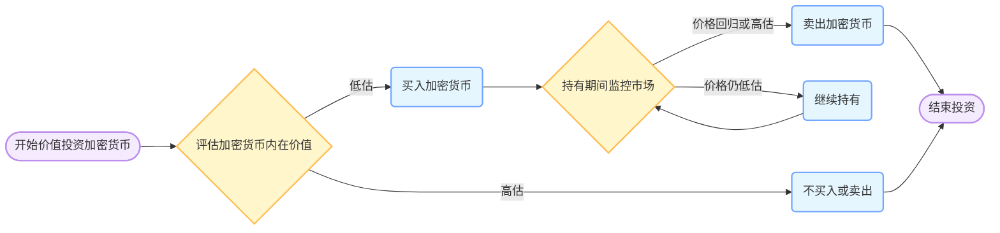

# 价值投资在加密货币市场中的应用与风险

> 关键词：价值投资、加密货币市场、应用策略、风险评估、市场分析

> 摘要：本文深入探讨了价值投资理念在加密货币市场中的应用与风险。首先介绍了价值投资的背景和在加密货币领域的研究目的，接着阐述了价值投资和加密货币的核心概念及联系。通过具体的算法原理和数学模型，为价值投资在加密货币市场的应用提供理论支持。以实际项目为例，详细展示了如何运用价值投资进行加密货币投资，并对代码实现和结果进行解读。分析了价值投资在加密货币市场的实际应用场景，推荐了相关的学习资源、开发工具和研究论文。最后总结了价值投资在加密货币市场的未来发展趋势与挑战，并对常见问题进行解答。

## 1. 背景介绍 
### 1.1 目的和范围
价值投资作为一种成熟的投资策略，在传统金融市场中已经取得了显著的成效。然而，随着加密货币市场的兴起，其高波动性、创新性和监管不确定性给价值投资带来了新的挑战和机遇。本文的目的是探讨价值投资理念在加密货币市场中的可行性和应用方法，分析其中可能面临的风险，并提供相应的应对策略。研究范围涵盖了加密货币的基本概念、价值评估方法、市场分析以及投资组合构建等方面。

### 1.2 预期读者
本文预期读者包括对加密货币投资感兴趣的个人投资者、金融机构从业者、区块链技术研究者以及相关领域的学者。希望通过本文的阐述，能够帮助读者更好地理解价值投资在加密货币市场中的应用，提高投资决策的科学性和合理性。

### 1.3 文档结构概述
本文共分为十个部分。第一部分介绍了研究的背景、目的、预期读者和文档结构；第二部分阐述了价值投资和加密货币的核心概念及两者之间的联系，并通过文本示意图和 Mermaid 流程图进行展示；第三部分详细讲解了价值投资在加密货币市场中的核心算法原理和具体操作步骤，同时给出 Python 源代码示例；第四部分介绍了相关的数学模型和公式，并进行详细讲解和举例说明；第五部分通过实际项目案例，展示了价值投资在加密货币市场中的具体应用，包括开发环境搭建、源代码实现和代码解读；第六部分分析了价值投资在加密货币市场的实际应用场景；第七部分推荐了相关的学习资源、开发工具和研究论文；第八部分总结了价值投资在加密货币市场的未来发展趋势与挑战；第九部分解答了常见问题；第十部分提供了扩展阅读和参考资料。

### 1.4 术语表
#### 1.4.1 核心术语定义
- **价值投资**：是一种基于对资产内在价值的分析，以低于内在价值的价格买入资产，并在价格回归或超过内在价值时卖出的投资策略。
- **加密货币**：是一种基于密码学原理的数字货币，使用区块链技术进行交易记录和验证，具有去中心化、匿名性等特点。
- **内在价值**：指资产在未来能够产生的现金流的现值，是评估资产是否被低估或高估的重要指标。
- **区块链**：是一种分布式账本技术，通过去中心化的方式记录交易信息，保证数据的安全性和不可篡改。

#### 1.4.2 相关概念解释
- **挖矿**：是指通过计算机运算解决复杂的数学问题，从而获得加密货币作为奖励的过程。
- **智能合约**：是一种自动执行的合约，通过代码实现合约条款，确保交易的公平性和透明度。
- **去中心化金融（DeFi）**：是指基于区块链技术构建的金融系统，不依赖于传统金融机构，提供借贷、交易、保险等金融服务。

#### 1.4.3 缩略词列表
- **BTC**：比特币（Bitcoin）
- **ETH**：以太坊（Ethereum）
- **DeFi**：去中心化金融（Decentralized Finance）
- **NFT**：非同质化代币（Non-Fungible Token）

## 2. 核心概念与联系 

### 核心概念原理
#### 价值投资原理
价值投资的核心原理是寻找被市场低估的资产，通过分析资产的基本面，如盈利能力、现金流、资产负债表等，来评估其内在价值。当市场价格低于内在价值时，投资者认为该资产具有投资价值，从而买入；当市场价格回归或超过内在价值时，投资者卖出资产，实现盈利。

#### 加密货币原理
加密货币基于区块链技术，通过密码学算法保证交易的安全性和匿名性。区块链是一个分布式账本，由多个节点共同维护，每个节点都保存着完整的交易记录。加密货币的发行和交易通过挖矿和智能合约实现，挖矿是通过计算机运算解决复杂的数学问题，获得加密货币作为奖励；智能合约是一种自动执行的合约，通过代码实现合约条款，确保交易的公平性和透明度。

### 架构的文本示意图
```plaintext
价值投资与加密货币市场的架构

|-- 价值投资理念
|   |-- 内在价值评估
|   |   |-- 基本面分析
|   |   |   |-- 项目团队
|   |   |   |-- 技术实力
|   |   |   |-- 市场需求
|   |   |   |-- 竞争对手
|   |   |-- 现金流折现模型
|   |-- 投资组合构建
|       |-- 资产配置
|       |-- 风险控制

|-- 加密货币市场
|   |-- 区块链技术
|   |   |-- 分布式账本
|   |   |-- 密码学算法
|   |   |-- 智能合约
|   |-- 加密货币种类
|   |   |-- 比特币
|   |   |-- 以太坊
|   |   |-- 其他山寨币
|   |-- 市场交易机制
|       |-- 交易所
|       |-- 交易规则
|       |-- 价格波动
```

### Mermaid 流程图


该流程图展示了价值投资在加密货币市场中的基本流程。首先，投资者需要评估加密货币的内在价值，判断其是否被低估。如果被低估，则买入加密货币；如果被高估，则不买入或卖出。买入后，投资者需要持续监控市场，当价格回归或超过内在价值时，卖出加密货币；如果价格仍被低估，则继续持有。

## 3. 核心算法原理 & 具体操作步骤 

### 核心算法原理
在价值投资加密货币时，常用的算法是现金流折现模型（Discounted Cash Flow, DCF）。该模型的基本思想是将加密货币未来产生的现金流折现到当前，以评估其内在价值。具体来说，假设加密货币在未来 $n$ 期内产生的现金流分别为 $CF_1, CF_2, \cdots, CF_n$，折现率为 $r$，则加密货币的内在价值 $V$ 可以通过以下公式计算：

$$V = \sum_{i=1}^{n} \frac{CF_i}{(1 + r)^i}$$

其中，$CF_i$ 表示第 $i$ 期的现金流，$r$ 表示折现率。折现率反映了投资者对投资风险的预期，风险越高，折现率越高。

### 具体操作步骤
1. **确定加密货币项目**：选择具有潜力的加密货币项目，分析其基本面，包括项目团队、技术实力、市场需求、竞争对手等。
2. **预测未来现金流**：根据加密货币项目的业务模式和发展规划，预测其未来 $n$ 期内产生的现金流。这需要对市场趋势、行业发展、项目执行能力等进行综合分析。
3. **确定折现率**：折现率的确定需要考虑多种因素，如市场利率、投资风险、通货膨胀等。一般来说，可以参考同行业的平均收益率或使用资本资产定价模型（CAPM）来确定折现率。
4. **计算内在价值**：将预测的未来现金流代入现金流折现模型，计算加密货币的内在价值。
5. **比较市场价格和内在价值**：将计算得到的内在价值与当前市场价格进行比较，如果市场价格低于内在价值，则认为该加密货币被低估，具有投资价值；反之，则认为该加密货币被高估，不建议投资。
6. **构建投资组合**：根据价值评估结果，选择合适的加密货币构建投资组合，合理配置资产，控制投资风险。

### Python 源代码示例
```python
import numpy as np

def dcf_valuation(cash_flows, discount_rate):
    """
    现金流折现模型计算内在价值
    :param cash_flows: 未来各期现金流列表
    :param discount_rate: 折现率
    :return: 内在价值
    """
    n = len(cash_flows)
    present_values = []
    for i in range(n):
        present_value = cash_flows[i] / ((1 + discount_rate) ** (i + 1))
        present_values.append(present_value)
    intrinsic_value = np.sum(present_values)
    return intrinsic_value

# 示例数据
cash_flows = [100, 200, 300, 400, 500]  # 未来 5 期现金流
discount_rate = 0.1  # 折现率为 10%

# 计算内在价值
intrinsic_value = dcf_valuation(cash_flows, discount_rate)
print(f"加密货币的内在价值为: {intrinsic_value}")
```

在上述代码中，定义了一个 `dcf_valuation` 函数，用于计算加密货币的内在价值。函数接受两个参数：未来各期现金流列表 `cash_flows` 和折现率 `discount_rate`。在函数内部，通过循环计算每期现金流的现值，并将其累加得到内在价值。最后，使用示例数据调用该函数，并打印计算结果。

## 4. 数学模型和公式 & 详细讲解 & 举例说明 

### 现金流折现模型
现金流折现模型（DCF）是价值投资中常用的数学模型，用于评估资产的内在价值。其基本公式为：

$$V = \sum_{i=1}^{n} \frac{CF_i}{(1 + r)^i}$$

其中：
- $V$ 表示资产的内在价值；
- $CF_i$ 表示第 $i$ 期的现金流；
- $r$ 表示折现率；
- $n$ 表示预测的期数。

### 详细讲解
- **现金流（$CF_i$）**：现金流是指资产在未来各期产生的现金流入和流出的净额。对于加密货币项目来说，现金流可以包括项目的收入、利润、分红等。预测现金流需要对项目的业务模式、市场需求、竞争状况等进行深入分析。
- **折现率（$r$）**：折现率反映了投资者对投资风险的预期。风险越高，折现率越高；风险越低，折现率越低。折现率的确定需要考虑多种因素，如市场利率、投资风险、通货膨胀等。一般来说，可以参考同行业的平均收益率或使用资本资产定价模型（CAPM）来确定折现率。
- **期数（$n$）**：期数表示预测的未来时间段。期数的选择需要根据项目的特点和市场情况进行合理确定。一般来说，预测期数越长，不确定性越大，预测的准确性也越低。

### 举例说明
假设某加密货币项目预计未来 3 年的现金流分别为 100 万美元、200 万美元和 300 万美元，折现率为 10%。则该加密货币的内在价值可以通过以下步骤计算：

1. 计算各期现金流的现值：
    - 第 1 期现金流的现值：$PV_1 = \frac{100}{(1 + 0.1)^1} = 90.91$（万美元）
    - 第 2 期现金流的现值：$PV_2 = \frac{200}{(1 + 0.1)^2} = 165.29$（万美元）
    - 第 3 期现金流的现值：$PV_3 = \frac{300}{(1 + 0.1)^3} = 225.39$（万美元）

2. 计算内在价值：
    - $V = PV_1 + PV_2 + PV_3 = 90.91 + 165.29 + 225.39 = 481.59$（万美元）

因此，该加密货币的内在价值为 481.59 万美元。如果当前市场价格低于 481.59 万美元，则认为该加密货币被低估，具有投资价值；反之，则认为该加密货币被高估，不建议投资。

### 资本资产定价模型（CAPM）
资本资产定价模型（CAPM）是一种用于确定折现率的常用模型，其公式为：

$$r = R_f + \beta (R_m - R_f)$$

其中：
- $r$ 表示折现率；
- $R_f$ 表示无风险利率，一般可以使用国债收益率作为无风险利率；
- $\beta$ 表示资产的系统性风险系数，反映了资产价格波动与市场整体波动的相关性；
- $R_m$ 表示市场平均收益率。

### 详细讲解
- **无风险利率（$R_f$）**：无风险利率是指投资者在没有任何风险的情况下所能获得的收益率。一般来说，可以使用国债收益率作为无风险利率，因为国债被认为是最安全的投资工具。
- **系统性风险系数（$\beta$）**：系统性风险系数反映了资产价格波动与市场整体波动的相关性。$\beta$ 值大于 1 表示资产的价格波动比市场整体波动更大，风险更高；$\beta$ 值小于 1 表示资产的价格波动比市场整体波动更小，风险更低；$\beta$ 值等于 1 表示资产的价格波动与市场整体波动一致。
- **市场平均收益率（$R_m$）**：市场平均收益率是指市场上所有资产的平均收益率。可以使用股票市场指数的收益率作为市场平均收益率。

### 举例说明
假设无风险利率为 3%，市场平均收益率为 10%，某加密货币的 $\beta$ 值为 1.2。则该加密货币的折现率可以通过以下公式计算：

$$r = 3\% + 1.2 \times (10\% - 3\%) = 11.4\%$$

因此，该加密货币的折现率为 11.4%。在使用现金流折现模型计算该加密货币的内在价值时，需要使用 11.4% 作为折现率。

## 5. 项目实战：代码实际案例和详细解释说明 

### 5.1  开发环境搭建
#### 安装 Python
首先，需要安装 Python 编程语言。可以从 Python 官方网站（https://www.python.org/downloads/） 下载适合自己操作系统的 Python 安装包，并按照安装向导进行安装。

#### 安装必要的库
在进行加密货币价值投资分析时，需要使用一些 Python 库，如 `numpy`、`pandas`、`matplotlib` 等。可以使用以下命令安装这些库：

```sh
pip install numpy pandas matplotlib
```

### 5.2  源代码详细实现和代码解读
```python
import numpy as np
import pandas as pd
import matplotlib.pyplot as plt

def dcf_valuation(cash_flows, discount_rate):
    """
    现金流折现模型计算内在价值
    :param cash_flows: 未来各期现金流列表
    :param discount_rate: 折现率
    :return: 内在价值
    """
    n = len(cash_flows)
    present_values = []
    for i in range(n):
        present_value = cash_flows[i] / ((1 + discount_rate) ** (i + 1))
        present_values.append(present_value)
    intrinsic_value = np.sum(present_values)
    return intrinsic_value

# 示例数据
cash_flows = [100, 200, 300, 400, 500]  # 未来 5 期现金流
discount_rate = 0.1  # 折现率为 10%

# 计算内在价值
intrinsic_value = dcf_valuation(cash_flows, discount_rate)
print(f"加密货币的内在价值为: {intrinsic_value}")

# 绘制现金流和现值图表
periods = np.arange(1, len(cash_flows) + 1)
present_values = [cash_flows[i] / ((1 + discount_rate) ** (i + 1)) for i in range(len(cash_flows))]

df = pd.DataFrame({
    'Period': periods,
    'Cash Flow': cash_flows,
    'Present Value': present_values
})

plt.figure(figsize=(10, 6))
plt.plot(df['Period'], df['Cash Flow'], label='Cash Flow')
plt.plot(df['Period'], df['Present Value'], label='Present Value')
plt.xlabel('Period')
plt.ylabel('Amount')
plt.title('Cash Flow and Present Value over Time')
plt.legend()
plt.grid(True)
plt.show()
```

### 代码解读与分析
#### 函数 `dcf_valuation`
该函数实现了现金流折现模型，用于计算加密货币的内在价值。函数接受两个参数：未来各期现金流列表 `cash_flows` 和折现率 `discount_rate`。在函数内部，通过循环计算每期现金流的现值，并将其累加得到内在价值。

#### 示例数据和内在价值计算
定义了未来 5 期的现金流列表 `cash_flows` 和折现率 `discount_rate`，并调用 `dcf_valuation` 函数计算加密货币的内在价值。最后，打印计算结果。

#### 绘制现金流和现值图表
使用 `pandas` 库创建一个数据框，包含期数、现金流和现值信息。然后，使用 `matplotlib` 库绘制现金流和现值随时间变化的图表，直观展示现金流和现值的关系。

通过这个实际案例，我们可以看到如何使用 Python 代码实现现金流折现模型，并对加密货币的内在价值进行评估。同时，通过绘制图表，可以更直观地理解现金流和现值的变化趋势。

## 6. 实际应用场景 
### 长期投资
价值投资理念适合用于加密货币的长期投资。通过深入分析加密货币项目的基本面，评估其内在价值，选择被低估的加密货币进行长期持有。随着项目的发展和市场的认可，加密货币的价格有望回归或超过其内在价值，从而实现投资收益。例如，比特币作为最早的加密货币，其底层技术区块链具有去中心化、不可篡改等特点，具有一定的价值支撑。一些投资者通过长期持有比特币，获得了丰厚的回报。

### 投资组合构建
在构建加密货币投资组合时，可以运用价值投资策略。根据不同加密货币的内在价值和风险特征，合理配置资产，降低投资组合的整体风险。例如，可以选择一部分具有稳定价值和发展前景的主流加密货币，如比特币、以太坊，作为投资组合的核心资产；同时，适当配置一些具有潜力的新兴加密货币，以获取更高的收益。通过分散投资，可以降低单一加密货币价格波动对投资组合的影响。

### 项目评估
对于加密货币项目的开发者和投资者来说，价值投资可以作为评估项目可行性和潜力的重要方法。通过分析项目的团队背景、技术实力、市场需求、商业模式等因素，评估项目的内在价值。如果项目的内在价值较高，且市场价格被低估，则可以考虑参与项目的投资或开发。例如，一些基于以太坊的去中心化金融（DeFi）项目，通过创新的金融模式和智能合约技术，吸引了大量投资者的关注。在投资这些项目之前，可以运用价值投资方法进行评估，以降低投资风险。

### 市场分析
价值投资还可以用于加密货币市场的分析。通过比较不同加密货币的内在价值和市场价格，判断市场的整体估值水平和投资机会。如果市场上大部分加密货币的价格都高于其内在价值，则说明市场可能存在泡沫，投资风险较大；反之，如果市场上存在较多被低估的加密货币，则说明市场可能存在投资机会。例如，在加密货币市场经历大幅下跌后，一些具有基本面支撑的加密货币可能会被低估，此时可以运用价值投资策略寻找投资机会。

## 7. 工具和资源推荐
### 7.1 学习资源推荐
#### 7.1.1 书籍推荐
- 《聪明的投资者》（The Intelligent Investor）：作者是本杰明·格雷厄姆（Benjamin Graham），被誉为价值投资的圣经。本书系统阐述了价值投资的理念和方法，对投资者具有重要的指导意义。
- 《区块链：技术驱动金融》（Blockchain: The Technology Driving the Next Internet Revolution）：作者是阿尔文德·纳拉亚南（Arvind Narayanan）等，本书详细介绍了区块链技术的原理、应用和发展趋势，对于理解加密货币的底层技术有很大帮助。
- 《加密资产：新的投资前沿》（Cryptoassets: The Innovative Investor's Guide to Bitcoin and Beyond）：作者是克里斯·伯尼斯克（Chris Burniske）和杰克·塔塔尔（Jack Tatar），本书介绍了加密资产的投资策略和方法，适合对加密货币投资感兴趣的读者。

#### 7.1.2 在线课程
- Coursera 上的“区块链基础”（Blockchain Basics）课程：由普林斯顿大学教授讲授，介绍了区块链技术的基本概念、原理和应用。
- Udemy 上的“加密货币投资课程”（Cryptocurrency Investing Course）：涵盖了加密货币的市场分析、投资策略和风险管理等内容。
- edX 上的“比特币和加密货币技术”（Bitcoin and Cryptocurrency Technologies）课程：由普林斯顿大学教授讲授，深入探讨了比特币和其他加密货币的技术原理。

#### 7.1.3 技术博客和网站
- CoinDesk：是一家专注于加密货币和区块链技术的新闻媒体，提供最新的行业动态、市场分析和技术文章。
- CoinMarketCap：是全球最大的加密货币数据网站，提供各种加密货币的价格、市值、交易量等数据。
- Medium 上的区块链和加密货币相关博客：有许多行业专家和开发者分享他们的经验和见解。

### 7.2 开发工具框架推荐
#### 7.2.1 IDE和编辑器
- PyCharm：是一款专门为 Python 开发设计的集成开发环境（IDE），具有强大的代码编辑、调试和分析功能。
- Visual Studio Code：是一款轻量级的代码编辑器，支持多种编程语言，具有丰富的插件扩展功能。
- Jupyter Notebook：是一个交互式的开发环境，适合进行数据分析和机器学习实验。

#### 7.2.2 调试和性能分析工具
- pdb：是 Python 内置的调试工具，可以帮助开发者逐行调试代码，查找和解决问题。
- cProfile：是 Python 标准库中的性能分析工具，可以分析代码的执行时间和函数调用次数，帮助开发者优化代码性能。
- Py-Spy：是一个用于 Python 程序的性能分析工具，可以实时查看 Python 程序的 CPU 使用率和函数调用情况。

#### 7.2.3 相关框架和库
- NumPy：是 Python 中用于科学计算的基础库，提供了高效的数组操作和数学函数。
- Pandas：是一个用于数据处理和分析的 Python 库，提供了数据结构和数据分析工具。
- Matplotlib：是一个用于数据可视化的 Python 库，可以绘制各种类型的图表和图形。

### 7.3 相关论文著作推荐
#### 7.3.1 经典论文
- “比特币：一种点对点的电子现金系统”（Bitcoin: A Peer-to-Peer Electronic Cash System）：作者是中本聪（Satoshi Nakamoto），这是比特币的白皮书，阐述了比特币的设计理念和技术原理。
- “以太坊：下一代智能合约和去中心化应用平台”（Ethereum: A Next-Generation Smart Contract and Decentralized Application Platform）：作者是维塔利克·布特林（Vitalik Buterin），介绍了以太坊的技术架构和应用场景。

#### 7.3.2 最新研究成果
- 可以关注学术数据库如 IEEE Xplore、ACM Digital Library 等，搜索关于加密货币、区块链和价值投资的最新研究论文。
- 参加相关的学术会议和研讨会，如 IEEE International Conference on Blockchain and Cryptocurrency（ICBC）等，了解最新的研究动态和成果。

#### 7.3.3 应用案例分析
- 可以参考一些区块链和加密货币领域的创业公司和项目的案例分析，了解价值投资在实际项目中的应用和效果。例如，一些成功的去中心化金融（DeFi）项目的案例分析，可以帮助投资者更好地理解如何运用价值投资策略评估和选择项目。

## 8. 总结：未来发展趋势与挑战
### 未来发展趋势
#### 主流化趋势
随着加密货币市场的不断发展和成熟，越来越多的机构投资者和传统金融机构开始关注和参与加密货币投资。例如，一些大型资产管理公司开始将比特币等加密货币纳入其投资组合，一些银行也开始提供加密货币相关的服务。未来，加密货币有望进一步实现主流化，成为一种被广泛接受的投资资产。

#### 技术创新推动
区块链技术作为加密货币的底层技术，不断进行创新和发展。例如，以太坊 2.0 的升级将提高以太坊的性能和可扩展性，为去中心化应用的发展提供更好的支持。同时，新的加密货币项目和技术也在不断涌现，如非同质化代币（NFT）、去中心化金融（DeFi）等，为加密货币市场带来了新的发展机遇。

#### 监管逐步完善
随着加密货币市场的规模不断扩大，监管机构对加密货币的关注度也在不断提高。未来，各国政府将逐步完善加密货币的监管政策，加强对加密货币市场的监管力度。这将有助于规范市场秩序，保护投资者的合法权益，促进加密货币市场的健康发展。

### 挑战
#### 高波动性
加密货币市场具有较高的波动性，价格波动幅度较大。这使得价值投资在加密货币市场中的应用面临较大的挑战，因为很难准确评估加密货币的内在价值，并且价格波动可能导致投资决策的失误。例如，比特币的价格在过去几年中经历了大幅波动，给投资者带来了巨大的风险和机遇。

#### 技术风险
加密货币基于区块链技术，虽然区块链技术具有去中心化、不可篡改等优点，但也存在一些技术风险。例如，智能合约可能存在漏洞，导致资产损失；区块链网络可能遭受攻击，影响交易的安全性和稳定性。此外，加密货币的技术发展迅速，新的技术和项目不断涌现，如果投资者不能及时跟上技术发展的步伐，可能会错过投资机会或面临投资风险。

#### 监管不确定性
目前，全球各国对加密货币的监管政策存在较大差异，监管环境不够明确和稳定。一些国家对加密货币采取了严格的监管措施，甚至禁止加密货币的交易和使用；而另一些国家则对加密货币持开放和支持的态度。这种监管不确定性给加密货币市场带来了较大的风险，也增加了投资者的决策难度。

#### 市场操纵和欺诈
由于加密货币市场相对不成熟，市场操纵和欺诈行为较为普遍。一些不法分子通过操纵市场价格、发布虚假信息等手段，骗取投资者的资金。这使得投资者在进行加密货币投资时需要更加谨慎，加强风险防范意识。

## 9. 附录：常见问题与解答
### 价值投资在加密货币市场中是否可行？
价值投资在加密货币市场中具有一定的可行性。虽然加密货币市场具有高波动性和不确定性，但通过深入分析加密货币项目的基本面，评估其内在价值，仍然可以找到被低估的投资机会。然而，由于加密货币市场的特殊性，价值投资在应用过程中需要考虑更多的因素，如技术风险、监管风险等。

### 如何评估加密货币的内在价值？
评估加密货币的内在价值可以采用多种方法，如现金流折现模型、相对估值法等。现金流折现模型通过预测加密货币项目未来产生的现金流，并将其折现到当前，以评估其内在价值。相对估值法通过比较不同加密货币的相关指标，如市值、交易量、用户数量等，来评估其相对价值。此外，还需要考虑加密货币项目的团队背景、技术实力、市场需求、竞争状况等因素。

### 加密货币投资的风险有哪些？
加密货币投资的风险主要包括以下几个方面：
- **高波动性风险**：加密货币价格波动幅度较大，可能导致投资者的资产大幅缩水。
- **技术风险**：加密货币基于区块链技术，存在智能合约漏洞、网络攻击等技术风险。
- **监管风险**：各国对加密货币的监管政策存在差异，监管环境不够明确和稳定，可能对加密货币市场产生不利影响。
- **市场操纵和欺诈风险**：加密货币市场相对不成熟，市场操纵和欺诈行为较为普遍，投资者可能遭受损失。

### 如何降低加密货币投资的风险？
降低加密货币投资风险可以采取以下措施：
- **分散投资**：不要将所有资金集中投资于一种加密货币，而是选择多种不同的加密货币进行投资，以降低单一加密货币价格波动对投资组合的影响。
- **深入研究**：在投资之前，对加密货币项目进行深入研究，了解其基本面、技术实力、市场需求等情况，评估其投资价值和风险。
- **控制仓位**：合理控制投资仓位，避免过度投资。一般来说，建议投资者将加密货币投资占总投资的比例控制在较小范围内。
- **关注监管政策**：及时关注各国对加密货币的监管政策变化，调整投资策略，以应对监管风险。

### 价值投资和投机在加密货币市场中有什么区别？
价值投资和投机在加密货币市场中的主要区别在于投资目的和投资方法。价值投资的目的是通过分析加密货币项目的基本面，寻找被低估的投资机会，长期持有加密货币，等待其价格回归或超过内在价值，实现投资收益。而投机则是通过预测加密货币价格的短期波动，进行买卖操作，以获取差价收益。价值投资注重资产的内在价值和长期发展潜力，而投机则更注重市场短期趋势和价格波动。

## 10. 扩展阅读 & 参考资料
### 扩展阅读
- 《数字黄金：比特币鲜为人知的故事》（Digital Gold: Bitcoin and the Inside Story of the Misfits and Millionaires Trying to Reinvent Money）：作者是纳撒尼尔·波普尔（Nathaniel Popper），本书讲述了比特币的发展历程和背后的故事。
- 《货币的未来：从黄金到加密货币》（The Future of Money: How the Digital Revolution Is Transforming Currencies and Finance）：作者是尤瓦尔·赫拉利（Yuval Noah Harari）等，探讨了货币的发展趋势和加密货币对未来金融体系的影响。
- 《区块链革命：比特币底层技术如何改变货币、商业和世界》（The Blockchain Revolution: How the Technology Behind Bitcoin Is Changing Money, Business, and the World）：作者是唐·塔普斯科特（Don Tapscott）和亚历克斯·塔普斯科特（Alex Tapscott），介绍了区块链技术的应用场景和对各个行业的影响。

### 参考资料
- Nakamoto, S. (2008). Bitcoin: A Peer-to-Peer Electronic Cash System.
- Buterin, V. (2013). Ethereum: A Next-Generation Smart Contract and Decentralized Application Platform.
- Graham, B. (1949). The Intelligent Investor.
- Burniske, C., & Tatar, J. (2017). Cryptoassets: The Innovative Investor's Guide to Bitcoin and Beyond.

作者：AI天才研究院/AI Genius Institute & 禅与计算机程序设计艺术 /Zen And The Art of Computer Programming