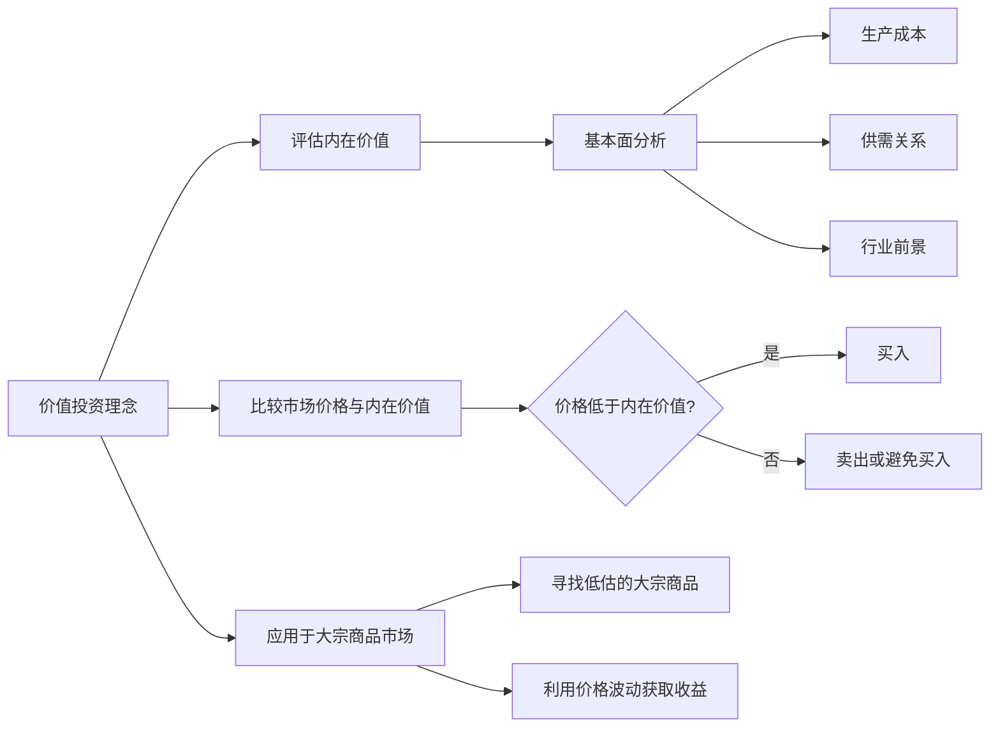

# 价值投资在大宗商品市场的应用

> 关键词：价值投资、大宗商品市场、投资策略、市场分析、风险控制

> 摘要：本文深入探讨了价值投资在大宗商品市场的应用。首先介绍了相关背景，包括目的范围、预期读者等。接着阐述了价值投资与大宗商品市场的核心概念及联系，分析了核心算法原理和具体操作步骤，用数学模型和公式进行了详细讲解并举例说明。通过项目实战给出了代码实际案例及解释，探讨了实际应用场景。还推荐了学习资源、开发工具框架以及相关论文著作。最后总结了未来发展趋势与挑战，提供了常见问题解答和扩展阅读参考资料，旨在为投资者在大宗商品市场运用价值投资提供全面的指导。

## 1. 背景介绍 
### 1.1 目的和范围
本文章的主要目的是详细阐述价值投资理念在大宗商品市场中的具体应用方式、策略和方法。范围涵盖了大宗商品市场的各个主要品种，如能源类（原油、天然气等）、金属类（黄金、铜等）、农产品类（大豆、小麦等）。通过对价值投资理论与大宗商品市场特点的结合分析，为投资者提供一套可行的投资思路和操作方法，帮助投资者在大宗商品市场中做出更理性、更具前瞻性的投资决策。

### 1.2 预期读者
预期读者主要包括对大宗商品投资感兴趣的个人投资者，他们希望通过学习价值投资的方法来提高在大宗商品市场的投资收益；专业的投资机构从业者，如基金经理、分析师等，他们可以从本文中获取新的投资视角和策略，优化现有的投资组合；以及相关领域的研究人员，他们可以将本文作为研究价值投资在大宗商品市场应用的参考资料，进行更深入的学术研究。

### 1.3 文档结构概述
本文首先介绍价值投资和大宗商品市场的背景知识，包括相关术语的定义和解释。接着阐述两者之间的核心概念联系，并通过示意图和流程图进行直观展示。然后详细讲解价值投资在大宗商品市场应用的核心算法原理和具体操作步骤，同时给出相应的Python代码示例。随后用数学模型和公式对投资过程进行分析，并举例说明。通过项目实战部分展示实际的代码案例和详细解释。之后探讨价值投资在大宗商品市场的实际应用场景。再推荐相关的学习资源、开发工具框架和论文著作。最后总结未来发展趋势与挑战，提供常见问题解答和扩展阅读参考资料。

### 1.4 术语表
#### 1.4.1 核心术语定义
- **价值投资**：是一种基于对资产内在价值的分析，通过寻找价格低于内在价值的资产进行投资，以获取长期投资回报的投资策略。其核心在于评估资产的真实价值，并在价格偏离价值时进行买卖操作。
- **大宗商品市场**：是指进行大宗商品交易的市场，大宗商品是指可进入流通领域，但非零售环节，具有商品属性并用于工农业生产与消费使用的大批量买卖的物质商品。包括能源商品、基础原材料和农副产品等。
- **内在价值**：指资产本身所具有的价值，是由资产的基本面因素，如生产成本、供需关系、质量等决定的价值，而不是由市场价格所反映的价值。
- **安全边际**：是价值投资中的一个重要概念，指的是资产的市场价格低于其内在价值的幅度。安全边际越大，投资的风险越低，潜在回报越高。

#### 1.4.2 相关概念解释
- **供需关系**：在大宗商品市场中，供需关系是影响价格的关键因素。当供给大于需求时，价格往往会下跌；当需求大于供给时，价格通常会上涨。例如，当原油产量大幅增加而全球经济增长放缓导致需求减少时，原油价格就会下降。
- **宏观经济因素**：宏观经济状况对大宗商品市场有着重要影响。经济增长、通货膨胀、利率等宏观经济指标的变化会影响大宗商品的需求和价格。例如，在经济增长较快时期，对工业金属的需求通常会增加，从而推动价格上涨。
- **期货市场**：大宗商品期货市场是大宗商品市场的重要组成部分，它为投资者提供了套期保值和投机的工具。期货合约是一种标准化的合约，规定了在未来某个特定时间和地点交割一定数量和质量的大宗商品。

#### 1.4.3 缩略词列表
- **ETF**：交易型开放式指数基金（Exchange Traded Fund），在大宗商品市场中，有一些ETF跟踪大宗商品价格指数，为投资者提供了一种便捷的投资大宗商品的方式。
- **CPI**：消费者物价指数（Consumer Price Index），是衡量通货膨胀水平的重要指标，与大宗商品价格密切相关。当CPI上升时，通常意味着通货膨胀加剧，大宗商品价格也可能随之上涨。

## 2. 核心概念与联系 

### 价值投资的核心原理
价值投资的核心原理基于对资产内在价值的评估。投资者通过分析资产的基本面因素，如财务状况、行业前景、竞争优势等，来确定资产的内在价值。然后将资产的市场价格与内在价值进行比较，如果市场价格低于内在价值，投资者认为该资产被低估，具有投资价值，从而进行买入操作；反之，如果市场价格高于内在价值，投资者认为该资产被高估，可能会选择卖出或避免买入。

### 大宗商品市场的特点
大宗商品市场具有以下特点：
- **供需主导价格**：如前文所述，供需关系是影响大宗商品价格的主要因素。大宗商品的生产和消费受自然条件、季节变化、经济周期等多种因素影响，供需关系容易发生波动，从而导致价格的大幅波动。
- **金融属性**：大宗商品具有一定的金融属性，其价格不仅受供需关系影响，还受到宏观经济因素、货币政策、投资者情绪等金融因素的影响。例如，在货币宽松时期，资金会流入大宗商品市场，推动价格上涨。
- **全球性市场**：大宗商品市场是全球性的市场，价格受到全球供需关系和国际政治经济形势的影响。例如，中东地区的政治动荡可能会影响原油的供应，从而导致全球原油价格上涨。

### 价值投资与大宗商品市场的联系
价值投资在大宗商品市场的应用主要体现在以下几个方面：
- **寻找低估的大宗商品**：投资者可以通过分析大宗商品的生产成本、供需关系等基本面因素，评估其内在价值。当市场价格低于内在价值时，投资者可以认为该大宗商品被低估，从而进行投资。例如，当黄金的生产成本上升，但市场价格由于短期的市场恐慌而下跌时，投资者可以认为黄金被低估，具有投资价值。
- **利用价格波动获取收益**：大宗商品市场价格波动较大，价值投资者可以利用这种价格波动，在价格低于内在价值时买入，在价格回归或超过内在价值时卖出，从而获取投资收益。例如，在农产品市场，由于季节性因素导致价格波动，投资者可以在价格低谷时买入，在价格高峰时卖出。

### 文本示意图
```plaintext
价值投资理念
|
|-- 评估内在价值
|   |-- 基本面分析
|       |-- 生产成本
|       |-- 供需关系
|       |-- 行业前景
|
|-- 比较市场价格与内在价值
|   |-- 价格低于内在价值：买入
|   |-- 价格高于内在价值：卖出或避免买入
|
|-- 应用于大宗商品市场
    |-- 寻找低估的大宗商品
    |-- 利用价格波动获取收益
```

### Mermaid 流程图


## 3. 核心算法原理 & 具体操作步骤 

### 核心算法原理
在大宗商品市场应用价值投资，核心算法原理主要围绕对大宗商品内在价值的评估和市场价格的比较。以下是一个简化的算法思路：

#### 1. 确定影响大宗商品内在价值的因素
- **生产成本**：包括原材料采购成本、生产过程中的能源消耗成本、劳动力成本等。
- **供需关系**：通过分析市场上大宗商品的供给量和需求量，以及未来的供需变化趋势来评估。
- **宏观经济因素**：如通货膨胀率、利率、经济增长率等。

#### 2. 构建内在价值评估模型
假设大宗商品的内在价值 $V$ 可以通过以下公式计算：

$V = a \times C + b \times S + c \times M$

其中，$C$ 表示生产成本，$S$ 表示供需关系指标（如供需缺口），$M$ 表示宏观经济因素指标（如通货膨胀率），$a$、$b$、$c$ 是权重系数，需要根据具体的大宗商品和市场情况进行确定。

#### 3. 比较内在价值和市场价格
将计算得到的内在价值 $V$ 与市场价格 $P$ 进行比较。如果 $P < V$，则认为该大宗商品被低估，具有投资价值；如果 $P > V$，则认为该大宗商品被高估，不建议投资。

### 具体操作步骤

#### 1. 数据收集
- **生产成本数据**：通过查阅行业报告、企业财务报表等方式获取大宗商品的生产成本数据。例如，对于原油生产企业，可以获取其开采成本、运输成本等数据。
- **供需关系数据**：从政府部门、行业协会等机构发布的统计数据中获取大宗商品的供给量和需求量数据。例如，美国能源信息署（EIA）会定期发布原油的库存和产量数据。
- **宏观经济数据**：从国家统计局、央行等机构获取宏观经济数据，如通货膨胀率、利率等。

#### 2. 确定权重系数
可以使用历史数据进行回归分析，来确定权重系数 $a$、$b$、$c$ 的值。以下是一个简单的 Python 代码示例：

```python
import numpy as np
from sklearn.linear_model import LinearRegression

# 假设我们有历史数据
# 生产成本数据
C = np.array([10, 12, 15, 13, 11]).reshape(-1, 1)
# 供需关系指标数据
S = np.array([2, 3, 1, 2, 3]).reshape(-1, 1)
# 宏观经济因素指标数据
M = np.array([0.02, 0.03, 0.01, 0.02, 0.03]).reshape(-1, 1)
# 对应的内在价值数据（这里假设是已知的）
V = np.array([120, 130, 140, 135, 125])

# 合并特征矩阵
X = np.hstack((C, S, M))

# 创建线性回归模型
model = LinearRegression()

# 拟合模型
model.fit(X, V)

# 获取权重系数
a = model.coef_[0]
b = model.coef_[1]
c = model.coef_[2]

print(f"权重系数 a: {a}, b: {b}, c: {c}")
```

#### 3. 计算内在价值
根据收集到的最新数据和确定的权重系数，计算大宗商品的内在价值。

```python
# 假设最新的生产成本、供需关系指标和宏观经济因素指标
C_new = 14
S_new = 2
M_new = 0.02

# 计算内在价值
V_new = a * C_new + b * S_new + c * M_new

print(f"最新内在价值: {V_new}")
```

#### 4. 比较内在价值和市场价格
获取最新的市场价格 $P$，并与计算得到的内在价值 $V$ 进行比较。

```python
# 假设最新市场价格
P = 130

if P < V_new:
    print("该大宗商品被低估，具有投资价值")
elif P > V_new:
    print("该大宗商品被高估，不建议投资")
else:
    print("该大宗商品价格合理")
```

## 4. 数学模型和公式 & 详细讲解 & 举例说明 

### 数学模型和公式
如前文所述，我们构建的大宗商品内在价值评估模型为：

$$V = a \times C + b \times S + c \times M$$

其中，$V$ 表示大宗商品的内在价值，$C$ 表示生产成本，$S$ 表示供需关系指标，$M$ 表示宏观经济因素指标，$a$、$b$、$c$ 是权重系数。

### 详细讲解
- **生产成本 $C$**：生产成本是影响大宗商品内在价值的重要因素之一。一般来说，生产成本越高，大宗商品的内在价值也越高。例如，在黄金市场中，黄金的开采成本包括采矿设备的购置和维护费用、劳动力成本、能源消耗成本等。如果黄金的开采成本上升，那么黄金的内在价值也会相应提高。
- **供需关系指标 $S$**：供需关系是影响大宗商品价格的关键因素。供需关系指标可以用供需缺口来表示，即供给量与需求量之间的差值。当供给量大于需求量时，供需缺口为正，市场供过于求，价格可能下跌；当供给量小于需求量时，供需缺口为负，市场供不应求，价格可能上涨。因此，供需关系指标 $S$ 对大宗商品的内在价值有着重要影响。
- **宏观经济因素指标 $M$**：宏观经济因素如通货膨胀率、利率等会影响大宗商品的需求和价格。例如，在通货膨胀时期，投资者会倾向于购买大宗商品来保值，从而增加对大宗商品的需求，推动价格上涨。因此，宏观经济因素指标 $M$ 也会对大宗商品的内在价值产生影响。
- **权重系数 $a$、$b$、$c$**：权重系数反映了各个因素对大宗商品内在价值的影响程度。通过历史数据的回归分析，可以确定这些权重系数的值。不同的大宗商品和市场情况，权重系数可能会有所不同。

### 举例说明
以原油市场为例，假设我们通过历史数据的回归分析得到权重系数 $a = 0.6$，$b = 0.3$，$c = 0.1$。

- **生产成本**：某一时期，原油的生产成本 $C = 50$ 美元/桶。
- **供需关系指标**：根据市场数据，当前原油的供需缺口为 -100 万桶/天（表示供不应求），我们将供需关系指标 $S$ 量化为 -10（假设的量化方式）。
- **宏观经济因素指标**：当前的通货膨胀率为 $0.03$，将其作为宏观经济因素指标 $M$。

则原油的内在价值 $V$ 为：

$$V = 0.6 \times 50 + 0.3 \times (-10) + 0.1 \times 0.03 \times 100$$

$$V = 30 - 3 + 0.3$$

$$V = 27.3$$（美元/桶）

如果当前原油的市场价格为 25 美元/桶，由于 $25 < 27.3$，则认为该时期原油被低估，具有投资价值。

## 5. 项目实战：代码实际案例和详细解释说明 

### 5.1  开发环境搭建
#### 操作系统
可以选择 Windows、Linux 或 macOS 操作系统，这里以 Windows 为例进行说明。

#### Python 安装
首先需要安装 Python 环境，建议安装 Python 3.7 及以上版本。可以从 Python 官方网站（https://www.python.org/downloads/） 下载安装包，按照安装向导进行安装。安装过程中注意勾选“Add Python to PATH”选项，以便在命令行中可以直接使用 Python 命令。

#### 第三方库安装
在价值投资在大宗商品市场应用的项目中，需要使用一些第三方库，如 `numpy`、`pandas`、`sklearn` 等。可以使用 `pip` 命令进行安装：

```sh
pip install numpy pandas scikit-learn
```

### 5.2  源代码详细实现和代码解读

```python
import numpy as np
import pandas as pd
from sklearn.linear_model import LinearRegression

# 模拟历史数据
# 生产成本数据
C = np.array([10, 12, 15, 13, 11]).reshape(-1, 1)
# 供需关系指标数据
S = np.array([2, 3, 1, 2, 3]).reshape(-1, 1)
# 宏观经济因素指标数据
M = np.array([0.02, 0.03, 0.01, 0.02, 0.03]).reshape(-1, 1)
# 对应的内在价值数据（这里假设是已知的）
V = np.array([120, 130, 140, 135, 125])

# 合并特征矩阵
X = np.hstack((C, S, M))

# 创建线性回归模型
model = LinearRegression()

# 拟合模型
model.fit(X, V)

# 获取权重系数
a = model.coef_[0]
b = model.coef_[1]
c = model.coef_[2]

print(f"权重系数 a: {a}, b: {b}, c: {c}")

# 假设最新的生产成本、供需关系指标和宏观经济因素指标
C_new = 14
S_new = 2
M_new = 0.02

# 计算内在价值
V_new = a * C_new + b * S_new + c * M_new

print(f"最新内在价值: {V_new}")

# 假设最新市场价格
P = 130

if P < V_new:
    print("该大宗商品被低估，具有投资价值")
elif P > V_new:
    print("该大宗商品被高估，不建议投资")
else:
    print("该大宗商品价格合理")
```

### 代码解读与分析
#### 数据模拟部分
```python
# 模拟历史数据
# 生产成本数据
C = np.array([10, 12, 15, 13, 11]).reshape(-1, 1)
# 供需关系指标数据
S = np.array([2, 3, 1, 2, 3]).reshape(-1, 1)
# 宏观经济因素指标数据
M = np.array([0.02, 0.03, 0.01, 0.02, 0.03]).reshape(-1, 1)
# 对应的内在价值数据（这里假设是已知的）
V = np.array([120, 130, 140, 135, 125])
```
这部分代码模拟了历史数据，包括生产成本、供需关系指标、宏观经济因素指标和对应的内在价值。在实际应用中，这些数据需要从真实的数据源中获取。

#### 特征矩阵合并和模型训练部分
```python
# 合并特征矩阵
X = np.hstack((C, S, M))

# 创建线性回归模型
model = LinearRegression()

# 拟合模型
model.fit(X, V)
```
将生产成本、供需关系指标和宏观经济因素指标合并成一个特征矩阵 $X$，然后使用 `LinearRegression` 模型进行拟合，得到权重系数。

#### 权重系数获取和内在价值计算部分
```python
# 获取权重系数
a = model.coef_[0]
b = model.coef_[1]
c = model.coef_[2]

print(f"权重系数 a: {a}, b: {b}, c: {c}")

# 假设最新的生产成本、供需关系指标和宏观经济因素指标
C_new = 14
S_new = 2
M_new = 0.02

# 计算内在价值
V_new = a * C_new + b * S_new + c * M_new

print(f"最新内在价值: {V_new}")
```
从训练好的模型中获取权重系数，然后根据最新的生产成本、供需关系指标和宏观经济因素指标计算最新的内在价值。

#### 市场价格比较和投资建议部分
```python
# 假设最新市场价格
P = 130

if P < V_new:
    print("该大宗商品被低估，具有投资价值")
elif P > V_new:
    print("该大宗商品被高估，不建议投资")
else:
    print("该大宗商品价格合理")
```
将最新的市场价格与计算得到的内在价值进行比较，根据比较结果给出投资建议。

## 6. 实际应用场景 

### 个人投资者
个人投资者可以利用价值投资理念在大宗商品市场进行投资。例如，个人投资者可以关注黄金市场，通过分析黄金的生产成本、全球供需关系和宏观经济因素（如通货膨胀率、利率等）来评估黄金的内在价值。当黄金价格低于其内在价值时，个人投资者可以考虑买入黄金，如购买黄金 ETF 或实物黄金。在持有一段时间后，当黄金价格回归或超过内在价值时，个人投资者可以卖出黄金，获取投资收益。

### 企业套期保值
企业在生产经营过程中会面临大宗商品价格波动的风险。例如，航空公司需要大量的航空燃油，燃油价格的上涨会增加航空公司的运营成本。航空公司可以运用价值投资的理念，评估航空燃油的内在价值。当燃油价格低于内在价值时，航空公司可以通过期货市场进行买入套期保值，锁定未来的燃油采购成本，降低价格波动带来的风险。

### 投资机构资产配置
投资机构可以将大宗商品纳入资产配置组合中，运用价值投资策略进行投资。投资机构可以分析不同大宗商品的内在价值，选择被低估的大宗商品进行投资，以优化资产配置组合，提高投资组合的收益和抗风险能力。例如，投资机构可以在农产品市场价格低迷时，增加对农产品期货或相关 ETF 的投资，以获取潜在的投资回报。

## 7. 工具和资源推荐
### 7.1 学习资源推荐
#### 7.1.1 书籍推荐
- 《聪明的投资者》（The Intelligent Investor）：作者是本杰明·格雷厄姆（Benjamin Graham），这本书是价值投资领域的经典著作，详细阐述了价值投资的理念和方法，对投资者具有重要的指导意义。
- 《大宗商品投资手册》：全面介绍了大宗商品市场的基本知识、投资策略和风险管理方法，适合初学者和有一定经验的投资者阅读。
- 《期货市场技术分析》（Technical Analysis of the Futures Markets）：作者是约翰·墨菲（John J. Murphy），这本书介绍了期货市场的技术分析方法，对于在大宗商品期货市场进行投资的投资者有很大帮助。

#### 7.1.2 在线课程
- Coursera 平台上的“投资学原理”课程：该课程由知名大学的教授授课，涵盖了投资学的基本原理和方法，包括价值投资的相关内容。
- 网易云课堂上的“大宗商品投资实战课程”：课程结合实际案例，详细讲解了大宗商品投资的策略和技巧。

#### 7.1.3 技术博客和网站
- 雪球网：是一个投资者交流社区，有很多关于大宗商品投资的讨论和分析文章，投资者可以在这里获取最新的市场信息和投资观点。
- 金十数据：提供全球大宗商品市场的实时行情、数据分析和市场评论，是投资者获取市场信息的重要渠道。

### 7.2 开发工具框架推荐
#### 7.2.1 IDE和编辑器
- PyCharm：是一款专业的 Python 集成开发环境，具有强大的代码编辑、调试和分析功能，适合开发与价值投资在大宗商品市场应用相关的 Python 程序。
- Jupyter Notebook：是一个交互式的开发环境，支持 Python 代码的编写和运行，同时可以插入文本、图表等元素，方便进行数据分析和模型验证。

#### 7.2.2 调试和性能分析工具
- pdb：是 Python 自带的调试工具，可以帮助开发者在代码运行过程中进行调试，查找和解决代码中的问题。
- cProfile：是 Python 的性能分析工具，可以分析代码的运行时间和函数调用情况，帮助开发者优化代码性能。

#### 7.2.3 相关框架和库
- numpy：是 Python 的一个基础科学计算库，提供了高效的数组操作和数学函数，在数据处理和模型计算中经常使用。
- pandas：是一个数据处理和分析库，提供了灵活的数据结构和数据操作方法，方便处理和分析大宗商品市场的数据。
- scikit-learn：是一个机器学习库，提供了各种机器学习算法和工具，如线性回归、决策树等，可以用于构建大宗商品内在价值评估模型。

### 7.3 相关论文著作推荐
#### 7.3.1 经典论文
- Fama, E. F., & French, K. R. (1993). Common risk factors in the returns on stocks and bonds. Journal of Financial Economics, 33(1), 3-56. 该论文提出了著名的 Fama-French 三因子模型，对资产定价和投资分析具有重要影响。
- Modigliani, F., & Miller, M. H. (1958). The cost of capital, corporation finance and the theory of investment. The American Economic Review, 48(3), 261-297. 这篇论文提出了 Modigliani-Miller 定理，对企业融资和投资决策具有重要意义。

#### 7.3.2 最新研究成果
- 可以关注《Journal of Finance》、《Review of Financial Studies》等金融领域的顶级学术期刊，这些期刊会发表关于大宗商品市场和价值投资的最新研究成果。

#### 7.3.3 应用案例分析
- 可以参考一些专业的金融研究报告和咨询机构的研究成果，了解价值投资在大宗商品市场的实际应用案例和分析方法。

## 8. 总结：未来发展趋势与挑战

### 未来发展趋势
- **数字化和智能化**：随着科技的不断发展，大宗商品市场将越来越数字化和智能化。投资者可以利用大数据、人工智能等技术来更准确地评估大宗商品的内在价值，制定更合理的投资策略。例如，通过分析海量的市场数据和新闻信息，利用机器学习算法预测大宗商品价格的走势。
- **绿色和可持续发展**：全球对环境保护和可持续发展的关注度不断提高，大宗商品市场也将受到影响。投资者将更加关注绿色和可持续的大宗商品，如可再生能源、绿色金属等。同时，企业在生产和运营过程中也将更加注重环保和可持续性，这将影响大宗商品的供需关系和价格。
- **国际化和多元化**：大宗商品市场是全球性的市场，未来将更加国际化和多元化。投资者可以通过参与国际大宗商品市场，获取更多的投资机会。同时，大宗商品的品种也将不断增加，除了传统的能源、金属和农产品外，一些新兴的大宗商品如数字货币、碳交易等也将逐渐进入投资者的视野。

### 挑战
- **市场不确定性**：大宗商品市场受到多种因素的影响，如供需关系、宏观经济因素、政治局势等，市场不确定性较大。投资者很难准确预测大宗商品价格的走势，增加了投资的风险。
- **数据质量和获取难度**：在应用价值投资理念进行大宗商品投资时，需要大量的高质量数据来评估内在价值。然而，数据的质量和获取难度是一个挑战。一些数据可能存在误差或不完整，同时获取某些数据可能需要支付高额的费用或受到数据提供者的限制。
- **监管政策变化**：大宗商品市场受到各国政府的监管，监管政策的变化可能会对市场产生重大影响。投资者需要密切关注监管政策的变化，及时调整投资策略。

## 9. 附录：常见问题与解答

### 问题 1：价值投资在大宗商品市场的应用是否适用于所有大宗商品？
解答：价值投资在大宗商品市场的应用并不适用于所有大宗商品。不同的大宗商品具有不同的特点和市场环境，有些大宗商品的价格受到政治、地缘等因素的影响较大，内在价值的评估难度较高，价值投资的应用效果可能不太理想。例如，一些稀有金属的市场规模较小，价格波动较大，受到少数供应商和需求方的影响较大，价值投资的策略可能需要进行调整。

### 问题 2：如何确定大宗商品的内在价值？
解答：确定大宗商品的内在价值需要综合考虑多个因素，如生产成本、供需关系、宏观经济因素等。可以通过收集相关数据，构建内在价值评估模型来计算内在价值。例如，使用线性回归模型，将生产成本、供需关系指标和宏观经济因素指标作为自变量，内在价值作为因变量，通过历史数据进行回归分析，得到权重系数，然后根据最新的数据计算内在价值。

### 问题 3：价值投资在大宗商品市场的投资周期一般是多长？
解答：价值投资在大宗商品市场的投资周期没有固定的标准，取决于多种因素。一般来说，价值投资是一种长期投资策略，投资周期可能较长，可能需要数月甚至数年。因为大宗商品市场价格波动较大，价格回归内在价值需要一定的时间。但在某些情况下，当市场出现明显的价格低估或高估时，投资周期也可能较短。

## 10. 扩展阅读 & 参考资料
- 《金融市场学》，作者：张亦春、郑振龙，高等教育出版社。
- 《投资学》，作者：滋维·博迪、亚历克斯·凯恩、艾伦·马库斯，机械工业出版社。
- 彭博社（Bloomberg）网站，提供全球金融市场和大宗商品市场的实时数据和分析。
- 路透社（Reuters）网站，提供全球政治、经济和金融新闻，对大宗商品市场有深入的报道和分析。

作者：AI天才研究院/AI Genius Institute & 禅与计算机程序设计艺术 /Zen And The Art of Computer Programming