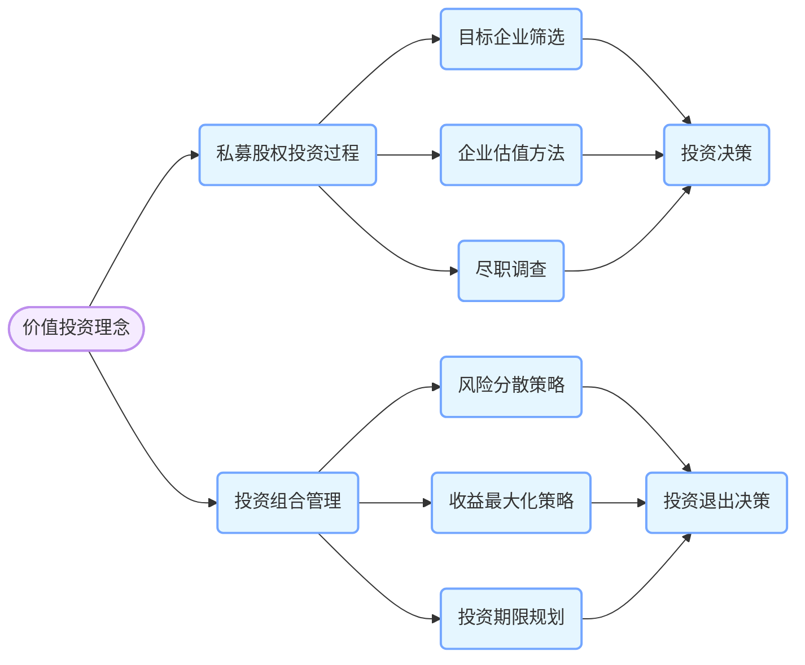

# 价值投资在私募股权中的应用

> 关键词：价值投资、私募股权、投资策略、估值方法、风险管理

> 摘要：本文深入探讨了价值投资在私募股权领域的应用。首先介绍了研究的背景、目的、预期读者和文档结构，明确了相关术语。接着阐述了价值投资和私募股权的核心概念及二者的联系，通过文本示意图和Mermaid流程图进行直观展示。详细讲解了核心算法原理和具体操作步骤，并结合Python代码进行说明。引入了数学模型和公式，辅以举例加深理解。通过项目实战案例，从开发环境搭建到源代码实现和解读，展示了价值投资在私募股权中的实际应用。分析了价值投资在私募股权中的实际应用场景，推荐了学习资源、开发工具框架和相关论文著作。最后总结了未来发展趋势与挑战，解答了常见问题，并提供了扩展阅读和参考资料，旨在为私募股权投资领域的从业者和研究者提供全面而深入的知识和实践指导。

## 1. 背景介绍 
### 1.1 目的和范围
价值投资作为一种经典的投资理念，强调寻找被低估的资产并长期持有，以获取资产价值回归和增长带来的收益。私募股权则专注于对非上市公司进行股权投资，通过参与企业经营管理、改善企业业绩等方式实现资本增值。本研究的目的在于深入探讨价值投资理念如何应用于私募股权投资实践中，包括投资策略的制定、目标企业的筛选、估值方法的运用以及风险管理等方面。研究范围涵盖了私募股权市场的不同阶段，如早期投资、成长期投资和并购投资等，旨在为私募股权投资者提供系统的价值投资应用指导。

### 1.2 预期读者
本文的预期读者主要包括私募股权投资机构的专业人士，如投资经理、分析师等，他们可以从文中获取价值投资在私募股权中的具体应用方法和实践经验；同时也适合对私募股权投资感兴趣的学者和研究人员，为他们的学术研究提供参考；此外，对于有一定投资基础，希望了解私募股权投资的个人投资者也具有一定的借鉴意义。

### 1.3 文档结构概述
本文将按照以下结构展开：首先介绍价值投资和私募股权的核心概念及二者的联系；接着阐述核心算法原理和具体操作步骤，并给出Python代码示例；然后引入数学模型和公式进行详细讲解，并举例说明；通过项目实战案例展示价值投资在私募股权中的实际应用，包括开发环境搭建、源代码实现和代码解读；分析价值投资在私募股权中的实际应用场景；推荐相关的学习资源、开发工具框架和论文著作；最后总结未来发展趋势与挑战，解答常见问题，并提供扩展阅读和参考资料。

### 1.4 术语表
#### 1.4.1 核心术语定义
- **价值投资**：是一种基于对资产内在价值的分析，寻找被市场低估的投资标的，并在价格回归价值或价值增长时实现收益的投资策略。
- **私募股权**：指通过非公开方式募集资金，对非上市公司进行的权益性投资，并通过上市、并购或管理层回购等方式，出售持股获利。
- **内在价值**：资产在未来所能产生的现金流量的现值，是价值投资中评估资产是否被低估的重要依据。
- **投资组合**：投资者将资金分散投资于不同的资产或项目，以降低风险和实现收益最大化的资产集合。

#### 1.4.2 相关概念解释
- **尽职调查**：在私募股权投资中，投资者对目标企业的财务状况、经营管理、市场前景等方面进行全面深入的调查，以评估投资风险和价值。
- **估值方法**：用于评估目标企业价值的一系列方法，如现金流折现法、可比公司法、可比交易法等。
- **退出机制**：私募股权投资在投资一定期限后，通过特定方式将股权变现的途径，常见的退出方式包括首次公开发行（IPO）、股权转让、管理层回购等。

#### 1.4.3 缩略词列表
- **IPO**：Initial Public Offering，首次公开发行
- **DCF**：Discounted Cash Flow，现金流折现法
- **PE**：Private Equity，私募股权

## 2. 核心概念与联系 
### 核心概念原理
#### 价值投资原理
价值投资的核心原理基于资产的内在价值。投资者通过对目标企业的基本面进行深入分析，包括财务报表、行业前景、竞争优势等，估算出企业的内在价值。当市场价格低于内在价值时，认为该资产被低估，此时进行投资，等待价格回归价值或价值增长，从而实现投资收益。例如，一家企业的内在价值经估算为每股100元，而当前市场价格仅为每股80元，价值投资者会认为该企业股票具有投资价值，选择买入。

#### 私募股权原理
私募股权是一种非公开的股权投资方式。私募股权机构通过向特定投资者募集资金，然后将资金投入到非上市公司中。私募股权投资者通常会积极参与目标企业的经营管理，帮助企业提升业绩和竞争力。在企业发展到一定阶段后，通过合适的退出机制，如IPO、股权转让等，实现资本增值并退出投资。例如，私募股权机构投资一家初创科技企业，提供资金和管理经验，帮助企业快速发展，待企业成熟后通过上市将股权变现。

### 架构的文本示意图
```plaintext
价值投资与私募股权架构示意图

               价值投资理念
                   │
                   │
                   │
          ┌─────────────────────┐
          │                     │
          │                     │
    私募股权投资过程        投资组合管理
          │                     │
          │                     │
 ┌───────────────┐        ┌───────────────┐
 │ 目标企业筛选 │        │ 风险分散策略 │
 └───────────────┘        └───────────────┘
          │                     │
          │                     │
 ┌───────────────┐        ┌───────────────┐
 │ 企业估值方法 │        │ 收益最大化策略 │
 └───────────────┘        └───────────────┘
          │                     │
          │                     │
 ┌───────────────┐        ┌───────────────┐
 │ 尽职调查      │        │ 投资期限规划 │
 └───────────────┘        └───────────────┘
          │                     │
          │                     │
 └───────────────┘        └───────────────┘
          投资决策             投资退出决策
```

### Mermaid流程图


## 3. 核心算法原理 & 具体操作步骤 
### 核心算法原理
在价值投资应用于私募股权中，一个重要的算法原理是现金流折现法（DCF）用于企业估值。DCF法的基本思想是将企业未来预期产生的现金流量按照一定的折现率折现到当前时刻，得到企业的内在价值。其公式为：

$$V = \sum_{t=1}^{n} \frac{CF_t}{(1 + r)^t} + \frac{TV}{(1 + r)^n}$$

其中，$V$ 表示企业的内在价值，$CF_t$ 表示第 $t$ 期的现金流量，$r$ 表示折现率，$n$ 表示预测期数，$TV$ 表示终值。

### 具体操作步骤
1. **预测未来现金流量**：对目标企业的未来经营情况进行分析和预测，确定未来各期的现金流量。这需要考虑企业的业务模式、市场前景、竞争状况等因素。
2. **确定折现率**：折现率反映了投资的风险和机会成本。通常可以使用加权平均资本成本（WACC）作为折现率，其计算公式为：

$$WACC = E/V \times r_e + D/V \times r_d \times (1 - T)$$

其中，$E$ 表示股权价值，$D$ 表示债务价值，$V = E + D$ 表示企业总价值，$r_e$ 表示股权成本，$r_d$ 表示债务成本，$T$ 表示企业所得税税率。

3. **计算终值**：在预测期结束后，企业仍然会持续经营，需要估算终值。常见的终值计算方法是使用永续增长模型，公式为：

$$TV = \frac{CF_{n+1}}{r - g}$$

其中，$CF_{n+1}$ 表示预测期结束后下一期的现金流量，$g$ 表示永续增长率。

4. **计算内在价值**：将各期现金流量和终值按照折现率折现到当前时刻，求和得到企业的内在价值。

### Python源代码实现
```python
import numpy as np

def calculate_wacc(equity_value, debt_value, equity_cost, debt_cost, tax_rate):
    """
    计算加权平均资本成本（WACC）
    :param equity_value: 股权价值
    :param debt_value: 债务价值
    :param equity_cost: 股权成本
    :param debt_cost: 债务成本
    :param tax_rate: 企业所得税税率
    :return: WACC
    """
    total_value = equity_value + debt_value
    wacc = (equity_value / total_value) * equity_cost + (debt_value / total_value) * debt_cost * (1 - tax_rate)
    return wacc

def calculate_terminal_value(cash_flow_n1, discount_rate, growth_rate):
    """
    计算终值
    :param cash_flow_n1: 预测期结束后下一期的现金流量
    :param discount_rate: 折现率
    :param growth_rate: 永续增长率
    :return: 终值
    """
    terminal_value = cash_flow_n1 / (discount_rate - growth_rate)
    return terminal_value

def calculate_intrinsic_value(cash_flows, discount_rate, terminal_value):
    """
    计算企业内在价值
    :param cash_flows: 未来各期现金流量列表
    :param discount_rate: 折现率
    :param terminal_value: 终值
    :return: 企业内在价值
    """
    n = len(cash_flows)
    present_values = []
    for t in range(n):
        present_value = cash_flows[t] / ((1 + discount_rate) ** (t + 1))
        present_values.append(present_value)
    terminal_present_value = terminal_value / ((1 + discount_rate) ** n)
    intrinsic_value = sum(present_values) + terminal_present_value
    return intrinsic_value

# 示例参数
equity_value = 1000
debt_value = 500
equity_cost = 0.1
debt_cost = 0.05
tax_rate = 0.25
cash_flows = [100, 120, 150, 180, 200]
cash_flow_n1 = 220
growth_rate = 0.03

# 计算WACC
wacc = calculate_wacc(equity_value, debt_value, equity_cost, debt_cost, tax_rate)
print(f"加权平均资本成本 (WACC): {wacc:.2%}")

# 计算终值
terminal_value = calculate_terminal_value(cash_flow_n1, wacc, growth_rate)
print(f"终值: {terminal_value:.2f}")

# 计算内在价值
intrinsic_value = calculate_intrinsic_value(cash_flows, wacc, terminal_value)
print(f"企业内在价值: {intrinsic_value:.2f}")
```

## 4. 数学模型和公式 & 详细讲解 & 举例说明 
### 现金流折现法（DCF）
#### 公式
$$V = \sum_{t=1}^{n} \frac{CF_t}{(1 + r)^t} + \frac{TV}{(1 + r)^n}$$

#### 详细讲解
- **现金流量（$CF_t$）**：是指企业在第 $t$ 期产生的现金流入减去现金流出后的净额。预测现金流量需要对企业的业务进行深入分析，考虑市场需求、销售增长、成本控制等因素。例如，一家制造企业，需要预测其产品的销售量、价格、原材料成本、生产费用等，从而估算出各期的现金流量。
- **折现率（$r$）**：反映了投资的风险和机会成本。风险越高，折现率越高。折现率的选择对企业内在价值的计算结果影响较大。通常使用加权平均资本成本（WACC）作为折现率，它综合考虑了股权成本和债务成本。
- **预测期数（$n$）**：是指对企业未来现金流量进行预测的期限。预测期数的确定需要考虑企业的行业特点、发展阶段等因素。一般来说，对于处于稳定发展阶段的企业，预测期可以相对较长；对于处于快速变化行业的企业，预测期可能较短。
- **终值（$TV$）**：是指预测期结束后企业的价值。由于企业在预测期结束后仍然会持续经营，需要估算其终值。常见的终值计算方法是永续增长模型，假设企业在预测期结束后以一个固定的增长率持续增长。

#### 举例说明
假设一家科技企业，预计未来5年的现金流量分别为100万元、120万元、150万元、180万元和200万元。预测期结束后下一年的现金流量为220万元，永续增长率为3%。该企业的股权价值为1000万元，债务价值为500万元，股权成本为10%，债务成本为5%，企业所得税税率为25%。

首先，计算加权平均资本成本（WACC）：
$$WACC = \frac{1000}{1000 + 500} \times 0.1 + \frac{500}{1000 + 500} \times 0.05 \times (1 - 0.25) \approx 0.0792$$

然后，计算终值：
$$TV = \frac{220}{0.0792 - 0.03} \approx 4471.54$$

最后，计算企业内在价值：
$$V = \frac{100}{(1 + 0.0792)^1} + \frac{120}{(1 + 0.0792)^2} + \frac{150}{(1 + 0.0792)^3} + \frac{180}{(1 + 0.0792)^4} + \frac{200}{(1 + 0.0792)^5} + \frac{4471.54}{(1 + 0.0792)^5} \approx 3245.67$$

### 可比公司法
#### 公式
$$V = EV/EBITDA \times EBITDA_{target}$$

#### 详细讲解
- **EV/EBITDA**：是企业价值与息税折旧摊销前利润的比率，是可比公司法中常用的估值倍数。通过选取一组与目标企业具有相似业务、规模、行业地位等特征的可比公司，计算它们的EV/EBITDA倍数的平均值或中位数，作为目标企业的估值倍数。
- **EBITDA_{target}**：是目标企业的息税折旧摊销前利润。息税折旧摊销前利润反映了企业的经营盈利能力，不考虑利息、税收、折旧和摊销等因素的影响。

#### 举例说明
假设选取了3家可比公司，它们的EV/EBITDA倍数分别为8倍、9倍和10倍，平均值为9倍。目标企业的EBITDA为500万元。则目标企业的价值为：
$$V = 9 \times 500 = 4500$$（万元）

## 5. 项目实战：代码实际案例和详细解释说明 
### 5.1  开发环境搭建
#### 操作系统
可以选择Windows、Linux或Mac OS等主流操作系统。本案例以Windows 10为例进行说明。

#### Python环境
安装Python 3.x版本，建议使用Python 3.7及以上版本。可以从Python官方网站（https://www.python.org/downloads/）下载安装包进行安装。安装过程中选择“Add Python to PATH”选项，以便在命令行中可以直接使用Python命令。

#### 开发工具
推荐使用PyCharm作为开发工具，它是一款功能强大的Python集成开发环境（IDE）。可以从JetBrains官方网站（https://www.jetbrains.com/pycharm/download/）下载社区版或专业版进行安装。

#### 第三方库安装
在命令行中使用以下命令安装所需的第三方库：
```sh
pip install numpy
```

### 5.2  源代码详细实现和代码解读
```python
import numpy as np

def calculate_wacc(equity_value, debt_value, equity_cost, debt_cost, tax_rate):
    """
    计算加权平均资本成本（WACC）
    :param equity_value: 股权价值
    :param debt_value: 债务价值
    :param equity_cost: 股权成本
    :param debt_cost: 债务成本
    :param tax_rate: 企业所得税税率
    :return: WACC
    """
    total_value = equity_value + debt_value
    wacc = (equity_value / total_value) * equity_cost + (debt_value / total_value) * debt_cost * (1 - tax_rate)
    return wacc

def calculate_terminal_value(cash_flow_n1, discount_rate, growth_rate):
    """
    计算终值
    :param cash_flow_n1: 预测期结束后下一期的现金流量
    :param discount_rate: 折现率
    :param growth_rate: 永续增长率
    :return: 终值
    """
    terminal_value = cash_flow_n1 / (discount_rate - growth_rate)
    return terminal_value

def calculate_intrinsic_value(cash_flows, discount_rate, terminal_value):
    """
    计算企业内在价值
    :param cash_flows: 未来各期现金流量列表
    :param discount_rate: 折现率
    :param terminal_value: 终值
    :return: 企业内在价值
    """
    n = len(cash_flows)
    present_values = []
    for t in range(n):
        present_value = cash_flows[t] / ((1 + discount_rate) ** (t + 1))
        present_values.append(present_value)
    terminal_present_value = terminal_value / ((1 + discount_rate) ** n)
    intrinsic_value = sum(present_values) + terminal_present_value
    return intrinsic_value

# 示例参数
equity_value = 1000
debt_value = 500
equity_cost = 0.1
debt_cost = 0.05
tax_rate = 0.25
cash_flows = [100, 120, 150, 180, 200]
cash_flow_n1 = 220
growth_rate = 0.03

# 计算WACC
wacc = calculate_wacc(equity_value, debt_value, equity_cost, debt_cost, tax_rate)
print(f"加权平均资本成本 (WACC): {wacc:.2%}")

# 计算终值
terminal_value = calculate_terminal_value(cash_flow_n1, wacc, growth_rate)
print(f"终值: {terminal_value:.2f}")

# 计算内在价值
intrinsic_value = calculate_intrinsic_value(cash_flows, wacc, terminal_value)
print(f"企业内在价值: {intrinsic_value:.2f}")
```

#### 代码解读
1. **导入必要的库**：
```python
import numpy as np
```
导入`numpy`库，虽然在本代码中未直接使用，但在实际应用中可能会用于处理数值计算和数组操作。

2. **计算加权平均资本成本（WACC）**：
```python
def calculate_wacc(equity_value, debt_value, equity_cost, debt_cost, tax_rate):
    total_value = equity_value + debt_value
    wacc = (equity_value / total_value) * equity_cost + (debt_value / total_value) * debt_cost * (1 - tax_rate)
    return wacc
```
该函数接受股权价值、债务价值、股权成本、债务成本和企业所得税税率作为参数，计算并返回加权平均资本成本（WACC）。

3. **计算终值**：
```python
def calculate_terminal_value(cash_flow_n1, discount_rate, growth_rate):
    terminal_value = cash_flow_n1 / (discount_rate - growth_rate)
    return terminal_value
```
该函数接受预测期结束后下一期的现金流量、折现率和永续增长率作为参数，使用永续增长模型计算并返回终值。

4. **计算企业内在价值**：
```python
def calculate_intrinsic_value(cash_flows, discount_rate, terminal_value):
    n = len(cash_flows)
    present_values = []
    for t in range(n):
        present_value = cash_flows[t] / ((1 + discount_rate) ** (t + 1))
        present_values.append(present_value)
    terminal_present_value = terminal_value / ((1 + discount_rate) ** n)
    intrinsic_value = sum(present_values) + terminal_present_value
    return intrinsic_value
```
该函数接受未来各期现金流量列表、折现率和终值作为参数，将各期现金流量和终值按照折现率折现到当前时刻，求和得到企业的内在价值。

5. **示例参数设置和计算**：
```python
equity_value = 1000
debt_value = 500
equity_cost = 0.1
debt_cost = 0.05
tax_rate = 0.25
cash_flows = [100, 120, 150, 180, 200]
cash_flow_n1 = 220
growth_rate = 0.03

wacc = calculate_wacc(equity_value, debt_value, equity_cost, debt_cost, tax_rate)
print(f"加权平均资本成本 (WACC): {wacc:.2%}")

terminal_value = calculate_terminal_value(cash_flow_n1, wacc, growth_rate)
print(f"终值: {terminal_value:.2f}")

intrinsic_value = calculate_intrinsic_value(cash_flows, wacc, terminal_value)
print(f"企业内在价值: {intrinsic_value:.2f}")
```
设置示例参数，调用上述函数计算加权平均资本成本、终值和企业内在价值，并将结果打印输出。

### 5.3  代码解读与分析
#### 优点
- **模块化设计**：代码将不同的计算功能封装成独立的函数，提高了代码的可读性和可维护性。例如，计算WACC、终值和企业内在价值的函数可以独立使用和测试。
- **灵活性**：通过参数传递，可以方便地调整输入参数，进行不同场景下的计算。例如，可以改变股权价值、债务价值、现金流量等参数，计算不同企业的内在价值。
- **易于理解**：代码逻辑清晰，注释详细，便于初学者理解和学习。

#### 局限性
- **假设条件的局限性**：代码中使用的现金流折现法和永续增长模型都基于一定的假设条件，如现金流量的预测和永续增长率的假设。这些假设可能与实际情况存在偏差，导致计算结果不准确。
- **缺乏数据验证**：代码没有对输入参数进行有效性验证，例如，折现率不能小于永续增长率，否则会导致终值计算出现错误。在实际应用中，需要添加数据验证逻辑，提高代码的健壮性。

## 6. 实际应用场景 
### 早期投资
在私募股权的早期投资阶段，价值投资理念可以帮助投资者筛选出具有潜在价值的初创企业。投资者通过对创业团队的能力、技术创新性、市场需求等方面进行评估，寻找那些被市场低估但具有高增长潜力的企业。例如，一家专注于人工智能领域的初创企业，虽然目前可能尚未实现盈利，但拥有优秀的研发团队和独特的技术，价值投资者会基于对人工智能行业未来发展的判断，以及对该企业技术优势的分析，认为其具有较高的内在价值，从而进行投资。

### 成长期投资
对于处于成长期的企业，价值投资可以用于评估企业的扩张潜力和市场竞争力。投资者会关注企业的财务指标，如营业收入增长率、利润率等，同时分析企业的市场份额、客户群体和品牌影响力。通过现金流折现法等估值方法，确定企业的内在价值。如果企业的市场价格低于内在价值，投资者会认为该企业具有投资价值。例如，一家消费电子企业在成长期，市场需求不断增长，企业通过不断推出新产品和拓展市场渠道，实现了快速增长。价值投资者会对该企业的未来现金流量进行预测，评估其内在价值，决定是否进行投资。

### 并购投资
在并购投资中，价值投资理念对于确定合理的并购价格至关重要。收购方需要对目标企业进行全面的尽职调查，包括财务状况、经营管理、法律风险等方面。通过多种估值方法，如现金流折现法、可比公司法等，评估目标企业的内在价值。同时，考虑并购后的协同效应，如成本节约、市场拓展等，确定合理的并购价格。例如，一家大型企业计划收购一家小型企业，通过价值投资分析，评估目标企业的内在价值为5000万元，考虑到并购后的协同效应可以带来额外的价值1000万元，那么收购方可以在6000万元左右的价格范围内进行谈判。

### 困境企业投资
对于陷入困境的企业，价值投资者可以通过深入分析企业的困境原因，判断企业是否具有复苏的潜力。如果企业的困境是由于短期的市场波动、管理不善等原因造成的，而企业的核心业务和资产仍然具有价值，价值投资者会认为该企业具有投资机会。投资者会帮助企业进行重组和改善经营管理，待企业业绩恢复后实现投资收益。例如，一家传统制造业企业由于市场竞争激烈和环保政策压力，出现了亏损和经营困难。价值投资者通过分析发现，该企业拥有先进的生产设备和优秀的技术团队，只是在市场策略和成本控制方面存在问题。投资者会注入资金，帮助企业进行技术升级和市场拓展，实现企业的复苏和价值提升。

## 7. 工具和资源推荐
### 7.1 学习资源推荐
#### 7.1.1 书籍推荐
- 《聪明的投资者》（The Intelligent Investor）：作者本杰明·格雷厄姆（Benjamin Graham）是价值投资理论的奠基人，这本书是价值投资领域的经典之作，详细阐述了价值投资的理念和方法，对投资者具有很高的指导意义。
- 《证券分析》（Security Analysis）：同样是本杰明·格雷厄姆的著作，被誉为投资领域的“圣经”。该书系统地介绍了证券分析的基本原理和方法，包括财务报表分析、估值方法等，是价值投资者必备的参考书。
- 《私募股权投资与创业金融》（Private Equity and Venture Capital）：作者保罗·冈珀斯（Paul Gompers）和乔希·勒纳（Josh Lerner），这本书全面介绍了私募股权投资的理论和实践，包括投资策略、估值方法、退出机制等方面的内容，适合私募股权从业者和研究者阅读。

#### 7.1.2 在线课程
- Coursera平台上的“投资学原理”（Principles of Investing）课程：由宾夕法尼亚大学的教授授课，课程内容涵盖了投资的基本概念、资产定价模型、投资组合管理等方面的知识，对价值投资的理论和实践有深入的讲解。
- edX平台上的“私募股权与风险投资”（Private Equity and Venture Capital）课程：由哈佛大学的教授授课，课程介绍了私募股权和风险投资的行业概况、投资流程、估值方法等内容，帮助学习者了解私募股权投资的实际操作。

#### 7.1.3 技术博客和网站
- Seeking Alpha：是一个知名的投资研究和分析网站，提供了大量的股票分析、市场评论和投资策略文章，其中不乏关于价值投资和私募股权的内容。
- ValueWalk：专注于价值投资领域，发布了许多价值投资者的观点和研究报告，以及私募股权行业的动态和分析。

### 7.2 开发工具框架推荐
#### 7.2.1 IDE和编辑器
- PyCharm：是一款功能强大的Python集成开发环境（IDE），具有代码自动补全、调试、版本控制等功能，适合Python开发。
- Jupyter Notebook：是一个基于Web的交互式计算环境，支持Python等多种编程语言。它可以将代码、文本、图表等内容集成在一个文档中，方便进行数据分析和模型开发。

#### 7.2.2 调试和性能分析工具
- PySnooper：是一个简单易用的Python调试工具，可以自动记录函数的执行过程和变量的值，帮助开发者快速定位问题。
- cProfile：是Python标准库中的性能分析工具，可以统计函数的执行时间和调用次数，帮助开发者找出代码中的性能瓶颈。

#### 7.2.3 相关框架和库
- Pandas：是一个强大的数据分析库，提供了数据结构和数据分析工具，方便进行数据处理和分析。在价值投资中，可以用于处理财务数据和市场数据。
- NumPy：是Python的一个基础科学计算库，提供了高效的数组操作和数学函数，常用于数值计算和模型开发。

### 7.3 相关论文著作推荐
#### 7.3.1 经典论文
- 《资本资产定价模型：风险条件下的市场均衡理论》（Capital Asset Pricing Model: A Theory of Market Equilibrium under Conditions of Risk）：作者威廉·夏普（William Sharpe），该论文提出了资本资产定价模型（CAPM），为资产定价和投资组合理论奠定了基础。
- 《有效资本市场：理论与实证研究综述》（Efficient Capital Markets: A Review of Theory and Empirical Work）：作者尤金·法玛（Eugene F. Fama），该论文系统地阐述了有效市场假说，对金融市场的效率和投资策略产生了深远影响。

#### 7.3.2 最新研究成果
- 《私募股权投资中的估值偏差与投资绩效》（Valuation Bias and Investment Performance in Private Equity）：该研究探讨了私募股权投资中估值偏差的原因和影响，以及如何通过改进估值方法提高投资绩效。
- 《价值投资策略在新兴市场的有效性研究》（The Effectiveness of Value Investment Strategies in Emerging Markets）：研究了价值投资策略在新兴市场的适用性和有效性，为新兴市场的投资者提供了参考。

#### 7.3.3 应用案例分析
- 《XX私募股权基金的投资案例分析》：通过对具体私募股权基金的投资案例进行分析，介绍了价值投资理念在实际投资中的应用过程和决策依据，以及投资后的管理和退出策略。

## 8. 总结：未来发展趋势与挑战
### 未来发展趋势
#### 数字化转型加速
随着科技的不断发展，私募股权投资领域将加速数字化转型。大数据、人工智能、区块链等技术将被广泛应用于投资决策、风险管理和投后管理等方面。例如，通过大数据分析可以更全面地了解目标企业的市场情况和竞争态势，利用人工智能算法可以提高估值的准确性和效率，区块链技术可以实现股权交易的透明化和安全化。

#### 绿色投资兴起
在全球关注气候变化和可持续发展的背景下，绿色投资将成为私募股权投资的重要方向。投资者将更加关注企业的环境、社会和治理（ESG）表现，倾向于投资那些具有环保意识、社会责任和良好治理结构的企业。例如，投资可再生能源、环保科技、可持续农业等领域的企业，不仅可以获得经济回报，还可以为社会和环境做出贡献。

#### 跨境投资增加
随着全球经济一体化的深入发展，私募股权投资的跨境投资将不断增加。投资者将更加关注新兴市场的投资机会，通过跨境投资实现资产的多元化配置。同时，不同国家和地区的私募股权机构之间的合作也将更加频繁，共同开展投资项目，分享投资经验和资源。

### 挑战
#### 市场不确定性增加
全球经济形势的不确定性、政治局势的不稳定以及贸易摩擦等因素，将给私募股权投资带来更大的市场风险。投资者需要更加准确地判断市场趋势，制定合理的投资策略，以应对市场的波动。

#### 估值难度加大
随着科技的快速发展和新兴产业的不断涌现，企业的商业模式和价值创造方式发生了很大变化，传统的估值方法可能不再适用。例如，对于一些高科技初创企业，其未来的现金流量难以准确预测，估值难度较大。投资者需要不断探索和创新估值方法，以提高估值的准确性。

#### 监管要求提高
为了防范金融风险，保护投资者权益，各国政府对私募股权投资的监管要求将不断提高。私募股权机构需要遵守更加严格的法律法规和监管规定，加强内部管理和合规建设，这将增加机构的运营成本和管理难度。

## 9. 附录：常见问题与解答
### 问题1：价值投资在私募股权中的应用与在股票投资中的应用有什么区别？
答：价值投资在私募股权和股票投资中的核心理念是相同的，都是寻找被低估的资产。但在应用上存在一些区别。在私募股权投资中，投资者通常会参与目标企业的经营管理，对企业的发展战略、运营决策等方面施加影响，以提升企业的价值。而在股票投资中，投资者一般不直接参与企业的经营管理，主要通过市场价格的波动获取收益。此外，私募股权投资的流动性较差，投资期限较长，而股票投资的流动性较好，可以随时买卖。

### 问题2：如何确定私募股权投资的退出时机？
答：确定私募股权投资的退出时机需要综合考虑多个因素。首先，要关注目标企业的发展阶段和业绩表现。如果企业达到了预期的发展目标，业绩良好，市场估值较高，此时可以考虑退出。其次，要考虑市场环境和行业趋势。如果市场处于牛市，行业前景乐观，退出可能获得更高的收益。此外，还需要考虑投资者的投资期限和资金需求。如果投资期限已到，或者投资者有其他资金需求，也可能选择退出。

### 问题3：在私募股权投资中，如何降低投资风险？
答：可以通过以下几种方式降低私募股权投资的风险。一是进行充分的尽职调查，对目标企业的财务状况、经营管理、市场前景等方面进行全面深入的了解，识别潜在的风险因素。二是采用多元化投资策略，将资金分散投资于不同行业、不同阶段的企业，降低单一投资的风险。三是积极参与目标企业的经营管理，帮助企业提升业绩和竞争力，降低经营风险。四是合理设置投资结构和条款，如采用优先股、对赌协议等方式，保障投资者的权益。

## 10. 扩展阅读 & 参考资料
### 扩展阅读
- 《巴菲特致股东的信：投资者和公司高管教程》（The Essays of Warren Buffett: Lessons for Corporate America）：作者沃伦·巴菲特（Warren Buffett），本书收录了巴菲特历年致股东的信，其中包含了他的投资理念、企业管理经验和对市场的看法，对价值投资者具有很高的学习价值。
- 《金融炼金术》（The Alchemy of Finance）：作者乔治·索罗斯（George Soros），该书介绍了索罗斯的反身性理论和投资哲学，对理解金融市场的运行机制和投资策略有一定的启示作用。

### 参考资料
- 中国证券投资基金业协会官方网站：提供了私募股权投资行业的政策法规、统计数据和行业动态等信息。
- 清科研究中心：发布了私募股权投资行业的研究报告和市场分析，对了解行业发展趋势和市场情况有很大帮助。

作者：AI天才研究院/AI Genius Institute & 禅与计算机程序设计艺术 /Zen And The Art of Computer Programming