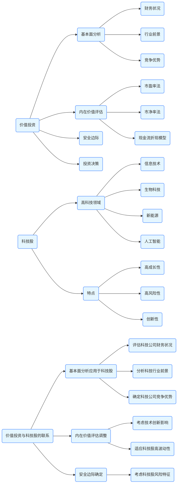

# 价值投资在科技股中的应用

> 关键词：价值投资、科技股、内在价值、财务分析、成长潜力

> 摘要：本文深入探讨了价值投资在科技股领域的应用。首先介绍了价值投资的背景知识以及在科技股中应用的重要性和适用范围。详细阐述了核心概念，包括价值投资和科技股的定义、特点以及二者之间的联系。通过具体的Python代码展示了核心算法原理和操作步骤，如如何利用财务数据计算科技股的内在价值。运用数学模型和公式对价值评估进行了理论分析，并举例说明。通过实际的项目实战案例，从开发环境搭建到源代码实现和解读，让读者更清晰地了解价值投资在科技股中的具体应用。分析了价值投资在科技股中的实际应用场景，推荐了相关的学习资源、开发工具框架和论文著作。最后总结了价值投资在科技股中的未来发展趋势与挑战，并提供了常见问题解答和扩展阅读参考资料，旨在为投资者和相关从业者提供全面且深入的指导。

## 1. 背景介绍 
### 1.1 目的和范围
价值投资作为一种经典的投资策略，强调通过分析股票的内在价值来寻找被低估的投资机会。科技股在当今经济中占据着越来越重要的地位，其快速发展和高增长潜力吸引了众多投资者的关注。然而，科技行业的特殊性使得传统的价值投资方法在应用时需要做出相应的调整。本文的目的在于探讨如何将价值投资理念有效地应用于科技股投资中，为投资者提供一套科学、实用的投资分析方法。范围涵盖了科技股的基本特点、价值评估方法、投资决策过程以及实际应用案例等方面。

### 1.2 预期读者
本文预期读者包括对科技股投资感兴趣的个人投资者、专业投资机构的分析师和基金经理、金融领域的研究人员以及相关专业的学生。对于个人投资者，本文可以帮助他们建立科学的投资理念，提高投资决策的准确性；对于专业人士，本文提供了深入的理论分析和实践经验，有助于他们优化投资策略；对于研究人员和学生，本文可以作为学习和研究价值投资在科技股应用的参考资料。

### 1.3 文档结构概述
本文共分为十个部分。第一部分为背景介绍，阐述了文章的目的、范围、预期读者和文档结构。第二部分介绍了价值投资和科技股的核心概念以及它们之间的联系，并通过文本示意图和Mermaid流程图进行展示。第三部分详细讲解了核心算法原理，并用Python代码实现了具体的操作步骤。第四部分运用数学模型和公式对价值评估进行了理论分析，并举例说明。第五部分通过实际的项目实战案例，展示了如何在科技股投资中应用价值投资方法，包括开发环境搭建、源代码实现和代码解读。第六部分分析了价值投资在科技股中的实际应用场景。第七部分推荐了相关的学习资源、开发工具框架和论文著作。第八部分总结了价值投资在科技股中的未来发展趋势与挑战。第九部分提供了常见问题解答。第十部分列出了扩展阅读参考资料。

### 1.4 术语表
#### 1.4.1 核心术语定义
- **价值投资**：一种基于对股票内在价值的评估，寻找被市场低估的股票进行投资的策略。投资者通过分析公司的财务状况、行业前景等因素，确定股票的合理价值，并在价格低于内在价值时买入，等待价格回归价值时获利。
- **科技股**：指那些从事高科技领域研发、生产和销售的公司所发行的股票。科技股通常具有高成长性、高风险性和创新性等特点，涉及的行业包括信息技术、生物科技、新能源等。
- **内在价值**：指股票所代表的公司的真实价值，是基于公司的基本面因素，如盈利能力、资产状况、现金流等，通过一定的估值方法计算得出的价值。

#### 1.4.2 相关概念解释
- **市盈率（PE）**：指股票价格与每股收益的比率，反映了市场对公司盈利的预期。市盈率越高，说明市场对公司的未来盈利增长越乐观；反之，则越悲观。
- **市净率（PB）**：指股票价格与每股净资产的比率，反映了市场对公司净资产的估值。市净率越低，说明股票的价格相对净资产越便宜，投资价值可能越高。
- **现金流折现模型（DCF）**：一种常用的估值方法，通过预测公司未来的现金流，并将其折现到当前时刻，得到公司的内在价值。该模型考虑了货币的时间价值和公司的未来发展潜力。

#### 1.4.3 缩略词列表
- **PE**：Price-to-Earnings Ratio，市盈率
- **PB**：Price-to-Book Ratio，市净率
- **DCF**：Discounted Cash Flow，现金流折现模型

## 2. 核心概念与联系 

### 价值投资的概念
价值投资是由本杰明·格雷厄姆（Benjamin Graham）在20世纪30年代提出的一种投资理念。其核心思想是通过对公司的基本面进行深入分析，评估其内在价值，并在股票价格低于内在价值时买入，等待价格回归价值时卖出，从而获得投资收益。价值投资强调安全边际，即买入价格与内在价值之间的差距，以降低投资风险。

### 科技股的概念
科技股是指那些从事高科技领域研发、生产和销售的公司所发行的股票。科技行业具有快速发展、创新驱动、高成长性等特点，科技股的表现也往往受到技术创新、市场需求、政策环境等因素的影响。科技股通常包括信息技术、生物科技、新能源、人工智能等领域的公司。

### 价值投资与科技股的联系
虽然科技股具有高风险性和不确定性，但价值投资理念仍然可以应用于科技股投资中。通过对科技公司的基本面进行分析，如财务状况、研发能力、市场竞争力等，可以评估其内在价值。同时，考虑科技行业的特点，如技术创新速度、行业竞争格局等，对传统的价值投资方法进行适当调整。例如，在评估科技公司的未来现金流时，需要考虑技术变革对公司业务的影响；在确定安全边际时，需要考虑科技股的高波动性。

### 文本示意图
```plaintext
价值投资
|
|-- 基本面分析
|   |-- 财务状况
|   |-- 行业前景
|   |-- 竞争优势
|
|-- 内在价值评估
|   |-- 市盈率法
|   |-- 市净率法
|   |-- 现金流折现模型
|
|-- 安全边际
|
|-- 投资决策

科技股
|
|-- 高科技领域
|   |-- 信息技术
|   |-- 生物科技
|   |-- 新能源
|   |-- 人工智能
|
|-- 特点
|   |-- 高成长性
|   |-- 高风险性
|   |-- 创新性

价值投资与科技股的联系
|
|-- 基本面分析应用于科技股
|   |-- 评估科技公司财务状况
|   |-- 分析科技行业前景
|   |-- 确定科技公司竞争优势
|
|-- 内在价值评估调整
|   |-- 考虑技术创新影响
|   |-- 适应科技股高波动性
|
|-- 安全边际确定
|   |-- 考虑科技股风险特征
```

### Mermaid流程图


## 3. 核心算法原理 & 具体操作步骤 

### 市盈率法原理
市盈率（PE）是最常用的估值指标之一，其计算公式为：
$$PE = \frac{股票价格}{每股收益}$$
通过比较科技股的市盈率与同行业其他公司的市盈率，或者与历史市盈率进行对比，可以判断该股票是否被低估或高估。一般来说，市盈率较低的股票可能具有较高的投资价值。

### Python代码实现
```python
def calculate_pe(stock_price, earnings_per_share):
    """
    计算市盈率
    :param stock_price: 股票价格
    :param earnings_per_share: 每股收益
    :return: 市盈率
    """
    if earnings_per_share == 0:
        return float('inf')
    return stock_price / earnings_per_share

# 示例数据
stock_price = 50
earnings_per_share = 2

pe = calculate_pe(stock_price, earnings_per_share)
print(f"市盈率: {pe}")
```

### 市净率法原理
市净率（PB）反映了股票价格与每股净资产的关系，其计算公式为：
$$PB = \frac{股票价格}{每股净资产}$$
市净率较低的股票可能意味着其价格相对净资产较为便宜，具有一定的投资价值。但对于科技股来说，由于其资产主要以无形资产（如知识产权、研发能力等）为主，市净率的参考价值可能相对有限。

### Python代码实现
```python
def calculate_pb(stock_price, book_value_per_share):
    """
    计算市净率
    :param stock_price: 股票价格
    :param book_value_per_share: 每股净资产
    :return: 市净率
    """
    if book_value_per_share == 0:
        return float('inf')
    return stock_price / book_value_per_share

# 示例数据
stock_price = 50
book_value_per_share = 10

pb = calculate_pb(stock_price, book_value_per_share)
print(f"市净率: {pb}")
```

### 现金流折现模型原理
现金流折现模型（DCF）是一种更为复杂但也更为准确的估值方法。其基本思想是将公司未来的现金流折现到当前时刻，得到公司的内在价值。具体步骤如下：
1. 预测公司未来的自由现金流（FCF）。
2. 确定折现率（通常使用加权平均资本成本WACC）。
3. 将未来各期的自由现金流折现到当前时刻。
4. 计算公司的内在价值，即各期折现现金流之和。

### Python代码实现
```python
import numpy as np

def dcf_valuation(fcf_forecasts, discount_rate):
    """
    现金流折现模型估值
    :param fcf_forecasts: 未来自由现金流预测列表
    :param discount_rate: 折现率
    :return: 公司内在价值
    """
    n = len(fcf_forecasts)
    discounted_cash_flows = []
    for i in range(n):
        discounted_cash_flow = fcf_forecasts[i] / ((1 + discount_rate) ** (i + 1))
        discounted_cash_flows.append(discounted_cash_flow)
    intrinsic_value = np.sum(discounted_cash_flows)
    return intrinsic_value

# 示例数据
fcf_forecasts = [100, 120, 150, 180, 200]
discount_rate = 0.1

intrinsic_value = dcf_valuation(fcf_forecasts, discount_rate)
print(f"公司内在价值: {intrinsic_value}")
```

## 4. 数学模型和公式 & 详细讲解 & 举例说明 

### 市盈率法
市盈率法的基本公式为：
$$PE = \frac{P}{EPS}$$
其中，$P$ 表示股票价格，$EPS$ 表示每股收益。

例如，某科技股的股票价格为 $50$ 元，每股收益为 $2$ 元，则该股票的市盈率为：
$$PE = \frac{50}{2} = 25$$
假设同行业其他公司的平均市盈率为 $20$，则该股票的市盈率相对较高，可能被高估；反之，如果平均市盈率为 $30$，则该股票可能被低估。

### 市净率法
市净率法的基本公式为：
$$PB = \frac{P}{BVPS}$$
其中，$P$ 表示股票价格，$BVPS$ 表示每股净资产。

例如，某科技股的股票价格为 $50$ 元，每股净资产为 $10$ 元，则该股票的市净率为：
$$PB = \frac{50}{10} = 5$$
假设同行业其他公司的平均市净率为 $4$，则该股票的市净率相对较高，可能被高估；反之，如果平均市净率为 $6$，则该股票可能被低估。

### 现金流折现模型
现金流折现模型的基本公式为：
$$V = \sum_{t=1}^{n} \frac{FCF_t}{(1 + r)^t}$$
其中，$V$ 表示公司的内在价值，$FCF_t$ 表示第 $t$ 期的自由现金流，$r$ 表示折现率，$n$ 表示预测期数。

例如，假设某科技公司未来 $5$ 年的自由现金流预测分别为 $100$ 万元、$120$ 万元、$150$ 万元、$180$ 万元和 $200$ 万元，折现率为 $10\%$，则该公司的内在价值为：
$$V = \frac{100}{(1 + 0.1)^1} + \frac{120}{(1 + 0.1)^2} + \frac{150}{(1 + 0.1)^3} + \frac{180}{(1 + 0.1)^4} + \frac{200}{(1 + 0.1)^5}$$
```python
import numpy as np

fcf_forecasts = [100, 120, 150, 180, 200]
discount_rate = 0.1
n = len(fcf_forecasts)
discounted_cash_flows = []
for i in range(n):
    discounted_cash_flow = fcf_forecasts[i] / ((1 + discount_rate) ** (i + 1))
    discounted_cash_flows.append(discounted_cash_flow)
intrinsic_value = np.sum(discounted_cash_flows)
print(f"公司内在价值: {intrinsic_value}")
```
计算结果显示，该公司的内在价值约为 $536.71$ 万元。如果该公司的市场价值低于 $536.71$ 万元，则可能被低估，具有投资价值；反之，则可能被高估。

## 5. 项目实战：代码实际案例和详细解释说明 

### 5.1  开发环境搭建
为了实现价值投资在科技股中的应用，我们需要搭建一个开发环境。以下是具体步骤：

#### 安装Python
首先，确保你已经安装了Python。可以从Python官方网站（https://www.python.org/downloads/）下载适合你操作系统的Python版本，并按照安装向导进行安装。

#### 安装必要的库
我们需要安装一些Python库来进行数据处理和分析，如`pandas`、`numpy`等。可以使用`pip`命令进行安装：
```sh
pip install pandas numpy
```

#### 数据获取
可以使用金融数据接口（如Tushare）来获取科技股的财务数据和市场数据。首先，需要在Tushare官网（https://tushare.pro/）注册账号，并获取API token。然后，安装Tushare库：
```sh
pip install tushare
```

### 5.2  源代码详细实现和代码解读
以下是一个完整的Python代码示例，用于计算科技股的市盈率、市净率和内在价值：

```python
import tushare as ts
import pandas as pd
import numpy as np

# 设置Tushare API token
ts.set_token('your_token')
pro = ts.pro_api()

def get_stock_data(ts_code, start_date, end_date):
    """
    获取股票的财务数据和市场数据
    :param ts_code: 股票代码
    :param start_date: 开始日期
    :param end_date: 结束日期
    :return: 股票数据DataFrame
    """
    # 获取日线行情数据
    daily_data = pro.daily(ts_code=ts_code, start_date=start_date, end_date=end_date)
    # 获取财务数据
    income_data = pro.income(ts_code=ts_code, start_date=start_date, end_date=end_date)
    balance_data = pro.balancesheet(ts_code=ts_code, start_date=start_date, end_date=end_date)

    # 合并数据
    merged_data = pd.merge(daily_data, income_data, on='ts_code', how='left')
    merged_data = pd.merge(merged_data, balance_data, on='ts_code', how='left')

    return merged_data

def calculate_pe(stock_price, earnings_per_share):
    """
    计算市盈率
    :param stock_price: 股票价格
    :param earnings_per_share: 每股收益
    :return: 市盈率
    """
    if earnings_per_share == 0:
        return float('inf')
    return stock_price / earnings_per_share

def calculate_pb(stock_price, book_value_per_share):
    """
    计算市净率
    :param stock_price: 股票价格
    :param book_value_per_share: 每股净资产
    :return: 市净率
    """
    if book_value_per_share == 0:
        return float('inf')
    return stock_price / book_value_per_share

def dcf_valuation(fcf_forecasts, discount_rate):
    """
    现金流折现模型估值
    :param fcf_forecasts: 未来自由现金流预测列表
    :param discount_rate: 折现率
    :return: 公司内在价值
    """
    n = len(fcf_forecasts)
    discounted_cash_flows = []
    for i in range(n):
        discounted_cash_flow = fcf_forecasts[i] / ((1 + discount_rate) ** (i + 1))
        discounted_cash_flows.append(discounted_cash_flow)
    intrinsic_value = np.sum(discounted_cash_flows)
    return intrinsic_value

# 示例数据
ts_code = '000001.SZ'
start_date = '20200101'
end_date = '20231231'

# 获取股票数据
stock_data = get_stock_data(ts_code, start_date, end_date)

# 计算市盈率和市净率
stock_price = stock_data['close'].iloc[0]
earnings_per_share = stock_data['eps'].iloc[0]
book_value_per_share = stock_data['bps'].iloc[0]

pe = calculate_pe(stock_price, earnings_per_share)
pb = calculate_pb(stock_price, book_value_per_share)

print(f"市盈率: {pe}")
print(f"市净率: {pb}")

# 假设未来自由现金流预测和折现率
fcf_forecasts = [100, 120, 150, 180, 200]
discount_rate = 0.1

# 计算内在价值
intrinsic_value = dcf_valuation(fcf_forecasts, discount_rate)
print(f"公司内在价值: {intrinsic_value}")
```

### 5.3  代码解读与分析
- **`get_stock_data`函数**：该函数用于获取指定股票在指定日期范围内的财务数据和市场数据。使用Tushare的`pro.daily`、`pro.income`和`pro.balancesheet`接口分别获取日线行情数据、利润表数据和资产负债表数据，并将它们合并成一个DataFrame。
- **`calculate_pe`函数**：该函数用于计算股票的市盈率。根据市盈率的计算公式，将股票价格除以每股收益得到市盈率。如果每股收益为 $0$，则返回无穷大。
- **`calculate_pb`函数**：该函数用于计算股票的市净率。根据市净率的计算公式，将股票价格除以每股净资产得到市净率。如果每股净资产为 $0$，则返回无穷大。
- **`dcf_valuation`函数**：该函数用于使用现金流折现模型计算公司的内在价值。根据现金流折现模型的公式，将未来各期的自由现金流折现到当前时刻，并求和得到公司的内在价值。
- **主程序**：首先设置Tushare API token，并调用`get_stock_data`函数获取股票数据。然后，从数据中提取股票价格、每股收益和每股净资产，调用`calculate_pe`和`calculate_pb`函数计算市盈率和市净率。最后，假设未来自由现金流预测和折现率，调用`dcf_valuation`函数计算公司的内在价值，并输出结果。

## 6. 实际应用场景 
### 个人投资者
对于个人投资者来说，价值投资在科技股中的应用可以帮助他们做出更明智的投资决策。通过分析科技股的内在价值，个人投资者可以筛选出被低估的股票，避免盲目跟风投资。例如，个人投资者可以使用市盈率、市净率等指标对科技股进行初步筛选，然后结合现金流折现模型等方法对感兴趣的股票进行深入估值。同时，个人投资者还可以关注科技公司的基本面因素，如研发能力、市场竞争力等，以评估其未来的发展潜力。

### 专业投资机构
专业投资机构如基金公司、证券公司等，通常会运用价值投资理念对科技股进行投资组合管理。投资机构的分析师会对大量的科技股进行研究和分析，建立投资模型和数据库，以寻找具有投资价值的股票。在构建投资组合时，投资机构会考虑科技股的风险和收益特征，以及与其他资产的相关性，以实现投资组合的优化。例如，投资机构可能会根据科技股的估值水平、行业前景等因素，调整投资组合中科技股的权重。

### 公司战略决策
对于科技公司自身来说，价值投资理念也具有重要的指导意义。公司管理层可以通过分析自身的内在价值，评估公司的经营状况和发展潜力，制定合理的战略决策。例如，公司可以根据现金流折现模型评估新的研发项目或投资计划的可行性，以确保公司的资源得到合理配置。同时，公司管理层还可以关注市场对公司的估值，通过提高公司的盈利能力、创新能力等方式，提升公司的内在价值，从而获得市场的认可。

## 7. 工具和资源推荐
### 7.1 学习资源推荐
#### 7.1.1 书籍推荐
- 《聪明的投资者》（The Intelligent Investor）：本杰明·格雷厄姆著，被誉为价值投资的圣经，详细阐述了价值投资的理念和方法。
- 《证券分析》（Security Analysis）：本杰明·格雷厄姆和大卫·多德著，是价值投资领域的经典著作，对证券估值和投资分析进行了系统的论述。
- 《巴菲特致股东的信》（Letters to Shareholders of Berkshire Hathaway）：沃伦·巴菲特著，收录了巴菲特多年来致股东的信，展示了他的投资理念和决策过程。
- 《创新者的窘境》（The Innovator's Dilemma）：克莱顿·克里斯坦森著，探讨了科技行业的创新规律和企业面临的挑战，对理解科技股的投资具有重要的参考价值。

#### 7.1.2 在线课程
- Coursera上的“投资学原理”（Principles of Investing）课程：由哥伦比亚大学教授授课，系统介绍了投资学的基本原理和方法，包括价值投资、风险评估等内容。
- edX上的“金融市场”（Financial Markets）课程：由耶鲁大学教授授课，涵盖了金融市场的各个方面，包括股票市场、债券市场等，对理解科技股的投资环境具有重要的帮助。
- 中国大学MOOC上的“证券投资学”课程：由国内高校教授授课，结合中国市场的实际情况，介绍了证券投资的理论和实践，包括价值投资在A股市场的应用。

#### 7.1.3 技术博客和网站
- Seeking Alpha（https://seekingalpha.com/）：一个知名的金融投资博客平台，提供了大量关于科技股的分析和评论文章，以及专业投资者的观点和建议。
- Morningstar（https://www.morningstar.com/）：提供了丰富的金融数据和研究报告，包括科技股的估值分析、行业研究等内容，对投资者进行价值投资分析具有重要的参考价值。
- 雪球（https://xueqiu.com/）：国内知名的投资社区，聚集了大量的投资者和投资专家，提供了科技股的讨论、分析和交流平台，投资者可以在这里获取最新的市场信息和投资策略。

### 7.2 开发工具框架推荐
#### 7.2.1 IDE和编辑器
- PyCharm：一款专业的Python集成开发环境，具有强大的代码编辑、调试和分析功能，适合进行价值投资相关的数据分析和算法实现。
- Jupyter Notebook：一个交互式的开发环境，支持Python、R等多种编程语言，适合进行数据探索和可视化分析，方便投资者对科技股的财务数据进行分析和展示。
- Visual Studio Code：一款轻量级的代码编辑器，具有丰富的插件和扩展功能，支持Python开发，适合快速编写和调试价值投资相关的代码。

#### 7.2.2 调试和性能分析工具
- pdb：Python自带的调试器，可以帮助开发者在代码运行过程中进行调试，定位和解决问题。
- cProfile：Python的性能分析工具，可以帮助开发者分析代码的运行时间和资源消耗情况，优化代码性能。
- Spyder：一款集成了调试和性能分析功能的Python开发环境，适合初学者进行代码调试和性能优化。

#### 7.2.3 相关框架和库
- pandas：一个强大的数据处理和分析库，提供了高效的数据结构和数据操作方法，适合处理科技股的财务数据和市场数据。
- numpy：一个用于科学计算的Python库，提供了高效的数组操作和数学函数，在价值投资的算法实现中经常使用。
- scikit-learn：一个机器学习库，提供了丰富的机器学习算法和工具，可用于对科技股的未来走势进行预测和分析。

### 7.3 相关论文著作推荐
#### 7.3.1 经典论文
- Fama, E. F., & French, K. R. (1992). The cross-section of expected stock returns. The Journal of Finance, 47(2), 427-465. 该论文提出了著名的Fama-French三因子模型，对股票的预期收益率进行了深入分析，为价值投资提供了理论基础。
- Sharpe, W. F. (1964). Capital asset prices: A theory of market equilibrium under conditions of risk. The Journal of Finance, 19(3), 425-442. 该论文提出了资本资产定价模型（CAPM），用于描述资产的预期收益率与风险之间的关系，对价值投资的风险评估具有重要的参考价值。

#### 7.3.2 最新研究成果
- 关注顶级金融学术期刊，如The Journal of Finance、The Review of Financial Studies等，这些期刊上发表了许多关于价值投资和科技股的最新研究成果。
- 参加金融学术会议，如美国金融协会（AFA）年会、西部金融协会（WFA）年会等，与国内外的专家学者交流最新的研究动态。

#### 7.3.3 应用案例分析
- 研究国内外知名投资机构的投资报告和案例分析，了解他们在科技股投资中如何应用价值投资理念和方法。
- 分析一些成功的科技股投资案例，如巴菲特投资苹果公司的案例，总结其投资决策的思路和方法，为自己的投资实践提供参考。

## 8. 总结：未来发展趋势与挑战
### 未来发展趋势
- **科技行业的持续创新**：科技行业是一个充满创新活力的行业，未来将不断涌现出新的技术和商业模式。价值投资者需要关注科技行业的创新趋势，挖掘具有潜力的科技公司。例如，人工智能、区块链、量子计算等新兴技术的发展，将为科技股投资带来新的机遇。
- **数据驱动的投资决策**：随着大数据、人工智能等技术的发展，价值投资将越来越依赖于数据驱动的决策。投资者可以利用数据分析工具和算法，对科技股的财务数据、市场数据等进行深入分析，提高投资决策的准确性和效率。
- **全球化投资**：科技行业具有全球化的特点，价值投资者可以将投资视野拓展到全球市场，寻找具有投资价值的科技股。同时，随着中国科技行业的崛起，中国市场也将吸引越来越多的全球投资者。

### 挑战
- **技术变革的不确定性**：科技行业的技术变革速度非常快，新技术的出现可能会导致现有科技公司的竞争优势丧失。价值投资者需要准确判断技术变革的趋势，评估科技公司的技术创新能力和应对变革的能力，这对投资者的专业知识和判断力提出了很高的要求。
- **估值的困难性**：科技股的估值相对传统行业更加困难，因为科技公司的资产主要以无形资产为主，如知识产权、研发能力等，这些资产的价值难以准确评估。同时，科技公司的未来发展具有很大的不确定性，现金流预测也存在较大的误差，这增加了价值投资的难度。
- **市场情绪的影响**：科技股市场往往受到市场情绪的影响较大，投资者的情绪波动可能导致股票价格的大幅波动。价值投资者需要保持冷静和理性，不受市场情绪的干扰，坚持基于公司内在价值进行投资决策。

## 9. 附录：常见问题与解答
### 问题1：价值投资是否适用于所有科技股？
答：价值投资并不适用于所有科技股。科技行业具有高风险性和不确定性，一些处于初创阶段、尚未盈利的科技公司可能难以用传统的价值投资方法进行估值。价值投资更适合那些具有稳定盈利能力、良好财务状况和竞争优势的成熟科技公司。

### 问题2：如何准确预测科技公司的未来现金流？
答：预测科技公司的未来现金流是一项具有挑战性的任务。可以从以下几个方面入手：一是分析公司的历史财务数据，了解其盈利能力和现金流状况的变化趋势；二是研究公司所处的行业前景和市场需求，评估公司的业务增长潜力；三是关注公司的研发投入和创新能力，判断其未来的产品和服务竞争力。同时，要采用多种预测方法，并进行敏感性分析，以降低预测误差。

### 问题3：科技股的市盈率和市净率应该如何合理运用？
答：市盈率和市净率是常用的估值指标，但在运用时需要结合科技行业的特点进行分析。市盈率可以反映市场对公司盈利的预期，但对于科技股来说，由于其盈利增长的不确定性较大，市盈率可能会出现较大波动。市净率可以反映公司的净资产价值，但科技公司的资产主要以无形资产为主，市净率的参考价值相对有限。因此，在运用市盈率和市净率时，需要与同行业其他公司进行对比，并结合公司的基本面因素进行综合分析。

### 问题4：价值投资在科技股投资中如何控制风险？
答：价值投资在科技股投资中可以通过以下方式控制风险：一是选择具有稳定盈利能力和良好财务状况的科技公司进行投资，降低公司基本面风险；二是分散投资，避免过度集中在某一只或某几只科技股上，降低个股风险；三是设置合理的止损点，当股票价格下跌到一定程度时及时止损，控制损失；四是关注市场动态和行业变化，及时调整投资组合，降低系统性风险。

## 10. 扩展阅读 & 参考资料
- 格雷厄姆, B., & 多德, D. (2009). 证券分析. 海南出版社.
- 巴菲特, W. (2017). 巴菲特致股东的信. 机械工业出版社.
- 克里斯坦森, C. M. (2014). 创新者的窘境. 中信出版社.
- Fama, E. F., & French, K. R. (1992). The cross-section of expected stock returns. The Journal of Finance, 47(2), 427-465.
- Sharpe, W. F. (1964). Capital asset prices: A theory of market equilibrium under conditions of risk. The Journal of Finance, 19(3), 425-442.
- Seeking Alpha（https://seekingalpha.com/）
- Morningstar（https://www.morningstar.com/）
- 雪球（https://xueqiu.com/）

作者：AI天才研究院/AI Genius Institute & 禅与计算机程序设计艺术 /Zen And The Art of Computer Programming