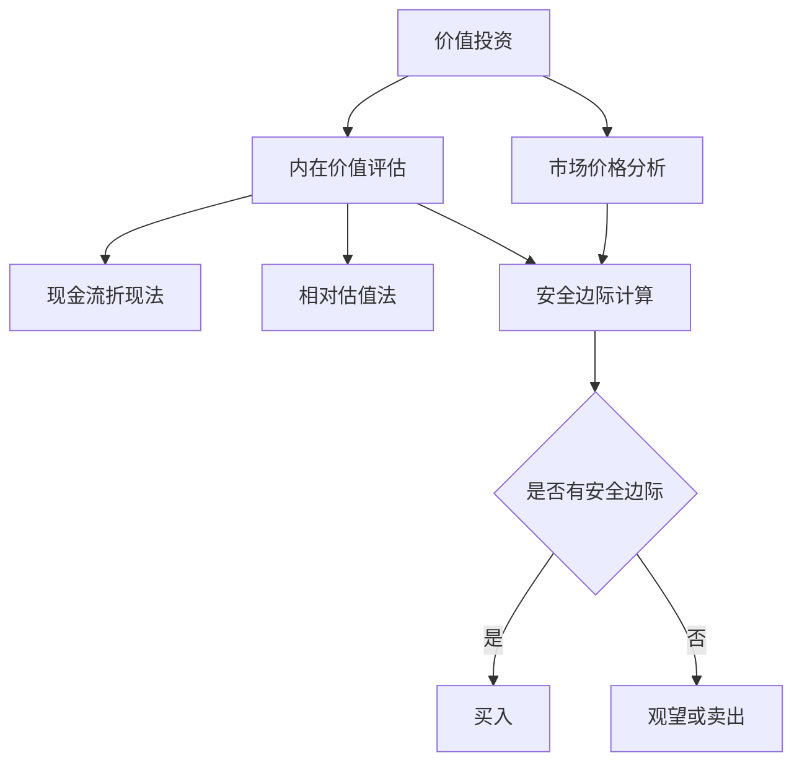

# 价值投资的核心原则：安全边际

> 关键词：价值投资、安全边际、投资原则、估值方法、风险控制

> 摘要：本文围绕价值投资的核心原则——安全边际展开深入探讨。首先介绍了价值投资及安全边际的背景知识，包括目的、预期读者等。接着阐述了安全边际的核心概念及其与价值投资的联系，通过文本示意图和 Mermaid 流程图进行直观展示。详细讲解了计算安全边际涉及的核心算法原理，并给出 Python 代码示例。同时，给出了相关的数学模型和公式，并举例说明。通过项目实战部分，展示了在实际投资中如何运用安全边际原则，包括开发环境搭建、源代码实现与解读。分析了安全边际在不同场景下的实际应用，推荐了学习、开发工具及相关论文著作。最后总结了安全边际在价值投资中的重要性以及未来面临的发展趋势与挑战，还提供了常见问题解答和扩展阅读参考资料，旨在帮助投资者更好地理解和运用安全边际原则进行价值投资。

## 1. 背景介绍 
### 1.1 目的和范围
价值投资作为一种被广泛认可的投资理念，强调寻找被低估的资产并长期持有以获取收益。而安全边际则是价值投资中至关重要的核心原则，它为投资者提供了一种保护机制，降低投资风险。本文的目的在于全面深入地探讨安全边际这一原则，涵盖其概念、原理、计算方法、实际应用等方面。范围包括理论层面的阐述，如核心概念的解释、数学模型的推导，以及实践层面的分析，如项目实战案例和实际应用场景的介绍。

### 1.2 预期读者
本文预期读者主要包括对价值投资感兴趣的投资者，无论是个人投资者还是专业投资机构从业者。同时，对于金融专业的学生、研究人员以及对投资理论有深入研究需求的人士也具有一定的参考价值。通过阅读本文，读者可以系统地了解安全边际原则，掌握其在价值投资中的应用方法和技巧。

### 1.3 文档结构概述
本文将按照以下结构进行阐述：首先介绍相关背景知识，包括目的、预期读者和文档结构概述；接着深入讲解安全边际的核心概念与联系，通过示意图和流程图进行直观展示；然后详细介绍核心算法原理和具体操作步骤，并给出 Python 代码示例；随后阐述数学模型和公式，并举例说明；通过项目实战部分展示安全边际在实际投资中的应用；分析实际应用场景；推荐学习、开发工具及相关论文著作；最后总结安全边际在价值投资中的重要性以及未来面临的发展趋势与挑战，并提供常见问题解答和扩展阅读参考资料。

### 1.4 术语表
#### 1.4.1 核心术语定义
- **价值投资**：一种投资策略，投资者通过分析资产的内在价值，寻找被市场低估的资产进行投资，期望在资产价格回归其内在价值时获得收益。
- **安全边际**：指股票的市场价格低于其内在价值的幅度。安全边际为投资者提供了一定的缓冲空间，降低了投资损失的风险。
- **内在价值**：资产的真实价值，是基于资产未来预期现金流的现值计算得出的。

#### 1.4.2 相关概念解释
- **现金流折现法**：一种计算资产内在价值的方法，通过预测资产未来的现金流，并将其折现到当前时点，得到资产的内在价值。
- **市盈率（PE）**：股票价格与每股收益的比率，反映了市场对公司盈利的预期。
- **市净率（PB）**：股票价格与每股净资产的比率，反映了市场对公司净资产的估值。

#### 1.4.3 缩略词列表
- **DCF**：Discounted Cash Flow，现金流折现法
- **PE**：Price-to-Earnings Ratio，市盈率
- **PB**：Price-to-Book Ratio，市净率

## 2. 核心概念与联系 
### 核心概念原理
安全边际是价值投资的核心原则之一，其原理基于对资产内在价值的评估和市场价格的比较。内在价值是资产未来预期现金流的现值，它反映了资产的真实价值。而市场价格则受到多种因素的影响，如市场情绪、宏观经济环境等，可能会偏离资产的内在价值。当市场价格低于内在价值时，就存在安全边际。

投资者通过寻找具有安全边际的资产进行投资，可以在一定程度上降低投资风险。因为即使市场价格继续下跌，由于存在安全边际，投资者的损失也会相对较小。同时，当市场价格回归到内在价值时，投资者可以获得收益。

### 架构的文本示意图
```plaintext
价值投资
|
|-- 内在价值评估
|   |-- 现金流折现法
|   |-- 相对估值法（PE、PB等）
|
|-- 市场价格分析
|
|-- 安全边际计算
|   |-- 内在价值 - 市场价格
|
|-- 投资决策
|   |-- 有安全边际：买入
|   |-- 无安全边际：观望或卖出
```

### Mermaid 流程图


## 3. 核心算法原理 & 具体操作步骤 
### 核心算法原理
计算安全边际的关键在于准确评估资产的内在价值。常用的方法有现金流折现法（DCF）和相对估值法。

#### 现金流折现法（DCF）
现金流折现法的基本原理是将资产未来的现金流折现到当前时点，得到资产的内在价值。其公式为：
$$V = \sum_{t=1}^{n} \frac{CF_t}{(1 + r)^t}$$
其中，$V$ 表示资产的内在价值，$CF_t$ 表示第 $t$ 期的现金流，$r$ 表示折现率，$n$ 表示现金流的期数。

#### 相对估值法
相对估值法是通过比较类似资产的估值指标来评估目标资产的价值。常用的估值指标有市盈率（PE）和市净率（PB）。

- 市盈率法：$V = EPS \times PE$，其中 $V$ 表示资产的内在价值，$EPS$ 表示每股收益，$PE$ 表示市盈率。
- 市净率法：$V = BVPS \times PB$，其中 $V$ 表示资产的内在价值，$BVPS$ 表示每股净资产，$PB$ 表示市净率。

### 具体操作步骤
1. **收集数据**：收集资产的财务数据，如现金流、每股收益、每股净资产等，以及市场数据，如类似资产的市盈率、市净率等。
2. **选择估值方法**：根据资产的特点和数据的可用性，选择合适的估值方法，如现金流折现法或相对估值法。
3. **计算内在价值**：使用选定的估值方法计算资产的内在价值。
4. **获取市场价格**：获取资产的当前市场价格。
5. **计算安全边际**：安全边际 = 内在价值 - 市场价格。
6. **投资决策**：如果安全边际为正，说明资产被低估，可以考虑买入；如果安全边际为负，说明资产被高估，建议观望或卖出。

### Python 代码示例
```python
import numpy as np

# 现金流折现法计算内在价值
def dcf_valuation(cash_flows, discount_rate):
    n = len(cash_flows)
    present_values = []
    for t in range(n):
        pv = cash_flows[t] / ((1 + discount_rate) ** (t + 1))
        present_values.append(pv)
    return sum(present_values)

# 相对估值法 - 市盈率法
def pe_valuation(eps, pe_ratio):
    return eps * pe_ratio

# 相对估值法 - 市净率法
def pb_valuation(bvps, pb_ratio):
    return bvps * pb_ratio

# 计算安全边际
def calculate_margin_of_safety(intrinsic_value, market_price):
    return intrinsic_value - market_price

# 示例数据
cash_flows = [100, 120, 150, 180, 200]
discount_rate = 0.1
eps = 5
pe_ratio = 15
bvps = 20
pb_ratio = 2
market_price = 60

# 计算内在价值
dcf_value = dcf_valuation(cash_flows, discount_rate)
pe_value = pe_valuation(eps, pe_ratio)
pb_value = pb_valuation(bvps, pb_ratio)

# 计算安全边际
dcf_margin = calculate_margin_of_safety(dcf_value, market_price)
pe_margin = calculate_margin_of_safety(pe_value, market_price)
pb_margin = calculate_margin_of_safety(pb_value, market_price)

print(f"现金流折现法内在价值: {dcf_value}")
print(f"市盈率法内在价值: {pe_value}")
print(f"市净率法内在价值: {pb_value}")
print(f"现金流折现法安全边际: {dcf_margin}")
print(f"市盈率法安全边际: {pe_margin}")
print(f"市净率法安全边际: {pb_margin}")
```

## 4. 数学模型和公式 & 详细讲解 & 举例说明 
### 现金流折现法（DCF）
#### 数学模型和公式
$$V = \sum_{t=1}^{n} \frac{CF_t}{(1 + r)^t}$$
其中，$V$ 表示资产的内在价值，$CF_t$ 表示第 $t$ 期的现金流，$r$ 表示折现率，$n$ 表示现金流的期数。

#### 详细讲解
现金流折现法的核心思想是将资产未来的现金流折现到当前时点，因为未来的现金流具有不确定性，而且货币具有时间价值。折现率 $r$ 反映了投资者对资金时间价值和风险的要求。

#### 举例说明
假设某公司未来 5 年的现金流分别为 100 万元、120 万元、150 万元、180 万元和 200 万元，折现率为 10%。则该公司的内在价值为：

$$
\begin{align*}
V &= \frac{100}{(1 + 0.1)^1} + \frac{120}{(1 + 0.1)^2} + \frac{150}{(1 + 0.1)^3} + \frac{180}{(1 + 0.1)^4} + \frac{200}{(1 + 0.1)^5}\\
&= \frac{100}{1.1} + \frac{120}{1.21} + \frac{150}{1.331} + \frac{180}{1.4641} + \frac{200}{1.61051}\\
&\approx 90.91 + 99.17 + 112.69 + 122.94 + 124.18\\
&\approx 549.89
\end{align*}
$$

### 相对估值法
#### 市盈率法
##### 数学模型和公式
$V = EPS \times PE$，其中 $V$ 表示资产的内在价值，$EPS$ 表示每股收益，$PE$ 表示市盈率。

##### 详细讲解
市盈率法是通过比较目标公司的每股收益和类似公司的市盈率来评估目标公司的价值。市盈率反映了市场对公司盈利的预期。

##### 举例说明
假设某公司的每股收益为 5 元，类似公司的平均市盈率为 15。则该公司的内在价值为：
$V = 5 \times 15 = 75$（元）

#### 市净率法
##### 数学模型和公式
$V = BVPS \times PB$，其中 $V$ 表示资产的内在价值，$BVPS$ 表示每股净资产，$PB$ 表示市净率。

##### 详细讲解
市净率法是通过比较目标公司的每股净资产和类似公司的市净率来评估目标公司的价值。市净率反映了市场对公司净资产的估值。

##### 举例说明
假设某公司的每股净资产为 20 元，类似公司的平均市净率为 2。则该公司的内在价值为：
$V = 20 \times 2 = 40$（元）

## 5. 项目实战：代码实际案例和详细解释说明 
### 5.1  开发环境搭建
为了实现安全边际的计算，我们可以使用 Python 编程语言。以下是开发环境搭建的步骤：

1. **安装 Python**：从 Python 官方网站（https://www.python.org/downloads/）下载并安装 Python 3.x 版本。
2. **安装必要的库**：我们需要使用 `numpy` 库进行数值计算。可以使用以下命令安装：
```sh
pip install numpy
```
3. **选择开发工具**：可以选择使用 PyCharm、Jupyter Notebook 等开发工具。这里我们以 Jupyter Notebook 为例，安装方法如下：
```sh
pip install jupyter
```
启动 Jupyter Notebook：
```sh
jupyter notebook
```

### 5.2  源代码详细实现和代码解读
```python
import numpy as np

# 现金流折现法计算内在价值
def dcf_valuation(cash_flows, discount_rate):
    n = len(cash_flows)
    present_values = []
    for t in range(n):
        pv = cash_flows[t] / ((1 + discount_rate) ** (t + 1))
        present_values.append(pv)
    return sum(present_values)

# 相对估值法 - 市盈率法
def pe_valuation(eps, pe_ratio):
    return eps * pe_ratio

# 相对估值法 - 市净率法
def pb_valuation(bvps, pb_ratio):
    return bvps * pb_ratio

# 计算安全边际
def calculate_margin_of_safety(intrinsic_value, market_price):
    return intrinsic_value - market_price

# 示例数据
cash_flows = [100, 120, 150, 180, 200]
discount_rate = 0.1
eps = 5
pe_ratio = 15
bvps = 20
pb_ratio = 2
market_price = 60

# 计算内在价值
dcf_value = dcf_valuation(cash_flows, discount_rate)
pe_value = pe_valuation(eps, pe_ratio)
pb_value = pb_valuation(bvps, pb_ratio)

# 计算安全边际
dcf_margin = calculate_margin_of_safety(dcf_value, market_price)
pe_margin = calculate_margin_of_safety(pe_value, market_price)
pb_margin = calculate_margin_of_safety(pb_value, market_price)

print(f"现金流折现法内在价值: {dcf_value}")
print(f"市盈率法内在价值: {pe_value}")
print(f"市净率法内在价值: {pb_value}")
print(f"现金流折现法安全边际: {dcf_margin}")
print(f"市盈率法安全边际: {pe_margin}")
print(f"市净率法安全边际: {pb_margin}")
```

#### 代码解读
1. **导入库**：导入 `numpy` 库用于数值计算。
2. **定义函数**：
    - `dcf_valuation`：使用现金流折现法计算资产的内在价值。
    - `pe_valuation`：使用市盈率法计算资产的内在价值。
    - `pb_valuation`：使用市净率法计算资产的内在价值。
    - `calculate_margin_of_safety`：计算安全边际。
3. **示例数据**：定义了现金流、折现率、每股收益、市盈率、每股净资产、市净率和市场价格等示例数据。
4. **计算内在价值**：分别使用三种方法计算资产的内在价值。
5. **计算安全边际**：根据内在价值和市场价格计算安全边际。
6. **输出结果**：打印出三种方法计算的内在价值和安全边际。

### 5.3  代码解读与分析
通过上述代码，我们可以看到如何使用不同的方法计算资产的内在价值和安全边际。现金流折现法考虑了资产未来的现金流和资金的时间价值，相对估值法则通过比较类似资产的估值指标来评估目标资产的价值。

在实际应用中，我们可以根据资产的特点和数据的可用性选择合适的方法。同时，安全边际的计算可以帮助我们判断资产是否被低估，从而做出合理的投资决策。

## 6. 实际应用场景 
### 股票投资
在股票投资中，安全边际原则可以帮助投资者筛选出被低估的股票。投资者可以通过计算股票的内在价值和安全边际，选择具有足够安全边际的股票进行投资。例如，当某只股票的内在价值为 80 元，而市场价格为 60 元时，安全边际为 20 元，说明该股票被低估，具有投资价值。

### 债券投资
在债券投资中，安全边际可以通过债券的票面利率、到期收益率和市场价格来计算。投资者可以选择票面利率较高、到期收益率较高且市场价格较低的债券进行投资，以获得较高的安全边际。

### 房地产投资
在房地产投资中，安全边际可以通过比较房产的租金收益、市场价值和购买价格来计算。投资者可以选择租金收益较高、市场价值较高且购买价格较低的房产进行投资，以降低投资风险。

### 企业并购
在企业并购中，安全边际原则可以帮助收购方评估目标企业的价值和风险。收购方可以通过计算目标企业的内在价值和安全边际，确定合理的收购价格，避免支付过高的收购成本。

## 7. 工具和资源推荐
### 7.1 学习资源推荐
#### 7.1.1 书籍推荐
- 《聪明的投资者》（The Intelligent Investor）：本杰明·格雷厄姆（Benjamin Graham）著，被誉为价值投资的圣经，详细介绍了价值投资的理念和方法，包括安全边际原则。
- 《证券分析》（Security Analysis）：本杰明·格雷厄姆和大卫·多德（David Dodd）著，是价值投资领域的经典著作，对资产估值和投资分析进行了深入探讨。
- 《巴菲特致股东的信：股份公司教程》（Letters to Shareholders of Berkshire Hathaway）：沃伦·巴菲特（Warren Buffett）著，通过巴菲特写给股东的信，展示了他的投资理念和方法，包括安全边际的应用。

#### 7.1.2 在线课程
- Coursera 上的“投资学原理”（Principles of Investing）课程：由宾夕法尼亚大学的教授授课，介绍了投资的基本原理和方法，包括价值投资和安全边际的概念。
- edX 上的“金融市场”（Financial Markets）课程：由耶鲁大学的教授授课，涵盖了金融市场的各个方面，包括投资分析和资产估值。

#### 7.1.3 技术博客和网站
- 雪球网（https://xueqiu.com/）：一个投资交流社区，提供了丰富的股票、基金等投资信息和分析文章，许多投资者会分享自己的投资经验和对安全边际的理解。
- 价值投资网（https://www.valueinvestorsclub.com/）：专注于价值投资领域，提供了大量的价值投资案例分析和研究报告。

### 7.2 开发工具框架推荐
#### 7.2.1 IDE和编辑器
- PyCharm：一款专业的 Python 集成开发环境，提供了丰富的代码编辑、调试和项目管理功能，适合开发复杂的投资分析程序。
- Jupyter Notebook：一个交互式的开发环境，支持 Python、R 等多种编程语言，适合进行数据分析和可视化，方便快速验证投资模型和算法。

#### 7.2.2 调试和性能分析工具
- pdb：Python 内置的调试器，可以帮助开发者定位代码中的问题和错误。
- cProfile：Python 标准库中的性能分析工具，可以分析代码的运行时间和函数调用情况，帮助优化代码性能。

#### 7.2.3 相关框架和库
- Pandas：一个强大的数据分析库，提供了高效的数据结构和数据处理功能，适合处理和分析金融数据。
- NumPy：一个用于科学计算的基础库，提供了高效的数组操作和数学函数，在投资分析中常用于数值计算和模型实现。
- Matplotlib：一个用于数据可视化的库，可以绘制各种类型的图表，帮助投资者直观地展示和分析投资数据。

### 7.3 相关论文著作推荐
#### 7.3.1 经典论文
- “The Theory of Investment Value”（投资价值理论）：约翰·伯尔·威廉姆斯（John Burr Williams）著，提出了现金流折现法的基本原理，为价值投资提供了重要的理论基础。
- “Security Analysis and Stock - Market Profits”（证券分析与股市利润）：本杰明·格雷厄姆和大卫·多德著，阐述了价值投资的基本理念和方法，包括安全边际的概念。

#### 7.3.2 最新研究成果
- 一些学术期刊如《金融研究》《经济研究》等会发表关于价值投资和安全边际的最新研究成果，投资者可以关注这些期刊获取最新的理论和实证研究。
- 一些知名高校的商学院和金融研究机构也会发布相关的研究报告和工作论文，如麻省理工学院斯隆管理学院、哈佛大学商学院等。

#### 7.3.3 应用案例分析
- 一些投资机构和咨询公司会发布关于价值投资和安全边际应用的案例分析报告，投资者可以通过这些报告了解实际应用中的经验和教训。
- 一些财经媒体如《财经》《财新》等也会报道一些成功的价值投资案例，分析其中安全边际原则的应用。

## 8. 总结：未来发展趋势与挑战
### 重要性总结
安全边际作为价值投资的核心原则，在投资领域具有重要的地位。它为投资者提供了一种有效的风险控制手段，帮助投资者在不确定的市场环境中降低投资损失的风险。通过寻找具有安全边际的资产进行投资，投资者可以在资产价格回归其内在价值时获得收益，实现长期的投资目标。

### 未来发展趋势
- **数据驱动的分析**：随着大数据和人工智能技术的发展，投资者将能够获取更多的金融数据，并利用先进的数据分析方法进行资产估值和安全边际的计算。例如，机器学习算法可以用于预测资产的未来现金流和折现率，提高估值的准确性。
- **跨市场和跨资产类别的应用**：安全边际原则将不仅仅应用于股票市场，还将扩展到债券、房地产、大宗商品等其他市场和资产类别。投资者可以通过多元化投资，利用不同市场和资产类别的安全边际，降低投资组合的风险。
- **社会责任投资的融合**：未来，安全边际原则可能会与社会责任投资相结合。投资者在评估资产价值时，不仅会考虑财务因素，还会考虑环境、社会和治理（ESG）等因素。具有良好 ESG 表现的资产可能会被赋予更高的内在价值，从而影响安全边际的计算和投资决策。

### 挑战
- **数据质量和可靠性**：准确的资产估值和安全边际计算依赖于高质量和可靠的数据。然而，金融数据可能存在误差、缺失和滞后等问题，这会影响估值的准确性和投资决策的可靠性。
- **市场不确定性**：市场环境是复杂多变的，宏观经济因素、政策变化、行业竞争等都会影响资产的内在价值和市场价格。投资者很难准确预测未来的市场走势，这增加了安全边际计算的难度和投资决策的风险。
- **模型假设的局限性**：现有的估值模型和方法都基于一定的假设，如现金流的稳定性、折现率的确定性等。然而，在实际市场中，这些假设可能并不成立，导致估值结果与实际情况存在偏差。

## 9. 附录：常见问题与解答
### 问题 1：如何确定合适的折现率？
折现率的确定需要考虑多个因素，包括无风险利率、市场风险溢价和资产的特定风险。无风险利率通常可以参考国债收益率，市场风险溢价反映了投资者对承担市场风险的补偿要求，资产的特定风险则与资产的行业特点、财务状况等因素有关。一般来说，可以使用资本资产定价模型（CAPM）来确定折现率：
$$r = R_f + \beta \times (R_m - R_f)$$
其中，$r$ 表示折现率，$R_f$ 表示无风险利率，$\beta$ 表示资产的贝塔系数，反映了资产的系统性风险，$R_m$ 表示市场收益率。

### 问题 2：安全边际越大越好吗？
一般来说，安全边际越大，投资风险越低，投资价值越高。但是，过大的安全边际可能意味着市场对资产存在过度悲观的预期，或者资产本身存在一些潜在的问题。因此，投资者在追求安全边际的同时，还需要深入分析资产的基本面，确保安全边际是合理的。

### 问题 3：不同估值方法计算的内在价值差异较大怎么办？
不同估值方法基于不同的假设和数据，可能会导致计算的内在价值存在差异。当出现这种情况时，投资者可以综合考虑各种方法的优缺点，结合资产的特点和市场情况，对不同方法计算的结果进行加权平均或取中位数，以得到一个更合理的内在价值估计。同时，还可以进一步分析导致差异的原因，如数据的准确性、模型的适用性等。

## 10. 扩展阅读 & 参考资料
### 扩展阅读
- 《投资中最简单的事》：邱国鹭著，结合中国市场的实际情况，介绍了价值投资的理念和方法，包括安全边际的应用。
- 《怎样选择成长股》：菲利普·费雪（Philip Fisher）著，提出了成长股投资的方法和原则，与价值投资中的安全边际原则相互补充。

### 参考资料
- Benjamin Graham, David Dodd. Security Analysis. McGraw - Hill, 1934.
- John Burr Williams. The Theory of Investment Value. Harvard University Press, 1938.
- Warren Buffett. Letters to Shareholders of Berkshire Hathaway. Berkshire Hathaway Inc., various years.

作者：AI天才研究院/AI Genius Institute & 禅与计算机程序设计艺术 /Zen And The Art of Computer Programming