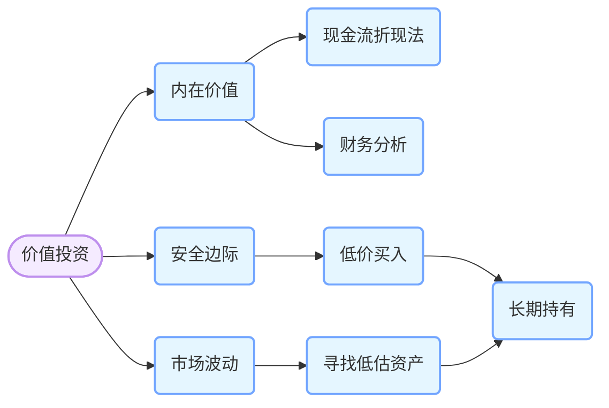

# 价值投资的核心原理解析

> 关键词：价值投资、核心原理、内在价值、安全边际、市场波动

> 摘要：本文深入剖析价值投资的核心原理，从背景介绍入手，阐述其目的、适用读者及文档结构。详细讲解价值投资的核心概念，包括内在价值、安全边际等，并通过Mermaid流程图展示其逻辑关系。用Python代码说明相关算法原理和操作步骤，借助数学模型和公式进一步阐释。通过项目实战案例展示价值投资在实际中的应用，分析其在不同场景下的作用。同时推荐学习资源、开发工具和相关论文著作。最后总结价值投资的未来发展趋势与挑战，解答常见问题，提供扩展阅读和参考资料，旨在帮助读者全面理解和应用价值投资理念。

## 1. 背景介绍 
### 1.1 目的和范围
价值投资作为一种长期有效的投资策略，旨在通过对企业内在价值的评估，寻找被市场低估的资产进行投资，以获取长期稳定的回报。本文的目的是深入解析价值投资的核心原理，帮助投资者更好地理解和运用这一策略。范围涵盖价值投资的基本概念、算法原理、数学模型、实际应用案例以及相关的学习资源和工具等方面。

### 1.2 预期读者
本文预期读者包括对价值投资感兴趣的初学者、有一定投资经验但希望深入了解价值投资原理的投资者、金融专业的学生以及从事金融分析和投资研究的专业人士。

### 1.3 文档结构概述
本文共分为十个部分。第一部分为背景介绍，阐述目的、预期读者和文档结构；第二部分讲解价值投资的核心概念与联系；第三部分介绍核心算法原理和具体操作步骤；第四部分给出数学模型和公式并详细讲解；第五部分进行项目实战，展示代码案例和详细解释；第六部分探讨实际应用场景；第七部分推荐相关的工具和资源；第八部分总结未来发展趋势与挑战；第九部分为附录，解答常见问题；第十部分提供扩展阅读和参考资料。

### 1.4 术语表
#### 1.4.1 核心术语定义
- **价值投资**：一种基于对资产内在价值的分析，寻找被低估的投资机会，以实现长期资本增值的投资策略。
- **内在价值**：资产在未来所能产生的现金流的现值总和，是价值投资的核心评估指标。
- **安全边际**：股票的市场价格低于其内在价值的部分，用于降低投资风险。
- **市场先生**：由本杰明·格雷厄姆提出的概念，将市场比喻为一个情绪不稳定的人，其报价会受到各种因素的影响而波动。

#### 1.4.2 相关概念解释
- **现金流折现法**：一种评估资产内在价值的方法，通过预测资产未来的现金流，并将其折现到当前时刻，以确定资产的合理价值。
- **市盈率（PE）**：股票价格与每股收益的比率，反映了市场对公司盈利能力的预期。
- **市净率（PB）**：股票价格与每股净资产的比率，用于衡量公司的估值水平。

#### 1.4.3 缩略词列表
- **DCF**：Discounted Cash Flow，现金流折现法
- **PE**：Price-to-Earnings Ratio，市盈率
- **PB**：Price-to-Book Ratio，市净率

## 2. 核心概念与联系 

价值投资的核心概念主要包括内在价值、安全边际和市场波动。内在价值是价值投资的基石，它是企业未来现金流的现值。安全边际则是在内在价值的基础上，为投资者提供的一种保护机制，以应对市场的不确定性。市场波动是市场先生情绪的体现，为价值投资者提供了寻找低估资产的机会。

下面是价值投资核心概念的逻辑关系示意图：



从这个流程图可以看出，价值投资以内在价值为核心，通过现金流折现法和财务分析来评估内在价值。安全边际促使投资者在价格低于内在价值时低价买入，而市场波动则为寻找低估资产提供了机会。最终，投资者通过长期持有这些资产来实现价值的增长。

## 3. 核心算法原理 & 具体操作步骤 

### 现金流折现法（DCF）原理
现金流折现法是评估企业内在价值的常用方法。其基本原理是将企业未来的现金流折现到当前时刻，以确定企业的合理价值。假设企业在未来 $n$ 年的现金流分别为 $CF_1, CF_2, \cdots, CF_n$，折现率为 $r$，则企业的内在价值 $V$ 可以通过以下公式计算：

$$V = \sum_{i=1}^{n} \frac{CF_i}{(1 + r)^i} + \frac{TV}{(1 + r)^n}$$

其中，$TV$ 为企业的终值，通常采用永续增长模型计算：

$$TV = \frac{CF_n(1 + g)}{r - g}$$

这里，$g$ 为企业的永续增长率。

### Python代码实现

```python
def dcf_analysis(cash_flows, discount_rate, growth_rate):
    """
    现金流折现法计算企业内在价值
    :param cash_flows: 未来n年的现金流列表
    :param discount_rate: 折现率
    :param growth_rate: 永续增长率
    :return: 企业内在价值
    """
    n = len(cash_flows)
    present_value = 0
    # 计算前n年现金流的现值
    for i in range(n):
        present_value += cash_flows[i] / ((1 + discount_rate) ** (i + 1))
    # 计算终值
    terminal_value = cash_flows[-1] * (1 + growth_rate) / (discount_rate - growth_rate)
    # 计算终值的现值
    present_value_terminal = terminal_value / ((1 + discount_rate) ** n)
    # 企业内在价值
    intrinsic_value = present_value + present_value_terminal
    return intrinsic_value

# 示例数据
cash_flows = [100, 120, 150, 180, 200]
discount_rate = 0.1
growth_rate = 0.03

# 计算内在价值
intrinsic_value = dcf_analysis(cash_flows, discount_rate, growth_rate)
print(f"企业内在价值: {intrinsic_value}")
```

### 具体操作步骤
1. **预测未来现金流**：通过对企业的业务分析、行业趋势和宏观经济环境的研究，预测企业未来 $n$ 年的现金流。
2. **确定折现率**：折现率反映了投资者对投资风险的预期，通常可以采用加权平均资本成本（WACC）来确定。
3. **确定永续增长率**：永续增长率是企业在长期内的预期增长率，一般根据行业的平均增长率和企业的竞争优势来确定。
4. **计算内在价值**：使用现金流折现法公式计算企业的内在价值。
5. **评估安全边际**：将企业的内在价值与市场价格进行比较，确定安全边际的大小。如果市场价格低于内在价值，且安全边际足够大，则可以考虑买入该股票。

## 4. 数学模型和公式 & 详细讲解 & 举例说明 

### 现金流折现法公式详细讲解
$$V = \sum_{i=1}^{n} \frac{CF_i}{(1 + r)^i} + \frac{TV}{(1 + r)^n}$$

- $\sum_{i=1}^{n} \frac{CF_i}{(1 + r)^i}$：这部分表示企业未来 $n$ 年现金流的现值总和。其中，$CF_i$ 是第 $i$ 年的现金流，$r$ 是折现率。折现的目的是将未来的现金流转换为当前的价值，因为同样的一笔钱在未来的价值低于现在的价值。
- $\frac{TV}{(1 + r)^n}$：这部分表示企业终值的现值。终值是企业在 $n$ 年后的价值，采用永续增长模型计算。

### 永续增长模型公式详细讲解
$$TV = \frac{CF_n(1 + g)}{r - g}$$

- $CF_n$：第 $n$ 年的现金流。
- $g$：永续增长率，表示企业在长期内的预期增长率。
- $r$：折现率。

### 举例说明
假设一家企业未来 5 年的现金流分别为 100 万元、120 万元、150 万元、180 万元和 200 万元，折现率为 10%，永续增长率为 3%。

1. 计算前 5 年现金流的现值：
    - 第 1 年现金流的现值：$\frac{100}{(1 + 0.1)^1} \approx 90.91$（万元）
    - 第 2 年现金流的现值：$\frac{120}{(1 + 0.1)^2} \approx 99.17$（万元）
    - 第 3 年现金流的现值：$\frac{150}{(1 + 0.1)^3} \approx 112.69$（万元）
    - 第 4 年现金流的现值：$\frac{180}{(1 + 0.1)^4} \approx 122.94$（万元）
    - 第 5 年现金流的现值：$\frac{200}{(1 + 0.1)^5} \approx 124.18$（万元）
    - 前 5 年现金流现值总和：$90.91 + 99.17 + 112.69 + 122.94 + 124.18 = 549.89$（万元）

2. 计算终值：
    - $TV = \frac{200(1 + 0.03)}{0.1 - 0.03} \approx 2942.86$（万元）

3. 计算终值的现值：
    - $\frac{2942.86}{(1 + 0.1)^5} \approx 1827.93$（万元）

4. 计算企业内在价值：
    - $V = 549.89 + 1827.93 = 2377.82$（万元）

## 5. 项目实战：代码实际案例和详细解释说明 

### 5.1  开发环境搭建
- **Python环境**：建议使用Python 3.7及以上版本。可以从Python官方网站（https://www.python.org/downloads/）下载并安装。
- **开发工具**：推荐使用Jupyter Notebook或PyCharm等开发工具。Jupyter Notebook适合进行交互式编程和数据分析，PyCharm则是一款功能强大的Python集成开发环境。
- **必要的库**：需要安装`pandas`、`numpy`等库，用于数据处理和分析。可以使用以下命令进行安装：
```sh
pip install pandas numpy
```

### 5.2  源代码详细实现和代码解读
```python
import pandas as pd
import numpy as np

def dcf_analysis(cash_flows, discount_rate, growth_rate):
    """
    现金流折现法计算企业内在价值
    :param cash_flows: 未来n年的现金流列表
    :param discount_rate: 折现率
    :param growth_rate: 永续增长率
    :return: 企业内在价值
    """
    n = len(cash_flows)
    present_value = 0
    # 计算前n年现金流的现值
    for i in range(n):
        present_value += cash_flows[i] / ((1 + discount_rate) ** (i + 1))
    # 计算终值
    terminal_value = cash_flows[-1] * (1 + growth_rate) / (discount_rate - growth_rate)
    # 计算终值的现值
    present_value_terminal = terminal_value / ((1 + discount_rate) ** n)
    # 企业内在价值
    intrinsic_value = present_value + present_value_terminal
    return intrinsic_value

# 示例数据
cash_flows = [100, 120, 150, 180, 200]
discount_rate = 0.1
growth_rate = 0.03

# 计算内在价值
intrinsic_value = dcf_analysis(cash_flows, discount_rate, growth_rate)
print(f"企业内在价值: {intrinsic_value}")

# 假设市场价格为2000万元，计算安全边际
market_price = 2000
margin_of_safety = (intrinsic_value - market_price) / intrinsic_value
print(f"安全边际: {margin_of_safety * 100:.2f}%")
```

### 代码解读与分析
1. **导入必要的库**：`pandas`和`numpy`用于数据处理和分析，但在本示例中未直接使用。
2. **定义`dcf_analysis`函数**：该函数接受未来 $n$ 年的现金流列表、折现率和永续增长率作为输入，返回企业的内在价值。函数内部首先计算前 $n$ 年现金流的现值总和，然后计算终值和终值的现值，最后将两者相加得到企业的内在价值。
3. **示例数据**：定义了未来 5 年的现金流列表、折现率和永续增长率。
4. **计算内在价值**：调用`dcf_analysis`函数计算企业的内在价值，并打印结果。
5. **计算安全边际**：假设市场价格为 2000 万元，计算安全边际并打印结果。安全边际表示市场价格低于内在价值的百分比，安全边际越大，投资风险越低。

## 6. 实际应用场景 
### 股票投资
价值投资在股票投资中应用广泛。投资者通过分析企业的财务报表、行业前景和竞争优势等因素，评估企业的内在价值。如果股票的市场价格低于其内在价值，且具有足够的安全边际，投资者可以考虑买入该股票并长期持有。例如，巴菲特通过价值投资理念，长期持有可口可乐、富国银行等优质股票，获得了丰厚的回报。

### 债券投资
在债券投资中，价值投资同样适用。投资者可以通过分析债券的票面利率、到期收益率、信用评级等因素，评估债券的内在价值。如果债券的市场价格低于其内在价值，投资者可以考虑买入该债券。此外，价值投资还可以帮助投资者选择具有较高信用质量和稳定现金流的债券，降低投资风险。

### 房地产投资
房地产投资也可以运用价值投资的理念。投资者可以通过分析房地产的地理位置、租金收益、市场供需等因素，评估房地产的内在价值。如果房地产的市场价格低于其内在价值，投资者可以考虑买入该房地产。同时，投资者还可以通过长期持有房地产，获得租金收益和资产增值。

### 企业并购
在企业并购中，价值投资的原理可以帮助收购方评估目标企业的价值。收购方可以通过分析目标企业的财务状况、业务模式、市场份额等因素，确定目标企业的内在价值。如果收购价格低于目标企业的内在价值，收购方可以获得潜在的收益。此外，价值投资还可以帮助收购方识别目标企业的潜在风险，做出更加明智的决策。

## 7. 工具和资源推荐
### 7.1 学习资源推荐
#### 7.1.1 书籍推荐
- 《聪明的投资者》（The Intelligent Investor）：本杰明·格雷厄姆著，被誉为价值投资的圣经，详细阐述了价值投资的理念和方法。
- 《证券分析》（Security Analysis）：本杰明·格雷厄姆和大卫·多德著，是价值投资领域的经典著作，对企业估值和投资分析进行了深入探讨。
- 《巴菲特致股东的信》（Letters to Shareholders）：沃伦·巴菲特著，收录了巴菲特历年致股东的信，从中可以学习到巴菲特的投资哲学和经验。

#### 7.1.2 在线课程
- Coursera上的“投资学原理”（Principles of Investment）：由知名大学教授授课，系统介绍了投资学的基本原理和方法。
- edX上的“价值投资基础”（Fundamentals of Value Investing）：帮助学习者掌握价值投资的核心概念和分析技巧。

#### 7.1.3 技术博客和网站
- 雪球网（https://xueqiu.com/）：国内知名的投资交流社区，提供股票、基金等投资产品的分析和讨论。
- Seeking Alpha（https://seekingalpha.com/）：国外知名的投资研究网站，提供大量的股票分析报告和投资策略。

### 7.2 开发工具框架推荐
#### 7.2.1 IDE和编辑器
- PyCharm：功能强大的Python集成开发环境，提供代码编辑、调试、版本控制等功能。
- Jupyter Notebook：交互式编程环境，适合进行数据分析和可视化。

#### 7.2.2 调试和性能分析工具
- PDB：Python自带的调试工具，可以帮助开发者定位代码中的问题。
- cProfile：Python的性能分析工具，可以分析代码的运行时间和函数调用情况。

#### 7.2.3 相关框架和库
- Pandas：用于数据处理和分析的Python库，提供了高效的数据结构和数据分析工具。
- NumPy：Python的科学计算库，提供了多维数组和矩阵运算等功能。

### 7.3 相关论文著作推荐
#### 7.3.1 经典论文
- “The Superinvestors of Graham-and-Doddsville”：沃伦·巴菲特著，阐述了价值投资的有效性和优势。
- “Common Stocks and Uncommon Profits”：菲利普·费雪著，提出了成长型价值投资的理念。

#### 7.3.2 最新研究成果
- 定期关注《金融研究》、《经济学季刊》等学术期刊，了解价值投资领域的最新研究动态。
- 参加金融学术会议，与国内外专家学者交流价值投资的研究成果。

#### 7.3.3 应用案例分析
- 阅读各大投资机构的研究报告，了解价值投资在实际案例中的应用和效果。
- 分析上市公司的年报和财务报表，学习如何运用价值投资的方法评估企业的价值。

## 8. 总结：未来发展趋势与挑战
### 未来发展趋势
- **数字化和智能化**：随着科技的不断发展，价值投资将越来越多地借助数字化和智能化工具。例如，利用大数据和人工智能技术进行企业财务分析、市场趋势预测和投资组合优化，提高投资决策的效率和准确性。
- **全球一体化**：全球经济一体化的趋势将促使价值投资者更加关注国际市场。投资者可以在全球范围内寻找被低估的资产，实现资产的多元化配置，降低投资风险。
- **社会责任投资**：越来越多的投资者开始关注企业的社会责任和可持续发展。未来，价值投资将更加注重企业的环境、社会和治理（ESG）因素，将社会责任纳入投资决策的考量范围。

### 挑战
- **市场不确定性增加**：全球政治、经济环境的不确定性增加，如贸易摩擦、地缘政治冲突等，将对市场产生较大的影响。价值投资者需要更加准确地评估市场风险，调整投资策略。
- **信息过载**：互联网的发展使得信息传播速度加快，投资者面临着大量的信息。如何从海量信息中筛选出有价值的信息，进行准确的分析和判断，是价值投资者面临的挑战之一。
- **竞争加剧**：随着价值投资理念的普及，越来越多的投资者开始采用价值投资策略。市场上的竞争将更加激烈，寻找被低估的资产变得更加困难。价值投资者需要不断提升自己的分析能力和投资技巧，才能在市场中获得超额收益。

## 9. 附录：常见问题与解答
### 问题1：价值投资适合所有投资者吗？
价值投资并不适合所有投资者。价值投资需要投资者具备一定的财务知识和分析能力，能够对企业的内在价值进行评估。此外，价值投资通常需要长期持有资产，投资者需要有足够的耐心和定力。对于那些追求短期收益、缺乏投资经验或风险承受能力较低的投资者来说，价值投资可能并不是最佳选择。

### 问题2：如何确定企业的内在价值？
确定企业的内在价值是价值投资的核心问题。常用的方法包括现金流折现法、市盈率法、市净率法等。现金流折现法是最常用的方法之一，通过预测企业未来的现金流，并将其折现到当前时刻，以确定企业的合理价值。市盈率法和市净率法是相对简单的方法，通过比较企业的市盈率和市净率与行业平均水平，来评估企业的估值水平。在实际应用中，投资者可以综合运用多种方法，结合企业的财务报表、行业前景和竞争优势等因素，对企业的内在价值进行评估。

### 问题3：安全边际的大小如何确定？
安全边际的大小没有固定的标准，通常取决于投资者的风险偏好和市场情况。一般来说，安全边际越大，投资风险越低。投资者可以根据自己的风险承受能力和投资目标，确定一个合理的安全边际。例如，一些保守的投资者可能要求安全边际达到 30%以上，而一些激进的投资者可能只要求 10% - 20%的安全边际。

### 问题4：价值投资需要关注市场波动吗？
虽然价值投资强调关注企业的内在价值，但市场波动仍然是需要关注的因素。市场波动可能会导致股票价格偏离其内在价值，为价值投资者提供买入或卖出的机会。此外，市场波动也反映了市场的情绪和预期，投资者可以通过分析市场波动，了解市场的变化趋势，调整投资策略。

## 10. 扩展阅读 & 参考资料
### 扩展阅读
- 《金融炼金术》（The Alchemy of Finance）：乔治·索罗斯著，探讨了金融市场的反身性原理和投资策略。
- 《黑天鹅》（The Black Swan）：纳西姆·尼古拉斯·塔勒布著，分析了极端事件对金融市场的影响和应对策略。

### 参考资料
- 本杰明·格雷厄姆. 《聪明的投资者》. 人民邮电出版社.
- 沃伦·巴菲特. 《巴菲特致股东的信》. 机械工业出版社.
- 菲利普·费雪. 《怎样选择成长股》. 地震出版社.

作者：AI天才研究院/AI Genius Institute & 禅与计算机程序设计艺术 /Zen And The Art of Computer Programming