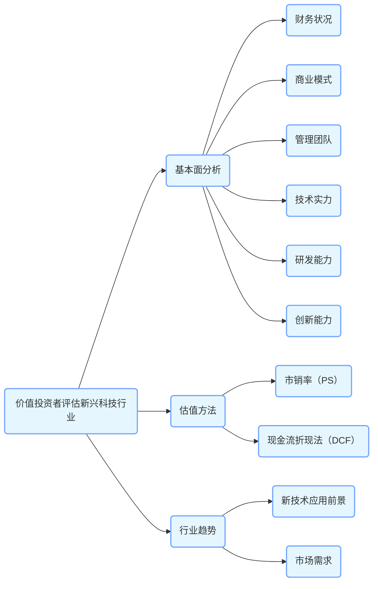

# 价值投资者如何看待并评估新兴科技行业

> 关键词：价值投资者、新兴科技行业、评估方法、行业趋势、投资风险

> 摘要：本文旨在探讨价值投资者看待和评估新兴科技行业的方式。通过对新兴科技行业背景的介绍，阐述核心概念及联系，分析核心算法原理与操作步骤，引入数学模型和公式进行说明。以实际项目案例为依托，详细解释代码实现和分析。探讨新兴科技行业的实际应用场景，推荐相关学习资源、开发工具和论文著作。最后总结未来发展趋势与挑战，解答常见问题并提供扩展阅读和参考资料，帮助价值投资者全面了解和评估新兴科技行业。

## 1. 背景介绍 
### 1.1 目的和范围
随着科技的飞速发展，新兴科技行业如人工智能、区块链、生物技术等不断涌现，为投资者带来了新的机遇和挑战。价值投资者通常以寻找被低估的资产并长期持有为投资策略，然而新兴科技行业具有高增长、高风险、技术迭代快等特点，与传统行业有很大不同。本文的目的是为价值投资者提供一套看待和评估新兴科技行业的方法和思路，范围涵盖新兴科技行业的主要特点、评估指标、投资风险和未来趋势等方面。

### 1.2 预期读者
本文预期读者为对新兴科技行业投资感兴趣的价值投资者，包括个人投资者、机构投资者、投资顾问等。同时，也适合对新兴科技行业有一定了解，希望深入学习如何进行投资评估的相关人士阅读。

### 1.3 文档结构概述
本文首先介绍新兴科技行业的背景和相关概念，然后阐述核心算法原理和操作步骤，接着引入数学模型和公式进行详细讲解和举例说明。通过实际项目案例展示代码实现和分析，探讨新兴科技行业的实际应用场景。推荐相关的学习资源、开发工具和论文著作，最后总结未来发展趋势与挑战，解答常见问题并提供扩展阅读和参考资料。

### 1.4 术语表
#### 1.4.1 核心术语定义
- **价值投资者**：遵循价值投资理念，通过分析公司的基本面，寻找被市场低估的股票或其他资产，并长期持有以获取价值回归带来的收益的投资者。
- **新兴科技行业**：指利用新兴科学技术发展起来的行业，如人工智能、区块链、生物技术、新能源等，具有创新性、高增长性和高风险性等特点。
- **市销率（PS）**：股票价格与每股销售收入的比率，用于衡量公司的估值水平，反映了市场对公司销售收入的预期。
- **研发投入强度**：公司研发投入占营业收入的比例，体现了公司对技术创新的重视程度和投入力度。

#### 1.4.2 相关概念解释
- **技术护城河**：指公司通过技术创新和研发，形成的难以被竞争对手模仿和超越的优势，如专利技术、独特的算法、先进的生产工艺等。
- **网络效应**：指随着用户数量的增加，产品或服务的价值也随之增加的现象，如社交媒体平台、电商平台等。

#### 1.4.3 缩略词列表
- **AI**：人工智能（Artificial Intelligence）
- **BTC**：比特币（Bitcoin）
- **PS**：市销率（Price-to-Sales Ratio）

## 2. 核心概念与联系 

### 核心概念原理
价值投资者在评估新兴科技行业时，需要关注以下几个核心概念：
- **基本面分析**：与传统行业一样，价值投资者需要对新兴科技公司的基本面进行分析，包括公司的财务状况、商业模式、管理团队等。但由于新兴科技行业的特殊性，还需要重点关注公司的技术实力、研发能力和创新能力。
- **估值方法**：传统的估值方法如市盈率（PE）、市净率（PB）等在新兴科技行业可能不太适用，因为新兴科技公司往往处于快速发展阶段，盈利不稳定甚至亏损。因此，价值投资者需要采用一些适合新兴科技行业的估值方法，如市销率（PS）、现金流折现法（DCF）等。
- **行业趋势**：新兴科技行业发展迅速，技术迭代快，价值投资者需要关注行业的发展趋势，了解新技术的应用前景和市场需求，以便及时调整投资策略。

### 架构的文本示意图
```plaintext
价值投资者评估新兴科技行业
|-- 基本面分析
|   |-- 财务状况
|   |-- 商业模式
|   |-- 管理团队
|   |-- 技术实力
|   |-- 研发能力
|   |-- 创新能力
|-- 估值方法
|   |-- 市销率（PS）
|   |-- 现金流折现法（DCF）
|-- 行业趋势
|   |-- 新技术应用前景
|   |-- 市场需求
```

### Mermaid 流程图


## 3. 核心算法原理 & 具体操作步骤 

### 市销率（PS）估值算法原理
市销率（PS）是指股票价格与每股销售收入的比率，计算公式为：

$$PS = \frac{P}{S}$$

其中，$P$ 为股票价格，$S$ 为每股销售收入。

市销率估值的基本原理是，通过比较不同公司的市销率，找出被低估的公司。一般来说，市销率较低的公司可能被市场低估，具有投资价值。

### 具体操作步骤
1. **收集数据**：收集新兴科技公司的股票价格和每股销售收入数据。
2. **计算市销率**：根据上述公式计算公司的市销率。
3. **比较分析**：将公司的市销率与同行业其他公司的市销率进行比较，找出市销率较低的公司。
4. **评估投资价值**：结合公司的基本面和行业趋势，评估市销率较低的公司是否具有投资价值。

### Python 源代码实现
```python
# 假设我们已经收集到了以下数据
stock_prices = [100, 120, 80, 150]  # 股票价格
sales_per_share = [10, 12, 8, 15]  # 每股销售收入

# 计算市销率
ps_ratios = []
for price, sales in zip(stock_prices, sales_per_share):
    ps_ratio = price / sales
    ps_ratios.append(ps_ratio)

# 输出结果
for i, ps_ratio in enumerate(ps_ratios):
    print(f"公司 {i+1} 的市销率为: {ps_ratio}")

# 找出市销率最低的公司
min_ps_index = ps_ratios.index(min(ps_ratios))
print(f"市销率最低的公司是公司 {min_ps_index + 1}，市销率为: {min(ps_ratios)}")
```

### 代码解释
1. **数据收集**：使用列表 `stock_prices` 和 `sales_per_share` 分别存储股票价格和每股销售收入数据。
2. **计算市销率**：使用 `for` 循环遍历股票价格和每股销售收入数据，根据公式计算市销率，并将结果存储在列表 `ps_ratios` 中。
3. **输出结果**：使用 `for` 循环遍历市销率列表，输出每个公司的市销率。
4. **找出市销率最低的公司**：使用 `index` 方法找出市销率列表中最小值的索引，输出市销率最低的公司及其市销率。

## 4. 数学模型和公式 & 详细讲解 & 举例说明 

### 现金流折现法（DCF）数学模型
现金流折现法（DCF）是一种常用的估值方法，其基本原理是将公司未来的现金流折现到当前时刻，以评估公司的内在价值。DCF 模型的计算公式为：

$$V = \sum_{t=1}^{n} \frac{CF_t}{(1 + r)^t} + \frac{TV}{(1 + r)^n}$$

其中，$V$ 为公司的内在价值，$CF_t$ 为第 $t$ 期的现金流，$r$ 为折现率，$n$ 为预测期数，$TV$ 为终值。

### 详细讲解
- **现金流（$CF_t$）**：指公司在未来各期产生的现金流入减去现金流出后的净额。对于新兴科技公司来说，现金流可能受到研发投入、市场推广、产品销售等因素的影响。
- **折现率（$r$）**：反映了投资者对投资风险的预期。折现率越高，说明投资者对风险的要求越高，未来现金流的现值就越低。
- **预测期数（$n$）**：指预测公司未来现金流的期限。对于新兴科技公司来说，由于行业发展迅速，技术迭代快，预测期数一般不宜过长。
- **终值（$TV$）**：指预测期结束后公司的价值。终值的计算方法有多种，常见的有永续增长模型和退出倍数模型。

### 举例说明
假设某新兴科技公司未来 5 年的现金流分别为 100 万元、200 万元、300 万元、400 万元、500 万元，折现率为 10%，预测期结束后公司的终值为 2000 万元。则该公司的内在价值为：

$$V = \frac{100}{(1 + 0.1)^1} + \frac{200}{(1 + 0.1)^2} + \frac{300}{(1 + 0.1)^3} + \frac{400}{(1 + 0.1)^4} + \frac{500}{(1 + 0.1)^5} + \frac{2000}{(1 + 0.1)^5}$$

```python
import numpy as np

# 现金流
cash_flows = np.array([100, 200, 300, 400, 500])
# 折现率
discount_rate = 0.1
# 预测期数
n = 5
# 终值
terminal_value = 2000

# 计算各期现金流的现值
present_values = cash_flows / (1 + discount_rate) ** np.arange(1, n + 1)
# 计算终值的现值
terminal_value_pv = terminal_value / (1 + discount_rate) ** n
# 计算公司的内在价值
intrinsic_value = present_values.sum() + terminal_value_pv

print(f"公司的内在价值为: {intrinsic_value} 万元")
```

### 代码解释
1. **现金流和折现率**：使用 `numpy` 数组 `cash_flows` 存储未来 5 年的现金流，变量 `discount_rate` 存储折现率。
2. **计算各期现金流的现值**：使用 `numpy` 的 `arange` 函数生成 1 到 5 的数组，作为指数，计算各期现金流的现值。
3. **计算终值的现值**：根据公式计算终值的现值。
4. **计算公司的内在价值**：将各期现金流的现值和终值的现值相加，得到公司的内在价值。

## 5. 项目实战：代码实际案例和详细解释说明 

### 5.1  开发环境搭建
- **操作系统**：Windows、Linux 或 macOS
- **Python 版本**：Python 3.7 及以上
- **开发工具**：Jupyter Notebook 或 PyCharm
- **必要的库**：`numpy`、`pandas`、`matplotlib`

### 5.2  源代码详细实现和代码解读
```python
import numpy as np
import pandas as pd
import matplotlib.pyplot as plt

# 模拟新兴科技公司的财务数据
np.random.seed(42)
years = np.arange(2020, 2026)
sales = np.random.randint(100, 500, size=len(years))
costs = sales * np.random.uniform(0.6, 0.8, size=len(years))
profits = sales - costs

# 创建 DataFrame 存储数据
data = {
    'Year': years,
    'Sales': sales,
    'Costs': costs,
    'Profits': profits
}
df = pd.DataFrame(data)

# 计算市销率（假设股票价格为 100 元）
stock_price = 100
df['PS Ratio'] = stock_price / df['Sales']

# 绘制销售和利润趋势图
plt.figure(figsize=(10, 6))
plt.plot(df['Year'], df['Sales'], label='Sales')
plt.plot(df['Year'], df['Profits'], label='Profits')
plt.xlabel('Year')
plt.ylabel('Amount')
plt.title('Sales and Profits Trend of a Tech Company')
plt.legend()
plt.grid(True)
plt.show()

# 输出结果
print(df)
```

### 代码解读与分析
1. **数据模拟**：使用 `numpy` 的 `random` 模块模拟新兴科技公司 2020 年到 2025 年的销售收入、成本和利润数据。
2. **创建 DataFrame**：使用 `pandas` 的 `DataFrame` 存储模拟数据，方便后续分析。
3. **计算市销率**：假设股票价格为 100 元，根据公式计算各年的市销率，并添加到 DataFrame 中。
4. **绘制趋势图**：使用 `matplotlib` 绘制销售和利润的趋势图，直观展示公司的发展情况。
5. **输出结果**：打印 DataFrame，显示各年的销售、成本、利润和市销率数据。

通过这个案例，我们可以看到如何使用 Python 模拟新兴科技公司的财务数据，计算市销率，并绘制趋势图进行分析。这有助于价值投资者更直观地了解公司的经营状况和估值水平。

## 6. 实际应用场景 
### 人工智能领域
在人工智能领域，价值投资者可以关注具有核心算法和技术优势的公司。例如，一些专注于图像识别、自然语言处理等领域的公司，通过不断研发和创新，提高算法的准确性和效率，从而在市场上获得竞争优势。投资者可以通过评估公司的研发投入强度、专利数量、技术团队实力等指标，来判断公司的技术护城河。同时，关注人工智能技术在医疗、金融、交通等行业的应用前景，选择具有广阔市场空间的公司进行投资。

### 区块链领域
区块链技术具有去中心化、不可篡改、安全可靠等特点，在金融、供应链、物流等领域具有广泛的应用前景。价值投资者可以关注区块链技术的基础设施建设公司，如区块链底层平台开发公司、区块链节点服务提供商等。评估公司的技术实力、社区活跃度、应用场景落地情况等因素。此外，还可以关注区块链行业的监管政策变化，因为监管政策对区块链行业的发展具有重要影响。

### 生物技术领域
生物技术领域的发展对于人类健康和医疗产业具有重要意义。价值投资者可以关注生物制药公司、基因检测公司等。评估公司的研发管线、临床试验进展、药品审批情况等因素。生物技术公司的研发周期长、风险高，但一旦研发成功，可能会带来巨大的收益。因此，投资者需要具备一定的专业知识和风险承受能力。

### 新能源领域
随着全球对环境保护和可持续发展的重视，新能源领域迎来了快速发展的机遇。价值投资者可以关注太阳能、风能、电动汽车等行业的公司。评估公司的技术创新能力、成本控制能力、市场份额等因素。例如，电动汽车公司的电池技术、续航里程、充电设施建设等方面的优势，将直接影响公司的市场竞争力。

## 7. 工具和资源推荐
### 7.1 学习资源推荐
#### 7.1.1 书籍推荐
- 《聪明的投资者》（The Intelligent Investor）：作者本杰明·格雷厄姆（Benjamin Graham），被誉为价值投资的圣经，介绍了价值投资的基本理念和方法。
- 《穷查理宝典》（Poor Charlie's Almanack）：作者彼得·考夫曼（Peter D. Kaufman），收录了查理·芒格（Charlie Munger）的演讲和文章，阐述了多元思维模型和投资哲学。
- 《人工智能：现代方法》（Artificial Intelligence: A Modern Approach）：作者斯图尔特·罗素（Stuart J. Russell）和彼得·诺维格（Peter Norvig），是人工智能领域的经典教材，全面介绍了人工智能的理论和方法。

#### 7.1.2 在线课程
- Coursera 上的“Machine Learning”（机器学习）课程：由斯坦福大学教授吴恩达（Andrew Ng）授课，是机器学习领域的入门经典课程。
- edX 上的“Blockchain and Cryptocurrency Technologies”（区块链和加密货币技术）课程：由普林斯顿大学教授阿兰·图灵（Arvind Narayanan）授课，介绍了区块链技术的原理和应用。
- Udemy 上的“Biotechnology Fundamentals”（生物技术基础）课程：适合对生物技术领域感兴趣的初学者，介绍了生物技术的基本概念和方法。

#### 7.1.3 技术博客和网站
- Medium：是一个汇聚了众多科技领域作者的平台，提供了丰富的技术文章和观点。
- Hacker News：是一个关注科技创业和技术新闻的网站，用户可以在这里了解到最新的科技动态和行业趋势。
- Towards Data Science：专注于数据科学和机器学习领域，提供了大量的技术教程和案例分析。

### 7.2 开发工具框架推荐
#### 7.2.1 IDE和编辑器
- PyCharm：是一款专业的 Python 集成开发环境，提供了丰富的代码编辑、调试和测试功能。
- Jupyter Notebook：是一个基于网页的交互式开发环境，适合进行数据分析和机器学习实验。
- Visual Studio Code：是一款轻量级的代码编辑器，支持多种编程语言，具有丰富的插件扩展功能。

#### 7.2.2 调试和性能分析工具
- pdb：是 Python 自带的调试器，可以帮助开发者定位代码中的错误。
- cProfile：是 Python 的性能分析工具，可以分析代码的运行时间和函数调用情况。
- TensorBoard：是 TensorFlow 提供的可视化工具，用于监控和分析深度学习模型的训练过程。

#### 7.2.3 相关框架和库
- NumPy：是 Python 的科学计算库，提供了高效的数组操作和数学函数。
- Pandas：是 Python 的数据处理库，提供了强大的数据结构和数据分析工具。
- Scikit-learn：是 Python 的机器学习库，提供了各种机器学习算法和工具。

### 7.3 相关论文著作推荐
#### 7.3.1 经典论文
- “A Mathematical Theory of Communication”（通信的数学理论）：作者克劳德·香农（Claude Shannon），奠定了信息论的基础。
- “The Nature of the Firm”（企业的性质）：作者罗纳德·科斯（Ronald Coase），探讨了企业存在的原因和边界。
- “Deep Residual Learning for Image Recognition”（用于图像识别的深度残差学习）：作者何恺明等，提出了残差网络（ResNet），在计算机视觉领域取得了巨大成功。

#### 7.3.2 最新研究成果
- 关注顶级学术会议和期刊的最新论文，如 NeurIPS（神经信息处理系统大会）、ICML（国际机器学习会议）、Science（科学）、Nature（自然）等。
- 利用学术搜索引擎如 Google Scholar、IEEE Xplore 等，搜索新兴科技领域的最新研究成果。

#### 7.3.3 应用案例分析
- 阅读行业报告和研究机构发布的应用案例分析，了解新兴科技在不同行业的实际应用情况和效果。
- 关注知名科技公司的年报和财务报告，分析其业务发展和投资策略。

## 8. 总结：未来发展趋势与挑战
### 未来发展趋势
- **技术融合**：新兴科技行业之间的技术融合将越来越明显，如人工智能与区块链、生物技术与信息技术等的融合，将创造出更多的创新应用和商业模式。
- **应用拓展**：新兴科技将在更多的行业和领域得到应用，如教育、农业、文化娱乐等，推动各行业的数字化转型和升级。
- **全球化竞争**：新兴科技行业的全球化竞争将加剧，各国和地区将加大对新兴科技的研发投入和政策支持，争夺技术和市场的主导权。

### 挑战
- **技术不确定性**：新兴科技行业发展迅速，技术迭代快，投资者很难准确预测技术的发展方向和应用前景，增加了投资的不确定性。
- **监管政策风险**：新兴科技行业的发展可能会带来一些新的社会和法律问题，如数据隐私、算法偏见、网络安全等，监管政策的变化可能会对行业的发展产生重大影响。
- **人才短缺**：新兴科技行业对高素质的技术人才和管理人才需求旺盛，但目前人才供应相对不足，人才短缺可能会制约行业的发展。

价值投资者在看待和评估新兴科技行业时，需要充分认识到行业的发展趋势和挑战，采用科学的评估方法和投资策略，以降低投资风险，获取长期稳定的收益。

## 9. 附录：常见问题与解答
### 问题 1：新兴科技行业的估值方法与传统行业有何不同？
解答：传统行业的估值方法如市盈率（PE）、市净率（PB）等通常基于公司的盈利和净资产。而新兴科技行业的公司往往处于快速发展阶段，盈利不稳定甚至亏损，因此传统估值方法可能不太适用。新兴科技行业常用的估值方法包括市销率（PS）、现金流折现法（DCF）等，更注重公司的销售收入、未来现金流和发展潜力。

### 问题 2：如何判断新兴科技公司是否具有技术护城河？
解答：可以从以下几个方面判断新兴科技公司是否具有技术护城河：
- **专利技术**：公司拥有的专利数量和质量是衡量技术实力的重要指标。
- **研发投入强度**：较高的研发投入强度表明公司对技术创新的重视和投入力度。
- **技术团队实力**：优秀的技术团队是公司持续创新的关键。
- **产品或服务的独特性**：公司的产品或服务具有独特的功能和优势，难以被竞争对手模仿。

### 问题 3：新兴科技行业的投资风险有哪些？
解答：新兴科技行业的投资风险主要包括以下几个方面：
- **技术风险**：技术发展的不确定性可能导致公司的技术被淘汰，产品或服务失去竞争力。
- **市场风险**：市场需求的变化、竞争加剧等因素可能影响公司的市场份额和销售收入。
- **监管风险**：监管政策的变化可能对公司的业务发展产生重大影响，甚至导致公司面临法律风险。
- **财务风险**：新兴科技公司往往需要大量的资金投入进行研发和市场推广，可能面临资金短缺、债务违约等财务风险。

### 问题 4：价值投资者在新兴科技行业投资中应注意什么？
解答：价值投资者在新兴科技行业投资中应注意以下几点：
- **深入研究**：充分了解新兴科技行业的技术原理、发展趋势和市场需求，对投资的公司进行深入的基本面分析。
- **分散投资**：由于新兴科技行业的投资风险较高，建议分散投资于不同的公司和领域，以降低投资风险。
- **长期投资**：新兴科技行业的发展需要时间，价值投资者应具备长期投资的理念，耐心等待公司的价值实现。
- **关注风险**：密切关注投资的公司和行业的风险因素，及时调整投资策略。

## 10. 扩展阅读 & 参考资料
### 扩展阅读
- 《创新者的窘境》（The Innovator's Dilemma）：作者克莱顿·克里斯坦森（Clayton M. Christensen），探讨了新兴技术对传统企业的挑战和机遇。
- 《失控》（Out of Control）：作者凯文·凯利（Kevin Kelly），介绍了互联网时代的科技发展趋势和未来社会的形态。
- 《奇点临近》（The Singularity Is Near）：作者雷·库兹韦尔（Ray Kurzweil），预测了人工智能和科技发展的未来趋势。

### 参考资料
- 相关行业报告和研究机构发布的数据和分析，如 Gartner、IDC 等。
- 上市公司的年报、招股说明书等公开披露信息。
- 学术期刊和会议论文，如 IEEE Transactions on Pattern Analysis and Machine Intelligence、ACM SIGKDD Conference on Knowledge Discovery and Data Mining 等。

作者：AI天才研究院/AI Genius Institute & 禅与计算机程序设计艺术 /Zen And The Art of Computer Programming