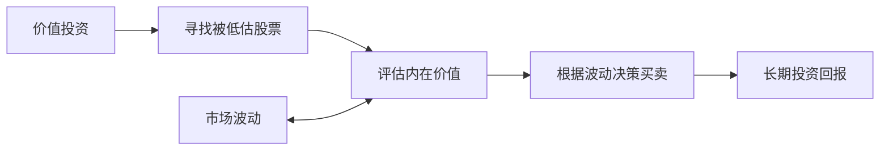

# 价值投资者应该如何看待市场波动

> 关键词：价值投资、市场波动、内在价值、长期投资、情绪管理

> 摘要：本文围绕价值投资者应如何看待市场波动展开深入探讨。详细阐述了价值投资的核心概念，分析市场波动产生的原因和特征，介绍了价值投资者评估市场波动的方法，包括关注企业内在价值、考量安全边际等。通过项目实战案例，展示价值投资者在市场波动中的操作策略。同时探讨了市场波动在不同领域的实际应用场景，推荐了相关学习资源、开发工具及论文著作。最后总结了价值投资在市场波动环境下的未来发展趋势与挑战，并对常见问题进行解答，为价值投资者提供全面的理论和实践指导。

## 1. 背景介绍 
### 1.1 目的和范围
在金融市场中，市场波动是一种常态现象。对于价值投资者而言，如何正确看待和应对市场波动是实现投资目标的关键。本文的目的在于深入剖析市场波动的本质和特点，为价值投资者提供全面、系统的看待市场波动的方法和策略。范围涵盖了价值投资的基本概念、市场波动的成因、评估市场波动的方法、在市场波动中进行投资决策的实践案例，以及相关的学习资源和未来发展趋势等方面。

### 1.2 预期读者
本文主要面向对价值投资感兴趣的投资者，包括个人投资者、专业投资机构的从业者等。无论是初涉投资领域的新手，还是有一定投资经验但希望深入了解价值投资与市场波动关系的投资者，都能从本文中获得有价值的信息和启示。

### 1.3 文档结构概述
本文共分为十个部分。第一部分为背景介绍，阐述了文章的目的、预期读者和文档结构。第二部分介绍价值投资与市场波动的核心概念及它们之间的联系，并提供相关的文本示意图和 Mermaid 流程图。第三部分讲解价值投资者评估市场波动的核心算法原理和具体操作步骤，使用 Python 代码进行详细阐述。第四部分介绍评估市场波动所涉及的数学模型和公式，并进行详细讲解和举例说明。第五部分通过项目实战，展示价值投资者在市场波动中的具体操作，包括开发环境搭建、源代码实现和代码解读。第六部分探讨市场波动在不同领域的实际应用场景。第七部分推荐与价值投资和市场波动相关的学习资源、开发工具框架和论文著作。第八部分总结价值投资在市场波动环境下的未来发展趋势与挑战。第九部分为附录，解答常见问题。第十部分提供扩展阅读和参考资料。

### 1.4 术语表
#### 1.4.1 核心术语定义
- **价值投资**：一种投资策略，强调通过分析企业的内在价值，寻找被市场低估的股票进行投资，以获取长期的投资回报。
- **市场波动**：指市场价格在一定时间内的上下变动，反映了市场供求关系、宏观经济环境、投资者情绪等多种因素的综合影响。
- **内在价值**：企业在未来持续经营过程中所产生的现金流量的现值，是企业的真实价值。
- **安全边际**：指股票的市场价格低于其内在价值的幅度，是价值投资者为了降低投资风险而设定的一个缓冲区间。

#### 1.4.2 相关概念解释
- **基本面分析**：通过研究企业的财务状况、经营业绩、行业前景等基本面因素，评估企业的内在价值和投资价值。
- **技术分析**：通过研究市场价格、成交量等历史数据，运用各种技术指标和图表，预测市场未来的走势。
- **长期投资**：指投资者将资金投入到具有长期增长潜力的资产中，并持有较长时间，以获取资产增值和分红收益。

#### 1.4.3 缩略词列表
- **PE**：市盈率（Price-to-Earnings Ratio），指股票价格与每股收益的比率，用于衡量股票的估值水平。
- **PB**：市净率（Price-to-Book Ratio），指股票价格与每股净资产的比率，用于衡量股票的估值水平。
- **DCF**：现金流折现法（Discounted Cash Flow），一种通过预测企业未来的现金流量，并将其折现到当前的价值评估方法。

## 2. 核心概念与联系 
### 价值投资的核心概念
价值投资的核心思想是寻找被市场低估的股票，即股票的市场价格低于其内在价值。价值投资者相信，从长期来看，市场价格会逐渐回归到企业的内在价值。因此，他们注重对企业基本面的分析，通过研究企业的财务报表、行业前景、竞争优势等因素，评估企业的内在价值。

### 市场波动的成因和特征
市场波动是由多种因素共同作用引起的，主要包括以下几个方面：
- **宏观经济因素**：如 GDP 增长率、通货膨胀率、利率等宏观经济指标的变化，会影响企业的经营环境和盈利能力，从而导致市场波动。
- **行业因素**：不同行业的发展趋势和竞争格局不同，行业内的重大事件（如技术创新、政策变化等）会对行业内企业的股价产生影响，进而引发市场波动。
- **企业自身因素**：企业的经营业绩、财务状况、管理层能力等因素会直接影响企业的内在价值，从而导致股价波动。
- **投资者情绪因素**：投资者的情绪和心理预期会对市场产生重要影响。当投资者乐观时，会推动股价上涨；当投资者悲观时，会导致股价下跌。

市场波动具有以下特征：
- **随机性**：市场波动的时间和幅度具有一定的随机性，难以准确预测。
- **周期性**：市场波动通常呈现出一定的周期性，包括牛市、熊市和震荡市等不同阶段。
- **放大性**：投资者的情绪和行为会对市场波动产生放大作用，导致市场价格的波动幅度超过基本面因素的影响。

### 价值投资与市场波动的联系
价值投资与市场波动密切相关。市场波动为价值投资者提供了寻找被低估股票的机会。当市场出现大幅下跌时，许多股票的价格会低于其内在价值，此时价值投资者可以以较低的价格买入这些股票。而当市场上涨时，价值投资者则可以根据企业的内在价值和市场价格的变化，决定是否卖出股票。

### 文本示意图
```plaintext
              价值投资
                 |
                 | 寻找被低估股票
                 v
 市场波动 <----> 评估内在价值
                 |
                 | 根据波动决策买卖
                 v
            长期投资回报
```

### Mermaid 流程图


## 3. 核心算法原理 & 具体操作步骤 
### 核心算法原理
价值投资者评估市场波动主要基于对企业内在价值的评估。常用的评估方法是现金流折现法（DCF）。该方法的基本原理是将企业未来的现金流量折现到当前，以确定企业的内在价值。

### Python 代码实现
```python
import numpy as np

def dcf_valuation(free_cash_flows, discount_rate, terminal_growth_rate):
    """
    现金流折现法评估企业内在价值
    :param free_cash_flows: 未来各期的自由现金流列表
    :param discount_rate: 折现率
    :param terminal_growth_rate: 永续增长率
    :return: 企业的内在价值
    """
    n = len(free_cash_flows)
    discounted_cash_flows = []
    for i in range(n):
        discounted_cash_flow = free_cash_flows[i] / ((1 + discount_rate) ** (i + 1))
        discounted_cash_flows.append(discounted_cash_flow)

    # 计算终值
    last_cash_flow = free_cash_flows[-1]
    terminal_value = last_cash_flow * (1 + terminal_growth_rate) / (discount_rate - terminal_growth_rate)
    discounted_terminal_value = terminal_value / ((1 + discount_rate) ** n)

    # 计算内在价值
    intrinsic_value = sum(discounted_cash_flows) + discounted_terminal_value
    return intrinsic_value

# 示例数据
free_cash_flows = [100, 120, 140, 160, 180]
discount_rate = 0.1
terminal_growth_rate = 0.03

# 计算内在价值
intrinsic_value = dcf_valuation(free_cash_flows, discount_rate, terminal_growth_rate)
print(f"企业的内在价值为: {intrinsic_value}")
```

### 具体操作步骤
1. **预测未来现金流量**：通过对企业的历史财务数据、行业发展趋势、市场竞争格局等因素的分析，预测企业未来各期的自由现金流量。
2. **确定折现率**：折现率反映了投资者对投资风险的要求。通常可以使用资本资产定价模型（CAPM）来确定折现率。
3. **确定永续增长率**：永续增长率是指企业在未来长期内的现金流量增长率。一般可以根据行业的平均增长率和企业的竞争优势来确定。
4. **计算内在价值**：将预测的未来现金流量按照折现率折现到当前，并计算终值，最后将两者相加得到企业的内在价值。
5. **评估市场波动**：将企业的内在价值与市场价格进行比较，如果市场价格低于内在价值，则认为该股票被低估，具有投资价值；反之，则认为该股票被高估，不具有投资价值。

## 4. 数学模型和公式 & 详细讲解 & 举例说明 
### 现金流折现法的数学模型和公式
现金流折现法的基本公式为：
$$
V = \sum_{t=1}^{n} \frac{FCF_t}{(1 + r)^t} + \frac{FCF_n(1 + g)}{(r - g)(1 + r)^n}
$$
其中：
- $V$ 表示企业的内在价值
- $FCF_t$ 表示第 $t$ 期的自由现金流量
- $r$ 表示折现率
- $n$ 表示预测期数
- $g$ 表示永续增长率

### 详细讲解
- **预测期现金流量折现**：$\sum_{t=1}^{n} \frac{FCF_t}{(1 + r)^t}$ 表示将预测期内各期的自由现金流量按照折现率 $r$ 折现到当前的价值总和。
- **终值计算**：$\frac{FCF_n(1 + g)}{(r - g)(1 + r)^n}$ 表示预测期结束后企业的终值按照折现率 $r$ 折现到当前的价值。终值的计算基于永续增长模型，假设企业在预测期结束后将以永续增长率 $g$ 持续增长。

### 举例说明
假设某企业未来 5 年的自由现金流量分别为 100 万元、120 万元、140 万元、160 万元和 180 万元，折现率为 10%，永续增长率为 3%。

1. **计算预测期现金流量折现**：
   - 第 1 年：$\frac{100}{(1 + 0.1)^1} \approx 90.91$ 万元
   - 第 2 年：$\frac{120}{(1 + 0.1)^2} \approx 99.17$ 万元
   - 第 3 年：$\frac{140}{(1 + 0.1)^3} \approx 105.18$ 万元
   - 第 4 年：$\frac{160}{(1 + 0.1)^4} \approx 109.29$ 万元
   - 第 5 年：$\frac{180}{(1 + 0.1)^5} \approx 111.73$ 万元
   - 预测期现金流量折现总和：$90.91 + 99.17 + 105.18 + 109.29 + 111.73 = 516.28$ 万元

2. **计算终值**：
   - 第 5 年的自由现金流量为 180 万元，终值为：$\frac{180(1 + 0.03)}{(0.1 - 0.03)} = 2631.43$ 万元
   - 终值折现到当前的价值为：$\frac{2631.43}{(1 + 0.1)^5} \approx 1637.71$ 万元

3. **计算内在价值**：
   - 企业的内在价值为：$516.28 + 1637.71 = 2153.99$ 万元

## 5. 项目实战：代码实际案例和详细解释说明 
### 5.1  开发环境搭建
- **Python 安装**：从 Python 官方网站（https://www.python.org/downloads/）下载并安装 Python 3.x 版本。
- **IDE 选择**：推荐使用 PyCharm 或 Jupyter Notebook 作为开发环境。PyCharm 是一款功能强大的 Python 集成开发环境，适合大型项目的开发；Jupyter Notebook 则是一个交互式的开发环境，适合进行数据分析和实验。
- **库安装**：需要安装 numpy、pandas 等常用的 Python 库。可以使用 pip 命令进行安装：
```bash
pip install numpy pandas
```

### 5.2  源代码详细实现和代码解读
```python
import numpy as np
import pandas as pd

def calculate_intrinsic_value(free_cash_flows, discount_rate, terminal_growth_rate):
    """
    计算企业的内在价值
    :param free_cash_flows: 未来各期的自由现金流列表
    :param discount_rate: 折现率
    :param terminal_growth_rate: 永续增长率
    :return: 企业的内在价值
    """
    n = len(free_cash_flows)
    discounted_cash_flows = []
    for i in range(n):
        discounted_cash_flow = free_cash_flows[i] / ((1 + discount_rate) ** (i + 1))
        discounted_cash_flows.append(discounted_cash_flow)

    # 计算终值
    last_cash_flow = free_cash_flows[-1]
    terminal_value = last_cash_flow * (1 + terminal_growth_rate) / (discount_rate - terminal_growth_rate)
    discounted_terminal_value = terminal_value / ((1 + discount_rate) ** n)

    # 计算内在价值
    intrinsic_value = sum(discounted_cash_flows) + discounted_terminal_value
    return intrinsic_value

def analyze_market_fluctuation(free_cash_flows, discount_rate, terminal_growth_rate, market_prices):
    """
    分析市场波动对投资决策的影响
    :param free_cash_flows: 未来各期的自由现金流列表
    :param discount_rate: 折现率
    :param terminal_growth_rate: 永续增长率
    :param market_prices: 市场价格列表
    :return: 投资决策建议
    """
    intrinsic_value = calculate_intrinsic_value(free_cash_flows, discount_rate, terminal_growth_rate)
    decisions = []
    for price in market_prices:
        if price < intrinsic_value:
            decisions.append("买入")
        elif price > intrinsic_value:
            decisions.append("卖出")
        else:
            decisions.append("持有")
    return decisions

# 示例数据
free_cash_flows = [100, 120, 140, 160, 180]
discount_rate = 0.1
terminal_growth_rate = 0.03
market_prices = [1500, 2000, 2200, 1800, 1600]

# 分析市场波动
decisions = analyze_market_fluctuation(free_cash_flows, discount_rate, terminal_growth_rate, market_prices)

# 输出结果
result_df = pd.DataFrame({
    "市场价格": market_prices,
    "投资决策": decisions
})
print(result_df)
```

### 代码解读与分析
- **calculate_intrinsic_value 函数**：该函数实现了现金流折现法的核心逻辑，通过预测未来现金流量、确定折现率和永续增长率，计算企业的内在价值。
- **analyze_market_fluctuation 函数**：该函数根据计算得到的企业内在价值和市场价格，给出投资决策建议。如果市场价格低于内在价值，则建议买入；如果市场价格高于内在价值，则建议卖出；如果市场价格等于内在价值，则建议持有。
- **主程序**：定义了示例数据，包括未来各期的自由现金流量、折现率、永续增长率和市场价格列表。调用 `analyze_market_fluctuation` 函数进行市场波动分析，并将结果存储在 DataFrame 中进行输出。

## 6. 实际应用场景 
### 股票投资
在股票投资中，价值投资者可以通过分析企业的内在价值和市场波动情况，选择被低估的股票进行投资。当市场出现大幅下跌时，许多优质股票的价格会被低估，此时价值投资者可以抓住机会买入这些股票。而当市场上涨，股票价格高于其内在价值时，价值投资者可以考虑卖出股票，实现投资收益。

### 基金投资
在基金投资中，价值投资者可以选择投资那些遵循价值投资理念的基金。这些基金通常会通过深入的基本面分析，选择被低估的股票构建投资组合。当市场波动时，这些基金的表现相对较为稳定，能够为投资者带来长期的投资回报。

### 房地产投资
在房地产投资中，价值投资者可以通过分析房地产的内在价值和市场波动情况，选择被低估的房产进行投资。房地产的内在价值可以通过考虑房产的地理位置、周边配套设施、租金收益等因素来评估。当房地产市场出现波动时，价值投资者可以根据市场价格与内在价值的比较，做出买入或卖出的决策。

## 7. 工具和资源推荐
### 7.1 学习资源推荐
#### 7.1.1 书籍推荐
- 《聪明的投资者》（The Intelligent Investor）：本杰明·格雷厄姆（Benjamin Graham）著，被誉为价值投资的圣经，详细介绍了价值投资的基本理念和方法。
- 《证券分析》（Security Analysis）：本杰明·格雷厄姆和大卫·多德（David Dodd）著，是价值投资领域的经典著作，对企业的财务分析和估值方法进行了深入探讨。
- 《巴菲特致股东的信》（Letters to Shareholders of Berkshire Hathaway）：沃伦·巴菲特（Warren Buffett）著，收录了巴菲特历年致股东的信，从中可以学习到巴菲特的投资理念和策略。

#### 7.1.2 在线课程
- Coursera 上的“投资学原理”（Principles of Investing）课程：由宾夕法尼亚大学的教授授课，介绍了投资的基本概念、理论和方法。
- edX 上的“金融市场”（Financial Markets）课程：由耶鲁大学的教授授课，深入讲解了金融市场的运作机制和投资策略。

#### 7.1.3 技术博客和网站
- 雪球网（https://xueqiu.com/）：国内知名的投资交流平台，提供股票、基金等投资品种的实时行情、分析报告和投资者交流社区。
- 价值投资网（https://www.value-investing.info/）：专注于价值投资领域的资讯和研究，提供企业基本面分析、估值方法等方面的文章和报告。

### 7.2 开发工具框架推荐
#### 7.2.1 IDE和编辑器
- PyCharm：功能强大的 Python 集成开发环境，提供代码编辑、调试、版本控制等功能，适合专业开发者使用。
- Jupyter Notebook：交互式的开发环境，支持 Python、R 等多种编程语言，适合进行数据分析和实验。

#### 7.2.2 调试和性能分析工具
- pdb：Python 自带的调试工具，可以帮助开发者定位代码中的错误和问题。
- cProfile：Python 自带的性能分析工具，可以分析代码的运行时间和性能瓶颈。

#### 7.2.3 相关框架和库
- numpy：Python 中用于科学计算的基础库，提供了高效的数组操作和数学函数。
- pandas：Python 中用于数据处理和分析的库，提供了 DataFrame 等数据结构，方便进行数据清洗、转换和分析。

### 7.3 相关论文著作推荐
#### 7.3.1 经典论文
- 《有效市场假说》（Efficient Markets Hypothesis）：由尤金·法玛（Eugene F. Fama）提出，阐述了市场效率的概念和分类，对投资理论和实践产生了深远影响。
- 《资本资产定价模型》（Capital Asset Pricing Model）：由威廉·夏普（William F. Sharpe）提出，用于描述资产的预期收益率与风险之间的关系。

#### 7.3.2 最新研究成果
- 《行为金融学》（Behavioral Finance）：结合心理学和金融学的理论，研究投资者的行为和决策对市场的影响，是近年来金融领域的研究热点。
- 《量化投资》（Quantitative Investment）：利用数学模型和计算机技术进行投资决策，提高投资效率和准确性，是金融科技领域的重要应用。

#### 7.3.3 应用案例分析
- 《价值投资在中国市场的应用研究》：分析了价值投资理念在中国市场的适用性和实践效果，为中国投资者提供了有益的参考。
- 《基于大数据的投资策略研究》：探讨了如何利用大数据技术挖掘投资信息，制定投资策略，提高投资收益。

## 8. 总结：未来发展趋势与挑战
### 未来发展趋势
- **智能化投资**：随着人工智能和机器学习技术的不断发展，智能化投资将成为未来的发展趋势。智能投资系统可以通过对大量数据的分析和挖掘，自动识别被低估的股票，制定投资策略，提高投资效率和准确性。
- **多元化投资**：投资者将更加注重多元化投资，分散投资风险。除了股票、基金、债券等传统投资品种外，投资者还将关注房地产、大宗商品、数字货币等新兴投资领域。
- **社会责任投资**：社会责任投资将越来越受到投资者的关注。投资者将更加注重企业的社会责任和可持续发展能力，选择那些具有良好社会形象和环境绩效的企业进行投资。

### 挑战
- **市场不确定性增加**：随着全球经济的不确定性增加，市场波动将更加频繁和剧烈。价值投资者需要更加准确地评估市场波动的风险，制定合理的投资策略。
- **信息过载**：互联网和信息技术的发展使得投资者可以获取大量的投资信息，但同时也带来了信息过载的问题。价值投资者需要具备筛选和分析信息的能力，避免被虚假信息和噪音所干扰。
- **竞争加剧**：随着价值投资理念的普及，越来越多的投资者开始采用价值投资策略，市场竞争将更加激烈。价值投资者需要不断提升自己的投资能力和分析水平，才能在市场中获得超额收益。

## 9. 附录：常见问题与解答
### 问题 1：价值投资是否适用于所有市场？
解答：价值投资的基本理念是寻找被低估的资产，从长期来看实现资产增值。虽然价值投资的原理具有普遍性，但不同市场的特点和环境存在差异，因此价值投资在不同市场的适用性也有所不同。在成熟的市场中，价值投资更容易发挥作用，因为市场信息相对透明，企业的基本面更容易分析。而在新兴市场中，由于市场机制不完善、信息不对称等因素，价值投资的实施可能会面临一定的挑战。但总体而言，价值投资的核心思想在任何市场都具有一定的指导意义。

### 问题 2：如何准确评估企业的内在价值？
解答：评估企业的内在价值是价值投资的关键环节，但也是一项具有挑战性的任务。常用的评估方法包括现金流折现法、市盈率法、市净率法等。在使用这些方法时，需要对企业的财务状况、经营业绩、行业前景等因素进行深入分析。同时，还需要考虑宏观经济环境、政策变化等外部因素的影响。此外，由于未来的不确定性，评估企业的内在价值存在一定的误差，因此需要结合多种方法进行综合评估，并保持一定的安全边际。

### 问题 3：市场波动剧烈时，价值投资者应该如何应对？
解答：当市场波动剧烈时，价值投资者应该保持冷静，不要被市场情绪所左右。首先，要重新评估企业的内在价值，判断市场波动是否影响了企业的基本面。如果企业的基本面没有发生变化，而市场价格出现了大幅下跌，那么这可能是一个买入的机会。其次，要合理控制仓位，避免过度投资。在市场波动较大时，可以适当增加现金储备，以应对可能的风险。最后，要坚持长期投资的理念，不要因为短期的市场波动而轻易卖出股票。

## 10. 扩展阅读 & 参考资料
### 扩展阅读
- 《财务报表分析与股票估值》（Financial Statement Analysis and Security Valuation）：斯蒂芬·佩因曼（Stephen H. Penman）著，详细介绍了如何通过分析企业的财务报表来评估企业的价值。
- 《金融炼金术》（The Alchemy of Finance）：乔治·索罗斯（George Soros）著，阐述了索罗斯的投资哲学和反身性理论。

### 参考资料
- 本杰明·格雷厄姆. 《聪明的投资者》. 人民邮电出版社.
- 沃伦·巴菲特. 《巴菲特致股东的信》. 机械工业出版社.
- 尤金·法玛. 《有效市场假说》. Journal of Finance.
- 威廉·夏普. 《资本资产定价模型》. Journal of Finance.

作者：AI天才研究院/AI Genius Institute & 禅与计算机程序设计艺术 /Zen And The Art of Computer Programming