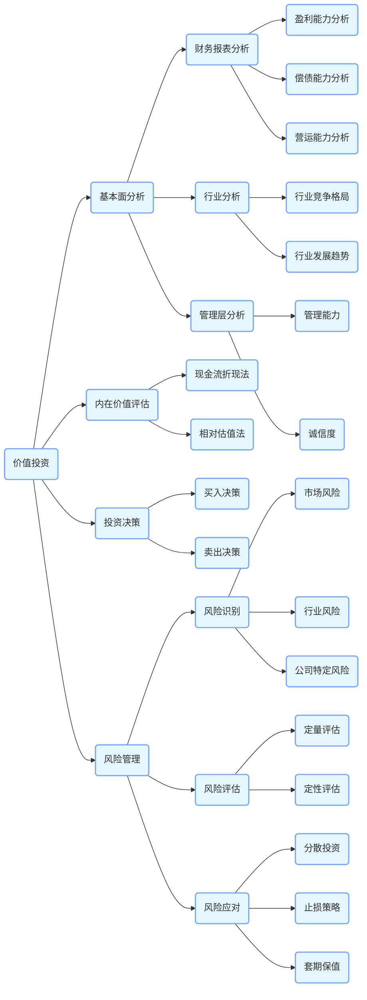

# 价值投资者的风险管理：如何在追求收益的同时控制风险

> 关键词：价值投资、风险管理、收益追求、风险控制、投资策略

> 摘要：本文聚焦于价值投资者的风险管理，深入探讨在追求投资收益的过程中如何有效控制风险。通过介绍相关背景知识，阐述核心概念及联系，剖析核心算法原理与操作步骤，结合数学模型和公式进行详细讲解，给出项目实战案例及代码分析，探讨实际应用场景，推荐相关工具和资源，最后总结未来发展趋势与挑战，并提供常见问题解答和扩展阅读参考资料，旨在为价值投资者提供全面且深入的风险管理指导。

## 1. 背景介绍 
### 1.1 目的和范围
价值投资作为一种长期投资策略，旨在通过分析公司的内在价值，寻找被低估的股票并长期持有以获取收益。然而，投资过程中不可避免地会面临各种风险，如市场风险、行业风险、公司特定风险等。本文章的目的在于为价值投资者提供一套全面的风险管理方法，帮助他们在追求收益的同时有效控制风险。范围涵盖了从理论基础到实际操作的各个方面，包括核心概念的解释、算法原理的阐述、实际案例的分析以及工具资源的推荐等。

### 1.2 预期读者
本文预期读者主要为价值投资领域的投资者，包括个人投资者、机构投资者以及对价值投资和风险管理感兴趣的金融从业者和研究人员。无论您是初涉投资领域的新手，还是经验丰富的专业投资者，都能从本文中获取有价值的信息和实用的方法。

### 1.3 文档结构概述
本文将按照以下结构进行阐述：首先介绍相关背景知识，包括目的、预期读者和文档结构概述等；接着阐述核心概念及联系，通过文本示意图和 Mermaid 流程图进行直观展示；然后剖析核心算法原理与具体操作步骤，并使用 Python 源代码详细阐述；再结合数学模型和公式进行详细讲解，并举例说明；之后给出项目实战案例，包括开发环境搭建、源代码实现和代码解读；接着探讨实际应用场景；再推荐相关工具和资源；最后总结未来发展趋势与挑战，提供常见问题解答和扩展阅读参考资料。

### 1.4 术语表
#### 1.4.1 核心术语定义
- **价值投资**：一种投资策略，基于对公司内在价值的分析，寻找价格低于其内在价值的股票进行投资，期望在长期内获得价值回归带来的收益。
- **风险管理**：识别、评估和应对投资过程中可能面临的各种风险，以降低损失的可能性和影响程度。
- **收益**：投资者在投资过程中获得的回报，包括股息收入和资本增值。
- **风险**：投资结果的不确定性，可能导致投资者遭受损失。

#### 1.4.2 相关概念解释
- **内在价值**：公司的真实价值，通常通过对公司的财务状况、盈利能力、行业前景等因素进行分析和评估得出。
- **安全边际**：股票价格低于其内在价值的幅度，是价值投资中重要的风险控制指标。
- **分散投资**：将资金分散投资于不同的资产、行业或地区，以降低单一投资的风险。

#### 1.4.3 缩略词列表
- **PE**：市盈率（Price-to-Earnings Ratio），衡量股票价格相对于每股收益的指标。
- **PB**：市净率（Price-to-Book Ratio），衡量股票价格相对于每股净资产的指标。
- **ROE**：净资产收益率（Return on Equity），衡量公司盈利能力的指标。

## 2. 核心概念与联系 

### 核心概念原理
价值投资的核心原理是基于公司的内在价值进行投资决策。投资者通过对公司的基本面进行分析，包括财务报表、行业竞争地位、管理层能力等，评估公司的内在价值。如果股票价格低于其内在价值，投资者认为该股票具有投资价值，从而进行买入操作。在追求收益的过程中，风险管理是至关重要的。风险管理的核心原理是识别、评估和应对各种风险，以确保投资组合的稳定性和可持续性。投资者需要考虑市场风险、行业风险、公司特定风险等因素，并采取相应的措施来降低风险。

### 架构的文本示意图
```plaintext
价值投资
|-- 基本面分析
|   |-- 财务报表分析
|   |   |-- 盈利能力分析
|   |   |-- 偿债能力分析
|   |   |-- 营运能力分析
|   |-- 行业分析
|   |   |-- 行业竞争格局
|   |   |-- 行业发展趋势
|   |-- 管理层分析
|       |-- 管理能力
|       |-- 诚信度
|-- 内在价值评估
|   |-- 现金流折现法
|   |-- 相对估值法
|-- 投资决策
|   |-- 买入决策
|   |-- 卖出决策
|-- 风险管理
|   |-- 风险识别
|   |   |-- 市场风险
|   |   |-- 行业风险
|   |   |-- 公司特定风险
|   |-- 风险评估
|   |   |-- 定量评估
|   |   |-- 定性评估
|   |-- 风险应对
|       |-- 分散投资
|       |-- 止损策略
|       |-- 套期保值
```

### Mermaid 流程图


## 3. 核心算法原理 & 具体操作步骤 

### 核心算法原理
在价值投资的风险管理中，有几个核心算法原理需要掌握。其中，现金流折现法（DCF）是评估公司内在价值的重要方法之一。该方法的基本原理是将公司未来的现金流按照一定的折现率折现到当前时刻，从而得到公司的内在价值。公式如下：

$$V = \sum_{t=1}^{n} \frac{CF_t}{(1 + r)^t}$$

其中，$V$ 表示公司的内在价值，$CF_t$ 表示第 $t$ 期的现金流，$r$ 表示折现率，$n$ 表示预测期数。

### 具体操作步骤
#### 步骤 1：收集数据
首先，需要收集公司的财务报表、行业数据等相关信息。这些数据可以从公司的官方网站、证券交易所网站、金融数据提供商等渠道获取。

#### 步骤 2：预测现金流
根据公司的历史财务数据和行业发展趋势，预测公司未来的现金流。可以采用多种方法进行预测，如趋势分析、回归分析等。

#### 步骤 3：确定折现率
折现率反映了投资者对投资回报的要求，通常可以采用资本资产定价模型（CAPM）来确定。公式如下：

$$r = R_f + \beta \times (R_m - R_f)$$

其中，$r$ 表示折现率，$R_f$ 表示无风险利率，$\beta$ 表示股票的贝塔系数，$R_m$ 表示市场收益率。

#### 步骤 4：计算内在价值
将预测的现金流按照确定的折现率折现到当前时刻，计算公司的内在价值。

#### 步骤 5：比较内在价值和股票价格
将计算得到的内在价值与股票的当前价格进行比较。如果股票价格低于内在价值，说明该股票具有投资价值；反之，则不具有投资价值。

### Python 源代码实现
```python
import numpy as np

def dcf_analysis(cash_flows, discount_rate):
    """
    现金流折现法计算公司内在价值
    :param cash_flows: 未来各期现金流列表
    :param discount_rate: 折现率
    :return: 公司内在价值
    """
    periods = len(cash_flows)
    present_values = []
    for t in range(periods):
        present_value = cash_flows[t] / ((1 + discount_rate) ** (t + 1))
        present_values.append(present_value)
    intrinsic_value = sum(present_values)
    return intrinsic_value

# 示例数据
cash_flows = [100, 120, 150, 180, 200]  # 未来 5 年的现金流
discount_rate = 0.1  # 折现率为 10%

# 计算内在价值
intrinsic_value = dcf_analysis(cash_flows, discount_rate)
print(f"公司内在价值: {intrinsic_value}")
```

## 4. 数学模型和公式 & 详细讲解 & 举例说明 

### 现金流折现法（DCF）
#### 公式
$$V = \sum_{t=1}^{n} \frac{CF_t}{(1 + r)^t}$$

#### 详细讲解
- $V$：公司的内在价值，是我们最终要计算的结果。
- $CF_t$：第 $t$ 期的现金流，代表公司在第 $t$ 期产生的现金流入减去现金流出后的净额。
- $r$：折现率，反映了投资者对投资回报的要求，考虑了资金的时间价值和投资风险。
- $n$：预测期数，即我们预测公司未来现金流的期数。

#### 举例说明
假设一家公司未来 3 年的现金流分别为 100 万元、120 万元和 150 万元，折现率为 10%。则该公司的内在价值计算如下：

第 1 年现金流的现值：$PV_1 = \frac{100}{(1 + 0.1)^1} = 90.91$（万元）

第 2 年现金流的现值：$PV_2 = \frac{120}{(1 + 0.1)^2} = 99.17$（万元）

第 3 年现金流的现值：$PV_3 = \frac{150}{(1 + 0.1)^3} = 112.69$（万元）

公司内在价值：$V = PV_1 + PV_2 + PV_3 = 90.91 + 99.17 + 112.69 = 302.77$（万元）

### 资本资产定价模型（CAPM）
#### 公式
$$r = R_f + \beta \times (R_m - R_f)$$

#### 详细讲解
- $r$：折现率，即投资者要求的必要收益率。
- $R_f$：无风险利率，通常可以用国债收益率来近似表示。
- $\beta$：股票的贝塔系数，衡量了股票相对于市场的波动性。$\beta > 1$ 表示股票的波动性大于市场，$\beta < 1$ 表示股票的波动性小于市场。
- $R_m$：市场收益率，通常可以用股票市场指数的收益率来近似表示。

#### 举例说明
假设无风险利率为 3%，市场收益率为 10%，某股票的贝塔系数为 1.2。则该股票的折现率计算如下：

$r = 3\% + 1.2 \times (10\% - 3\%) = 3\% + 8.4\% = 11.4\%$

### 夏普比率
#### 公式
$$Sharpe Ratio = \frac{R_p - R_f}{\sigma_p}$$

#### 详细讲解
- $Sharpe Ratio$：夏普比率，衡量了投资组合每承担一单位风险所获得的超过无风险收益的额外收益。
- $R_p$：投资组合的预期收益率。
- $R_f$：无风险利率。
- $\sigma_p$：投资组合的标准差，衡量了投资组合的风险。

#### 举例说明
假设某投资组合的预期收益率为 15%，无风险利率为 3%，投资组合的标准差为 20%。则该投资组合的夏普比率计算如下：

$Sharpe Ratio = \frac{15\% - 3\%}{20\%} = 0.6$

## 5. 项目实战：代码实际案例和详细解释说明 

### 5.1  开发环境搭建
#### 操作系统
可以选择 Windows、Linux 或 macOS 操作系统。

#### Python 版本
建议使用 Python 3.7 及以上版本。

#### 安装必要的库
使用以下命令安装必要的 Python 库：
```sh
pip install numpy pandas matplotlib yfinance
```

### 5.2  源代码详细实现和代码解读
```python
import yfinance as yf
import numpy as np
import pandas as pd
import matplotlib.pyplot as plt

# 下载股票数据
def download_stock_data(ticker, start_date, end_date):
    """
    下载指定股票在指定日期范围内的数据
    :param ticker: 股票代码
    :param start_date: 开始日期
    :param end_date: 结束日期
    :return: 股票数据 DataFrame
    """
    data = yf.download(ticker, start=start_date, end=end_date)
    return data

# 计算收益率
def calculate_returns(data):
    """
    计算股票的日收益率
    :param data: 股票数据 DataFrame
    :return: 日收益率 Series
    """
    returns = data['Close'].pct_change()
    return returns.dropna()

# 计算夏普比率
def calculate_sharpe_ratio(returns, risk_free_rate):
    """
    计算股票的夏普比率
    :param returns: 日收益率 Series
    :param risk_free_rate: 无风险利率
    :return: 夏普比率
    """
    daily_risk_free_rate = (1 + risk_free_rate) ** (1 / 252) - 1
    excess_returns = returns - daily_risk_free_rate
    sharpe_ratio = np.mean(excess_returns) / np.std(excess_returns) * np.sqrt(252)
    return sharpe_ratio

# 主函数
def main():
    ticker = 'AAPL'  # 苹果公司股票代码
    start_date = '2020-01-01'
    end_date = '2021-01-01'
    risk_free_rate = 0.02  # 无风险利率为 2%

    # 下载股票数据
    data = download_stock_data(ticker, start_date, end_date)

    # 计算收益率
    returns = calculate_returns(data)

    # 计算夏普比率
    sharpe_ratio = calculate_sharpe_ratio(returns, risk_free_rate)

    print(f"{ticker} 夏普比率: {sharpe_ratio}")

    # 绘制收益率曲线
    plt.figure(figsize=(10, 6))
    plt.plot(returns)
    plt.title(f"{ticker} 日收益率曲线")
    plt.xlabel('日期')
    plt.ylabel('收益率')
    plt.show()

if __name__ == "__main__":
    main()
```

### 5.3  代码解读与分析
- **下载股票数据**：使用 `yfinance` 库下载指定股票在指定日期范围内的数据。
- **计算收益率**：通过计算股票收盘价的百分比变化，得到日收益率。
- **计算夏普比率**：根据夏普比率的公式，计算股票的夏普比率。
- **绘制收益率曲线**：使用 `matplotlib` 库绘制股票的日收益率曲线，直观展示股票的收益波动情况。

## 6. 实际应用场景 
### 个人投资者
个人投资者可以利用价值投资和风险管理的方法，构建自己的投资组合。通过对公司基本面的分析，选择具有投资价值的股票，并采用分散投资的策略降低风险。同时，根据市场情况和个人风险承受能力，制定合理的止损策略，确保投资组合的稳定性。

### 机构投资者
机构投资者如基金公司、保险公司等，需要管理大规模的资金，对风险管理的要求更高。他们可以运用专业的金融模型和工具，对投资组合进行全面的风险评估和管理。例如，通过优化投资组合的资产配置，降低投资组合的系统性风险；利用套期保值工具，对冲市场风险和行业风险。

### 金融研究机构
金融研究机构可以通过对价值投资和风险管理的研究，为投资者提供专业的投资建议和研究报告。他们可以运用先进的数据分析技术，对市场趋势和公司基本面进行深入分析，挖掘潜在的投资机会，并评估投资风险。

## 7. 工具和资源推荐
### 7.1 学习资源推荐
#### 7.1.1 书籍推荐
- 《聪明的投资者》（The Intelligent Investor）：本杰明·格雷厄姆（Benjamin Graham）著，价值投资领域的经典之作，介绍了价值投资的基本理念和方法。
- 《证券分析》（Security Analysis）：本杰明·格雷厄姆和戴维·多德（David Dodd）著，被誉为投资界的“圣经”，详细阐述了证券分析的理论和实践。
- 《巴菲特致股东的信》（Letters to Shareholders of Berkshire Hathaway）：沃伦·巴菲特（Warren Buffett）著，收录了巴菲特历年致股东的信，展示了他的投资哲学和管理理念。

#### 7.1.2 在线课程
- Coursera 上的“投资学原理”（Principles of Investing）课程，由宾夕法尼亚大学的教授授课，介绍了投资的基本原理和方法。
- edX 上的“金融市场”（Financial Markets）课程，由耶鲁大学的教授授课，涵盖了金融市场的各个方面，包括股票、债券、衍生品等。

#### 7.1.3 技术博客和网站
- Seeking Alpha：提供全球金融市场的分析和评论，以及股票、基金等投资产品的研究报告。
- ValueWalk：专注于价值投资领域，提供价值投资者的观点和分析，以及相关的研究报告和文章。

### 7.2 开发工具框架推荐
#### 7.2.1 IDE和编辑器
- PyCharm：功能强大的 Python 集成开发环境，提供代码编辑、调试、版本控制等功能。
- Jupyter Notebook：交互式的开发环境，适合进行数据分析和可视化，方便代码的编写和分享。

#### 7.2.2 调试和性能分析工具
- pdb：Python 自带的调试工具，可以帮助开发者定位和解决代码中的问题。
- cProfile：Python 自带的性能分析工具，可以分析代码的运行时间和函数调用情况，帮助开发者优化代码性能。

#### 7.2.3 相关框架和库
- yfinance：用于下载股票数据的 Python 库，提供了简单易用的接口。
- pandas：用于数据处理和分析的 Python 库，提供了高效的数据结构和数据操作方法。
- numpy：用于科学计算的 Python 库，提供了高性能的数组和矩阵运算功能。

### 7.3 相关论文著作推荐
#### 7.3.1 经典论文
- “The Capital Asset Pricing Model: Theory and Evidence”：由 Eugene F. Fama 和 Kenneth R. French 发表，对资本资产定价模型进行了深入的研究和分析。
- “Common Risk Factors in the Returns on Stocks and Bonds”：由 Eugene F. Fama 和 Kenneth R. French 发表，提出了著名的 Fama-French 三因子模型。

#### 7.3.2 最新研究成果
- 关注顶级金融学术期刊，如《Journal of Finance》、《Review of Financial Studies》等，了解价值投资和风险管理领域的最新研究成果。

#### 7.3.3 应用案例分析
- 可以参考一些知名投资机构的研究报告和案例分析，了解他们在价值投资和风险管理方面的实践经验。

## 8. 总结：未来发展趋势与挑战
### 未来发展趋势
- **数字化和智能化**：随着科技的不断发展，价值投资和风险管理将越来越依赖于数字化和智能化技术。例如，利用大数据分析、人工智能和机器学习等技术，对海量的金融数据进行分析和挖掘，提高投资决策的准确性和效率。
- **全球化**：全球金融市场的互联互通日益加强，价值投资者将有更多的机会在全球范围内寻找投资机会。同时，风险管理也需要考虑全球市场的风险因素，如汇率风险、政治风险等。
- **可持续投资**：越来越多的投资者开始关注企业的社会责任和可持续发展，可持续投资将成为未来价值投资的重要方向。投资者将更加注重企业的环境、社会和治理（ESG）表现，将 ESG 因素纳入投资决策的考量范围。

### 挑战
- **市场不确定性增加**：全球经济和政治环境的不确定性增加，如贸易摩擦、地缘政治冲突等，给价值投资和风险管理带来了更大的挑战。投资者需要更加敏锐地感知市场变化，及时调整投资策略。
- **数据质量和隐私问题**：数字化和智能化技术的应用需要大量的金融数据，但数据质量和隐私问题也日益突出。投资者需要确保所使用的数据准确可靠，并遵守相关的数据隐私法规。
- **技术更新换代快**：科技的快速发展使得技术更新换代的速度加快，投资者需要不断学习和掌握新的技术和方法，以适应市场的变化。

## 9. 附录：常见问题与解答
### 问题 1：如何确定公司的内在价值？
答：确定公司的内在价值可以采用多种方法，如现金流折现法、相对估值法等。现金流折现法是将公司未来的现金流按照一定的折现率折现到当前时刻，从而得到公司的内在价值；相对估值法是通过比较公司与同行业其他公司的估值指标，如市盈率、市净率等，来评估公司的价值。

### 问题 2：什么是安全边际？
答：安全边际是指股票价格低于其内在价值的幅度。安全边际是价值投资中重要的风险控制指标，它可以为投资者提供一定的缓冲空间，降低投资风险。当股票价格低于其内在价值时，投资者认为该股票具有安全边际，可以进行买入操作。

### 问题 3：如何进行分散投资？
答：分散投资可以通过以下几种方式实现：
- **投资不同的资产**：如股票、债券、基金、房地产等，不同资产的风险和收益特征不同，可以降低投资组合的整体风险。
- **投资不同的行业**：选择不同行业的股票进行投资，避免因行业风险导致投资组合的大幅波动。
- **投资不同的地区**：可以投资国内和国外的股票，分散地区风险。

### 问题 4：如何设置止损策略？
答：设置止损策略可以根据个人的风险承受能力和投资目标来确定。常见的止损方法有以下几种：
- **固定比例止损**：设定一个固定的止损比例，当股票价格下跌到该比例时，及时卖出股票。
- **动态止损**：根据股票价格的波动情况，动态调整止损价位。例如，当股票价格上涨时，提高止损价位；当股票价格下跌时，保持止损价位不变。
- **技术指标止损**：根据技术指标的信号来设置止损。例如，当股票价格跌破某条重要的均线时，卖出股票。

## 10. 扩展阅读 & 参考资料
### 扩展阅读
- 《投资最重要的事》（The Most Important Thing Illuminated）：霍华德·马克斯（Howard Marks）著，介绍了投资中最重要的原则和方法，对价值投资和风险管理有深刻的见解。
- 《漫步华尔街》（A Random Walk Down Wall Street）：伯顿·马尔基尔（Burton Malkiel）著，探讨了股票市场的有效性和投资策略，适合投资者深入了解市场规律。

### 参考资料
- 相关的金融学术期刊和研究报告，如《Journal of Financial Economics》、《Financial Analysts Journal》等。
- 证券交易所和金融监管机构的官方网站，获取最新的市场数据和法规信息。

作者：AI天才研究院/AI Genius Institute & 禅与计算机程序设计艺术 /Zen And The Art of Computer Programming