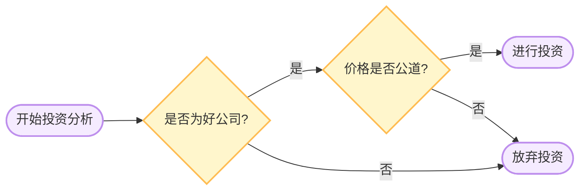

# 价格公道的好公司：巴菲特投资理念的核心

> 关键词：巴菲特投资理念、价格公道、好公司、价值投资、内在价值、安全边际

> 摘要：本文深入剖析了巴菲特投资理念中“价格公道的好公司”这一核心思想。从背景介绍入手，阐述了理解该理念的目的和范围，明确预期读者。接着详细解释核心概念，分析“好公司”和“价格公道”的内涵及联系，并给出相应的示意图和流程图。通过数学模型和公式，如现金流折现模型，深入讲解如何评估公司价值。结合实际案例，展示在项目实战中如何运用该理念进行投资分析。探讨了其在不同市场环境下的实际应用场景，推荐了学习该理念的工具和资源，包括书籍、在线课程等。最后总结未来投资趋势与挑战，解答常见问题，为投资者全面理解和运用巴菲特的投资理念提供系统的指导。

## 1. 背景介绍 
### 1.1 目的和范围
本部分旨在全面解读巴菲特投资理念中“价格公道的好公司”这一核心观点。目的是帮助投资者理解该理念的本质、评估方法以及在实际投资中的应用，从而提升投资决策的质量。范围涵盖对“好公司”的定义、价值评估方法、价格与价值的关系分析，以及该理念在不同市场环境下的应用案例。

### 1.2 预期读者
本文预期读者包括各类投资者，无论是个人投资者、专业投资机构从业者，还是对投资知识感兴趣的初学者。同时，对于企业管理者和金融研究人员，也可从中获取对企业价值评估和投资决策的新视角。

### 1.3 文档结构概述
本文首先介绍巴菲特投资理念的背景信息，为后续内容奠定基础。接着阐述核心概念，包括“好公司”和“价格公道”的具体含义及相互关系，并通过示意图和流程图直观展示。然后详细讲解核心算法原理，使用 Python 代码实现价值评估算法。通过数学模型和公式深入分析公司价值的计算方法，并举例说明。在项目实战部分，提供实际案例，展示如何运用该理念进行投资分析。探讨其在不同领域的实际应用场景，推荐相关的学习工具和资源。最后总结未来投资趋势与挑战，解答常见问题，并提供扩展阅读和参考资料。

### 1.4 术语表
#### 1.4.1 核心术语定义
- **好公司**：具有持续竞争优势、稳定现金流、优秀管理团队和良好企业文化的企业，能够在长期内为股东创造价值。
- **价格公道**：股票价格与公司内在价值相匹配或存在一定折扣，使得投资者能够以合理的价格购买到具有较高价值的股票。
- **内在价值**：公司未来预期现金流的现值，是评估公司真实价值的重要指标。
- **安全边际**：股票价格低于内在价值的差额，为投资者提供了一定的风险缓冲。

#### 1.4.2 相关概念解释
- **持续竞争优势**：企业在市场中相对于竞争对手所拥有的长期优势，如品牌优势、成本优势、技术优势等，能够使其在长期内保持较高的盈利能力。
- **现金流折现模型**：一种通过预测公司未来现金流，并将其折现到当前的方法，用于计算公司的内在价值。
- **股东权益回报率（ROE）**：衡量公司运用自有资本的效率，反映股东权益的收益水平。

#### 1.4.3 缩略词列表
- **ROE**：股东权益回报率（Return on Equity）
- **DCF**：现金流折现模型（Discounted Cash Flow）

## 2. 核心概念与联系 
### 核心概念原理
#### 好公司
好公司是巴菲特投资理念的基石。一个好公司通常具有以下特征：
- **强大的竞争优势**：如可口可乐的品牌优势，其品牌在全球范围内具有极高的知名度和美誉度，使得消费者对其产品具有较高的忠诚度。这种品牌优势能够为公司带来持续的销售收入和利润增长。
- **稳定的现金流**：好公司能够在长期内产生稳定的现金流，这是公司生存和发展的基础。例如，公用事业公司由于其业务的稳定性，通常能够产生稳定的现金流。
- **优秀的管理团队**：管理团队的能力和素质直接影响公司的发展方向和运营效率。像苹果公司的史蒂夫·乔布斯，他以卓越的创新能力和领导才能带领苹果成为全球最具价值的公司之一。
- **良好的企业文化**：积极向上的企业文化能够增强员工的凝聚力和归属感，提高公司的运营效率。例如，谷歌以其开放、创新的企业文化吸引了大量优秀人才，推动了公司的持续发展。

#### 价格公道
价格公道强调股票价格与公司内在价值的匹配程度。投资者应该以合理的价格购买股票，而不是盲目追求低价或高价。当股票价格低于公司内在价值时，投资者可以获得安全边际，降低投资风险。例如，当一家公司的内在价值为每股 100 元，而其股票价格为每股 80 元时，投资者以 80 元的价格购买该股票，就获得了 20 元的安全边际。

### 架构的文本示意图
```plaintext
巴菲特投资理念
|
|-- 好公司
|   |-- 持续竞争优势
|   |-- 稳定现金流
|   |-- 优秀管理团队
|   |-- 良好企业文化
|
|-- 价格公道
|   |-- 内在价值评估
|   |-- 安全边际计算
```

### Mermaid 流程图


## 3. 核心算法原理 & 具体操作步骤 
### 现金流折现模型原理
现金流折现模型（DCF）是评估公司内在价值的核心方法。其基本原理是将公司未来预期的现金流折现到当前，以计算公司的内在价值。公式如下：
$$V = \sum_{t=1}^{n} \frac{CF_t}{(1 + r)^t} + \frac{TV}{(1 + r)^n}$$
其中：
- $V$ 表示公司的内在价值
- $CF_t$ 表示第 $t$ 期的现金流
- $r$ 表示折现率
- $n$ 表示预测期数
- $TV$ 表示终值

### Python 代码实现
```python
def dcf_valuation(cash_flows, discount_rate, terminal_value):
    """
    计算公司的内在价值
    :param cash_flows: 未来各期的现金流列表
    :param discount_rate: 折现率
    :param terminal_value: 终值
    :return: 公司的内在价值
    """
    n = len(cash_flows)
    present_value = 0
    for t in range(n):
        present_value += cash_flows[t] / ((1 + discount_rate) ** (t + 1))
    present_value += terminal_value / ((1 + discount_rate) ** n)
    return present_value

# 示例数据
cash_flows = [100, 120, 150, 180, 200]
discount_rate = 0.1
terminal_value = 1000

# 计算内在价值
intrinsic_value = dcf_valuation(cash_flows, discount_rate, terminal_value)
print(f"公司的内在价值为: {intrinsic_value}")
```
### 具体操作步骤
1. **预测现金流**：通过对公司历史财务数据的分析和对未来市场趋势的预测，估计公司未来各期的现金流。
2. **确定折现率**：折现率反映了投资者对投资回报的要求，通常可以使用加权平均资本成本（WACC）作为折现率。
3. **计算终值**：终值是指预测期结束后公司的价值，可以使用永续增长模型或退出倍数法进行计算。
4. **计算内在价值**：将未来各期的现金流和终值折现到当前，得到公司的内在价值。

## 4. 数学模型和公式 & 详细讲解 & 举例说明 
### 现金流折现模型详细讲解
#### 现金流预测
现金流预测是 DCF 模型的关键步骤。可以采用以下方法进行预测：
- **历史数据分析法**：通过分析公司过去几年的财务报表，了解公司的现金流变化趋势，以此为基础预测未来现金流。
- **行业分析**：研究行业的发展趋势和市场规模，结合公司在行业中的地位，预测公司未来的市场份额和销售收入，进而估算现金流。
- **宏观经济分析**：考虑宏观经济因素对公司业务的影响，如 GDP 增长率、通货膨胀率等，对现金流预测进行调整。

#### 折现率确定
折现率的确定需要考虑多种因素，包括无风险利率、市场风险溢价和公司特定风险。加权平均资本成本（WACC）是常用的折现率计算方法，公式如下：
$$WACC = E/V \times r_e + D/V \times r_d \times (1 - T_c)$$
其中：
- $E$ 表示股权价值
- $D$ 表示债务价值
- $V = E + D$ 表示公司总价值
- $r_e$ 表示股权成本
- $r_d$ 表示债务成本
- $T_c$ 表示公司所得税税率

#### 终值计算
常用的终值计算方法有永续增长模型和退出倍数法。
- **永续增长模型**：假设公司在预测期结束后以固定的增长率持续增长，公式如下：
$$TV = \frac{CF_{n+1}}{r - g}$$
其中：
- $CF_{n+1}$ 表示预测期结束后下一期的现金流
- $r$ 表示折现率
- $g$ 表示永续增长率

- **退出倍数法**：根据行业平均的估值倍数，如市盈率（P/E）、市净率（P/B）等，乘以公司预测期结束时的净利润或净资产，得到终值。

### 举例说明
假设一家公司未来 5 年的现金流预测如下：第 1 年为 100 万元，第 2 年为 120 万元，第 3 年为 150 万元，第 4 年为 180 万元，第 5 年为 200 万元。折现率为 10%，预测期结束后公司的永续增长率为 3%。
1. **计算预测期内现金流的现值**：
$$PV_1 = \frac{100}{(1 + 0.1)^1} = 90.91$$
$$PV_2 = \frac{120}{(1 + 0.1)^2} = 99.17$$
$$PV_3 = \frac{150}{(1 + 0.1)^3} = 112.70$$
$$PV_4 = \frac{180}{(1 + 0.1)^4} = 122.94$$
$$PV_5 = \frac{200}{(1 + 0.1)^5} = 124.18$$
预测期内现金流的现值总和为：
$$PV_{total} = 90.91 + 99.17 + 112.70 + 122.94 + 124.18 = 549.90$$
2. **计算终值**：
首先计算第 6 年的现金流：
$$CF_6 = 200 \times (1 + 0.03) = 206$$
然后使用永续增长模型计算终值：
$$TV = \frac{206}{0.1 - 0.03} = 2942.86$$
终值的现值为：
$$PV_{TV} = \frac{2942.86}{(1 + 0.1)^5} = 1827.72$$
3. **计算公司的内在价值**：
$$V = PV_{total} + PV_{TV} = 549.90 + 1827.72 = 2377.62$$
因此，该公司的内在价值约为 2377.62 万元。

## 5. 项目实战：代码实际案例和详细解释说明 
### 5.1  开发环境搭建
#### 安装 Python
首先需要安装 Python 环境，建议使用 Python 3.7 及以上版本。可以从 Python 官方网站（https://www.python.org/downloads/）下载并安装。

#### 安装必要的库
在命令行中使用以下命令安装所需的库：
```sh
pip install pandas numpy matplotlib
```
- **pandas**：用于数据处理和分析。
- **numpy**：用于数值计算。
- **matplotlib**：用于数据可视化。

### 5.2  源代码详细实现和代码解读
```python
import pandas as pd
import numpy as np
import matplotlib.pyplot as plt

# 读取财务数据
data = pd.read_csv('financial_data.csv')

# 提取现金流数据
cash_flows = data['CashFlow'].values

# 假设折现率和终值
discount_rate = 0.1
terminal_value = 1000

# 定义现金流折现模型函数
def dcf_valuation(cash_flows, discount_rate, terminal_value):
    n = len(cash_flows)
    present_value = 0
    for t in range(n):
        present_value += cash_flows[t] / ((1 + discount_rate) ** (t + 1))
    present_value += terminal_value / ((1 + discount_rate) ** n)
    return present_value

# 计算内在价值
intrinsic_value = dcf_valuation(cash_flows, discount_rate, terminal_value)
print(f"公司的内在价值为: {intrinsic_value}")

# 可视化现金流
plt.plot(range(1, len(cash_flows) + 1), cash_flows)
plt.xlabel('Year')
plt.ylabel('Cash Flow')
plt.title('Cash Flow Projection')
plt.show()
```
### 代码解读与分析
1. **数据读取**：使用 `pandas` 库的 `read_csv` 函数读取包含财务数据的 CSV 文件，并提取现金流数据。
2. **假设参数**：假设折现率为 0.1，终值为 1000。
3. **现金流折现模型函数**：定义 `dcf_valuation` 函数，用于计算公司的内在价值。
4. **计算内在价值**：调用 `dcf_valuation` 函数，传入现金流数据、折现率和终值，计算公司的内在价值。
5. **可视化现金流**：使用 `matplotlib` 库绘制现金流的折线图，直观展示公司未来现金流的变化趋势。

## 6. 实际应用场景 
### 股票投资
在股票投资中，巴菲特的“价格公道的好公司”理念具有重要的指导意义。投资者可以通过分析公司的基本面，筛选出具有持续竞争优势、稳定现金流的好公司。然后使用 DCF 模型等方法评估公司的内在价值，寻找价格低于内在价值的股票进行投资。例如，巴菲特在投资可口可乐时，通过对其品牌优势、市场份额和现金流的分析，认为可口可乐是一家好公司，并在其股票价格合理时进行了大量投资，获得了丰厚的回报。

### 企业并购
在企业并购中，收购方需要评估目标公司的价值，以确定合理的收购价格。“价格公道的好公司”理念可以帮助收购方筛选出具有潜力的目标公司，并通过准确评估其内在价值，避免支付过高的收购价格。例如，在一些行业整合的并购案例中，收购方会选择具有技术优势或市场份额的好公司进行收购，以实现协同效应和价值提升。

### 风险投资
在风险投资领域，投资者需要寻找具有高增长潜力的创业公司进行投资。虽然创业公司的未来现金流具有较大的不确定性，但“好公司”的一些特征，如创新能力、优秀的管理团队和市场潜力，仍然是投资者关注的重点。投资者可以通过对创业公司的商业模式、技术实力和市场前景的分析，评估其未来的发展潜力，并在价格合理时进行投资。

## 7. 工具和资源推荐
### 7.1 学习资源推荐
#### 7.1.1 书籍推荐
- 《聪明的投资者》（The Intelligent Investor）：本杰明·格雷厄姆（Benjamin Graham）著，是价值投资领域的经典之作，对巴菲特的投资理念产生了深远影响。
- 《巴菲特致股东的信：股份公司教程》（Letters to Shareholders of Berkshire Hathaway）：沃伦·巴菲特（Warren Buffett）著，通过巴菲特历年致股东的信，深入了解他的投资思想和方法。
- 《穷查理宝典：查理·芒格的智慧箴言录》（Poor Charlie's Almanack: The Wit and Wisdom of Charles T. Munger）：彼得·考夫曼（Peter D. Kaufman）编著，介绍了查理·芒格的投资哲学和多元思维模型。

#### 7.1.2 在线课程
- Coursera 上的“投资学原理”（Principles of Investing）课程，由宾夕法尼亚大学教授授课，系统介绍投资学的基本原理和方法。
- edX 上的“价值投资基础”（Fundamentals of Value Investing）课程，帮助学习者掌握价值投资的核心概念和分析方法。

#### 7.1.3 技术博客和网站
- 价值投资网（https://www.valueinvestorsclub.com/）：提供价值投资相关的研究报告、案例分析和投资策略讨论。
- 雪球网（https://xueqiu.com/）：国内知名的投资社区，投资者可以在上面交流投资经验、分享研究成果。

### 7.2 开发工具框架推荐
#### 7.2.1 IDE和编辑器
- PyCharm：功能强大的 Python 集成开发环境，提供代码编辑、调试、版本控制等功能。
- Jupyter Notebook：交互式编程环境，适合进行数据探索和模型验证。

#### 7.2.2 调试和性能分析工具
- pdb：Python 自带的调试器，用于调试 Python 代码。
- cProfile：Python 标准库中的性能分析工具，用于分析代码的运行时间和性能瓶颈。

#### 7.2.3 相关框架和库
- pandas：用于数据处理和分析，提供高效的数据结构和数据分析工具。
- numpy：用于数值计算，提供高性能的多维数组对象和数学函数。
- scikit-learn：用于机器学习和数据分析，提供各种机器学习算法和工具。

### 7.3 相关论文著作推荐
#### 7.3.1 经典论文
- 《证券分析》（Security Analysis）：本杰明·格雷厄姆和大卫·多德（David Dodd）著，奠定了价值投资的理论基础。
- 《有效市场假说》（Efficient Market Hypothesis）：尤金·法玛（Eugene F. Fama）提出，探讨了市场效率和股票价格的关系。

#### 7.3.2 最新研究成果
- 《行为金融学》（Behavioral Finance）：研究投资者的心理和行为对投资决策的影响，为投资分析提供了新的视角。
- 《量化投资》（Quantitative Investment）：结合数学模型和计算机技术，进行投资策略的开发和优化。

#### 7.3.3 应用案例分析
- 《巴菲特的投资组合》（The Warren Buffett Portfolio）：罗伯特·哈格斯特朗（Robert G. Hagstrom）著，分析了巴菲特的投资组合和投资策略。
- 《金融炼金术》（The Alchemy of Finance）：乔治·索罗斯（George Soros）著，通过他的投资实践，阐述了反身性理论在金融市场中的应用。

## 8. 总结：未来发展趋势与挑战
### 未来发展趋势
- **科技与投资的融合**：随着人工智能、大数据等技术的发展，投资领域将更加依赖科技手段进行数据分析和决策。例如，使用机器学习算法对海量的财务数据和市场信息进行分析，挖掘投资机会。
- **可持续投资的兴起**：投资者越来越关注企业的社会责任和可持续发展能力，可持续投资将成为未来的重要趋势。例如，投资于环保、新能源等领域的企业，既能获得经济回报，又能为社会做出贡献。
- **全球化投资**：随着全球经济一体化的加深，投资者将更加关注全球市场的投资机会。跨境投资和多元化投资组合将成为投资者的重要选择。

### 挑战
- **市场不确定性增加**：全球政治、经济环境的不确定性增加，如贸易摩擦、地缘政治冲突等，给投资带来了更大的风险。投资者需要更加谨慎地评估市场风险，制定合理的投资策略。
- **科技变革带来的挑战**：科技的快速发展使得企业的竞争格局发生了巨大变化，一些传统行业面临着被颠覆的风险。投资者需要不断学习和更新知识，适应科技变革带来的挑战。
- **投资者情绪的影响**：投资者情绪对市场波动的影响越来越大，市场的非理性波动可能导致投资者做出错误的决策。投资者需要保持理性，避免被情绪左右。

## 9. 附录：常见问题与解答
### 如何判断一家公司是否为好公司？
判断一家公司是否为好公司可以从以下几个方面入手：
- **竞争优势**：分析公司在市场中的竞争地位，是否具有品牌优势、成本优势、技术优势等。
- **财务状况**：查看公司的财务报表，关注营收、利润、现金流等指标的变化趋势。
- **管理团队**：了解管理团队的背景、经验和能力，评估其领导能力和决策水平。
- **企业文化**：考察公司的企业文化是否积极向上，是否有利于员工的发展和公司的长期稳定。

### 如何确定折现率？
折现率的确定需要考虑多种因素，常用的方法是使用加权平均资本成本（WACC）。具体步骤如下：
1. 确定股权成本：可以使用资本资产定价模型（CAPM）计算股权成本。
2. 确定债务成本：根据公司的债务利率和信用评级，确定债务成本。
3. 计算股权价值和债务价值：根据公司的财务报表，计算股权价值和债务价值。
4. 计算 WACC：使用 WACC 公式计算折现率。

### 现金流折现模型有哪些局限性？
现金流折现模型的局限性主要包括：
- **现金流预测的不确定性**：未来现金流的预测存在较大的不确定性，受到市场环境、行业竞争、公司战略等多种因素的影响。
- **折现率的主观性**：折现率的确定具有一定的主观性，不同的投资者可能会使用不同的折现率，导致计算结果的差异。
- **终值计算的难度**：终值的计算通常基于一些假设，如永续增长率的假设，这些假设的合理性会影响终值的计算结果。

## 10. 扩展阅读 & 参考资料
### 扩展阅读
- 《金融市场与金融机构》（Financial Markets and Institutions）：介绍金融市场的基本原理和金融机构的运作模式。
- 《投资心理学》（Investment Psychology）：探讨投资者的心理和行为对投资决策的影响。

### 参考资料
- 公司财务报表和年报，可从公司官方网站或证券交易所网站获取。
- 金融数据提供商，如 Bloomberg、Wind 等，提供丰富的金融数据和分析工具。

作者：AI天才研究院/AI Genius Institute & 禅与计算机程序设计艺术 /Zen And The Art of Computer Programming