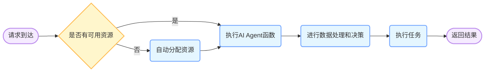

# 企业AI Agent的serverless架构优化

> 关键词：企业AI Agent、serverless架构、架构优化、成本效益、性能提升

> 摘要：本文聚焦于企业AI Agent的serverless架构优化。首先介绍了相关背景，包括目的、预期读者等内容。接着阐述核心概念与联系，通过示意图和流程图直观展示。详细讲解核心算法原理，用Python代码说明具体操作步骤，同时给出数学模型和公式并举例。在项目实战部分，从开发环境搭建到源代码实现及解读进行了全面分析。探讨了实际应用场景，推荐了学习资源、开发工具框架和相关论文著作。最后总结未来发展趋势与挑战，提供常见问题解答和扩展阅读参考。旨在帮助企业在AI Agent应用中更好地运用serverless架构，提升成本效益和性能表现。

## 1. 背景介绍 
### 1.1 目的和范围
随着人工智能技术的飞速发展，企业AI Agent在各个领域得到了广泛应用。Serverless架构以其弹性伸缩、按需计费等优势，成为企业部署AI Agent的一种理想选择。本文章的目的在于深入探讨如何对企业AI Agent的serverless架构进行优化，以提高系统的性能、降低成本、增强可维护性。范围涵盖了从核心概念的理解到实际项目的开发与部署，以及对未来发展趋势的展望。

### 1.2 预期读者
本文主要面向企业中的技术决策者、软件架构师、开发人员以及对AI Agent和serverless架构感兴趣的技术爱好者。对于希望在企业中应用AI Agent并采用serverless架构的相关人员，本文将提供有价值的技术指导和实践经验。

### 1.3 文档结构概述
本文将按照以下结构展开：首先介绍核心概念与联系，帮助读者建立对企业AI Agent和serverless架构的基本认识；接着详细讲解核心算法原理和具体操作步骤，通过Python代码进行演示；然后给出数学模型和公式，并举例说明；在项目实战部分，介绍开发环境搭建、源代码实现和代码解读；探讨实际应用场景；推荐相关的工具和资源；最后总结未来发展趋势与挑战，提供常见问题解答和扩展阅读参考。

### 1.4 术语表
#### 1.4.1 核心术语定义
- **企业AI Agent**：是指在企业环境中运行的，能够自主感知环境、做出决策并执行相应任务的人工智能程序。它可以模拟人类的智能行为，处理各种复杂的业务逻辑。
- **Serverless架构**：一种云计算架构模型，用户无需管理服务器基础设施，只需要关注应用程序的代码。云服务提供商负责服务器的管理、维护和扩展，用户根据实际使用的资源量进行计费。

#### 1.4.2 相关概念解释
- **函数即服务（FaaS）**：是serverless架构的一种实现方式，用户将代码封装成一个个独立的函数，云服务提供商根据请求自动触发函数的执行。
- **容器**：是一种轻量级的虚拟化技术，将应用程序及其依赖项打包成一个独立的容器，确保应用程序在不同环境中具有一致的运行效果。

#### 1.4.3 缩略词列表
- **AI**：Artificial Intelligence，人工智能
- **FaaS**：Function as a Service，函数即服务
- **API**：Application Programming Interface，应用程序编程接口

## 2. 核心概念与联系 

### 核心概念原理
企业AI Agent是一种智能化的程序，它通过各种传感器或接口获取环境信息，运用机器学习、深度学习等算法进行数据分析和决策，最终执行相应的任务。例如，在企业的客户服务场景中，AI Agent可以自动回复客户的咨询，根据客户的问题提供相应的解决方案。

Serverless架构则是一种基于云计算的架构模型，它将服务器的管理和维护工作交给云服务提供商。用户只需要编写应用程序的代码，并将其部署到云平台上。当有请求到来时，云平台会自动分配资源并执行相应的代码。Serverless架构具有弹性伸缩、按需计费等优点，可以大大降低企业的运维成本。

### 架构的文本示意图
```plaintext
企业AI Agent
├── 感知层
│   ├── 数据采集
│   ├── 信息获取
├── 决策层
│   ├── 数据分析
│   ├── 模型推理
├── 执行层
│   ├── 任务执行
│   ├── 结果反馈

Serverless架构
├── 函数即服务（FaaS）
│   ├── 代码函数
│   ├── 事件触发
├── 后端即服务（BaaS）
│   ├── 数据库
│   ├── 存储服务
```

### Mermaid流程图


## 3. 核心算法原理 & 具体操作步骤 

### 核心算法原理
企业AI Agent通常会使用机器学习和深度学习算法进行数据分析和决策。例如，在自然语言处理任务中，常用的算法包括循环神经网络（RNN）、长短时记忆网络（LSTM）和Transformer等。这些算法可以对文本数据进行处理和分析，实现文本分类、情感分析、机器翻译等功能。

在serverless架构中，核心算法的执行通常以函数的形式存在。当有请求到来时，云平台会自动触发相应的函数，并为其分配所需的资源。函数执行完成后，将结果返回给调用者。

### 具体操作步骤
以下是一个使用Python实现的简单企业AI Agent示例，该示例使用了朴素贝叶斯算法进行文本分类。

```python
import numpy as np
from sklearn.feature_extraction.text import CountVectorizer
from sklearn.naive_bayes import MultinomialNB

# 训练数据
train_data = [
    "This is a positive review",
    "This is a negative review",
    "The product is great",
    "The service is terrible"
]
train_labels = [1, 0, 1, 0]

# 特征提取
vectorizer = CountVectorizer()
X_train = vectorizer.fit_transform(train_data)

# 训练模型
model = MultinomialNB()
model.fit(X_train, train_labels)

# 预测函数
def predict_sentiment(text):
    X_test = vectorizer.transform([text])
    prediction = model.predict(X_test)
    return prediction[0]

# 测试
test_text = "This product is amazing"
result = predict_sentiment(test_text)
print(f"Predicted sentiment: {'Positive' if result == 1 else 'Negative'}")
```

### 代码解释
1. **数据准备**：定义训练数据和对应的标签。
2. **特征提取**：使用`CountVectorizer`将文本数据转换为向量表示。
3. **模型训练**：使用`MultinomialNB`训练朴素贝叶斯模型。
4. **预测函数**：定义一个函数`predict_sentiment`，用于对新的文本数据进行预测。
5. **测试**：对一个测试文本进行预测，并输出预测结果。

## 4. 数学模型和公式 & 详细讲解 & 举例说明 

### 数学模型
在文本分类任务中，朴素贝叶斯算法是基于贝叶斯定理的一种分类算法。贝叶斯定理的公式如下：

$$P(c|x) = \frac{P(x|c)P(c)}{P(x)}$$

其中，$P(c|x)$ 表示在给定特征 $x$ 的情况下，类别 $c$ 的概率；$P(x|c)$ 表示在类别 $c$ 的情况下，特征 $x$ 的概率；$P(c)$ 表示类别 $c$ 的先验概率；$P(x)$ 表示特征 $x$ 的概率。

在朴素贝叶斯算法中，假设特征之间是相互独立的，因此可以将 $P(x|c)$ 表示为各个特征的条件概率的乘积：

$$P(x|c) = \prod_{i=1}^{n}P(x_i|c)$$

其中，$x_i$ 表示第 $i$ 个特征。

### 详细讲解
朴素贝叶斯算法的核心思想是通过计算每个类别的后验概率 $P(c|x)$，选择后验概率最大的类别作为预测结果。具体步骤如下：
1. **计算先验概率 $P(c)$**：统计每个类别在训练数据中出现的频率。
2. **计算条件概率 $P(x_i|c)$**：统计每个特征在每个类别中出现的频率。
3. **计算后验概率 $P(c|x)$**：根据贝叶斯定理和特征独立性假设，计算每个类别的后验概率。
4. **选择最大后验概率的类别**：将后验概率最大的类别作为预测结果。

### 举例说明
假设有一个文本分类任务，训练数据如下：

| 文本 | 类别 |
| ---- | ---- |
| "This is a positive review" | 正类 |
| "This is a negative review" | 负类 |

首先，计算先验概率：
- $P(正类) = \frac{1}{2}$
- $P(负类) = \frac{1}{2}$

然后，计算条件概率：
- 对于特征 "positive"，在正类中出现的频率为 1，在负类中出现的频率为 0，因此 $P(positive|正类) = 1$，$P(positive|负类) = 0$。
- 对于特征 "negative"，在正类中出现的频率为 0，在负类中出现的频率为 1，因此 $P(negative|正类) = 0$，$P(negative|负类) = 1$。

假设测试文本为 "This is a positive review"，计算后验概率：
- $P(正类|文本) = \frac{P(文本|正类)P(正类)}{P(文本)} = \frac{P(positive|正类)P(is|正类)P(a|正类)P(review|正类)P(正类)}{P(文本)} = \frac{1 \times 1 \times 1 \times 1 \times \frac{1}{2}}{P(文本)}$
- $P(负类|文本) = \frac{P(文本|负类)P(负类)}{P(文本)} = \frac{P(positive|负类)P(is|负类)P(a|负类)P(review|负类)P(负类)}{P(文本)} = \frac{0 \times 1 \times 1 \times 1 \times \frac{1}{2}}{P(文本)}$

由于 $P(正类|文本) > P(负类|文本)$，因此预测结果为正类。

## 5. 项目实战：代码实际案例和详细解释说明 

### 5.1  开发环境搭建
#### 选择云服务提供商
常见的云服务提供商包括亚马逊AWS、谷歌云平台（GCP）、微软Azure等。这里以AWS为例进行说明。

#### 创建AWS账户
访问AWS官网，按照提示创建一个新的AWS账户。

#### 安装AWS CLI
AWS CLI是一个命令行工具，用于与AWS服务进行交互。可以通过以下命令安装：

```bash
pip install awscli
```

#### 配置AWS CLI
使用以下命令配置AWS CLI：

```bash
aws configure
```

输入AWS的访问密钥、秘密访问密钥、区域等信息。

### 5.2  源代码详细实现和代码解读
以下是一个使用AWS Lambda实现的企业AI Agent示例，该示例使用了Flask框架来处理HTTP请求。

```python
import json
from flask import Flask, request

app = Flask(__name__)

# 模拟AI Agent的预测函数
def predict(text):
    # 这里可以替换为实际的AI模型预测代码
    if "positive" in text:
        return 1
    else:
        return 0

@app.route('/predict', methods=['POST'])
def predict_api():
    data = request.get_json()
    text = data.get('text')
    if text is None:
        return json.dumps({"error": "Missing 'text' field"}), 400
    result = predict(text)
    sentiment = "Positive" if result == 1 else "Negative"
    return json.dumps({"sentiment": sentiment})

def lambda_handler(event, context):
    # 将API Gateway的事件转换为Flask请求
    from werkzeug.datastructures import Headers
    from werkzeug.wrappers import Request

    headers = Headers(event.get('headers', {}))
    body = event.get('body', '')
    if event.get('isBase64Encoded', False):
        import base64
        body = base64.b64decode(body)
    request = Request.from_values(
        path=event.get('path', ''),
        method=event.get('httpMethod', 'GET'),
        headers=headers,
        data=body
    )

    with app.request_context(request.environ):
        response = app.full_dispatch_request()
        return {
            'statusCode': response.status_code,
            'headers': dict(response.headers),
            'body': response.get_data(as_text=True)
        }
```

### 5.3  代码解读与分析
1. **Flask应用**：定义了一个Flask应用，包含一个`/predict`的API接口，用于处理文本分类请求。
2. **预测函数**：定义了一个简单的预测函数`predict`，根据文本中是否包含 "positive" 来判断情感极性。
3. **Lambda处理函数**：`lambda_handler`函数将API Gateway的事件转换为Flask请求，并调用Flask应用进行处理。最后将处理结果返回给API Gateway。

## 6. 实际应用场景 
### 客户服务
企业可以使用AI Agent来自动回复客户的咨询，提高客户服务的效率和质量。例如，在电商平台中，AI Agent可以根据客户的问题提供商品信息、订单状态查询等服务。

### 智能营销
AI Agent可以分析客户的行为数据和偏好，为企业提供个性化的营销方案。例如，根据客户的购买历史和浏览记录，推荐相关的产品和优惠活动。

### 风险评估
在金融领域，AI Agent可以对客户的信用风险进行评估，帮助银行和金融机构做出更准确的贷款决策。例如，分析客户的财务数据、信用记录等信息，预测客户的违约概率。

### 流程自动化
企业可以使用AI Agent来自动化一些繁琐的业务流程，提高工作效率。例如，在人力资源管理中，AI Agent可以自动筛选简历、安排面试等。

## 7. 工具和资源推荐
### 7.1 学习资源推荐
#### 7.1.1 书籍推荐
- 《人工智能：一种现代的方法》：全面介绍了人工智能的基本概念、算法和应用。
- 《Python机器学习》：详细讲解了Python在机器学习中的应用，包括数据处理、模型训练和评估等内容。
- 《深度学习》：由深度学习领域的三位先驱所著，深入探讨了深度学习的理论和实践。

#### 7.1.2 在线课程
- Coursera上的《机器学习》课程：由斯坦福大学的Andrew Ng教授授课，是机器学习领域的经典课程。
- edX上的《人工智能导论》课程：介绍了人工智能的基本概念和算法。
- Udemy上的《Python深度学习实战》课程：通过实际项目讲解Python在深度学习中的应用。

#### 7.1.3 技术博客和网站
- Medium：有很多关于人工智能和serverless架构的技术文章。
- Towards Data Science：专注于数据科学和机器学习领域的技术博客。
- AWS官方博客：提供了关于AWS服务和应用的最新技术信息。

### 7.2 开发工具框架推荐
#### 7.2.1 IDE和编辑器
- PyCharm：是一款专门为Python开发设计的集成开发环境，具有强大的代码编辑、调试和项目管理功能。
- Visual Studio Code：是一款轻量级的代码编辑器，支持多种编程语言和插件扩展。
- Jupyter Notebook：是一个交互式的开发环境，适合进行数据分析和模型训练。

#### 7.2.2 调试和性能分析工具
- AWS CloudWatch：可以监控AWS资源的性能和日志信息，帮助开发人员进行调试和性能优化。
- Google Cloud Debugger：可以在不影响应用程序运行的情况下进行调试，提高开发效率。
- New Relic：是一款应用性能管理工具，可以实时监控应用程序的性能和错误信息。

#### 7.2.3 相关框架和库
- TensorFlow：是一个开源的深度学习框架，提供了丰富的工具和库，用于构建和训练深度学习模型。
- PyTorch：是另一个流行的深度学习框架，具有简洁易用的接口和高效的计算性能。
- Scikit-learn：是一个用于机器学习的Python库，提供了各种机器学习算法和工具，方便开发人员进行数据处理和模型训练。

### 7.3 相关论文著作推荐
#### 7.3.1 经典论文
- "A Mathematical Theory of Communication"：由Claude Shannon发表，奠定了信息论的基础。
- "Neural Networks and Deep Learning"：由Michael Nielsen所著，详细介绍了神经网络和深度学习的基本原理和算法。
- "Attention Is All You Need"：提出了Transformer模型，是自然语言处理领域的重要突破。

#### 7.3.2 最新研究成果
- 可以关注顶级学术会议如NeurIPS、ICML、ACL等的论文，了解人工智能领域的最新研究动态。
- 一些知名的研究机构如OpenAI、DeepMind等也会发布相关的研究成果。

#### 7.3.3 应用案例分析
- 可以参考一些企业的技术博客和案例分享，了解他们在AI Agent和serverless架构方面的应用经验和实践案例。

## 8. 总结：未来发展趋势与挑战
### 未来发展趋势
- **融合更多技术**：企业AI Agent将与物联网、区块链等技术进行深度融合，实现更广泛的应用场景。例如，在智能家居领域，AI Agent可以通过物联网设备获取家庭环境信息，实现智能化的控制和管理。
- **强化学习的应用**：强化学习可以使AI Agent在动态环境中不断学习和优化决策，未来将在机器人控制、自动驾驶等领域得到更广泛的应用。
- **边缘计算与Serverless的结合**：将边缘计算和serverless架构相结合，可以减少数据传输延迟，提高系统的响应速度和可靠性。

### 挑战
- **数据隐私和安全**：企业AI Agent需要处理大量的敏感数据，如何保障数据的隐私和安全是一个重要的挑战。需要采用加密技术、访问控制等手段来保护数据安全。
- **模型可解释性**：深度学习模型通常是黑盒模型，难以解释其决策过程。在一些关键领域，如医疗、金融等，模型的可解释性至关重要。
- **成本控制**：虽然serverless架构具有按需计费的优点，但在高并发场景下，成本可能会迅速增加。需要合理规划资源使用，优化架构设计，以降低成本。

## 9. 附录：常见问题与解答
### 问题1：企业AI Agent和传统软件有什么区别？
解答：企业AI Agent具有自主感知、决策和执行的能力，能够根据环境的变化自动调整行为。而传统软件通常是按照预设的规则和流程执行任务，缺乏智能决策的能力。

### 问题2：Serverless架构适合所有企业AI Agent应用吗？
解答：不是所有的企业AI Agent应用都适合serverless架构。对于一些对响应时间要求极高、需要长时间运行的任务，serverless架构可能不太适合。需要根据具体的应用场景和需求来选择合适的架构。

### 问题3：如何确保企业AI Agent的性能和可靠性？
解答：可以采用以下方法来确保企业AI Agent的性能和可靠性：选择合适的云服务提供商和硬件资源；进行性能测试和优化；采用冗余和容错机制；实时监控系统的运行状态。

## 10. 扩展阅读 & 参考资料
- 《Serverless架构实战》
- AWS官方文档
- 相关的学术论文和技术报告

作者：AI天才研究院/AI Genius Institute & 禅与计算机程序设计艺术 /Zen And The Art of Computer Programming