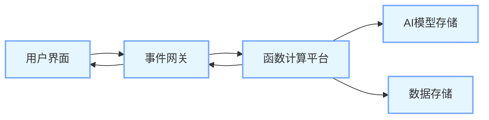

# 企业AI Agent的serverless架构设计

> 关键词：企业AI Agent、serverless架构、架构设计、云计算、人工智能

> 摘要：本文聚焦于企业AI Agent的serverless架构设计，旨在探讨如何利用serverless技术构建高效、灵活且成本可控的企业AI Agent系统。首先介绍了相关背景，包括目的范围、预期读者、文档结构和术语表。接着阐述了核心概念及其联系，通过文本示意图和Mermaid流程图进行清晰展示。详细讲解了核心算法原理和具体操作步骤，结合Python源代码进行说明。分析了数学模型和公式，并举例说明。通过项目实战，展示了开发环境搭建、源代码实现及解读。探讨了实际应用场景，推荐了学习资源、开发工具框架和相关论文著作。最后总结了未来发展趋势与挑战，还包含常见问题解答和扩展阅读参考资料。

## 1. 背景介绍 
### 1.1 目的和范围
在当今数字化时代，企业对于智能化的需求日益增长，AI Agent作为一种能够模拟人类智能进行交互和决策的技术，受到了广泛关注。然而，传统的架构在部署和管理企业AI Agent时面临着诸多挑战，如资源管理复杂、成本高昂、扩展性差等。本文的目的在于设计一种基于serverless架构的企业AI Agent解决方案，以解决上述问题。范围涵盖了从架构的概念设计、算法原理分析、数学模型构建到实际项目的开发与应用等多个方面。

### 1.2 预期读者
本文预期读者包括企业的技术决策者、AI开发工程师、云计算专家、软件架构师等。对于那些希望了解如何利用serverless架构构建企业AI Agent系统的人员，以及对AI和云计算技术结合感兴趣的专业人士，本文将提供有价值的参考。

### 1.3 文档结构概述
本文首先介绍背景信息，为后续内容奠定基础。接着阐述核心概念及其联系，使读者对企业AI Agent的serverless架构有一个整体的认识。然后详细讲解核心算法原理和具体操作步骤，通过Python代码进行演示。之后分析数学模型和公式，并举例说明其应用。通过项目实战，展示如何将理论应用到实际开发中。探讨实际应用场景，让读者了解该架构的实际价值。推荐相关的学习资源、开发工具框架和论文著作，帮助读者进一步深入学习。最后总结未来发展趋势与挑战，并提供常见问题解答和扩展阅读参考资料。

### 1.4 术语表
#### 1.4.1 核心术语定义
- **企业AI Agent**：是一种基于人工智能技术，能够在企业环境中模拟人类智能进行交互、决策和执行任务的软件实体。它可以与企业的各种系统和用户进行通信，提供智能服务。
- **serverless架构**：是一种云计算架构模型，在这种架构中，云服务提供商负责管理服务器基础设施，开发者无需关心服务器的部署、维护和扩展等问题，只需关注业务逻辑的实现。
- **云计算**：是一种基于互联网的计算方式，通过将计算资源、存储资源等提供给用户，用户可以根据需要随时使用这些资源，而无需自己构建和维护基础设施。

#### 1.4.2 相关概念解释
- **函数即服务（FaaS）**：是serverless架构的一种具体实现形式，开发者将业务逻辑封装成一个个独立的函数，云服务提供商根据函数的调用情况自动分配资源并执行函数。
- **事件驱动**：在serverless架构中，函数的执行通常是由事件触发的，例如用户的请求、数据的更新等。当特定事件发生时，相应的函数会被自动调用。

#### 1.4.3 缩略词列表
- **AI**：Artificial Intelligence，人工智能
- **FaaS**：Function as a Service，函数即服务

## 2. 核心概念与联系 

### 核心概念原理
企业AI Agent的serverless架构主要基于云计算和人工智能技术。在这种架构中，AI Agent的各个功能模块被拆分成多个独立的函数，这些函数运行在云服务提供商的serverless平台上。当有事件触发时，相应的函数会被自动调用，完成特定的任务。例如，当用户向企业AI Agent发送一个请求时，该请求会作为一个事件触发相应的函数，函数会对请求进行处理，调用AI模型进行推理，最后将结果返回给用户。

### 架构的文本示意图
企业AI Agent的serverless架构主要由以下几个部分组成：
1. **用户界面**：用户与企业AI Agent进行交互的界面，可以是网页、移动应用等。
2. **事件网关**：负责接收用户的请求和其他事件，并将其路由到相应的函数。
3. **函数计算平台**：云服务提供商提供的serverless平台，用于运行AI Agent的各个函数。
4. **AI模型存储**：存储AI Agent使用的各种模型，如自然语言处理模型、机器学习模型等。
5. **数据存储**：存储企业AI Agent所需的各种数据，如用户信息、历史交互记录等。

### Mermaid流程图


该流程图展示了企业AI Agent的serverless架构的基本工作流程。用户通过用户界面发送请求，请求经过事件网关路由到函数计算平台。函数计算平台根据请求调用相应的函数，函数可能会从AI模型存储和数据存储中获取所需的信息进行处理，最后将结果通过事件网关返回给用户。

## 3. 核心算法原理 & 具体操作步骤 

### 核心算法原理
企业AI Agent的核心算法主要包括自然语言处理算法、机器学习算法等。以自然语言处理为例，常见的算法有词法分析、句法分析、语义理解等。下面以简单的词法分析为例，介绍核心算法原理。

词法分析的目的是将输入的文本分割成一个个单词或词元。一种常用的词法分析算法是基于规则的算法，其基本原理是定义一组规则，根据这些规则对文本进行分割。例如，对于英文文本，可以根据空格、标点符号等进行分割。

### Python源代码实现
```python
import re

def lexical_analysis(text):
    # 定义正则表达式，用于匹配单词
    pattern = r'\w+'
    # 使用正则表达式进行匹配
    tokens = re.findall(pattern, text)
    return tokens

# 测试示例
text = "Hello, world! This is a test."
tokens = lexical_analysis(text)
print(tokens)
```
### 具体操作步骤
1. **定义规则**：根据需要分析的语言特点，定义合适的规则。在上述示例中，使用正则表达式 `\w+` 来匹配单词。
2. **文本输入**：将需要进行词法分析的文本作为输入传递给词法分析函数。
3. **规则匹配**：使用定义好的规则对输入文本进行匹配，找出符合规则的单词或词元。
4. **结果输出**：将匹配到的单词或词元作为结果返回。

## 4. 数学模型和公式 & 详细讲解 & 举例说明 

### 数学模型
在企业AI Agent中，很多算法都基于数学模型。以机器学习中的线性回归模型为例，其数学模型可以表示为：

$$y = \theta_0 + \theta_1x_1 + \theta_2x_2 + \cdots + \theta_nx_n + \epsilon$$

其中，$y$ 是预测值，$x_1, x_2, \cdots, x_n$ 是输入特征，$\theta_0, \theta_1, \cdots, \theta_n$ 是模型的参数，$\epsilon$ 是误差项。

### 公式详细讲解
- **参数 $\theta$**：模型的参数决定了输入特征与预测值之间的关系。通过训练数据，我们可以学习到最优的参数值，使得模型的预测值与实际值之间的误差最小。
- **误差项 $\epsilon$**：由于实际数据中存在噪声和不确定性，模型的预测值与实际值之间往往存在一定的误差，误差项 $\epsilon$ 就是用来表示这种误差的。

### 举例说明
假设我们要根据房屋的面积和卧室数量来预测房屋的价格。我们可以将房屋的面积作为 $x_1$，卧室数量作为 $x_2$，房屋的价格作为 $y$。则线性回归模型可以表示为：

$$y = \theta_0 + \theta_1x_1 + \theta_2x_2 + \epsilon$$

我们可以收集一些房屋的面积、卧室数量和价格的数据作为训练数据，通过最小化误差项 $\epsilon$ 的平方和来学习到最优的参数 $\theta_0, \theta_1, \theta_2$。然后，对于新的房屋面积和卧室数量，我们可以使用学习到的模型来预测房屋的价格。

```python
import numpy as np

# 训练数据
X = np.array([[100, 2], [120, 3], [150, 3], [200, 4]])
y = np.array([200000, 250000, 300000, 400000])

# 添加偏置项
X_b = np.c_[np.ones((X.shape[0], 1)), X]

# 使用正规方程求解参数
theta_best = np.linalg.inv(X_b.T.dot(X_b)).dot(X_b.T).dot(y)

# 新的房屋面积和卧室数量
new_X = np.array([[180, 3]])
new_X_b = np.c_[np.ones((new_X.shape[0], 1)), new_X]

# 预测房屋价格
predicted_price = new_X_b.dot(theta_best)
print("预测房屋价格：", predicted_price)
```

在上述代码中，我们首先定义了训练数据 $X$ 和 $y$，然后添加偏置项得到 $X_b$。使用正规方程求解最优的参数 $\theta_best$。最后，对于新的房屋面积和卧室数量，我们计算预测的房屋价格。

## 5. 项目实战：代码实际案例和详细解释说明 

### 5.1  开发环境搭建
#### 选择云服务提供商
目前市场上有很多云服务提供商提供serverless平台，如AWS Lambda、Azure Functions、Google Cloud Functions等。这里以AWS Lambda为例进行说明。

#### 创建AWS账户
首先需要在AWS官网注册一个账户，并完成相关的身份验证和设置。

#### 安装AWS CLI
AWS CLI是一个命令行工具，用于与AWS服务进行交互。可以从AWS官网下载并安装AWS CLI，并配置好访问密钥和区域信息。

#### 安装开发工具
可以选择使用Python作为开发语言，安装Python和相应的开发环境，如Anaconda、PyCharm等。

### 5.2  源代码详细实现和代码解读
#### 需求描述
我们要实现一个简单的企业AI Agent，该Agent可以接收用户的文本输入，对文本进行情感分析，并将分析结果返回给用户。

#### 源代码实现
```python
import boto3
import json
from transformers import AutoTokenizer, AutoModelForSequenceClassification
import torch

# 加载情感分析模型
tokenizer = AutoTokenizer.from_pretrained("distilbert-base-uncased-finetuned-sst-2-english")
model = AutoModelForSequenceClassification.from_pretrained("distilbert-base-uncased-finetuned-sst-2-english")

def lambda_handler(event, context):
    # 从事件中获取用户输入的文本
    text = event['text']
    
    # 对文本进行分词
    inputs = tokenizer(text, return_tensors='pt')
    
    # 使用模型进行情感分析
    outputs = model(**inputs)
    logits = outputs.logits
    prediction = torch.argmax(logits, dim=1).item()
    
    # 将预测结果转换为情感标签
    if prediction == 0:
        sentiment = "Negative"
    else:
        sentiment = "Positive"
    
    # 返回分析结果
    response = {
        "text": text,
        "sentiment": sentiment
    }
    
    return {
        'statusCode': 200,
        'body': json.dumps(response)
    }
```
#### 代码解读
1. **导入必要的库**：导入了boto3用于与AWS服务进行交互，json用于处理JSON数据，transformers库用于加载和使用预训练的情感分析模型，torch用于深度学习计算。
2. **加载情感分析模型**：使用 `AutoTokenizer` 和 `AutoModelForSequenceClassification` 从Hugging Face的模型库中加载预训练的情感分析模型。
3. **定义Lambda函数处理程序**：`lambda_handler` 是AWS Lambda函数的入口点，它接收两个参数：`event` 和 `context`。`event` 包含了触发函数的事件信息，`context` 包含了函数的运行上下文信息。
4. **获取用户输入的文本**：从 `event` 中获取用户输入的文本。
5. **对文本进行分词**：使用加载的分词器对文本进行分词，将文本转换为模型可以处理的输入格式。
6. **使用模型进行情感分析**：将分词后的输入传递给模型，得到模型的输出。通过 `torch.argmax` 函数获取预测结果的索引。
7. **将预测结果转换为情感标签**：根据预测结果的索引，将其转换为情感标签（Positive或Negative）。
8. **返回分析结果**：将用户输入的文本和情感分析结果封装成一个JSON对象，并返回给调用者。

### 5.3  代码解读与分析
#### 优点
- **灵活性**：使用serverless架构，无需关心服务器的部署和维护，开发人员可以专注于业务逻辑的实现。
- **可扩展性**：AWS Lambda可以根据请求的流量自动扩展函数的实例数量，确保系统的高可用性和性能。
- **成本效益**：serverless架构采用按使用量计费的模式，只有在函数被调用时才会产生费用，降低了企业的成本。

#### 挑战
- **冷启动问题**：当函数长时间未被调用时，再次调用时可能会出现冷启动问题，导致响应时间变长。
- **依赖管理**：在serverless环境中，需要将函数的依赖打包上传，依赖管理相对复杂。

## 6. 实际应用场景 
### 客户服务
企业AI Agent可以集成到企业的客户服务系统中，自动回答客户的常见问题，提供实时的帮助和支持。例如，电商企业可以使用AI Agent回答客户关于商品信息、订单状态等问题，提高客户服务效率。

### 智能营销
AI Agent可以分析用户的行为和偏好，为企业提供个性化的营销建议。例如，根据用户的浏览历史和购买记录，向用户推荐合适的商品和促销活动。

### 流程自动化
企业AI Agent可以自动化执行一些重复性的业务流程，如数据录入、报表生成等。通过与企业的各种系统进行集成，AI Agent可以自动获取数据，进行处理，并将结果反馈给相关人员。

### 安全监控
AI Agent可以实时监控企业的网络安全状况，检测异常行为和安全威胁。例如，通过分析网络流量数据，及时发现潜在的攻击行为，并采取相应的措施。

## 7. 工具和资源推荐
### 7.1 学习资源推荐
#### 7.1.1 书籍推荐
- 《Python深度学习》：介绍了Python在深度学习领域的应用，包括神经网络、卷积神经网络、循环神经网络等。
- 《人工智能：一种现代的方法》：全面介绍了人工智能的基本概念、算法和应用，是人工智能领域的经典教材。
- 《云计算与分布式系统：从并行处理到物联网》：讲解了云计算和分布式系统的基本原理和技术，对于理解serverless架构有很大帮助。

#### 7.1.2 在线课程
- Coursera上的“深度学习专项课程”：由深度学习领域的知名专家吴恩达教授授课，系统地介绍了深度学习的理论和实践。
- edX上的“云计算基础”：讲解了云计算的基本概念、架构和技术，适合初学者学习。
- Udemy上的“Python自然语言处理实战”：通过实际项目，介绍了Python在自然语言处理领域的应用。

#### 7.1.3 技术博客和网站
- Medium：上面有很多关于人工智能、云计算和serverless架构的技术文章和经验分享。
- Towards Data Science：专注于数据科学和人工智能领域，提供了很多高质量的技术文章和教程。
- AWS官方博客：提供了关于AWS服务的最新动态和技术文章，对于学习AWS Lambda等serverless服务很有帮助。

### 7.2 开发工具框架推荐
#### 7.2.1 IDE和编辑器
- PyCharm：一款功能强大的Python集成开发环境，提供了代码编辑、调试、版本控制等功能。
- Visual Studio Code：一款轻量级的代码编辑器，支持多种编程语言，并且有丰富的插件可以扩展功能。
- Jupyter Notebook：一种交互式的开发环境，适合进行数据分析和机器学习实验。

#### 7.2.2 调试和性能分析工具
- AWS X-Ray：AWS提供的分布式跟踪服务，可以帮助开发人员调试和分析serverless应用的性能。
- New Relic：一款性能监控和分析工具，可以实时监控应用的性能指标，帮助开发人员发现和解决问题。
- Py-Spy：一个用于Python程序的性能分析工具，可以分析Python程序的CPU使用情况和函数调用时间。

#### 7.2.3 相关框架和库
- Hugging Face Transformers：一个用于自然语言处理的开源库，提供了大量的预训练模型和工具，方便开发人员进行自然语言处理任务。
- TensorFlow：一个广泛使用的深度学习框架，提供了丰富的工具和接口，支持各种深度学习模型的开发和训练。
- PyTorch：另一个流行的深度学习框架，具有简洁的API和动态计算图的特点，适合快速开发和实验。

### 7.3 相关论文著作推荐
#### 7.3.1 经典论文
- “Attention Is All You Need”：提出了Transformer架构，是自然语言处理领域的重要突破。
- “Deep Residual Learning for Image Recognition”：提出了残差网络（ResNet），解决了深度学习中的梯度消失问题，提高了模型的训练效率和性能。
- “A Unified Approach to Interpreting Model Predictions”：介绍了一种统一的模型解释方法，帮助人们理解机器学习模型的决策过程。

#### 7.3.2 最新研究成果
- 在arXiv上搜索关于“serverless AI”、“enterprise AI agent”等关键词，可以找到很多最新的研究成果和论文。
- 关注顶级学术会议，如NeurIPS、ICML、CVPR等，这些会议上会发表很多关于人工智能和机器学习的最新研究成果。

#### 7.3.3 应用案例分析
- 各大云服务提供商的官方网站上会有很多关于serverless架构和AI Agent的应用案例分析，可以从中学习到实际应用中的经验和技巧。
- 一些技术博客和媒体也会报道企业在实际应用中使用AI Agent和serverless架构的案例，可以关注这些报道，了解行业动态。

## 8. 总结：未来发展趋势与挑战
### 未来发展趋势
- **智能化程度不断提高**：随着人工智能技术的不断发展，企业AI Agent的智能化程度将不断提高，能够更好地理解用户的需求，提供更加个性化的服务。
- **与其他技术深度融合**：企业AI Agent将与物联网、区块链、大数据等技术深度融合，创造出更多的应用场景和商业价值。
- **行业应用不断拓展**：企业AI Agent将在更多的行业得到应用，如金融、医疗、教育等，推动各行业的数字化转型。

### 挑战
- **数据隐私和安全问题**：企业AI Agent需要处理大量的用户数据，如何保障数据的隐私和安全是一个重要的挑战。
- **模型可解释性问题**：深度学习模型通常是黑盒模型，其决策过程难以解释。在一些对决策可解释性要求较高的领域，如医疗、金融等，如何提高模型的可解释性是一个亟待解决的问题。
- **人才短缺问题**：开发和应用企业AI Agent需要具备人工智能、云计算、软件开发等多方面的知识和技能，目前相关的专业人才短缺，这将制约企业AI Agent的发展。

## 9. 附录：常见问题与解答
### 问题1：serverless架构适合所有的企业AI Agent应用吗？
解答：不是所有的企业AI Agent应用都适合serverless架构。serverless架构适合那些具有突发性、短时间运行、对资源需求不固定的应用场景。对于一些需要长时间连续运行、对资源需求稳定的应用，传统的架构可能更合适。

### 问题2：如何解决serverless架构中的冷启动问题？
解答：可以采取以下几种方法来解决冷启动问题：
- **预热函数**：定期调用函数，保持函数的热状态。
- **使用预留并发**：AWS Lambda等平台提供了预留并发功能，可以为函数预留一定数量的实例，减少冷启动的概率。
- **优化函数代码和依赖**：减少函数的启动时间，如减少不必要的依赖加载。

### 问题3：如何保障企业AI Agent的数据安全？
解答：可以采取以下措施来保障企业AI Agent的数据安全：
- **数据加密**：对敏感数据进行加密处理，确保数据在传输和存储过程中的安全性。
- **访问控制**：设置严格的访问控制策略，限制对数据的访问权限。
- **安全审计**：定期对系统进行安全审计，及时发现和处理安全漏洞。

## 10. 扩展阅读 & 参考资料
- 《云原生技术实践》
- 《人工智能实战手册》
- AWS官方文档：https://docs.aws.amazon.com/
- Hugging Face官方文档：https://huggingface.co/docs
- arXiv论文库：https://arxiv.org/

作者：AI天才研究院/AI Genius Institute & 禅与计算机程序设计艺术 /Zen And The Art of Computer Programming