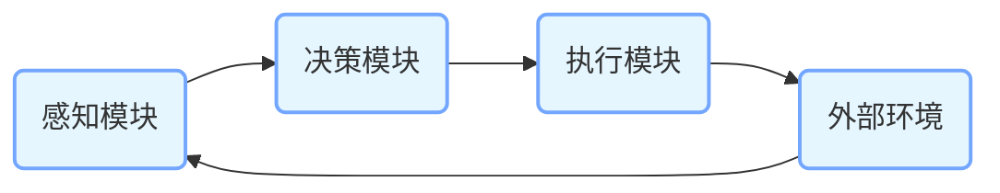
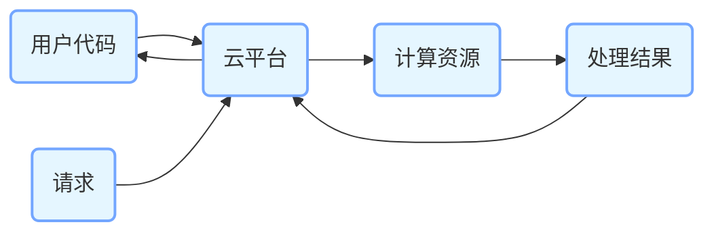

# 企业AI Agent的serverless计算资源调度

> 关键词：企业AI Agent、Serverless计算、资源调度、人工智能、云计算

> 摘要：本文聚焦于企业AI Agent的serverless计算资源调度这一关键主题。随着人工智能技术在企业中的广泛应用，AI Agent逐渐成为企业智能化运营的重要工具，而Serverless计算模式为其提供了高效、灵活的资源使用方式。文章深入探讨了相关核心概念、算法原理、数学模型，通过实际项目案例展示了如何进行资源调度的开发与实现，分析了实际应用场景，推荐了相关的学习资源、开发工具和论文著作，并对未来发展趋势与挑战进行了总结，旨在为企业在AI Agent的Serverless计算资源调度方面提供全面且深入的技术指导。

## 1. 背景介绍 
### 1.1 目的和范围
在当今数字化转型的浪潮下，企业对人工智能的应用需求日益增长。AI Agent作为一种能够自主执行任务、模拟人类智能行为的程序，在企业的客户服务、数据分析、自动化流程等多个领域发挥着重要作用。而Serverless计算模式，以其无需管理服务器基础设施、按需付费等特点，为企业提供了更高效、更经济的资源使用方式。本文章的目的在于深入探讨企业AI Agent在Serverless计算环境下的资源调度问题，包括核心概念、算法原理、实际应用等方面，范围涵盖从理论基础到项目实践的全过程。

### 1.2 预期读者
本文预期读者主要包括企业的技术决策者、人工智能工程师、云计算工程师、软件架构师等。对于希望了解如何在企业中有效应用AI Agent并结合Serverless计算进行资源调度的技术人员，以及对相关领域研究感兴趣的学者和学生，本文也具有较高的参考价值。

### 1.3 文档结构概述
本文将按照以下结构进行组织：首先介绍核心概念与联系，阐述企业AI Agent和Serverless计算的基本原理及其之间的关联；接着讲解核心算法原理和具体操作步骤，通过Python代码详细说明资源调度算法的实现；然后给出数学模型和公式，并结合具体例子进行详细讲解；之后通过项目实战展示代码的实际案例和详细解释；分析实际应用场景，探讨该技术在不同企业业务中的应用方式；推荐相关的工具和资源，包括学习资源、开发工具框架和论文著作；最后总结未来发展趋势与挑战，解答常见问题，并提供扩展阅读和参考资料。

### 1.4 术语表
#### 1.4.1 核心术语定义
- **企业AI Agent**：是指在企业环境中运行的，具备一定智能决策和自主执行任务能力的软件程序。它可以根据预设的规则和算法，与外部环境进行交互，完成诸如客户咨询解答、业务流程自动化等任务。
- **Serverless计算**：是一种云计算服务模型，用户无需管理服务器基础设施，只需编写和上传代码，云服务提供商根据实际的请求量自动分配和管理计算资源，并按照实际使用量进行计费。
- **资源调度**：是指根据任务的需求和资源的可用性，合理分配计算资源的过程，以达到提高资源利用率、降低成本、保证任务高效执行的目的。

#### 1.4.2 相关概念解释
- **人工智能（AI）**：是一门研究如何使计算机系统能够模拟人类智能的学科，包括机器学习、自然语言处理、计算机视觉等多个领域。企业AI Agent通常基于人工智能技术实现其智能决策和任务执行能力。
- **云计算**：是一种通过互联网提供计算资源（如服务器、存储、数据库等）的服务模式，用户可以根据需要灵活使用这些资源，而无需在本地进行大量的硬件投资和维护。Serverless计算是云计算的一种具体实现形式。

#### 1.4.3 缩略词列表
- **AI**：Artificial Intelligence（人工智能）
- **CPU**：Central Processing Unit（中央处理器）
- **GPU**：Graphics Processing Unit（图形处理器）
- **RAM**：Random Access Memory（随机存取存储器）

## 2. 核心概念与联系 
### 2.1 企业AI Agent原理
企业AI Agent通常由感知模块、决策模块和执行模块组成。感知模块负责收集外部环境的信息，例如通过自然语言处理技术获取客户的咨询问题，或者通过传感器收集业务数据。决策模块根据感知到的信息，运用机器学习算法或预设的规则进行分析和决策，确定下一步的行动方案。执行模块则根据决策结果执行相应的任务，如回复客户咨询、触发业务流程等。

其架构示意图如下：


### 2.2 Serverless计算原理
Serverless计算模式下，云服务提供商负责管理服务器基础设施，包括服务器的部署、配置、监控和维护等。用户只需将编写好的代码上传到云平台，云平台会根据实际的请求量自动启动和停止计算资源。当有请求到来时，云平台会迅速分配相应的资源来处理请求；当请求处理完成后，资源会被释放，用户无需为闲置的资源付费。

其架构示意图如下：


### 2.3 企业AI Agent与Serverless计算的联系
企业AI Agent在运行过程中需要消耗一定的计算资源，如CPU、GPU和RAM等。传统的计算模式需要企业自行购买和管理服务器，这不仅需要大量的前期投资，还需要专业的运维人员进行维护。而Serverless计算模式为企业AI Agent提供了一种更灵活、更经济的资源使用方式。企业可以将AI Agent的代码部署到Serverless平台上，根据实际的任务需求动态分配计算资源，无需担心服务器的管理和资源的闲置问题。同时，Serverless平台的弹性扩展能力可以确保企业AI Agent在面对高并发请求时能够快速响应，提高企业的业务处理效率。

## 3. 核心算法原理 & 具体操作步骤 
### 3.1 资源调度算法原理
在企业AI Agent的Serverless计算资源调度中，常用的算法是基于任务优先级和资源利用率的调度算法。该算法的核心思想是根据任务的优先级和资源的可用性，合理分配计算资源，以确保高优先级任务能够及时得到处理，同时提高资源的利用率。

具体步骤如下：
1. **任务优先级排序**：对所有待处理的任务按照优先级进行排序，优先级高的任务排在前面。
2. **资源可用性检查**：检查当前可用的计算资源，包括CPU、GPU和RAM等。
3. **任务分配**：从优先级高的任务开始，依次为每个任务分配合适的计算资源。如果当前可用资源能够满足任务的需求，则将任务分配给相应的资源；如果资源不足，则将任务放入等待队列，等待有足够的资源时再进行分配。
4. **资源释放**：当任务处理完成后，释放所占用的计算资源，以便其他任务使用。

### 3.2 Python代码实现
```python
import heapq

# 定义任务类
class Task:
    def __init__(self, id, priority, resource_requirement):
        self.id = id
        self.priority = priority
        self.resource_requirement = resource_requirement

    def __lt__(self, other):
        return self.priority > other.priority

# 定义资源调度器类
class ResourceScheduler:
    def __init__(self, total_resources):
        self.total_resources = total_resources
        self.available_resources = total_resources
        self.task_queue = []
        self.waiting_queue = []

    def add_task(self, task):
        heapq.heappush(self.task_queue, task)
        self._schedule_tasks()

    def _schedule_tasks(self):
        while self.task_queue:
            task = heapq.heappop(self.task_queue)
            if self.available_resources >= task.resource_requirement:
                self.available_resources -= task.resource_requirement
                print(f"Task {task.id} is assigned to resources.")
            else:
                heapq.heappush(self.waiting_queue, task)
                print(f"Task {task.id} is added to the waiting queue.")

    def task_completed(self, task):
        self.available_resources += task.resource_requirement
        print(f"Task {task.id} is completed. Resources are released.")
        self._schedule_tasks()

# 示例使用
if __name__ == "__main__":
    total_resources = 10
    scheduler = ResourceScheduler(total_resources)

    task1 = Task(1, 3, 3)
    task2 = Task(2, 1, 5)
    task3 = Task(3, 2, 2)

    scheduler.add_task(task1)
    scheduler.add_task(task2)
    scheduler.add_task(task3)

    scheduler.task_completed(task1)
```

### 3.3 代码解释
- **Task类**：用于表示一个任务，包含任务的ID、优先级和资源需求。`__lt__`方法用于实现任务的优先级排序。
- **ResourceScheduler类**：用于实现资源调度功能。`__init__`方法初始化总资源量、可用资源量、任务队列和等待队列。`add_task`方法将新任务添加到任务队列，并调用`_schedule_tasks`方法进行任务调度。`_schedule_tasks`方法根据任务的优先级和资源可用性进行任务分配。`task_completed`方法在任务处理完成后释放资源，并重新进行任务调度。
- **示例使用**：创建一个资源调度器对象，添加三个任务，并模拟任务完成的过程。

## 4. 数学模型和公式 & 详细讲解 & 举例说明 
### 4.1 数学模型
设任务集合为 $T = \{t_1, t_2, \cdots, t_n\}$，每个任务 $t_i$ 有一个优先级 $p_i$ 和资源需求 $r_i$。可用资源总量为 $R$。

定义一个决策变量 $x_{i}$，其中：
$$
x_{i} = 
\begin{cases}
1, & \text{如果任务 } t_i \text{ 被分配到资源} \\
0, & \text{否则}
\end{cases}
$$

目标是最大化完成的任务的优先级总和，即：
$$
\max \sum_{i=1}^{n} p_i x_i
$$

约束条件为：
$$
\sum_{i=1}^{n} r_i x_i \leq R
$$
$$
x_{i} \in \{0, 1\}, \quad i = 1, 2, \cdots, n
$$

### 4.2 详细讲解
这个数学模型的目标是在可用资源的限制下，尽可能多地完成高优先级的任务。决策变量 $x_i$ 用于表示任务 $t_i$ 是否被分配到资源。约束条件 $\sum_{i=1}^{n} r_i x_i \leq R$ 确保分配的资源总量不超过可用资源总量。

### 4.3 举例说明
假设有三个任务，其优先级和资源需求如下：
| 任务 | 优先级 ($p_i$) | 资源需求 ($r_i$) |
| ---- | ---- | ---- |
| $t_1$ | 3 | 3 |
| $t_2$ | 1 | 5 |
| $t_3$ | 2 | 2 |

可用资源总量 $R = 10$。

根据上述数学模型，我们可以列出以下线性规划问题：
$$
\max 3x_1 + 1x_2 + 2x_3
$$
$$
3x_1 + 5x_2 + 2x_3 \leq 10
$$
$$
x_1, x_2, x_3 \in \{0, 1\}
$$

通过求解这个线性规划问题，我们可以得到最优的任务分配方案。在这个例子中，最优方案是 $x_1 = 1$，$x_2 = 1$，$x_3 = 1$，即三个任务都可以被分配到资源，因为它们的资源需求总和为 $3 + 5 + 2 = 10$，刚好等于可用资源总量。

## 5. 项目实战：代码实际案例和详细解释说明 
### 5.1  开发环境搭建
#### 5.1.1 云平台选择
我们选择AWS Lambda作为Serverless计算平台，因为它具有广泛的应用和良好的兼容性。同时，我们使用Python作为开发语言，因为Python具有丰富的机器学习和数据处理库，适合开发企业AI Agent。

#### 5.1.2 环境配置
1. **安装AWS CLI**：AWS CLI是与AWS服务进行交互的命令行工具，通过以下命令进行安装：
```bash
pip install awscli
```
2. **配置AWS凭证**：在命令行中运行以下命令，配置AWS访问密钥和区域：
```bash
aws configure
```
3. **安装Python依赖库**：我们需要安装一些Python依赖库，如`boto3`（AWS SDK for Python），通过以下命令进行安装：
```bash
pip install boto3
```

### 5.2  源代码详细实现和代码解读
#### 5.2.1 企业AI Agent代码实现
```python
import json
import boto3

# 模拟AI Agent的决策逻辑
def ai_agent_decision(input_data):
    # 这里可以添加实际的AI算法，如机器学习模型预测
    if input_data["question"] == "What is the weather like today?":
        return "It's sunny today."
    else:
        return "I don't know the answer."

# AWS Lambda处理函数
def lambda_handler(event, context):
    input_data = json.loads(event['body'])
    result = ai_agent_decision(input_data)
    
    response = {
        "statusCode": 200,
        "headers": {
            "Content-Type": "application/json"
        },
        "body": json.dumps({"answer": result})
    }
    
    return response
```

#### 5.2.2 代码解读
- **ai_agent_decision函数**：模拟了企业AI Agent的决策逻辑，根据输入的问题返回相应的答案。在实际应用中，可以使用机器学习模型进行更复杂的决策。
- **lambda_handler函数**：是AWS Lambda的处理函数，当有请求到达时，该函数会被触发。它接收请求的JSON数据，调用`ai_agent_decision`函数进行决策，并返回处理结果。

### 5.3  代码解读与分析
#### 5.3.1 代码优势
- **灵活性**：通过将AI Agent的代码部署到AWS Lambda上，可以根据实际的请求量动态分配计算资源，无需担心服务器的管理和资源的闲置问题。
- **可扩展性**：可以轻松地扩展AI Agent的功能，例如添加更多的机器学习模型或优化决策逻辑。
- **易于维护**：使用Python语言和AWS Lambda平台，代码的开发和维护成本较低。

#### 5.3.2 潜在问题及解决方案
- **冷启动问题**：当AWS Lambda函数长时间闲置后，再次调用时会出现冷启动问题，导致响应时间变长。解决方案是使用AWS Lambda的预留并发功能，预先分配一定数量的计算资源，减少冷启动时间。
- **资源限制问题**：AWS Lambda对每个函数的资源使用有一定的限制，如内存、CPU时间等。如果AI Agent的任务需要大量的计算资源，可以考虑将任务拆分成多个小任务，或者使用其他计算服务。

## 6. 实际应用场景 
### 6.1 客户服务
企业可以使用AI Agent作为客户服务代表，通过自然语言处理技术与客户进行交互，解答客户的咨询问题。在Serverless计算环境下，根据客户的咨询量动态分配计算资源，确保在高并发情况下能够快速响应客户的请求。例如，电商企业在促销活动期间，客户咨询量会大幅增加，通过Serverless计算资源调度，可以及时处理大量的客户咨询，提高客户满意度。

### 6.2 数据分析
企业AI Agent可以用于数据分析和挖掘，通过对大量业务数据的分析，提供决策支持。在Serverless计算模式下，根据数据分析任务的复杂程度和数据量动态分配计算资源，提高数据分析的效率。例如，金融企业需要对海量的交易数据进行实时分析，通过Serverless计算资源调度，可以快速处理数据，及时发现潜在的风险和机会。

### 6.3 业务流程自动化
企业可以使用AI Agent实现业务流程的自动化，例如订单处理、库存管理等。在Serverless计算环境下，根据业务流程的执行情况动态分配计算资源，确保业务流程的高效执行。例如，制造业企业可以使用AI Agent自动处理订单，根据订单的数量和复杂度动态分配计算资源，提高订单处理的速度和准确性。

## 7. 工具和资源推荐
### 7.1 学习资源推荐
#### 7.1.1 书籍推荐
- 《人工智能：现代方法》：这本书是人工智能领域的经典教材，涵盖了人工智能的各个方面，包括机器学习、自然语言处理、知识表示等。
- 《Python深度学习》：介绍了如何使用Python和深度学习框架（如TensorFlow、Keras）进行深度学习模型的开发和训练。
- 《云计算实战》：详细讲解了云计算的原理、架构和应用，包括Serverless计算模式。

#### 7.1.2 在线课程
- Coursera上的“人工智能基础”课程：由知名高校的教授授课，系统地介绍了人工智能的基本概念和方法。
- Udemy上的“Python for Data Science and Machine Learning Bootcamp”课程：通过实际案例讲解如何使用Python进行数据科学和机器学习的开发。
- AWS官方培训课程：提供了关于AWS服务（包括AWS Lambda）的详细培训，帮助用户快速掌握Serverless计算的使用方法。

#### 7.1.3 技术博客和网站
- Medium上的人工智能和云计算相关博客：有很多技术专家和开发者分享的经验和见解。
- AWS官方博客：提供了关于AWS服务的最新动态和技术文章。
- 开源中国：是国内知名的开源技术社区，有很多关于人工智能和云计算的技术文章和讨论。

### 7.2 开发工具框架推荐
#### 7.2.1 IDE和编辑器
- PyCharm：是一款专业的Python集成开发环境，提供了丰富的代码编辑、调试和测试功能。
- Visual Studio Code：是一款轻量级的代码编辑器，支持多种编程语言和插件扩展，适合快速开发。

#### 7.2.2 调试和性能分析工具
- AWS CloudWatch：是AWS提供的监控和日志管理服务，可以用于监控AWS Lambda函数的性能和资源使用情况。
- Sentry：是一款开源的错误监控和性能分析工具，可以帮助开发者快速定位和解决代码中的问题。

#### 7.2.3 相关框架和库
- TensorFlow：是Google开发的开源深度学习框架，提供了丰富的深度学习模型和工具。
- PyTorch：是Facebook开发的开源深度学习框架，具有动态图和易于使用的特点。
- Boto3：是AWS SDK for Python，用于与AWS服务进行交互，包括AWS Lambda。

### 7.3 相关论文著作推荐
#### 7.3.1 经典论文
- “Artificial Intelligence: A New Synthesis”：介绍了人工智能的新方法和理论，对AI Agent的发展产生了重要影响。
- “Serverless Computing: One Step Forward, Two Steps Back”：对Serverless计算模式进行了深入的分析和探讨，指出了其优点和不足之处。

#### 7.3.2 最新研究成果
- 近年来，关于企业AI Agent和Serverless计算的研究不断涌现，可以通过IEEE Xplore、ACM Digital Library等学术数据库查找最新的研究论文。

#### 7.3.3 应用案例分析
- 一些知名企业（如Amazon、Google、Microsoft等）会分享他们在企业AI Agent和Serverless计算方面的应用案例，可以通过这些企业的官方博客和技术文档进行学习。

## 8. 总结：未来发展趋势与挑战
### 8.1 未来发展趋势
- **智能化程度不断提高**：随着人工智能技术的不断发展，企业AI Agent的智能化程度将不断提高，能够处理更加复杂的任务和问题，为企业提供更精准的决策支持。
- **与边缘计算的结合**：为了减少数据传输延迟，提高系统的响应速度，企业AI Agent将与边缘计算技术相结合，在边缘设备上进行部分数据处理和决策，减轻云端的计算压力。
- **多模态交互能力增强**：未来的企业AI Agent将具备更强的多模态交互能力，不仅可以通过文本和语音与用户进行交互，还可以通过图像、视频等多种方式进行信息的输入和输出。

### 8.2 挑战
- **安全和隐私问题**：企业AI Agent在处理企业敏感数据时，需要确保数据的安全和隐私。Serverless计算模式下，数据存储和处理的位置更加分散，增加了安全管理的难度。
- **资源调度的复杂性**：随着企业AI Agent的功能不断增强和应用场景的不断扩大，资源调度的复杂性也将增加。如何在保证任务高效执行的前提下，合理分配计算资源，是一个亟待解决的问题。
- **技术标准和规范的缺乏**：目前，企业AI Agent和Serverless计算领域还缺乏统一的技术标准和规范，这给企业的开发和应用带来了一定的困难。

## 9. 附录：常见问题与解答
### 9.1 什么是企业AI Agent？
企业AI Agent是指在企业环境中运行的，具备一定智能决策和自主执行任务能力的软件程序。它可以根据预设的规则和算法，与外部环境进行交互，完成诸如客户咨询解答、业务流程自动化等任务。

### 9.2 Serverless计算有哪些优点？
Serverless计算具有以下优点：
- 无需管理服务器基础设施，降低了运维成本。
- 按需付费，根据实际使用量进行计费，提高了资源利用率和成本效益。
- 弹性扩展能力强，能够根据请求量自动分配和管理计算资源，确保系统的高可用性和高性能。

### 9.3 如何解决AWS Lambda的冷启动问题？
可以使用AWS Lambda的预留并发功能，预先分配一定数量的计算资源，减少冷启动时间。此外，还可以通过优化代码结构、减少依赖库的加载等方式来缩短冷启动时间。

### 9.4 企业AI Agent和传统软件有什么区别？
企业AI Agent具有智能决策和自主执行任务的能力，能够根据外部环境的变化动态调整自己的行为。而传统软件通常是按照预设的程序逻辑执行任务，缺乏智能决策能力。

## 10. 扩展阅读 & 参考资料
### 10.1 扩展阅读
- 《人工智能简史》：了解人工智能的发展历程和重要里程碑。
- 《云计算与大数据》：深入学习云计算和大数据的相关技术和应用。

### 10.2 参考资料
- AWS官方文档：https://docs.aws.amazon.com/
- TensorFlow官方文档：https://www.tensorflow.org/api_docs
- PyTorch官方文档：https://pytorch.org/docs/stable/index.html

作者：AI天才研究院/AI Genius Institute & 禅与计算机程序设计艺术 /Zen And The Art of Computer Programming