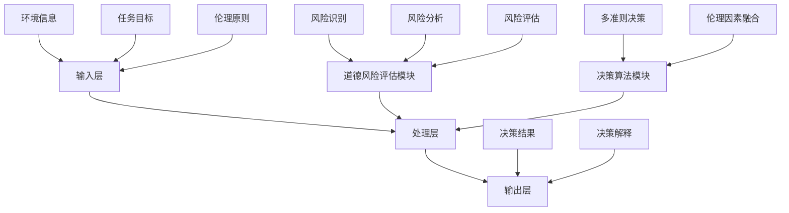

# 企业AI Agent的伦理决策框架

> 关键词：企业AI Agent、伦理决策框架、人工智能伦理、决策算法、应用场景

> 摘要：本文旨在深入探讨企业AI Agent的伦理决策框架。首先介绍了该研究的背景，包括目的、预期读者、文档结构和相关术语。接着阐述了核心概念及其联系，通过文本示意图和Mermaid流程图进行直观展示。详细讲解了核心算法原理，并用Python代码进行具体说明，同时给出了相关的数学模型和公式。通过项目实战案例，对开发环境搭建、源代码实现和代码解读进行了分析。还探讨了企业AI Agent伦理决策框架的实际应用场景，推荐了学习资源、开发工具框架以及相关论文著作。最后总结了未来发展趋势与挑战，提供了常见问题解答和扩展阅读参考资料，为企业在AI Agent伦理决策方面提供全面的指导。

## 1. 背景介绍 
### 1.1 目的和范围
随着人工智能技术的飞速发展，企业中越来越多地使用AI Agent来执行各种任务。然而，AI Agent的决策可能会对社会、环境和人类产生重大影响，因此建立伦理决策框架至关重要。本文的目的是构建一个全面的企业AI Agent伦理决策框架，涵盖从基本概念到实际应用的各个方面，为企业提供理论支持和实践指导。范围包括伦理决策的核心概念、算法原理、数学模型、项目实战、应用场景以及相关资源推荐等。

### 1.2 预期读者
本文预期读者主要包括企业的技术人员、管理人员、伦理专家，以及对人工智能伦理感兴趣的研究人员和学生。技术人员可以从中学习如何实现伦理决策算法，管理人员可以了解如何将伦理考量融入企业的AI战略，伦理专家可以参与框架的完善和评估，研究人员和学生可以将其作为研究和学习的参考。

### 1.3 文档结构概述
本文将按照以下结构进行组织：首先介绍核心概念与联系，帮助读者建立对企业AI Agent伦理决策的基本认识；接着详细阐述核心算法原理和具体操作步骤，并用Python代码进行说明；然后给出相关的数学模型和公式，并举例说明；通过项目实战展示如何在实际中应用该框架；探讨实际应用场景，说明其在不同行业的作用；推荐相关的工具和资源，方便读者进一步学习和实践；最后总结未来发展趋势与挑战，提供常见问题解答和扩展阅读参考资料。

### 1.4 术语表
#### 1.4.1 核心术语定义
- **企业AI Agent**：指在企业环境中运行的人工智能代理，能够自主感知环境、做出决策并采取行动，以实现企业的目标。
- **伦理决策框架**：是一套指导AI Agent在决策过程中考虑伦理因素的规则、原则和方法的集合。
- **伦理原则**：如公平、公正、透明、责任等，是伦理决策的基础和准则。
- **道德风险评估**：对AI Agent的决策可能带来的道德影响进行评估和分析。

#### 1.4.2 相关概念解释
- **人工智能伦理**：研究人工智能技术在开发、应用过程中涉及的伦理问题，如隐私保护、偏见消除、人类价值观的体现等。
- **决策算法**：AI Agent用于做出决策的算法，在伦理决策框架中需要考虑伦理因素的融入。
- **多准则决策**：考虑多个准则（如伦理准则、经济准则等）进行决策的方法。

#### 1.4.3 缩略词列表
- **AI**：Artificial Intelligence，人工智能
- **ML**：Machine Learning，机器学习
- **DL**：Deep Learning，深度学习

## 2. 核心概念与联系 
### 核心概念原理
企业AI Agent的伦理决策框架基于人工智能伦理的基本原理，旨在确保AI Agent的决策符合人类的伦理价值观。核心概念包括伦理原则、道德风险评估和决策算法。

伦理原则是伦理决策的基石，常见的伦理原则有公平性、公正性、透明度、责任性等。公平性要求AI Agent的决策不偏袒任何一方，避免因种族、性别等因素产生歧视；公正性强调决策的合理性和客观性；透明度要求决策过程和依据能够被理解和解释；责任性则明确了AI Agent及其开发者在决策中的责任。

道德风险评估是对AI Agent的决策可能带来的道德影响进行评估和分析。通过识别潜在的道德风险，如侵犯隐私、造成社会不平等、破坏环境等，可以采取相应的措施来降低风险。

决策算法是AI Agent做出决策的具体方法。在伦理决策框架中，决策算法需要考虑伦理原则和道德风险评估的结果，将伦理因素融入到决策过程中。

### 架构的文本示意图
```plaintext
企业AI Agent伦理决策框架
|-- 输入层
|   |-- 环境信息
|   |-- 任务目标
|   |-- 伦理原则
|-- 处理层
|   |-- 道德风险评估模块
|   |   |-- 风险识别
|   |   |-- 风险分析
|   |   |-- 风险评估
|   |-- 决策算法模块
|   |   |-- 多准则决策
|   |   |-- 伦理因素融合
|-- 输出层
|   |-- 决策结果
|   |-- 决策解释
```

### Mermaid流程图


## 3. 核心算法原理 & 具体操作步骤 
### 核心算法原理
企业AI Agent的伦理决策核心算法主要基于多准则决策和伦理因素融合。多准则决策是指在考虑多个准则的情况下做出最优决策。在伦理决策中，准则包括伦理原则和其他业务相关的准则，如成本、效率等。

伦理因素融合是将伦理原则融入到决策算法中。一种常见的方法是使用加权和的方式，为每个准则分配一个权重，然后计算每个决策方案的综合得分，选择得分最高的方案作为最终决策。

### 具体操作步骤
1. **数据收集**：收集环境信息、任务目标和伦理原则等输入数据。
2. **道德风险评估**：
    - **风险识别**：通过分析输入数据，识别可能存在的道德风险，如隐私泄露、歧视等。
    - **风险分析**：对识别出的风险进行深入分析，确定风险的可能性和影响程度。
    - **风险评估**：根据风险分析的结果，对风险进行评估，确定风险等级。
3. **决策算法执行**：
    - **多准则决策**：确定决策的准则，包括伦理准则和其他业务准则，并为每个准则分配权重。
    - **伦理因素融合**：将伦理原则融入到决策算法中，计算每个决策方案的综合得分。
4. **决策选择**：选择综合得分最高的决策方案作为最终决策。
5. **决策解释**：提供决策的解释，说明决策的依据和考虑的伦理因素。

### Python源代码详细阐述
```python
import numpy as np

# 定义伦理原则和业务准则
ethical_principles = ["公平性", "公正性", "透明度", "责任性"]
business_criteria = ["成本", "效率"]

# 定义准则的权重
weights = {
    "公平性": 0.2,
    "公正性": 0.2,
    "透明度": 0.2,
    "责任性": 0.2,
    "成本": 0.1,
    "效率": 0.1
}

# 定义决策方案
decision_options = [
    {"公平性": 0.8, "公正性": 0.7, "透明度": 0.6, "责任性": 0.8, "成本": 0.3, "效率": 0.7},
    {"公平性": 0.6, "公正性": 0.8, "透明度": 0.7, "责任性": 0.6, "成本": 0.4, "效率": 0.8},
    {"公平性": 0.7, "公正性": 0.6, "透明度": 0.8, "责任性": 0.7, "成本": 0.2, "效率": 0.6}
]

# 计算每个决策方案的综合得分
scores = []
for option in decision_options:
    score = 0
    for criterion, weight in weights.items():
        score += option[criterion] * weight
    scores.append(score)

# 选择得分最高的决策方案
best_option_index = np.argmax(scores)
best_option = decision_options[best_option_index]

print("最佳决策方案:", best_option)
print("综合得分:", scores[best_option_index])
```

## 4. 数学模型和公式 & 详细讲解 & 举例说明 
### 数学模型
企业AI Agent的伦理决策可以用多准则决策的数学模型来表示。设 $C = \{c_1, c_2, \cdots, c_n\}$ 为决策的准则集合，其中包括伦理准则和业务准则；$w_i$ 为准则 $c_i$ 的权重，满足 $\sum_{i=1}^{n} w_i = 1$；$A = \{a_1, a_2, \cdots, a_m\}$ 为决策方案集合；$x_{ij}$ 为方案 $a_j$ 在准则 $c_i$ 下的得分。

### 公式
综合得分公式为：
$$S_j = \sum_{i=1}^{n} w_i x_{ij}$$
其中 $S_j$ 为方案 $a_j$ 的综合得分。

### 详细讲解
该公式的含义是，每个决策方案的综合得分是其在各个准则下的得分乘以对应准则的权重之和。权重反映了每个准则在决策中的重要性，得分则表示方案在该准则下的表现。通过计算综合得分，可以对不同的决策方案进行比较和排序，选择得分最高的方案作为最优决策。

### 举例说明
假设我们有三个决策方案 $A = \{a_1, a_2, a_3\}$，四个伦理准则 $C_{ethical} = \{公平性, 公正性, 透明度, 责任性\}$ 和两个业务准则 $C_{business} = \{成本, 效率\}$。准则的权重分别为 $w_{公平性} = 0.2$，$w_{公正性} = 0.2$，$w_{透明度} = 0.2$，$w_{责任性} = 0.2$，$w_{成本} = 0.1$，$w_{效率} = 0.1$。

方案 $a_1$ 在各准则下的得分分别为 $x_{11} = 0.8$（公平性），$x_{21} = 0.7$（公正性），$x_{31} = 0.6$（透明度），$x_{41} = 0.8$（责任性），$x_{51} = 0.3$（成本），$x_{61} = 0.7$（效率）。

根据综合得分公式，方案 $a_1$ 的综合得分 $S_1$ 为：
$$S_1 = 0.2 \times 0.8 + 0.2 \times 0.7 + 0.2 \times 0.6 + 0.2 \times 0.8 + 0.1 \times 0.3 + 0.1 \times 0.7$$
$$S_1 = 0.16 + 0.14 + 0.12 + 0.16 + 0.03 + 0.07 = 0.68$$

同理，可以计算出方案 $a_2$ 和 $a_3$ 的综合得分，然后比较三个方案的得分，选择得分最高的方案作为最终决策。

## 5. 项目实战：代码实际案例和详细解释说明 
### 5.1  开发环境搭建
为了实现企业AI Agent的伦理决策框架，我们需要搭建以下开发环境：
1. **Python环境**：建议使用Python 3.7及以上版本。可以从Python官方网站（https://www.python.org/downloads/）下载并安装。
2. **开发工具**：可以使用PyCharm、Jupyter Notebook等开发工具。PyCharm是一个功能强大的Python集成开发环境，Jupyter Notebook则适合进行交互式开发和数据分析。
3. **必要的库**：需要安装NumPy库，用于数值计算。可以使用以下命令进行安装：
```sh
pip install numpy
```

### 5.2  源代码详细实现和代码解读
```python
import numpy as np

# 定义伦理原则和业务准则
ethical_principles = ["公平性", "公正性", "透明度", "责任性"]
business_criteria = ["成本", "效率"]

# 定义准则的权重
weights = {
    "公平性": 0.2,
    "公正性": 0.2,
    "透明度": 0.2,
    "责任性": 0.2,
    "成本": 0.1,
    "效率": 0.1
}

# 定义决策方案
decision_options = [
    {"公平性": 0.8, "公正性": 0.7, "透明度": 0.6, "责任性": 0.8, "成本": 0.3, "效率": 0.7},
    {"公平性": 0.6, "公正性": 0.8, "透明度": 0.7, "责任性": 0.6, "成本": 0.4, "效率": 0.8},
    {"公平性": 0.7, "公正性": 0.6, "透明度": 0.8, "责任性": 0.7, "成本": 0.2, "效率": 0.6}
]

# 计算每个决策方案的综合得分
scores = []
for option in decision_options:
    score = 0
    for criterion, weight in weights.items():
        score += option[criterion] * weight
    scores.append(score)

# 选择得分最高的决策方案
best_option_index = np.argmax(scores)
best_option = decision_options[best_option_index]

print("最佳决策方案:", best_option)
print("综合得分:", scores[best_option_index])
```
### 代码解读与分析
1. **导入必要的库**：导入NumPy库，用于进行数值计算。
2. **定义伦理原则和业务准则**：定义了四个伦理原则和两个业务准则，这些准则将作为决策的依据。
3. **定义准则的权重**：为每个准则分配了一个权重，权重反映了该准则在决策中的重要性。
4. **定义决策方案**：定义了三个决策方案，每个方案在各个准则下都有一个得分。
5. **计算综合得分**：通过遍历每个决策方案，根据综合得分公式计算每个方案的综合得分。
6. **选择最佳决策方案**：使用`np.argmax`函数选择得分最高的决策方案，并输出该方案和其综合得分。

## 6. 实际应用场景 
### 金融行业
在金融行业，企业AI Agent可以用于信贷审批、投资决策等场景。在信贷审批中，AI Agent需要考虑公平性原则，避免因种族、性别等因素对申请人产生歧视。通过伦理决策框架，可以对申请人的信用风险进行评估的同时，确保决策的公平性和公正性。在投资决策中，AI Agent需要考虑透明度原则，向投资者清晰地解释决策的依据和风险。

### 医疗行业
在医疗行业，企业AI Agent可以用于疾病诊断、治疗方案推荐等场景。在疾病诊断中，AI Agent需要考虑责任性原则，确保诊断结果的准确性和可靠性。如果诊断错误可能会对患者的健康造成严重影响，因此需要对诊断过程进行严格的伦理审查。在治疗方案推荐中，AI Agent需要考虑公平性原则，为不同经济状况的患者提供合适的治疗方案。

### 交通行业
在交通行业，企业AI Agent可以用于自动驾驶、交通流量管理等场景。在自动驾驶中，AI Agent需要考虑安全性和公正性原则。当遇到突发情况时，AI Agent需要在保护车内乘客安全的同时，尽量减少对其他道路使用者的伤害。在交通流量管理中，AI Agent需要考虑公平性原则，合理分配交通资源，避免某些区域交通拥堵而其他区域资源闲置。

## 7. 工具和资源推荐
### 7.1 学习资源推荐
#### 7.1.1 书籍推荐
- 《人工智能伦理》：全面介绍了人工智能伦理的基本概念、理论和实践问题，对企业AI Agent的伦理决策有深入的探讨。
- 《多准则决策方法及其应用》：详细介绍了多准则决策的方法和技术，对于理解企业AI Agent伦理决策中的多准则决策算法有很大帮助。

#### 7.1.2 在线课程
- Coursera上的“人工智能伦理”课程：由知名高校的教授授课，系统讲解了人工智能伦理的各个方面。
- edX上的“多准则决策分析”课程：提供了多准则决策的理论和实践教学，适合深入学习决策算法。

#### 7.1.3 技术博客和网站
- AI Ethics Lab（https://www.aiethicslab.org/）：专注于人工智能伦理的研究和实践，提供了丰富的案例和研究成果。
- Medium上的人工智能伦理相关博客：有很多专家和学者分享人工智能伦理的最新观点和研究进展。

### 7.2 开发工具框架推荐
#### 7.2.1 IDE和编辑器
- PyCharm：功能强大的Python集成开发环境，提供了代码编辑、调试、版本控制等丰富的功能。
- Jupyter Notebook：适合进行交互式开发和数据分析，方便对代码进行测试和验证。

#### 7.2.2 调试和性能分析工具
- PySnooper：可以自动记录函数的执行过程，方便调试代码。
- cProfile：Python自带的性能分析工具，可以分析代码的运行时间和内存使用情况。

#### 7.2.3 相关框架和库
- NumPy：用于数值计算，提供了高效的数组操作和数学函数。
- Pandas：用于数据处理和分析，方便对决策数据进行管理和处理。

### 7.3 相关论文著作推荐
#### 7.3.1 经典论文
- “Ethics of Artificial Intelligence and Robotics”：探讨了人工智能和机器人伦理的基本问题和挑战。
- “Multi-Criteria Decision Analysis: State of the Art Surveys”：对多准则决策分析的发展和现状进行了全面的综述。

#### 7.3.2 最新研究成果
- 关注顶级学术会议如AAAI、IJCAI等上关于人工智能伦理的研究论文，了解最新的研究动态。
- 查阅知名学术期刊如Artificial Intelligence、Journal of Artificial Intelligence Research等上的相关文章。

#### 7.3.3 应用案例分析
- 一些知名企业如谷歌、微软等发布的关于AI Agent伦理决策的案例分析报告，了解实际应用中的经验和教训。

## 8. 总结：未来发展趋势与挑战
### 未来发展趋势
- **伦理标准的统一化**：随着人工智能技术的广泛应用，全球范围内对人工智能伦理的关注度不断提高，未来可能会形成统一的伦理标准和规范，企业AI Agent的伦理决策框架也将更加标准化和规范化。
- **伦理决策的自动化**：随着技术的发展，未来企业AI Agent的伦理决策可能会实现更高程度的自动化。通过将伦理原则和规则嵌入到AI Agent的算法中，使其能够自动识别和处理伦理问题，减少人工干预。
- **与其他技术的融合**：企业AI Agent的伦理决策框架将与区块链、物联网等其他技术进行融合。例如，利用区块链的不可篡改特性来记录AI Agent的决策过程和结果，提高决策的透明度和可追溯性。

### 挑战
- **伦理原则的模糊性**：伦理原则往往具有一定的模糊性，不同的人对同一伦理原则可能有不同的理解和解释。在企业AI Agent的伦理决策中，如何准确地将伦理原则转化为具体的算法和规则是一个挑战。
- **数据的伦理问题**：AI Agent的决策依赖于大量的数据，而数据本身可能存在伦理问题，如数据偏见、隐私泄露等。如何处理这些数据伦理问题，确保AI Agent的决策基于公正、无偏见的数据是一个重要的挑战。
- **法律和监管的滞后性**：人工智能技术的发展速度远远超过了法律和监管的制定速度，目前关于企业AI Agent伦理决策的法律和监管还不够完善。如何建立健全相关的法律和监管体系，保障人工智能技术的健康发展是一个亟待解决的问题。

## 9. 附录：常见问题与解答
### 问题1：如何确定伦理准则的权重？
答：确定伦理准则的权重是一个复杂的过程，需要综合考虑多个因素。可以通过专家评估、问卷调查、历史数据分析等方法来确定权重。专家评估是邀请相关领域的专家根据经验和专业知识为准则分配权重；问卷调查可以收集不同利益相关者的意见和建议；历史数据分析则是通过分析过去的决策案例，找出各准则对决策结果的影响程度，从而确定权重。

### 问题2：如果决策方案在不同准则下的得分难以量化怎么办？
答：如果决策方案在不同准则下的得分难以量化，可以采用定性分析的方法。例如，可以将准则的得分分为几个等级，如高、中、低，然后根据方案在该准则下的表现进行评级。也可以使用模糊数学的方法，将定性的评价转化为定量的数值，再进行综合得分的计算。

### 问题3：企业AI Agent的伦理决策框架是否适用于所有行业？
答：企业AI Agent的伦理决策框架具有一定的通用性，但不同行业的伦理需求和业务特点可能有所不同。在实际应用中，需要根据行业的特点对框架进行适当的调整和优化。例如，金融行业更注重数据安全和隐私保护，医疗行业更注重患者的权益和健康，交通行业更注重安全性和公正性等。

## 10. 扩展阅读 & 参考资料
### 扩展阅读
- 《人工智能时代的人类责任》：探讨了在人工智能时代人类应承担的责任和义务，对理解企业AI Agent的伦理决策有一定的启发。
- 《智能社会的伦理挑战与应对》：分析了智能社会中面临的各种伦理挑战，并提出了相应的应对策略。

### 参考资料
- IEEE Global Initiative on Ethics of Autonomous and Intelligent Systems（https://ethicsinaction.ieee.org/）：提供了关于人工智能伦理的标准和指南。
- European Commission's High-Level Expert Group on Artificial Intelligence（https://ec.europa.eu/digital-single-market/en/high-level-expert-group-artificial-intelligence）：发布了关于人工智能伦理的报告和建议。

作者：AI天才研究院/AI Genius Institute & 禅与计算机程序设计艺术 /Zen And The Art of Computer Programming