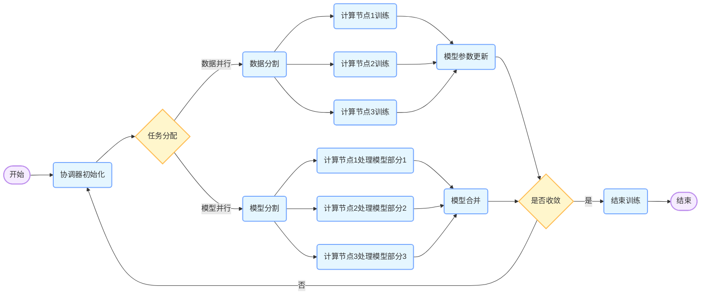

# 企业AI Agent的分布式学习平台设计

> 关键词：企业AI Agent、分布式学习平台、设计原理、算法实现、实际应用

> 摘要：本文聚焦于企业AI Agent的分布式学习平台设计，深入探讨其核心概念、算法原理、数学模型等关键内容。通过详细的代码示例和实际案例分析，阐述了该平台的开发环境搭建、源代码实现与解读。同时，介绍了相关的应用场景、工具资源推荐，并对未来发展趋势与挑战进行总结，旨在为企业构建高效、智能的AI Agent分布式学习平台提供全面且深入的技术指导。

## 1. 背景介绍 
### 1.1 目的和范围
随着人工智能技术的飞速发展，企业对于智能代理（AI Agent）的需求日益增长。AI Agent能够模拟人类的智能行为，自动执行各种任务，提高企业的运营效率和竞争力。然而，单个AI Agent的学习能力和处理能力有限，难以应对复杂多变的企业环境。分布式学习平台通过将多个AI Agent连接起来，实现数据和计算资源的共享，从而提高AI Agent的学习效率和性能。

本文的范围涵盖了企业AI Agent分布式学习平台的设计原理、核心算法、数学模型、实际应用等方面，旨在为企业提供一个全面的技术框架，帮助企业构建高效、智能的AI Agent分布式学习平台。

### 1.2 预期读者
本文预期读者包括企业的技术决策者、AI工程师、数据科学家、软件架构师等。对于希望了解企业AI Agent分布式学习平台设计的技术人员，以及对人工智能技术在企业应用感兴趣的相关人员，本文都具有一定的参考价值。

### 1.3 文档结构概述
本文共分为十个部分。第一部分介绍企业AI Agent分布式学习平台设计的背景，包括目的和范围、预期读者、文档结构概述和术语表。第二部分阐述核心概念与联系，包括AI Agent、分布式学习平台的原理和架构，并给出相应的示意图和流程图。第三部分讲解核心算法原理和具体操作步骤，使用Python源代码进行详细阐述。第四部分介绍数学模型和公式，并进行详细讲解和举例说明。第五部分通过项目实战，展示代码实际案例和详细解释说明。第六部分探讨实际应用场景。第七部分推荐相关的工具和资源。第八部分总结未来发展趋势与挑战。第九部分为附录，解答常见问题。第十部分提供扩展阅读和参考资料。

### 1.4 术语表
#### 1.4.1 核心术语定义
- **AI Agent（人工智能代理）**：能够感知环境、做出决策并采取行动的智能实体，可独立或与其他Agent协作完成任务。
- **分布式学习平台**：将多个计算节点连接起来，通过网络进行通信和协作，共同完成学习任务的平台。
- **模型参数**：描述AI Agent模型的数值，通过学习过程不断调整以提高模型性能。
- **梯度**：函数在某一点的变化率，用于优化模型参数。

#### 1.4.2 相关概念解释
- **分布式训练**：将训练任务分配到多个计算节点上并行执行，以加速训练过程。
- **数据并行**：将数据分割成多个子集，每个计算节点处理不同的子集，同时更新模型参数。
- **模型并行**：将模型分割成多个部分，每个计算节点负责不同的部分，协同完成训练任务。

#### 1.4.3 缩略词列表
- **GPU（Graphics Processing Unit）**：图形处理器，用于加速计算。
- **CPU（Central Processing Unit）**：中央处理器，计算机的核心组件。
- **MPI（Message Passing Interface）**：消息传递接口，用于分布式系统中的进程间通信。

## 2. 核心概念与联系 

### 2.1 AI Agent原理
AI Agent是基于人工智能技术构建的智能实体，其基本原理是通过感知环境获取信息，运用内部的决策模型进行推理和判断，然后采取相应的行动。AI Agent的决策模型通常基于机器学习算法，如深度学习、强化学习等。

以一个简单的智能客服AI Agent为例，它通过自然语言处理技术感知用户的问题，利用训练好的分类模型判断问题的类型，然后根据预先设定的规则或通过生成式模型生成回答，最后将回答发送给用户。

### 2.2 分布式学习平台架构
分布式学习平台的架构主要包括多个计算节点、通信网络和协调器。计算节点负责执行具体的学习任务，如模型训练、推理等。通信网络用于节点之间的数据传输和信息共享。协调器负责管理和调度整个平台的资源，确保各个节点之间的协作和同步。

以下是分布式学习平台架构的文本示意图：

```plaintext
+-------------------+
|    协调器         |
+-------------------+
       |
       | 通信网络
       |
+------+------+------+
|  计算节点1  |  计算节点2  |  计算节点3  |
+------+------+------+
```

### 2.3 Mermaid流程图


这个流程图展示了分布式学习平台的工作流程。首先，协调器进行初始化，然后根据任务类型进行数据并行或模型并行的任务分配。计算节点执行训练任务，之后进行模型参数更新或模型合并。最后，判断模型是否收敛，如果未收敛则继续训练，直到收敛为止。

## 3. 核心算法原理 & 具体操作步骤 

### 3.1 梯度下降算法原理
梯度下降算法是一种常用的优化算法，用于最小化损失函数。其基本思想是沿着损失函数的负梯度方向更新模型参数，直到找到损失函数的最小值。

假设我们有一个损失函数 $J(\theta)$，其中 $\theta$ 是模型参数。梯度下降算法的更新公式为：

$\theta_{t+1} = \theta_{t} - \alpha \nabla J(\theta_{t})$

其中，$\theta_{t}$ 是第 $t$ 次迭代的模型参数，$\alpha$ 是学习率，$\nabla J(\theta_{t})$ 是损失函数在 $\theta_{t}$ 处的梯度。

### 3.2 分布式梯度下降算法
在分布式学习平台中，为了加速训练过程，通常采用分布式梯度下降算法。该算法的基本步骤如下：

1. **数据分割**：将训练数据分割成多个子集，每个计算节点负责处理一个子集。
2. **局部训练**：每个计算节点在本地计算损失函数的梯度。
3. **梯度聚合**：将各个计算节点的梯度进行聚合，得到全局梯度。
4. **参数更新**：根据全局梯度更新模型参数。

### 3.3 Python源代码实现
以下是一个简单的分布式梯度下降算法的Python实现示例，使用 `torch` 库和 `torch.distributed` 模块：

```python
import torch
import torch.distributed as dist
import torch.multiprocessing as mp
import torch.nn as nn
import torch.optim as optim
from torch.nn.parallel import DistributedDataParallel as DDP


def setup(rank, world_size):
    os.environ['MASTER_ADDR'] = 'localhost'
    os.environ['MASTER_PORT'] = '12355'

    # initialize the process group
    dist.init_process_group("gloo", rank=rank, world_size=world_size)


def cleanup():
    dist.destroy_process_group()


class ToyModel(nn.Module):
    def __init__(self):
        super(ToyModel, self).__init__()
        self.net1 = nn.Linear(10, 10)
        self.relu = nn.ReLU()
        self.net2 = nn.Linear(10, 5)

    def forward(self, x):
        return self.net2(self.relu(self.net1(x)))


def demo_basic(rank, world_size):
    setup(rank, world_size)

    # create model and move it to GPU with id rank
    model = ToyModel().to(rank)
    ddp_model = DDP(model, device_ids=[rank])

    loss_fn = nn.MSELoss()
    optimizer = optim.SGD(ddp_model.parameters(), lr=0.001)

    # create some dummy data
    inputs = torch.randn(20, 10).to(rank)
    labels = torch.randn(20, 5).to(rank)

    optimizer.zero_grad()
    outputs = ddp_model(inputs)
    loss = loss_fn(outputs, labels)
    loss.backward()
    optimizer.step()

    cleanup()


def run_demo(demo_fn, world_size):
    mp.spawn(demo_fn,
             args=(world_size,),
             nprocs=world_size,
             join=True)


if __name__ == "__main__":
    n_gpus = torch.cuda.device_count()
    assert n_gpus >= 2, f"Requires at least 2 GPUs to run, but got {n_gpus}"
    world_size = n_gpus
    run_demo(demo_basic, world_size)


```

### 3.4 代码解释
1. **`setup` 函数**：用于初始化分布式环境，设置主节点的地址和端口，并初始化进程组。
2. **`cleanup` 函数**：用于销毁进程组，释放资源。
3. **`ToyModel` 类**：定义了一个简单的神经网络模型。
4. **`demo_basic` 函数**：实现了分布式训练的基本流程，包括模型创建、数据处理、前向传播、反向传播和参数更新。
5. **`run_demo` 函数**：使用 `mp.spawn` 函数启动多个进程，每个进程负责一个计算节点的训练任务。

## 4. 数学模型和公式 & 详细讲解 & 举例说明 

### 4.1 损失函数
损失函数用于衡量模型预测值与真实值之间的差异。常见的损失函数包括均方误差（MSE）、交叉熵损失等。

#### 4.1.1 均方误差（MSE）
均方误差是一种常用的回归损失函数，其公式为：

$$MSE(y, \hat{y}) = \frac{1}{n} \sum_{i=1}^{n} (y_{i} - \hat{y}_{i})^2$$

其中，$y$ 是真实值，$\hat{y}$ 是模型预测值，$n$ 是样本数量。

#### 4.1.2 交叉熵损失
交叉熵损失是一种常用的分类损失函数，其公式为：

$$CE(y, \hat{y}) = - \sum_{i=1}^{n} y_{i} \log(\hat{y}_{i})$$

其中，$y$ 是真实标签的概率分布，$\hat{y}$ 是模型预测的概率分布。

### 4.2 梯度计算
梯度是损失函数对模型参数的偏导数。以均方误差损失函数为例，假设模型为 $f(x; \theta)$，其中 $x$ 是输入，$\theta$ 是模型参数。则均方误差损失函数为：

$$J(\theta) = \frac{1}{n} \sum_{i=1}^{n} (y_{i} - f(x_{i}; \theta))^2$$

对 $\theta$ 求偏导数，得到梯度：

$$\nabla J(\theta) = \frac{2}{n} \sum_{i=1}^{n} (f(x_{i}; \theta) - y_{i}) \nabla f(x_{i}; \theta)$$

### 4.3 举例说明
假设我们有一个简单的线性回归模型 $f(x; \theta) = \theta_{0} + \theta_{1} x$，其中 $\theta_{0}$ 和 $\theta_{1}$ 是模型参数。训练数据为 $(x_{1}, y_{1}), (x_{2}, y_{2}), \cdots, (x_{n}, y_{n})$。

均方误差损失函数为：

$$J(\theta_{0}, \theta_{1}) = \frac{1}{n} \sum_{i=1}^{n} (y_{i} - (\theta_{0} + \theta_{1} x_{i}))^2$$

对 $\theta_{0}$ 求偏导数：

$$\frac{\partial J}{\partial \theta_{0}} = \frac{2}{n} \sum_{i=1}^{n} (\theta_{0} + \theta_{1} x_{i} - y_{i})$$

对 $\theta_{1}$ 求偏导数：

$$\frac{\partial J}{\partial \theta_{1}} = \frac{2}{n} \sum_{i=1}^{n} (\theta_{0} + \theta_{1} x_{i} - y_{i}) x_{i}$$

根据梯度下降算法，更新模型参数：

$$\theta_{0}^{t+1} = \theta_{0}^{t} - \alpha \frac{\partial J}{\partial \theta_{0}}$$

$$\theta_{1}^{t+1} = \theta_{1}^{t} - \alpha \frac{\partial J}{\partial \theta_{1}}$$

其中，$\alpha$ 是学习率。

## 5. 项目实战：代码实际案例和详细解释说明 

### 5.1  开发环境搭建
#### 5.1.1 硬件环境
- **服务器**：至少两台具有多核CPU和GPU的服务器，用于分布式计算。
- **网络**：高速稳定的网络连接，确保节点之间的数据传输效率。

#### 5.1.2 软件环境
- **操作系统**：Linux系统，如Ubuntu 18.04或更高版本。
- **Python**：Python 3.7或更高版本。
- **深度学习框架**：PyTorch 1.8或更高版本。
- **分布式通信库**：MPI（如OpenMPI）。

#### 5.1.3 环境配置步骤
1. 安装Python和相关依赖库：
```bash
sudo apt update
sudo apt install python3 python3-pip
pip3 install torch torchvision torchaudio
```
2. 安装MPI：
```bash
sudo apt install openmpi-bin openmpi-common libopenmpi-dev
```

### 5.2  源代码详细实现和代码解读
以下是一个更完整的企业AI Agent分布式学习平台的代码示例，使用PyTorch和MPI进行分布式训练：

```python
import torch
import torch.distributed as dist
import torch.multiprocessing as mp
import torch.nn as nn
import torch.optim as optim
from torch.nn.parallel import DistributedDataParallel as DDP
import os


def setup(rank, world_size):
    os.environ['MASTER_ADDR'] = 'localhost'
    os.environ['MASTER_PORT'] = '12355'

    # initialize the process group
    dist.init_process_group("gloo", rank=rank, world_size=world_size)


def cleanup():
    dist.destroy_process_group()


class SimpleModel(nn.Module):
    def __init__(self):
        super(SimpleModel, self).__init__()
        self.fc1 = nn.Linear(10, 20)
        self.relu = nn.ReLU()
        self.fc2 = nn.Linear(20, 1)

    def forward(self, x):
        x = self.fc1(x)
        x = self.relu(x)
        x = self.fc2(x)
        return x


def train(rank, world_size):
    setup(rank, world_size)

    # create model and move it to GPU with id rank
    model = SimpleModel().to(rank)
    ddp_model = DDP(model, device_ids=[rank])

    # define loss function and optimizer
    criterion = nn.MSELoss()
    optimizer = optim.SGD(ddp_model.parameters(), lr=0.001)

    # create some dummy data
    inputs = torch.randn(100, 10).to(rank)
    labels = torch.randn(100, 1).to(rank)

    num_epochs = 10
    for epoch in range(num_epochs):
        optimizer.zero_grad()
        outputs = ddp_model(inputs)
        loss = criterion(outputs, labels)
        loss.backward()
        optimizer.step()

        if rank == 0:
            print(f'Epoch {epoch + 1}/{num_epochs}, Loss: {loss.item()}')

    cleanup()


if __name__ == "__main__":
    world_size = 2  # number of processes
    mp.spawn(train, args=(world_size,), nprocs=world_size, join=True)