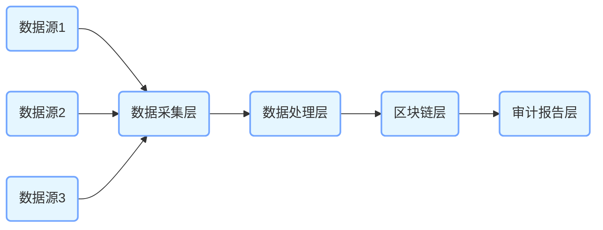

# 企业AI Agent的区块链数据审计系统

> 关键词：企业AI Agent、区块链、数据审计系统、智能合约、分布式账本

> 摘要：本文深入探讨了企业AI Agent的区块链数据审计系统。首先介绍了该系统的背景，包括目的、预期读者、文档结构和相关术语。接着阐述了核心概念与联系，展示了系统的架构和原理。详细讲解了核心算法原理及具体操作步骤，并给出Python源代码示例。通过数学模型和公式对系统进行了理论分析，并举例说明。在项目实战部分，介绍了开发环境搭建、源代码实现和代码解读。分析了该系统的实际应用场景，推荐了学习资源、开发工具框架和相关论文著作。最后总结了系统的未来发展趋势与挑战，还提供了常见问题解答和扩展阅读参考资料，旨在为企业构建和应用此类数据审计系统提供全面的技术指导。

## 1. 背景介绍 
### 1.1 目的和范围
随着企业数字化转型的加速，企业数据的规模和复杂性不断增加，数据的安全性、完整性和合规性成为企业面临的重要挑战。传统的数据审计方法在处理大规模、分布式数据时存在效率低下、易受攻击等问题。企业AI Agent的区块链数据审计系统旨在利用人工智能（AI）和区块链技术的优势，实现对企业数据的高效、安全、可信审计。

本系统的范围涵盖了企业内部各种数据源的数据审计，包括财务数据、业务数据、日志数据等。系统可以对数据的录入、存储、传输和使用过程进行实时监控和审计，确保数据的真实性、准确性和合规性。

### 1.2 预期读者
本文的预期读者包括企业的IT管理人员、数据审计人员、区块链技术开发者、人工智能研究人员以及对企业数据安全和审计感兴趣的技术爱好者。这些读者可以从本文中了解到如何结合AI和区块链技术构建企业数据审计系统，以及该系统的工作原理、实现方法和应用场景。

### 1.3 文档结构概述
本文将按照以下结构进行组织：
1. 背景介绍：介绍系统的目的、预期读者、文档结构和相关术语。
2. 核心概念与联系：阐述企业AI Agent、区块链和数据审计系统的核心概念，展示系统的架构和原理。
3. 核心算法原理 & 具体操作步骤：详细讲解系统中使用的核心算法，给出Python源代码示例，并说明具体的操作步骤。
4. 数学模型和公式 & 详细讲解 & 举例说明：通过数学模型和公式对系统进行理论分析，并举例说明。
5. 项目实战：代码实际案例和详细解释说明：介绍开发环境搭建、源代码实现和代码解读。
6. 实际应用场景：分析系统在不同企业场景下的应用。
7. 工具和资源推荐：推荐学习资源、开发工具框架和相关论文著作。
8. 总结：未来发展趋势与挑战：总结系统的未来发展趋势和面临的挑战。
9. 附录：常见问题与解答：提供常见问题的解答。
10. 扩展阅读 & 参考资料：提供扩展阅读的资料和参考文献。

### 1.4 术语表
#### 1.4.1 核心术语定义
- **企业AI Agent**：一种基于人工智能技术的智能代理，能够自主地执行企业数据审计任务，包括数据采集、分析、监控和报告等。
- **区块链**：一种分布式账本技术，通过密码学算法保证数据的不可篡改和可追溯性，实现去中心化的数据存储和管理。
- **数据审计系统**：用于对企业数据进行审查和验证的系统，确保数据的合规性、完整性和安全性。
- **智能合约**：一种基于区块链的自动化合约，能够在满足预设条件时自动执行，实现数据审计规则的自动化执行。
- **分布式账本**：一种去中心化的账本，多个节点共同维护账本的一致性，确保数据的可靠性和安全性。

#### 1.4.2 相关概念解释
- **去中心化**：区块链系统不依赖于单一的中心节点，而是由多个节点共同参与数据的存储和管理，提高了系统的可靠性和抗攻击能力。
- **共识机制**：区块链系统中用于达成节点间共识的算法，确保账本数据的一致性和完整性。常见的共识机制包括工作量证明（PoW）、权益证明（PoS）等。
- **哈希算法**：一种密码学算法，将任意长度的数据转换为固定长度的哈希值，哈希值具有唯一性和不可预测性，用于保证数据的完整性和真实性。

#### 1.4.3 缩略词列表
- **AI**：Artificial Intelligence，人工智能
- **PoW**：Proof of Work，工作量证明
- **PoS**：Proof of Stake，权益证明
- **API**：Application Programming Interface，应用程序编程接口

## 2. 核心概念与联系 

### 核心概念原理
#### 企业AI Agent
企业AI Agent是一种智能化的软件程序，它利用机器学习、自然语言处理等人工智能技术，能够理解企业的业务规则和审计需求。AI Agent可以自动采集企业各个数据源的数据，对数据进行清洗、预处理和特征提取，然后运用预训练的模型对数据进行分析和评估。例如，通过机器学习模型可以检测数据中的异常模式，如财务数据中的欺诈行为、业务数据中的违规操作等。

#### 区块链
区块链是一种分布式的数据库，它由一系列按时间顺序相连的区块组成。每个区块包含一定数量的交易记录，这些记录通过哈希算法进行加密和链接，形成一个不可篡改的链条。区块链的核心特点是去中心化、不可篡改和可追溯性。在数据审计系统中，区块链可以用于存储数据的审计记录，确保审计数据的真实性和完整性。例如，企业的每一次数据操作都可以记录在区块链上，任何试图篡改数据的行为都会被其他节点发现。

#### 数据审计系统
数据审计系统的主要功能是对企业的数据进行审查和验证，确保数据符合企业的内部规定和外部法规要求。系统通过设置一系列的审计规则，对数据的录入、存储、传输和使用过程进行监控和检查。当发现数据违反审计规则时，系统会及时发出警报，并生成审计报告。

### 架构的文本示意图
企业AI Agent的区块链数据审计系统主要由以下几个部分组成：
1. **数据采集层**：负责从企业的各个数据源（如数据库、文件系统、日志服务器等）采集数据，并将数据传输到数据处理层。
2. **数据处理层**：企业AI Agent对采集到的数据进行清洗、预处理和特征提取，然后运用机器学习模型对数据进行分析和评估。
3. **区块链层**：将数据审计的结果和相关记录存储在区块链上，确保数据的不可篡改和可追溯性。智能合约在区块链层实现审计规则的自动化执行。
4. **审计报告层**：根据区块链上的审计记录生成审计报告，并提供可视化的界面供审计人员查看和分析。

### Mermaid流程图


## 3. 核心算法原理 & 具体操作步骤 

### 核心算法原理
#### 数据异常检测算法
在数据处理层，我们可以使用基于机器学习的异常检测算法来发现数据中的异常模式。这里以孤立森林（Isolation Forest）算法为例，孤立森林是一种无监督学习算法，它通过构建随机二叉树来隔离数据点，异常数据点通常更容易被孤立出来。

#### 智能合约执行算法
在区块链层，智能合约的执行算法是核心。智能合约使用Solidity等编程语言编写，当满足预设的条件时，智能合约会自动执行相应的操作。例如，当数据审计结果不符合规则时，智能合约可以自动触发警报或采取相应的措施。

### 具体操作步骤
#### 数据采集
使用Python的第三方库（如`pandas`、`requests`等）从企业的各个数据源采集数据。以下是一个简单的示例代码：
```python
import pandas as pd

# 从CSV文件中读取数据
data = pd.read_csv('data.csv')
print(data.head())
```

#### 数据处理和异常检测
使用`scikit-learn`库实现孤立森林算法进行异常检测。示例代码如下：
```python
from sklearn.ensemble import IsolationForest

# 准备数据
X = data.values

# 创建孤立森林模型
clf = IsolationForest(contamination=0.1)

# 训练模型
clf.fit(X)

# 预测异常数据
y_pred = clf.predict(X)

# 输出异常数据的索引
anomaly_indices = [i for i in range(len(y_pred)) if y_pred[i] == -1]
print("异常数据的索引:", anomaly_indices)
```

#### 区块链数据存储和智能合约执行
使用`web3.py`库与以太坊区块链进行交互，将审计结果存储在区块链上，并执行智能合约。示例代码如下：
```python
from web3 import Web3

# 连接到以太坊节点
web3 = Web3(Web3.HTTPProvider('https://mainnet.infura.io/v3/YOUR_INFURA_PROJECT_ID'))

# 定义智能合约的ABI和地址
contract_abi = [...]
contract_address = '0x1234567890123456789012345678901234567890'

# 获取智能合约实例
contract = web3.eth.contract(address=contract_address, abi=contract_abi)

# 调用智能合约的函数存储审计结果
tx_hash = contract.functions.storeAuditResult(anomaly_indices).transact({'from': web3.eth.accounts[0]})

# 等待交易确认
web3.eth.waitForTransactionReceipt(tx_hash)
print("审计结果已存储在区块链上")
```

## 4. 数学模型和公式 & 详细讲解 & 举例说明 

### 孤立森林算法的数学模型
孤立森林算法的核心思想是通过随机分割数据空间来孤立数据点。假设数据集 $X = \{x_1, x_2,..., x_n\}$，其中 $x_i \in \mathbb{R}^d$ 是一个 $d$ 维的数据点。

#### 构建孤立树
孤立树（Isolation Tree，iTree）是一个二叉树，每个内部节点代表一个随机分割，每个叶子节点代表一个数据点。构建孤立树的过程如下：
1. 随机选择一个特征 $q$ 和一个分割点 $p$。
2. 将数据集 $X$ 划分为两个子集 $X_l$ 和 $X_r$，其中 $X_l = \{x \in X | x_q < p\}$，$X_r = \{x \in X | x_q \geq p\}$。
3. 递归地对 $X_l$ 和 $X_r$ 构建孤立树，直到每个子集只包含一个数据点或达到最大树深。

#### 计算异常分数
对于一个数据点 $x$，它在孤立树中的路径长度 $h(x)$ 表示从根节点到该数据点所在叶子节点的边数。异常分数 $s(x, n)$ 可以通过以下公式计算：
$$s(x, n) = 2^{-\frac{E(h(x))}{c(n)}}$$
其中 $E(h(x))$ 是 $x$ 在所有孤立树中的平均路径长度，$c(n)$ 是一个与数据集大小 $n$ 相关的常数，计算公式为：
$$c(n) = 2H(n - 1) - \frac{2(n - 1)}{n}$$
其中 $H(k)$ 是调和数，$H(k) = \sum_{i = 1}^{k} \frac{1}{i}$。

### 举例说明
假设我们有一个二维数据集 $X = \{(1, 2), (2, 3), (3, 4), (10, 20)\}$，我们要使用孤立森林算法检测其中的异常数据点。

#### 构建孤立树
我们随机选择特征 $x_1$ 和分割点 $p = 5$，将数据集划分为两个子集：
$X_l = \{(1, 2), (2, 3), (3, 4)\}$，$X_r = \{(10, 20)\}$
然后递归地对 $X_l$ 和 $X_r$ 构建孤立树，最终得到一个孤立树。

#### 计算异常分数
对于数据点 $(10, 20)$，它在孤立树中的路径长度 $h((10, 20)) = 1$，而其他数据点的路径长度可能较长。假设平均路径长度 $E(h((10, 20))) = 1$，数据集大小 $n = 4$，则 $c(4) = 2H(3) - \frac{2 \times 3}{4} \approx 1.83$。
异常分数 $s((10, 20), 4) = 2^{-\frac{1}{1.83}} \approx 0.72$，这个分数接近 1，说明该数据点是异常点。

## 5. 项目实战：代码实际案例和详细解释说明 

### 5.1  开发环境搭建
#### 安装Python
首先，确保你已经安装了Python 3.x版本。可以从Python官方网站（https://www.python.org/downloads/）下载并安装。

#### 安装必要的库
使用`pip`命令安装项目所需的库：
```bash
pip install pandas scikit-learn web3
```

#### 搭建以太坊开发环境
如果你想在本地测试区块链部分，可以使用Ganache（https://trufflesuite.com/ganache/）搭建一个本地的以太坊测试网络。

### 5.2  源代码详细实现和代码解读
以下是一个完整的项目代码示例，包括数据采集、异常检测和区块链数据存储：
```python
import pandas as pd
from sklearn.ensemble import IsolationForest
from web3 import Web3

# 数据采集
def collect_data():
    data = pd.read_csv('data.csv')
    return data

# 数据处理和异常检测
def detect_anomalies(data):
    X = data.values
    clf = IsolationForest(contamination=0.1)
    clf.fit(X)
    y_pred = clf.predict(X)
    anomaly_indices = [i for i in range(len(y_pred)) if y_pred[i] == -1]
    return anomaly_indices

# 区块链数据存储
def store_on_blockchain(anomaly_indices):
    # 连接到以太坊节点
    web3 = Web3(Web3.HTTPProvider('https://mainnet.infura.io/v3/YOUR_INFURA_PROJECT_ID'))

    # 定义智能合约的ABI和地址
    contract_abi = [...]
    contract_address = '0x1234567890123456789012345678901234567890'

    # 获取智能合约实例
    contract = web3.eth.contract(address=contract_address, abi=contract_abi)

    # 调用智能合约的函数存储审计结果
    tx_hash = contract.functions.storeAuditResult(anomaly_indices).transact({'from': web3.eth.accounts[0]})

    # 等待交易确认
    web3.eth.waitForTransactionReceipt(tx_hash)
    print("审计结果已存储在区块链上")

if __name__ == "__main__":
    # 数据采集
    data = collect_data()

    # 数据处理和异常检测
    anomaly_indices = detect_anomalies(data)

    # 区块链数据存储
    store_on_blockchain(anomaly_indices)
```

### 5.3  代码解读与分析
#### 数据采集部分
`collect_data`函数使用`pandas`库从CSV文件中读取数据，并返回一个`DataFrame`对象。

#### 数据处理和异常检测部分
`detect_anomalies`函数使用`scikit-learn`库的`IsolationForest`算法对数据进行异常检测。首先将数据转换为数组形式，然后训练模型并进行预测，最后返回异常数据的索引。

#### 区块链数据存储部分
`store_on_blockchain`函数使用`web3.py`库与以太坊区块链进行交互。首先连接到以太坊节点，然后获取智能合约实例，调用智能合约的`storeAuditResult`函数将异常数据的索引存储在区块链上，并等待交易确认。

## 6. 实际应用场景 
### 金融企业数据审计
在金融企业中，数据的安全性和合规性至关重要。企业AI Agent的区块链数据审计系统可以实时监控金融交易数据，检测异常交易行为，如洗钱、欺诈等。审计结果存储在区块链上，确保数据的不可篡改和可追溯性，方便监管机构进行审查。

### 医疗企业数据审计
医疗企业需要保护患者的隐私数据，确保数据的完整性和合规性。该系统可以对医疗记录、诊断数据等进行审计，防止数据泄露和篡改。同时，区块链上的审计记录可以为医疗纠纷提供可靠的证据。

### 制造业企业数据审计
制造业企业在生产过程中会产生大量的数据，如生产计划、质量检测数据等。系统可以对这些数据进行审计，确保生产过程的合规性和产品质量的稳定性。例如，检测生产数据中的异常波动，及时发现生产故障。

## 7. 工具和资源推荐
### 7.1 学习资源推荐
#### 7.1.1 书籍推荐
- 《Python机器学习实战》：介绍了Python在机器学习领域的应用，包括各种机器学习算法的实现和案例分析。
- 《区块链技术原理与实践》：详细讲解了区块链的基本原理、技术架构和应用场景。
- 《智能合约开发实战》：介绍了智能合约的开发语言和开发工具，以及如何在区块链上实现智能合约。

#### 7.1.2 在线课程
- Coursera上的“机器学习”课程：由斯坦福大学教授Andrew Ng主讲，是机器学习领域的经典课程。
- edX上的“区块链基础”课程：介绍了区块链的基本概念、技术原理和应用场景。
- Udemy上的“以太坊智能合约开发”课程：详细讲解了如何使用Solidity语言开发以太坊智能合约。

#### 7.1.3 技术博客和网站
- Medium：有很多关于人工智能、区块链和数据审计的技术博客文章。
- Hacker News：关注科技领域的最新动态和技术文章。
- Ethereum官方文档：提供了以太坊区块链的详细文档和开发指南。

### 7.2 开发工具框架推荐
#### 7.2.1 IDE和编辑器
- PyCharm：一款功能强大的Python集成开发环境，提供了代码编辑、调试、版本控制等功能。
- Visual Studio Code：一款轻量级的代码编辑器，支持多种编程语言，有丰富的插件可以扩展功能。
- Remix：一款在线的以太坊智能合约开发编辑器，支持Solidity语言的编写和调试。

#### 7.2.2 调试和性能分析工具
- PDB：Python自带的调试器，可以帮助开发者定位代码中的问题。
- Ganache：用于搭建本地以太坊测试网络，方便开发者进行智能合约的调试和测试。
- Web3.py调试工具：可以帮助开发者调试与以太坊区块链交互的Python代码。

#### 7.2.3 相关框架和库
- pandas：用于数据处理和分析的Python库，提供了丰富的数据结构和数据操作函数。
- scikit-learn：用于机器学习的Python库，包含了各种机器学习算法和工具。
- web3.py：用于与以太坊区块链进行交互的Python库，支持智能合约的部署和调用。

### 7.3 相关论文著作推荐
#### 7.3.1 经典论文
- “Isolation Forest”：介绍了孤立森林算法的原理和实现。
- “Bitcoin: A Peer-to-Peer Electronic Cash System”：比特币的白皮书，奠定了区块链技术的基础。
- “Ethereum: A Next-Generation Smart Contract and Decentralized Application Platform”：以太坊的白皮书，介绍了以太坊的技术架构和智能合约的概念。

#### 7.3.2 最新研究成果
- 关注顶级学术会议（如ACM SIGKDD、IEEE ICDE等）上关于人工智能、区块链和数据审计的研究论文。
- 查阅知名学术期刊（如Journal of Artificial Intelligence Research、IEEE Transactions on Dependable and Secure Computing等）上的相关研究成果。

#### 7.3.3 应用案例分析
- 一些行业报告和研究机构会发布关于企业数据审计系统的应用案例分析，可以从中了解实际应用中的经验和教训。

## 8. 总结：未来发展趋势与挑战
### 未来发展趋势
#### 智能化升级
企业AI Agent将不断融合更先进的人工智能技术，如深度学习、强化学习等，提高数据审计的准确性和效率。例如，使用深度学习模型可以对复杂的非结构化数据进行更精准的分析。

#### 跨链审计
随着区块链技术的发展，不同区块链之间的互操作性将越来越重要。企业AI Agent的区块链数据审计系统将支持跨链审计，实现对多个区块链上数据的统一审计。

#### 与物联网融合
物联网设备产生的数据量巨大，企业AI Agent的区块链数据审计系统可以与物联网技术相结合，对物联网设备的数据进行实时审计，确保物联网系统的安全和可靠。

### 挑战
#### 技术复杂度
AI和区块链技术本身都具有较高的技术复杂度，将两者结合构建数据审计系统需要开发者具备深厚的技术功底。同时，系统的维护和升级也面临挑战。

#### 法律法规
区块链技术的应用涉及到一些法律法规问题，如数据隐私、智能合约的法律效力等。企业在应用该系统时需要遵守相关的法律法规，确保系统的合法合规运行。

#### 性能问题
区块链的性能问题一直是制约其大规模应用的瓶颈。在数据审计系统中，需要处理大量的数据和交易，如何提高区块链的性能，保证系统的实时性和高效性是一个亟待解决的问题。

## 9. 附录：常见问题与解答
### 1. 企业AI Agent的区块链数据审计系统的安全性如何保障？
系统通过区块链的去中心化、不可篡改和可追溯性来保障数据的安全性。同时，AI Agent使用先进的机器学习算法对数据进行分析，能够及时发现异常行为。此外，智能合约的自动化执行可以确保审计规则的严格执行。

### 2. 该系统能否适应不同企业的业务需求？
可以。系统具有一定的灵活性，可以根据企业的不同业务需求定制审计规则和模型。AI Agent可以学习企业的业务规则和数据特征，实现个性化的审计服务。

### 3. 区块链的性能问题会影响系统的实时性吗？
目前区块链的性能问题确实会对系统的实时性产生一定影响。但随着区块链技术的不断发展，如采用侧链、分片等技术，可以提高区块链的性能，减少对系统实时性的影响。

### 4. 如何确保AI Agent的模型准确性？
可以通过大量的历史数据对AI Agent的模型进行训练和优化。同时，定期对模型进行评估和更新，确保模型能够适应数据的变化和新的审计需求。

## 10. 扩展阅读 & 参考资料
### 扩展阅读
- 《人工智能：现代方法》：全面介绍了人工智能的基本概念、技术和应用。
- 《区块链革命：比特币底层技术如何改变货币、商业和世界》：探讨了区块链技术对社会和经济的影响。
- 《数据挖掘：概念与技术》：介绍了数据挖掘的基本概念、算法和应用。

### 参考资料
- [Python官方文档](https://docs.python.org/3/)
- [scikit-learn官方文档](https://scikit-learn.org/stable/)
- [web3.py官方文档](https://web3py.readthedocs.io/en/stable/)
- [以太坊官方文档](https://ethereum.org/en/developers/docs/)

作者：AI天才研究院/AI Genius Institute & 禅与计算机程序设计艺术 /Zen And The Art of Computer Programming