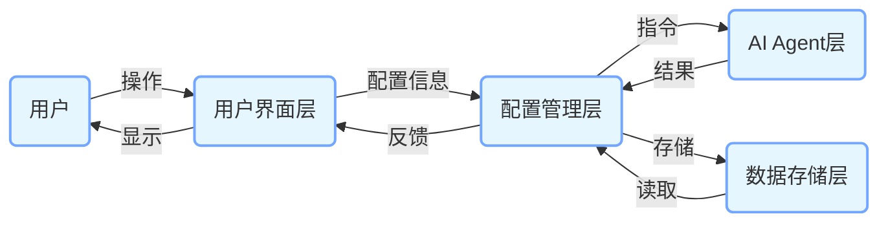

# 企业AI Agent的可视化配置界面：降低使用门槛

> 关键词：企业AI Agent、可视化配置界面、使用门槛、人工智能、低代码、配置管理

> 摘要：本文聚焦于企业AI Agent的可视化配置界面，深入探讨其在降低使用门槛方面的重要作用。首先介绍相关背景，包括目的、预期读者等内容。接着阐述核心概念与联系，剖析可视化配置界面的原理和架构。详细讲解核心算法原理及具体操作步骤，结合数学模型和公式进行深入分析。通过项目实战展示代码实现和解读，探讨实际应用场景。同时推荐相关的工具和资源，最后总结未来发展趋势与挑战，提供常见问题解答及扩展阅读参考资料，旨在为企业更好地应用AI Agent提供全面的技术指导。

## 1. 背景介绍 
### 1.1 目的和范围
在当今数字化时代，企业对于人工智能技术的需求日益增长。AI Agent作为一种能够自主执行任务、模拟人类智能行为的软件实体，为企业带来了巨大的价值。然而，传统的AI Agent配置方式往往需要专业的技术知识和编程技能，这对于非技术人员来说是一个难以跨越的障碍。因此，开发企业AI Agent的可视化配置界面具有重要的现实意义。

本文的范围主要围绕企业AI Agent的可视化配置界面展开，包括其核心概念、算法原理、数学模型、实际应用等方面，旨在为企业提供一套完整的解决方案，降低AI Agent的使用门槛，使更多的人员能够轻松配置和使用AI Agent。

### 1.2 预期读者
本文预期读者包括企业管理人员、业务人员、IT技术人员、人工智能爱好者等。对于企业管理人员和业务人员，本文将帮助他们了解可视化配置界面如何降低AI Agent的使用门槛，提高工作效率；对于IT技术人员，本文将提供详细的技术原理和实现步骤，帮助他们进行相关的开发和优化；对于人工智能爱好者，本文将展示企业AI Agent的应用前景和技术魅力。

### 1.3 文档结构概述
本文将按照以下结构进行阐述：
1. 背景介绍：介绍文章的目的、预期读者、文档结构概述和术语表。
2. 核心概念与联系：阐述企业AI Agent和可视化配置界面的核心概念，以及它们之间的联系，并给出原理和架构的文本示意图和Mermaid流程图。
3. 核心算法原理 & 具体操作步骤：详细讲解核心算法原理，并用Python源代码进行阐述，同时给出具体的操作步骤。
4. 数学模型和公式 & 详细讲解 & 举例说明：介绍相关的数学模型和公式，并进行详细讲解和举例说明。
5. 项目实战：代码实际案例和详细解释说明，包括开发环境搭建、源代码详细实现和代码解读、代码解读与分析。
6. 实际应用场景：探讨企业AI Agent可视化配置界面的实际应用场景。
7. 工具和资源推荐：推荐相关的学习资源、开发工具框架和论文著作。
8. 总结：未来发展趋势与挑战。
9. 附录：常见问题与解答。
10. 扩展阅读 & 参考资料。

### 1.4 术语表
#### 1.4.1 核心术语定义
- **企业AI Agent**：指在企业环境中使用的，能够自主执行任务、模拟人类智能行为的软件实体。它可以根据预设的规则和目标，与企业的各种系统和数据进行交互，完成特定的业务任务。
- **可视化配置界面**：一种通过图形化界面来进行配置和管理的工具，用户无需编写复杂的代码，只需通过鼠标点击、拖拽等操作即可完成相关的配置任务。
- **低代码开发**：一种软件开发方法，通过可视化界面和少量的代码编写，快速实现应用程序的开发，降低开发成本和难度。

#### 1.4.2 相关概念解释
- **人工智能**：研究如何使计算机系统能够模拟人类智能行为的学科，包括机器学习、深度学习、自然语言处理等技术。
- **机器学习**：人工智能的一个分支，通过让计算机从数据中学习模式和规律，自动提高性能的技术。
- **深度学习**：机器学习的一个子领域，通过构建深度神经网络来学习数据的特征和模式，在图像识别、语音识别等领域取得了显著的成果。

#### 1.4.3 缩略词列表
- **AI**：Artificial Intelligence，人工智能
- **ML**：Machine Learning，机器学习
- **DL**：Deep Learning，深度学习

## 2. 核心概念与联系 

### 2.1 企业AI Agent的概念
企业AI Agent是一种在企业环境中运行的智能软件实体，它具有以下特点：
- **自主性**：能够自主地感知环境、做出决策和执行任务，无需人工干预。
- **智能性**：具备一定的智能能力，能够学习和适应环境的变化，不断提高自身的性能。
- **交互性**：可以与企业的各种系统和数据进行交互，实现信息的共享和协同工作。

### 2.2 可视化配置界面的概念
可视化配置界面是一种用户友好的界面，它通过图形化的方式展示配置选项，用户可以通过鼠标点击、拖拽等操作来完成配置任务。可视化配置界面具有以下优点：
- **降低使用门槛**：非技术人员也可以轻松使用，无需具备专业的编程知识。
- **提高配置效率**：通过直观的界面操作，减少了配置时间和错误率。
- **增强可维护性**：配置信息以图形化的方式展示，易于理解和修改。

### 2.3 核心概念的联系
企业AI Agent的可视化配置界面将AI Agent的配置过程可视化，使得用户可以通过可视化界面来配置AI Agent的各种参数和行为。可视化配置界面与企业AI Agent之间的联系如下：
- **用户交互**：用户通过可视化配置界面与AI Agent进行交互，完成配置任务。
- **配置管理**：可视化配置界面负责管理AI Agent的配置信息，将用户的配置操作转换为AI Agent能够理解的指令。
- **数据传输**：可视化配置界面与AI Agent之间进行数据传输，确保配置信息的准确传递。

### 2.4 原理和架构的文本示意图
企业AI Agent的可视化配置界面主要由以下几个部分组成：
- **用户界面层**：提供用户与系统交互的界面，包括各种图形化的配置选项和操作按钮。
- **配置管理层**：负责管理AI Agent的配置信息，包括配置的存储、读取和更新。
- **AI Agent层**：执行具体的任务，根据配置信息进行相应的操作。
- **数据存储层**：存储AI Agent的配置信息和相关数据。

其原理和架构的文本示意图如下：

```plaintext
用户界面层 <-- 交互 --> 配置管理层 <-- 数据传输 --> AI Agent层
                               |
                               v
                            数据存储层
```

### 2.5 Mermaid流程图


## 3. 核心算法原理 & 具体操作步骤 

### 3.1 核心算法原理
企业AI Agent的可视化配置界面涉及到多个核心算法，以下是一些主要的算法：
- **配置解析算法**：将用户在可视化界面上的配置操作解析为AI Agent能够理解的指令。例如，用户在界面上选择了某个任务类型和相关参数，配置解析算法将这些信息转换为具体的任务指令。
- **任务调度算法**：根据AI Agent的当前状态和任务优先级，合理调度任务的执行顺序。例如，当有多个任务同时请求执行时，任务调度算法将根据任务的紧急程度和重要性进行排序，确保高优先级的任务优先执行。
- **数据存储算法**：将AI Agent的配置信息和相关数据存储到数据库中，并提供高效的数据读取和更新功能。例如，使用关系型数据库或非关系型数据库来存储数据，采用合适的索引和数据结构来提高数据的访问效率。

### 3.2 Python源代码详细阐述
以下是一个简单的配置解析算法的Python示例：

```python
class ConfigParser:
    def __init__(self, config_data):
        self.config_data = config_data

    def parse(self):
        # 解析任务类型
        task_type = self.config_data.get('task_type', 'default_task')
        # 解析任务参数
        task_params = self.config_data.get('task_params', {})
        # 生成任务指令
        task_command = {
            'type': task_type,
            'params': task_params
        }
        return task_command

# 示例配置数据
config_data = {
    'task_type': 'data_processing',
    'task_params': {
        'input_file': 'input.txt',
        'output_file': 'output.txt'
    }
}

# 创建配置解析器
parser = ConfigParser(config_data)
# 解析配置
task_command = parser.parse()
print(task_command)
```

### 3.3 具体操作步骤
使用企业AI Agent的可视化配置界面进行配置的具体操作步骤如下：
1. **登录系统**：用户使用自己的账号和密码登录可视化配置界面。
2. **选择AI Agent**：在界面上选择要配置的AI Agent。
3. **进行配置操作**：根据自己的需求，在界面上进行各种配置操作，如选择任务类型、设置任务参数等。
4. **保存配置**：配置完成后，点击保存按钮，将配置信息保存到系统中。
5. **启动AI Agent**：保存配置后，点击启动按钮，启动AI Agent执行任务。

## 4. 数学模型和公式 & 详细讲解 & 举例说明 

### 4.1 任务调度的数学模型
任务调度是企业AI Agent可视化配置界面中的一个重要环节，其目标是在满足各种约束条件的前提下，合理安排任务的执行顺序，以提高系统的性能和效率。以下是一个简单的任务调度的数学模型：

设 $T = \{t_1, t_2, \cdots, t_n\}$ 为任务集合，每个任务 $t_i$ 有以下属性：
- $p_i$：任务的优先级，$p_i \in \{1, 2, \cdots, m\}$，其中 $1$ 为最高优先级，$m$ 为最低优先级。
- $r_i$：任务的到达时间。
- $d_i$：任务的截止时间。
- $e_i$：任务的执行时间。

设 $x_{ij}$ 为一个二进制变量，若任务 $t_i$ 在第 $j$ 个位置执行，则 $x_{ij} = 1$，否则 $x_{ij} = 0$。

任务调度的目标是最小化所有任务的平均完成时间，即：

$$
\min \frac{1}{n} \sum_{i = 1}^{n} C_i
$$

其中 $C_i$ 为任务 $t_i$ 的完成时间。

约束条件如下：
1. 每个任务只能在一个位置执行：
$$
\sum_{j = 1}^{n} x_{ij} = 1, \quad \forall i = 1, 2, \cdots, n
$$
2. 每个位置只能执行一个任务：
$$
\sum_{i = 1}^{n} x_{ij} = 1, \quad \forall j = 1, 2, \cdots, n
$$
3. 任务的执行顺序必须满足任务的到达时间和截止时间：
$$
\sum_{k = 1}^{j} \sum_{i = 1}^{n} x_{ik} e_i \geq r_i, \quad \forall i = 1, 2, \cdots, n, \forall j = 1, 2, \cdots, n
$$
$$
\sum_{k = 1}^{n} \sum_{i = 1}^{n} x_{ik} e_i \leq d_i, \quad \forall i = 1, 2, \cdots, n
$$
4. 高优先级的任务优先执行：
$$
\sum_{j = 1}^{k} \sum_{i: p_i = l} x_{ij} \geq \sum_{j = 1}^{k} \sum_{i: p_i = l + 1} x_{ij}, \quad \forall l = 1, 2, \cdots, m - 1, \forall k = 1, 2, \cdots, n
$$

### 4.2 详细讲解
上述数学模型通过定义任务的属性和变量，以及目标函数和约束条件，来描述任务调度的问题。目标函数是最小化所有任务的平均完成时间，这可以提高系统的整体效率。约束条件确保了每个任务只能在一个位置执行，每个位置只能执行一个任务，任务的执行顺序满足到达时间和截止时间的要求，以及高优先级的任务优先执行。

### 4.3 举例说明
假设有三个任务 $t_1$、$t_2$ 和 $t_3$，其属性如下：

| 任务 | 优先级 $p_i$ | 到达时间 $r_i$ | 截止时间 $d_i$ | 执行时间 $e_i$ |
|------|--------------|----------------|----------------|----------------|
| $t_1$ | 1 | 0 | 5 | 2 |
| $t_2$ | 2 | 1 | 6 | 3 |
| $t_3$ | 3 | 2 | 7 | 4 |

根据上述数学模型，我们可以使用线性规划等方法来求解任务的最优执行顺序。假设求解结果为 $x_{11} = 1$，$x_{22} = 1$，$x_{33} = 1$，即任务 $t_1$ 在第 1 个位置执行，任务 $t_2$ 在第 2 个位置执行，任务 $t_3$ 在第 3 个位置执行。

任务 $t_1$ 的完成时间 $C_1 = 0 + 2 = 2$；
任务 $t_2$ 的完成时间 $C_2 = 2 + 3 = 5$；
任务 $t_3$ 的完成时间 $C_3 = 5 + 4 = 9$。

平均完成时间为 $\frac{2 + 5 + 9}{3} = \frac{16}{3} \approx 5.33$。

## 5. 项目实战：代码实际案例和详细解释说明 

### 5.1  开发环境搭建
在进行企业AI Agent可视化配置界面的开发之前，需要搭建相应的开发环境。以下是一个基本的开发环境搭建步骤：

#### 5.1.1 安装Python
Python是一种广泛使用的编程语言，许多AI和Web开发框架都基于Python。可以从Python官方网站（https://www.python.org/downloads/） 下载并安装Python。

#### 5.1.2 安装数据库
可以选择关系型数据库（如MySQL、PostgreSQL）或非关系型数据库（如MongoDB）来存储AI Agent的配置信息和相关数据。以MySQL为例，可以从MySQL官方网站（https://dev.mysql.com/downloads/installer/） 下载并安装MySQL。

#### 5.1.3 安装Web开发框架
可以选择Django、Flask等Web开发框架来开发可视化配置界面。以Flask为例，可以使用以下命令安装Flask：

```bash
pip install flask
```

#### 5.1.4 安装前端开发工具
可以使用HTML、CSS、JavaScript等技术来开发可视化配置界面的前端部分。可以使用一些前端框架（如Bootstrap、Vue.js）来提高开发效率。

### 5.2  源代码详细实现和代码解读
以下是一个简单的基于Flask的企业AI Agent可视化配置界面的代码示例：

```python
from flask import Flask, render_template, request, jsonify
import mysql.connector

app = Flask(__name__)

# 数据库配置
db_config = {
    'user': 'root',
    'password': 'password',
    'host': 'localhost',
    'database': 'ai_agent_config'
}

# 连接数据库
def get_db_connection():
    return mysql.connector.connect(**db_config)

# 首页
@app.route('/')
def index():
    return render_template('index.html')

# 保存配置信息
@app.route('/save_config', methods=['POST'])
def save_config():
    data = request.get_json()
    task_type = data.get('task_type')
    task_params = data.get('task_params')

    # 连接数据库
    conn = get_db_connection()
    cursor = conn.cursor()

    # 插入配置信息
    query = "INSERT INTO config (task_type, task_params) VALUES (%s, %s)"
    cursor.execute(query, (task_type, str(task_params)))
    conn.commit()

    # 关闭数据库连接
    cursor.close()
    conn.close()

    return jsonify({'message': '配置信息保存成功'})

# 获取配置信息
@app.route('/get_config', methods=['GET'])
def get_config():
    # 连接数据库
    conn = get_db_connection()
    cursor = conn.cursor()

    # 查询配置信息
    query = "SELECT * FROM config"
    cursor.execute(query)
    rows = cursor.fetchall()

    config_list = []
    for row in rows:
        config = {
            'id': row[0],
            'task_type': row[1],
            'task_params': eval(row[2])
        }
        config_list.append(config)

    # 关闭数据库连接
    cursor.close()
    conn.close()

    return jsonify(config_list)

if __name__ == '__main__':
    app.run(debug=True)
```

### 5.3  代码解读与分析
上述代码实现了一个简单的企业AI Agent可视化配置界面的后端部分，主要包括以下功能：
- **首页**：`index` 函数返回一个HTML页面，作为可视化配置界面的入口。
- **保存配置信息**：`save_config` 函数接收用户提交的配置信息，并将其保存到数据库中。
- **获取配置信息**：`get_config` 函数从数据库中查询配置信息，并返回给前端页面。

代码中使用了Flask框架来处理HTTP请求和响应，使用MySQL数据库来存储配置信息。在实际开发中，还需要开发相应的前端页面，使用HTML、CSS、JavaScript等技术来实现可视化的配置界面。

## 6. 实际应用场景 
企业AI Agent的可视化配置界面在多个实际应用场景中具有重要的作用，以下是一些常见的应用场景：

### 6.1 智能客服
在智能客服场景中，企业可以使用AI Agent来自动回答客户的问题。通过可视化配置界面，客服人员可以轻松配置AI Agent的知识库、回答策略等参数，提高客服效率和服务质量。

### 6.2 业务流程自动化
企业的一些业务流程可以通过AI Agent来实现自动化。例如，财务部门的报销流程、人力资源部门的招聘流程等。通过可视化配置界面，业务人员可以根据业务需求配置AI Agent的任务和规则，实现业务流程的自动化执行。

### 6.3 数据分析与决策支持
AI Agent可以帮助企业进行数据分析和决策支持。通过可视化配置界面，数据分析人员可以配置AI Agent的数据来源、分析算法等参数，快速生成数据分析报告，为企业的决策提供支持。

### 6.4 智能营销
在智能营销场景中，企业可以使用AI Agent来进行客户细分、精准营销等。通过可视化配置界面，营销人员可以配置AI Agent的营销规则、营销策略等参数，提高营销效果和转化率。

## 7. 工具和资源推荐
### 7.1 学习资源推荐
#### 7.1.1 书籍推荐
- 《人工智能：一种现代的方法》：这本书是人工智能领域的经典教材，全面介绍了人工智能的基本概念、算法和应用。
- 《Python机器学习》：本书详细介绍了Python在机器学习领域的应用，包括机器学习算法的实现和应用案例。
- 《Flask Web开发实战》：这本书介绍了如何使用Flask框架开发Web应用程序，适合初学者学习。

#### 7.1.2 在线课程
- Coursera上的“人工智能基础”课程：由知名大学的教授授课，系统地介绍了人工智能的基本概念和算法。
- edX上的“Python数据科学”课程：介绍了Python在数据科学领域的应用，包括数据分析、机器学习等方面的内容。
- 慕课网上的“Flask框架入门”课程：适合初学者快速入门Flask框架。

#### 7.1.3 技术博客和网站
- 知乎：有很多关于人工智能、机器学习、Web开发等方面的优质文章和讨论。
- 博客园：汇聚了众多技术开发者的博客，分享了很多实用的技术经验和案例。
- 开源中国：提供了丰富的开源项目和技术资源，对于学习和实践有很大的帮助。

### 7.2 开发工具框架推荐
#### 7.2.1 IDE和编辑器
- PyCharm：一款专业的Python集成开发环境，提供了丰富的功能和插件，适合Python开发。
- Visual Studio Code：一款轻量级的代码编辑器，支持多种编程语言，有丰富的扩展插件。
- Sublime Text：一款简洁高效的文本编辑器，适合快速编写代码。

#### 7.2.2 调试和性能分析工具
- PDB：Python自带的调试工具，可以帮助开发者调试Python代码。
- Flask-DebugToolbar：一个Flask扩展，提供了调试和性能分析的功能。
- MySQL Workbench：一款MySQL数据库管理工具，可以帮助开发者管理和调试数据库。

#### 7.2.3 相关框架和库
- Flask：一个轻量级的Python Web开发框架，适合快速开发Web应用程序。
- Django：一个功能强大的Python Web开发框架，提供了丰富的功能和插件，适合开发大型Web应用程序。
- Pandas：一个用于数据分析的Python库，提供了高效的数据结构和数据处理工具。
- Scikit-learn：一个用于机器学习的Python库，提供了丰富的机器学习算法和工具。

### 7.3 相关论文著作推荐
#### 7.3.1 经典论文
- “A Logical Calculus of the Ideas Immanent in Nervous Activity”：这篇论文是神经网络领域的经典论文，提出了神经元模型。
- “A Mathematical Theory of Communication”：这篇论文是信息论领域的经典论文，奠定了现代通信理论的基础。
- “Gradient-based learning applied to document recognition”：这篇论文介绍了卷积神经网络在文档识别中的应用，推动了深度学习的发展。

#### 7.3.2 最新研究成果
- 可以关注顶级学术会议（如NeurIPS、ICML、CVPR等）上的最新研究成果，了解人工智能领域的前沿技术。
- 一些知名的学术期刊（如Journal of Artificial Intelligence Research、Artificial Intelligence等）也会发表人工智能领域的最新研究论文。

#### 7.3.3 应用案例分析
- 可以参考一些企业的技术博客和案例分享，了解企业在实际应用中如何使用AI Agent和可视化配置界面。
- 一些技术媒体（如InfoQ、开源中国等）也会发布一些应用案例分析文章，供开发者参考。

## 8. 总结：未来发展趋势与挑战
### 8.1 未来发展趋势
- **低代码化趋势**：未来企业AI Agent的可视化配置界面将更加低代码化，非技术人员可以通过简单的拖拽和配置操作，快速实现AI Agent的定制和部署。
- **智能化趋势**：可视化配置界面将融入更多的人工智能技术，如智能推荐、智能提示等，帮助用户更高效地进行配置。
- **集成化趋势**：可视化配置界面将与企业的其他系统（如ERP、CRM等）进行深度集成，实现数据的共享和协同工作。
- **云化趋势**：越来越多的企业将选择云服务来部署AI Agent和可视化配置界面，降低企业的IT成本和维护难度。

### 8.2 挑战
- **数据安全与隐私**：企业AI Agent涉及到大量的企业数据，如何保证数据的安全和隐私是一个重要的挑战。
- **技术复杂性**：虽然可视化配置界面降低了使用门槛，但AI Agent的底层技术仍然非常复杂，如何让用户更好地理解和使用这些技术是一个挑战。
- **人才短缺**：目前人工智能领域的专业人才短缺，如何培养和吸引更多的人才来开发和应用企业AI Agent是一个挑战。
- **标准和规范缺失**：目前企业AI Agent和可视化配置界面的标准和规范还不够完善，如何建立统一的标准和规范是一个挑战。

## 9. 附录：常见问题与解答
### 9.1 可视化配置界面是否需要编程知识？
不需要。可视化配置界面的设计初衷就是为了降低使用门槛，非技术人员可以通过图形化的界面进行配置操作，无需具备编程知识。

### 9.2 如何保证AI Agent的配置信息安全？
可以采取以下措施来保证AI Agent的配置信息安全：
- 对配置信息进行加密存储，防止数据泄露。
- 对用户进行身份认证和授权，只有授权用户才能访问和修改配置信息。
- 定期备份配置信息，防止数据丢失。

### 9.3 可视化配置界面能否与现有系统集成？
可以。可视化配置界面可以通过API接口等方式与现有系统进行集成，实现数据的共享和协同工作。

### 9.4 如何选择合适的AI Agent？
选择合适的AI Agent需要考虑以下因素：
- 业务需求：根据企业的业务需求选择适合的AI Agent。
- 性能和效率：考虑AI Agent的性能和效率，确保能够满足企业的业务要求。
- 可扩展性：选择具有良好可扩展性的AI Agent，以便未来进行功能扩展。
- 成本：考虑AI Agent的购买和使用成本，选择性价比高的产品。

## 10. 扩展阅读 & 参考资料
- 《人工智能简史》
- 《深度学习入门：基于Python的理论与实现》
- 《Web开发实战：从零基础到项目实战》
- https://www.python.org/
- https://flask.palletsprojects.com/
- https://dev.mysql.com/

作者：AI天才研究院/AI Genius Institute & 禅与计算机程序设计艺术 /Zen And The Art of Computer Programming