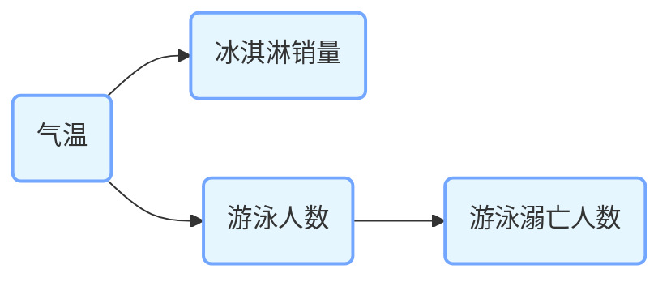

# 企业AI Agent的因果推理在产品开发中的应用

> 关键词：企业AI Agent、因果推理、产品开发、人工智能、数据分析

> 摘要：本文聚焦于企业AI Agent的因果推理在产品开发中的应用。首先介绍了相关背景知识，包括目的范围、预期读者等。接着阐述了核心概念与联系，详细讲解了因果推理的原理和架构。通过Python代码说明了核心算法原理及具体操作步骤，并给出了相应的数学模型和公式。在项目实战部分，展示了代码实际案例并进行详细解释。还探讨了实际应用场景，推荐了学习资源、开发工具框架以及相关论文著作。最后总结了未来发展趋势与挑战，解答了常见问题，并提供了扩展阅读和参考资料，旨在为企业在产品开发中有效运用AI Agent的因果推理提供全面的指导。

## 1. 背景介绍 
### 1.1 目的和范围
本文章的主要目的是深入探讨企业AI Agent的因果推理在产品开发过程中的应用。随着人工智能技术的不断发展，企业AI Agent在各个领域的应用越来越广泛，而因果推理作为其中一项关键技术，能够帮助企业更好地理解产品开发过程中的各种因素之间的因果关系，从而做出更明智的决策。本文的范围涵盖了因果推理的基本概念、核心算法、数学模型，以及如何在实际产品开发项目中应用这些技术，同时还会介绍相关的工具和资源。

### 1.2 预期读者
本文预期读者主要包括企业的产品开发人员、人工智能研究人员、数据分析师以及对企业AI Agent和产品开发感兴趣的技术爱好者。产品开发人员可以从本文中了解如何利用因果推理优化产品开发流程，提高产品质量；人工智能研究人员可以深入探讨因果推理在企业场景下的应用和发展；数据分析师可以学习如何运用因果推理方法进行数据分析；技术爱好者则可以通过本文了解相关领域的前沿知识。

### 1.3 文档结构概述
本文将按照以下结构进行组织：首先介绍核心概念与联系，包括因果推理的基本原理和架构；接着详细讲解核心算法原理和具体操作步骤，并用Python代码进行说明；然后给出因果推理的数学模型和公式，并举例说明；在项目实战部分，展示代码实际案例并进行详细解释；之后探讨因果推理在产品开发中的实际应用场景；再推荐相关的工具和资源；最后总结未来发展趋势与挑战，解答常见问题，并提供扩展阅读和参考资料。

### 1.4 术语表
#### 1.4.1 核心术语定义
- **企业AI Agent**：是指在企业环境中运行的人工智能代理，它能够感知环境、做出决策并采取行动，以实现企业的特定目标。
- **因果推理**：是一种从数据中发现变量之间因果关系的技术，它不仅仅关注变量之间的相关性，更重要的是确定哪些变量是原因，哪些变量是结果。
- **产品开发**：是指企业从产生产品创意开始，经过设计、研发、生产、测试等一系列过程，最终将产品推向市场的整个过程。

#### 1.4.2 相关概念解释
- **相关性与因果性**：相关性是指两个或多个变量之间的统计关联，而因果性则意味着一个变量的变化会直接导致另一个变量的变化。例如，冰淇淋销量和太阳镜销量可能存在相关性，但它们之间并没有因果关系，而气温升高则可能是导致冰淇淋销量增加的原因。
- **因果图**：是一种用图形表示变量之间因果关系的工具，节点表示变量，边表示因果关系。通过因果图可以直观地展示变量之间的因果结构。

#### 1.4.3 缩略词列表
- **AI**：Artificial Intelligence，人工智能
- **ML**：Machine Learning，机器学习
- **DL**：Deep Learning，深度学习

## 2. 核心概念与联系 
### 2.1 因果推理的基本原理
因果推理的核心目标是从数据中识别出变量之间的因果关系。在传统的数据分析中，我们通常关注的是变量之间的相关性，即一个变量的变化与另一个变量的变化之间的统计关联。然而，相关性并不等同于因果性。例如，我们可能会发现冰淇淋的销量和游泳溺亡的人数之间存在正相关关系，但这并不意味着吃冰淇淋会导致游泳溺亡。实际上，这两个变量都受到气温的影响，气温升高会同时导致冰淇淋销量增加和更多人去游泳，从而增加了游泳溺亡的风险。

因果推理的基本思想是通过控制其他可能的因素，来确定一个变量的变化是否会直接导致另一个变量的变化。这可以通过实验设计（如随机对照试验）或观察性研究（如因果图分析）来实现。在实验设计中，我们可以随机将研究对象分为实验组和对照组，对实验组施加某种干预，然后比较两组的结果，以确定干预是否导致了结果的变化。在观察性研究中，我们可以使用因果图来表示变量之间的因果结构，并通过调整其他变量来估计因果效应。

### 2.2 企业AI Agent与因果推理的联系
企业AI Agent可以利用因果推理技术来更好地理解企业环境中的各种因素之间的因果关系，从而做出更明智的决策。例如，在产品开发过程中，AI Agent可以通过分析市场数据、用户反馈和产品性能数据，识别出影响产品成功的关键因素，并确定这些因素之间的因果关系。基于这些因果关系，AI Agent可以预测不同决策对产品成功的影响，从而为产品开发团队提供决策支持。

此外，企业AI Agent还可以利用因果推理技术来优化产品开发流程。例如，通过分析开发过程中的各种因素（如开发时间、资源投入、团队协作等）之间的因果关系，AI Agent可以识别出影响开发效率和质量的瓶颈，并提出相应的改进措施。

### 2.3 因果推理在产品开发中的应用架构
因果推理在产品开发中的应用架构可以分为以下几个层次：
- **数据层**：收集和存储与产品开发相关的数据，包括市场数据、用户反馈、产品性能数据等。
- **特征工程层**：对数据进行预处理和特征提取，将原始数据转换为适合因果推理模型的特征。
- **因果推理模型层**：选择合适的因果推理模型，如因果图模型、结构方程模型等，并使用训练数据对模型进行训练。
- **决策支持层**：根据因果推理模型的结果，为产品开发团队提供决策支持，如预测不同决策对产品成功的影响、识别影响开发效率和质量的瓶颈等。
- **应用层**：将决策支持层的结果应用到实际的产品开发过程中，如调整产品设计、优化开发流程等。

下面是一个用Mermaid表示的因果推理在产品开发中的应用架构流程图：


## 3. 核心算法原理 & 具体操作步骤 
### 3.1 因果图模型
因果图模型是一种常用的因果推理模型，它用有向无环图（DAG）来表示变量之间的因果关系。在因果图中，节点表示变量，有向边表示因果关系。例如，下面是一个简单的因果图：

在这个因果图中，气温是冰淇淋销量和游泳人数的原因，游泳人数是游泳溺亡人数的原因。

因果图模型的核心算法是因果效应估计，即通过调整其他变量来估计一个变量对另一个变量的因果效应。常用的因果效应估计方法包括后门调整、前门调整和工具变量法等。

### 3.2 后门调整算法原理
后门调整算法是一种基于因果图的因果效应估计方法，它的基本思想是通过控制所有后门路径上的变量，来消除混杂因素的影响，从而估计出一个变量对另一个变量的因果效应。

下面是后门调整算法的Python代码实现：
```python
import numpy as np
import pandas as pd

def backdoor_adjustment(data, treatment, outcome, confounders):
    """
    后门调整算法实现
    :param data: 数据集
    :param treatment: 处理变量
    :param outcome: 结果变量
    :param confounders: 混杂变量列表
    :return: 因果效应估计值
    """
    # 计算每个混杂变量组合的条件概率
    groups = data.groupby(confounders)
    total = len(data)
    causal_effect = 0
    for group, group_data in groups:
        group_size = len(group_data)
        # 计算处理组和对照组的平均结果
        treated_group = group_data[group_data[treatment] == 1]
        control_group = group_data[group_data[treatment] == 0]
        if len(treated_group) > 0 and len(control_group) > 0:
            treated_mean = treated_group[outcome].mean()
            control_mean = control_group[outcome].mean()
            # 计算条件概率
            prob_group = group_size / total
            # 计算因果效应
            causal_effect += prob_group * (treated_mean - control_mean)
    return causal_effect

# 示例数据
data = pd.DataFrame({
    'treatment': [1, 0, 1, 0, 1, 0],
    'outcome': [2, 1, 3, 1, 4, 2],
    'confounder': [1, 0, 1, 0, 1, 0]
})

# 调用后门调整算法
treatment = 'treatment'
outcome = 'outcome'
confounders = ['confounder']
causal_effect = backdoor_adjustment(data, treatment, outcome, confounders)
print(f"因果效应估计值: {causal_effect}")
```
### 3.3 具体操作步骤
使用因果推理进行产品开发的具体操作步骤如下：
1. **问题定义**：明确要解决的问题，例如确定影响产品销量的关键因素。
2. **数据收集**：收集与问题相关的数据，包括市场数据、用户反馈、产品性能数据等。
3. **因果图构建**：根据领域知识和数据，构建因果图，明确变量之间的因果关系。
4. **因果效应估计**：选择合适的因果推理算法，如后门调整算法，估计变量之间的因果效应。
5. **决策制定**：根据因果效应估计结果，制定产品开发决策，如调整产品设计、优化营销策略等。
6. **结果评估**：评估决策的效果，根据评估结果调整因果图和因果推理模型。

## 4. 数学模型和公式 & 详细讲解 & 举例说明 
### 4.1 因果效应的数学定义
在因果推理中，我们通常用潜在结果框架来定义因果效应。假设我们有一个处理变量 $T$（取值为 0 或 1）和一个结果变量 $Y$，对于每个个体 $i$，存在两个潜在结果 $Y_i(0)$ 和 $Y_i(1)$，分别表示个体 $i$ 在未接受处理（$T = 0$）和接受处理（$T = 1$）时的结果。

个体因果效应（ICE）定义为：
$$
ICE_i = Y_i(1) - Y_i(0)
$$
由于我们只能观察到个体在一种处理状态下的结果，因此个体因果效应是无法直接观测的。我们通常关注的是平均因果效应（ACE），定义为：
$$
ACE = E[Y(1) - Y(0)]
$$
其中 $E$ 表示期望。

### 4.2 后门调整公式
后门调整公式是后门调整算法的数学基础，它用于估计平均因果效应。假设我们有一个因果图，其中 $T$ 是处理变量，$Y$ 是结果变量，$Z$ 是所有后门路径上的混杂变量集合。则平均因果效应可以通过以下公式估计：
$$
ACE = \sum_{z} [E[Y|T = 1, Z = z] - E[Y|T = 0, Z = z]] P(Z = z)
$$
其中 $\sum_{z}$ 表示对 $Z$ 的所有可能取值求和，$E[Y|T = t, Z = z]$ 表示在处理变量 $T = t$ 和混杂变量 $Z = z$ 的条件下结果变量 $Y$ 的期望，$P(Z = z)$ 表示混杂变量 $Z$ 取值为 $z$ 的概率。

### 4.3 举例说明
假设我们要研究广告投放（处理变量 $T$）对产品销量（结果变量 $Y$）的因果效应，同时考虑到用户年龄（混杂变量 $Z$）的影响。我们收集了以下数据：

| 广告投放（$T$） | 用户年龄（$Z$） | 产品销量（$Y$） |
| --- | --- | --- |
| 1 | 20 | 100 |
| 0 | 20 | 80 |
| 1 | 30 | 120 |
| 0 | 30 | 100 |

首先，我们计算每个年龄组的条件概率：
- $P(Z = 20) = 0.5$
- $P(Z = 30) = 0.5$

然后，计算每个年龄组的条件期望：
- $E[Y|T = 1, Z = 20] = 100$
- $E[Y|T = 0, Z = 20] = 80$
- $E[Y|T = 1, Z = 30] = 120$
- $E[Y|T = 0, Z = 30] = 100$

最后，使用后门调整公式计算平均因果效应：
$$
\begin{align*}
ACE &= [E[Y|T = 1, Z = 20] - E[Y|T = 0, Z = 20]] P(Z = 20) + [E[Y|T = 1, Z = 30] - E[Y|T = 0, Z = 30]] P(Z = 30) \\
&= (100 - 80) \times 0.5 + (120 - 100) \times 0.5 \\
&= 20 \times 0.5 + 20 \times 0.5 \\
&= 20
\end{align*}
$$
这意味着广告投放对产品销量的平均因果效应为 20。

## 5. 项目实战：代码实际案例和详细解释说明 
### 5.1  开发环境搭建
在进行项目实战之前，我们需要搭建开发环境。以下是搭建开发环境的步骤：
1. **安装Python**：建议安装Python 3.7及以上版本，可以从Python官方网站（https://www.python.org/downloads/）下载安装包进行安装。
2. **安装必要的库**：我们需要安装一些必要的Python库，如`pandas`、`numpy`等。可以使用以下命令进行安装：
```sh
pip install pandas numpy
```

### 5.2  源代码详细实现和代码解读
以下是一个完整的项目实战代码示例，用于研究广告投放对产品销量的因果效应：
```python
import pandas as pd
import numpy as np

def backdoor_adjustment(data, treatment, outcome, confounders):
    """
    后门调整算法实现
    :param data: 数据集
    :param treatment: 处理变量
    :param outcome: 结果变量
    :param confounders: 混杂变量列表
    :return: 因果效应估计值
    """
    # 计算每个混杂变量组合的条件概率
    groups = data.groupby(confounders)
    total = len(data)
    causal_effect = 0
    for group, group_data in groups:
        group_size = len(group_data)
        # 计算处理组和对照组的平均结果
        treated_group = group_data[group_data[treatment] == 1]
        control_group = group_data[group_data[treatment] == 0]
        if len(treated_group) > 0 and len(control_group) > 0:
            treated_mean = treated_group[outcome].mean()
            control_mean = control_group[outcome].mean()
            # 计算条件概率
            prob_group = group_size / total
            # 计算因果效应
            causal_effect += prob_group * (treated_mean - control_mean)
    return causal_effect

# 生成示例数据
np.random.seed(0)
n_samples = 100
age = np.random.randint(20, 40, n_samples)
advertising = np.random.randint(0, 2, n_samples)
sales = 100 + 5 * advertising + 2 * age + np.random.normal(0, 10, n_samples)
data = pd.DataFrame({
    'advertising': advertising,
    'sales': sales,
    'age': age
})

# 调用后门调整算法
treatment = 'advertising'
outcome = 'sales'
confounders = ['age']
causal_effect = backdoor_adjustment(data, treatment, outcome, confounders)
print(f"广告投放对产品销量的因果效应估计值: {causal_effect}")
```
### 5.3  代码解读与分析
- **数据生成**：使用`numpy`库生成示例数据，包括用户年龄、广告投放情况和产品销量。
- **后门调整算法实现**：定义`backdoor_adjustment`函数，实现后门调整算法。该函数接受数据集、处理变量、结果变量和混杂变量列表作为输入，返回因果效应估计值。
- **因果效应估计**：调用`backdoor_adjustment`函数，估计广告投放对产品销量的因果效应。
- **结果输出**：打印因果效应估计值。

通过这个代码示例，我们可以看到如何使用后门调整算法来估计变量之间的因果效应，从而为产品开发决策提供支持。

## 6. 实际应用场景 
### 6.1 产品功能优化
在产品开发过程中，企业可以利用因果推理技术来优化产品功能。例如，通过分析用户行为数据和产品性能数据，企业可以确定哪些产品功能对用户满意度和产品销量有显著影响。然后，企业可以根据因果效应估计结果，对产品功能进行优化，提高用户体验和产品竞争力。

### 6.2 营销策略制定
因果推理技术可以帮助企业制定更有效的营销策略。例如，企业可以通过分析广告投放数据、市场调研数据和销售数据，确定哪些营销渠道和营销策略对产品销量有显著影响。然后，企业可以根据因果效应估计结果，调整营销策略，提高营销效果和投资回报率。

### 6.3 产品定价决策
产品定价是产品开发过程中的一个重要决策。因果推理技术可以帮助企业确定产品价格对产品销量和利润的影响。例如，企业可以通过分析历史销售数据和市场价格数据，估计不同价格水平下的产品销量和利润。然后，企业可以根据因果效应估计结果，制定最优的产品价格策略。

### 6.4 供应链管理
在供应链管理中，因果推理技术可以帮助企业优化供应链流程，提高供应链效率和可靠性。例如，企业可以通过分析供应链数据，确定哪些因素对供应链成本、交货期和产品质量有显著影响。然后，企业可以根据因果效应估计结果，采取相应的措施，优化供应链流程，降低成本，提高效率。

## 7. 工具和资源推荐
### 7.1 学习资源推荐
#### 7.1.1 书籍推荐
- 《为什么：关于因果关系的新科学》（*The Book of Why: The New Science of Cause and Effect*）：由朱迪亚·珀尔（Judea Pearl）和达纳·麦肯齐（Dana Mackenzie）所著，这本书系统地介绍了因果推理的基本概念、理论和方法，是因果推理领域的经典著作。
- 《因果推理：基础与学习算法》（*Causal Inference: What If*）：由米格尔·埃尔南（Miguel Hernán）和詹姆斯·罗宾斯（James Robins）所著，这本书详细介绍了因果推理的各种方法和应用，适合有一定统计学基础的读者阅读。

#### 7.1.2 在线课程
- Coursera上的“因果推理”（*Causal Inference*）课程：由密歇根大学的教授讲授，该课程系统地介绍了因果推理的基本概念、理论和方法，并通过实际案例进行演示。
- edX上的“因果机器学习”（*Causal Machine Learning*）课程：由加州大学伯克利分校的教授讲授，该课程介绍了因果推理和机器学习的结合，以及如何在实际应用中使用因果机器学习方法。

#### 7.1.3 技术博客和网站
- 因果推理社区（https://www.causality.inf.ethz.ch/）：该网站提供了因果推理领域的最新研究成果、学术会议信息和开源代码资源。
- 因果推理博客（https://towardsdatascience.com/tagged/causal-inference）：该博客上有许多关于因果推理的技术文章和案例分析，适合初学者学习。

### 7.2 开发工具框架推荐
#### 7.2.1 IDE和编辑器
- PyCharm：是一款专业的Python集成开发环境，具有代码编辑、调试、版本控制等功能，适合Python开发人员使用。
- Jupyter Notebook：是一个交互式的开发环境，支持Python、R等多种编程语言，适合数据科学家和机器学习工程师进行数据探索和模型开发。

#### 7.2.2 调试和性能分析工具
- pdb：是Python自带的调试工具，可以帮助开发人员调试Python代码。
- cProfile：是Python自带的性能分析工具，可以帮助开发人员分析Python代码的性能瓶颈。

#### 7.2.3 相关框架和库
- DoWhy：是一个开源的因果推理Python库，提供了多种因果推理方法和工具，包括因果图构建、因果效应估计等。
- CausalML：是一个开源的因果机器学习Python库，提供了多种因果机器学习算法和工具，包括因果森林、因果神经网络等。

### 7.3 相关论文著作推荐
#### 7.3.1 经典论文
- Pearl, J. (2009). Causality: models, reasoning, and inference. Cambridge University Press. 这篇论文是因果推理领域的经典之作，系统地介绍了因果推理的理论和方法。
- Rubin, D. B. (1974). Estimating causal effects of treatments in randomized and nonrandomized studies. Journal of educational Psychology, 66(5), 688. 这篇论文提出了潜在结果框架，为因果推理的发展奠定了基础。

#### 7.3.2 最新研究成果
- Athey, S., & Imbens, G. W. (2016). Recursive partitioning for heterogeneous causal effects. Proceedings of the National Academy of Sciences, 113(27), 7353-7360. 这篇论文提出了因果森林算法，用于估计异质因果效应。
- Bengio, Y., Courville, A., & Vincent, P. (2013). Representation learning: A review and new perspectives. IEEE transactions on pattern analysis and machine intelligence, 35(8), 1798-1828. 这篇论文讨论了表征学习在因果推理中的应用。

#### 7.3.3 应用案例分析
- Hill, J. L. (2011). Bayesian nonparametric modeling for causal inference. Journal of Computational and Graphical Statistics, 20(1), 217-240. 这篇论文介绍了贝叶斯非参数模型在因果推理中的应用案例。
- Imai, K., Keele, L., & Tingley, D. (2010). A general approach to causal mediation analysis. Psychological methods, 15(4), 309. 这篇论文介绍了因果中介分析的应用案例。

## 8. 总结：未来发展趋势与挑战
### 8.1 未来发展趋势
- **与机器学习的深度融合**：未来，因果推理将与机器学习技术进行更深度的融合，例如将因果推理方法应用于深度学习模型中，提高模型的可解释性和因果推断能力。
- **多源数据融合**：随着数据的不断增长和多样化，未来的因果推理将需要处理多源数据，包括结构化数据、非结构化数据和半结构化数据。通过融合多源数据，可以更准确地估计因果效应。
- **实时因果推理**：在一些实时决策场景中，如金融交易、智能交通等，需要实时进行因果推理。未来的因果推理技术将朝着实时性和高效性的方向发展。

### 8.2 挑战
- **数据质量问题**：因果推理对数据质量要求较高，数据中的噪声、缺失值和偏差等问题会影响因果效应的估计结果。因此，如何提高数据质量是因果推理面临的一个重要挑战。
- **因果图构建的困难**：因果图的构建需要领域知识和专业经验，对于一些复杂的系统，因果图的构建可能非常困难。如何自动构建因果图是因果推理领域的一个研究热点。
- **可解释性问题**：虽然因果推理的目的是为了提高模型的可解释性，但一些复杂的因果推理模型仍然存在可解释性问题。如何提高因果推理模型的可解释性是未来需要解决的一个重要问题。

## 9. 附录：常见问题与解答
### 9.1 因果推理和相关性分析有什么区别？
因果推理关注的是变量之间的因果关系，即一个变量的变化是否会直接导致另一个变量的变化；而相关性分析关注的是变量之间的统计关联，即一个变量的变化与另一个变量的变化之间的相关性。相关性并不等同于因果性，例如两个变量可能存在相关性，但它们之间并没有因果关系。

### 9.2 因果推理需要多少数据？
因果推理所需的数据量取决于问题的复杂度、数据的质量和因果推理方法的选择。一般来说，数据量越大，因果效应的估计结果越准确。但在实际应用中，也可以通过合理的实验设计和数据预处理方法，在有限的数据量下进行有效的因果推理。

### 9.3 因果推理模型的可解释性如何保证？
为了保证因果推理模型的可解释性，可以选择一些可解释性强的因果推理方法，如因果图模型、线性回归模型等。此外，还可以通过可视化技术将因果关系直观地展示出来，帮助用户理解模型的推理过程和结果。

## 10. 扩展阅读 & 参考资料
### 10.1 扩展阅读
- Pearl, J., Glymour, M., & Jewell, N. P. (2016). Causal inference in statistics: A primer. John Wiley & Sons.
- Angrist, J. D., & Pischke, J. -S. (2008). Mostly harmless econometrics: An empiricist's companion. Princeton university press.

### 10.2 参考资料
- 维基百科上的“因果推理”词条（https://en.wikipedia.org/wiki/Causal_inference）
- 百度学术上的因果推理相关文献（https://xueshu.baidu.com/）

作者：AI天才研究院/AI Genius Institute & 禅与计算机程序设计艺术 /Zen And The Art of Computer Programming