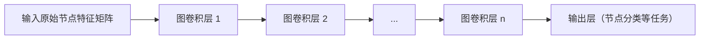

# 企业AI Agent的图卷积网络在社交网络分析中的应用

> 关键词：企业AI Agent、图卷积网络、社交网络分析、图数据、节点特征

> 摘要：本文聚焦于企业AI Agent的图卷积网络在社交网络分析中的应用。首先介绍了相关背景知识，包括目的、预期读者等内容。接着阐述了图卷积网络的核心概念与联系，深入讲解其算法原理和具体操作步骤，并通过Python代码进行详细说明。同时给出了相关数学模型和公式，并举例进行解释。通过项目实战，展示了如何搭建开发环境、实现源代码并进行解读分析。探讨了图卷积网络在社交网络分析中的实际应用场景，推荐了学习资源、开发工具框架以及相关论文著作。最后总结了未来发展趋势与挑战，并提供常见问题与解答以及扩展阅读和参考资料，旨在为相关领域的研究者和从业者提供全面而深入的参考。

## 1. 背景介绍 
### 1.1 目的和范围
社交网络已经成为人们日常生活和企业运营中不可或缺的一部分。在社交网络中，用户之间的关系错综复杂，形成了一个庞大的图结构。企业AI Agent的图卷积网络在社交网络分析中的应用旨在挖掘社交网络中的潜在信息，例如用户的兴趣爱好、社交影响力、社区结构等。通过对这些信息的分析，企业可以更好地了解用户需求，制定精准的营销策略，发现潜在的商业机会，同时也可以进行社交网络的舆情监测和安全管理等。

本文章的范围主要涵盖图卷积网络的基本原理、在社交网络分析中的应用方法、相关的数学模型和算法实现，以及实际应用案例和未来发展趋势等方面。

### 1.2 预期读者
本文预期读者包括计算机科学、数据科学、人工智能等领域的研究者和学生，他们对图卷积网络和社交网络分析有一定的兴趣，希望深入了解相关的理论和技术。同时，也适合企业中的数据分析师、市场营销人员、安全管理人员等，他们希望通过图卷积网络的应用来解决实际业务中的问题。

### 1.3 文档结构概述
本文将按照以下结构进行组织：首先介绍图卷积网络和社交网络分析的相关背景知识，包括术语定义和相关概念解释。然后详细阐述图卷积网络的核心概念与联系，给出其原理和架构的文本示意图以及Mermaid流程图。接着讲解图卷积网络的核心算法原理和具体操作步骤，并使用Python源代码进行详细阐述。再介绍相关的数学模型和公式，并举例说明。通过项目实战，展示如何搭建开发环境、实现源代码并进行解读分析。探讨图卷积网络在社交网络分析中的实际应用场景。推荐学习资源、开发工具框架以及相关论文著作。最后总结未来发展趋势与挑战，提供常见问题与解答以及扩展阅读和参考资料。

### 1.4 术语表
#### 1.4.1 核心术语定义
- **企业AI Agent**：是指企业中具备人工智能能力的智能体，它可以自主地感知环境、做出决策并采取行动，以实现企业的特定目标。
- **图卷积网络（Graph Convolutional Network, GCN）**：是一种专门用于处理图结构数据的深度学习模型，它通过对节点及其邻居节点的特征进行卷积操作，来学习图中节点的表示。
- **社交网络分析（Social Network Analysis, SNA）**：是一种研究社交网络中个体（节点）之间关系（边）的方法，旨在揭示社交网络的结构、动态和功能。
- **图数据**：是一种由节点和边组成的数据结构，节点表示实体，边表示实体之间的关系。
- **节点特征**：是指图中每个节点所具有的属性，例如用户的年龄、性别、兴趣爱好等。

#### 1.4.2 相关概念解释
- **图的邻接矩阵**：是一个二维矩阵，用于表示图中节点之间的连接关系。如果节点 $i$ 和节点 $j$ 之间有边相连，则邻接矩阵的第 $i$ 行第 $j$ 列元素为 1，否则为 0。
- **图的度矩阵**：是一个对角矩阵，其对角线上的元素表示每个节点的度，即该节点与其他节点相连的边的数量。
- **拉普拉斯矩阵**：是图的度矩阵减去邻接矩阵，它在图卷积网络中起着重要的作用，用于定义图上的卷积操作。

#### 1.4.3 缩略词列表
- **GCN**：Graph Convolutional Network（图卷积网络）
- **SNA**：Social Network Analysis（社交网络分析）

## 2. 核心概念与联系 

### 图卷积网络的核心概念原理
图卷积网络的核心思想是通过聚合节点及其邻居节点的特征来更新节点的表示。传统的卷积神经网络（CNN）主要用于处理网格结构的数据，如图像和音频，而图卷积网络则是为了处理不规则的图结构数据而设计的。

在图卷积网络中，每个节点的特征更新是通过对其邻居节点的特征进行加权求和得到的。具体来说，假设我们有一个图 $G=(V, E)$，其中 $V$ 是节点集合，$E$ 是边集合。每个节点 $v \in V$ 有一个特征向量 $x_v$。图卷积网络的一层可以表示为：

$$H^{(l+1)} = \sigma(\tilde{D}^{-\frac{1}{2}}\tilde{A}\tilde{D}^{-\frac{1}{2}}H^{(l)}W^{(l)})$$

其中，$H^{(l)}$ 是第 $l$ 层的节点特征矩阵，$W^{(l)}$ 是第 $l$ 层的可学习权重矩阵，$\sigma$ 是激活函数，$\tilde{A} = A + I$ 是添加自环的邻接矩阵，$I$ 是单位矩阵，$\tilde{D}$ 是 $\tilde{A}$ 的度矩阵。

### 图卷积网络的架构
图卷积网络通常由多个图卷积层组成，每个图卷积层负责更新节点的特征表示。输入层接收原始的节点特征矩阵，经过多个图卷积层的处理后，输出层可以得到节点的最终表示。这些表示可以用于各种任务，例如节点分类、图分类、链接预测等。

### 文本示意图
图卷积网络的架构可以用以下文本示意图表示：

```plaintext
输入层（原始节点特征矩阵）
|
V
图卷积层 1（更新节点特征）
|
V
图卷积层 2（进一步更新节点特征）
|
V
...
|
V
图卷积层 n（得到最终节点表示）
|
V
输出层（用于具体任务，如节点分类）
```

### Mermaid 流程图


## 3. 核心算法原理 & 具体操作步骤 

### 核心算法原理
图卷积网络的核心算法基于图的拉普拉斯矩阵和可学习的权重矩阵。其基本思想是通过聚合节点及其邻居节点的特征来更新节点的表示。具体来说，图卷积网络的一层可以分为以下几个步骤：

1. **添加自环**：为了让节点能够聚合自身的特征，我们在邻接矩阵 $A$ 中添加自环，得到 $\tilde{A} = A + I$。
2. **计算度矩阵**：计算 $\tilde{A}$ 的度矩阵 $\tilde{D}$，其中 $\tilde{D}_{ii} = \sum_{j=0}^{n - 1}\tilde{A}_{ij}$，$n$ 是节点的数量。
3. **归一化**：对 $\tilde{A}$ 进行归一化处理，得到 $\tilde{D}^{-\frac{1}{2}}\tilde{A}\tilde{D}^{-\frac{1}{2}}$，这一步是为了避免梯度消失或爆炸问题。
4. **特征聚合**：将归一化后的邻接矩阵与上一层的节点特征矩阵 $H^{(l)}$ 相乘，得到聚合后的特征矩阵。
5. **线性变换**：将聚合后的特征矩阵与可学习的权重矩阵 $W^{(l)}$ 相乘，得到线性变换后的特征矩阵。
6. **激活函数**：对线性变换后的特征矩阵应用激活函数 $\sigma$，得到更新后的节点特征矩阵 $H^{(l+1)}$。

### 具体操作步骤
以下是使用Python和PyTorch实现一个简单的图卷积层的代码示例：

```python
import torch
import torch.nn as nn
import torch.nn.functional as F

class GraphConvolution(nn.Module):
    def __init__(self, in_features, out_features):
        super(GraphConvolution, self).__init__()
        self.weight = nn.Parameter(torch.FloatTensor(in_features, out_features))
        self.reset_parameters()

    def reset_parameters(self):
        nn.init.xavier_uniform_(self.weight)

    def forward(self, input, adj):
        support = torch.mm(input, self.weight)
        output = torch.spmm(adj, support)
        return output

class GCN(nn.Module):
    def __init__(self, nfeat, nhid, nclass, dropout):
        super(GCN, self).__init__()
        self.gc1 = GraphConvolution(nfeat, nhid)
        self.gc2 = GraphConvolution(nhid, nclass)
        self.dropout = dropout

    def forward(self, x, adj):
        x = F.relu(self.gc1(x, adj))
        x = F.dropout(x, self.dropout, training=self.training)
        x = self.gc2(x, adj)
        return F.log_softmax(x, dim=1)
```

### 代码解释
1. **GraphConvolution类**：定义了一个图卷积层，其中 `__init__` 方法初始化了可学习的权重矩阵，`reset_parameters` 方法对权重矩阵进行初始化，`forward` 方法实现了图卷积层的前向传播过程。
2. **GCN类**：定义了一个简单的图卷积网络，包含两个图卷积层和一个Dropout层。`forward` 方法实现了整个网络的前向传播过程。

## 4. 数学模型和公式 & 详细讲解 & 举例说明 

### 数学模型和公式
图卷积网络的核心公式为：

$$H^{(l+1)} = \sigma(\tilde{D}^{-\frac{1}{2}}\tilde{A}\tilde{D}^{-\frac{1}{2}}H^{(l)}W^{(l)})$$

其中：
- $H^{(l)}$ 是第 $l$ 层的节点特征矩阵，其形状为 $N \times F^{(l)}$，$N$ 是节点的数量，$F^{(l)}$ 是第 $l$ 层的特征维度。
- $W^{(l)}$ 是第 $l$ 层的可学习权重矩阵，其形状为 $F^{(l)} \times F^{(l+1)}$，$F^{(l+1)}$ 是第 $l+1$ 层的特征维度。
- $\sigma$ 是激活函数，例如ReLU函数。
- $\tilde{A} = A + I$ 是添加自环的邻接矩阵，$A$ 是原始的邻接矩阵，$I$ 是单位矩阵。
- $\tilde{D}$ 是 $\tilde{A}$ 的度矩阵，其对角线上的元素 $\tilde{D}_{ii} = \sum_{j=0}^{n - 1}\tilde{A}_{ij}$。

### 详细讲解
1. **添加自环**：在邻接矩阵 $A$ 中添加自环可以让节点在聚合特征时考虑自身的信息，避免节点的特征被完全忽略。
2. **度矩阵**：度矩阵 $\tilde{D}$ 用于对邻接矩阵进行归一化处理，其作用是平衡不同节点的邻居数量对特征聚合的影响。
3. **归一化**：$\tilde{D}^{-\frac{1}{2}}\tilde{A}\tilde{D}^{-\frac{1}{2}}$ 是对邻接矩阵的归一化处理，通过这种方式可以避免梯度消失或爆炸问题，使得模型更加稳定。
4. **特征聚合**：$\tilde{D}^{-\frac{1}{2}}\tilde{A}\tilde{D}^{-\frac{1}{2}}H^{(l)}$ 实现了节点特征的聚合，将节点及其邻居节点的特征进行加权求和。
5. **线性变换**：$H^{(l)}W^{(l)}$ 对聚合后的特征进行线性变换，引入可学习的参数，使得模型能够学习到不同特征之间的关系。
6. **激活函数**：$\sigma$ 是激活函数，用于引入非线性因素，增加模型的表达能力。

### 举例说明
假设我们有一个简单的图，包含 3 个节点，其邻接矩阵 $A$ 为：

$$A = \begin{bmatrix}
0 & 1 & 1 \\
1 & 0 & 1 \\
1 & 1 & 0
\end{bmatrix}$$

添加自环后得到 $\tilde{A}$：

$$\tilde{A} = \begin{bmatrix}
1 & 1 & 1 \\
1 & 1 & 1 \\
1 & 1 & 1
\end{bmatrix}$$

$\tilde{A}$ 的度矩阵 $\tilde{D}$ 为：

$$\tilde{D} = \begin{bmatrix}
3 & 0 & 0 \\
0 & 3 & 0 \\
0 & 0 & 3
\end{bmatrix}$$

$\tilde{D}^{-\frac{1}{2}}$ 为：

$$\tilde{D}^{-\frac{1}{2}} = \begin{bmatrix}
\frac{1}{\sqrt{3}} & 0 & 0 \\
0 & \frac{1}{\sqrt{3}} & 0 \\
0 & 0 & \frac{1}{\sqrt{3}}
\end{bmatrix}$$

则 $\tilde{D}^{-\frac{1}{2}}\tilde{A}\tilde{D}^{-\frac{1}{2}}$ 为：

$$\tilde{D}^{-\frac{1}{2}}\tilde{A}\tilde{D}^{-\frac{1}{2}} = \begin{bmatrix}
\frac{1}{3} & \frac{1}{3} & \frac{1}{3} \\
\frac{1}{3} & \frac{1}{3} & \frac{1}{3} \\
\frac{1}{3} & \frac{1}{3} & \frac{1}{3}
\end{bmatrix}$$

假设第 $l$ 层的节点特征矩阵 $H^{(l)}$ 为：

$$H^{(l)} = \begin{bmatrix}
1 & 2 \\
3 & 4 \\
5 & 6
\end{bmatrix}$$

可学习的权重矩阵 $W^{(l)}$ 为：

$$W^{(l)} = \begin{bmatrix}
0.1 & 0.2 \\
0.3 & 0.4
\end{bmatrix}$$

则 $\tilde{D}^{-\frac{1}{2}}\tilde{A}\tilde{D}^{-\frac{1}{2}}H^{(l)}$ 为：

$$\tilde{D}^{-\frac{1}{2}}\tilde{A}\tilde{D}^{-\frac{1}{2}}H^{(l)} = \begin{bmatrix}
3 & 4 \\
3 & 4 \\
3 & 4
\end{bmatrix}$$

$\tilde{D}^{-\frac{1}{2}}\tilde{A}\tilde{D}^{-\frac{1}{2}}H^{(l)}W^{(l)}$ 为：

$$\tilde{D}^{-\frac{1}{2}}\tilde{A}\tilde{D}^{-\frac{1}{2}}H^{(l)}W^{(l)} = \begin{bmatrix}
1.5 & 2 \\
1.5 & 2 \\
1.5 & 2
\end{bmatrix}$$

如果使用ReLU作为激活函数，则 $H^{(l+1)}$ 为：

$$H^{(l+1)} = \begin{bmatrix}
1.5 & 2 \\
1.5 & 2 \\
1.5 & 2
\end{bmatrix}$$

## 5. 项目实战：代码实际案例和详细解释说明 

### 5.1  开发环境搭建
#### 安装Python
首先需要安装Python，建议使用Python 3.7及以上版本。可以从Python官方网站（https://www.python.org/downloads/） 下载并安装。

#### 安装PyTorch
PyTorch是一个常用的深度学习框架，用于实现图卷积网络。可以根据自己的系统和CUDA版本选择合适的安装方式，具体安装命令可以参考PyTorch官方网站（https://pytorch.org/get-started/locally/）。

#### 安装其他依赖库
还需要安装一些其他的依赖库，如 `numpy`、`scipy`、`networkx` 等。可以使用以下命令进行安装：

```sh
pip install numpy scipy networkx
```

### 5.2  源代码详细实现和代码解读
以下是一个完整的使用图卷积网络进行节点分类的项目实战代码：

```python
import torch
import torch.nn.functional as F
import torch.optim as optim
from torch_geometric.datasets import Planetoid
import torch_geometric.nn as gnn

# 加载数据集
dataset = Planetoid(root='data/Planetoid', name='Cora')
data = dataset[0]

# 定义图卷积网络模型
class GCN(torch.nn.Module):
    def __init__(self):
        super(GCN, self).__init__()
        self.conv1 = gnn.GCNConv(dataset.num_node_features, 16)
        self.conv2 = gnn.GCNConv(16, dataset.num_classes)

    def forward(self, data):
        x, edge_index = data.x, data.edge_index

        x = self.conv1(x, edge_index)
        x = F.relu(x)
        x = F.dropout(x,