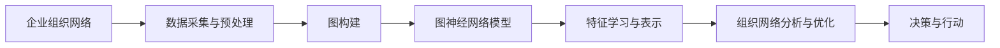

# 企业AI Agent的图神经网络在组织网络优化中的应用

> 关键词：企业AI Agent、图神经网络、组织网络优化、人工智能、企业管理

> 摘要：本文深入探讨了企业AI Agent的图神经网络在组织网络优化中的应用。首先介绍了相关背景，包括目的、预期读者、文档结构和术语表。接着阐述了核心概念与联系，通过文本示意图和Mermaid流程图展示其原理和架构。详细讲解了核心算法原理和具体操作步骤，并用Python源代码进行说明。同时给出了数学模型和公式，并举例说明。通过项目实战，展示了代码的实际案例和详细解释。分析了实际应用场景，推荐了相关的工具和资源。最后总结了未来发展趋势与挑战，还提供了常见问题与解答以及扩展阅读和参考资料，旨在为企业在组织网络优化方面提供全面的技术支持和指导。

## 1. 背景介绍 
### 1.1 目的和范围
随着企业规模的不断扩大和业务的日益复杂，企业组织网络变得越来越庞大和复杂。如何优化组织网络，提高企业的运营效率、决策能力和竞争力，成为企业面临的重要挑战。企业AI Agent的图神经网络作为一种新兴的技术手段，为组织网络优化提供了新的思路和方法。

本文的目的是深入研究企业AI Agent的图神经网络在组织网络优化中的应用，包括其原理、算法、实际案例等，为企业提供全面的技术指导和解决方案。范围涵盖了从理论基础到实际应用的各个方面，旨在帮助企业更好地理解和应用这一技术。

### 1.2 预期读者
本文的预期读者主要包括企业管理人员、技术研发人员、数据分析师以及对人工智能和企业管理感兴趣的专业人士。企业管理人员可以通过本文了解如何利用图神经网络优化企业组织网络，提高企业的运营效率和竞争力；技术研发人员可以深入学习图神经网络的原理和算法，开发相关的应用系统；数据分析师可以掌握如何运用图神经网络处理和分析企业组织网络数据；对人工智能和企业管理感兴趣的专业人士可以拓宽知识面，了解前沿技术的应用。

### 1.3 文档结构概述
本文共分为10个部分。第一部分是背景介绍，包括目的和范围、预期读者、文档结构概述和术语表；第二部分阐述核心概念与联系，通过文本示意图和Mermaid流程图展示图神经网络在企业组织网络优化中的原理和架构；第三部分详细讲解核心算法原理和具体操作步骤，并用Python源代码进行说明；第四部分给出数学模型和公式，并举例说明；第五部分通过项目实战，展示代码的实际案例和详细解释；第六部分分析实际应用场景；第七部分推荐相关的工具和资源；第八部分总结未来发展趋势与挑战；第九部分提供常见问题与解答；第十部分列出扩展阅读和参考资料。

### 1.4 术语表
#### 1.4.1 核心术语定义
- **企业AI Agent**：是一种能够在企业环境中自主执行任务、学习和适应的人工智能实体，它可以感知企业环境中的信息，做出决策并采取行动。
- **图神经网络（GNN）**：是一种专门处理图结构数据的神经网络，它可以对图中的节点和边进行特征学习和表示，从而实现对图数据的分析和处理。
- **组织网络**：是指企业内部各个部门、人员之间的关系网络，包括正式的组织结构和非正式的社交网络。
- **组织网络优化**：是指通过对企业组织网络的分析和调整，提高组织的效率、协作能力和创新能力，以实现企业的战略目标。

#### 1.4.2 相关概念解释
- **图**：是一种由节点和边组成的数据结构，节点表示实体，边表示实体之间的关系。在企业组织网络中，节点可以表示部门、人员等，边可以表示合作关系、汇报关系等。
- **节点特征**：是指节点所具有的属性，如部门的职能、人员的技能等。
- **边特征**：是指边所具有的属性，如合作的频率、汇报的层级等。

#### 1.4.3 缩略词列表
- **GNN**：Graph Neural Network（图神经网络）
- **AI**：Artificial Intelligence（人工智能）

## 2. 核心概念与联系 
### 核心概念原理
企业AI Agent的图神经网络在组织网络优化中的核心原理是将企业组织网络抽象为图结构数据，利用图神经网络对图中的节点和边进行特征学习和表示，从而挖掘组织网络中的潜在信息和规律，为组织网络优化提供决策支持。

图神经网络通过消息传递机制，在图的节点之间传递和聚合信息，更新节点的特征表示。具体来说，每个节点会根据其邻居节点的特征和边的特征，更新自己的特征。经过多次消息传递和更新，节点的特征可以包含整个图的信息。

### 架构示意图
以下是企业AI Agent的图神经网络在组织网络优化中的架构文本示意图：

企业组织网络 -> 数据采集与预处理 -> 图构建 -> 图神经网络模型 -> 特征学习与表示 -> 组织网络分析与优化 -> 决策与行动

具体解释如下：
1. **企业组织网络**：是优化的对象，包含了企业内部各个部门、人员之间的关系信息。
2. **数据采集与预处理**：从企业的各种数据源中采集组织网络相关的数据，并进行清洗、转换和归一化等预处理操作。
3. **图构建**：将预处理后的数据转换为图结构数据，确定节点和边的定义，并为节点和边赋予相应的特征。
4. **图神经网络模型**：选择合适的图神经网络模型，如GCN（Graph Convolutional Network）、GAT（Graph Attention Network）等，对图数据进行训练。
5. **特征学习与表示**：通过图神经网络模型学习节点和边的特征表示，挖掘组织网络中的潜在信息。
6. **组织网络分析与优化**：根据学习到的特征表示，对组织网络进行分析，如节点重要性评估、社区发现等，并提出优化建议。
7. **决策与行动**：企业管理人员根据分析结果做出决策，并采取相应的行动，如调整组织结构、优化人员配置等。

### Mermaid流程图


## 3. 核心算法原理 & 具体操作步骤 
### 核心算法原理
本文以图卷积网络（GCN）为例，介绍企业AI Agent的图神经网络在组织网络优化中的核心算法原理。

GCN是一种基于谱图理论的图神经网络，它通过对图的拉普拉斯矩阵进行卷积操作，实现节点特征的更新。具体来说，GCN的第 $l$ 层的节点特征更新公式为：

$$H^{(l+1)} = \sigma(\tilde{D}^{-\frac{1}{2}}\tilde{A}\tilde{D}^{-\frac{1}{2}}H^{(l)}W^{(l)})$$

其中：
- $H^{(l)}$ 是第 $l$ 层的节点特征矩阵，形状为 $N \times F^{(l)}$，$N$ 是节点数量，$F^{(l)}$ 是第 $l$ 层的特征维度。
- $\tilde{A} = A + I$ 是邻接矩阵 $A$ 加上自环的矩阵，$I$ 是单位矩阵。
- $\tilde{D}$ 是 $\tilde{A}$ 的度矩阵，即 $\tilde{D}_{ii} = \sum_{j=0}^{N - 1}\tilde{A}_{ij}$。
- $W^{(l)}$ 是第 $l$ 层的可学习权重矩阵，形状为 $F^{(l)} \times F^{(l+1)}$。
- $\sigma$ 是激活函数，如ReLU函数。

### 具体操作步骤
#### 步骤1：数据准备
首先，需要从企业的各种数据源中采集组织网络相关的数据，如员工信息、部门信息、合作关系等。然后，对数据进行清洗、转换和归一化等预处理操作，将数据转换为适合图神经网络处理的格式。

#### 步骤2：图构建
根据预处理后的数据，构建图结构数据。确定节点和边的定义，例如节点可以表示员工或部门，边可以表示合作关系或汇报关系。为节点和边赋予相应的特征，如员工的技能、部门的职能、合作的频率等。

#### 步骤3：模型定义
使用深度学习框架（如PyTorch或TensorFlow）定义GCN模型。以下是一个使用PyTorch实现的简单GCN模型示例：

```python
import torch
import torch.nn as nn
import torch.nn.functional as F

class GCN(nn.Module):
    def __init__(self, in_features, hidden_features, out_features):
        super(GCN, self).__init__()
        self.fc1 = nn.Linear(in_features, hidden_features)
        self.fc2 = nn.Linear(hidden_features, out_features)

    def forward(self, x, adj):
        x = F.relu(torch.spmm(adj, self.fc1(x)))
        x = torch.spmm(adj, self.fc2(x))
        return x
```

#### 步骤4：模型训练
将构建好的图数据输入到GCN模型中进行训练。定义损失函数和优化器，如交叉熵损失函数和Adam优化器。在训练过程中，不断更新模型的参数，使模型能够学习到节点和边的特征表示。

```python
# 假设已经有了节点特征矩阵x和邻接矩阵adj
# 定义模型
model = GCN(in_features=10, hidden_features=20, out_features=5)

# 定义损失函数和优化器
criterion = nn.CrossEntropyLoss()
optimizer = torch.optim.Adam(model.parameters(), lr=0.01)

# 训练模型
for epoch in range(100):
    optimizer.zero_grad()
    output = model(x, adj)
    loss = criterion(output, labels)
    loss.backward()
    optimizer.step()
    print(f'Epoch {epoch}: Loss = {loss.item()}')
```

#### 步骤5：组织网络分析与优化
使用训练好的模型对组织网络进行分析，如节点重要性评估、社区发现等。根据分析结果，提出组织网络优化建议，如调整组织结构、优化人员配置等。

## 4. 数学模型和公式 & 详细讲解 & 举例说明 
### 数学模型和公式
#### 图的基本概念
设图 $G=(V, E)$，其中 $V = \{v_1, v_2, \cdots, v_N\}$ 是节点集合，$E = \{(v_i, v_j)\}$ 是边集合。邻接矩阵 $A$ 是一个 $N \times N$ 的矩阵，其中 $A_{ij} = 1$ 表示节点 $v_i$ 和 $v_j$ 之间存在边，$A_{ij} = 0$ 表示不存在边。

度矩阵 $D$ 是一个对角矩阵，其中 $D_{ii} = \sum_{j=0}^{N - 1}A_{ij}$，表示节点 $v_i$ 的度。

#### 图拉普拉斯矩阵
图的拉普拉斯矩阵 $L$ 定义为：

$$L = D - A$$

对称归一化的拉普拉斯矩阵 $\tilde{L}$ 定义为：

$$\tilde{L} = I - \tilde{D}^{-\frac{1}{2}}\tilde{A}\tilde{D}^{-\frac{1}{2}}$$

其中 $\tilde{A} = A + I$，$\tilde{D}$ 是 $\tilde{A}$ 的度矩阵。

#### GCN的数学公式
如前文所述，GCN的第 $l$ 层的节点特征更新公式为：

$$H^{(l+1)} = \sigma(\tilde{D}^{-\frac{1}{2}}\tilde{A}\tilde{D}^{-\frac{1}{2}}H^{(l)}W^{(l)})$$

### 详细讲解
- **邻接矩阵**：邻接矩阵用于表示图中节点之间的连接关系。通过邻接矩阵，可以方便地计算节点的度和进行图的遍历等操作。
- **度矩阵**：度矩阵记录了每个节点的度，即与该节点相连的边的数量。度矩阵在图拉普拉斯矩阵的定义中起着重要作用。
- **图拉普拉斯矩阵**：图拉普拉斯矩阵是图的一种重要表示，它反映了图的拓扑结构。对称归一化的拉普拉斯矩阵可以用于图卷积操作，使得GCN能够在图上进行有效的信息传播。
- **GCN的更新公式**：GCN的更新公式通过对邻接矩阵进行归一化处理，然后与节点特征矩阵和可学习权重矩阵相乘，再经过激活函数处理，实现了节点特征的更新。在每一层的更新中，节点会吸收其邻居节点的信息，从而学习到整个图的结构信息。

### 举例说明
假设有一个简单的图，包含3个节点 $v_1$、$v_2$ 和 $v_3$，节点之间的连接关系如下：$v_1$ 与 $v_2$ 相连，$v_2$ 与 $v_3$ 相连。则邻接矩阵 $A$ 为：

$$A = \begin{bmatrix}
0 & 1 & 0 \\
1 & 0 & 1 \\
0 & 1 & 0
\end{bmatrix}$$

度矩阵 $D$ 为：

$$D = \begin{bmatrix}
1 & 0 & 0 \\
0 & 2 & 0 \\
0 & 0 & 1
\end{bmatrix}$$

图拉普拉斯矩阵 $L$ 为：

$$L = D - A = \begin{bmatrix}
1 & -1 & 0 \\
-1 & 2 & -1 \\
0 & -1 & 1
\end{bmatrix}$$

假设初始节点特征矩阵 $H^{(0)}$ 为：

$$H^{(0)} = \begin{bmatrix}
1 \\
2 \\
3
\end{bmatrix}$$

可学习权重矩阵 $W^{(0)}$ 为：

$$W^{(0)} = \begin{bmatrix}
0.1 \\
0.2 \\
0.3
\end{bmatrix}$$

经过GCN的第一层更新后，节点特征矩阵 $H^{(1)}$ 可以按照更新公式计算得到。

## 5. 项目实战：代码实际案例和详细解释说明 
### 5.1  开发环境搭建
#### 安装Python
首先，需要安装Python 3.x版本。可以从Python官方网站（https://www.python.org/downloads/） 下载适合自己操作系统的Python安装包，并按照安装向导进行安装。

#### 安装深度学习框架
本文使用PyTorch作为深度学习框架。可以通过以下命令安装PyTorch：

```sh
pip install torch torchvision
```

#### 安装其他依赖库
还需要安装一些其他的依赖库，如NumPy、SciPy等。可以使用以下命令进行安装：

```sh
pip install numpy scipy
```

### 5.2  源代码详细实现和代码解读
#### 数据准备
假设我们有一个简单的企业组织网络数据，包含员工信息和合作关系。以下是一个简单的数据准备示例：

```python
import numpy as np
import torch

# 节点特征矩阵
node_features = np.array([
    [1, 2, 3],
    [4, 5, 6],
    [7, 8, 9]
])
node_features = torch.FloatTensor(node_features)

# 邻接矩阵
adj_matrix = np.array([
    [0, 1, 0],
    [1, 0, 1],
    [0, 1, 0]
])
adj_matrix = torch.FloatTensor(adj_matrix)

# 标签（假设用于分类任务）
labels = torch.tensor([0, 1, 0])
```

#### 定义GCN模型
```python
import torch.nn as nn
import torch.nn.functional as F

class GCN(nn.Module):
    def __init__(self, in_features, hidden_features, out_features):
        super(GCN, self).__init__()
        self.fc1 = nn.Linear(in_features, hidden_features)
        self.fc2 = nn.Linear(hidden_features, out_features)

    def forward(self, x, adj):
        x = F.relu(torch.mm(adj, self.fc1(x)))
        x = torch.mm(adj, self.fc2(x))
        return x
```

#### 训练模型
```python
# 定义模型
model = GCN(in_features=3, hidden_features=5, out_features=2)

# 定义损失函数和优化器
criterion = nn.CrossEntropyLoss()
optimizer = torch.optim.Adam(model.parameters(), lr=0.01)

# 训练模型
for epoch in range(100):
    optimizer.zero_grad()
    output = model(node_features, adj_matrix)
    loss = criterion(output, labels)
    loss.backward()
    optimizer.step()
    print(f'Epoch {epoch}: Loss = {loss.item()}')
```

### 5.3  代码解读与分析
#### 数据准备部分
- `node_features`：表示节点的特征矩阵，每一行代表一个节点的特征向量。
- `adj_matrix`：表示邻接矩阵，用于表示节点之间的连接关系。
- `labels`：表示节点的标签，用于分类任务。

#### 模型定义部分
- `GCN` 类继承自 `nn.Module`，是一个简单的两层GCN模型。
- `__init__` 方法中定义了两层全连接层 `fc1` 和 `fc2`。
- `forward` 方法中实现了GCN的前向传播过程，包括ReLU激活函数的使用。

#### 训练部分
- 定义了损失函数 `criterion` 和优化器 `optimizer`。
- 在每个epoch中，首先将优化器的梯度清零，然后计算模型的输出和损失，接着进行反向传播和参数更新。

通过以上代码，可以实现一个简单的GCN模型的训练过程，用于企业组织网络数据的处理和分析。

## 6. 实际应用场景 
### 组织结构优化
企业可以利用图神经网络对组织网络进行分析，识别出关键节点和重要部门。例如，通过计算节点的重要性指标（如度中心性、介数中心性等），可以找出在组织网络中起到核心作用的员工或部门。根据分析结果，企业可以调整组织结构，如合并或拆分部门，优化人员配置，提高组织的效率和协作能力。

### 团队协作优化
图神经网络可以分析员工之间的合作关系，发现团队中的协作模式和潜在问题。例如，通过社区发现算法，可以将员工划分为不同的社区，了解团队的内部结构。如果发现某个社区内部的协作不够紧密，可以采取措施加强团队建设，如组织团队活动、调整工作流程等。

### 知识传播与创新
在企业组织网络中，知识的传播和创新对于企业的发展至关重要。图神经网络可以分析知识在组织中的传播路径和速度，找出知识传播的关键节点。企业可以通过培训、激励等方式，提高这些关键节点的知识传播能力，促进知识的共享和创新。

### 风险预警与管理
企业组织网络中存在各种风险，如人员流失、业务中断等。图神经网络可以通过对组织网络的实时监测，发现潜在的风险因素。例如，如果某个关键节点的连接关系发生了异常变化，可能预示着该节点对应的员工或部门存在问题。企业可以及时采取措施，进行风险预警和管理。

## 7. 工具和资源推荐
### 7.1 学习资源推荐
#### 7.1.1 书籍推荐
- 《图神经网络：基础、前沿与应用》：全面介绍了图神经网络的基本原理、算法和应用，是学习图神经网络的经典书籍。
- 《深度学习》：虽然不是专门针对图神经网络的书籍，但它涵盖了深度学习的基础知识和核心算法，对于理解图神经网络的原理有很大帮助。

#### 7.1.2 在线课程
- Coursera上的“Graph Neural Networks for Machine Learning”：由知名学者授课，系统地介绍了图神经网络的理论和实践。
- edX上的“Deep Learning for Graphs”：提供了丰富的案例和代码实现，帮助学习者更好地掌握图神经网络的应用。

#### 7.1.3 技术博客和网站
- Medium上的“Graph Neural Networks”专栏：汇集了图神经网络领域的最新研究成果和实践经验。
- 图灵社区的“图神经网络”板块：提供了大量的技术文章和讨论，有助于拓宽知识面。

### 7.2 开发工具框架推荐
#### 7.2.1 IDE和编辑器
- PyCharm：是一款专业的Python集成开发环境，具有强大的代码编辑、调试和项目管理功能，适合开发图神经网络项目。
- Jupyter Notebook：是一个交互式的开发环境，支持代码、文本、图像等多种形式的展示，方便进行数据探索和模型调试。

#### 7.2.2 调试和性能分析工具
- TensorBoard：是TensorFlow提供的可视化工具，可以用于监控模型的训练过程、可视化模型结构和分析性能指标。
- PyTorch Profiler：可以帮助开发者分析PyTorch模型的性能瓶颈，找出需要优化的部分。

#### 7.2.3 相关框架和库
- PyTorch Geometric：是一个基于PyTorch的图神经网络库，提供了丰富的图神经网络模型和工具，方便开发者进行图数据的处理和分析。
- DGL（Deep Graph Library）：是一个用于图神经网络的深度学习框架，支持多种深度学习后端，具有高效的图计算能力。

### 7.3 相关论文著作推荐
#### 7.3.1 经典论文
- “Semi-Supervised Classification with Graph Convolutional Networks”：首次提出了图卷积网络（GCN）的概念，为图神经网络的发展奠定了基础。
- “Graph Attention Networks”：提出了图注意力网络（GAT），通过引入注意力机制，提高了图神经网络的表达能力。

#### 7.3.2 最新研究成果
- 可以关注NeurIPS、ICML、KDD等顶级学术会议上关于图神经网络的研究论文，了解该领域的最新进展。

#### 7.3.3 应用案例分析
- 一些企业和研究机构会发布关于图神经网络在实际应用中的案例分析报告，可以从中学习到如何将图神经网络应用于具体的业务场景。

## 8. 总结：未来发展趋势与挑战
### 未来发展趋势
#### 与其他技术的融合
企业AI Agent的图神经网络将与其他技术（如自然语言处理、计算机视觉等）进行更深入的融合。例如，结合自然语言处理技术，可以对企业组织网络中的文本信息进行分析，挖掘潜在的知识和关系；结合计算机视觉技术，可以对企业的物理空间布局进行分析，优化办公环境。

#### 可解释性增强
随着图神经网络在企业决策中的应用越来越广泛，对其可解释性的要求也越来越高。未来的研究将致力于提高图神经网络的可解释性，使企业管理人员能够更好地理解模型的决策过程和结果，从而做出更合理的决策。

#### 应用场景拓展
图神经网络在企业组织网络优化中的应用场景将不断拓展。除了现有的组织结构优化、团队协作优化等场景，还将应用于企业的供应链管理、市场营销、客户关系管理等领域，为企业的全面发展提供支持。

### 挑战
#### 数据质量和隐私问题
企业组织网络数据往往来自多个数据源，数据质量参差不齐。同时，数据中可能包含员工的个人隐私信息，如何保证数据的质量和隐私安全是一个重要的挑战。

#### 模型复杂度和计算资源需求
图神经网络模型通常比较复杂，需要大量的计算资源进行训练和推理。对于一些中小型企业来说，可能无法承担高昂的计算成本。因此，如何优化模型结构，降低计算资源需求是一个亟待解决的问题。

#### 人才短缺
目前，掌握图神经网络技术的专业人才相对较少。企业在应用图神经网络进行组织网络优化时，可能面临人才短缺的问题。因此，培养和吸引相关专业人才是企业面临的一个重要挑战。

## 9. 附录：常见问题与解答
### 问题1：图神经网络和传统神经网络有什么区别？
传统神经网络主要处理结构化的数据（如向量、矩阵等），而图神经网络专门处理图结构数据。图神经网络考虑了图中节点之间的连接关系，通过消息传递机制在节点之间传播和聚合信息，从而学习到图的结构信息。而传统神经网络没有考虑数据之间的拓扑结构。

### 问题2：如何选择合适的图神经网络模型？
选择合适的图神经网络模型需要考虑多个因素，如数据的特点、任务的类型、计算资源等。如果数据的图结构比较简单，可以选择简单的GCN模型；如果需要考虑节点之间的重要性差异，可以选择GAT模型。同时，还需要根据计算资源的情况选择合适的模型复杂度。

### 问题3：图神经网络在企业组织网络优化中的应用效果如何评估？
可以从多个方面评估图神经网络在企业组织网络优化中的应用效果，如组织效率的提升、团队协作能力的增强、知识传播速度的加快等。可以通过对比优化前后的相关指标（如业务流程的执行时间、团队的绩效评估结果等）来评估应用效果。

### 问题4：图神经网络的训练时间一般需要多久？
图神经网络的训练时间取决于多个因素，如数据的规模、模型的复杂度、计算资源等。对于小规模的数据和简单的模型，训练时间可能只需要几分钟或几小时；对于大规模的数据和复杂的模型，训练时间可能需要数天甚至数周。

## 10. 扩展阅读 & 参考资料
### 扩展阅读
- 《人工智能：现代方法》：全面介绍了人工智能的基本概念、算法和应用，对于深入理解企业AI Agent和图神经网络有很大帮助。
- 《网络科学》：介绍了网络的基本概念、结构和动力学，有助于更好地理解企业组织网络的本质。

### 参考资料
- Kipf, T. N., & Welling, M. (2016). Semi-Supervised Classification with Graph Convolutional Networks. arXiv preprint arXiv:1609.02907.
- Veličković, P., Cucurull, G., Casanova, A., Romero, A., Lio, P., & Bengio, Y. (2017). Graph Attention Networks. arXiv preprint arXiv:1710.10903.

作者：AI天才研究院/AI Genius Institute & 禅与计算机程序设计艺术 /Zen And The Art of Computer Programming