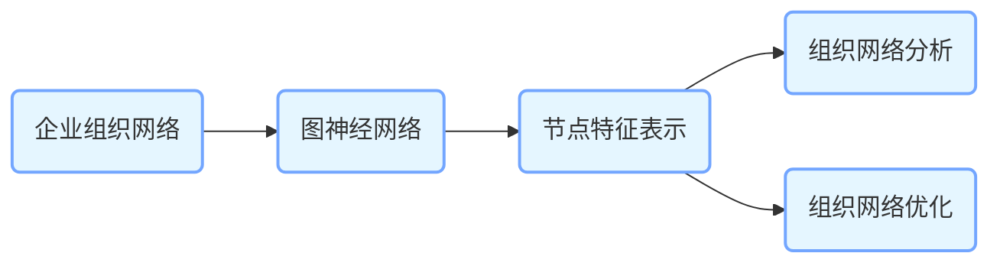

# 企业AI Agent的图神经网络在组织网络分析与优化中的应用

> 关键词：企业AI Agent、图神经网络、组织网络分析、组织网络优化、复杂网络建模

> 摘要：本文深入探讨了企业AI Agent的图神经网络在组织网络分析与优化中的应用。首先介绍了相关背景，包括目的范围、预期读者等内容。接着阐述了核心概念与联系，展示了图神经网络和企业组织网络的原理及架构。详细讲解了核心算法原理与具体操作步骤，使用Python代码进行示例。通过数学模型和公式进一步分析其原理，并举例说明。结合项目实战，给出代码实际案例并进行详细解释。探讨了实际应用场景，推荐了相关工具和资源，最后总结未来发展趋势与挑战，解答常见问题并提供扩展阅读与参考资料，旨在为企业利用图神经网络进行组织网络的有效分析和优化提供全面的技术指导。

## 1. 背景介绍 
### 1.1 目的和范围
在当今数字化和智能化的时代，企业面临着日益复杂的组织管理挑战。企业的组织网络包含了大量的信息，如员工之间的协作关系、部门之间的沟通模式等。理解和优化这些组织网络对于提高企业的运营效率、创新能力和竞争力至关重要。

本文的目的是探讨如何利用企业AI Agent结合图神经网络技术来进行组织网络的分析与优化。范围涵盖了从图神经网络的基本原理到在企业组织网络中的具体应用，包括算法实现、实际案例分析以及未来发展趋势等方面。

### 1.2 预期读者
本文预期读者包括企业管理人员、数据科学家、人工智能研究人员、软件开发人员以及对企业组织管理和人工智能技术感兴趣的人士。企业管理人员可以从中了解如何利用先进技术提升组织管理水平；数据科学家和人工智能研究人员可以深入研究图神经网络在企业领域的应用；软件开发人员可以获取相关的代码实现和开发思路。

### 1.3 文档结构概述
本文将按照以下结构进行阐述：首先介绍核心概念与联系，让读者了解图神经网络和企业组织网络的基本原理和关系；接着讲解核心算法原理和具体操作步骤，并给出Python代码示例；然后通过数学模型和公式进一步解释其原理，并举例说明；随后进行项目实战，展示代码实际案例并详细解释；探讨实际应用场景；推荐相关的工具和资源；最后总结未来发展趋势与挑战，解答常见问题并提供扩展阅读与参考资料。

### 1.4 术语表
#### 1.4.1 核心术语定义
- **企业AI Agent**：是一种能够在企业环境中自主执行任务、感知环境并做出决策的智能实体。它可以收集和分析企业组织网络中的数据，辅助企业进行管理和决策。
- **图神经网络（Graph Neural Network，GNN）**：是一种专门处理图结构数据的神经网络。图由节点和边组成，节点可以表示企业中的员工、部门等实体，边表示它们之间的关系，如图1所示。GNN通过对图的节点和边进行信息传播和聚合，学习图的结构和特征。
- **组织网络**：指企业内部员工、部门之间的关系网络，包括协作关系、沟通关系、权力关系等。它可以用图来表示，是图神经网络处理的对象。

#### 1.4.2 相关概念解释
- **信息传播**：在图神经网络中，信息传播是指节点之间通过边传递信息的过程。每个节点根据其邻居节点的信息更新自身的特征表示。
- **聚合操作**：是将邻居节点的信息进行汇总的操作，常见的聚合方法有求和、平均、最大值等。
- **图嵌入**：将图中的节点或整个图映射到低维向量空间的过程，使得在向量空间中可以进行相似度计算和其他分析。

#### 1.4.3 缩略词列表
- **GNN**：Graph Neural Network，图神经网络
- **AI**：Artificial Intelligence，人工智能

## 2. 核心概念与联系 
### 核心概念原理
#### 图神经网络原理
图神经网络的核心思想是通过信息传播和聚合来学习图中节点的特征表示。以最简单的图卷积网络（Graph Convolutional Network，GCN）为例，其原理如下：

设图 $G=(V, E)$，其中 $V$ 是节点集合，$E$ 是边集合。每个节点 $v_i \in V$ 有一个特征向量 $x_i$。GCN的一层传播可以表示为：

$$H^{(l+1)} = \sigma(\tilde{D}^{-\frac{1}{2}}\tilde{A}\tilde{D}^{-\frac{1}{2}}H^{(l)}W^{(l)})$$

其中，$H^{(l)}$ 是第 $l$ 层的节点特征矩阵，$W^{(l)}$ 是可学习的权重矩阵，$\sigma$ 是激活函数，$\tilde{A} = A + I$ 是邻接矩阵 $A$ 加上自环的矩阵，$\tilde{D}$ 是 $\tilde{A}$ 的度矩阵。

#### 企业组织网络原理
企业组织网络可以用图来建模，节点表示企业中的实体，如员工、部门等，边表示它们之间的关系。例如，两个员工之间有协作关系，则在图中对应的节点之间有一条边相连。组织网络反映了企业内部的信息流动、协作模式和权力结构等。

### 架构示意图
图1展示了企业组织网络和图神经网络的架构关系。企业组织网络作为输入，经过图神经网络的处理，得到节点的特征表示，这些特征可以用于组织网络的分析和优化。



图1：企业组织网络和图神经网络架构关系图

## 3. 核心算法原理 & 具体操作步骤 
### 核心算法原理
以图卷积网络（GCN）为例，其算法原理主要包括信息传播和特征更新两个步骤。

#### 信息传播
信息传播是指节点之间通过边传递信息的过程。在GCN中，每个节点会收集其邻居节点的信息，并根据邻居节点的重要性进行加权求和。具体来说，节点 $i$ 的邻居节点集合为 $N(i)$，则节点 $i$ 在第 $l+1$ 层接收的信息可以表示为：

$$\hat{h}_i^{(l+1)} = \sum_{j \in N(i) \cup \{i\}} \frac{1}{\sqrt{d_i d_j}} h_j^{(l)} W^{(l)}$$

其中，$d_i$ 和 $d_j$ 分别是节点 $i$ 和 $j$ 的度，$h_j^{(l)}$ 是节点 $j$ 在第 $l$ 层的特征向量，$W^{(l)}$ 是可学习的权重矩阵。

#### 特征更新
在接收到邻居节点的信息后，节点 $i$ 更新自身的特征表示：

$$h_i^{(l+1)} = \sigma(\hat{h}_i^{(l+1)})$$

其中，$\sigma$ 是激活函数，如ReLU函数。

### 具体操作步骤
以下是使用Python和PyTorch实现一个简单的GCN模型的具体步骤：

```python
import torch
import torch.nn as nn
import torch.nn.functional as F

# 定义GCN层
class GCNLayer(nn.Module):
    def __init__(self, in_features, out_features):
        super(GCNLayer, self).__init__()
        self.linear = nn.Linear(in_features, out_features)

    def forward(self, x, adj):
        # 信息传播
        support = torch.mm(x, self.linear.weight)
        output = torch.spmm(adj, support)
        # 特征更新
        output = F.relu(output)
        return output

# 定义GCN模型
class GCN(nn.Module):
    def __init__(self, nfeat, nhid, nclass):
        super(GCN, self).__init__()
        self.gc1 = GCNLayer(nfeat, nhid)
        self.gc2 = GCNLayer(nhid, nclass)

    def forward(self, x, adj):
        x = self.gc1(x, adj)
        x = self.gc2(x, adj)
        return F.log_softmax(x, dim=1)
```

### 代码解释
- `GCNLayer` 类实现了一个GCN层，包含信息传播和特征更新两个步骤。在 `forward` 方法中，首先通过 `torch.mm` 计算节点特征与权重矩阵的乘积，然后通过 `torch.spmm` 进行信息传播，最后使用ReLU激活函数进行特征更新。
- `GCN` 类实现了一个两层的GCN模型，包含两个GCN层。在 `forward` 方法中，依次调用两个GCN层，并使用 `F.log_softmax` 进行分类。

## 4. 数学模型和公式 & 详细讲解 & 举例说明 
### 数学模型和公式
#### 图卷积网络的数学模型
图卷积网络的数学模型可以用以下公式表示：

$$H^{(l+1)} = \sigma(\tilde{D}^{-\frac{1}{2}}\tilde{A}\tilde{D}^{-\frac{1}{2}}H^{(l)}W^{(l)})$$

其中，$H^{(l)}$ 是第 $l$ 层的节点特征矩阵，$W^{(l)}$ 是可学习的权重矩阵，$\sigma$ 是激活函数，$\tilde{A} = A + I$ 是邻接矩阵 $A$ 加上自环的矩阵，$\tilde{D}$ 是 $\tilde{A}$ 的度矩阵。

#### 详细讲解
- **邻接矩阵 $A$**：表示图中节点之间的连接关系。如果节点 $i$ 和节点 $j$ 之间有边相连，则 $A_{ij}=1$，否则 $A_{ij}=0$。
- **自环矩阵 $I$**：是一个单位矩阵，用于确保每个节点在信息传播过程中考虑自身的信息。
- **度矩阵 $\tilde{D}$**：是一个对角矩阵，其对角元素 $\tilde{D}_{ii}$ 表示节点 $i$ 的度（包括自环）。
- **归一化操作 $\tilde{D}^{-\frac{1}{2}}\tilde{A}\tilde{D}^{-\frac{1}{2}}$**：用于对邻接矩阵进行归一化，使得信息传播更加稳定。
- **权重矩阵 $W^{(l)}$**：是可学习的参数，通过训练来优化。
- **激活函数 $\sigma$**：引入非线性，增强模型的表达能力。

### 举例说明
假设有一个简单的图，包含3个节点，其邻接矩阵 $A$ 为：

$$A = \begin{bmatrix}
0 & 1 & 1 \\
1 & 0 & 1 \\
1 & 1 & 0
\end{bmatrix}$$

加上自环后的矩阵 $\tilde{A}$ 为：

$$\tilde{A} = \begin{bmatrix}
1 & 1 & 1 \\
1 & 1 & 1 \\
1 & 1 & 1
\end{bmatrix}$$

$\tilde{A}$ 的度矩阵 $\tilde{D}$ 为：

$$\tilde{D} = \begin{bmatrix}
3 & 0 & 0 \\
0 & 3 & 0 \\
0 & 0 & 3
\end{bmatrix}$$

则归一化后的矩阵 $\tilde{D}^{-\frac{1}{2}}\tilde{A}\tilde{D}^{-\frac{1}{2}}$ 为：

$$\tilde{D}^{-\frac{1}{2}}\tilde{A}\tilde{D}^{-\frac{1}{2}} = \frac{1}{3} \begin{bmatrix}
1 & 1 & 1 \\
1 & 1 & 1 \\
1 & 1 & 1
\end{bmatrix}$$

假设第 $l$ 层的节点特征矩阵 $H^{(l)}$ 为：

$$H^{(l)} = \begin{bmatrix}
1 & 2 \\
3 & 4 \\
5 & 6
\end{bmatrix}$$

可学习的权重矩阵 $W^{(l)}$ 为：

$$W^{(l)} = \begin{bmatrix}
0.1 & 0.2 \\
0.3 & 0.4
\end{bmatrix}$$

则第 $l+1$ 层的节点特征矩阵 $H^{(l+1)}$ 为：

$$H^{(l+1)} = \sigma(\tilde{D}^{-\frac{1}{2}}\tilde{A}\tilde{D}^{-\frac{1}{2}}H^{(l)}W^{(l)})$$

首先计算 $\tilde{D}^{-\frac{1}{2}}\tilde{A}\tilde{D}^{-\frac{1}{2}}H^{(l)}$：

$$\tilde{D}^{-\frac{1}{2}}\tilde{A}\tilde{D}^{-\frac{1}{2}}H^{(l)} = \frac{1}{3} \begin{bmatrix}
1 & 1 & 1 \\
1 & 1 & 1 \\
1 & 1 & 1
\end{bmatrix} \begin{bmatrix}
1 & 2 \\
3 & 4 \\
5 & 6
\end{bmatrix} = \begin{bmatrix}
3 & 4 \\
3 & 4 \\
3 & 4
\end{bmatrix}$$

然后计算 $\tilde{D}^{-\frac{1}{2}}\tilde{A}\tilde{D}^{-\frac{1}{2}}H^{(l)}W^{(l)}$：

$$\tilde{D}^{-\frac{1}{2}}\tilde{A}\tilde{D}^{-\frac{1}{2}}H^{(l)}W^{(l)} = \begin{bmatrix}
3 & 4 \\
3 & 4 \\
3 & 4
\end{bmatrix} \begin{bmatrix}
0.1 & 0.2 \\
0.3 & 0.4
\end{bmatrix} = \begin{bmatrix}
1.5 & 2.2 \\
1.5 & 2.2 \\
1.5 & 2.2
\end{bmatrix}$$

假设激活函数 $\sigma$ 为ReLU函数，则：

$$H^{(l+1)} = \begin{bmatrix}
1.5 & 2.2 \\
1.5 & 2.2 \\
1.5 & 2.2
\end{bmatrix}$$

通过这个例子可以看出，图卷积网络通过信息传播和特征更新，学习到了图中节点的特征表示。

## 5. 项目实战：代码实际案例和详细解释说明 
### 5.1  开发环境搭建
为了实现企业AI Agent的图神经网络在组织网络分析与优化中的应用，我们需要搭建以下开发环境：

- **操作系统**：推荐使用Linux系统，如Ubuntu 18.04或更高版本。
- **Python版本**：Python 3.7或更高版本。
- **深度学习框架**：PyTorch 1.7或更高版本。
- **其他库**：`numpy`、`scipy`、`networkx` 等。

可以使用以下命令安装所需的库：

```bash
pip install torch numpy scipy networkx
```

### 5.2  源代码详细实现和代码解读
以下是一个完整的项目实战代码示例，用于对企业组织网络进行分析和分类：

```python
import torch
import torch.nn as nn
import torch.nn.functional as F
import numpy as np
import scipy.sparse as sp
import networkx as nx

# 数据预处理函数
def normalize_adj(adj):
    """对称归一化邻接矩阵"""
    adj = sp.coo_matrix(adj)
    rowsum = np.array(adj.sum(1))
    d_inv_sqrt = np.power(rowsum, -0.5).flatten()
    d_inv_sqrt[np.isinf(d_inv_sqrt)] = 0.
    d_mat_inv_sqrt = sp.diags(d_inv_sqrt)
    return adj.dot(d_mat_inv_sqrt).transpose().dot(d_mat_inv_sqrt).tocoo()

def sparse_mx_to_torch_sparse_tensor(sparse_mx):
    """将稀疏矩阵转换为PyTorch稀疏张量"""
    sparse_mx = sparse_mx.tocoo().astype(np.float32)
    indices = torch.from_numpy(
        np.vstack((sparse_mx.row, sparse_mx.col)).astype(np.int64))
    values = torch.from_numpy(sparse_mx.data)
    shape = torch.Size(sparse_mx.shape)
    return torch.sparse.FloatTensor(indices, values, shape)

# 定义GCN层
class GCNLayer(nn.Module):
    def __init__(self, in_features, out_features):
        super(GCNLayer, self).__init__()
        self.linear = nn.Linear(in_features, out_features)

    def forward(self, x, adj):
        support = torch.mm(x, self.linear.weight)
        output = torch.spmm(adj, support)
        output = F.relu(output)
        return output

# 定义GCN模型
class GCN(nn.Module):
    def __init__(self, nfeat, nhid, nclass):
        super(GCN, self).__init__()
        self.gc1 = GCNLayer(nfeat, nhid)
        self.gc2 = GCNLayer(nhid, nclass)

    def forward(self, x, adj):
        x = self.gc1(x, adj)
        x = self.gc2(x, adj)
        return F.log_softmax(x, dim=1)

# 生成示例数据
def generate_example_data():
    # 创建一个简单的图
    G = nx.karate_club_graph()
    adj = nx.adjacency_matrix(G)
    adj = adj + sp.eye(adj.shape[0])  # 加上自环
    adj = normalize_adj(adj)
    adj = sparse_mx_to_torch_sparse_tensor(adj)

    # 节点特征
    features = np.eye(G.number_of_nodes(), dtype=np.float32)
    features = torch.FloatTensor(features)

    # 节点标签
    labels = np.array([0 if i < 17 else 1 for i in range(G.number_of_nodes())])
    labels = torch.LongTensor(labels)

    return features, adj, labels

# 训练模型
def train_model(model, features, adj, labels, epochs=200, lr=0.01, weight_decay=5e-4):
    optimizer = torch.optim.Adam(model.parameters(), lr=lr, weight_decay=weight_decay)

    for epoch in range(epochs):
        optimizer.zero_grad()
        output = model(features, adj)
        loss_train = F.nll_loss(output, labels)
        loss_train.backward()
        optimizer.step()

        if epoch % 10 == 0:
            print(f'Epoch: {epoch+1}, Loss: {loss_train.item()}')

    return model

# 主函数
if __name__ == "__main__":
    features, adj, labels = generate_example_data()
    nfeat = features.shape[1]
    nhid = 16
    nclass = 2
    model = GCN(nfeat, nhid, nclass)
    model = train_model(model, features, adj, labels)
```

### 5.3  代码解读与分析
- **数据预处理部分**：`normalize_adj` 函数用于对邻接矩阵进行对称归一化，使得信息传播更加稳定；`sparse_mx_to_torch_sparse_tensor` 函数用于将稀疏矩阵转换为PyTorch稀疏张量，以便在模型中使用。
- **GCN层和GCN模型部分**：`GCNLayer` 类实现了一个GCN层，包含信息传播和特征更新两个步骤；`GCN` 类实现了一个两层的GCN模型，用于对节点进行分类。
- **数据生成部分**：`generate_example_data` 函数生成一个简单的图数据，包括邻接矩阵、节点特征和节点标签。
- **训练部分**：`train_model` 函数使用Adam优化器对模型进行训练，通过最小化负对数似然损失来更新模型参数。

通过这个项目实战，我们可以看到如何使用图神经网络对企业组织网络进行分析和分类。

## 6. 实际应用场景 
### 员工协作分析
企业AI Agent的图神经网络可以用于分析员工之间的协作关系。通过构建员工协作网络，节点表示员工，边表示员工之间的协作记录，使用图神经网络可以学习到员工的特征表示。通过分析这些特征表示，可以发现员工之间的协作模式，如哪些员工经常一起合作，哪些员工在团队中起到关键作用等。这有助于企业优化团队组建，提高协作效率。

### 部门沟通优化
企业内部不同部门之间的沟通对于企业的运营至关重要。图神经网络可以用于分析部门之间的沟通网络，通过学习部门的特征表示，发现部门之间的沟通瓶颈和薄弱环节。企业可以根据分析结果优化沟通流程，加强部门之间的协作。

### 组织架构调整
通过对企业组织网络的分析，图神经网络可以帮助企业发现组织架构中存在的问题，如某些部门过于庞大或过于分散，某些层级之间的信息传递不畅等。企业可以根据分析结果进行组织架构调整，提高组织的灵活性和响应速度。

### 人才流失预测
企业AI Agent结合图神经网络可以分析员工在组织网络中的位置和特征，预测员工的流失可能性。例如，如果某个员工与其他员工的协作关系较少，或者其在组织网络中的影响力逐渐下降，那么该员工可能有较高的流失风险。企业可以提前采取措施，如提供培训、晋升机会等，留住人才。

## 7. 工具和资源推荐
### 7.1 学习资源推荐
#### 7.1.1 书籍推荐
- 《深度学习》（Deep Learning）：由Ian Goodfellow、Yoshua Bengio和Aaron Courville所著，是深度学习领域的经典教材，涵盖了神经网络的基本原理和算法。
- 《图神经网络：基础、前沿与应用》：全面介绍了图神经网络的理论和应用，适合对图神经网络感兴趣的读者。

#### 7.1.2 在线课程
- Coursera上的“Deep Learning Specialization”：由Andrew Ng教授授课，是深度学习领域的经典在线课程，涵盖了神经网络、卷积神经网络、循环神经网络等内容。
- edX上的“Graph Neural Networks for Machine Learning”：专门介绍图神经网络的原理和应用，适合深入学习图神经网络的读者。

#### 7.1.3 技术博客和网站
- Medium上的“Towards Data Science”：有许多关于人工智能、机器学习和深度学习的技术文章，包括图神经网络的最新研究成果和应用案例。
- ArXiv.org：是一个免费的预印本平台，提供了大量的学术论文，包括图神经网络领域的最新研究成果。

### 7.2 开发工具框架推荐
#### 7.2.1 IDE和编辑器
- PyCharm：是一款专门为Python开发设计的集成开发环境，提供了代码编辑、调试、版本控制等功能，适合开发图神经网络项目。
- Jupyter Notebook：是一个交互式的开发环境，支持Python代码的编写和运行，同时可以插入文本、图片等元素，方便进行数据分析和模型开发。

#### 7.2.2 调试和性能分析工具
- TensorBoard：是TensorFlow提供的一个可视化工具，可以用于可视化模型的训练过程、损失函数的变化、模型的结构等，帮助开发者调试和优化模型。
- PyTorch Profiler：是PyTorch提供的一个性能分析工具，可以分析模型的运行时间、内存使用情况等，帮助开发者优化模型的性能。

#### 7.2.3 相关框架和库
- PyTorch Geometric：是一个基于PyTorch的图神经网络框架，提供了丰富的图神经网络层和数据集，方便开发者进行图神经网络的开发。
- DGL（Deep Graph Library）：是一个用于图神经网络的深度学习框架，支持多种深度学习框架，如PyTorch、TensorFlow等，提供了高效的图计算和模型训练功能。

### 7.3 相关论文著作推荐
#### 7.3.1 经典论文
- “Semi-Supervised Classification with Graph Convolutional Networks”：提出了图卷积网络（GCN）的概念，是图神经网络领域的经典论文。
- “Graph Attention Networks”：提出了图注意力网络（GAT），通过引入注意力机制，提高了图神经网络的性能。

#### 7.3.2 最新研究成果
- 关注NeurIPS、ICML、CVPR等顶级学术会议上的论文，了解图神经网络领域的最新研究成果。

#### 7.3.3 应用案例分析
- 可以在ACM SIGKDD、IEEE ICDM等数据挖掘领域的会议上找到图神经网络在企业组织网络分析与优化中的应用案例分析。

## 8. 总结：未来发展趋势与挑战
### 未来发展趋势
#### 与其他技术的融合
企业AI Agent的图神经网络将与其他技术如知识图谱、强化学习等进行融合。例如，结合知识图谱可以为图神经网络提供更丰富的语义信息，提高模型的理解能力；结合强化学习可以实现企业组织网络的动态优化。

#### 可解释性增强
随着图神经网络在企业中的应用越来越广泛，对模型的可解释性要求也越来越高。未来的研究将致力于提高图神经网络的可解释性，使得企业管理人员能够更好地理解模型的决策过程。

#### 大规模应用
随着计算能力的提升和数据量的增加，图神经网络将在企业中得到更广泛的应用。不仅可以用于企业组织网络的分析和优化，还可以应用于供应链管理、市场营销等领域。

### 挑战
#### 数据质量和隐私问题
企业组织网络的数据往往涉及到员工的隐私信息，如何在保证数据质量的前提下保护员工的隐私是一个挑战。此外，数据的不完整性和噪声也会影响图神经网络的性能。

#### 模型复杂度和计算资源
图神经网络的模型复杂度较高，需要大量的计算资源进行训练和推理。在企业实际应用中，如何在有限的计算资源下提高模型的性能是一个挑战。

#### 业务理解和模型应用
将图神经网络应用于企业组织网络分析与优化需要对企业业务有深入的理解。如何将技术与业务需求相结合，开发出具有实际应用价值的模型是一个挑战。

## 9. 附录：常见问题与解答
### 问题1：图神经网络与传统神经网络有什么区别？
图神经网络专门处理图结构数据，而传统神经网络主要处理欧几里得空间的数据，如图像、文本等。图神经网络通过信息传播和聚合来学习图中节点的特征表示，考虑了节点之间的关系；而传统神经网络通常不考虑数据之间的拓扑结构。

### 问题2：如何选择合适的图神经网络模型？
选择合适的图神经网络模型需要考虑数据的特点、任务的需求和计算资源等因素。如果数据具有较强的局部特征，可以选择图卷积网络（GCN）；如果需要考虑节点之间的重要性差异，可以选择图注意力网络（GAT）。

### 问题3：图神经网络的训练时间较长，如何优化？
可以通过以下方法优化图神经网络的训练时间：
- 选择合适的硬件设备，如GPU；
- 采用小批量训练的方法，减少每次训练的数据量；
- 对数据进行预处理，减少数据的噪声和冗余；
- 优化模型的结构，减少模型的复杂度。

### 问题4：图神经网络在企业组织网络分析中的应用有哪些局限性？
图神经网络在企业组织网络分析中的应用存在以下局限性：
- 数据质量和隐私问题：企业组织网络的数据往往涉及到员工的隐私信息，数据的不完整性和噪声也会影响模型的性能。
- 模型可解释性：图神经网络的模型复杂度较高，其决策过程往往难以解释，这对于企业管理人员来说可能不太友好。
- 业务理解：将图神经网络应用于企业组织网络分析需要对企业业务有深入的理解，否则可能无法开发出具有实际应用价值的模型。

## 10. 扩展阅读 & 参考资料
### 扩展阅读
- 《人工智能：现代方法》（Artificial Intelligence: A Modern Approach）：全面介绍了人工智能的基本概念、算法和应用，适合对人工智能感兴趣的读者。
- 《数据挖掘：概念与技术》（Data Mining: Concepts and Techniques）：介绍了数据挖掘的基本概念、算法和应用，包括图挖掘等内容。

### 参考资料
- Kipf, T. N., & Welling, M. (2016). Semi-Supervised Classification with Graph Convolutional Networks. arXiv preprint arXiv:1609.02907.
- Veličković, P., Cucurull, G., Casanova, A., Romero, A., Lio, P., & Bengio, Y. (2017). Graph Attention Networks. arXiv preprint arXiv:1710.10903.

作者：AI天才研究院/AI Genius Institute & 禅与计算机程序设计艺术 /Zen And The Art of Computer Programming