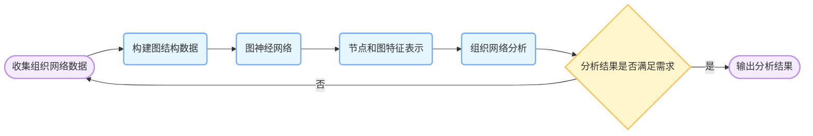

# 企业AI Agent的图神经网络在组织网络分析中的应用

> 关键词：企业AI Agent、图神经网络、组织网络分析、节点表示学习、信息传播

> 摘要：本文聚焦于企业AI Agent的图神经网络在组织网络分析中的应用。首先介绍了相关背景，包括目的、预期读者等内容。接着阐述了核心概念与联系，详细说明了图神经网络和组织网络分析的原理及架构，并给出相应的Mermaid流程图。深入讲解了核心算法原理及具体操作步骤，同时结合Python代码进行详细阐述。对涉及的数学模型和公式进行了详细讲解并举例说明。通过项目实战展示了代码的实际案例和详细解释。分析了该技术在企业中的实际应用场景，推荐了学习、开发相关的工具和资源，最后总结了未来发展趋势与挑战，并给出常见问题与解答以及扩展阅读和参考资料，旨在为企业利用图神经网络进行组织网络分析提供全面且深入的指导。

## 1. 背景介绍 
### 1.1 目的和范围
在当今数字化快速发展的时代，企业组织变得日益复杂，包含了众多的部门、员工、业务流程以及它们之间的各种关系。理解和分析这些复杂的组织网络对于企业的战略规划、资源分配、团队协作和决策制定等方面都具有至关重要的意义。本文章的目的在于探讨如何利用企业AI Agent结合图神经网络（Graph Neural Networks, GNN）技术来进行组织网络分析。具体范围涵盖了图神经网络的基本原理、在组织网络分析中的核心算法、实际应用场景以及相关的工具和资源推荐等内容。

### 1.2 预期读者
本文预期读者主要包括企业管理人员、数据科学家、机器学习工程师、人工智能研究者以及对企业组织网络分析和图神经网络技术感兴趣的相关人员。企业管理人员可以通过本文了解如何利用先进的技术手段来深入理解企业组织网络，从而做出更科学的决策；数据科学家和机器学习工程师可以从中获取技术实现的细节和思路，开展相关的研究和开发工作；人工智能研究者则可以进一步探讨该领域的前沿问题和发展方向。

### 1.3 文档结构概述
本文将按照以下结构进行详细阐述：首先介绍相关的核心概念与联系，包括图神经网络和组织网络分析的基本原理和架构，并通过文本示意图和Mermaid流程图进行直观展示；接着深入讲解核心算法原理和具体操作步骤，同时结合Python代码进行详细说明；然后介绍涉及的数学模型和公式，并举例说明其应用；通过项目实战展示代码的实际案例和详细解释；分析该技术在企业中的实际应用场景；推荐学习、开发相关的工具和资源；最后总结未来发展趋势与挑战，给出常见问题与解答以及扩展阅读和参考资料。

### 1.4 术语表
#### 1.4.1 核心术语定义
- **企业AI Agent**：是指在企业环境中具有自主决策和行动能力的人工智能实体，它可以感知企业组织网络中的各种信息，并根据预设的目标和规则进行相应的操作和决策。
- **图神经网络（GNN）**：是一类专门用于处理图结构数据的神经网络模型，它可以自动学习图中节点和边的特征表示，从而实现对图数据的分类、预测、聚类等任务。
- **组织网络分析**：是对企业组织中各个实体（如部门、员工等）之间的关系网络进行分析的过程，旨在揭示组织的结构、功能和动态变化，为企业的管理和决策提供支持。
- **节点表示学习**：是图神经网络中的一个重要任务，其目的是将图中的节点映射到一个低维向量空间中，使得节点之间的向量距离能够反映它们在图结构中的相似性。
- **信息传播**：是图神经网络的核心机制之一，通过在图的节点和边之间传递信息，使得节点能够获取其邻居节点的信息，从而更新自身的特征表示。

#### 1.4.2 相关概念解释
- **图结构数据**：是一种由节点和边组成的数据结构，节点表示实体，边表示实体之间的关系。在企业组织网络中，节点可以表示部门、员工等，边可以表示他们之间的合作关系、汇报关系等。
- **深度学习**：是机器学习的一个分支，它通过构建多层神经网络模型来自动学习数据的特征和模式，从而实现对数据的分类、预测等任务。图神经网络是深度学习在图结构数据上的应用。
- **特征工程**：是指从原始数据中提取和选择有用的特征，以提高机器学习模型的性能。在图神经网络中，特征工程包括节点特征的提取和边特征的定义等。

#### 1.4.3 缩略词列表
- **GNN**：Graph Neural Networks（图神经网络）
- **MLP**：Multi - Layer Perceptron（多层感知机）
- **ReLU**：Rectified Linear Unit（修正线性单元）

## 2. 核心概念与联系 

### 2.1 图神经网络原理
图神经网络的核心思想是通过在图的节点和边之间传递信息，来学习节点和图的特征表示。具体来说，每个节点都有一个初始的特征向量，然后通过与邻居节点的信息交互，不断更新自身的特征向量。这个过程可以通过多个图卷积层来实现，每个图卷积层都可以看作是一次信息传播和特征更新的过程。

以简单的图卷积网络（GCN）为例，其基本公式为：

$$H^{(l + 1)}=\sigma(\tilde{D}^{-\frac{1}{2}}\tilde{A}\tilde{D}^{-\frac{1}{2}}H^{(l)}W^{(l)})$$

其中，$H^{(l)}$ 是第 $l$ 层的节点特征矩阵，$\tilde{A}=A + I$ 是邻接矩阵 $A$ 加上自环后的矩阵，$\tilde{D}$ 是 $\tilde{A}$ 的度矩阵，$W^{(l)}$ 是第 $l$ 层的可学习权重矩阵，$\sigma$ 是激活函数。

### 2.2 组织网络分析原理
组织网络分析主要关注企业组织中各个实体之间的关系网络。通过收集和分析这些关系数据，可以揭示组织的结构特征，如中心性、聚类系数等；发现组织中的关键节点和关键关系；以及分析组织的动态变化，如人员流动、团队合作模式的改变等。

### 2.3 核心概念架构的文本示意图
企业AI Agent利用图神经网络进行组织网络分析的架构可以描述如下：首先，企业AI Agent从企业的各种数据源（如人力资源系统、项目管理系统等）中收集组织网络的数据，包括节点信息（如员工的基本信息、技能信息等）和边信息（如合作关系、汇报关系等）。然后，将这些数据构建成图结构数据输入到图神经网络中。图神经网络通过信息传播和特征学习，得到节点和图的特征表示。最后，企业AI Agent根据这些特征表示进行组织网络分析，如节点分类、社区发现、影响力分析等，并将分析结果反馈给企业管理人员，为决策提供支持。

### 2.4 Mermaid流程图


## 3. 核心算法原理 & 具体操作步骤 

### 3.1 核心算法原理
在企业AI Agent的图神经网络用于组织网络分析中，常用的算法是图卷积网络（GCN）。GCN的核心思想是通过聚合邻居节点的信息来更新当前节点的特征表示。

具体来说，对于一个图 $G=(V, E)$，其中 $V$ 是节点集合，$E$ 是边集合。每个节点 $v_i$ 有一个特征向量 $x_i$。在第 $l$ 层的图卷积操作中，节点 $v_i$ 的新特征向量 $h_i^{(l + 1)}$ 可以通过以下步骤计算：

1. **邻居节点信息聚合**：收集节点 $v_i$ 的所有邻居节点的特征向量。
2. **信息加权求和**：对邻居节点的特征向量进行加权求和，权重由邻接矩阵和可学习的权重矩阵决定。
3. **非线性变换**：对加权求和的结果应用一个非线性激活函数，得到节点 $v_i$ 的新特征向量。

### 3.2 具体操作步骤
以下是使用Python和PyTorch库实现一个简单的GCN模型进行组织网络分析的具体操作步骤：

#### 3.2.1 导入必要的库
```python
import torch
import torch.nn as nn
import torch.nn.functional as F
```

#### 3.2.2 定义GCN层
```python
class GCNLayer(nn.Module):
    def __init__(self, in_features, out_features):
        super(GCNLayer, self).__init__()
        self.linear = nn.Linear(in_features, out_features)

    def forward(self, adjacency_matrix, node_features):
        # 邻接矩阵加上自环
        adjacency_matrix = adjacency_matrix + torch.eye(adjacency_matrix.size(0))
        # 计算度矩阵的逆平方根
        degree_matrix = torch.diag(torch.pow(adjacency_matrix.sum(dim=1), -0.5))
        # 归一化邻接矩阵
        normalized_adjacency = torch.mm(torch.mm(degree_matrix, adjacency_matrix), degree_matrix)
        # 线性变换
        node_features = self.linear(node_features)
        # 信息传播
        output = torch.mm(normalized_adjacency, node_features)
        return output
```

#### 3.2.3 定义GCN模型
```python
class GCN(nn.Module):
    def __init__(self, in_features, hidden_features, out_features):
        super(GCN, self).__init__()
        self.gcn_layer1 = GCNLayer(in_features, hidden_features)
        self.gcn_layer2 = GCNLayer(hidden_features, out_features)

    def forward(self, adjacency_matrix, node_features):
        # 第一层GCN
        hidden = self.gcn_layer1(adjacency_matrix, node_features)
        hidden = F.relu(hidden)
        # 第二层GCN
        output = self.gcn_layer2(adjacency_matrix, hidden)
        return output
```

#### 3.2.4 训练模型
```python
# 假设已经有邻接矩阵和节点特征矩阵
adjacency_matrix = torch.randn(10, 10)
node_features = torch.randn(10, 5)
labels = torch.randint(0, 2, (10,))

# 初始化模型
model = GCN(in_features=5, hidden_features=16, out_features=2)
criterion = nn.CrossEntropyLoss()
optimizer = torch.optim.Adam(model.parameters(), lr=0.01)

# 训练模型
for epoch in range(100):
    optimizer.zero_grad()
    output = model(adjacency_matrix, node_features)
    loss = criterion(output, labels)
    loss.backward()
    optimizer.step()
    if (epoch + 1) % 10 == 0:
        print(f'Epoch {epoch + 1}, Loss: {loss.item()}')
```

## 4. 数学模型和公式 & 详细讲解 & 举例说明 

### 4.1 图卷积网络的数学模型和公式
在图卷积网络（GCN）中，核心的数学公式是图卷积操作。如前面所述，第 $l$ 层到第 $l + 1$ 层的节点特征更新公式为：

$$H^{(l + 1)}=\sigma(\tilde{D}^{-\frac{1}{2}}\tilde{A}\tilde{D}^{-\frac{1}{2}}H^{(l)}W^{(l)})$$

其中：
- $H^{(l)}$ 是第 $l$ 层的节点特征矩阵，形状为 $N \times F^{(l)}$，$N$ 是节点数量，$F^{(l)}$ 是第 $l$ 层的特征维度。
- $\tilde{A}=A + I$ 是邻接矩阵 $A$ 加上自环后的矩阵，$I$ 是单位矩阵。这样做的目的是让每个节点在信息传播过程中能够考虑自身的信息。
- $\tilde{D}$ 是 $\tilde{A}$ 的度矩阵，它是一个对角矩阵，对角线上的元素 $\tilde{D}_{ii}=\sum_{j=0}^{N - 1}\tilde{A}_{ij}$，表示节点 $i$ 的度（包括自环）。
- $W^{(l)}$ 是第 $l$ 层的可学习权重矩阵，形状为 $F^{(l)} \times F^{(l + 1)}$，用于对节点特征进行线性变换。
- $\sigma$ 是激活函数，常用的激活函数有ReLU、Sigmoid等，用于引入非线性因素。

### 4.2 详细讲解
#### 4.2.1 邻接矩阵的处理
在图卷积操作中，首先需要对邻接矩阵进行处理。加上自环可以确保每个节点在信息传播过程中能够保留自身的信息。然后计算度矩阵的逆平方根 $\tilde{D}^{-\frac{1}{2}}$，并将其与 $\tilde{A}$ 进行矩阵乘法，得到归一化的邻接矩阵 $\tilde{D}^{-\frac{1}{2}}\tilde{A}\tilde{D}^{-\frac{1}{2}}$。这样做的目的是对不同度的节点进行归一化，避免度大的节点在信息传播过程中产生过大的影响。

#### 4.2.2 线性变换
将归一化的邻接矩阵与第 $l$ 层的节点特征矩阵 $H^{(l)}$ 相乘，得到聚合了邻居节点信息的特征矩阵。然后再与可学习的权重矩阵 $W^{(l)}$ 相乘，进行线性变换，以学习不同特征之间的关系。

#### 4.2.3 非线性变换
最后，对线性变换的结果应用激活函数 $\sigma$，引入非线性因素，使得模型能够学习到更复杂的特征表示。

### 4.3 举例说明
假设我们有一个简单的图，包含 3 个节点，邻接矩阵 $A$ 为：

$$A=\begin{bmatrix}
0 & 1 & 1\\
1 & 0 & 1\\
1 & 1 & 0
\end{bmatrix}$$

加上自环后得到 $\tilde{A}$：

$$\tilde{A}=\begin{bmatrix}
1 & 1 & 1\\
1 & 1 & 1\\
1 & 1 & 1
\end{bmatrix}$$

度矩阵 $\tilde{D}$ 为：

$$\tilde{D}=\begin{bmatrix}
3 & 0 & 0\\
0 & 3 & 0\\
0 & 0 & 3
\end{bmatrix}$$

度矩阵的逆平方根 $\tilde{D}^{-\frac{1}{2}}$ 为：

$$\tilde{D}^{-\frac{1}{2}}=\begin{bmatrix}
\frac{1}{\sqrt{3}} & 0 & 0\\
0 & \frac{1}{\sqrt{3}} & 0\\
0 & 0 & \frac{1}{\sqrt{3}}
\end{bmatrix}$$

归一化的邻接矩阵 $\tilde{D}^{-\frac{1}{2}}\tilde{A}\tilde{D}^{-\frac{1}{2}}$ 为：

$$\tilde{D}^{-\frac{1}{2}}\tilde{A}\tilde{D}^{-\frac{1}{2}}=\begin{bmatrix}
\frac{1}{3} & \frac{1}{3} & \frac{1}{3}\\
\frac{1}{3} & \frac{1}{3} & \frac{1}{3}\\
\frac{1}{3} & \frac{1}{3} & \frac{1}{3}
\end{bmatrix}$$

假设第 $l$ 层的节点特征矩阵 $H^{(l)}$ 为：

$$H^{(l)}=\begin{bmatrix}
1 & 2\\
3 & 4\\
5 & 6
\end{bmatrix}$$

可学习的权重矩阵 $W^{(l)}$ 为：

$$W^{(l)}=\begin{bmatrix}
0.1 & 0.2\\
0.3 & 0.4
\end{bmatrix}$$

则经过图卷积操作后，第 $l + 1$ 层的节点特征矩阵 $H^{(l + 1)}$ 为：

$$H^{(l + 1)}=\sigma(\tilde{D}^{-\frac{1}{2}}\tilde{A}\tilde{D}^{-\frac{1}{2}}H^{(l)}W^{(l)})$$

首先计算 $\tilde{D}^{-\frac{1}{2}}\tilde{A}\tilde{D}^{-\frac{1}{2}}H^{(l)}$：

$$\tilde{D}^{-\frac{1}{2}}\tilde{A}\tilde{D}^{-\frac{1}{2}}H^{(l)}=\begin{bmatrix}
\frac{1}{3} & \frac{1}{3} & \frac{1}{3}\\
\frac{1}{3} & \frac{1}{3} & \frac{1}{3}\\
\frac{1}{3} & \frac{1}{3} & \frac{1}{3}
\end{bmatrix}\begin{bmatrix}
1 & 2\\
3 & 4\\
5 & 6
\end{bmatrix}=\begin{bmatrix}
3 & 4\\
3 & 4\\
3 & 4
\end{bmatrix}$$

然后计算 $\tilde{D}^{-\frac{1}{2}}\tilde{A}\tilde{D}^{-\frac{1}{2}}H^{(l)}W^{(l)}$：

$$\tilde{D}^{-\frac{1}{2}}\tilde{A}\tilde{D}^{-\frac{1}{2}}H^{(l)}W^{(l)}=\begin{bmatrix}
3 & 4\\
3 & 4\\
3 & 4
\end{bmatrix}\begin{bmatrix}
0.1 & 0.2\\
0.3 & 0.4
\end{bmatrix}=\begin{bmatrix}
1.5 & 2.2\\
1.5 & 2.2\\
1.5 & 2.2
\end{bmatrix}$$

假设激活函数 $\sigma$ 为ReLU，则 $H^{(l + 1)}$ 为：

$$H^{(l + 1)}=\begin{bmatrix}
1.5 & 2.2\\
1.5 & 2.2\\
1.5 & 2.2
\end{bmatrix}$$


## 5. 项目实战：代码实际案例和详细解释说明 

### 5.1  开发环境搭建
#### 5.1.1 安装Python
首先，确保你已经安装了Python 3.x版本。可以从Python官方网站（https://www.python.org/downloads/）下载并安装适合你操作系统的Python版本。

#### 5.1.2 安装必要的库
在命令行中使用以下命令安装项目所需的库：
```bash
pip install torch
pip install numpy
pip install scikit-learn
```

### 5.2  源代码详细实现和代码解读
以下是一个完整的Python代码示例，用于使用图卷积网络（GCN）对企业组织网络进行节点分类：

```python
import torch
import torch.nn as nn
import torch.nn.functional as F
import numpy as np
from sklearn.model_selection import train_test_split

# 定义GCN层
class GCNLayer(nn.Module):
    def __init__(self, in_features, out_features):
        super(GCNLayer, self).__init__()
        self.linear = nn.Linear(in_features, out_features)

    def forward(self, adjacency_matrix, node_features):
        # 邻接矩阵加上自环
        adjacency_matrix = adjacency_matrix + torch.eye(adjacency_matrix.size(0))
        # 计算度矩阵的逆平方根
        degree_matrix = torch.diag(torch.pow(adjacency_matrix.sum(dim=1), -0.5))
        # 归一化邻接矩阵
        normalized_adjacency = torch.mm(torch.mm(degree_matrix, adjacency_matrix), degree_matrix)
        # 线性变换
        node_features = self.linear(node_features)
        # 信息传播
        output = torch.mm(normalized_adjacency, node_features)
        return output

# 定义GCN模型
class GCN(nn.Module):
    def __init__(self, in_features, hidden_features, out_features):
        super(GCN, self).__init__()
        self.gcn_layer1 = GCNLayer(in_features, hidden_features)
        self.gcn_layer2 = GCNLayer(hidden_features, out_features)

    def forward(self, adjacency_matrix, node_features):
        # 第一层GCN
        hidden = self.gcn_layer1(adjacency_matrix, node_features)
        hidden = F.relu(hidden)
        # 第二层GCN
        output = self.gcn_layer2(adjacency_matrix, hidden)
        return output

# 生成示例数据
np.random.seed(42)
num_nodes = 100
in_features = 10
num_classes = 2

# 随机生成邻接矩阵
adjacency_matrix = torch.from_numpy(np.random.randint(0, 2, (num_nodes, num_nodes))).float()
# 随机生成节点特征矩阵
node_features = torch.from_numpy(np.random.randn(num_nodes, in_features)).float()
# 随机生成标签
labels = torch.from_numpy(np.random.randint(0, num_classes, num_nodes))

# 划分训练集和测试集
train_indices, test_indices = train_test_split(range(num_nodes), test_size=0.2, random_state=42)

# 初始化模型
model = GCN(in_features=in_features, hidden_features=16, out_features=num_classes)
criterion = nn.CrossEntropyLoss()
optimizer = torch.optim.Adam(model.parameters(), lr=0.01)

# 训练模型
num_epochs = 100
for epoch in range(num_epochs):
    optimizer.zero_grad()
    output = model(adjacency_matrix, node_features)
    train_output = output[train_indices]
    train_labels = labels[train_indices]
    loss = criterion(train_output, train_labels)
    loss.backward()
    optimizer.step()
    if (epoch + 1) % 10 == 0:
        print(f'Epoch {epoch + 1}, Loss: {loss.item()}')

# 测试模型
test_output = model(adjacency_matrix, node_features)[test_indices]
test_pred = torch.argmax(test_output, dim=1)
test_labels = labels[test_indices]
accuracy = (test_pred == test_labels).float().mean().item()
print(f'Test Accuracy: {accuracy}')
```

### 5.3  代码解读与分析
#### 5.3.1 GCN层的实现
`GCNLayer` 类实现了一个图卷积层。在 `__init__` 方法中，初始化了一个线性层 `self.linear`，用于对节点特征进行线性变换。在 `forward` 方法中，首先对邻接矩阵加上自环，然后计算度矩阵的逆平方根，得到归一化的邻接矩阵。接着对节点特征进行线性变换，最后通过矩阵乘法实现信息传播。

#### 5.3.2 GCN模型的实现
`GCN` 类实现了一个两层的图卷积网络。在 `__init__` 方法中，初始化了两个 `GCNLayer` 层。在 `forward` 方法中，依次调用这两个层，并在中间应用ReLU激活函数。

#### 5.3.3 数据生成和划分
使用 `numpy` 随机生成邻接矩阵、节点特征矩阵和标签。然后使用 `sklearn` 的 `train_test_split` 函数将数据划分为训练集和测试集。

#### 5.3.4 模型训练和测试
在训练过程中，使用交叉熵损失函数 `nn.CrossEntropyLoss` 计算损失，并使用Adam优化器进行参数更新。在测试过程中，计算模型在测试集上的准确率。

## 6. 实际应用场景 
### 6.1 员工角色分类
在企业组织网络中，不同的员工可能扮演着不同的角色，如管理者、技术专家、营销人员等。通过使用图神经网络对组织网络进行分析，可以根据员工之间的关系（如合作关系、汇报关系等）和员工的特征（如技能、工作经验等）对员工进行角色分类。这有助于企业更好地了解员工的能力和职责，合理分配人力资源。

### 6.2 团队协作分析
企业中的项目通常需要多个团队成员的协作完成。通过分析组织网络中团队成员之间的合作关系，可以评估团队的协作效率和协作模式。例如，发现哪些成员之间的合作比较频繁，哪些成员在团队中起到了关键的连接作用等。这有助于企业优化团队结构，提高团队协作效率。

### 6.3 影响力分析
在企业组织中，某些员工可能具有较大的影响力，他们的决策和行为可能会对整个组织产生重要的影响。通过图神经网络分析组织网络，可以识别出这些具有影响力的节点（员工）。例如，通过计算节点的中心性指标（如度中心性、介数中心性等）来评估节点的影响力。这有助于企业在决策过程中充分考虑这些关键人物的意见和建议。

### 6.4 组织变革预测
随着企业的发展，组织可能会进行变革，如部门重组、人员调动等。通过对组织网络的动态分析，可以预测组织变革的可能性和趋势。例如，观察组织网络中社区结构的变化、节点之间关系的变化等。这有助于企业提前做好准备，应对组织变革带来的挑战。

## 7. 工具和资源推荐
### 7.1 学习资源推荐
#### 7.1.1 书籍推荐
- 《图神经网络：基础、前沿与应用》：本书全面介绍了图神经网络的基本原理、算法和应用，适合初学者和有一定基础的研究者阅读。
- 《深度学习》：虽然不是专门针对图神经网络的书籍，但它是深度学习领域的经典教材，对于理解图神经网络的基本概念和技术有很大的帮助。

#### 7.1.2 在线课程
- Coursera上的“Graph Neural Networks for Machine Learning”：该课程由知名学者授课，详细介绍了图神经网络的理论和实践，提供了丰富的案例和代码示例。
- 哔哩哔哩上的一些图神经网络相关的教学视频：这些视频通常由国内的研究者或爱好者制作，内容生动易懂，适合快速入门。

#### 7.1.3 技术博客和网站
- Medium上的一些图神经网络相关的博客文章：这些文章通常由行业专家和研究者撰写，介绍了图神经网络的最新研究成果和应用案例。
- 图神经网络官方文档：如PyTorch Geometric、DGL等库的官方文档，是学习和使用图神经网络的重要参考资料。

### 7.2 开发工具框架推荐
#### 7.2.1 IDE和编辑器
- PyCharm：是一款专门用于Python开发的集成开发环境，提供了丰富的代码编辑、调试和版本控制等功能，非常适合图神经网络的开发。
- Jupyter Notebook：是一个交互式的开发环境，支持Python代码的实时运行和可视化展示，适合进行数据探索和模型实验。

#### 7.2.2 调试和性能分析工具
- TensorBoard：是TensorFlow提供的一个可视化工具，可以用于可视化图神经网络的训练过程、模型结构和性能指标等。
- PyTorch Profiler：是PyTorch提供的一个性能分析工具，可以帮助开发者分析模型的运行时间、内存使用等情况，优化模型性能。

#### 7.2.3 相关框架和库
- PyTorch Geometric：是基于PyTorch的一个图神经网络库，提供了丰富的图数据处理和图神经网络模型实现的工具。
- DGL（Deep Graph Library）：是一个开源的图神经网络库，支持多种深度学习框架，提供了高效的图数据处理和模型训练功能。

### 7.3 相关论文著作推荐
#### 7.3.1 经典论文
- “Semi-Supervised Classification with Graph Convolutional Networks”：这篇论文首次提出了图卷积网络（GCN）的概念，是图神经网络领域的经典之作。
- “Graph Attention Networks”：提出了图注意力网络（GAT），通过引入注意力机制，提高了图神经网络的性能。

#### 7.3.2 最新研究成果
- 关注NeurIPS、ICML、CVPR等顶级学术会议上的图神经网络相关论文，这些论文通常代表了该领域的最新研究成果。
- 关注arXiv上的预印本论文，及时了解图神经网络领域的最新研究动态。

#### 7.3.3 应用案例分析
- 一些企业和研究机构发表的关于图神经网络在组织网络分析、社交网络分析等领域的应用案例论文，可以从中学习到实际应用中的经验和技巧。

## 8. 总结：未来发展趋势与挑战
### 8.1 未来发展趋势
#### 8.1.1 模型的深度和复杂性不断增加
随着计算能力的提升和研究的深入，图神经网络模型将变得越来越深和复杂。例如，会出现更多层次的图卷积网络，以及融合多种神经网络结构的图神经网络模型，以提高模型的表达能力和性能。

#### 8.1.2 与其他技术的融合
图神经网络将与其他人工智能技术（如自然语言处理、计算机视觉等）进行更深入的融合。例如，在企业组织网络分析中，可以结合文本信息和图像信息，更全面地了解组织的情况。

#### 8.1.3 实时和动态分析
未来的图神经网络将更加注重实时和动态分析。在企业组织网络中，人员和关系是不断变化的，图神经网络需要能够实时更新模型，及时反映组织的动态变化。

### 8.2 挑战
#### 8.2.1 数据质量和可获取性
图神经网络的性能很大程度上依赖于数据的质量和可获取性。在企业组织网络分析中，获取准确、完整的组织网络数据可能会面临一些困难，例如数据的隐私保护、数据的整合等问题。

#### 8.2.2 模型解释性
图神经网络是一种黑盒模型，其决策过程和结果往往难以解释。在企业决策中，需要对模型的结果进行解释和验证，这对图神经网络的可解释性提出了挑战。

#### 8.2.3 计算资源需求
随着图神经网络模型的深度和复杂性不断增加，其计算资源需求也会相应增加。在实际应用中，需要考虑如何在有限的计算资源下实现高效的模型训练和推理。

## 9. 附录：常见问题与解答
### 9.1 图神经网络和传统神经网络有什么区别？
传统神经网络主要处理的是结构化数据（如向量、矩阵等），而图神经网络专门处理图结构数据。图结构数据具有节点和边的关系，节点之间的连接是不规则的，这使得图神经网络需要采用特殊的信息传播机制来学习节点和图的特征表示。

### 9.2 如何选择合适的图神经网络模型？
选择合适的图神经网络模型需要考虑多个因素，如数据的特点、任务的类型、计算资源等。如果数据的图结构比较简单，可以选择简单的图卷积网络（GCN）；如果需要考虑节点之间的重要性差异，可以选择图注意力网络（GAT）；如果需要处理动态图数据，可以选择基于时间序列的图神经网络模型。

### 9.3 图神经网络的训练时间很长怎么办？
可以尝试以下方法来缩短图神经网络的训练时间：
- 减少模型的复杂度，如减少层数、减少隐藏单元的数量等。
- 采用小批量训练的方法，减少每次训练的数据量。
- 使用更高效的硬件设备，如GPU、TPU等。
- 对数据进行预处理，如采样、特征选择等，减少数据的维度。

## 10. 扩展阅读 & 参考资料
### 10.1 扩展阅读
- 《人工智能：现代方法》：全面介绍了人工智能的基本概念、算法和应用，对于理解图神经网络在人工智能领域的地位和作用有很大的帮助。
- 《数据挖掘：概念与技术》：介绍了数据挖掘的基本方法和技术，包括图数据挖掘的相关内容，有助于深入理解图神经网络在数据挖掘中的应用。

### 10.2 参考资料
- [PyTorch官方文档](https://pytorch.org/docs/stable/index.html)
- [PyTorch Geometric官方文档](https://pytorch-geometric.readthedocs.io/en/latest/)
- [DGL官方文档](https://docs.dgl.ai/)

作者：AI天才研究院/AI Genius Institute & 禅与计算机程序设计艺术 /Zen And The Art of Computer Programming