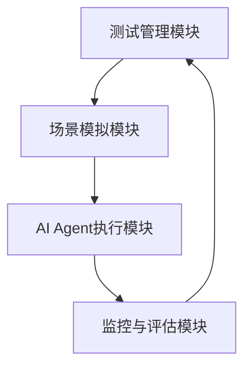

# 企业AI Agent的多场景测试：模拟真实业务环境

> 关键词：企业AI Agent、多场景测试、真实业务环境、模拟、测试策略

> 摘要：本文聚焦于企业AI Agent的多场景测试，旨在探讨如何通过模拟真实业务环境来有效测试企业AI Agent的性能、功能及适应性。详细介绍了企业AI Agent多场景测试的背景知识，包括目的、预期读者等内容；深入剖析了核心概念、算法原理、数学模型等理论基础；通过项目实战展示了代码实现与分析；阐述了实际应用场景；推荐了相关工具和资源；最后总结未来发展趋势与挑战，并提供常见问题解答及参考资料，为企业AI Agent的多场景测试提供全面而深入的技术指导。

## 1. 背景介绍 
### 1.1 目的和范围
企业AI Agent作为人工智能技术在企业领域的重要应用，其性能和可靠性直接影响企业的业务效率和竞争力。多场景测试的目的在于全面评估企业AI Agent在不同真实业务环境下的表现，发现潜在问题，确保其能够稳定、准确地执行各种任务。本文章的范围涵盖了企业AI Agent多场景测试的各个方面，包括核心概念、算法原理、数学模型、项目实战、应用场景、工具资源等，旨在为读者提供一个完整的技术知识体系。

### 1.2 预期读者
本文预期读者包括企业AI开发团队成员、测试人员、人工智能领域的研究人员、企业的技术决策者等。对于开发团队成员，本文可作为技术参考，帮助他们优化AI Agent的设计与实现；测试人员可以借鉴文中的测试策略和方法，提高测试的有效性；研究人员可以从中获取最新的研究思路和方向；技术决策者则可以通过了解多场景测试的重要性和方法，更好地规划企业的AI战略。

### 1.3 文档结构概述
本文将按照以下结构进行阐述：首先介绍企业AI Agent多场景测试的背景知识，包括目的、预期读者等；接着深入探讨核心概念与联系，通过文本示意图和Mermaid流程图展示其原理和架构；然后详细讲解核心算法原理和具体操作步骤，并使用Python源代码进行说明；再介绍数学模型和公式，并举例说明；通过项目实战展示代码实际案例和详细解释；阐述实际应用场景；推荐相关工具和资源；总结未来发展趋势与挑战；提供常见问题解答及参考资料。

### 1.4 术语表
#### 1.4.1 核心术语定义
- **企业AI Agent**：指在企业环境中运行的人工智能代理，能够自主感知环境、做出决策并执行任务，以实现企业的业务目标。
- **多场景测试**：对企业AI Agent在多种不同的业务场景下进行测试，以评估其在各种情况下的性能和功能。
- **真实业务环境模拟**：通过对企业实际业务流程、数据、用户行为等进行建模和仿真，构建出与真实情况相似的测试环境。

#### 1.4.2 相关概念解释
- **人工智能**：研究如何使计算机系统能够表现出智能行为的学科，包括机器学习、自然语言处理、计算机视觉等多个领域。
- **代理**：在计算机科学中，代理是指能够自主执行任务的实体，它可以感知环境、做出决策并采取行动。
- **测试策略**：为了达到测试目标而制定的一系列计划和方法，包括测试用例的设计、测试环境的搭建、测试执行的顺序等。

#### 1.4.3 缩略词列表
- **AI**：Artificial Intelligence（人工智能）
- **ML**：Machine Learning（机器学习）
- **NLP**：Natural Language Processing（自然语言处理）

## 2. 核心概念与联系 

### 企业AI Agent的概念
企业AI Agent是一种智能化的软件系统，它能够在企业的业务环境中自主地执行各种任务。它通常具备感知、决策和行动的能力。感知能力使它能够获取业务环境中的信息，例如用户的需求、市场数据等；决策能力则根据感知到的信息进行分析和判断，选择最优的行动方案；行动能力则将决策结果转化为具体的操作，如生成报告、执行交易等。

### 多场景测试的意义
多场景测试是确保企业AI Agent能够在各种复杂的业务环境中正常工作的关键步骤。不同的业务场景可能具有不同的特点和需求，例如销售场景需要处理客户的咨询和订单，财务场景需要进行数据的核算和报表的生成等。通过多场景测试，可以发现AI Agent在特定场景下可能存在的问题，如性能瓶颈、功能缺陷等，从而及时进行优化和改进。

### 模拟真实业务环境的方法
模拟真实业务环境需要考虑多个方面的因素，包括业务流程、数据、用户行为等。业务流程模拟可以通过对企业的实际业务流程进行建模，生成相应的测试用例；数据模拟则需要根据企业的实际数据特点，生成具有代表性的测试数据；用户行为模拟可以通过分析用户的历史行为数据，模拟出不同用户的操作习惯和行为模式。

### 核心概念原理和架构的文本示意图
企业AI Agent的多场景测试架构主要包括以下几个部分：
1. **测试管理模块**：负责测试计划的制定、测试用例的管理和测试结果的分析。
2. **场景模拟模块**：根据不同的业务场景，模拟出相应的测试环境，包括业务流程、数据和用户行为。
3. **AI Agent执行模块**：在模拟的测试环境中运行企业AI Agent，执行各种任务。
4. **监控与评估模块**：对AI Agent的运行状态进行监控，评估其性能和功能是否符合要求。

### Mermaid流程图


## 3. 核心算法原理 & 具体操作步骤 

### 核心算法原理
在企业AI Agent的多场景测试中，常用的算法包括机器学习算法、强化学习算法等。以强化学习算法为例，其基本原理是通过智能体与环境的交互，不断尝试不同的行动，并根据环境反馈的奖励信号来调整自己的行为策略，以最大化长期累积奖励。

### Python源代码详细阐述
以下是一个简单的强化学习算法示例，用于模拟企业AI Agent在一个简单业务场景中的决策过程：

```python
import numpy as np

# 定义环境
class BusinessEnvironment:
    def __init__(self):
        self.state = 0  # 初始状态
        self.num_states = 5  # 状态数量
        self.num_actions = 2  # 动作数量
        self.rewards = np.array([[1, -1], [-1, 1], [0, 0], [1, -1], [-1, 1]])  # 奖励矩阵

    def reset(self):
        self.state = 0
        return self.state

    def step(self, action):
        reward = self.rewards[self.state][action]
        if action == 0:
            self.state = max(0, self.state - 1)
        else:
            self.state = min(self.num_states - 1, self.state + 1)
        done = self.state == self.num_states - 1
        return self.state, reward, done

# 定义智能体
class Agent:
    def __init__(self, num_states, num_actions, learning_rate=0.1, discount_factor=0.9):
        self.num_states = num_states
        self.num_actions = num_actions
        self.learning_rate = learning_rate
        self.discount_factor = discount_factor
        self.q_table = np.zeros((num_states, num_actions))

    def choose_action(self, state):
        if np.random.uniform(0, 1) < 0.1:  # 探索概率
            action = np.random.choice(self.num_actions)
        else:
            action = np.argmax(self.q_table[state])
        return action

    def update(self, state, action, reward, next_state):
        predict = self.q_table[state][action]
        target = reward + self.discount_factor * np.max(self.q_table[next_state])
        self.q_table[state][action] += self.learning_rate * (target - predict)

# 训练智能体
env = BusinessEnvironment()
agent = Agent(env.num_states, env.num_actions)

num_episodes = 1000
for episode in range(num_episodes):
    state = env.reset()
    done = False
    while not done:
        action = agent.choose_action(state)
        next_state, reward, done = env.step(action)
        agent.update(state, action, reward, next_state)
        state = next_state

# 测试智能体
state = env.reset()
done = False
while not done:
    action = agent.choose_action(state)
    next_state, reward, done = env.step(action)
    print(f"State: {state}, Action: {action}, Reward: {reward}")
    state = next_state
```

### 具体操作步骤
1. **环境定义**：首先需要定义业务环境，包括状态空间、动作空间和奖励函数。
2. **智能体定义**：定义智能体的决策策略和学习算法，例如使用Q学习算法。
3. **训练智能体**：通过智能体与环境的交互，不断更新智能体的策略，使其能够在环境中获得最大的累积奖励。
4. **测试智能体**：在训练完成后，使用训练好的智能体在环境中进行测试，评估其性能。

## 4. 数学模型和公式 & 详细讲解 & 举例说明 

### 强化学习的数学模型
强化学习的数学模型主要基于马尔可夫决策过程（MDP）。一个MDP可以用一个五元组 $(S, A, P, R, \gamma)$ 来表示，其中：
- $S$ 是状态空间，包含所有可能的状态。
- $A$ 是动作空间，包含所有可能的动作。
- $P$ 是状态转移概率函数，表示在状态 $s$ 下执行动作 $a$ 后转移到状态 $s'$ 的概率，即 $P(s'|s, a)$。
- $R$ 是奖励函数，表示在状态 $s$ 下执行动作 $a$ 后获得的即时奖励，即 $R(s, a)$。
- $\gamma$ 是折扣因子，取值范围为 $[0, 1]$，用于衡量未来奖励的重要性。

### Q学习算法的数学公式
Q学习算法是一种基于价值的强化学习算法，其核心思想是通过不断更新Q值来学习最优策略。Q值表示在状态 $s$ 下执行动作 $a$ 后获得的期望累积奖励，其更新公式为：

$$Q(s, a) \leftarrow Q(s, a) + \alpha [R(s, a) + \gamma \max_{a'} Q(s', a') - Q(s, a)]$$

其中：
- $\alpha$ 是学习率，控制每次更新的步长。
- $R(s, a)$ 是即时奖励。
- $\gamma$ 是折扣因子。
- $\max_{a'} Q(s', a')$ 是下一个状态 $s'$ 下所有动作的最大Q值。

### 举例说明
假设一个简单的业务场景，状态空间 $S = \{s_0, s_1, s_2\}$，动作空间 $A = \{a_0, a_1\}$，奖励函数 $R$ 如下：

| 状态 | 动作 $a_0$ | 动作 $a_1$ |
|------|------------|------------|
| $s_0$ | 1 | -1 |
| $s_1$ | -1 | 1 |
| $s_2$ | 0 | 0 |

初始Q表为全零矩阵，学习率 $\alpha = 0.1$，折扣因子 $\gamma = 0.9$。假设智能体当前处于状态 $s_0$，选择动作 $a_0$，获得即时奖励 $R(s_0, a_0) = 1$，转移到状态 $s_0$。根据Q学习算法的更新公式，更新Q值：

$$Q(s_0, a_0) \leftarrow Q(s_0, a_0) + 0.1 [1 + 0.9 \max_{a'} Q(s_0, a') - Q(s_0, a_0)]$$

由于初始Q表为全零矩阵，$\max_{a'} Q(s_0, a') = 0$，则：

$$Q(s_0, a_0) \leftarrow 0 + 0.1 [1 + 0.9 \times 0 - 0] = 0.1$$

通过不断重复这个过程，智能体可以逐渐学习到最优策略。

## 5. 项目实战：代码实际案例和详细解释说明 

### 5.1  开发环境搭建
- **操作系统**：建议使用Linux或Windows操作系统。
- **编程语言**：Python 3.x
- **开发工具**：可以使用PyCharm、Jupyter Notebook等开发工具。
- **依赖库**：需要安装NumPy、Matplotlib等库，可以使用以下命令进行安装：
```sh
pip install numpy matplotlib
```

### 5.2  源代码详细实现和代码解读
以下是一个完整的企业AI Agent多场景测试的代码示例，模拟了一个简单的客户服务场景：

```python
import numpy as np
import random

# 定义客户服务环境
class CustomerServiceEnvironment:
    def __init__(self):
        self.states = ["idle", "receiving_request", "processing_request", "solving_request", "completed"]
        self.actions = ["wait", "receive", "process", "solve", "confirm"]
        self.state = "idle"
        self.rewards = {
            ("idle", "wait"): 0,
            ("idle", "receive"): 10,
            ("receiving_request", "process"): 20,
            ("processing_request", "solve"): 30,
            ("solving_request", "confirm"): 40,
            # 无效动作的惩罚
            ("idle", "process"): -10,
            ("idle", "solve"): -10,
            ("idle", "confirm"): -10,
            ("receiving_request", "wait"): -5,
            ("receiving_request", "receive"): -5,
            ("receiving_request", "solve"): -10,
            ("receiving_request", "confirm"): -10,
            ("processing_request", "wait"): -5,
            ("processing_request", "receive"): -10,
            ("processing_request", "process"): -5,
            ("processing_request", "confirm"): -10,
            ("solving_request", "wait"): -5,
            ("solving_request", "receive"): -10,
            ("solving_request", "process"): -10,
            ("solving_request", "solve"): -5,
            ("completed", "wait"): 0,
            ("completed", "receive"): -10,
            ("completed", "process"): -10,
            ("completed", "solve"): -10,
            ("completed", "confirm"): -10
        }
        self.state_transitions = {
            ("idle", "wait"): "idle",
            ("idle", "receive"): "receiving_request",
            ("receiving_request", "process"): "processing_request",
            ("processing_request", "solve"): "solving_request",
            ("solving_request", "confirm"): "completed",
            # 无效动作保持当前状态
            ("idle", "process"): "idle",
            ("idle", "solve"): "idle",
            ("idle", "confirm"): "idle",
            ("receiving_request", "wait"): "receiving_request",
            ("receiving_request", "receive"): "receiving_request",
            ("receiving_request", "solve"): "receiving_request",
            ("receiving_request", "confirm"): "receiving_request",
            ("processing_request", "wait"): "processing_request",
            ("processing_request", "receive"): "processing_request",
            ("processing_request", "process"): "processing_request",
            ("processing_request", "confirm"): "processing_request",
            ("solving_request", "wait"): "solving_request",
            ("solving_request", "receive"): "solving_request",
            ("solving_request", "process"): "solving_request",
            ("solving_request", "solve"): "solving_request",
            ("completed", "wait"): "completed",
            ("completed", "receive"): "completed",
            ("completed", "process"): "completed",
            ("completed", "solve"): "completed",
            ("completed", "confirm"): "completed"
        }

    def reset(self):
        self.state = "idle"
        return self.state

    def step(self, action):
        reward = self.rewards[(self.state, action)]
        self.state = self.state_transitions[(self.state, action)]
        done = self.state == "completed"
        return self.state, reward, done

# 定义智能体
class CustomerServiceAgent:
    def __init__(self, states, actions, learning_rate=0.1, discount_factor=0.9, exploration_rate=0.1):
        self.states = states
        self.actions = actions
        self.learning_rate = learning_rate
        self.discount_factor = discount_factor
        self.exploration_rate = exploration_rate
        self.q_table = {}
        for state in states:
            self.q_table[state] = {}
            for action in actions:
                self.q_table[state][action] = 0

    def choose