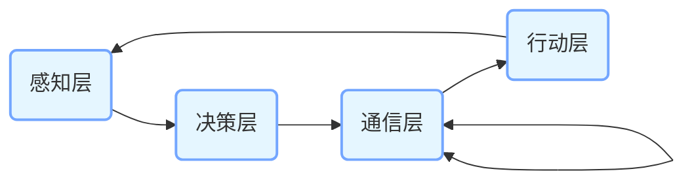

# 企业AI Agent的多智能体系统在团队协作优化中的应用

> 关键词：企业AI Agent、多智能体系统、团队协作优化、智能协作、分布式决策

> 摘要：本文聚焦于企业AI Agent的多智能体系统在团队协作优化中的应用。首先介绍了相关背景，包括目的范围、预期读者等。接着阐述了核心概念与联系，分析了多智能体系统的架构原理。详细讲解了核心算法原理及具体操作步骤，通过Python代码进行了示例。探讨了数学模型和公式，并举例说明其应用。通过项目实战展示了代码的实际案例和详细解释。分析了该技术在实际中的应用场景，推荐了相关的工具和资源。最后总结了未来发展趋势与挑战，提供了常见问题解答和扩展阅读参考资料，旨在为企业利用多智能体系统提升团队协作效率提供全面的技术指导。

## 1. 背景介绍 
### 1.1 目的和范围
在当今竞争激烈的商业环境中，企业团队协作的效率和质量直接影响着企业的竞争力和发展。随着人工智能技术的飞速发展，企业AI Agent的多智能体系统为团队协作优化提供了新的思路和方法。本文章的目的在于深入探讨企业AI Agent的多智能体系统在团队协作优化中的应用，详细分析其原理、算法、实现步骤以及实际应用场景，为企业提供全面的技术指导，帮助企业更好地利用多智能体系统提升团队协作效率。

本文章的范围涵盖了多智能体系统的基本概念、核心算法、数学模型、项目实战、实际应用场景等方面，同时还推荐了相关的学习资源、开发工具和研究论文，旨在为读者提供一个完整的知识体系。

### 1.2 预期读者
本文的预期读者包括企业管理人员、团队协作相关的从业人员、人工智能技术爱好者、软件开发人员等。对于企业管理人员，本文可以帮助他们了解多智能体系统在团队协作优化中的应用价值，为企业的数字化转型提供决策参考；对于团队协作相关的从业人员，本文可以提供实际的操作方法和案例，帮助他们提升团队协作的效率和质量；对于人工智能技术爱好者，本文可以深入了解多智能体系统的原理和算法，拓宽技术视野；对于软件开发人员，本文可以提供详细的代码实现和开发指导，帮助他们开发相关的应用程序。

### 1.3 文档结构概述
本文将按照以下结构进行组织：
- 背景介绍：介绍文章的目的、范围、预期读者和文档结构概述，以及相关的术语表。
- 核心概念与联系：阐述企业AI Agent和多智能体系统的核心概念，分析它们之间的联系，并给出架构的文本示意图和Mermaid流程图。
- 核心算法原理 & 具体操作步骤：详细讲解多智能体系统的核心算法原理，通过Python代码进行示例，并给出具体的操作步骤。
- 数学模型和公式 & 详细讲解 & 举例说明：介绍多智能体系统的数学模型和公式，进行详细讲解，并通过实际例子说明其应用。
- 项目实战：通过一个实际的项目案例，展示多智能体系统在团队协作优化中的应用，包括开发环境搭建、源代码详细实现和代码解读。
- 实际应用场景：分析多智能体系统在企业团队协作中的实际应用场景，如任务分配、资源调度、沟通协调等。
- 工具和资源推荐：推荐相关的学习资源、开发工具和研究论文，帮助读者进一步深入学习和应用多智能体系统。
- 总结：总结未来发展趋势与挑战，展望多智能体系统在团队协作优化中的应用前景。
- 附录：提供常见问题与解答，帮助读者解决在学习和应用过程中遇到的问题。
- 扩展阅读 & 参考资料：提供相关的扩展阅读材料和参考资料，方便读者进一步深入研究。

### 1.4 术语表
#### 1.4.1 核心术语定义
- **企业AI Agent**：指在企业环境中运行的人工智能代理，它可以感知环境信息，根据预设的规则和目标进行决策和行动，以实现特定的任务。
- **多智能体系统（Multi-Agent System，MAS）**：由多个智能体组成的系统，这些智能体之间可以相互通信、协作和竞争，共同完成复杂的任务。
- **团队协作优化**：通过各种方法和技术，提高团队成员之间的协作效率和质量，实现团队目标的最大化。
- **智能协作**：指智能体之间通过自主协商、合作和协调，共同完成任务的过程。
- **分布式决策**：在多智能体系统中，各个智能体根据自己的局部信息和目标进行决策，通过信息交互和协作实现全局最优决策。

#### 1.4.2 相关概念解释
- **智能体的感知能力**：智能体能够通过传感器或其他方式获取环境中的信息，如任务需求、资源状态、其他智能体的状态等。
- **智能体的决策能力**：智能体根据感知到的信息和预设的规则、目标，进行推理和判断，选择最优的行动方案。
- **智能体的行动能力**：智能体根据决策结果，执行相应的行动，如完成任务、发送消息、调用资源等。
- **智能体的通信能力**：智能体之间可以通过网络或其他方式进行信息交换和交互，以实现协作和协调。

#### 1.4.3 缩略词列表
- **MAS**：Multi-Agent System，多智能体系统
- **AI**：Artificial Intelligence，人工智能

## 2. 核心概念与联系 

### 核心概念原理
#### 企业AI Agent
企业AI Agent是一种能够在企业环境中自主运行的人工智能实体。它具有感知、决策和行动的能力。感知能力使它能够收集企业内部和外部的各种信息，例如市场动态、客户需求、团队成员的工作状态等。决策能力则是基于感知到的信息，结合预设的规则和目标，运用人工智能算法进行推理和判断，制定出最优的行动方案。行动能力表现为根据决策结果执行具体的任务，如分配工作、协调资源、与其他智能体或人员进行沟通等。

#### 多智能体系统（MAS）
多智能体系统由多个企业AI Agent组成。这些智能体之间可以相互通信、协作和竞争。通信是多智能体系统实现协作的基础，智能体通过交换信息来共享知识和状态。协作是指多个智能体为了实现共同的目标而相互配合，各自发挥自己的优势，共同完成任务。竞争则存在于智能体之间对有限资源的争夺，通过竞争可以激发智能体的优化和创新能力。多智能体系统的优势在于能够处理复杂的任务，通过分布式的方式提高系统的灵活性和鲁棒性。

### 架构的文本示意图
企业AI Agent的多智能体系统架构可以分为以下几个层次：
- **感知层**：由各个智能体的感知模块组成，负责收集企业环境中的各种信息，如数据采集设备、传感器等。
- **决策层**：智能体根据感知到的信息进行决策，这一层包含了各种人工智能算法和模型，如机器学习、深度学习、强化学习等。
- **通信层**：负责智能体之间的信息交换和交互，采用网络通信技术，如TCP/IP、HTTP等。
- **行动层**：智能体根据决策结果执行具体的任务，与企业的业务系统进行交互，如调用资源、分配任务等。

### Mermaid流程图


这个流程图展示了企业AI Agent的多智能体系统的基本工作流程。感知层收集信息并传递给决策层，决策层进行决策后通过通信层与其他智能体进行信息交互，然后行动层执行决策结果。同时，行动层的执行结果又会反馈给感知层，形成一个闭环的反馈系统。通信层还支持智能体之间的相互通信，以实现协作和协调。

## 3. 核心算法原理 & 具体操作步骤 

### 核心算法原理
在企业AI Agent的多智能体系统中，常用的核心算法包括强化学习算法和博弈论算法。

#### 强化学习算法
强化学习是一种通过智能体与环境进行交互，不断尝试不同的行动并根据环境反馈的奖励信号来学习最优策略的算法。在多智能体系统中，每个智能体可以看作是一个独立的强化学习智能体，通过与其他智能体和环境进行交互来学习。

以Q-learning算法为例，其核心思想是通过维护一个Q-table来记录每个状态-行动对的价值。智能体在每个时间步根据当前状态选择一个行动，执行该行动后得到环境的反馈奖励和下一个状态，然后更新Q-table。Q-table的更新公式如下：

$$Q(s_t, a_t) = Q(s_t, a_t) + \alpha [r_{t+1} + \gamma \max_{a} Q(s_{t+1}, a) - Q(s_t, a_t)]$$

其中，$Q(s_t, a_t)$ 表示在状态 $s_t$ 下选择行动 $a_t$ 的价值，$\alpha$ 是学习率，$r_{t+1}$ 是执行行动 $a_t$ 后得到的奖励，$\gamma$ 是折扣因子，$\max_{a} Q(s_{t+1}, a)$ 表示在下一个状态 $s_{t+1}$ 下所有可能行动的最大价值。

#### 博弈论算法
博弈论是研究多个智能体之间策略交互的数学理论。在多智能体系统中，智能体之间的协作和竞争可以看作是一种博弈过程。常用的博弈论模型包括合作博弈和非合作博弈。

以囚徒困境为例，两个囚徒可以选择合作（保持沉默）或背叛（坦白）。如果两个囚徒都合作，他们都将获得较轻的惩罚；如果一个囚徒合作，另一个囚徒背叛，背叛的囚徒将获得无罪释放，而合作的囚徒将获得较重的惩罚；如果两个囚徒都背叛，他们都将获得中等的惩罚。通过博弈论分析，可以找到智能体的最优策略。

### 具体操作步骤
#### 步骤1：定义智能体和环境
首先，需要定义每个智能体的状态空间、行动空间和奖励函数。状态空间表示智能体所处的环境状态，行动空间表示智能体可以采取的行动，奖励函数表示智能体执行某个行动后得到的奖励。同时，还需要定义环境的动态模型，即智能体执行行动后环境状态的变化规则。

#### 步骤2：初始化Q-table
如果使用Q-learning算法，需要初始化Q-table。Q-table的大小为状态空间的大小乘以行动空间的大小，初始值可以设为0。

#### 步骤3：智能体与环境交互
智能体在每个时间步根据当前状态选择一个行动，执行该行动后得到环境的反馈奖励和下一个状态。选择行动的策略可以采用 $\epsilon$-贪心策略，即有 $\epsilon$ 的概率随机选择一个行动，有 $1 - \epsilon$ 的概率选择Q-table中价值最大的行动。

#### 步骤4：更新Q-table
根据Q-learning算法的更新公式，更新Q-table中当前状态-行动对的价值。

#### 步骤5：重复步骤3和步骤4
重复步骤3和步骤4，直到智能体收敛到最优策略或达到预设的训练步数。

### Python源代码示例
```python
import numpy as np

# 定义状态空间和行动空间
state_space = 5
action_space = 3

# 初始化Q-table
Q_table = np.zeros((state_space, action_space))

# 定义超参数
alpha = 0.1  # 学习率
gamma = 0.9  # 折扣因子
epsilon = 0.1  # 探索率
episodes = 1000  # 训练轮数

# 定义奖励函数（这里简单示例）
def reward_function(state, action):
    # 假设状态为0且行动为0时奖励为1，其他情况奖励为0
    if state == 0 and action == 0:
        return 1
    else:
        return 0

# 定义环境动态模型（这里简单示例）
def next_state(state, action):
    # 简单的状态转移规则，行动后状态加1取模
    return (state + action + 1) % state_space

# 训练过程
for episode in range(episodes):
    state = np.random.randint(0, state_space)  # 随机初始化状态
    done = False
    while not done:
        # 根据epsilon-贪心策略选择行动
        if np.random.uniform(0, 1) < epsilon:
            action = np.random.randint(0, action_space)
        else:
            action = np.argmax(Q_table[state, :])
        
        # 执行行动，得到奖励和下一个状态
        reward = reward_function(state, action)
        next_state_val = next_state(state, action)
        
        # 更新Q-table
        Q_table[state, action] = Q_table[state, action] + alpha * (reward + gamma * np.max(Q_table[next_state_val, :]) - Q_table[state, action])
        
        state = next_state_val
        
        # 假设达到某个条件结束本轮训练
        if state == 2:
            done = True

print("训练完成后的Q-table:")
print(Q_table)
```

在这个示例中，我们使用Q-learning算法训练一个智能体。首先定义了状态空间和行动空间，初始化了Q-table。然后定义了奖励函数和环境动态模型。在训练过程中，智能体根据 $\epsilon$-贪心策略选择行动，执行行动后更新Q-table，直到达到预设的结束条件。最后输出训练完成后的Q-table。

## 4. 数学模型和公式 & 详细讲解 & 举例说明 

### 强化学习的数学模型和公式
#### 马尔可夫决策过程（MDP）
多智能体系统中的强化学习可以用马尔可夫决策过程来建模。一个马尔可夫决策过程可以表示为一个五元组 $(S, A, P, R, \gamma)$，其中：
- $S$ 是状态空间，表示智能体可能处于的所有状态的集合。
- $A$ 是行动空间，表示智能体可以采取的所有行动的集合。
- $P(s_{t+1} | s_t, a_t)$ 是状态转移概率，表示在状态 $s_t$ 下执行行动 $a_t$ 后转移到状态 $s_{t+1}$ 的概率。
- $R(s_t, a_t)$ 是奖励函数，表示在状态 $s_t$ 下执行行动 $a_t$ 后得到的即时奖励。
- $\gamma$ 是折扣因子，用于权衡即时奖励和未来奖励的重要性，取值范围为 $[0, 1]$。

#### 价值函数
在强化学习中，常用的价值函数有状态价值函数 $V(s)$ 和行动价值函数 $Q(s, a)$。

状态价值函数 $V(s)$ 表示从状态 $s$ 开始，遵循某个策略 $\pi$ 所能获得的期望累积折扣奖励，其定义如下：

$$V^{\pi}(s) = \mathbb{E}_{\pi} \left[ \sum_{t=0}^{\infty} \gamma^t R(s_t, a_t) | s_0 = s \right]$$

行动价值函数 $Q(s, a)$ 表示在状态 $s$ 下执行行动 $a$，然后遵循某个策略 $\pi$ 所能获得的期望累积折扣奖励，其定义如下：

$$Q^{\pi}(s, a) = \mathbb{E}_{\pi} \left[ \sum_{t=0}^{\infty} \gamma^t R(s_t, a_t) | s_0 = s, a_0 = a \right]$$

#### 贝尔曼方程
贝尔曼方程是强化学习中的核心方程，它描述了价值函数的递归关系。

状态价值函数的贝尔曼方程为：

$$V^{\pi}(s) = \sum_{a \in A} \pi(a | s) \left[ R(s, a) + \gamma \sum_{s' \in S} P(s' | s, a) V^{\pi}(s') \right]$$

行动价值函数的贝尔曼方程为：

$$Q^{\pi}(s, a) = R(s, a) + \gamma \sum_{s' \in S} P(s' | s, a) \sum_{a' \in A} \pi(a' | s') Q^{\pi}(s', a')$$

### 详细讲解
马尔可夫决策过程是强化学习的基础模型，它假设智能体的未来状态只取决于当前状态和当前行动，而与历史状态和行动无关。价值函数用于评估状态或状态-行动对的优劣，帮助智能体选择最优的行动。贝尔曼方程则提供了一种递归求解价值函数的方法，通过不断迭代更新价值函数，最终收敛到最优值。

### 举例说明
假设一个简单的机器人导航问题，机器人在一个二维网格世界中移动。状态空间 $S$ 表示机器人在网格中的所有可能位置，行动空间 $A$ 表示机器人可以采取的行动，如向上、向下、向左、向右移动。奖励函数 $R(s, a)$ 可以定义为：如果机器人移动到目标位置，奖励为10；如果机器人撞到障碍物，奖励为-10；其他情况奖励为-1。折扣因子 $\gamma$ 可以设为0.9。

使用Q-learning算法，机器人通过不断与环境交互，更新Q-table中的行动价值函数。例如，机器人在状态 $s$ 下选择行动 $a$ 移动到下一个状态 $s'$，得到奖励 $r$，然后根据Q-learning的更新公式更新 $Q(s, a)$ 的值。通过多次迭代，机器人可以学习到从任意状态到目标位置的最优路径。

### 博弈论的数学模型和公式
#### 博弈的基本要素
一个博弈可以用三元组 $(N, A, u)$ 来表示，其中：
- $N = \{1, 2, \cdots, n\}$ 是参与者的集合，每个参与者 $i \in N$ 是一个智能体。
- $A = A_1 \times A_2 \times \cdots \times A_n$ 是行动组合的集合，其中 $A_i$ 是参与者 $i$ 的行动空间。
- $u = (u_1, u_2, \cdots, u_n)$ 是效用函数的集合，其中 $u_i : A \to \mathbb{R}$ 表示参与者 $i$ 在行动组合 $a \in A$ 下的效用。

#### 纳什均衡
纳什均衡是博弈论中的一个重要概念，它表示在一个博弈中，每个参与者都选择了最优的行动，使得其他参与者无法通过单方面改变行动来提高自己的效用。

对于一个博弈 $(N, A, u)$，如果存在一个行动组合 $a^* = (a_1^*, a_2^*, \cdots, a_n^*) \in A$，使得对于任意的参与者 $i \in N$ 和任意的行动 $a_i \in A_i$，都有：

$$u_i(a_1^*, \cdots, a_{i-1}^*, a_i^*, a_{i+1}^*, \cdots, a_n^*) \geq u_i(a_1^*, \cdots, a_{i-1}^*, a_i, a_{i+1}^*, \cdots, a_n^*)$$

则称 $a^*$ 是该博弈的一个纳什均衡。

### 详细讲解
博弈论用于分析多个智能体之间的策略交互。博弈的基本要素定义了参与者、行动和效用之间的关系。纳什均衡是博弈的一种稳定状态，在这种状态下，每个参与者都没有动机改变自己的策略。

### 举例说明
考虑一个简单的双智能体博弈，两个智能体可以选择合作（C）或背叛（D）。效用矩阵如下：

|  | C | D |
| --- | --- | --- |
| C | (3, 3) | (0, 5) |
| D | (5, 0) | (1, 1) |

在这个博弈中，（D，D）是一个纳什均衡。因为如果智能体1选择D，智能体2选择D的效用为1，选择C的效用为0，所以智能体2会选择D；同理，如果智能体2选择D，智能体1选择D的效用为1，选择C的效用为0，所以智能体1也会选择D。

## 5. 项目实战：代码实际案例和详细解释说明 

### 5.1  开发环境搭建
#### 选择编程语言和框架
本项目选择Python作为开发语言，因为Python具有丰富的机器学习和人工智能库，方便实现多智能体系统。同时，我们使用`numpy`库进行数值计算，`matplotlib`库进行数据可视化。

#### 安装依赖库
在命令行中使用以下命令安装所需的库：
```sh
pip install numpy matplotlib
```

### 5.2  源代码详细实现和代码解读
#### 项目需求描述
我们要实现一个简单的多智能体团队协作项目，假设有两个智能体在一个二维网格世界中协作完成一个任务。任务是将网格中的一个物品从起点移动到终点。每个智能体可以感知自己周围的环境信息，包括物品的位置、其他智能体的位置和障碍物的位置。智能体之间可以通过通信来协调行动。

#### 源代码实现
```python
import numpy as np
import matplotlib.pyplot as plt

# 定义网格世界的大小
GRID_SIZE = 10

# 定义智能体类
class Agent:
    def __init__(self, id, start_pos):
        self.id = id
        self.pos = start_pos
        self.perception = None  # 感知信息
        self.message = None  # 通信信息

    def perceive(self, grid):
        # 感知周围环境信息
        self.perception = grid.copy()

    def communicate(self, other_agent):
        # 与其他智能体通信
        self.message = other_agent.pos
        other_agent.message = self.pos

    def move(self, action):
        # 根据行动移动智能体
        if action == 0:  # 上
            new_pos = (self.pos[0] - 1, self.pos[1])
        elif action == 1:  # 下
            new_pos = (self.pos[0] + 1, self.pos[1])
        elif action == 2:  # 左
            new_pos = (self.pos[0], self.pos[1] - 1)
        elif action == 3:  # 右
            new_pos = (self.pos[0], self.pos[1] + 1)

        # 检查新位置是否合法
        if 0 <= new_pos[0] < GRID_SIZE and 0 <= new_pos[1] < GRID_SIZE:
            self.pos = new_pos

# 定义网格世界类
class GridWorld:
    def __init__(self):
        self.grid = np.zeros((GRID_SIZE, GRID_SIZE))
        # 初始化物品位置
        self.item_pos = (2, 2)
        self.grid[self.item_pos] = 1
        # 初始化智能体
        self.agent1 = Agent(1, (0, 0))
        self.agent2 = Agent(2, (GRID_SIZE - 1, GRID_SIZE - 1))

    def step(self):
        # 智能体感知环境
        self.agent1.perceive(self.grid)
        self.agent2.perceive(self.grid)

        # 智能体通信
        self.agent1.communicate(self.agent2)

        # 智能体选择行动（这里简单随机选择）
        action1 = np.random.randint(0, 4)
        action2 = np.random.randint(0, 4)

        # 智能体移动
        self.agent1.move(action1)
        self.agent2.move(action2)

        # 更新网格世界
        self.grid = np.zeros((GRID_SIZE, GRID_SIZE))
        self.grid[self.item_pos] = 1
        self.grid[self.agent1.pos] = 2
        self.grid[self.agent2.pos] = 3

    def render(self):
        # 可视化网格世界
        plt.imshow(self.grid, cmap='viridis')
        plt.show()

# 主函数
if __name__ == "__main__":
    env = GridWorld()
    for _ in range(10):
        env.step()
        env.render()
```

#### 代码解读
- **Agent类**：表示智能体，包含智能体的基本属性，如ID、位置、感知信息和通信信息。`perceive`方法用于感知周围环境信息，`communicate`方法用于与其他智能体通信，`move`方法用于根据行动移动智能体。
- **GridWorld类**：表示网格世界，包含网格的状态、物品的位置和智能体的信息。`step`方法是一个时间步的操作，包括智能体的感知、通信、行动选择和移动，以及网格世界的更新。`render`方法用于可视化网格世界。
- **主函数**：创建网格世界对象，进行多个时间步的操作，并在每个时间步后可视化网格世界。

### 5.3  代码解读与分析
#### 优点
- **简单易懂**：代码结构清晰，易于理解和修改，适合初学者学习多智能体系统的基本原理和实现方法。
- **模块化设计**：将智能体和网格世界分别封装成类，提高了代码的可维护性和可扩展性。
- **包含基本功能**：代码实现了智能体的感知、通信和移动等基本功能，为进一步开发复杂的多智能体系统提供了基础。

#### 不足之处
- **行动选择策略简单**：智能体的行动选择是随机的，没有考虑到任务的目标和其他智能体的信息，不能实现有效的团队协作。
- **缺乏奖励机制**：代码中没有定义奖励函数，智能体无法根据奖励来学习最优策略。
- **可视化效果有限**：使用`matplotlib`进行简单的可视化，不能实时展示智能体的动态变化。

#### 改进方向
- **设计更复杂的行动选择策略**：可以使用强化学习算法，如Q-learning或深度Q网络（DQN），让智能体根据环境信息和奖励信号学习最优策略。
- **引入奖励机制**：定义合理的奖励函数，如智能体接近物品或成功将物品移动到终点时给予正奖励，撞到障碍物或远离物品时给予负奖励。
- **优化可视化效果**：可以使用更高级的可视化库，如`pygame`或`Unity`，实现实时的动态可视化。

## 6. 实际应用场景 
### 任务分配
在企业团队中，不同的任务具有不同的难度、时间要求和资源需求。企业AI Agent的多智能体系统可以根据团队成员的技能、工作量和当前任务状态，自动进行任务分配。例如，一个软件开发项目中有多个模块需要开发，多智能体系统可以分析每个开发人员的技能专长、当前项目进度和剩余工作量，将合适的模块分配给合适的开发人员，从而提高任务分配的效率和合理性。

### 资源调度
企业中的资源包括人力、物力、财力等。多智能体系统可以实时监测资源的使用情况，根据任务的需求进行资源调度。例如，在一个制造企业中，有多个生产车间和设备，多智能体系统可以根据订单的优先级、设备的可用性和工人的技能，合理安排生产任务，优化设备和人力的使用，提高生产效率和降低成本。

### 沟通协调
团队成员之间的沟通协调是团队协作的关键。多智能体系统可以作为智能助手，促进团队成员之间的沟通和协调。例如，在一个跨部门的项目中，不同部门的成员可能存在信息不对称和沟通不畅的问题。多智能体系统可以实时收集和整合各个部门的信息，自动生成报告和提醒，促进成员之间的信息共享和沟通，及时解决项目中的问题。

### 风险预警
企业在运营过程中面临着各种风险，如市场风险、财务风险、技术风险等。多智能体系统可以通过对各种数据的实时监测和分析，提前发现潜在的风险，并及时发出预警。例如，在金融企业中，多智能体系统可以分析市场数据、客户信用数据和交易数据，预测市场趋势和客户违约风险，为企业的决策提供参考。

### 团队绩效评估
多智能体系统可以根据团队成员的工作表现和任务完成情况，对团队绩效进行评估。通过分析智能体收集到的各种数据，如工作时间、任务完成质量、团队协作程度等，系统可以生成客观、准确的绩效评估报告，为企业的人力资源管理提供依据。

## 7. 工具和资源推荐
### 7.1 学习资源推荐
#### 7.1.1 书籍推荐
- 《Multiagent Systems: Algorithmic, Game-Theoretic, and Logical Foundations》：这本书全面介绍了多智能体系统的理论基础，包括算法、博弈论和逻辑等方面的内容，是学习多智能体系统的经典教材。
- 《Reinforcement Learning: An Introduction》：强化学习是多智能体系统中常用的算法之一，这本书是强化学习领域的经典著作，详细介绍了强化学习的基本概念、算法和应用。
- 《Artificial Intelligence: A Modern Approach》：这本书是人工智能领域的权威教材，涵盖了人工智能的各个方面，包括多智能体系统、机器学习、自然语言处理等，对于全面了解人工智能技术有很大的帮助。

#### 7.1.2 在线课程
- Coursera上的“Multiagent Systems”课程：由知名教授授课，系统地介绍了多智能体系统的理论和实践，包括智能体的设计、通信、协作和学习等方面的内容。
- edX上的“Reinforcement Learning”课程：提供了强化学习的深入讲解和实践项目，帮助学习者掌握强化学习的算法和应用。
- Udemy上的“Artificial Intelligence A-Z™: Learn How To Build An AI”课程：涵盖了人工智能的多个领域，包括多智能体系统、机器学习、深度学习等，适合初学者快速入门。

#### 7.1.3 技术博客和网站
- Multiagent Systems Journal：这是多智能体系统领域的专业期刊网站，提供了最新的研究成果和学术论文。
- AI Stack Exchange：一个人工智能领域的问答社区，用户可以在这里提问、分享经验和交流技术。
- Towards Data Science：一个数据科学和人工智能领域的技术博客，发布了很多关于多智能体系统、强化学习等方面的优质文章。

### 7.2 开发工具框架推荐
#### 7.2.1 IDE和编辑器
- PyCharm：一款专业的Python集成开发环境，提供了丰富的代码编辑、调试和项目管理功能，适合开发多智能体系统的Python项目。
- Visual Studio Code：一款轻量级的代码编辑器，支持多种编程语言和插件扩展，具有良好的用户体验和开发效率。
- Jupyter Notebook：一种交互式的开发环境，适合进行数据分析、模型训练和可视化，对于多智能体系统的实验和研究非常有用。

#### 7.2.2 调试和性能分析工具
- PDB：Python自带的调试器，可以帮助开发者在代码中设置断点、查看变量值和执行流程，方便调试多智能体系统的代码。
- cProfile：Python的性能分析工具，可以统计代码的执行时间和函数调用次数，帮助开发者找出代码中的性能瓶颈。
- TensorBoard：一个用于可视化深度学习模型训练过程的工具，也可以用于可视化多智能体系统的训练数据和性能指标。

#### 7.2.3 相关框架和库
- OpenAI Gym：一个开源的强化学习环境库，提供了多种经典的强化学习任务和环境，方便开发者进行强化学习算法的实验和测试。
- Mesa：一个用于构建基于智能体的模型的Python库，提供了智能体的基本类和方法，支持智能体的交互和演化，适合开发多智能体系统的应用程序。
- PyTorch：一个开源的深度学习框架，提供了丰富的神经网络模型和优化算法，可用于实现多智能体系统中的强化学习和深度学习算法。

### 7.3 相关论文著作推荐
#### 7.3.1 经典论文
- “The Evolution of Cooperation” by Robert Axelrod：这篇论文探讨了合作在多智能体系统中的演化机制，通过博弈论的方法分析了智能体之间的合作和竞争关系，对多智能体系统的研究产生了深远的影响。
- “Q-Learning” by Christopher J. C. H. Watkins and Peter Dayan：这篇论文提出了Q-learning算法，是强化学习领域的经典之作，为多智能体系统中的智能体学习提供了重要的方法。
- “Multiagent Planning with Partial Observability” by Yoav Shoham and Kevin Leyton-Brown：这篇论文研究了多智能体系统在部分可观测环境下的规划问题，提出了相应的算法和解决方案。

#### 7.3.2 最新研究成果
- 在顶级学术会议如AAAI（Association for the Advancement of Artificial Intelligence）、IJCAI（International Joint Conference on Artificial Intelligence）和AAMAS（International Conference on Autonomous Agents and Multiagent Systems）上发表的关于多智能体系统的研究论文，反映了该领域的最新研究动态和技术趋势。
- 在知名学术期刊如Artificial Intelligence、Journal of Artificial Intelligence Research（JAIR）上发表的相关研究成果，具有较高的学术水平和参考价值。

#### 7.3.3 应用案例分析
- 一些企业和研究机构发布的关于多智能体系统在实际应用中的案例分析报告，如多智能体系统在物流配送、智能交通、医疗保健等领域的应用案例，这些案例可以帮助读者了解多智能体系统的实际应用效果和挑战。

## 8. 总结：未来发展趋势与挑战
### 未来发展趋势
#### 与其他技术的融合
企业AI Agent的多智能体系统将与其他前沿技术如区块链、物联网、大数据等深度融合。与区块链技术结合，可以实现智能体之间的可信协作和数据共享；与物联网技术结合，可以使智能体更好地感知和控制物理世界；与大数据技术结合，可以利用海量的数据训练智能体，提高其决策能力和智能水平。

#### 应用领域的拓展
多智能体系统将在更多的领域得到应用，如金融科技、智慧城市、工业互联网等。在金融科技领域，多智能体系统可以用于风险评估、投资决策和交易策略优化；在智慧城市领域，多智能体系统可以用于交通管理、能源调度和环境监测；在工业互联网领域，多智能体系统可以用于生产过程优化、供应链管理和设备维护。

#### 智能体的自主进化
未来的智能体将具有更强的自主学习和进化能力。智能体可以通过不断与环境交互和学习，自动调整自己的策略和行为，以适应不断变化的环境和任务需求。同时，智能体之间还可以通过知识共享和协同学习，实现群体智能的提升。

#### 人机协作的深入发展
多智能体系统将与人类实现更加深入的协作。智能体可以作为人类的智能助手，帮助人类完成复杂的任务，提供决策支持和建议。同时，人类也可以对智能体进行监督和干预，确保智能体的行为符合人类的利益和价值观。

### 挑战
#### 通信和协调问题
在多智能体系统中，智能体之间的通信和协调是一个关键问题。随着智能体数量的增加和系统复杂度的提高，通信延迟、信息不一致和协调困难等问题会更加突出。如何设计高效的通信协议和协调机制，确保智能体之间能够及时、准确地交换信息和协作，是未来需要解决的重要问题。

#### 安全和隐私问题
多智能体系统涉及大量的敏感信息和重要决策，安全和隐私问题至关重要。智能体可能会受到攻击和恶意干扰，导致系统故障和数据泄露。如何保障智能体的安全性和隐私性，防止信息被窃取和滥用，是多智能体系统面临的一大挑战。

#### 伦理和法律问题
随着多智能体系统的广泛应用，伦理和法律问题也日益凸显。例如，智能体的决策责任归属问题、智能体对人类社会的影响问题等。如何制定相应的伦理准则和法律法规，规范智能体的行为，保障人类的权益和社会的稳定，是需要深入研究和探讨的问题。

#### 算法复杂度和计算资源问题
多智能体系统中的算法通常具有较高的复杂度，需要大量的计算资源和时间。随着系统规模的扩大和任务的复杂化，算法的复杂度和计算资源的需求会进一步增加。如何设计高效的算法和优化计算资源的使用，提高系统的性能和效率，是未来研究的重点之一。

## 9. 附录：常见问题与解答
### 问题1：多智能体系统与单智能体系统有什么区别？
解答：单智能体系统只有一个智能体，主要关注该智能体在环境中的决策和行动。而多智能体系统由多个智能体组成，智能体之间需要进行通信、协作和竞争。多智能体系统可以处理更复杂的任务，通过分布式的方式提高系统的灵活性和鲁棒性，但也面临着通信和协调等方面的挑战。

### 问题2：如何选择适合的强化学习算法？
解答：选择适合的强化学习算法需要考虑多个因素，如问题的复杂度、状态空间和行动空间的大小、是否有模型信息等。如果问题的状态空间和行动空间较小，可以使用传统的Q-learning算法；如果状态空间和行动空间较大，可以考虑使用深度Q网络（DQN）或策略梯度算法。如果有模型信息，可以使用基于模型的强化学习算法；如果没有模型信息，可以使用无模型的强化学习算法。

### 问题3：多智能体系统中的智能体如何进行通信？
解答：智能体可以通过多种方式进行通信，如消息传递、共享内存、广播等。在实际应用中，通常使用网络通信技术，如TCP/IP、HTTP等。智能体之间可以定义通信协议，规定消息的格式和含义，以确保信息的准确传递和理解。

### 问题4：如何评估多智能体系统的性能？
解答：评估多智能体系统的性能可以从多个方面进行，如任务完成率、任务完成时间、资源利用率、智能体之间的协作效率等。可以使用模拟实验和实际应用测试相结合的方法，收集相关的数据并进行分析，以评估系统的性能。

### 问题5：多智能体系统在实际应用中可能会遇到哪些问题？
解答：多智能体系统在实际应用中可能会遇到通信延迟、信息不一致、协调困难、安全和隐私问题、算法复杂度和计算资源问题等。此外，还可能会面临伦理和法律问题，如智能体的决策责任归属问题等。需要针对这些问题采取相应的措施，如优化通信协议、加强安全防护、制定伦理准则和法律法规等。

## 10. 扩展阅读 & 参考资料
### 扩展阅读
- 《Agent-Based Modeling and Simulation: Socio-Technical Systems》：这本书深入介绍了基于智能体的建模和仿真方法，对于理解多智能体系统在社会技术系统中的应用有很大的帮助。
- 《Game Theory for Software Engineering》：将博弈论应用于软件工程领域，探讨了在软件开发过程中如何使用博弈论来解决多智能体之间的协作和竞争问题。
- 《Distributed Artificial Intelligence: A Tutorial》：这篇教程详细介绍了分布式人工智能的基本概念、技术和应用，对于学习多智能体系统的分布式特性有很好的参考价值。

### 参考资料
- Shoham, Y., & Leyton-Brown, K. (2009). Multiagent Systems: Algorithmic, Game-Theoretic, and Logical Foundations. Cambridge University Press.
- Sutton, R. S., & Barto, A. G. (2018). Reinforcement Learning: An Introduction. MIT Press.
- Russell, S. J., & Norvig, P. (2020). Artificial Intelligence: A Modern Approach. Pearson.

作者：AI天才研究院/AI Genius Institute & 禅与计算机程序设计艺术 /Zen And The Art of Computer Programming