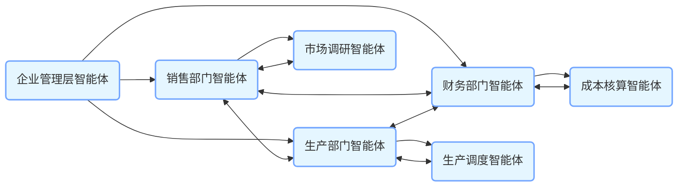

# 企业AI Agent的多智能体系统在跨部门协作优化中的应用

> 关键词：企业AI Agent、多智能体系统、跨部门协作优化、智能决策、分布式计算

> 摘要：本文深入探讨了企业AI Agent的多智能体系统在跨部门协作优化中的应用。首先介绍了相关背景，包括目的、预期读者、文档结构和术语表。接着阐述了核心概念与联系，通过文本示意图和Mermaid流程图展示其原理和架构。详细讲解了核心算法原理及具体操作步骤，结合Python源代码进行说明。分析了数学模型和公式，并举例说明。通过项目实战给出代码实际案例及详细解释。探讨了实际应用场景，推荐了相关工具和资源，最后总结了未来发展趋势与挑战，还提供了常见问题解答和扩展阅读参考资料。旨在帮助企业更好地理解和应用多智能体系统来提升跨部门协作效率。

## 1. 背景介绍 
### 1.1 目的和范围
在当今竞争激烈的商业环境中，企业面临着越来越复杂的业务挑战，跨部门协作成为提高企业效率和创新能力的关键因素。然而，传统的跨部门协作方式往往存在信息沟通不畅、决策效率低下等问题。企业AI Agent的多智能体系统为解决这些问题提供了新的思路和方法。本文的目的是深入研究企业AI Agent的多智能体系统在跨部门协作优化中的应用，探讨其原理、算法、实际案例以及未来发展趋势。范围涵盖了从多智能体系统的基本概念到具体的应用场景，以及相关的技术和工具。

### 1.2 预期读者
本文预期读者包括企业管理人员、IT技术人员、人工智能研究人员以及对企业跨部门协作和人工智能应用感兴趣的人士。企业管理人员可以从中了解如何利用多智能体系统提升跨部门协作效率，做出更明智的决策；IT技术人员可以获取关于多智能体系统的技术实现和开发的相关知识；人工智能研究人员可以在本文的基础上进行更深入的研究；而对该领域感兴趣的人士则可以对企业AI Agent的多智能体系统在跨部门协作中的应用有一个全面的认识。

### 1.3 文档结构概述
本文共分为十个部分。第一部分为背景介绍，包括目的和范围、预期读者、文档结构概述和术语表。第二部分阐述核心概念与联系，通过文本示意图和Mermaid流程图展示多智能体系统的原理和架构。第三部分详细讲解核心算法原理及具体操作步骤，结合Python源代码进行说明。第四部分分析数学模型和公式，并举例说明。第五部分通过项目实战给出代码实际案例及详细解释。第六部分探讨实际应用场景。第七部分推荐相关工具和资源，包括学习资源、开发工具框架和相关论文著作。第八部分总结未来发展趋势与挑战。第九部分为附录，提供常见问题解答。第十部分为扩展阅读与参考资料。

### 1.4 术语表
#### 1.4.1 核心术语定义
- **企业AI Agent**：是指在企业环境中，具有一定智能和自主决策能力的软件实体，能够感知环境信息，根据预设的规则或学习到的知识进行决策和行动。
- **多智能体系统（Multi - Agent System，MAS）**：由多个智能体组成的系统，这些智能体之间可以相互通信、协作和竞争，共同完成一个或多个复杂的任务。
- **跨部门协作**：企业内部不同部门之间为了实现共同的目标，通过信息共享、资源整合等方式进行合作的过程。
- **智能决策**：利用人工智能技术，根据大量的数据和信息，通过分析、推理和学习等方法，为决策者提供最优的决策方案。
- **分布式计算**：将一个复杂的计算任务分解成多个子任务，分布到不同的计算节点上进行并行处理，以提高计算效率。

#### 1.4.2 相关概念解释
- **智能体的自主性**：智能体能够独立地感知环境、做出决策和执行行动，不受其他智能体或外部因素的直接控制。
- **智能体的交互性**：智能体之间可以通过通信协议进行信息交换和交互，以实现协作和协调。
- **多智能体系统的涌现性**：多智能体系统在运行过程中，由于智能体之间的相互作用和协作，会产生一些单个智能体所不具备的整体行为和特性。

#### 1.4.3 缩略词列表
- **MAS**：Multi - Agent System（多智能体系统）
- **AI**：Artificial Intelligence（人工智能）

## 2. 核心概念与联系 
### 核心概念原理
企业AI Agent的多智能体系统是一种基于分布式计算和人工智能技术的系统架构。在企业环境中，每个部门可以看作是一个智能体，这些智能体具有不同的功能和任务。例如，销售部门的智能体负责获取客户需求和订单信息，生产部门的智能体负责安排生产计划和调度资源，财务部门的智能体负责成本核算和资金管理等。

这些智能体之间通过通信机制进行信息交换和协作。当一个智能体需要其他部门的支持或信息时，它可以向相关的智能体发送请求。接收请求的智能体根据自身的能力和状态，决定是否能够提供帮助，并将结果反馈给请求方。通过这种方式，多个智能体可以协同工作，共同完成企业的业务目标。

智能体的决策过程通常基于一定的规则或模型。这些规则或模型可以是预先定义的，也可以是通过机器学习算法从大量的数据中学习得到的。例如，生产部门的智能体可以根据销售订单信息和库存水平，使用优化算法来制定最优的生产计划。

### 架构的文本示意图
```plaintext
企业AI Agent的多智能体系统架构

                +----------------+
                | 企业管理层智能体 |
                +----------------+
                        |
                        | 信息传递与指令下达
                        v
 +----------------+    +----------------+    +----------------+
 | 销售部门智能体 |    | 生产部门智能体 |    | 财务部门智能体 |
 +----------------+    +----------------+    +----------------+
       |                        |                        |
       | 信息共享与协作请求    | 信息共享与协作请求    | 信息共享与协作请求
       v                        v                        v
 +----------------+    +----------------+    +----------------+
 | 市场调研智能体 |    | 生产调度智能体 |    | 成本核算智能体 |
 +----------------+    +----------------+    +----------------+
```

### Mermaid流程图


从这个流程图可以看出，企业管理层智能体处于核心位置，负责向各个部门智能体下达指令和收集信息。各个部门智能体之间相互协作，并且每个部门智能体下面还可以有更具体的子智能体，负责完成特定的任务。

## 3. 核心算法原理 & 具体操作步骤 
### 核心算法原理
在企业AI Agent的多智能体系统中，常用的算法包括博弈论算法、强化学习算法和遗传算法等。下面以强化学习算法为例，详细介绍其原理。

强化学习是一种机器学习方法，智能体通过与环境进行交互，不断尝试不同的行动，并根据环境反馈的奖励信号来学习最优的行动策略。在多智能体系统中，每个智能体都可以看作是一个强化学习智能体，它们在与其他智能体和环境的交互过程中，不断调整自己的行为，以最大化自己的长期奖励。

强化学习的基本要素包括状态（State）、行动（Action）、奖励（Reward）和策略（Policy）。智能体在每个时刻会感知到当前的状态 $s_t$，根据策略 $\pi$ 选择一个行动 $a_t$ 执行，执行行动后环境会反馈一个奖励 $r_{t + 1}$，并进入下一个状态 $s_{t + 1}$。智能体的目标是学习一个最优策略 $\pi^*$，使得长期累积奖励最大化。

### 具体操作步骤
以下是使用Python实现一个简单的强化学习智能体的示例代码：
```python
import numpy as np

# 定义环境类
class Environment:
    def __init__(self):
        # 初始化状态空间和行动空间
        self.state_space = [0, 1, 2]
        self.action_space = [0, 1]
        # 初始化当前状态
        self.current_state = np.random.choice(self.state_space)

    def step(self, action):
        # 根据行动和当前状态转移到下一个状态
        if action == 0:
            self.current_state = (self.current_state + 1) % len(self.state_space)
        else:
            self.current_state = (self.current_state - 1) % len(self.state_space)
        # 计算奖励
        reward = self.get_reward()
        return self.current_state, reward

    def get_reward(self):
        # 根据当前状态计算奖励
        if self.current_state == 1:
            return 1
        else:
            return -1

    def reset(self):
        # 重置环境状态
        self.current_state = np.random.choice(self.state_space)
        return self.current_state

# 定义强化学习智能体类
class QLearningAgent:
    def __init__(self, state_space, action_space, learning_rate=0.1, discount_factor=0.9):
        # 初始化状态空间和行动空间
        self.state_space = state_space
        self.action_space = action_space
        # 初始化学习率和折扣因子
        self.learning_rate = learning_rate
        self.discount_factor = discount_factor
        # 初始化Q表
        self.q_table = np.zeros((len(state_space), len(action_space)))

    def choose_action(self, state):
        # 根据Q表选择行动
        if np.random.uniform(0, 1) < 0.1:
            # 以10%的概率随机选择行动
            action = np.random.choice(self.action_space)
        else:
            # 选择Q值最大的行动
            action = np.argmax(self.q_table[state])
        return action

    def update_q_table(self, state, action, reward, next_state):
        # 更新Q表
        q_predict = self.q_table[state][action]
        q_target = reward + self.discount_factor * np.max(self.q_table[next_state])
        self.q_table[state][action] += self.learning_rate * (q_target - q_predict)

# 训练智能体
env = Environment()
agent = QLearningAgent(env.state_space, env.action_space)

episodes = 1000
for episode in range(episodes):
    state = env.reset()
    total_reward = 0
    while True:
        action = agent.choose_action(state)
        next_state, reward = env.step(action)
        agent.update_q_table(state, action, reward, next_state)
        state = next_state
        total_reward += reward
        if state == 1:
            break
    print(f"Episode {episode + 1}: Total Reward = {total_reward}")
```
### 代码解释
1. **环境类（Environment）**：定义了环境的状态空间、行动空间和状态转移规则。`step` 方法根据智能体的行动更新环境状态，并返回下一个状态和奖励。`get_reward` 方法根据当前状态计算奖励。`reset` 方法重置环境状态。
2. **强化学习智能体类（QLearningAgent）**：使用Q学习算法进行学习。`choose_action` 方法根据Q表选择行动，以一定的概率进行探索。`update_q_table` 方法根据贝尔曼方程更新Q表。
3. **训练过程**：在每个回合中，智能体与环境进行交互，不断更新Q表，直到达到目标状态。

## 4. 数学模型和公式 & 详细讲解 & 举例说明 
### 数学模型和公式
在强化学习中，最常用的数学模型是马尔可夫决策过程（Markov Decision Process，MDP）。MDP可以用一个五元组 $(S, A, P, R, \gamma)$ 来表示，其中：
- $S$ 是状态空间，即智能体可能处于的所有状态的集合。
- $A$ 是行动空间，即智能体可以采取的所有行动的集合。
- $P(s'|s, a)$ 是状态转移概率，表示在状态 $s$ 下采取行动 $a$ 后转移到状态 $s'$ 的概率。
- $R(s, a, s')$ 是奖励函数，表示在状态 $s$ 下采取行动 $a$ 转移到状态 $s'$ 时获得的奖励。
- $\gamma \in [0, 1]$ 是折扣因子，用于权衡当前奖励和未来奖励的重要性。

智能体的目标是找到一个最优策略 $\pi^*$，使得长期累积折扣奖励最大化。长期累积折扣奖励可以表示为：
$$G_t = \sum_{k = 0}^{\infty} \gamma^k r_{t + k + 1}$$
其中 $r_{t + k + 1}$ 是在时刻 $t + k + 1$ 获得的奖励。

Q学习算法是一种基于价值的强化学习算法，它通过学习Q值函数 $Q(s, a)$ 来找到最优策略。Q值函数表示在状态 $s$ 下采取行动 $a$ 后，按照最优策略继续行动所能获得的长期累积折扣奖励。Q学习算法的更新公式为：
$$Q(s_t, a_t) \leftarrow Q(s_t, a_t) + \alpha [r_{t + 1} + \gamma \max_{a} Q(s_{t + 1}, a) - Q(s_t, a_t)]$$
其中 $\alpha$ 是学习率，用于控制每次更新的步长。

### 详细讲解
- **马尔可夫决策过程（MDP）**：MDP的核心假设是状态转移具有马尔可夫性，即下一个状态只与当前状态和当前行动有关，而与历史状态和行动无关。这一假设使得问题的求解变得更加简单和可行。
- **长期累积折扣奖励**：引入折扣因子 $\gamma$ 是为了考虑到未来奖励的不确定性。$\gamma$ 越接近1，表示智能体更注重未来的奖励；$\gamma$ 越接近0，表示智能体更注重当前的奖励。
- **Q学习算法**：Q学习算法是一种无模型的强化学习算法，它不需要知道环境的状态转移概率和奖励函数。通过不断地与环境进行交互，智能体可以逐渐学习到最优的Q值函数，从而得到最优策略。

### 举例说明
假设一个智能体在一个简单的网格世界中移动，网格世界的状态空间 $S$ 是所有网格的位置，行动空间 $A$ 是上下左右四个方向。智能体每移动一步会获得一个负的奖励（例如 -1），当到达目标位置时会获得一个正的奖励（例如 +10）。

初始时，智能体的Q表全为0。在每个回合中，智能体根据Q表选择行动，与环境进行交互，获得奖励并更新Q表。随着训练的进行，Q表会逐渐收敛到最优值，智能体也会学会如何以最短的路径到达目标位置。

## 5. 项目实战：代码实际案例和详细解释说明 
### 5.1  开发环境搭建
要运行上述的强化学习代码，需要安装Python环境和相关的库。以下是具体的步骤：
1. **安装Python**：可以从Python官方网站（https://www.python.org/downloads/）下载并安装Python 3.x版本。
2. **安装NumPy**：NumPy是Python中用于科学计算的基础库，可以使用以下命令进行安装：
```sh
pip install numpy
```
### 5.2  源代码详细实现和代码解读
```python
import numpy as np

# 定义环境类
class Environment:
    def __init__(self):
        # 初始化状态空间和行动空间
        self.state_space = [0, 1, 2]
        self.action_space = [0, 1]
        # 初始化当前状态
        self.current_state = np.random.choice(self.state_space)

    def step(self, action):
        # 根据行动和当前状态转移到下一个状态
        if action == 0:
            self.current_state = (self.current_state + 1) % len(self.state_space)
        else:
            self.current_state = (self.current_state - 1) % len(self.state_space)
        # 计算奖励
        reward = self.get_reward()
        return self.current_state, reward

    def get_reward(self):
        # 根据当前状态计算奖励
        if self.current_state == 1:
            return 1
        else:
            return -1

    def reset(self):
        # 重置环境状态
        self.current_state = np.random.choice(self.state_space)
        return self.current_state

# 定义强化学习智能体类
class QLearningAgent:
    def __init__(self, state_space, action_space, learning_rate=0.1, discount_factor=0.9):
        # 初始化状态空间和行动空间
        self.state_space = state_space
        self.action_space = action_space
        # 初始化学习率和折扣因子
        self.learning_rate = learning_rate
        self.discount_factor = discount_factor
        # 初始化Q表
        self.q_table = np.zeros((len(state_space), len(action_space)))

    def choose_action(self, state):
        # 根据Q表选择行动
        if np.random.uniform(0, 1) < 0.1:
            # 以10%的概率随机选择行动
            action = np.random.choice(self.action_space)
        else:
            # 选择Q值最大的行动
            action = np.argmax(self.q_table[state])
        return action

    def update_q_table(self, state, action, reward, next_state):
        # 更新Q表
        q_predict = self.q_table[state][action]
        q_target = reward + self.discount_factor * np.max(self.q_table[next_state])
        self.q_table[state][action] += self.learning_rate * (q_target - q_predict)

# 训练智能体
env = Environment()
agent = QLearningAgent(env.state_space, env.action_space)

episodes = 1000
for episode in range(episodes):
    state = env.reset()
    total_reward = 0
    while True:
        action = agent.choose_action(state)
        next_state, reward = env.step(action)
        agent.update_q_table(state, action, reward, next_state)
        state = next_state
        total_reward += reward
        if state == 1:
            break
    print(f"Episode {episode + 1}: Total Reward = {total_reward}")
```
### 代码解读
1. **环境类（Environment）**：
    - `__init__` 方法：初始化环境的状态空间、行动空间和当前状态。
    - `step` 方法：根据智能体的行动更新环境状态，并返回下一个状态和奖励。
    - `get_reward` 方法：根据当前状态计算奖励。
    - `reset` 方法：重置环境状态。
2. **强化学习智能体类（QLearningAgent）**：
    - `__init__` 方法：初始化状态空间、行动空间、学习率、折扣因子和Q表。
    - `choose_action` 方法：根据Q表选择行动，以一定的概率进行探索。
    - `update_q_table` 方法：根据Q学习算法的更新公式更新Q表。
3. **训练过程**：
    - 初始化环境和智能体。
    - 在每个回合中，重置环境状态，智能体与环境进行交互，不断更新Q表，直到达到目标状态。
    - 打印每个回合的总奖励。

## 6. 实际应用场景 
### 销售与生产部门协作
在企业中，销售部门负责获取客户订单，生产部门负责安排生产。企业AI Agent的多智能体系统可以实现销售部门智能体和生产部门智能体之间的协作。销售部门智能体可以实时将客户订单信息传递给生产部门智能体，生产部门智能体根据订单信息和库存水平，使用优化算法制定最优的生产计划。同时，生产部门智能体可以将生产进度信息反馈给销售部门智能体，销售部门智能体可以根据生产进度及时与客户沟通，提高客户满意度。

### 财务与其他部门协作
财务部门智能体可以与销售部门智能体和生产部门智能体进行协作。销售部门智能体在签订订单时，可以将订单金额和收款计划信息传递给财务部门智能体，财务部门智能体可以根据这些信息进行资金预算和风险管理。生产部门智能体在采购原材料和安排生产时，可以将成本信息传递给财务部门智能体，财务部门智能体可以进行成本核算和控制，确保企业的经济效益。

### 跨部门项目管理
在企业的跨部门项目中，不同部门的智能体可以共同协作完成项目任务。例如，市场部门智能体负责市场调研和需求分析，研发部门智能体负责产品研发，销售部门智能体负责产品推广和销售。各个部门智能体之间通过信息共享和协作，确保项目按时、按质量要求完成。

## 7. 工具和资源推荐
### 7.1 学习资源推荐
#### 7.1.1 书籍推荐
- 《强化学习：原理与Python实现》：本书详细介绍了强化学习的基本原理和算法，并通过Python代码实现了多个实际案例，适合初学者入门。
- 《多智能体系统：算法、博弈论及应用》：全面介绍了多智能体系统的理论和应用，包括博弈论、分布式算法等内容，适合有一定基础的读者深入学习。
#### 7.1.2 在线课程
- Coursera上的“强化学习专项课程”：由知名高校的教授授课，内容涵盖了强化学习的各个方面，包括马尔可夫决策过程、Q学习算法、深度强化学习等。
- edX上的“多智能体系统”课程：介绍了多智能体系统的基本概念、模型和算法，以及在不同领域的应用。
#### 7.1.3 技术博客和网站
- OpenAI博客（https://openai.com/blog/）：提供了关于人工智能和强化学习的最新研究成果和应用案例。
- Medium上的AI相关博客：有很多关于多智能体系统和强化学习的技术文章和经验分享。
### 7.2 开发工具框架推荐
#### 7.2.1 IDE和编辑器
- PyCharm：是一款专门为Python开发设计的集成开发环境，具有代码编辑、调试、版本控制等功能，适合开发强化学习和多智能体系统的Python代码。
- Jupyter Notebook：是一个交互式的开发环境，支持Python、R等多种编程语言，可以方便地进行代码编写、实验和文档记录。
#### 7.2.2 调试和性能分析工具
- TensorBoard：是TensorFlow的可视化工具，可以用于监控强化学习模型的训练过程，包括损失函数、奖励曲线等指标。
- cProfile：是Python的内置性能分析工具，可以帮助开发者找出代码中的性能瓶颈。
#### 7.2.3 相关框架和库
- OpenAI Gym：是一个开源的强化学习环境库，提供了多种不同类型的环境，方便开发者进行强化学习算法的测试和验证。
- Stable Baselines：是一个基于OpenAI Gym的强化学习库，提供了多种预训练的强化学习算法，方便开发者快速实现和应用。
### 7.3 相关论文著作推荐
#### 7.3.1 经典论文
- “Q - Learning”：由Watkins和Dayan发表，首次提出了Q学习算法，是强化学习领域的经典论文。
- “Multi - Agent Systems: A Modern Approach to Distributed Artificial Intelligence”：对多智能体系统的理论和方法进行了系统的阐述，是多智能体系统领域的经典著作。
#### 7.3.2 最新研究成果
- 每年在人工智能领域的顶级会议（如NeurIPS、ICML、AAAI等）上会发表很多关于多智能体系统和强化学习的最新研究成果，可以关注这些会议的论文。
#### 7.3.3 应用案例分析
- 一些企业和研究机构会发布关于企业AI Agent的多智能体系统在实际应用中的案例分析报告，可以从这些报告中了解多智能体系统在不同行业的应用场景和效果。

## 8. 总结：未来发展趋势与挑战
### 未来发展趋势
- **与大数据和云计算的融合**：随着大数据和云计算技术的发展，企业AI Agent的多智能体系统可以利用大数据进行更准确的决策，同时通过云计算平台实现分布式计算，提高系统的性能和可扩展性。
- **引入深度学习技术**：深度学习在图像识别、自然语言处理等领域取得了巨大的成功，将深度学习技术引入多智能体系统，可以提高智能体的感知和决策能力。
- **应用领域的拓展**：除了企业跨部门协作，企业AI Agent的多智能体系统还可以应用于智能交通、智慧城市、医疗保健等领域，具有广阔的应用前景。

### 挑战
- **智能体的协作与协调**：在多智能体系统中，如何实现智能体之间的有效协作和协调是一个关键问题。不同智能体可能具有不同的目标和利益，需要设计合理的机制来解决冲突和实现共赢。
- **系统的安全性和可靠性**：企业AI Agent的多智能体系统涉及到企业的重要数据和业务流程，系统的安全性和可靠性至关重要。需要采取有效的安全措施，防止数据泄露和系统故障。
- **模型的可解释性**：深度学习等人工智能模型通常是黑盒模型，难以解释其决策过程。在企业应用中，需要提高模型的可解释性，以便决策者能够理解和信任系统的决策结果。

## 9. 附录：常见问题与解答
### 问题1：多智能体系统和传统的分布式系统有什么区别？
解答：多智能体系统强调智能体的自主性和交互性，智能体可以根据自身的知识和目标进行自主决策，并与其他智能体进行协作和竞争。而传统的分布式系统主要关注任务的分解和分配，各个节点通常按照预先设定的规则进行工作，缺乏自主性和智能性。

### 问题2：如何评估多智能体系统在跨部门协作中的效果？
解答：可以从多个方面进行评估，如协作效率、决策质量、成本控制等。例如，可以通过比较使用多智能体系统前后的项目完成时间、订单处理速度等指标来评估协作效率；通过分析决策的准确性和合理性来评估决策质量；通过对比成本核算结果来评估成本控制效果。

### 问题3：多智能体系统的开发难度大吗？
解答：多智能体系统的开发难度相对较大，需要掌握人工智能、分布式计算、博弈论等多方面的知识。同时，还需要考虑智能体之间的通信、协作和协调等问题。但是，随着相关技术的发展和开源工具的不断涌现，开发难度也在逐渐降低。

## 10. 扩展阅读 & 参考资料
### 扩展阅读
- 《人工智能：一种现代方法》：全面介绍了人工智能的各个领域，包括搜索算法、机器学习、自然语言处理等，对于深入理解企业AI Agent的多智能体系统有很大的帮助。
- 《复杂适应系统：社会生活计算模型导论》：探讨了复杂适应系统的理论和应用，多智能体系统是复杂适应系统的一个重要分支，本书可以为多智能体系统的研究提供新的视角。

### 参考资料
- 相关的学术论文和研究报告，可以通过学术数据库（如IEEE Xplore、ACM Digital Library等）进行查找。
- 企业的官方网站和行业报告，了解企业AI Agent的多智能体系统在实际应用中的案例和经验。

作者：AI天才研究院/AI Genius Institute & 禅与计算机程序设计艺术 /Zen And The Art of Computer Programming