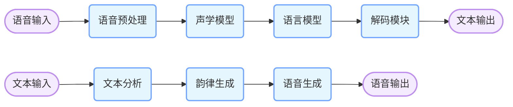

# 企业AI Agent的多语言语音识别与合成技术

> 关键词：企业AI Agent、多语言语音识别、语音合成技术、深度学习、自然语言处理

> 摘要：本文围绕企业AI Agent的多语言语音识别与合成技术展开深入探讨。首先介绍了该技术的背景，包括目的范围、预期读者等内容。接着详细阐述了核心概念与联系，给出了相关的文本示意图和Mermaid流程图。在核心算法原理部分，使用Python代码进行了详细说明。同时，对数学模型和公式进行了讲解并举例。通过项目实战，展示了代码的实际案例并进行解读。分析了该技术的实际应用场景，推荐了学习、开发工具和相关论文著作。最后总结了未来发展趋势与挑战，并给出常见问题解答和扩展阅读参考资料，旨在为企业在AI Agent的多语言语音处理方面提供全面的技术指导。

## 1. 背景介绍 
### 1.1 目的和范围
随着全球化的发展，企业的业务范围逐渐拓展到世界各地，需要与不同语言背景的客户和合作伙伴进行沟通。企业AI Agent的多语言语音识别与合成技术应运而生，其目的是使企业AI Agent能够准确识别多种语言的语音输入，并将文本信息以自然流畅的语音形式输出，涵盖了多种常见语言，如英语、中文、法语、德语、西班牙语等，为企业提供更加智能、便捷、高效的多语言交互服务。

### 1.2 预期读者
本文的预期读者包括企业的技术决策者、AI开发工程师、自然语言处理研究人员以及对企业AI Agent多语言语音技术感兴趣的相关人士。对于技术决策者，可帮助他们了解该技术的应用价值和发展趋势，为企业的技术选型提供参考；对于开发工程师，可提供详细的技术原理和实现方法，助力他们进行技术研发；对于研究人员，可作为进一步深入研究的参考资料；对于普通感兴趣者，可帮助他们了解该领域的基本概念和应用场景。

### 1.3 文档结构概述
本文将按照以下结构进行阐述：首先介绍背景信息，让读者了解该技术的产生背景和适用人群；接着讲解核心概念与联系，帮助读者建立起对多语言语音识别与合成技术的整体认知；然后详细阐述核心算法原理和具体操作步骤，并使用Python代码进行说明；随后介绍数学模型和公式，加深读者对技术本质的理解；通过项目实战展示代码的实际应用并进行解读；分析该技术的实际应用场景；推荐相关的学习、开发工具和论文著作；最后总结未来发展趋势与挑战，解答常见问题并提供扩展阅读参考资料。

### 1.4 术语表
#### 1.4.1 核心术语定义
- **企业AI Agent**：指企业中具备人工智能能力的智能代理程序，能够模拟人类的行为和思维，与用户进行交互，完成各种任务。
- **多语言语音识别**：将多种不同语言的语音信号转换为文本信息的技术。
- **语音合成**：将文本信息转换为自然流畅的语音输出的技术。
- **深度学习**：一种基于人工神经网络的机器学习方法，通过多层神经网络自动学习数据的特征和模式。
- **自然语言处理**：研究如何让计算机理解、处理和生成人类语言的技术领域。

#### 1.4.2 相关概念解释
- **声学模型**：在语音识别中，声学模型用于描述语音信号的声学特征与语音单元（如音素）之间的关系，通过对大量语音数据的学习，能够准确地将语音信号映射到对应的语音单元。
- **语言模型**：用于评估一个句子在某种语言中出现的概率，在语音识别中可以帮助纠正识别结果，提高识别的准确性。在语音合成中，语言模型可以生成更加自然流畅的文本。
- **端到端模型**：一种直接将输入（如语音信号）映射到输出（如文本）的模型，不需要中间的复杂特征工程，通过端到端的训练可以学习到输入和输出之间的直接关联。

#### 1.4.3 缩略词列表
- **ASR**：Automatic Speech Recognition，自动语音识别
- **TTS**：Text-to-Speech，文本转语音
- **DNN**：Deep Neural Network，深度神经网络
- **RNN**：Recurrent Neural Network，循环神经网络
- **LSTM**：Long Short-Term Memory，长短期记忆网络

## 2. 核心概念与联系 

### 核心概念原理
企业AI Agent的多语言语音识别与合成技术主要涉及到语音识别（ASR）和语音合成（TTS）两个核心部分。

#### 多语言语音识别原理
多语言语音识别的目标是将不同语言的语音信号转换为对应的文本。其基本原理是通过声学模型和语言模型的协同工作。声学模型对输入的语音信号进行特征提取和分析，将语音信号转换为音素序列。语言模型则根据音素序列和语言的语法、语义规则，将音素序列转换为有意义的文本。常见的声学模型有基于深度学习的深度神经网络（DNN）、循环神经网络（RNN）及其变体如长短期记忆网络（LSTM）等。

#### 语音合成原理
语音合成是将文本信息转换为自然流畅的语音输出。其主要步骤包括文本分析、韵律生成和语音生成。文本分析对输入的文本进行语法、语义分析，确定每个词语的发音和语调。韵律生成根据文本的语义和语境，生成合适的韵律信息，如音高、音长、音强等。语音生成根据发音和韵律信息，合成最终的语音信号。常见的语音合成方法有基于拼接的方法和基于参数的方法，近年来基于深度学习的端到端语音合成方法也得到了广泛应用。

### 架构的文本示意图
```plaintext
企业AI Agent
|
|-- 多语言语音识别模块
|   |-- 语音预处理
|   |   |-- 降噪
|   |   |-- 特征提取
|   |-- 声学模型
|   |-- 语言模型
|   |-- 解码模块
|
|-- 语音合成模块
|   |-- 文本分析
|   |-- 韵律生成
|   |-- 语音生成
```

### Mermaid流程图


## 3. 核心算法原理 & 具体操作步骤 

### 多语言语音识别算法原理及Python代码实现
#### 算法原理
在多语言语音识别中，我们可以使用端到端的深度学习模型，如基于Transformer架构的模型。Transformer模型具有强大的并行计算能力和长序列处理能力，能够有效地捕捉语音信号中的长距离依赖关系。其核心是多头自注意力机制，通过对输入序列的不同位置进行加权求和，得到每个位置的表示。

#### 具体操作步骤
1. **数据预处理**：对语音数据进行降噪、特征提取等操作，将语音信号转换为特征向量序列。
2. **模型训练**：使用大规模的多语言语音数据集对Transformer模型进行训练，调整模型的参数以最小化预测结果与真实标签之间的损失。
3. **解码**：在推理阶段，将输入的语音特征序列输入到训练好的模型中，通过解码算法得到最终的文本输出。

#### Python代码实现
```python
import torch
import torch.nn as nn
import torch.optim as optim
from torch.utils.data import DataLoader, Dataset

# 定义Transformer模型
class TransformerASR(nn.Module):
    def __init__(self, input_dim, d_model, nhead, num_layers, vocab_size):
        super(TransformerASR, self).__init__()
        self.embedding = nn.Linear(input_dim, d_model)
        self.transformer_encoder = nn.TransformerEncoder(
            nn.TransformerEncoderLayer(d_model=d_model, nhead=nhead),
            num_layers=num_layers
        )
        self.fc = nn.Linear(d_model, vocab_size)

    def forward(self, src):
        src = self.embedding(src)
        src = src.permute(1, 0, 2)  # 调整维度以适应Transformer输入要求
        output = self.transformer_encoder(src)
        output = output.permute(1, 0, 2)  # 调整维度回原来的形状
        output = self.fc(output)
        return output

# 定义数据集类
class ASRDataset(Dataset):
    def __init__(self, data, labels):
        self.data = data
        self.labels = labels

    def __len__(self):
        return len(self.data)

    def __getitem__(self, idx):
        return self.data[idx], self.labels[idx]

# 模拟数据
input_dim = 128
d_model = 256
nhead = 8
num_layers = 6
vocab_size = 100
data = torch.randn(100, 10, input_dim)
labels = torch.randint(0, vocab_size, (100, 10))

# 创建数据集和数据加载器
dataset = ASRDataset(data, labels)
dataloader = DataLoader(dataset, batch_size=10, shuffle=True)

# 初始化模型、损失函数和优化器
model = TransformerASR(input_dim, d_model, nhead, num_layers, vocab_size)
criterion = nn.CrossEntropyLoss()
optimizer = optim.Adam(model.parameters(), lr=0.001)

# 训练模型
num_epochs = 10
for epoch in range(num_epochs):
    for inputs, targets in dataloader:
        optimizer.zero_grad()
        outputs = model(inputs)
        outputs = outputs.view(-1, vocab_size)
        targets = targets.view(-1)
        loss = criterion(outputs, targets)
        loss.backward()
        optimizer.step()
    print(f'Epoch {epoch+1}/{num_epochs}, Loss: {loss.item()}')
```

### 语音合成算法原理及Python代码实现
#### 算法原理
在语音合成中，我们可以使用基于Tacotron 2架构的模型。Tacotron 2由编码器、解码器和后处理网络组成。编码器将输入的文本转换为特征表示，解码器根据编码器的输出生成语音的梅尔频谱，后处理网络将梅尔频谱转换为线性频谱，最后通过声码器将线性频谱转换为语音信号。

#### 具体操作步骤
1. **文本预处理**：对输入的文本进行分词、注音等操作，将文本转换为适合模型输入的格式。
2. **模型训练**：使用大规模的文本和语音数据集对Tacotron 2模型进行训练，调整模型的参数以最小化生成的梅尔频谱与真实梅尔频谱之间的损失。
3. **语音生成**：在推理阶段，将输入的文本输入到训练好的模型中，得到梅尔频谱，再通过声码器将梅尔频谱转换为语音信号。

#### Python代码实现
```python
import torch
import torch.nn as nn
import torch.optim as optim
from torch.utils.data import DataLoader, Dataset

# 定义Tacotron 2模型的简单示例
class Tacotron2(nn.Module):
    def __init__(self, vocab_size, embedding_dim, hidden_dim, mel_dim):
        super(Tacotron2, self).__init__()
        self.embedding = nn.Embedding(vocab_size, embedding_dim)
        self.encoder = nn.GRU(embedding_dim, hidden_dim, batch_first=True)
        self.decoder = nn.GRU(hidden_dim, hidden_dim, batch_first=True)
        self.fc = nn.Linear(hidden_dim, mel_dim)

    def forward(self, inputs):
        embedded = self.embedding(inputs)
        encoder_output, _ = self.encoder(embedded)
        decoder_output, _ = self.decoder(encoder_output)
        output = self.fc(decoder_output)
        return output

# 定义数据集类
class TTSDataset(Dataset):
    def __init__(self, texts, mels):
        self.texts = texts
        self.mels = mels

    def __len__(self):
        return len(self.texts)

    def __getitem__(self, idx):
        return self.texts[idx], self.mels[idx]

# 模拟数据
vocab_size = 100
embedding_dim = 256
hidden_dim = 512
mel_dim = 80
texts = torch.randint(0, vocab_size, (100, 10))
mels = torch.randn(100, 10, mel_dim)

# 创建数据集和数据加载器
dataset = TTSDataset(texts, mels)
dataloader = DataLoader(dataset, batch_size=10, shuffle=True)

# 初始化模型、损失函数和优化器
model = Tacotron2(vocab_size, embedding_dim, hidden_dim, mel_dim)
criterion = nn.MSELoss()
optimizer = optim.Adam(model.parameters(), lr=0.001)

# 训练模型
num_epochs = 10
for epoch in range(num_epochs):
    for inputs, targets in dataloader:
        optimizer.zero_grad()
        outputs = model(inputs)
        loss = criterion(outputs, targets)
        loss.backward()
        optimizer.step()
    print(f'Epoch {epoch+1}/{num_epochs}, Loss: {loss.item()}')
```

## 4. 数学模型和公式 & 详细讲解 & 举例说明 

### 多语言语音识别的数学模型和公式
#### 声学模型
声学模型通常使用条件概率来描述语音信号 $x$ 与语音单元 $y$ 之间的关系，即 $P(y|x)$。在深度学习中，我们可以使用神经网络来估计这个条件概率。以基于神经网络的声学模型为例，假设神经网络的输入为语音特征向量 $x$，输出为每个语音单元的概率分布 $p(y|x)$。

在训练过程中，我们的目标是最大化训练数据的似然函数：
$$
\mathcal{L} = \prod_{i=1}^{N} P(y_i|x_i)
$$
其中 $N$ 是训练数据的数量，$(x_i, y_i)$ 是第 $i$ 个训练样本。为了方便计算，通常会对似然函数取对数，得到对数似然函数：
$$
\log \mathcal{L} = \sum_{i=1}^{N} \log P(y_i|x_i)
$$
我们的目标是通过调整神经网络的参数 $\theta$ 来最大化对数似然函数，即：
$$
\theta^* = \arg \max_{\theta} \sum_{i=1}^{N} \log P(y_i|x_i; \theta)
$$

#### 语言模型
语言模型用于评估一个句子 $w = w_1, w_2, \cdots, w_T$ 在某种语言中出现的概率 $P(w)$。常见的语言模型有 $n$-gram 模型和基于神经网络的语言模型。

$n$-gram 模型假设一个词的出现只依赖于它前面的 $n-1$ 个词，即：
$$
P(w_i|w_1, w_2, \cdots, w_{i-1}) \approx P(w_i|w_{i-(n-1)}, \cdots, w_{i-1})
$$
那么句子 $w$ 的概率可以表示为：
$$
P(w) = \prod_{i=1}^{T} P(w_i|w_{i-(n-1)}, \cdots, w_{i-1})
$$

基于神经网络的语言模型，如循环神经网络（RNN），可以通过学习词序列的上下文信息来估计语言模型的概率。假设 RNN 的隐藏状态为 $h_t$，输入为 $w_t$，输出为下一个词的概率分布 $p(w_{t+1}|w_1, \cdots, w_t)$，则 RNN 的更新公式为：
$$
h_t = f(W_{hh} h_{t-1} + W_{xh} w_t + b_h)
$$
$$
p(w_{t+1}|w_1, \cdots, w_t) = \text{softmax}(W_{hy} h_t + b_y)
$$
其中 $W_{hh}$、$W_{xh}$、$W_{hy}$ 是权重矩阵，$b_h$、$b_y$ 是偏置向量，$f$ 是激活函数。

### 语音合成的数学模型和公式
#### 文本分析
在文本分析中，我们需要对输入的文本进行词性标注、句法分析等操作。以词性标注为例，假设文本为 $w = w_1, w_2, \cdots, w_T$，词性标签为 $t = t_1, t_2, \cdots, t_T$，我们的目标是找到最可能的词性标签序列，即：
$$
t^* = \arg \max_{t} P(t|w)
$$
根据贝叶斯定理，有：
$$
P(t|w) = \frac{P(w|t) P(t)}{P(w)}
$$
由于 $P(w)$ 对于所有的词性标签序列都是相同的，因此我们可以只考虑分子 $P(w|t) P(t)$。在实际应用中，通常使用隐马尔可夫模型（HMM）或条件随机场（CRF）来进行词性标注。

#### 韵律生成
韵律生成的目标是根据文本的语义和语境，生成合适的韵律信息，如音高、音长、音强等。可以使用统计模型或深度学习模型来实现。以基于深度学习的韵律生成模型为例，假设输入为文本特征 $x$，输出为韵律特征 $y$，则模型可以表示为：
$$
y = f(x; \theta)
$$
其中 $f$ 是神经网络模型，$\theta$ 是模型的参数。在训练过程中，我们的目标是最小化生成的韵律特征与真实韵律特征之间的损失，如均方误差损失：
$$
\mathcal{L} = \frac{1}{N} \sum_{i=1}^{N} \|y_i - f(x_i; \theta)\|^2
$$
其中 $N$ 是训练数据的数量，$(x_i, y_i)$ 是第 $i$ 个训练样本。

### 举例说明
#### 多语言语音识别
假设我们有一段英语语音信号 $x$，我们希望将其转换为文本。首先，通过声学模型得到语音单元的概率分布 $P(y|x)$，假设得到的语音单元序列为 "h - e - l - l - o"。然后，通过语言模型评估这个序列的概率 $P("hello")$，最终根据解码算法得到最可能的文本 "hello"。

#### 语音合成
假设我们要合成文本 "Hello, how are you?" 的语音。首先，对文本进行文本分析，得到词性标注和句法信息。然后，根据韵律生成模型生成合适的韵律特征，如音高、音长等。最后，根据语音生成模型将文本和韵律特征转换为语音信号。

## 5. 项目实战：代码实际案例和详细解释说明 

### 5.1  开发环境搭建
#### 安装Python和相关库
首先，确保你已经安装了Python 3.6或以上版本。可以从Python官方网站（https://www.python.org/downloads/）下载并安装。

然后，安装所需的Python库，如PyTorch、NumPy、SciPy等。可以使用以下命令进行安装：
```sh
pip install torch numpy scipy
```

#### 准备数据集
对于多语言语音识别，需要准备大规模的多语言语音数据集，如LibriSpeech（英语）、Common Voice（多种语言）等。对于语音合成，需要准备文本和对应的语音数据集。

### 5.2  源代码详细实现和代码解读
#### 多语言语音识别代码实现
```python
import torch
import torch.nn as nn
import torch.optim as optim
from torch.utils.data import DataLoader, Dataset
import torchaudio

# 定义数据集类
class ASRDataset(Dataset):
    def __init__(self, audio_files, transcripts, transforms=None):
        self.audio_files = audio_files
        self.transcripts = transcripts
        self.transforms = transforms

    def __len__(self):
        return len(self.audio_files)

    def __getitem__(self, idx):
        audio, sr = torchaudio.load(self.audio_files[idx])
        if self.transforms:
            audio = self.transforms(audio)
        transcript = self.transcripts[idx]
        return audio, transcript

# 定义TransformerASR模型
class TransformerASR(nn.Module):
    def __init__(self, input_dim, d_model, nhead, num_layers, vocab_size):
        super(TransformerASR, self).__init__()
        self.embedding = nn.Linear(input_dim, d_model)
        self.transformer_encoder = nn.TransformerEncoder(
            nn.TransformerEncoderLayer(d_model=d_model, nhead=nhead),
            num_layers=num_layers
        )
        self.fc = nn.Linear(d_model, vocab_size)

    def forward(self, src):
        src = self.embedding(src)
        src = src.permute(1, 0, 2)  # 调整维度以适应Transformer输入要求
        output = self.transformer_encoder(src)
        output = output.permute(1, 0, 2)  # 调整维度回原来的形状
        output = self.fc(output)
        return output

# 数据预处理
transforms = torchaudio.transforms.MelSpectrogram()

# 模拟数据
audio_files = ['audio1.wav', 'audio2.wav']
transcripts = ['hello', 'world']
dataset = ASRDataset(audio_files, transcripts, transforms)
dataloader = DataLoader(dataset, batch_size=1, shuffle=True)

# 初始化模型、损失函数和优化器
input_dim = 128
d_model = 256
nhead = 8
num_layers = 6
vocab_size = 100
model = TransformerASR(input_dim, d_model, nhead, num_layers, vocab_size)
criterion = nn.CrossEntropyLoss()
optimizer = optim.Adam(model.parameters(), lr=0.001)

# 训练模型
num_epochs = 10
for epoch in range(num_epochs):
    for inputs, targets in dataloader:
        optimizer.zero_grad()
        outputs = model(inputs)
        outputs = outputs.view(-1, vocab_size)
        targets = torch.tensor([ord(c) for c in targets[0]], dtype=torch.long)
        loss = criterion(outputs, targets)
        loss.backward()
        optimizer.step()
    print(f'Epoch {epoch+1}/{num_epochs}, Loss: {loss.item()}')
```

#### 代码解读
1. **数据集类**：`ASRDataset` 类用于加载音频文件和对应的文本转录。在 `__getitem__` 方法中，使用 `torchaudio.load` 加载音频文件，并进行预处理。
2. **TransformerASR模型**：定义了一个基于Transformer的语音识别模型，包括嵌入层、Transformer编码器层和全连接层。
3. **数据预处理**：使用 `torchaudio.transforms.MelSpectrogram` 将音频信号转换为梅尔频谱。
4. **训练过程**：使用交叉熵损失函数和Adam优化器进行模型训练，每个epoch打印一次损失值。

#### 语音合成代码实现
```python
import torch
import torch.nn as nn
import torch.optim as optim
from torch.utils.data import DataLoader, Dataset
import numpy as np

# 定义数据集类
class TTSDataset(Dataset):
    def __init__(self, texts, mels):
        self.texts = texts
        self.mels = mels

    def __len__(self):
        return len(self.texts)

    def __getitem__(self, idx):
        text = self.texts[idx]
        mel = self.mels[idx]
        return text, mel

# 定义Tacotron 2模型的简单示例
class Tacotron2(nn.Module):
    def __init__(self, vocab_size, embedding_dim, hidden_dim, mel_dim):
        super(Tacotron2, self).__init__()
        self.embedding = nn.Embedding(vocab_size, embedding_dim)
        self.encoder = nn.GRU(embedding_dim, hidden_dim, batch_first=True)
        self.decoder = nn.GRU(hidden_dim, hidden_dim, batch_first=True)
        self.fc = nn.Linear(hidden_dim, mel_dim)

    def forward(self, inputs):
        embedded = self.embedding(inputs)
        encoder_output, _ = self.encoder(embedded)
        decoder_output, _ = self.decoder(encoder_output)
        output = self.fc(decoder_output)
        return output

# 模拟数据
vocab_size = 100
embedding_dim = 256
hidden_dim = 512
mel_dim = 80
texts = torch.randint(0, vocab_size, (100, 10))
mels = torch.randn(100, 10, mel_dim)

# 创建数据集和数据加载器
dataset = TTSDataset(texts, mels)
dataloader = DataLoader(dataset, batch_size=10, shuffle=True)

# 初始化模型、损失函数和优化器
model = Tacotron2(vocab_size, embedding_dim, hidden_dim, mel_dim)
criterion = nn.MSELoss()
optimizer = optim.Adam(model.parameters(), lr=0.001)

# 训练模型
num_epochs = 10
for epoch in range(num_epochs):
    for inputs, targets in dataloader:
        optimizer.zero_grad()
        outputs = model(inputs)
        loss = criterion(outputs, targets)
        loss.backward()
        optimizer.step()
    print(f'Epoch {epoch+1}/{num_epochs}, Loss: {loss.item()}')
```

#### 代码解读
1. **数据集类**：`TTSDataset` 类用于加载文本和对应的梅尔频谱。
2. **Tacotron 2模型**：定义了一个简单的Tacotron 2模型，包括嵌入层、编码器、解码器和全连接层。
3. **训练过程**：使用均方误差损失函数和Adam优化器进行模型训练，每个epoch打印一次损失值。

### 5.3  代码解读与分析
#### 多语言语音识别代码分析
- **数据处理**：使用 `torchaudio` 库进行音频文件的加载和预处理，将音频信号转换为梅尔频谱，方便模型处理。
- **模型结构**：基于Transformer架构的模型具有强大的并行计算能力和长序列处理能力，能够有效地捕捉语音信号中的长距离依赖关系。
- **训练过程**：使用交叉熵损失函数来衡量模型预测结果与真实标签之间的差异，通过反向传播算法更新模型的参数。

#### 语音合成代码分析
- **数据处理**：将文本和对应的梅尔频谱作为训练数据，方便模型学习文本到语音的映射关系。
- **模型结构**：Tacotron 2模型由编码器、解码器和全连接层组成，能够将输入的文本转换为梅尔频谱。
- **训练过程**：使用均方误差损失函数来衡量生成的梅尔频谱与真实梅尔频谱之间的差异，通过反向传播算法更新模型的参数。

## 6. 实际应用场景 
### 客户服务
企业可以使用多语言语音识别与合成技术为全球客户提供多语言的客户服务。客户可以通过语音与AI Agent进行交互，AI Agent能够准确识别客户的语音问题，并以自然流畅的语音形式提供解决方案。例如，一家跨国电商企业可以使用该技术为不同国家的客户提供产品咨询、订单查询等服务，提高客户满意度和服务效率。

### 智能办公
在企业的日常办公中，多语言语音识别与合成技术可以用于语音会议记录、语音指令控制等场景。员工可以通过语音输入会议内容，AI Agent将其转换为文本记录，方便后续整理和查看。同时，员工还可以通过语音指令控制办公设备，如打开文档、发送邮件等，提高办公效率。

### 教育培训
企业可以利用该技术开发多语言的在线教育课程，为不同语言背景的学生提供个性化的学习体验。学生可以通过语音与AI Agent进行互动，AI Agent能够实时识别学生的语音问题，并提供相应的解答和指导。此外，该技术还可以用于语言学习的口语练习，通过语音合成技术为学生提供标准的发音示例。

### 市场营销
在市场营销活动中，企业可以使用多语言语音识别与合成技术制作多语言的广告宣传音频，通过语音广告吸引不同语言市场的消费者。同时，AI Agent可以通过语音与潜在客户进行沟通，了解客户需求，推荐合适的产品和服务。

## 7. 工具和资源推荐
### 7.1 学习资源推荐
#### 7.1.1 书籍推荐
- 《深度学习》（Deep Learning）：由Ian Goodfellow、Yoshua Bengio和Aaron Courville所著，是深度学习领域的经典教材，涵盖了深度学习的基本概念、算法和应用。
- 《自然语言处理入门》：由何晗所著，系统地介绍了自然语言处理的基本技术和方法，包括分词、词性标注、句法分析等内容。
- 《语音识别原理与应用》：由李海峰所著，详细介绍了语音识别的原理、算法和应用，适合对语音识别技术感兴趣的读者。

#### 7.1.2 在线课程
- Coursera上的“深度学习专项课程”（Deep Learning Specialization）：由Andrew Ng教授授课，涵盖了深度学习的多个方面，包括神经网络、卷积神经网络、循环神经网络等。
- edX上的“自然语言处理基础”（Foundations of Natural Language Processing）：介绍了自然语言处理的基本概念和技术，包括文本分类、信息检索、机器翻译等。
- Udemy上的“语音识别与合成实战课程”：通过实际项目讲解语音识别和合成的技术和方法，适合有一定编程基础的学习者。

#### 7.1.3 技术博客和网站
- Medium：上面有很多关于人工智能、深度学习和自然语言处理的技术文章和教程，可以关注一些知名作者和专栏。
- arXiv：提供了大量的学术论文预印本，包括语音识别、语音合成等领域的最新研究成果。
- Hugging Face：一个专注于自然语言处理的开源社区，提供了丰富的预训练模型和工具，方便开发者进行实验和应用开发。

### 7.2 开发工具框架推荐
#### 7.2.1 IDE和编辑器
- PyCharm：一款专门为Python开发设计的集成开发环境，提供了丰富的代码编辑、调试和项目管理功能。
- Jupyter Notebook：一种交互式的开发环境，适合进行数据探索、模型实验和代码演示。
- Visual Studio Code：一款轻量级的代码编辑器，支持多种编程语言和插件扩展，方便开发者进行快速开发。

#### 7.2.2 调试和性能分析工具
- PyTorch Profiler：PyTorch自带的性能分析工具，可以帮助开发者分析模型的运行时间、内存使用等情况，优化模型性能。
- TensorBoard：一个可视化工具，可用于监控模型的训练过程，查看损失函数、准确率等指标的变化情况。
- cProfile：Python标准库中的性能分析模块，可以分析Python代码的运行时间和函数调用情况。

#### 7.2.3 相关框架和库
- PyTorch：一个开源的深度学习框架，提供了丰富的神经网络层和优化算法，方便开发者进行模型开发和训练。
- TensorFlow：另一个广泛使用的深度学习框架，具有强大的分布式训练和部署能力。
- SpeechRecognition：一个Python库，提供了简单易用的语音识别接口，支持多种语音识别引擎。
- TTS：一个开源的语音合成工具包，提供了多种语音合成模型和方法。

### 7.3 相关论文著作推荐
#### 7.3.1 经典论文
- "Attention Is All You Need"：提出了Transformer架构，在自然语言处理和语音识别等领域取得了巨大成功。
- "Tacotron: Towards End-to-End Speech Synthesis"：介绍了Tacotron模型，开启了端到端语音合成的研究热潮。
- "Deep Speech: Scaling up end-to-end speech recognition"：提出了Deep Speech模型，是早期基于深度学习的语音识别模型之一。

#### 7.3.2 最新研究成果
- 可以关注每年的国际会议，如Interspeech、ICASSP等，这些会议上会发表语音识别、语音合成等领域的最新研究成果。
- arXiv上也会及时更新相关领域的预印本论文，可以关注一些知名研究团队和学者的最新工作。

#### 7.3.3 应用案例分析
- 一些企业和研究机构会发布关于多语言语音识别与合成技术的应用案例，可以在相关的技术博客、会议论文集等渠道查找。例如，谷歌、微软等公司会分享他们在语音技术应用方面的经验和成果。

## 8. 总结：未来发展趋势与挑战
### 未来发展趋势
#### 更高的准确率和自然度
随着深度学习技术的不断发展和数据集的不断扩大，多语言语音识别和合成的准确率和自然度将不断提高。未来的语音识别系统将能够更加准确地识别各种口音和方言，语音合成系统将能够生成更加自然流畅、富有情感的语音。

#### 跨语言融合和个性化
未来的企业AI Agent将能够更好地处理跨语言的交流和融合，实现不同语言之间的无缝切换和理解。同时，语音合成技术将更加注重个性化，能够根据用户的性别、年龄、情感等因素生成个性化的语音。

#### 与其他技术的融合
多语言语音识别与合成技术将与其他技术，如计算机视觉、物联网等进行深度融合，创造出更加智能、便捷的应用场景。例如，在智能家居中，用户可以通过语音与智能设备进行交互，同时设备可以通过视觉识别用户的动作和表情，提供更加个性化的服务。

### 挑战
#### 数据稀缺和不均衡
多语言语音数据的收集和标注是一个具有挑战性的任务，特别是对于一些小语种和方言。数据的稀缺和不均衡会影响模型的训练效果，导致模型在某些语言上的性能较差。

#### 计算资源和效率
深度学习模型的训练和推理需要大量的计算资源，特别是对于大规模的多语言模型。如何提高模型的计算效率，降低计算成本，是一个亟待解决的问题。

#### 隐私和安全
语音数据包含了用户的个人信息和隐私，如何保护语音数据的安全和隐私是一个重要的挑战。同时，语音识别和合成技术也可能被恶意利用，如语音伪造、语音攻击等，需要加强安全防范措施。

## 9. 附录：常见问题与解答
### 多语言语音识别的准确率受哪些因素影响？
多语言语音识别的准确率受多种因素影响，包括语音质量、口音和方言、语言的复杂程度、模型的训练数据和算法等。语音质量差、口音和方言重、语言复杂等都会降低识别的准确率。同时，模型的训练数据不足或不均衡也会影响识别效果。

### 语音合成的自然度如何提高？
提高语音合成的自然度可以从以下几个方面入手：使用更先进的语音合成模型，如基于深度学习的端到端模型；增加训练数据的多样性，包括不同的语音风格、情感等；优化韵律生成算法，使生成的语音具有更加自然的韵律和语调；进行人工后处理，对合成的语音进行微调。

### 企业如何选择适合自己的多语言语音识别与合成技术方案？
企业在选择多语言语音识别与合成技术方案时，需要考虑以下几个因素：技术的准确率和自然度；技术的可扩展性和灵活性，能否满足企业未来的业务发展需求；技术的成本，包括开发成本、计算成本等；技术的安全性和隐私保护措施。同时，企业还可以参考其他企业的应用案例和用户评价，选择最适合自己的技术方案。

### 多语言语音识别与合成技术的部署方式有哪些？
多语言语音识别与合成技术的部署方式主要有两种：云端部署和本地部署。云端部署可以利用云服务提供商的强大计算资源和存储能力，无需企业自己搭建服务器，部署成本较低，但存在数据安全和隐私问题。本地部署可以保证数据的安全性和隐私性，但需要企业自己搭建服务器，部署成本较高，对企业的技术实力要求也较高。

## 10. 扩展阅读 & 参考资料
- 《人工智能：一种现代的方法》（Artificial Intelligence: A Modern Approach）
- 《机器学习》（Machine Learning）
- 相关的学术期刊，如《IEEE Transactions on Audio, Speech, and Language Processing》、《ACM Transactions on Asian and Low-Resource Language Information Processing》等。
- 各开源项目的官方文档，如PyTorch、TensorFlow等。

作者：AI天才研究院/AI Genius Institute & 禅与计算机程序设计艺术 /Zen And The Art of Computer Programming