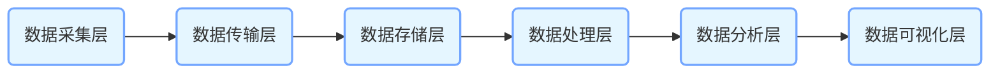

# 企业AI Agent的实时大数据分析平台

> 关键词：企业AI Agent、实时大数据分析、平台架构、数据处理、机器学习算法

> 摘要：本文围绕企业AI Agent的实时大数据分析平台展开深入探讨。首先介绍了该平台产生的背景，明确其目的、范围、预期读者等信息。接着详细阐述了核心概念与联系，包括平台的架构原理和相关流程。通过Python源代码对核心算法原理及具体操作步骤进行了详细阐述，并给出了数学模型和公式进行理论支撑。在项目实战部分，给出了开发环境搭建、源代码实现与解读。随后介绍了该平台的实际应用场景，推荐了相关的学习资源、开发工具框架和论文著作。最后总结了未来发展趋势与挑战，提供了常见问题与解答及扩展阅读和参考资料，旨在为企业构建和应用实时大数据分析平台提供全面且深入的技术指导。

## 1. 背景介绍 
### 1.1 目的和范围
在当今数字化时代，企业面临着海量的数据，这些数据蕴含着巨大的商业价值。企业AI Agent的实时大数据分析平台的目的在于帮助企业实时处理和分析这些数据，从中提取有价值的信息和洞察，以支持企业的决策制定、业务优化和创新发展。

该平台的范围涵盖了数据的采集、传输、存储、处理、分析和可视化等各个环节。它可以处理多种类型的数据，包括结构化数据（如数据库中的表格数据）、半结构化数据（如XML、JSON格式的数据）和非结构化数据（如文本、图像、音频等）。同时，平台支持多种数据源，如企业内部的业务系统、传感器网络、社交媒体平台等。

### 1.2 预期读者
本文的预期读者包括企业的技术管理人员、数据分析师、软件开发工程师、人工智能研究人员等。对于技术管理人员，本文可以帮助他们了解实时大数据分析平台的整体架构和技术原理，以便更好地规划和决策企业的数字化转型战略。数据分析师可以从本文中学习到如何利用该平台进行高效的数据处理和分析，挖掘数据中的潜在价值。软件开发工程师可以参考本文的技术细节，进行平台的开发和优化。人工智能研究人员可以从中获取相关的算法和模型应用案例，推动人工智能技术在企业中的应用。

### 1.3 文档结构概述
本文将按照以下结构进行组织：首先介绍企业AI Agent的实时大数据分析平台的背景信息，包括目的、范围、预期读者和文档结构概述。接着详细阐述核心概念与联系，包括平台的架构原理和相关流程。然后通过Python源代码对核心算法原理及具体操作步骤进行详细讲解，并给出数学模型和公式进行理论支撑。在项目实战部分，将介绍开发环境搭建、源代码实现与解读。随后介绍该平台的实际应用场景，推荐相关的学习资源、开发工具框架和论文著作。最后总结未来发展趋势与挑战，提供常见问题与解答及扩展阅读和参考资料。

### 1.4 术语表
#### 1.4.1 核心术语定义
- **企业AI Agent**：指在企业环境中运行的人工智能代理，它可以自主地执行特定的任务，如数据采集、分析、决策等，通过与环境和其他系统的交互，实现企业的智能化运营。
- **实时大数据分析**：指对海量的、快速产生的数据进行即时处理和分析，以获取实时的信息和洞察，帮助企业及时做出决策。
- **数据采集**：指从各种数据源中收集数据的过程，包括企业内部的业务系统、传感器网络、社交媒体平台等。
- **数据处理**：指对采集到的数据进行清洗、转换、整合等操作，以提高数据的质量和可用性。
- **数据分析**：指运用各种数据分析方法和技术，如统计分析、机器学习、深度学习等，从数据中提取有价值的信息和知识。
- **数据可视化**：指将分析结果以直观的图表、图形等形式展示出来，以便用户更好地理解和决策。

#### 1.4.2 相关概念解释
- **流式数据处理**：一种实时处理数据的方式，数据以连续的流形式到达，系统对数据进行即时处理，而不需要等待所有数据都收集完毕。
- **分布式计算**：将计算任务分配到多个计算节点上进行并行处理，以提高计算效率和处理能力。
- **机器学习算法**：一类基于数据的算法，通过对数据的学习和训练，自动发现数据中的模式和规律，用于预测、分类、聚类等任务。

#### 1.4.3 缩略词列表
- **ETL**：Extract, Transform, Load（数据抽取、转换、加载）
- **HDFS**：Hadoop Distributed File System（Hadoop分布式文件系统）
- **Spark**：Apache Spark（一个快速通用的集群计算系统）
- **Kafka**：Apache Kafka（一个分布式流处理平台）
- **ML**：Machine Learning（机器学习）

## 2. 核心概念与联系 
企业AI Agent的实时大数据分析平台的核心概念包括数据采集、数据处理、数据分析和数据可视化等，这些概念之间相互关联，形成一个完整的数据分析流程。

### 核心概念原理和架构的文本示意图
该平台的架构主要包括以下几个层次：
1. **数据采集层**：负责从各种数据源中采集数据，包括企业内部的业务系统、传感器网络、社交媒体平台等。采集到的数据可以是结构化数据、半结构化数据或非结构化数据。
2. **数据传输层**：将采集到的数据传输到数据存储层，通常使用消息队列（如Kafka）来实现数据的异步传输，以提高系统的吞吐量和可靠性。
3. **数据存储层**：存储采集到的数据，通常使用分布式文件系统（如HDFS）和分布式数据库（如HBase）来实现数据的高效存储和管理。
4. **数据处理层**：对存储的数据进行清洗、转换、整合等操作，以提高数据的质量和可用性。可以使用分布式计算框架（如Spark）来实现数据的并行处理。
5. **数据分析层**：运用各种数据分析方法和技术，如统计分析、机器学习、深度学习等，从数据中提取有价值的信息和知识。可以使用机器学习库（如Scikit-learn、TensorFlow）来实现数据分析任务。
6. **数据可视化层**：将分析结果以直观的图表、图形等形式展示出来，以便用户更好地理解和决策。可以使用可视化工具（如Tableau、PowerBI）来实现数据的可视化。

### Mermaid流程图


## 3. 核心算法原理 & 具体操作步骤 
### 核心算法原理
在企业AI Agent的实时大数据分析平台中，常用的核心算法包括数据清洗算法、机器学习算法等。下面以数据清洗算法和简单的线性回归机器学习算法为例进行详细讲解。

#### 数据清洗算法
数据清洗的目的是去除数据中的噪声、缺失值和异常值，提高数据的质量和可用性。常见的数据清洗算法包括均值填充、中位数填充、删除缺失值等。以下是使用Python实现均值填充缺失值的代码示例：
```python
import pandas as pd
import numpy as np

# 生成包含缺失值的示例数据
data = {'col1': [1, 2, np.nan, 4, 5],
        'col2': [6, np.nan, 8, 9, 10]}
df = pd.DataFrame(data)

# 计算每列的均值
means = df.mean()

# 使用均值填充缺失值
df_filled = df.fillna(means)

print(df_filled)
```
#### 线性回归机器学习算法
线性回归是一种常用的机器学习算法，用于预测连续值的目标变量。其基本原理是通过找到一条最佳的直线（或超平面）来拟合数据，使得数据点到该直线（或超平面）的距离最小。以下是使用Python实现简单线性回归的代码示例：
```python
import numpy as np
from sklearn.linear_model import LinearRegression
from sklearn.model_selection import train_test_split
from sklearn.metrics import mean_squared_error

# 生成示例数据
X = np.array([1, 2, 3, 4, 5]).reshape(-1, 1)
y = np.array([2, 4, 6, 8, 10])

# 划分训练集和测试集
X_train, X_test, y_train, y_test = train_test_split(X, y, test_size=0.2, random_state=42)

# 创建线性回归模型
model = LinearRegression()

# 训练模型
model.fit(X_train, y_train)

# 进行预测
y_pred = model.predict(X_test)

# 计算均方误差
mse = mean_squared_error(y_test, y_pred)
print(f"均方误差: {mse}")
```

### 具体操作步骤
1. **数据采集**：使用合适的工具和技术从各种数据源中采集数据，如使用Python的`requests`库从网络接口采集数据，使用传感器驱动程序从传感器网络采集数据等。
2. **数据传输**：将采集到的数据发送到消息队列（如Kafka）中，确保数据的异步传输和可靠存储。
3. **数据存储**：从消息队列中读取数据，并将其存储到分布式文件系统（如HDFS）或分布式数据库（如HBase）中。
4. **数据处理**：从存储系统中读取数据，使用分布式计算框架（如Spark）对数据进行清洗、转换、整合等操作。
5. **数据分析**：使用机器学习库（如Scikit-learn、TensorFlow）对处理后的数据进行分析，选择合适的算法进行训练和预测。
6. **数据可视化**：使用可视化工具（如Tableau、PowerBI）将分析结果以直观的图表、图形等形式展示出来。

## 4. 数学模型和公式 & 详细讲解 & 举例说明 
### 数据清洗的数学模型
在数据清洗中，均值填充是一种常用的方法。假设我们有一个数据集 $X = \{x_1, x_2, \cdots, x_n\}$，其中部分数据存在缺失值。我们可以计算该数据集的均值 $\bar{x}$ 作为填充值。均值的计算公式为：
$$\bar{x} = \frac{1}{n} \sum_{i=1}^{n} x_i$$
例如，对于数据集 $X = \{1, 2, 3, \text{NaN}, 5\}$，我们先去除缺失值，得到 $X' = \{1, 2, 3, 5\}$，然后计算均值：
$$\bar{x} = \frac{1 + 2 + 3 + 5}{4} = 2.75$$
使用该均值填充缺失值，得到填充后的数据集。

### 线性回归的数学模型
线性回归的数学模型可以表示为：
$$y = \theta_0 + \theta_1 x_1 + \theta_2 x_2 + \cdots + \theta_n x_n + \epsilon$$
其中，$y$ 是目标变量，$x_1, x_2, \cdots, x_n$ 是特征变量，$\theta_0, \theta_1, \cdots, \theta_n$ 是模型的参数，$\epsilon$ 是误差项。

在简单线性回归中，只有一个特征变量，模型可以简化为：
$$y = \theta_0 + \theta_1 x + \epsilon$$
我们的目标是找到最优的参数 $\theta_0$ 和 $\theta_1$，使得误差项 $\epsilon$ 的平方和最小。误差项的平方和可以表示为：
$$J(\theta_0, \theta_1) = \frac{1}{2m} \sum_{i=1}^{m} (y^{(i)} - (\theta_0 + \theta_1 x^{(i)}))^2$$
其中，$m$ 是样本数量，$y^{(i)}$ 和 $x^{(i)}$ 分别是第 $i$ 个样本的目标变量和特征变量。

我们可以使用梯度下降算法来求解最优的参数 $\theta_0$ 和 $\theta_1$。梯度下降算法的更新公式为：
$$\theta_j := \theta_j - \alpha \frac{\partial J(\theta_0, \theta_1)}{\partial \theta_j}$$
其中，$\alpha$ 是学习率，$\frac{\partial J(\theta_0, \theta_1)}{\partial \theta_j}$ 是 $J(\theta_0, \theta_1)$ 关于 $\theta_j$ 的偏导数。

例如，对于数据集 $X = \{1, 2, 3, 4, 5\}$ 和 $y = \{2, 4, 6, 8, 10\}$，我们可以使用线性回归模型进行拟合。通过求解最优的参数 $\theta_0$ 和 $\theta_1$，得到拟合直线 $y = \theta_0 + \theta_1 x$，该直线可以用于预测新的样本。

## 5. 项目实战：代码实际案例和详细解释说明 
### 5.1  开发环境搭建
#### 硬件环境
- 服务器：建议使用多核处理器、大容量内存和高速磁盘的服务器，以满足大数据处理和分析的需求。
- 集群：如果需要处理大规模数据，可以搭建分布式集群，如Hadoop集群、Spark集群等。

#### 软件环境
- 操作系统：建议使用Linux操作系统，如Ubuntu、CentOS等。
- 编程语言：Python是一种常用的编程语言，具有丰富的数据分析和机器学习库，如Pandas、Scikit-learn、TensorFlow等。
- 大数据框架：安装Hadoop、Spark、Kafka等大数据框架，用于数据存储、处理和传输。
- 数据库：安装HBase、MySQL等数据库，用于数据的存储和管理。
- 可视化工具：安装Tableau、PowerBI等可视化工具，用于数据的可视化展示。

### 5.2  源代码详细实现和代码解读
以下是一个简单的企业AI Agent的实时大数据分析平台的代码示例，包括数据采集、数据处理、数据分析和数据可视化等环节。

#### 数据采集
```python
import requests
import json

# 从网络接口采集数据
url = 'https://example.com/api/data'
response = requests.get(url)
data = json.loads(response.text)

# 打印采集到的数据
print(data)
```
**代码解读**：该代码使用`requests`库从网络接口采集数据，并将数据解析为JSON格式。

#### 数据处理
```python
import pandas as pd

# 将采集到的数据转换为DataFrame
df = pd.DataFrame(data)

# 数据清洗：删除缺失值
df_cleaned = df.dropna()

# 数据转换：将某列数据转换为数值类型
df_cleaned['column_name'] = pd.to_numeric(df_cleaned['column_name'])

# 打印处理后的数据
print(df_cleaned)
```
**代码解读**：该代码使用`pandas`库将采集到的数据转换为DataFrame，并进行数据清洗和转换操作。

#### 数据分析
```python
from sklearn.linear_model import LinearRegression
from sklearn.model_selection import train_test_split
from sklearn.metrics import mean_squared_error

# 准备特征和目标变量
X = df_cleaned[['feature1', 'feature2']]
y = df_cleaned['target']

# 划分训练集和测试集
X_train, X_test, y_train, y_test = train_test_split(X, y, test_size=0.2, random_state=42)

# 创建线性回归模型
model = LinearRegression()

# 训练模型
model.fit(X_train, y_train)

# 进行预测
y_pred = model.predict(X_test)

# 计算均方误差
mse = mean_squared_error(y_test, y_pred)
print(f"均方误差: {mse}")
```
**代码解读**：该代码使用`scikit-learn`库进行线性回归分析，包括数据准备、模型训练、预测和评估等步骤。

#### 数据可视化
```python
import matplotlib.pyplot as plt

# 绘制真实值和预测值的散点图
plt.scatter(y_test, y_pred)
plt.xlabel('真实值')
plt.ylabel('预测值')
plt.title('真实值 vs 预测值')
plt.show()
```
**代码解读**：该代码使用`matplotlib`库绘制真实值和预测值的散点图，直观展示模型的预测效果。

### 5.3  代码解读与分析
- **数据采集**：通过`requests`库从网络接口采集数据，这种方式简单方便，但需要注意网络请求的稳定性和数据的格式。
- **数据处理**：使用`pandas`库进行数据清洗和转换，如删除缺失值、转换数据类型等，提高数据的质量和可用性。
- **数据分析**：使用`scikit-learn`库进行线性回归分析，通过划分训练集和测试集、训练模型、预测和评估等步骤，得到模型的性能指标。
- **数据可视化**：使用`matplotlib`库绘制散点图，直观展示模型的预测效果，帮助用户更好地理解分析结果。

## 6. 实际应用场景 
企业AI Agent的实时大数据分析平台在多个领域都有广泛的应用，以下是一些常见的应用场景：
### 金融领域
- **风险评估**：实时分析客户的信用数据、交易数据等，评估客户的信用风险，帮助金融机构做出合理的信贷决策。
- **市场预测**：分析金融市场的实时数据，如股票价格、汇率等，预测市场趋势，为投资者提供决策支持。
- **欺诈检测**：实时监测交易数据，识别异常交易行为，及时发现欺诈活动，保障金融机构的资金安全。

### 医疗领域
- **疾病