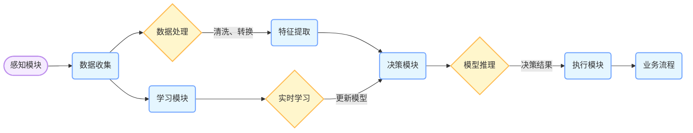

# 企业AI Agent的实时学习能力：持续优化业务流程

> 关键词：企业AI Agent、实时学习能力、业务流程优化、机器学习、数据驱动决策

> 摘要：本文聚焦于企业AI Agent的实时学习能力及其在持续优化业务流程方面的重要作用。首先介绍了相关背景知识，包括目的范围、预期读者等。接着深入探讨了企业AI Agent、实时学习能力等核心概念及其联系，并给出了相应的文本示意图和Mermaid流程图。详细阐述了核心算法原理，结合Python源代码进行说明，同时给出了相关数学模型和公式，并举例解释。通过项目实战展示了如何利用企业AI Agent的实时学习能力优化业务流程，包括开发环境搭建、源代码实现与解读。分析了实际应用场景，推荐了学习资源、开发工具框架以及相关论文著作。最后总结了未来发展趋势与挑战，提供了常见问题解答和扩展阅读参考资料，旨在为企业更好地应用AI Agent优化业务流程提供全面的技术指导。

## 1. 背景介绍 
### 1.1 目的和范围
在当今数字化快速发展的时代，企业面临着日益激烈的市场竞争和不断变化的业务环境。为了保持竞争力并实现可持续发展，企业需要不断优化业务流程，提高运营效率和决策质量。企业AI Agent作为一种智能化的工具，具备实时学习能力，能够根据不断变化的数据和业务场景动态调整自身的行为和策略，从而为企业提供更加精准、高效的支持。

本文的目的在于深入探讨企业AI Agent的实时学习能力，以及如何利用这种能力持续优化企业的业务流程。我们将涵盖从核心概念、算法原理到实际应用案例的各个方面，旨在为企业管理者、技术人员和相关研究者提供全面的技术知识和实践指导。

### 1.2 预期读者
本文的预期读者包括以下几类人群：
- **企业管理者**：希望了解如何利用AI Agent的实时学习能力提升企业的业务绩效和竞争力，优化业务流程和决策机制。
- **技术人员**：包括AI工程师、数据科学家、软件开发人员等，对企业AI Agent的技术实现、算法原理和开发实践感兴趣，希望深入学习和应用相关技术。
- **研究者**：从事人工智能、机器学习、企业管理等领域的研究工作，关注企业AI Agent在业务流程优化方面的最新研究成果和发展趋势。

### 1.3 文档结构概述
本文的结构如下：
- **核心概念与联系**：介绍企业AI Agent、实时学习能力等核心概念，分析它们之间的联系，并给出相应的文本示意图和Mermaid流程图。
- **核心算法原理 & 具体操作步骤**：详细阐述企业AI Agent实时学习所涉及的核心算法原理，结合Python源代码说明具体操作步骤。
- **数学模型和公式 & 详细讲解 & 举例说明**：给出相关的数学模型和公式，进行详细讲解，并通过实际例子进行说明。
- **项目实战：代码实际案例和详细解释说明**：通过一个实际项目案例，展示如何搭建开发环境、实现源代码，并对代码进行解读和分析。
- **实际应用场景**：分析企业AI Agent的实时学习能力在不同业务场景中的应用。
- **工具和资源推荐**：推荐学习资源、开发工具框架以及相关论文著作。
- **总结：未来发展趋势与挑战**：总结企业AI Agent实时学习能力的未来发展趋势和面临的挑战。
- **附录：常见问题与解答**：提供常见问题的解答。
- **扩展阅读 & 参考资料**：列出扩展阅读的相关资料和参考来源。

### 1.4 术语表
#### 1.4.1 核心术语定义
- **企业AI Agent**：一种智能化的软件实体，能够在企业环境中感知业务信息、进行推理和决策，并采取相应的行动来实现企业的目标。它可以集成多种人工智能技术，如机器学习、自然语言处理等。
- **实时学习能力**：指AI Agent能够在不断接收新数据的过程中，实时更新自身的知识和模型，以适应不断变化的业务环境和需求。
- **业务流程优化**：通过对企业现有业务流程进行分析、改进和重新设计，以提高流程的效率、质量和灵活性，降低成本，增强企业的竞争力。

#### 1.4.2 相关概念解释
- **机器学习**：一门多领域交叉学科，涉及概率论、统计学、逼近论、凸分析、算法复杂度理论等多门学科。它专门研究计算机怎样模拟或实现人类的学习行为，以获取新的知识或技能，重新组织已有的知识结构使之不断改善自身的性能。
- **强化学习**：一种机器学习范式，智能体通过与环境进行交互，根据环境反馈的奖励信号来学习最优的行为策略，以最大化长期累积奖励。

#### 1.4.3 缩略词列表
- **AI**：Artificial Intelligence，人工智能
- **ML**：Machine Learning，机器学习
- **RL**：Reinforcement Learning，强化学习

## 2. 核心概念与联系 
### 核心概念原理
#### 企业AI Agent
企业AI Agent是企业业务流程中的智能参与者，它可以看作是一个具有自主决策和行动能力的软件程序。其原理基于人工智能技术，通过感知企业内外的各种数据和信息，运用机器学习、深度学习等算法进行分析和推理，然后根据预设的目标和规则做出决策，并采取相应的行动来影响业务流程。

例如，在一个电商企业中，AI Agent可以实时监测商品的销售数据、用户的浏览行为和市场动态等信息，根据这些信息预测商品的需求趋势，自动调整商品的库存管理和营销策略。

#### 实时学习能力
实时学习能力是企业AI Agent的关键特性之一。它允许Agent在不断接收新数据的过程中，及时更新自身的知识和模型，而不需要等到大量数据积累后再进行批量学习。实时学习的原理通常基于在线学习算法，如随机梯度下降（SGD）等。这些算法可以在每次接收到新数据时，快速调整模型的参数，使模型能够适应数据的动态变化。

例如，在金融交易领域，AI Agent可以实时分析市场行情数据，根据最新的价格波动和交易信息，不断调整交易策略，以获取最大的收益。

### 架构的文本示意图
企业AI Agent的实时学习架构可以描述如下：

企业AI Agent由感知模块、决策模块、学习模块和执行模块组成。感知模块负责收集企业业务流程中的各种数据，如销售数据、客户反馈、市场信息等。这些数据被发送到决策模块，决策模块运用机器学习模型和规则进行分析和推理，做出相应的决策。同时，学习模块对新接收到的数据进行实时学习，更新决策模块中的模型参数。最后，执行模块根据决策结果采取具体的行动，影响业务流程。

### Mermaid流程图


## 3. 核心算法原理 & 具体操作步骤 
### 核心算法原理
企业AI Agent的实时学习通常涉及多种机器学习算法，其中随机梯度下降（SGD）是一种常用的在线学习算法。下面我们详细介绍SGD的原理。

假设我们有一个损失函数 $L(\theta)$，其中 $\theta$ 是模型的参数。我们的目标是找到一组参数 $\theta$ 使得损失函数 $L(\theta)$ 最小化。SGD的基本思想是每次从训练数据中随机选取一个样本 $(x_i, y_i)$，计算该样本对应的损失函数的梯度 $\nabla L(\theta; x_i, y_i)$，然后根据梯度的反方向更新模型的参数：

$$\theta_{t+1} = \theta_t - \eta \nabla L(\theta_t; x_i, y_i)$$

其中，$\theta_t$ 是第 $t$ 次迭代时的参数，$\eta$ 是学习率，它控制了每次参数更新的步长。

### 具体操作步骤
下面是使用Python实现SGD算法的具体步骤：

```python
import numpy as np

# 定义损失函数
def loss_function(theta, x, y):
    # 这里以线性回归的均方误差损失函数为例
    y_pred = np.dot(x, theta)
    return np.mean((y_pred - y) ** 2)

# 定义损失函数的梯度
def gradient(theta, x, y):
    # 线性回归损失函数的梯度
    y_pred = np.dot(x, theta)
    return 2 * np.dot(x.T, (y_pred - y)) / len(x)

# 实现SGD算法
def sgd(X, y, theta_init, learning_rate, num_iterations):
    theta = theta_init.copy()
    num_samples = len(X)
    for iteration in range(num_iterations):
        # 随机选择一个样本
        random_index = np.random.randint(num_samples)
        x_i = X[random_index:random_index+1]
        y_i = y[random_index:random_index+1]
        # 计算梯度
        grad = gradient(theta, x_i, y_i)
        # 更新参数
        theta = theta - learning_rate * grad
        # 打印当前损失
        if iteration % 100 == 0:
            loss = loss_function(theta, X, y)
            print(f'Iteration {iteration}: Loss = {loss}')
    return theta

# 生成一些示例数据
np.random.seed(42)
X = 2 * np.random.rand(100, 1)
y = 4 + 3 * X + np.random.randn(100, 1)

# 初始化参数
theta_init = np.random.randn(1, 1)

# 设置学习率和迭代次数
learning_rate = 0.1
num_iterations = 1000

# 运行SGD算法
theta_final = sgd(X, y, theta_init, learning_rate, num_iterations)
print(f'Final theta: {theta_final}')
```

### 代码解释
1. **损失函数 `loss_function`**：计算线性回归的均方误差损失函数。
2. **梯度函数 `gradient`**：计算损失函数的梯度。
3. **SGD算法 `sgd`**：实现了随机梯度下降算法的核心逻辑。在每次迭代中，随机选择一个样本，计算该样本的梯度，并更新模型的参数。
4. **示例数据生成**：生成一些随机数据作为训练样本。
5. **参数初始化**：初始化模型的参数。
6. **运行SGD算法**：调用 `sgd` 函数进行训练，并打印最终的参数值。

## 4. 数学模型和公式 & 详细讲解 & 举例说明 
### 数学模型和公式
#### 线性回归模型
线性回归是一种常见的机器学习模型，用于预测连续值的输出。其数学模型可以表示为：

$$y = \theta_0 + \theta_1 x_1 + \theta_2 x_2 + \cdots + \theta_n x_n + \epsilon$$

其中，$y$ 是输出变量，$x_1, x_2, \cdots, x_n$ 是输入变量，$\theta_0, \theta_1, \cdots, \theta_n$ 是模型的参数，$\epsilon$ 是误差项。

我们可以将其表示为矩阵形式：

$$y = X\theta + \epsilon$$

其中，$X$ 是输入矩阵，$\theta$ 是参数向量。

#### 均方误差损失函数
均方误差（MSE）是线性回归中常用的损失函数，用于衡量模型预测值与真实值之间的误差。其公式为：

$$L(\theta) = \frac{1}{m} \sum_{i=1}^{m} (y^{(i)} - \hat{y}^{(i)})^2$$

其中，$m$ 是样本数量，$y^{(i)}$ 是第 $i$ 个样本的真实值，$\hat{y}^{(i)}$ 是第 $i$ 个样本的预测值。

#### 梯度公式
为了使用SGD算法更新模型的参数，我们需要计算损失函数的梯度。对于线性回归的均方误差损失函数，其梯度公式为：

$$\nabla L(\theta) = \frac{2}{m} X^T (X\theta - y)$$

### 详细讲解
线性回归模型通过拟合输入变量和输出变量之间的线性关系来进行预测。均方误差损失函数衡量了模型预测值与真实值之间的平均平方误差，我们的目标是找到一组参数 $\theta$ 使得损失函数最小化。

SGD算法通过随机选择一个样本，计算该样本对应的损失函数的梯度，并根据梯度的反方向更新模型的参数。这样可以在每次迭代中快速调整模型，使其逐渐收敛到最优解。

### 举例说明
假设我们有以下数据集：

| $x$ | $y$ |
| --- | --- |
| 1   | 3   |
| 2   | 5   |
| 3   | 7   |

我们使用线性回归模型 $y = \theta_0 + \theta_1 x$ 来拟合这些数据。

首先，我们将数据集表示为矩阵形式：

$$X = \begin{bmatrix} 1 & 1 \\ 1 & 2 \\ 1 & 3 \end{bmatrix}, y = \begin{bmatrix} 3 \\ 5 \\ 7 \end{bmatrix}$$

假设初始参数 $\theta = \begin{bmatrix} 0 \\ 0 \end{bmatrix}$，学习率 $\eta = 0.1$。

第一次迭代：
随机选择一个样本，假设选择 $(x_1, y_1) = (1, 3)$。

计算预测值 $\hat{y}_1 = \theta_0 + \theta_1 x_1 = 0 + 0 \times 1 = 0$。

计算损失函数 $L(\theta) = (y_1 - \hat{y}_1)^2 = (3 - 0)^2 = 9$。

计算梯度 $\nabla L(\theta; x_1, y_1) = \begin{bmatrix} -2(y_1 - \hat{y}_1) \\ -2x_1(y_1 - \hat{y}_1) \end{bmatrix} = \begin{bmatrix} -6 \\ -6 \end{bmatrix}$。

更新参数 $\theta_{new} = \theta - \eta \nabla L(\theta; x_1, y_1) = \begin{bmatrix} 0 \\ 0 \end{bmatrix} - 0.1 \begin{bmatrix} -6 \\ -6 \end{bmatrix} = \begin{bmatrix} 0.6 \\ 0.6 \end{bmatrix}$。

通过多次迭代，模型的参数会逐渐收敛到最优解。

## 5. 项目实战：代码实际案例和详细解释说明 
### 5.1  开发环境搭建
#### 操作系统
建议使用Linux系统，如Ubuntu 20.04，因为Linux系统在开发和部署机器学习项目方面具有良好的稳定性和兼容性。

#### 编程语言和版本
使用Python 3.8及以上版本，Python是机器学习领域最常用的编程语言，拥有丰富的库和工具。

#### 安装必要的库
使用以下命令安装必要的Python库：

```bash
pip install numpy pandas scikit-learn matplotlib
```

- **numpy**：用于进行数值计算和数组操作。
- **pandas**：用于数据处理和分析。
- **scikit-learn**：提供了丰富的机器学习算法和工具。
- **matplotlib**：用于数据可视化。

### 5.2  源代码详细实现和代码解读
#### 项目背景
我们将实现一个简单的企业销售预测系统，使用企业AI Agent的实时学习能力来持续优化预测模型。

#### 数据准备
假设我们有一个销售数据集，包含日期、产品名称、销售量等信息。我们可以使用pandas库来读取和处理数据。

```python
import pandas as pd

# 读取数据
data = pd.read_csv('sales_data.csv')

# 数据预处理
# 假设日期列名为 'date'，销售量列名为 'sales'
data['date'] = pd.to_datetime(data['date'])
data.set_index('date', inplace=True)

# 划分训练集和测试集
train_size = int(len(data) * 0.8)
train_data = data[:train_size]
test_data = data[train_size:]
```

#### 模型训练
我们使用线性回归模型进行销售预测，并使用SGD算法进行实时学习。

```python
from sklearn.linear_model import SGDRegressor
import numpy as np

# 特征提取
X_train = np.array(train_data.index.astype(np.int64) // 10**9).reshape(-1, 1)
y_train = train_data['sales'].values

# 初始化模型
model = SGDRegressor(learning_rate='constant', eta0=0.01)

# 训练模型
model.fit(X_train, y_train)
```

#### 实时学习
在实际应用中，我们可以不断接收新的销售数据，并使用SGD算法实时更新模型。

```python
# 模拟实时接收新数据
new_data = pd.read_csv('new_sales_data.csv')
new_data['date'] = pd.to_datetime(new_data['date'])
new_data.set_index('date', inplace=True)

X_new = np.array(new_data.index.astype(np.int64) // 10**9).reshape(-1, 1)
y_new = new_data['sales'].values

# 实时学习
model.partial_fit(X_new, y_new)
```

#### 预测和评估
使用更新后的模型进行预测，并评估模型的性能。

```python
X_test = np.array(test_data.index.astype(np.int64) // 10**9).reshape(-1, 1)
y_test = test_data['sales'].values

y_pred = model.predict(X_test)

from sklearn.metrics import mean_squared_error

mse = mean_squared_error(y_test, y_pred)
print(f'Mean Squared Error: {mse}')
```

### 5.3  代码解读与分析
#### 数据准备部分
- 使用pandas库读取销售数据，并将日期列转换为日期时间类型。
- 将日期列设置为索引，方便后续的数据处理和分析。
- 划分训练集和测试集，用于模型的训练和评估。

#### 模型训练部分
- 使用 `SGDRegressor` 初始化线性回归模型，并设置学习率。
- 提取训练集的特征和标签，使用 `fit` 方法训练模型。

#### 实时学习部分
- 模拟实时接收新的销售数据，并进行特征提取。
- 使用 `partial_fit` 方法对新数据进行实时学习，更新模型的参数。

#### 预测和评估部分
- 提取测试集的特征，使用更新后的模型进行预测。
- 使用均方误差（MSE）评估模型的性能。

## 6. 实际应用场景 
### 客户服务
企业AI Agent可以实时学习客户的问题和反馈，不断优化自己的回答策略。例如，在在线客服系统中，AI Agent可以根据客户的提问实时调整回答内容，提供更加准确和个性化的服务。同时，它可以学习客户的偏好和历史记录，为客户推荐相关的产品和服务。

### 供应链管理
在供应链管理中，AI Agent可以实时监测库存水平、物流运输状态和供应商信息等。根据实时数据，它可以自动调整采购计划、优化物流路线，以降低成本和提高供应链的效率。例如，当库存水平低于一定阈值时，AI Agent可以自动触发采购订单，并根据供应商的交货时间和价格选择最优的供应商。

### 市场营销
AI Agent可以实时分析市场数据、客户行为和竞争对手信息，制定实时的营销策略。例如，它可以根据客户的实时浏览行为和购买历史，推送个性化的广告和促销活动。同时，它可以实时监测营销活动的效果，根据反馈调整活动策略，提高营销转化率。

### 金融风险管理
在金融领域，AI Agent可以实时监测市场风险、信用风险和操作风险等。它可以学习市场的动态变化，实时调整投资组合和风险管理策略。例如，当市场出现异常波动时，AI Agent可以自动减少风险暴露，保护投资者的资产安全。

## 7. 工具和资源推荐
### 7.1 学习资源推荐
#### 7.1.1 书籍推荐
- 《机器学习》（周志华）：全面介绍了机器学习的基本概念、算法和应用，是机器学习领域的经典教材。
- 《深度学习》（Ian Goodfellow、Yoshua Bengio、Aaron Courville）：深入讲解了深度学习的原理、模型和算法，适合有一定机器学习基础的读者。
- 《Python机器学习实战》（Sebastian Raschka）：通过实际案例介绍了如何使用Python实现机器学习算法，具有很强的实践性。

#### 7.1.2 在线课程
- Coursera上的“机器学习”课程（Andrew Ng）：由机器学习领域的知名专家Andrew Ng授课，内容全面、深入浅出，是学习机器学习的经典课程。
- edX上的“深度学习”课程（MIT）：由麻省理工学院开设，系统介绍了深度学习的理论和实践。
- 吴恩达的“人工智能专项课程”：涵盖了人工智能的多个领域，包括机器学习、深度学习、自然语言处理等。

#### 7.1.3 技术博客和网站
- Medium：有许多机器学习和人工智能领域的优秀博客文章，涵盖了最新的研究成果和实践经验。
- Towards Data Science：专注于数据科学和机器学习领域，提供了大量的技术文章和案例分析。
- Kaggle：一个数据科学竞赛平台，上面有许多优秀的开源代码和数据科学项目，可以学习到其他开发者的经验和技巧。

### 7.2 开发工具框架推荐
#### 7.2.1 IDE和编辑器
- PyCharm：一款专业的Python集成开发环境，具有代码编辑、调试、自动完成等功能，适合开发大型的Python项目。
- Jupyter Notebook：一个交互式的开发环境，支持Python、R等多种编程语言，适合进行数据分析和机器学习实验。
- Visual Studio Code：一款轻量级的代码编辑器，具有丰富的插件和扩展功能，支持多种编程语言。

#### 7.2.2 调试和性能分析工具
- TensorBoard：TensorFlow的可视化工具，可以用于可视化训练过程、模型结构和性能指标等。
- Py-Spy：一个Python性能分析工具，可以分析Python程序的CPU使用情况和函数调用时间。
- cProfile：Python标准库中的性能分析模块，可以统计函数调用次数和执行时间。

#### 7.2.3 相关框架和库
- TensorFlow：一个开源的机器学习框架，由Google开发，支持深度学习、强化学习等多种机器学习算法。
- PyTorch：另一个流行的深度学习框架，具有动态图机制，易于使用和调试。
- Scikit-learn：一个简单易用的机器学习库，提供了丰富的机器学习算法和工具，适合初学者和快速开发。

### 7.3 相关论文著作推荐
#### 7.3.1 经典论文
- “Gradient-based learning applied to document recognition”（Yann LeCun、Léon Bottou、Yoshua Bengio、Patrick Haffner）：介绍了卷积神经网络（CNN）在手写数字识别中的应用，是深度学习领域的经典论文。
- “Playing Atari with Deep Reinforcement Learning”（Volodymyr Mnih、Koray Kavukcuoglu、David Silver等）：首次提出了使用深度强化学习玩Atari游戏的方法，开创了深度强化学习的先河。
- “Attention Is All You Need”（Ashish Vaswani、Noam Shazeer、Niki Parmar等）：提出了Transformer模型，是自然语言处理领域的重要突破。

#### 7.3.2 最新研究成果
- 可以关注顶级学术会议如NeurIPS、ICML、CVPR等的论文，了解机器学习和人工智能领域的最新研究成果。
- 一些知名的研究机构如OpenAI、DeepMind等也会发布一些前沿的研究论文和技术报告。

#### 7.3.3 应用案例分析
- 可以参考一些企业的技术博客和案例分享，了解企业AI Agent在实际业务中的应用案例和经验教训。例如，Google、Microsoft等公司的技术博客经常会分享一些人工智能应用的案例。

## 8. 总结：未来发展趋势与挑战
### 未来发展趋势
#### 更强大的实时学习能力
随着技术的不断进步，企业AI Agent的实时学习能力将不断增强。它将能够处理更复杂的数据类型和更高维度的数据，实时学习的速度和准确性也将得到进一步提高。例如，在处理视频、音频等多媒体数据时，AI Agent可以实时提取特征并更新模型，以适应不断变化的场景。

#### 与物联网的深度融合
物联网的发展将产生大量的实时数据，企业AI Agent可以与物联网设备深度融合，实时获取和分析这些数据，实现对物理世界的智能控制和管理。例如，在工业生产中，AI Agent可以实时监测设备的运行状态，预测设备故障，并及时采取维护措施，提高生产效率和设备可靠性。

#### 多Agent协同工作
未来，企业中可能会存在多个AI Agent协同工作的情况。这些Agent可以根据不同的任务和职责进行分工合作，共同完成企业的业务目标。例如，在供应链管理中，采购Agent、物流Agent和库存管理Agent可以相互协作，实现供应链的优化和协同运作。

#### 与人类的更紧密协作
企业AI Agent将与人类员工更加紧密地协作，成为人类的智能助手。它可以帮助人类员工处理繁琐的任务，提供决策支持，提高工作效率和质量。例如，在财务分析中，AI Agent可以快速分析大量的财务数据，为财务人员提供风险评估和决策建议。

### 挑战
#### 数据质量和安全问题
实时学习需要大量的高质量数据，但实际应用中数据可能存在噪声、缺失值等问题，影响模型的性能。同时，数据的安全和隐私也是一个重要的挑战，企业需要采取有效的措施保护数据的安全和隐私，防止数据泄露和滥用。

#### 模型可解释性
随着AI Agent的模型越来越复杂，模型的可解释性成为一个重要的问题。在企业决策中，需要了解模型的决策依据和推理过程，以便做出合理的决策。因此，如何提高模型的可解释性是未来需要解决的一个关键问题。

#### 计算资源和成本
实时学习需要大量的计算资源，特别是在处理大规模数据和复杂模型时。企业需要投入大量的硬件设备和计算资源，这会增加企业的成本。因此，如何优化计算资源的使用，降低成本是一个挑战。

#### 伦理和法律问题
AI Agent的应用可能会带来一些伦理和法律问题，如算法歧视、责任归属等。企业需要建立相应的伦理和法律框架，规范AI Agent的使用，确保其符合社会的价值观和法律法规。

## 9. 附录：常见问题与解答
### 问题1：企业AI Agent的实时学习能力对数据有什么要求？
答：企业AI Agent的实时学习能力需要高质量的数据。数据应该具有准确性、完整性和及时性。数据中的噪声和缺失值会影响模型的性能，因此需要进行数据清洗和预处理。同时，实时学习需要及时获取新的数据，以便模型能够及时更新和适应变化。

### 问题2：如何评估企业AI Agent的实时学习效果？
答：可以使用一些指标来评估企业AI Agent的实时学习效果，如准确率、召回率、均方误差等。同时，可以通过对比模型在不同时间段的性能表现，观察模型是否能够随着新数据的输入不断优化。此外，还可以通过实际业务指标的变化，如销售额、客户满意度等，来评估AI Agent对业务流程的优化效果。

### 问题3：企业AI Agent的实时学习会受到网络延迟的影响吗？
答：网络延迟可能会对企业AI Agent的实时学习产生影响。如果数据传输延迟较大，可能会导致模型不能及时获取新的数据，从而影响实时学习的效果。为了减少网络延迟的影响，可以采用分布式计算、边缘计算等技术，将数据处理和模型更新的任务分布到离数据源更近的地方进行。

### 问题4：如何确保企业AI Agent的实时学习模型的稳定性？
答：可以采用一些方法来确保企业AI Agent的实时学习模型的稳定性。例如，使用正则化技术来防止模型过拟合，设置合适的学习率来控制模型的更新速度，对新数据进行质量检查和筛选，避免引入异常数据影响模型的稳定性。此外，还可以采用模型融合和集成的方法，综合多个模型的预测结果，提高模型的稳定性和可靠性。

## 10. 扩展阅读 & 参考资料
### 扩展阅读
- 《人工智能时代与人类未来》：探讨了人工智能对人类社会的影响和未来发展趋势。
- 《数据挖掘：概念与技术》：详细介绍了数据挖掘的基本概念、算法和应用。
- 《智能商业》：分析了人工智能在商业领域的应用和商业模式创新。

### 参考资料
- 《机器学习实战》（Peter Harrington）
- 《Python数据分析实战》（Francesco Mosconi、Aurélien Géron）
- 相关学术论文和技术报告，如NeurIPS、ICML、CVPR等会议的论文。

作者：AI天才研究院/AI Genius Institute & 禅与计算机程序设计艺术 /Zen And The Art of Computer Programming