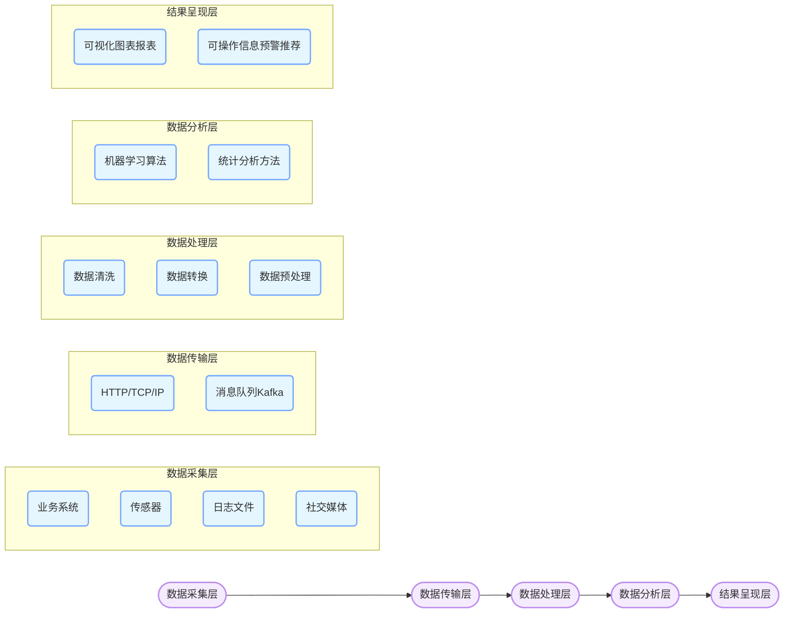

# 企业AI Agent的实时数据流处理与分析架构

> 关键词：企业AI Agent、实时数据流处理、分析架构、数据处理算法、应用场景

> 摘要：本文聚焦于企业AI Agent的实时数据流处理与分析架构。详细阐述了该架构的背景、核心概念、算法原理、数学模型等内容。通过项目实战案例，展示了如何搭建开发环境、实现源代码并进行解读分析。同时探讨了其实际应用场景，推荐了相关的学习资源、开发工具和论文著作。最后对未来发展趋势与挑战进行总结，并提供常见问题解答及扩展阅读参考资料，旨在为企业在实时数据流处理与分析方面提供全面且深入的技术指导。

## 1. 背景介绍 
### 1.1 目的和范围
在当今数字化时代，企业面临着海量的实时数据。这些数据蕴含着巨大的商业价值，如客户行为模式、市场趋势等。企业AI Agent的实时数据流处理与分析架构的目的在于帮助企业高效地处理和分析这些实时数据，以便及时做出决策，提升企业的竞争力。
本架构的范围涵盖了从数据的采集、传输、处理到分析的整个流程。包括对不同数据源（如传感器、日志文件、社交媒体等）的实时数据进行处理，运用各种算法和技术进行数据分析，并将分析结果以可视化或可操作的形式呈现给企业决策者。

### 1.2 预期读者
本文的预期读者主要包括企业的技术人员，如数据工程师、算法工程师、软件架构师等，他们需要了解实时数据流处理与分析的技术细节和架构设计。同时，企业的管理人员和业务决策者也可以通过本文了解该架构如何为企业带来价值，以及如何应用这些技术来支持企业的业务发展。

### 1.3 文档结构概述
本文将首先介绍核心概念与联系，包括企业AI Agent、实时数据流处理和分析架构的原理和架构示意图。接着详细讲解核心算法原理和具体操作步骤，通过Python源代码进行阐述。然后介绍数学模型和公式，并举例说明。在项目实战部分，将展示开发环境搭建、源代码实现和代码解读。之后探讨实际应用场景，推荐相关的工具和资源。最后总结未来发展趋势与挑战，提供常见问题解答和扩展阅读参考资料。

### 1.4 术语表
#### 1.4.1 核心术语定义
- **企业AI Agent**：是一种能够代表企业自主执行任务、与环境交互并做出决策的智能实体。它可以根据预设的规则和学习到的知识，对实时数据流进行处理和分析。
- **实时数据流处理**：指的是对连续不断产生的数据流进行即时处理，以获取有价值的信息。与批量处理不同，实时数据流处理要求在数据产生的瞬间就进行处理，以满足企业对及时性的需求。
- **分析架构**：是一套用于组织和管理数据处理和分析流程的框架，包括数据采集、传输、存储、处理和分析等环节，以及各个环节之间的交互和协调机制。

#### 1.4.2 相关概念解释
- **流式计算**：是一种处理实时数据流的计算模型，它可以对数据流进行连续的处理，而不需要等待整个数据集的完成。常见的流式计算框架有Apache Flink、Apache Kafka等。
- **机器学习**：是一种让计算机通过数据学习模式和规律的技术。在实时数据流处理与分析中，机器学习算法可以用于预测、分类、聚类等任务。
- **数据可视化**：是将数据分析结果以图形、图表等直观的方式呈现出来，以便用户更易于理解和决策。

#### 1.4.3 缩略词列表
- **ETL**：Extract, Transform, Load，即数据抽取、转换和加载，是数据处理的常见步骤。
- **API**：Application Programming Interface，应用程序编程接口，用于不同系统之间的交互和数据传输。
- **KPI**：Key Performance Indicator，关键绩效指标，用于衡量企业的业务表现。

## 2. 核心概念与联系 
### 核心概念原理
企业AI Agent的实时数据流处理与分析架构主要由数据采集层、数据传输层、数据处理层、数据分析层和结果呈现层组成。

#### 数据采集层
该层负责从各种数据源收集实时数据，数据源可以包括企业内部的业务系统、传感器、日志文件，以及外部的社交媒体、新闻网站等。数据采集的方式可以是实时采集，也可以是定时采集。

#### 数据传输层
将采集到的数据从数据源传输到数据处理层。在传输过程中，需要考虑数据的安全性、可靠性和传输效率。常见的传输协议有HTTP、TCP/IP等，也可以使用消息队列（如Kafka）来实现数据的异步传输。

#### 数据处理层
对传输过来的数据进行清洗、转换和预处理。清洗数据是指去除数据中的噪声、重复值和错误值；转换数据是指将数据转换为适合分析的格式；预处理是指对数据进行归一化、特征提取等操作。

#### 数据分析层
运用各种算法和技术对处理后的数据进行分析，如机器学习算法、统计分析方法等。分析的目的是发现数据中的模式、趋势和关联，为企业决策提供支持。

#### 结果呈现层
将分析结果以可视化或可操作的形式呈现给企业决策者。可视化的方式可以是图表、报表、地图等，可操作的形式可以是预警信息、推荐系统等。

### 架构的文本示意图
```plaintext
+---------------------+
| 数据采集层          |
| - 业务系统          |
| - 传感器            |
| - 日志文件          |
| - 社交媒体          |
+---------------------+
          |
          v
+---------------------+
| 数据传输层          |
| - HTTP/TCP/IP       |
| - 消息队列（Kafka） |
+---------------------+
          |
          v
+---------------------+
| 数据处理层          |
| - 数据清洗          |
| - 数据转换          |
| - 数据预处理        |
+---------------------+
          |
          v
+---------------------+
| 数据分析层          |
| - 机器学习算法      |
| - 统计分析方法      |
+---------------------+
          |
          v
+---------------------+
| 结果呈现层          |
| - 可视化（图表、报表）|
| - 可操作信息（预警、推荐）|
+---------------------+
```

### Mermaid 流程图


## 3. 核心算法原理 & 具体操作步骤 
### 核心算法原理
在企业AI Agent的实时数据流处理与分析架构中，常用的算法包括流式聚类算法、实时预测算法和异常检测算法。下面以流式聚类算法为例进行详细讲解。

#### 流式聚类算法
流式聚类算法用于对实时数据流进行聚类分析，将数据点划分为不同的类别。常见的流式聚类算法有DStream Clustering和DenStream。这里以DStream Clustering为例，其核心思想是将数据流划分为多个微簇，每个微簇代表一个数据子集。随着新数据的到来，不断更新微簇的信息，当满足一定条件时，将微簇合并成最终的聚类结果。

### 具体操作步骤
#### 步骤1：初始化微簇
在算法开始时，初始化一定数量的微簇，每个微簇包含一个中心点和一个权重。中心点表示微簇的中心位置，权重表示微簇中数据点的数量。

#### 步骤2：数据点处理
对于每个新到来的数据点，计算其与所有微簇中心点的距离，选择距离最近的微簇。如果该距离小于某个阈值，则将该数据点加入该微簇，并更新微簇的中心点和权重；否则，创建一个新的微簇。

#### 步骤3：微簇合并
定期检查微簇之间的距离，如果两个微簇之间的距离小于某个阈值，则将它们合并成一个新的微簇。

#### 步骤4：输出聚类结果
在算法结束时，输出最终的聚类结果。

### Python源代码实现
```python
import numpy as np

class MicroCluster:
    def __init__(self, center, weight):
        self.center = np.array(center)
        self.weight = weight

    def update(self, point):
        self.weight += 1
        self.center = (self.center * (self.weight - 1) + point) / self.weight

    def distance(self, point):
        return np.linalg.norm(self.center - point)

class DStreamClustering:
    def __init__(self, threshold, merge_threshold):
        self.threshold = threshold
        self.merge_threshold = merge_threshold
        self.micro_clusters = []

    def process_point(self, point):
        min_distance = float('inf')
        nearest_cluster = None
        for cluster in self.micro_clusters:
            distance = cluster.distance(point)
            if distance < min_distance:
                min_distance = distance
                nearest_cluster = cluster

        if min_distance < self.threshold:
            nearest_cluster.update(point)
        else:
            new_cluster = MicroCluster(point, 1)
            self.micro_clusters.append(new_cluster)

    def merge_clusters(self):
        i = 0
        while i < len(self.micro_clusters):
            j = i + 1
            while j < len(self.micro_clusters):
                distance = self.micro_clusters[i].distance(self.micro_clusters[j].center)
                if distance < self.merge_threshold:
                    # Merge the two clusters
                    new_weight = self.micro_clusters[i].weight + self.micro_clusters[j].weight
                    new_center = (self.micro_clusters[i].center * self.micro_clusters[i].weight +
                                  self.micro_clusters[j].center * self.micro_clusters[j].weight) / new_weight
                    self.micro_clusters[i] = MicroCluster(new_center, new_weight)
                    del self.micro_clusters[j]
                else:
                    j += 1
            i += 1

    def get_clusters(self):
        return self.micro_clusters


# Example usage
data = np.random.rand(100, 2)  # Generate some random data
dstream = DStreamClustering(threshold=0.1, merge_threshold=0.2)
for point in data:
    dstream.process_point(point)
    dstream.merge_clusters()

clusters = dstream.get_clusters()
for i, cluster in enumerate(clusters):
    print(f"Cluster {i}: Center = {cluster.center}, Weight = {cluster.weight}")
```

## 4. 数学模型和公式 & 详细讲解 & 举例说明 
### 数学模型和公式
#### 微簇中心点更新公式
设微簇 $C$ 的中心点为 $\mathbf{c}$，权重为 $w$，新加入的数据点为 $\mathbf{p}$。则更新后的中心点 $\mathbf{c}'$ 和权重 $w'$ 计算公式如下：
$$
w' = w + 1
$$
$$
\mathbf{c}' = \frac{w \cdot \mathbf{c} + \mathbf{p}}{w'}
$$

#### 微簇合并公式
设两个微簇 $C_1$ 和 $C_2$ 的中心点分别为 $\mathbf{c}_1$ 和 $\mathbf{c}_2$，权重分别为 $w_1$ 和 $w_2$。合并后的微簇 $C$ 的中心点 $\mathbf{c}$ 和权重 $w$ 计算公式如下：
$$
w = w_1 + w_2
$$
$$
\mathbf{c} = \frac{w_1 \cdot \mathbf{c}_1 + w_2 \cdot \mathbf{c}_2}{w}
$$

#### 距离计算公式
在上述算法中，使用欧几里得距离来计算数据点与微簇中心点之间的距离。设数据点 $\mathbf{p} = (p_1, p_2, \cdots, p_n)$ 和中心点 $\mathbf{c} = (c_1, c_2, \cdots, c_n)$，则它们之间的欧几里得距离 $d$ 计算公式如下：
$$
d = \sqrt{\sum_{i=1}^{n} (p_i - c_i)^2}
$$

### 详细讲解
- **微簇中心点更新公式**：当一个新的数据点加入到微簇中时，需要更新微簇的中心点和权重。权重的更新很简单，直接加 1。中心点的更新是根据加权平均的思想，将原中心点和新数据点按照权重进行加权平均，得到新的中心点。
- **微簇合并公式**：当两个微簇之间的距离小于合并阈值时，需要将它们合并成一个新的微簇。新微簇的权重是两个原微簇权重之和，中心点是两个原微簇中心点按照权重进行加权平均得到的。
- **距离计算公式**：欧几里得距离是一种常用的距离度量方法，它衡量了两个数据点在欧几里得空间中的距离。在流式聚类算法中，使用欧几里得距离来判断数据点与微簇的接近程度。

### 举例说明
假设我们有一个微簇 $C$，中心点 $\mathbf{c} = (2, 3)$，权重 $w = 5$。现在有一个新的数据点 $\mathbf{p} = (4, 5)$ 加入到该微簇中。

#### 微簇中心点更新
首先更新权重：
$$
w' = w + 1 = 5 + 1 = 6
$$
然后更新中心点：
$$
\mathbf{c}' = \frac{w \cdot \mathbf{c} + \mathbf{p}}{w'} = \frac{5 \cdot (2, 3) + (4, 5)}{6} = \frac{(10, 15) + (4, 5)}{6} = \frac{(14, 20)}{6} = (\frac{7}{3}, \frac{10}{3})
$$

#### 微簇合并
假设还有另一个微簇 $C_1$，中心点 $\mathbf{c}_1 = (6, 7)$，权重 $w_1 = 3$。两个微簇之间的距离为：
$$
d = \sqrt{(2 - 6)^2 + (3 - 7)^2} = \sqrt{(-4)^2 + (-4)^2} = \sqrt{16 + 16} = \sqrt{32} \approx 5.66
$$
如果合并阈值为 6，则这两个微簇需要合并。合并后的微簇权重和中心点计算如下：
$$
w = w + w_1 = 5 + 3 = 8
$$
$$
\mathbf{c} = \frac{w \cdot \mathbf{c} + w_1 \cdot \mathbf{c}_1}{w} = \frac{5 \cdot (2, 3) + 3 \cdot (6, 7)}{8} = \frac{(10, 15) + (18, 21)}{8} = \frac{(28, 36)}{8} = (\frac{7}{2}, \frac{9}{2})
$$

## 5. 项目实战：代码实际案例和详细解释说明 
### 5.1  开发环境搭建
#### 安装Python
首先需要安装Python环境，建议使用Python 3.7及以上版本。可以从Python官方网站（https://www.python.org/downloads/）下载并安装。

#### 安装必要的库
在本项目中，需要使用到 `numpy` 库进行数值计算。可以使用以下命令进行安装：
```sh
pip install numpy
```

#### 选择开发工具
可以选择使用PyCharm、Jupyter Notebook等开发工具。这里以Jupyter Notebook为例，使用以下命令安装：
```sh
pip install jupyter notebook
```
安装完成后，在命令行中输入 `jupyter notebook` 启动Jupyter Notebook。

### 5.2  源代码详细实现和代码解读
以下是完整的源代码及详细解读：
```python
import numpy as np

# 定义微簇类
class MicroCluster:
    def __init__(self, center, weight):
        # 初始化微簇的中心点
        self.center = np.array(center)
        # 初始化微簇的权重
        self.weight = weight

    def update(self, point):
        # 当有新数据点加入时，更新微簇的权重
        self.weight += 1
        # 根据加权平均公式更新微簇的中心点
        self.center = (self.center * (self.weight - 1) + point) / self.weight

    def distance(self, point):
        # 计算数据点与微簇中心点的欧几里得距离
        return np.linalg.norm(self.center - point)

# 定义DStream聚类类
class DStreamClustering:
    def __init__(self, threshold, merge_threshold):
        # 初始化数据点加入微簇的阈值
        self.threshold = threshold
        # 初始化微簇合并的阈值
        self.merge_threshold = merge_threshold
        # 初始化微簇列表
        self.micro_clusters = []

    def process_point(self, point):
        # 初始化最小距离为无穷大
        min_distance = float('inf')
        # 初始化最近的微簇为None
        nearest_cluster = None
        # 遍历所有微簇
        for cluster in self.micro_clusters:
            # 计算数据点与当前微簇的距离
            distance = cluster.distance(point)
            if distance < min_distance:
                # 更新最小距离
                min_distance = distance
                # 更新最近的微簇
                nearest_cluster = cluster

        if min_distance < self.threshold:
            # 如果最小距离小于阈值，将数据点加入最近的微簇
            nearest_cluster.update(point)
        else:
            # 否则，创建一个新的微簇
            new_cluster = MicroCluster(point, 1)
            self.micro_clusters.append(new_cluster)

    def merge_clusters(self):
        i = 0
        while i < len(self.micro_clusters):
            j = i + 1
            while j < len(self.micro_clusters):
                # 计算两个微簇之间的距离
                distance = self.micro_clusters[i].distance(self.micro_clusters[j].center)
                if distance < self.merge_threshold:
                    # 如果距离小于合并阈值，合并两个微簇
                    new_weight = self.micro_clusters[i].weight + self.micro_clusters[j].weight
                    new_center = (self.micro_clusters[i].center * self.micro_clusters[i].weight +
                                  self.micro_clusters[j].center * self.micro_clusters[j].weight) / new_weight
                    self.micro_clusters[i] = MicroCluster(new_center, new_weight)
                    # 删除被合并的微簇
                    del self.micro_clusters[j]
                else:
                    j += 1
            i += 1

    def get_clusters(self):
        # 返回最终的微簇列表
        return self.micro_clusters


# 生成一些随机数据
data = np.random.rand(100, 2)
# 初始化DStream聚类对象
dstream = DStreamClustering(threshold=0.1, merge_threshold=0.2)
# 遍历数据点
for point in data:
    # 处理每个数据点
    dstream.process_point(point)
    # 合并微簇
    dstream.merge_clusters()

# 获取最终的聚类结果
clusters = dstream.get_clusters()
# 输出每个聚类的信息
for i, cluster in enumerate(clusters):
    print(f"Cluster {i}: Center = {cluster.center}, Weight = {cluster.weight}")
```

### 5.3  代码解读与分析
#### 微簇类（MicroCluster）
- `__init__` 方法：初始化微簇的中心点和权重。
- `update` 方法：当有新数据点加入时，更新微簇的权重和中心点。
- `distance` 方法：计算数据点与微簇中心点的欧几里得距离。

#### DStream聚类类（DStreamClustering）
- `__init__` 方法：初始化数据点加入微簇的阈值、微簇合并的阈值和微簇列表。
- `process_point` 方法：处理每个新到来的数据点，找到距离最近的微簇，如果距离小于阈值，则将数据点加入该微簇；否则，创建一个新的微簇。
- `merge_clusters` 方法：定期检查微簇之间的距离，如果距离小于合并阈值，则将两个微簇合并成一个新的微簇。
- `get_clusters` 方法：返回最终的微簇列表。

#### 主程序
- 生成100个二维随机数据点。
- 初始化DStream聚类对象，设置阈值和合并阈值。
- 遍历每个数据点，调用 `process_point` 方法处理数据点，调用 `merge_clusters` 方法合并微簇。
- 输出最终的聚类结果，包括每个聚类的中心点和权重。

## 6. 实际应用场景 
### 金融领域
在金融领域，企业AI Agent的实时数据流处理与分析架构可以用于实时风险监测。通过对股票价格、汇率、利率等实时数据的处理和分析，及时发现潜在的风险，并发出预警。例如，当某只股票的价格在短时间内大幅下跌时，系统可以及时通知投资者，以便他们做出决策。

### 物联网领域
在物联网领域，该架构可以用于智能设备的实时监控和管理。通过对传感器采集到的实时数据进行处理和分析，实现对设备状态的实时监测和故障预警。例如，在智能工厂中，通过对机器设备的温度、振动等数据的实时分析，及时发现设备的异常情况，避免设备故障对生产造成影响。

### 社交媒体领域
在社交媒体领域，该架构可以用于实时舆情分析。通过对社交媒体上的文本、图片、视频等数据的处理和分析，了解用户的情绪和态度，及时发现热点话题和舆情危机。例如，当某个品牌在社交媒体上出现负面评价时，系统可以及时通知企业，以便企业采取措施进行公关处理。

### 医疗领域
在医疗领域，该架构可以用于患者的实时健康监测。通过对患者的生理数据（如心率、血压、体温等）的实时采集和分析，及时发现患者的健康问题，并提供相应的治疗建议。例如，在远程医疗中，医生可以通过实时数据流处理与分析系统，对患者的健康状况进行实时监测和诊断。

## 7. 工具和资源推荐
### 7.1 学习资源推荐
#### 7.1.1 书籍推荐
- 《流式数据处理实战》：本书详细介绍了流式数据处理的原理、技术和应用，包括Apache Flink、Apache Kafka等框架的使用。
- 《Python机器学习实战》：本书通过大量的实例，介绍了Python在机器学习领域的应用，包括数据处理、模型训练、模型评估等方面的内容。
- 《数据挖掘：概念与技术》：本书是数据挖掘领域的经典教材，介绍了数据挖掘的基本概念、算法和应用，对实时数据流处理与分析有一定的指导作用。

#### 7.1.2 在线课程
- Coursera上的“Data Streaming and Real-Time Analytics”：该课程介绍了实时数据流处理和分析的基本概念、技术和工具，包括Apache Flink、Kafka等。
- edX上的“Python for Data Science and Machine Learning Bootcamp”：该课程通过实际项目，介绍了Python在数据科学和机器学习领域的应用。
- 慕课网上的“大数据实时计算框架Flink实战教程”：该课程详细介绍了Apache Flink的使用，包括数据处理、状态管理、窗口操作等方面的内容。

#### 7.1.3 技术博客和网站
- Apache Flink官方博客：提供了关于Apache Flink的最新技术动态和使用案例。
- Kafka官方文档：详细介绍了Kafka的使用方法和原理。
- Towards Data Science：是一个数据科学领域的技术博客，提供了大量关于实时数据流处理和分析的文章。

### 7.2 开发工具框架推荐
#### 7.2.1 IDE和编辑器
- PyCharm：是一款专业的Python集成开发环境，提供了代码编辑、调试、版本控制等功能。
- Jupyter Notebook：是一个交互式的开发环境，适合进行数据探索和模型实验。
- Visual Studio Code：是一款轻量级的代码编辑器，支持多种编程语言，提供了丰富的插件。

#### 7.2.2 调试和性能分析工具
- Py-Spy：是一个Python性能分析工具，可以帮助开发者找出代码中的性能瓶颈。
- Apache Flink Web UI：是Apache Flink的可视化监控工具，可以实时查看任务的运行状态和性能指标。
- Kafka Monitor：是一个Kafka的监控工具，可以实时查看Kafka集群的运行状态和性能指标。

#### 7.2.3 相关框架和库
- Apache Flink：是一个开源的流式计算框架，提供了高效、可靠的实时数据流处理能力。
- Apache Kafka：是一个分布式的消息队列系统，用于实现数据的异步传输和存储。
- Scikit-learn：是一个Python机器学习库，提供了丰富的机器学习算法和工具。

### 7.3 相关论文著作推荐
#### 7.3.1 经典论文
- “Mining High-Speed Data Streams”：该论文提出了一种用于处理高速数据流的算法，对实时数据流处理领域有重要的影响。
- “DStream: Density-Based Clustering over an Evolving Data Stream with Noise”：该论文介绍了DStream聚类算法，是流式聚类领域的经典论文。
- “Apache Flink: Stream and Batch Processing in a Single Engine”：该论文介绍了Apache Flink的架构和原理，对理解流式计算框架有很大的帮助。

#### 7.3.2 最新研究成果
- 关注ACM SIGKDD、IEEE ICDM等顶级数据挖掘会议的论文，这些会议收录了实时数据流处理与分析领域的最新研究成果。
- 关注arXiv等预印本平台，及时了解该领域的最新研究动态。

#### 7.3.3 应用案例分析
- 《大数据实战：案例、技术与架构》：本书通过多个实际案例，介绍了大数据在不同领域的应用，包括实时数据流处理与分析的应用案例。
- 各大科技公司的技术博客，如Google、Facebook、阿里巴巴等，会分享他们在实时数据流处理与分析方面的应用案例和经验。

## 8. 总结：未来发展趋势与挑战
### 未来发展趋势
#### 智能化
随着人工智能技术的不断发展，企业AI Agent的实时数据流处理与分析架构将更加智能化。例如，AI Agent可以自动学习和优化数据处理和分析的策略，提高处理效率和分析精度。

#### 集成化
未来的架构将更加注重与其他系统的集成，如企业的业务系统、物联网平台等。通过集成，可以实现数据的共享和协同，提高企业的整体运营效率。

#### 云化
云服务的普及将使得企业可以更加方便地使用实时数据流处理与分析架构。企业可以将架构部署在云端，减少硬件成本和维护工作量。

### 挑战
#### 数据安全和隐私
实时数据流处理涉及大量的敏感数据，如用户的个人信息、企业的商业机密等。如何保障数据的安全和隐私是一个重要的挑战。

#### 数据质量
实时数据流的质量往往参差不齐，包含噪声、错误值等。如何有效地处理这些低质量的数据，提高数据分析的准确性，是一个需要解决的问题。

#### 性能优化
随着数据量的不断增加，实时数据流处理与分析架构的性能面临着巨大的挑战。如何优化架构的性能，提高处理速度和响应时间，是一个关键的问题。

## 9. 附录：常见问题与解答
### 问题1：如何选择合适的流式计算框架？
解答：选择合适的流式计算框架需要考虑多个因素，如数据处理的复杂度、处理速度要求、容错性要求等。如果数据处理较为简单，对处理速度要求较高，可以选择Kafka Streams；如果需要处理复杂的业务逻辑，对容错性要求较高，可以选择Apache Flink。

### 问题2：如何处理实时数据流中的缺失值？
解答：处理实时数据流中的缺失值可以采用多种方法，如删除缺失值、填充缺失值等。如果缺失值的比例较小，可以直接删除包含缺失值的数据点；如果缺失值的比例较大，可以使用均值、中位数等统计量填充缺失值，也可以使用机器学习算法进行预测填充。

### 问题3：如何评估实时数据流处理与分析架构的性能？
解答：可以从多个方面评估实时数据流处理与分析架构的性能，如处理速度、吞吐量、延迟等。可以使用性能测试工具，如JMeter、Gatling等，对架构进行性能测试，获取相关的性能指标。

## 10. 扩展阅读 & 参考资料
### 扩展阅读
- 《深度学习》：了解深度学习在实时数据流处理与分析中的应用。
- 《云计算与大数据》：深入了解云计算和大数据技术对实时数据流处理与分析的支持。
- 《物联网技术与应用》：了解物联网领域实时数据流处理与分析的应用场景和技术需求。

### 参考资料
- Apache Flink官方文档：https://flink.apache.org/
- Apache Kafka官方文档：https://kafka.apache.org/
- Scikit-learn官方文档：https://scikit-learn.org/

作者：AI天才研究院/AI Genius Institute & 禅与计算机程序设计艺术 /Zen And The Art of Computer Programming