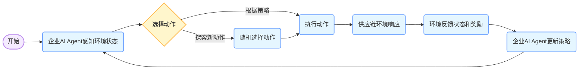

# 企业AI Agent的强化学习在供应链优化中的端到端应用

> 关键词：企业AI Agent、强化学习、供应链优化、端到端应用、智能决策

> 摘要：本文深入探讨了企业AI Agent的强化学习在供应链优化中的端到端应用。从背景介绍入手，阐述了研究目的、预期读者和文档结构。详细解析了核心概念与联系，包括企业AI Agent和强化学习的原理及架构。对核心算法原理和具体操作步骤进行了Python代码示例讲解，同时给出了相关数学模型和公式并举例说明。通过项目实战展示了代码的实际应用和详细解读。分析了在不同场景下的实际应用情况，推荐了学习、开发工具和相关论文著作。最后总结了未来发展趋势与挑战，并提供了常见问题解答和扩展阅读参考资料，旨在为企业利用强化学习优化供应链提供全面而深入的技术指导。

## 1. 背景介绍 
### 1.1 目的和范围
在当今竞争激烈的商业环境中，供应链的高效运作对于企业的成功至关重要。传统的供应链管理方法往往依赖于经验和规则，难以应对复杂多变的市场需求和供应链动态。企业AI Agent的强化学习为供应链优化提供了一种全新的解决方案。本文的目的是深入研究企业AI Agent的强化学习在供应链优化中的端到端应用，从需求预测、库存管理、物流配送等多个环节进行全面分析，探讨如何利用强化学习算法使AI Agent能够自主学习和决策，以实现供应链成本的降低、服务水平的提高和整体效率的提升。

本文的研究范围涵盖了供应链的主要环节，包括供应商选择、生产计划、库存管理、运输调度和客户服务等。同时，考虑了不同规模和行业的企业供应链特点，旨在提供具有通用性和可操作性的方法和策略。

### 1.2 预期读者
本文的预期读者包括供应链管理领域的专业人士，如供应链经理、物流专家和运营分析师等，他们可以从本文中了解如何利用强化学习技术优化供应链决策，提高供应链的绩效。此外，人工智能和机器学习领域的研究人员和开发者也可以从本文中获得关于强化学习在实际应用中的案例和经验，为进一步的研究和开发提供参考。对于企业的高层管理人员，本文可以帮助他们了解强化学习在供应链优化中的潜在价值，为企业的战略决策提供支持。

### 1.3 文档结构概述
本文将按照以下结构进行组织：
1. **背景介绍**：阐述研究目的、预期读者和文档结构，为后续内容奠定基础。
2. **核心概念与联系**：介绍企业AI Agent和强化学习的核心概念，以及它们在供应链优化中的联系，通过文本示意图和Mermaid流程图进行直观展示。
3. **核心算法原理 & 具体操作步骤**：详细讲解强化学习的核心算法原理，如Q - learning、Deep Q - Network（DQN）等，并给出Python源代码示例和具体操作步骤。
4. **数学模型和公式 & 详细讲解 & 举例说明**：给出强化学习在供应链优化中的数学模型和公式，如贝尔曼方程等，并通过具体例子进行详细讲解。
5. **项目实战：代码实际案例和详细解释说明**：通过一个实际的供应链优化项目，展示如何使用强化学习算法进行开发，包括开发环境搭建、源代码实现和代码解读。
6. **实际应用场景**：分析企业AI Agent的强化学习在供应链优化中的不同实际应用场景，如需求预测、库存管理等。
7. **工具和资源推荐**：推荐学习强化学习和供应链优化的相关资源，包括书籍、在线课程、技术博客和网站，以及开发工具、框架和相关论文著作。
8. **总结：未来发展趋势与挑战**：总结企业AI Agent的强化学习在供应链优化中的应用现状，分析未来发展趋势和面临的挑战。
9. **附录：常见问题与解答**：解答读者在学习和应用过程中可能遇到的常见问题。
10. **扩展阅读 & 参考资料**：提供进一步学习和研究的扩展阅读材料和参考资料。

### 1.4 术语表
#### 1.4.1 核心术语定义
- **企业AI Agent**：是一种能够感知企业供应链环境、自主学习和决策的智能体，它可以根据环境的反馈调整自己的行为，以实现企业供应链的优化目标。
- **强化学习**：是一种机器学习方法，智能体通过与环境进行交互，根据环境反馈的奖励信号来学习最优的行为策略，以最大化长期累积奖励。
- **供应链优化**：是指通过对供应链中的各个环节进行合理规划和决策，以降低成本、提高效率、增强服务水平和竞争力的过程。
- **端到端应用**：是指从供应链的起点（如供应商）到终点（如客户）的整个流程中，全面应用强化学习技术，实现供应链的整体优化。

#### 1.4.2 相关概念解释
- **状态（State）**：在强化学习中，状态是对环境的一种描述，它包含了智能体进行决策所需的所有信息。在供应链优化中，状态可以包括库存水平、订单需求、运输状态等。
- **动作（Action）**：是智能体在某个状态下可以采取的行为。在供应链中，动作可以是采购决策、生产计划调整、运输路线选择等。
- **奖励（Reward）**：是环境对智能体采取某个动作后的反馈信号，用于评估动作的好坏。在供应链优化中，奖励可以是成本降低、客户满意度提高等。
- **策略（Policy）**：是智能体在不同状态下选择动作的规则，它决定了智能体的行为方式。强化学习的目标就是学习到一个最优策略，使智能体能够获得最大的长期累积奖励。

#### 1.4.3 缩略词列表
- **AI**：Artificial Intelligence，人工智能
- **RL**：Reinforcement Learning，强化学习
- **DQN**：Deep Q - Network，深度Q网络
- **MDP**：Markov Decision Process，马尔可夫决策过程

## 2. 核心概念与联系 

### 2.1 企业AI Agent
企业AI Agent是一种具备感知、决策和行动能力的智能实体，它可以在企业供应链环境中自主运行。其主要功能包括：
- **环境感知**：通过传感器、数据接口等方式收集供应链中的各种信息，如库存水平、需求预测、供应商状态等。
- **决策制定**：根据感知到的环境信息，运用强化学习等算法进行分析和推理，制定最优的决策方案。
- **行动执行**：将决策方案转化为实际行动，如下达采购订单、调整生产计划、安排运输等。

### 2.2 强化学习
强化学习是一种基于试错的学习方法，智能体通过与环境进行交互，不断尝试不同的动作，并根据环境反馈的奖励信号来调整自己的行为策略。强化学习的核心要素包括：
- **智能体（Agent）**：即企业AI Agent，负责与环境进行交互并做出决策。
- **环境（Environment）**：指企业供应链系统，包括供应商、生产车间、仓库、运输网络等。
- **状态（State）**：对环境当前情况的描述，智能体根据状态来选择动作。
- **动作（Action）**：智能体在某个状态下可以采取的行为。
- **奖励（Reward）**：环境对智能体采取某个动作后的反馈，用于评估动作的好坏。

### 2.3 两者在供应链优化中的联系
企业AI Agent利用强化学习算法在供应链环境中进行学习和决策。智能体根据当前的供应链状态选择合适的动作，环境根据动作的执行结果给予相应的奖励，智能体通过不断地学习和调整策略，以最大化长期累积奖励，从而实现供应链的优化。

### 2.4 文本示意图
```plaintext
企业AI Agent
├── 环境感知
│   └── 收集供应链信息（库存、需求、供应商状态等）
├── 决策制定
│   └── 强化学习算法（Q - learning、DQN等）
│       ├── 输入：当前状态
│       ├── 输出：最优动作
└── 行动执行
    └── 实施决策（采购、生产、运输等）

供应链环境
├── 供应商
├── 生产车间
├── 仓库
├── 运输网络
└── 客户

交互过程
企业AI Agent（动作） ---> 供应链环境
供应链环境（状态、奖励） ---> 企业AI Agent
```

### 2.5 Mermaid流程图


## 3. 核心算法原理 & 具体操作步骤 

### 3.1 Q - learning算法原理
Q - learning是一种无模型的强化学习算法，它通过学习一个动作价值函数 $Q(s,a)$ 来确定在某个状态 $s$ 下采取动作 $a$ 的预期累积奖励。Q - learning的核心思想是基于贝尔曼方程：

$$Q(s,a) \leftarrow Q(s,a)+\alpha\left[r + \gamma\max_{a'}Q(s',a')-Q(s,a)\right]$$

其中：
- $Q(s,a)$ 是状态 $s$ 下采取动作 $a$ 的动作价值。
- $\alpha$ 是学习率，控制每次更新的步长。
- $r$ 是执行动作 $a$ 后获得的即时奖励。
- $\gamma$ 是折扣因子，用于权衡即时奖励和未来奖励的重要性。
- $s'$ 是执行动作 $a$ 后转移到的下一个状态。

### 3.2 Python代码实现
```python
import numpy as np

# 定义Q - learning类
class QLearningAgent:
    def __init__(self, state_size, action_size, learning_rate=0.1, discount_factor=0.9):
        self.state_size = state_size
        self.action_size = action_size
        self.learning_rate = learning_rate
        self.discount_factor = discount_factor
        # 初始化Q表
        self.q_table = np.zeros((state_size, action_size))

    def choose_action(self, state, epsilon=0.1):
        if np.random.uniform(0, 1) < epsilon:
            # 探索：随机选择动作
            action = np.random.choice(self.action_size)
        else:
            # 利用：选择Q值最大的动作
            action = np.argmax(self.q_table[state, :])
        return action

    def update_q_table(self, state, action, reward, next_state):
        # 根据Q - learning公式更新Q表
        max_q_next = np.max(self.q_table[next_state, :])
        self.q_table[state, action] += self.learning_rate * (reward + self.discount_factor * max_q_next - self.q_table[state, action])


# 示例使用
state_size = 10
action_size = 4
agent = QLearningAgent(state_size, action_size)

# 模拟一个交互步骤
current_state = 2
action = agent.choose_action(current_state)
next_state = 3
reward = 1

agent.update_q_table(current_state, action, reward, next_state)
```

### 3.3 具体操作步骤
1. **初始化**：初始化Q表 $Q(s,a)$ 为全零矩阵，设置学习率 $\alpha$ 和折扣因子 $\gamma$。
2. **循环训练**：
    - 智能体观察当前状态 $s$。
    - 根据 $\epsilon$ - 贪心策略选择动作 $a$：以概率 $\epsilon$ 随机选择动作，以概率 $1 - \epsilon$ 选择 $Q(s,a)$ 最大的动作。
    - 执行动作 $a$，并从环境中获得即时奖励 $r$ 和下一个状态 $s'$。
    - 根据Q - learning公式更新Q表：
        - 计算下一个状态 $s'$ 下所有动作的最大Q值 $\max_{a'}Q(s',a')$。
        - 更新当前状态 $s$ 和动作 $a$ 的Q值：$Q(s,a) \leftarrow Q(s,a)+\alpha\left[r + \gamma\max_{a'}Q(s',a')-Q(s,a)\right]$。
    - 将下一个状态 $s'$ 设置为当前状态 $s$，重复上述步骤。
3. **终止条件**：达到预设的训练步数或Q表收敛。

### 3.4 Deep Q - Network（DQN）算法原理
DQN是一种基于深度学习的强化学习算法，它使用神经网络来近似Q值函数。DQN的主要改进包括：
- **经验回放**：将智能体与环境的交互经验存储在经验回放缓冲区中，训练时随机从缓冲区中采样数据，以减少数据之间的相关性。
- **目标网络**：使用一个目标网络来计算目标Q值，减少训练过程中的不稳定性。

### 3.5 Python代码实现
```python
import torch
import torch.nn as nn
import torch.optim as optim
import numpy as np
import random

# 定义DQN网络
class DQN(nn.Module):
    def __init__(self, state_size, action_size):
        super(DQN, self).__init__()
        self.fc1 = nn.Linear(state_size, 64)
        self.fc2 = nn.Linear(64, 64)
        self.fc3 = nn.Linear(64, action_size)

    def forward(self, x):
        x = torch.relu(self.fc1(x))
        x = torch.relu(self.fc2(x))
        x = self.fc3(x)
        return x


# 定义DQN智能体
class DQNAgent:
    def __init__(self, state_size, action_size, learning_rate=0.001, discount_factor=0.9, epsilon=1.0, epsilon_decay=0.995, epsilon_min=0.01, batch_size=64, memory_size=10000):
        self.state_size = state_size
        self.action_size = action_size
        self.learning_rate = learning_rate
        self.discount_factor = discount_factor
        self.epsilon = epsilon
        self.epsilon_decay = epsilon_decay
        self.epsilon_min = epsilon_min
        self.batch_size = batch_size
        self.memory = []
        self.memory_size = memory_size

        # 初始化主网络和目标网络
        self.model = DQN(state_size, action_size)
        self.target_model = DQN(state_size, action_size)
        self.target_model.load_state_dict(self.model.state_dict())
        self.optimizer = optim.Adam(self.model.parameters(), lr=learning_rate)
        self.criterion = nn.MSELoss()

    def remember(self, state, action, reward, next_state, done):
        # 存储经验
        self.memory.append((state, action, reward, next_state, done))
        if len(self.memory) > self.memory_size:
            self.memory.pop(0)

    def choose_action(self, state):
        if np.random.uniform(0, 1) < self.epsilon:
            # 探索：随机选择动作
            action = np.random.choice(self.action_size)
        else:
            # 利用：选择Q值最大的动作
            state = torch.FloatTensor(state).unsqueeze(0)
            q_values = self.model(state)
            action = torch.argmax(q_values).item()
        return action

    def replay(self):
        if len(self.memory) < self.batch_size:
            return
        # 从经验回放缓冲区中随机采样
        minibatch = random.sample(self.memory, self.batch_size)
        states, actions, rewards, next_states, dones = zip(*minibatch)

        states = torch.FloatTensor(states)
        actions = torch.LongTensor(actions)
        rewards = torch.FloatTensor(rewards)
        next_states = torch.FloatTensor(next_states)
        dones = torch.FloatTensor(dones)

        # 计算当前Q值
        q_values = self.model(states)
        q_values = q_values.gather(1, actions.unsqueeze(1)).squeeze(1)

        # 计算目标Q值
        next_q_values = self.target_model(next_states)
        max_next_q_values = next_q_values.max(1)[0]
        target_q_values = rewards + (1 - dones) * self.discount_factor * max_next_q_values

        # 计算损失并更新网络
        loss = self.criterion(q_values, target_q_values)
        self.optimizer.zero_grad()
        loss.backward()
        self.optimizer.step()

        # 衰减探索率
        if self.epsilon > self.epsilon_min:
            self.epsilon *= self.epsilon_decay

    def update_target_model(self):
        # 更新目标网络
        self.target_model.load_state_dict(self.model.state_dict())


# 示例使用
state_size = 10
action_size = 4
agent = DQNAgent(state_size, action_size)

# 模拟一个交互步骤
current_state = np.random.rand(state_size)
action = agent.choose_action(current_state)
next_state = np.random.rand(state_size)
reward = 1
done = False

agent.remember(current_state, action, reward, next_state, done)
agent.replay()
agent.update_target_model()
```

### 3.6 具体操作步骤
1. **初始化**：初始化主网络和目标网络，设置学习率、折扣因子、探索率等超参数，初始化经验回放缓冲区。
2. **循环训练**：
    - 智能体观察当前状态 $s$。
    - 根据 $\epsilon$ - 贪心策略选择动作 $a$。
    - 执行动作 $a$，并从环境中获得即时奖励 $r$、下一个状态 $s'$ 和终止标志 $done$。
    - 将 $(s,a,r,s',done)$ 存储到经验回放缓冲区中。
    - 从经验回放缓冲区中随机采样一个批次的数据。
    - 计算当前Q值和目标Q值。
    - 计算损失并更新主网络的参数。
    - 衰减探索率 $\epsilon$。
    - 定期更新目标网络的参数。
3. **终止条件**：达到预设的训练步数或性能指标收敛。

## 4. 数学模型和公式 & 详细讲解 & 举例说明 

### 4.1 马尔可夫决策过程（MDP）
马尔可夫决策过程是强化学习的理论基础，它由一个四元组 $(S,A,P,R)$ 定义：
- $S$ 是状态空间，表示所有可能的状态集合。
- $A$ 是动作空间，表示所有可能的动作集合。
- $P(s'|s,a)$ 是状态转移概率，表示在状态 $s$ 下采取动作 $a$ 后转移到状态 $s'$ 的概率。
- $R(s,a)$ 是奖励函数，表示在状态 $s$ 下采取动作 $a$ 后获得的即时奖励。

马尔可夫性质是指未来的状态只依赖于当前状态和动作，而与过去的状态和动作无关。

### 4.2 价值函数
#### 4.2.1 状态价值函数 $V^{\pi}(s)$
状态价值函数 $V^{\pi}(s)$ 表示在策略 $\pi$ 下，从状态 $s$ 开始的预期累积奖励：

$$V^{\pi}(s) = \mathbb{E}_{\pi}\left[\sum_{t = 0}^{\infty}\gamma^{t}R(S_{t},A_{t})\mid S_{0}=s\right]$$

其中，$\gamma\in[0,1]$ 是折扣因子，用于权衡即时奖励和未来奖励的重要性。

#### 4.2.2 动作价值函数 $Q^{\pi}(s,a)$
动作价值函数 $Q^{\pi}(s,a)$ 表示在策略 $\pi$ 下，从状态 $s$ 采取动作 $a$ 开始的预期累积奖励：

$$Q^{\pi}(s,a) = \mathbb{E}_{\pi}\left[\sum_{t = 0}^{\infty}\gamma^{t}R(S_{t},A_{t})\mid S_{0}=s,A_{0}=a\right]$$

### 4.3 贝尔曼方程
#### 4.3.1 状态价值函数的贝尔曼方程
$$V^{\pi}(s)=\sum_{a\in A}\pi(a|s)\left[R(s,a)+\gamma\sum_{s'\in S}P(s'|s,a)V^{\pi}(s')\right]$$

该方程表示当前状态的价值等于在该状态下采取所有可能动作的加权平均，每个动作的权重是策略 $\pi$ 下选择该动作的概率，动作的价值等于即时奖励加上下一个状态的折扣价值。

#### 4.3.2 动作价值函数的贝尔曼方程
$$Q^{\pi}(s,a)=R(s,a)+\gamma\sum_{s'\in S}P(s'|s,a)\sum_{a'\in A}\pi(a'|s')Q^{\pi}(s',a')$$

该方程表示当前状态 - 动作对的价值等于即时奖励加上下一个状态下所有可能动作的折扣价值的加权平均。

### 4.4 最优价值函数和最优策略
#### 4.4.1 最优状态价值函数 $V^{*}(s)$
$$V^{*}(s)=\max_{\pi}V^{\pi}(s)$$

#### 4.4.2 最优动作价值函数 $Q^{*}(s,a)$
$$Q^{*}(s,a)=\max_{\pi}Q^{\pi}(s,a)$$

#### 4.4.3 最优策略 $\pi^{*}$
$$\pi^{*}(a|s)=\begin{cases}1, & a=\arg\max_{a'}Q^{*}(s,a')\\0, & \text{otherwise}\end{cases}$$

### 4.5 举例说明
假设一个简单的供应链库存管理问题，状态 $s$ 表示库存水平，动作 $a$ 表示采购数量，奖励 $r$ 表示成本节约。状态空间 $S=\{0,1,2,3\}$，动作空间 $A=\{0,1,2\}$。

- **状态转移概率**：假设采购后库存水平会相应增加，且不考虑需求的不确定性。例如，当 $s = 1$，$a = 1$ 时，$s'=2$，$P(s' = 2|s = 1,a = 1)=1$。
- **奖励函数**：假设持有库存有成本，缺货也有成本。当库存水平为 $s$，采购数量为 $a$ 时，奖励 $R(s,a)=-(0.1s + 0.5\max(0,D - s - a))$，其中 $D$ 是需求。

假设初始状态 $s = 1$，折扣因子 $\gamma = 0.9$。我们可以使用Q - learning算法来学习最优策略。

```python
import numpy as np

# 状态空间和动作空间
state_size = 4
action_size = 3

# 初始化Q表
q_table = np.zeros((state_size, action_size))

# 超参数
learning_rate = 0.1
discount_factor = 0.9
epsilon = 0.1
num_episodes = 100

# 模拟需求
def get_demand():
    return np.random.randint(0, 3)

# 模拟环境
def step(state, action):
    demand = get_demand()
    next_state = min(state + action, 3)
    reward = -(0.1 * next_state + 0.5 * max(0, demand - next_state))
    return next_state, reward

# Q - learning训练
for episode in range(num_episodes):
    state = np.random.randint(0, state_size)
    done = False
    while not done:
        if np.random.uniform(0, 1) < epsilon:
            action = np.random.choice(action_size)
        else:
            action = np.argmax(q_table[state, :])

        next_state, reward = step(state, action)

        max_q_next = np.max(q_table[next_state, :])
        q_table[state, action] += learning_rate * (reward + discount_factor * max_q_next - q_table[state, action])

        state = next_state

        if np.random.uniform(0, 1) < 0.1:
            done = True

print("最终Q表：")
print(q_table)
```

在这个例子中，通过不断地与环境交互，智能体学习到了在不同库存水平下的最优采购策略，以最大化长期累积奖励（即最小化成本）。

## 5. 项目实战：代码实际案例和详细解释说明 

### 5.1  开发环境搭建
#### 5.1.1 操作系统
可以选择常见的操作系统，如Windows、Linux（如Ubuntu）或macOS。

#### 5.1.2 编程语言和库
- **Python**：选择Python 3.7及以上版本。
- **深度学习框架**：推荐使用PyTorch或TensorFlow，这里我们使用PyTorch。可以通过以下命令安装：
```bash
pip install torch torchvision
```
- **其他库**：还需要安装NumPy、Matplotlib等常用库：
```bash
pip install numpy matplotlib
```

#### 5.1.3 开发工具
可以使用Jupyter Notebook进行交互式开发，也可以使用PyCharm、VS Code等集成开发环境（IDE）。

### 5.2  源代码详细实现和代码解读
#### 5.2.1 问题描述
我们考虑一个简单的供应链物流调度问题，假设有一个仓库和多个客户，需要将货物从仓库运输到客户处。状态包括仓库的库存水平、每个客户的需求和运输车辆的状态，动作包括选择运输车辆和分配运输任务。目标是最小化运输成本和满足客户需求。

#### 5.2.2 代码实现
```python
import numpy as np
import torch
import torch.nn as nn
import torch.optim as optim
import random

# 定义DQN网络
class DQN(nn.Module):
    def __init__(self, state_size, action_size):
        super(DQN, self).__init__()
        self.fc1 = nn.Linear(state_size, 64)
        self.fc2 = nn.Linear(64, 64)
        self.fc3 = nn.Linear(64, action_size)

    def forward(self, x):
        x = torch.relu(self.fc1(x))
        x = torch.relu(self.fc2(x))
        x = self.fc3(x)
        return x


# 定义DQN智能体
class DQNAgent:
    def __init__(self, state_size, action_size, learning_rate=0.001, discount_factor=0.9, epsilon=1.0, epsilon_decay=0.995, epsilon_min=0.01, batch_size=64, memory_size=10000):
        self.state_size = state_size
        self.action_size = action_size
        self.learning_rate = learning_rate
        self.discount_factor = discount_factor
        self.epsilon = epsilon
        self.epsilon_decay = epsilon_decay
        self.epsilon_min = epsilon_min
        self.batch_size = batch_size
        self.memory = []
        self.memory_size = memory_size

        # 初始化主网络和目标网络
        self.model = DQN(state_size, action_size)
        self.target_model = DQN(state_size, action_size)
        self.target_model.load_state_dict(self.model.state_dict())
        self.optimizer = optim.Adam(self.model.parameters(), lr=learning_rate)
        self.criterion = nn.MSELoss()

    def remember(self, state, action, reward, next_state, done):
        # 存储经验
        self.memory.append((state, action, reward, next_state, done))
        if len(self.memory) > self.memory_size:
            self.memory.pop(0)

    def choose_action(self, state):
        if np.random.uniform(0, 1) < self.epsilon:
            # 探索：随机选择动作
            action = np.random.choice(self.action_size)
        else:
            # 利用：选择Q值最大的动作
            state = torch.FloatTensor(state).unsqueeze(0)
            q_values = self.model(state)
            action = torch.argmax(q_values).item()
        return action

    def replay(self):
        if len(self.memory) < self.batch_size:
            return
        # 从经验回放缓冲区中随机采样
        minibatch = random.sample(self.memory, self.batch_size)
        states, actions, rewards, next_states, dones = zip(*minibatch)

        states = torch.FloatTensor(states)
        actions = torch.LongTensor(actions)
        rewards = torch.FloatTensor(rewards)
        next_states = torch.FloatTensor(next_states)
        dones = torch.FloatTensor(dones)

        # 计算当前Q值
        q_values = self.model(states)
        q_values = q_values.gather(1, actions.unsqueeze(1)).squeeze(1)

        # 计算目标Q值
        next_q_values = self.target_model(next_states)
        max_next_q_values = next_q_values.max(1)[0]
        target_q_values = rewards + (1 - dones) * self.discount_factor * max_next_q_values

        # 计算损失并更新网络
        loss = self.criterion(q_values, target_q_values)
        self.optimizer.zero_grad()
        loss.backward()
        self.optimizer.step()

        # 衰减探索率
        if self.epsilon > self.epsilon_min:
            self.epsilon *= self.epsilon_decay

    def update_target_model(self):
        # 更新目标网络
        self.target_model.load_state_dict(self.model.state_dict())


# 定义供应链环境
class SupplyChainEnv:
    def __init__(self, num_customers, num_vehicles, initial_inventory):
        self.num_customers = num_customers
        self.num_vehicles = num_vehicles
        self.initial_inventory = initial_inventory
        self.reset()

    def reset(self):
        self.inventory = self.initial_inventory
        self.customer_demands = np.random.randint(1, 5, self.num_customers)
        self.vehicle_states = np.zeros(self.num_vehicles)
        state = np.concatenate([[self.inventory], self.customer_demands, self.vehicle_states])
        return state

    def step(self, action):
        vehicle_index = action // self.num_customers
        customer_index = action % self.num_customers

        if self.vehicle_states[vehicle_index] == 0 and self.inventory >= self.customer_demands[customer_index]:
            # 车辆可用且库存足够
            self.inventory -= self.customer_demands[customer_index]
            self.customer_demands[customer_index] = 0
            self.vehicle_states[vehicle_index] = 1
            reward = -1  # 运输成本
        else:
            reward = -10  # 无效动作惩罚

        done = np.sum(self.customer_demands) == 0
        next_state = np.concatenate([[self.inventory], self.customer_demands, self.vehicle_states])
        return next_state, reward, done


# 训练参数
num_customers = 3
num_vehicles = 2
initial_inventory = 10
state_size = 1 + num_customers + num_vehicles
action_size = num_vehicles * num_customers
num_episodes = 1000

# 初始化智能体和环境
agent = DQNAgent(state_size, action_size)
env = SupplyChainEnv(num_customers, num_vehicles, initial_inventory)

# 训练循环
for episode in range(num_episodes):
    state = env.reset()
    total_reward = 0
    done = False
    while not done:
        action = agent.choose_action(state)
        next_state, reward, done = env.step(action)
        agent.remember(state, action, reward, next_state, done)
        agent.replay()
        state = next_state
        total_reward += reward

    if episode % 10 == 0:
        agent.update_target_model()

    print(f"Episode {episode}: Total Reward = {total_reward}")


```

### 5.3  代码解读与分析
#### 5.3.1 DQN网络
- `DQN` 类定义了一个简单的三层全连接神经网络，用于近似Q值函数。输入层的大小为状态空间的维度，输出层的大小为动作空间的维度。
- `forward` 方法定义了网络的前向传播过程，使用ReLU激活函数增加网络的非线性。

#### 5.3.2 DQN智能体
- `DQNAgent` 类封装了DQN算法的核心逻辑，包括经验回放、目标网络更新等。
- `remember` 方法用于将智能体与环境的交互经验存储到经验回放缓冲区中。
- `choose_action` 方法根据 $\epsilon$ - 贪心策略选择动作。
- `replay` 方法从经验回放缓冲区中随机采样数据，计算当前Q值和目标Q值，然后更新主网络的参数。
- `update_target_model` 方法用于定期更新目标网络的参数。

#### 5.3.3 供应链环境
- `SupplyChainEnv` 类定义了供应链物流调度环境，包括初始化环境状态、重置环境和执行动作等方法。
- `reset` 方法初始化库存水平、客户需求和车辆状态，并返回初始状态。
- `step` 方法根据选择的动作更新环境状态，计算奖励，并判断是否达到终止条件。

#### 5.3.4 训练循环
- 在训练循环中，智能体与环境进行交互，不断学习和更新策略。
- 每个回合开始时，环境被重置，智能体根据当前状态选择动作，执行动作后更新环境状态和奖励，将经验存储到经验回放缓冲区中，并进行训练。
- 定期更新目标网络的参数，以提高训练的稳定性。

通过训练，智能体可以学习到在不同状态下的最优动作策略，以最小化运输成本和满足客户需求。

## 6. 实际应用场景 
### 6.1 需求预测
企业AI Agent可以利用强化学习算法分析历史销售数据、市场趋势、季节因素等信息，对未来的需求进行准确预测。通过不断地与市场环境进行交互，智能体可以根据需求预测的准确性获得相应的奖励，从而学习到最优的预测策略。例如，在零售行业中，智能体可以预测不同商品在不同时间段的销售量，帮助企业合理安排库存和采购计划。

### 6.2 库存管理
在库存管理中，企业AI Agent可以根据当前的库存水平、需求预测和补货成本等信息，制定最优的补货策略。智能体可以通过强化学习算法学习到何时补货、补货多少，以最小化库存持有成本和缺货成本。例如，在制造业中，智能体可以根据生产计划和原材料消耗情况，实时调整原材料的库存水平，确保生产的连续性。

### 6.3 供应商选择
企业AI Agent可以综合考虑供应商的价格、质量、交货期等因素，使用强化学习算法选择最优的供应商。智能体可以通过与供应商进行交互，根据采购成本、产品质量和交货准时率等指标获得奖励，从而学习到如何选择最合适的供应商。例如，在电子制造行业中，智能体可以根据不同供应商的报价和产品性能，选择最具性价比的供应商。

### 6.4 生产计划优化
在生产计划方面，企业AI Agent可以根据订单需求、设备产能、原材料供应等信息，制定最优的生产计划。智能体可以通过强化学习算法学习到如何合理安排生产任务、调整生产进度，以提高生产效率和降低生产成本。例如，在汽车制造行业中，智能体可以根据订单数量和车型需求，合理安排生产线的生产任务，提高生产效率。

### 6.5 物流配送调度
企业AI Agent可以利用强化学习算法优化物流配送调度，包括车辆路径规划、货物装载安排等。智能体可以根据交通状况、客户位置、货物重量和体积等信息，选择最优的配送方案，以降低运输成本和提高配送效率。例如，在快递行业中，智能体可以根据包裹的目的地和重量，合理安排车辆的行驶路线和装载方式，提高配送效率。

## 7. 工具和资源推荐
### 7.1 学习资源推荐
#### 7.1.1 书籍推荐
- 《Reinforcement Learning: An Introduction》（《强化学习：原理与Python实现》）：由Richard S. Sutton和Andrew G. Barto所著，是强化学习领域的经典教材，系统地介绍了强化学习的基本概念、算法和应用。
- 《Python Reinforcement Learning Projects》（《Python强化学习项目实战》）：通过实际项目案例，介绍了如何使用Python实现强化学习算法，包括Q - learning、DQN等。
- 《Supply Chain Analytics》（《供应链分析》）：介绍了供应链管理中的数据分析方法和技术，包括需求预测、库存管理、物流优化等。

#### 7.1.2 在线课程
- Coursera上的“Reinforcement Learning Specialization”：由DeepMind的研究人员授课，全面介绍了强化学习的理论和实践。
- edX上的“Supply Chain Analytics and Machine Learning”：结合供应链管理和机器学习的知识，介绍了如何使用机器学习算法优化供应链决策。
- Udemy上的“Complete Guide to Reinforcement Learning with Python”：通过实际项目案例，详细介绍了如何使用Python实现强化学习算法。

#### 7.1.3 技术博客和网站
- OpenAI Blog：OpenAI发布的关于人工智能和强化学习的最新研究成果和技术文章。
- Towards Data Science：一个专注于数据科学和机器学习的技术博客，有很多关于强化学习和供应链优化的文章。
- ArXiv.org：一个预印本服务器，提供了大量关于人工智能和强化学习的最新研究论文。

### 7.2 开发工具框架推荐
#### 7.2.1 IDE和编辑器
- PyCharm：一个专业的Python集成开发环境，提供了代码编辑、调试、版本控制等功能，适合开发大型的Python项目。
- VS Code：一个轻量级的代码编辑器，支持多种编程语言，通过安装Python扩展可以实现Python代码的开发和调试。
- Jupyter Notebook：一个交互式的开发环境，适合进行数据分析和机器学习实验，支持代码、文本、图表等多种形式的展示。

#### 7.2.2 调试和性能分析工具
- TensorBoard：TensorFlow提供的可视化工具，可以用于监控模型的训练过程、查看损失函数和准确率等指标。
- PyTorch Profiler：PyTorch提供的性能分析工具，可以用于分析模型的运行时间、内存使用等情况。
- cProfile：Python标准库中的性能分析工具，可以用于分析Python代码的运行时间和函数调用情况。

#### 7.2.3 相关框架和库
- PyTorch：一个开源的深度学习框架，提供了丰富的神经网络模型和优化算法，支持GPU加速，适合开发强化学习算法。
- TensorFlow：另一个流行的深度学习框架，具有广泛的应用场景和社区支持，提供了多种强化学习算法的实现。
- Stable Baselines3：一个基于PyTorch的强化学习库，提供了多种经典强化学习算法的实现，如A2C、PPO等，方便快速开发和实验。

### 7.3 相关论文著作推荐
#### 7.3.1 经典论文
- “Playing Atari with Deep Reinforcement Learning”：介绍了Deep Q - Network（DQN）算法，开创了深度强化学习在游戏领域的应用。
- “Asynchronous Methods for Deep Reinforcement Learning”：提出了异步优势演员 - 评论家（A3C）算法，提高了强化学习的训练效率。
- “Proximal Policy Optimization Algorithms”：提出了近端策略优化（PPO）算法，是一种高效的策略梯度算法。

#### 7.3.2 最新研究成果
- 在ArXiv.org上搜索“Supply Chain Optimization with Reinforcement Learning”可以找到关于强化学习在供应链优化中的最新研究论文。
- 国际顶级会议如NeurIPS、ICML、IJCAI等也会发表很多关于强化学习和供应链优化的最新研究成果。

#### 7.3.3 应用案例分析
- 一些知名企业如亚马逊、谷歌等会在其技术博客上分享强化学习在供应链优化中的应用案例，可以通过搜索相关企业的技术博客获取这些信息。
- 学术期刊如《Management Science》、《Operations Research》等也会发表一些关于供应链优化的应用案例研究。

## 8. 总结：未来发展趋势与挑战
### 8.1 未来发展趋势
#### 8.1.1 多智能体强化学习
在供应链中，往往涉及多个参与者，如供应商、制造商、物流商等。多智能体强化学习可以使不同的AI Agent之间进行协作和竞争，共同优化供应链的整体性能。例如，供应商的AI Agent和制造商的AI Agent可以通过协作来优化原材料的供应和生产计划。

#### 8.1.2 结合其他技术
强化学习可以与其他技术如物联网（IoT）、区块链等相结合，实现更加智能化和高效的供应链管理。例如，通过物联网设备实时收集供应链中的数据，为强化学习提供更准确的环境信息；利用区块链技术保证数据的安全性和不可篡改，提高供应链的透明度和信任度。

#### 8.1.3 可解释性强化学习
随着强化学习在供应链优化中的应用越来越广泛，对模型的可解释性要求也越来越高。可解释性强化学习可以帮助企业更好地理解模型的决策过程，提高决策的可信度和可靠性。例如，通过可视化技术展示智能体的决策依据，使企业管理人员能够直观地了解模型的决策逻辑。

### 8.2 挑战
#### 8.2.1 数据质量和数量
强化学习需要大量高质量的数据来进行训练。在供应链领域，数据的收集和整理往往面临着数据缺失、噪声大等问题。此外，供应链数据通常具有高维度、动态性等特点，增加了数据处理和分析的难度。

#### 8.2.2 环境复杂性
供应链环境是一个复杂的系统，受到多种因素的影响，如市场需求、政策法规、自然灾害等。这些因素的不确定性和动态性使得强化学习模型难以准确地建模和预测环境的变化，从而影响模型的性能和稳定性。

#### 8.2.3 计算资源和时间成本
深度强化学习模型通常需要大量的计算资源和时间来进行训练。在实际应用中，企业可能无法提供足够的计算资源来支持模型的训练，或者无法承受长时间的训练过程。因此，如何提高强化学习算法的训练效率和降低计算成本是一个亟待解决的问题。

## 9. 附录：常见问题与解答
### 9.1 什么是企业AI Agent？
企业AI Agent是一种能够感知企业供应链环境、自主学习和决策的智能体。它可以根据环境的反馈调整自己的行为，以实现企业供应链的优化目标。

### 9.2 强化学习和监督学习有什么区别？
监督学习是基于标注数据进行学习，目标是学习输入和输出之间的映射关系。而强化学习是基于试错的学习方法，智能体通过与环境进行交互，根据环境反馈的奖励信号来学习最优的行为策略，以最大化长期累积奖励。

### 9.3 如何选择合适的强化学习算法？
选择合适的强化学习算法需要考虑问题的特点、数据的规模和复杂度等因素。如果问题的状态空间和动作空间较小，可以选择传统的Q - learning算法；如果问题比较复杂，可以考虑使用基于深度学习的强化学习算法，如DQN、A3C、PPO等。

### 9.4 强化学习在供应链优化中的应用有哪些局限性？
强化学习在供应链优化中的应用面临着