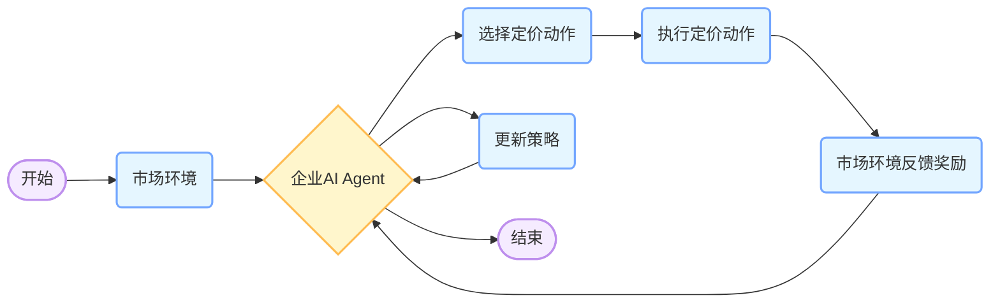

# 企业AI Agent的强化学习在动态定价策略中的应用

> 关键词：企业AI Agent、强化学习、动态定价策略、马尔可夫决策过程、Q学习算法

> 摘要：本文深入探讨了企业AI Agent的强化学习在动态定价策略中的应用。首先介绍了相关背景知识，包括目的范围、预期读者等内容。接着阐述了核心概念，如企业AI Agent、强化学习和动态定价策略及其相互联系，并给出了相应的文本示意图和Mermaid流程图。详细讲解了核心算法原理，通过Python代码实现进行说明，同时给出了相关的数学模型和公式，并举例解释。在项目实战部分，从开发环境搭建到源代码详细实现及解读进行了全面分析。还介绍了该技术在实际中的应用场景，推荐了学习、开发相关的工具和资源，最后总结了未来发展趋势与挑战，并给出常见问题解答和扩展阅读参考资料。

## 1. 背景介绍 
### 1.1 目的和范围
在当今竞争激烈的商业环境中，企业需要不断优化定价策略以提高利润、增强市场竞争力。传统的定价方法往往难以适应快速变化的市场需求、竞争对手的动态以及消费者行为的多样性。而动态定价策略能够根据实时的市场信息、库存水平、客户需求等因素灵活调整价格，从而实现企业利益的最大化。

本文的目的是研究如何利用企业AI Agent的强化学习技术来实现高效的动态定价策略。范围涵盖了从强化学习的基本原理到实际应用中的具体实现步骤，包括算法选择、模型训练、代码实现以及实际应用场景的分析。

### 1.2 预期读者
本文预期读者包括企业管理人员、市场营销人员、数据科学家、机器学习工程师以及对强化学习和动态定价感兴趣的技术爱好者。对于企业管理人员和市场营销人员，本文可以帮助他们了解如何利用先进的技术手段优化企业的定价策略；对于数据科学家和机器学习工程师，本文提供了详细的技术实现细节和代码示例，可作为实际项目开发的参考。

### 1.3 文档结构概述
本文将按照以下结构进行组织：
- 核心概念与联系：介绍企业AI Agent、强化学习和动态定价策略的核心概念，并分析它们之间的联系。
- 核心算法原理 & 具体操作步骤：详细讲解强化学习中常用的算法原理，并给出具体的操作步骤，同时使用Python代码进行实现。
- 数学模型和公式 & 详细讲解 & 举例说明：介绍强化学习中的数学模型和公式，如马尔可夫决策过程、Q学习算法等，并通过具体例子进行解释。
- 项目实战：代码实际案例和详细解释说明：从开发环境搭建开始，逐步实现一个基于强化学习的动态定价系统，并对代码进行详细解读。
- 实际应用场景：分析强化学习在动态定价策略中的实际应用场景。
- 工具和资源推荐：推荐学习和开发相关的工具和资源，包括书籍、在线课程、开发工具等。
- 总结：未来发展趋势与挑战：总结强化学习在动态定价策略中的应用现状，并分析未来的发展趋势和面临的挑战。
- 附录：常见问题与解答：解答读者在阅读过程中可能遇到的常见问题。
- 扩展阅读 & 参考资料：提供相关的扩展阅读材料和参考资料。

### 1.4 术语表
#### 1.4.1 核心术语定义
- **企业AI Agent**：是指能够代表企业在特定环境中自主执行任务、做出决策的人工智能实体。在动态定价场景中，企业AI Agent可以根据市场信息和企业目标，自动调整产品或服务的价格。
- **强化学习**：是一种机器学习方法，智能体（Agent）通过与环境进行交互，根据环境反馈的奖励信号来学习最优的行为策略，以最大化长期累积奖励。
- **动态定价策略**：是指企业根据市场需求、竞争状况、库存水平等因素的变化，实时调整产品或服务价格的一种定价方法。

#### 1.4.2 相关概念解释
- **马尔可夫决策过程（MDP）**：是强化学习中的一个基本数学模型，用于描述智能体在环境中的决策过程。它由状态（State）、动作（Action）、奖励（Reward）和状态转移概率（Transition Probability）四个要素组成。
- **Q学习算法**：是一种无模型的强化学习算法，用于学习最优的动作价值函数（Q函数）。通过不断更新Q值，智能体可以找到在每个状态下的最优动作。

#### 1.4.3 缩略词列表
- **MDP**：Markov Decision Process（马尔可夫决策过程）
- **Q - learning**：Q学习算法

## 2. 核心概念与联系 

### 核心概念原理
#### 企业AI Agent
企业AI Agent是一个具备自主决策能力的智能体，它能够感知企业所处的市场环境，包括竞争对手的价格、市场需求、客户反馈等信息。通过对这些信息的分析和处理，企业AI Agent可以根据企业的目标（如最大化利润、提高市场份额等）做出定价决策。

#### 强化学习
强化学习的核心思想是智能体通过与环境进行交互，不断尝试不同的动作，并根据环境给予的奖励信号来学习最优的行为策略。在每一个时间步，智能体处于一个特定的状态 $s$，它选择一个动作 $a$ 执行，环境根据智能体的动作转移到下一个状态 $s'$，并给予智能体一个奖励 $r$。智能体的目标是通过学习，找到一个策略 $\pi$，使得长期累积奖励最大化。

#### 动态定价策略
动态定价策略是一种灵活的定价方法，它允许企业根据实时的市场情况调整产品或服务的价格。动态定价的依据可以包括市场需求、竞争状况、库存水平、时间因素等。通过动态定价，企业可以更好地满足客户需求，提高市场竞争力，实现利润最大化。

### 架构的文本示意图
企业AI Agent的强化学习在动态定价策略中的应用架构可以描述如下：

企业AI Agent作为核心决策单元，它接收来自市场环境的信息，包括竞争对手价格、市场需求、库存水平等状态信息。根据这些状态信息，企业AI Agent基于强化学习算法选择一个定价动作。执行该动作后，市场环境会反馈一个奖励信号，例如利润的变化。企业AI Agent根据这个奖励信号更新自己的策略，以不断优化定价决策。

### Mermaid流程图


## 3. 核心算法原理 & 具体操作步骤 

### 马尔可夫决策过程（MDP）原理
马尔可夫决策过程是强化学习的基础数学模型，它可以用一个五元组 $(S, A, P, R, \gamma)$ 来表示：
- $S$：状态空间，表示智能体可能处于的所有状态的集合。
- $A$：动作空间，表示智能体在每个状态下可以采取的所有动作的集合。
- $P$：状态转移概率函数，$P(s'|s, a)$ 表示在状态 $s$ 下执行动作 $a$ 后转移到状态 $s'$ 的概率。
- $R$：奖励函数，$R(s, a, s')$ 表示在状态 $s$ 下执行动作 $a$ 并转移到状态 $s'$ 时获得的奖励。
- $\gamma$：折扣因子，$0 \leq \gamma \leq 1$，用于衡量未来奖励的重要性。

### Q学习算法原理
Q学习算法是一种无模型的强化学习算法，它通过学习动作价值函数 $Q(s, a)$ 来找到最优策略。$Q(s, a)$ 表示在状态 $s$ 下执行动作 $a$ 后，遵循最优策略所能获得的长期累积奖励的期望值。

Q学习算法的更新公式如下：
$$Q(s, a) \leftarrow Q(s, a) + \alpha [r + \gamma \max_{a'} Q(s', a') - Q(s, a)]$$
其中，$\alpha$ 是学习率，$r$ 是即时奖励，$\gamma$ 是折扣因子，$s'$ 是执行动作 $a$ 后转移到的下一个状态。

### 具体操作步骤
1. **初始化**：初始化动作价值函数 $Q(s, a)$ 为任意值，通常初始化为0。
2. **选择动作**：在每个状态 $s$ 下，根据当前的 $Q$ 值选择一个动作 $a$。可以使用 $\epsilon$-贪心策略，以 $\epsilon$ 的概率随机选择一个动作，以 $1 - \epsilon$ 的概率选择 $Q$ 值最大的动作。
3. **执行动作**：执行选择的动作 $a$，观察环境的反馈，包括下一个状态 $s'$ 和奖励 $r$。
4. **更新Q值**：根据Q学习算法的更新公式更新 $Q(s, a)$。
5. **重复步骤2 - 4**：直到达到终止条件，例如达到最大迭代次数或收敛到最优策略。

### Python代码实现
```python
import numpy as np

# 定义状态空间和动作空间
num_states = 10
num_actions = 5

# 初始化Q表
Q = np.zeros((num_states, num_actions))

# 定义参数
alpha = 0.1  # 学习率
gamma = 0.9  # 折扣因子
epsilon = 0.1  # 探索率
num_episodes = 1000

# 模拟环境的状态转移和奖励函数
def get_next_state_and_reward(state, action):
    # 这里简单模拟，实际应用中需要根据具体情况实现
    next_state = np.random.randint(num_states)
    reward = np.random.randint(-1, 2)
    return next_state, reward

# Q学习算法
for episode in range(num_episodes):
    state = np.random.randint(num_states)
    done = False
    while not done:
        # 选择动作
        if np.random.uniform(0, 1) < epsilon:
            action = np.random.randint(num_actions)
        else:
            action = np.argmax(Q[state, :])
        
        # 执行动作
        next_state, reward = get_next_state_and_reward(state, action)
        
        # 更新Q值
        Q[state, action] = Q[state, action] + alpha * (reward + gamma * np.max(Q[next_state, :]) - Q[state, action])
        
        state = next_state
        
        # 简单设置终止条件
        if np.random.uniform(0, 1) < 0.1:
            done = True

print("最终的Q表：")
print(Q)
```

## 4. 数学模型和公式 & 详细讲解 & 举例说明 

### 马尔可夫决策过程（MDP）的数学模型
马尔可夫决策过程的核心是状态转移和奖励的概率分布。状态转移概率 $P(s'|s, a)$ 描述了在状态 $s$ 下执行动作 $a$ 后转移到状态 $s'$ 的概率，满足 $\sum_{s' \in S} P(s'|s, a) = 1$。奖励函数 $R(s, a, s')$ 表示在状态 $s$ 下执行动作 $a$ 并转移到状态 $s'$ 时获得的奖励。

智能体的目标是找到一个策略 $\pi$，使得长期累积奖励最大化。长期累积奖励可以表示为：
$$G_t = \sum_{k=0}^{\infty} \gamma^k r_{t+k+1}$$
其中，$r_{t+k+1}$ 是在时间步 $t + k + 1$ 获得的奖励，$\gamma$ 是折扣因子。

### Q学习算法的数学公式
Q学习算法的更新公式为：
$$Q(s, a) \leftarrow Q(s, a) + \alpha [r + \gamma \max_{a'} Q(s', a') - Q(s, a)]$$
这个公式的含义是：$Q(s, a)$ 的更新值等于当前值加上学习率 $\alpha$ 乘以一个误差项。误差项是即时奖励 $r$ 加上折扣后的下一个状态的最大 $Q$ 值 $\gamma \max_{a'} Q(s', a')$ 减去当前的 $Q$ 值 $Q(s, a)$。

### 举例说明
假设一个简单的动态定价场景，有两种状态：高需求状态（$s_1$）和低需求状态（$s_2$），有两种动作：高价（$a_1$）和低价（$a_2$）。

初始时，$Q(s_1, a_1) = 0$，$Q(s_1, a_2) = 0$，$Q(s_2, a_1) = 0$，$Q(s_2, a_2) = 0$。

在高需求状态 $s_1$ 下，智能体选择动作 $a_1$（高价），执行该动作后转移到状态 $s_1$，并获得奖励 $r = 10$。

假设学习率 $\alpha = 0.1$，折扣因子 $\gamma = 0.9$。

根据Q学习算法的更新公式：
$$Q(s_1, a_1) = Q(s_1, a_1) + \alpha [r + \gamma \max_{a'} Q(s_1, a') - Q(s_1, a_1)]$$
由于 $\max_{a'} Q(s_1, a') = 0$（初始时），则：
$$Q(s_1, a_1) = 0 + 0.1\times(10 + 0.9\times0 - 0) = 1$$

通过不断的交互和更新，智能体可以学习到在不同状态下的最优定价策略。

## 5. 项目实战：代码实际案例和详细解释说明 

### 5.1  开发环境搭建
#### 安装Python
首先需要安装Python，建议使用Python 3.6及以上版本。可以从Python官方网站（https://www.python.org/downloads/）下载并安装。

#### 安装必要的库
在项目中，我们需要使用一些Python库，如NumPy、Pandas等。可以使用以下命令进行安装：
```sh
pip install numpy pandas
```

### 5.2  源代码详细实现和代码解读
```python
import numpy as np
import pandas as pd

# 定义状态空间和动作空间
num_states = 5  # 假设市场有5种不同的需求状态
num_actions = 3  # 假设可以选择3种不同的价格

# 初始化Q表
Q = np.zeros((num_states, num_actions))

# 定义参数
alpha = 0.1  # 学习率
gamma = 0.9  # 折扣因子
epsilon = 0.1  # 探索率
num_episodes = 1000

# 模拟市场环境
def get_next_state_and_reward(state, action):
    # 简单模拟市场需求和利润情况
    demand_levels = [10, 20, 30, 40, 50]
    prices = [10, 20, 30]
    demand = demand_levels[state]
    price = prices[action]
    profit = demand * price
    
    # 模拟状态转移
    next_state = np.random.randint(num_states)
    
    return next_state, profit

# Q学习算法
for episode in range(num_episodes):
    state = np.random.randint(num_states)
    done = False
    while not done:
        # 选择动作
        if np.random.uniform(0, 1) < epsilon:
            action = np.random.randint(num_actions)
        else:
            action = np.argmax(Q[state, :])
        
        # 执行动作
        next_state, reward = get_next_state_and_reward(state, action)
        
        # 更新Q值
        Q[state, action] = Q[state, action] + alpha * (reward + gamma * np.max(Q[next_state, :]) - Q[state, action])
        
        state = next_state
        
        # 简单设置终止条件
        if np.random.uniform(0, 1) < 0.1:
            done = True

# 输出最优定价策略
optimal_pricing_strategy = []
for state in range(num_states):
    optimal_action = np.argmax(Q[state, :])
    optimal_pricing_strategy.append(optimal_action)

print("最优定价策略：", optimal_pricing_strategy)
```

### 5.3  代码解读与分析
1. **初始化部分**：
    - 定义了状态空间和动作空间的大小，分别为 `num_states` 和 `num_actions`。
    - 初始化Q表 `Q` 为全零矩阵。
    - 定义了学习率 `alpha`、折扣因子 `gamma`、探索率 `epsilon` 和训练的轮数 `num_episodes`。

2. **模拟市场环境**：
    - `get_next_state_and_reward` 函数模拟了市场环境，根据当前状态和动作计算利润，并随机生成下一个状态。

3. **Q学习算法部分**：
    - 使用 $\epsilon$-贪心策略选择动作。
    - 执行动作并观察环境的反馈，包括下一个状态和奖励。
    - 根据Q学习算法的更新公式更新Q表。

4. **输出最优定价策略**：
    - 遍历所有状态，选择每个状态下Q值最大的动作作为最优动作，得到最优定价策略。

通过这个项目实战，我们可以看到如何使用强化学习的Q学习算法实现一个简单的动态定价系统。

## 6. 实际应用场景 
### 电商行业
在电商平台上，商品的价格会受到多种因素的影响，如市场需求、竞争对手价格、促销活动等。企业可以使用AI Agent的强化学习技术，实时监测这些因素的变化，并根据学习到的最优策略动态调整商品价格。例如，在促销活动期间，根据用户的购买行为和市场反馈，及时调整商品价格，以提高销售量和利润。

### 酒店行业
酒店的房价会随着季节、节假日、入住率等因素的变化而波动。酒店可以利用强化学习技术，根据历史数据和实时信息，预测不同时间段的市场需求，动态调整房价。例如，在旅游旺季提高房价，在淡季推出优惠活动，以提高酒店的入住率和收益。

### 航空行业
航空公司的机票价格会受到航班时间、座位剩余情况、竞争对手价格等因素的影响。通过强化学习，航空公司可以实时调整机票价格，以最大化收益。例如，在航班临近起飞时，如果还有大量剩余座位，可以降低票价以吸引更多乘客。

## 7. 工具和资源推荐
### 7.1 学习资源推荐
#### 7.1.1 书籍推荐
- 《强化学习：原理与Python实现》：这本书详细介绍了强化学习的基本原理和算法，并提供了大量的Python代码示例，适合初学者入门。
- 《Reinforcement Learning: An Introduction》：这是强化学习领域的经典教材，由Richard S. Sutton和Andrew G. Barto编写，全面介绍了强化学习的理论和方法。

#### 7.1.2 在线课程
- Coursera上的“Reinforcement Learning Specialization”：由DeepMind的研究人员授课，系统地介绍了强化学习的理论和实践。
- 吴恩达的“Machine Learning”课程中也包含了强化学习的相关内容，适合对机器学习有一定基础的学习者。

#### 7.1.3 技术博客和网站
- OpenAI的官方博客：提供了强化学习领域的最新研究成果和应用案例。
- Medium上的一些技术博客，如Towards Data Science，有很多关于强化学习的优质文章。

### 7.2 开发工具框架推荐
#### 7.2.1 IDE和编辑器
- PyCharm：是一款功能强大的Python集成开发环境，支持代码调试、代码分析等功能，适合开发Python项目。
- Jupyter Notebook：是一个交互式的开发环境，适合进行数据分析和模型训练的实验。

#### 7.2.2 调试和性能分析工具
- TensorBoard：是TensorFlow的可视化工具，可以用于监控模型的训练过程，分析模型的性能。
- Py-Spy：是一个轻量级的Python性能分析工具，可以帮助开发者找出代码中的性能瓶颈。

#### 7.2.3 相关框架和库
- OpenAI Gym：是一个开源的强化学习环境库，提供了各种不同的环境供开发者进行实验和测试。
- Stable Baselines：是一个基于OpenAI Gym的强化学习算法库，实现了多种常用的强化学习算法，方便开发者快速上手。

### 7.3 相关论文著作推荐
#### 7.3.1 经典论文
- “Q-learning”：由Christopher J. C. H. Watkins和Peter Dayan发表，首次提出了Q学习算法，是强化学习领域的经典论文。
- “Policy Gradient Methods for Reinforcement Learning with Function Approximation”：由Richard S. Sutton等人发表，介绍了策略梯度方法，为强化学习的发展做出了重要贡献。

#### 7.3.2 最新研究成果
- 关注NeurIPS、ICML、AAAI等顶级人工智能会议的论文，这些会议上会有很多关于强化学习的最新研究成果。

#### 7.3.3 应用案例分析
- 可以参考一些企业的技术博客和研究报告，了解强化学习在实际应用中的案例和经验。

## 8. 总结：未来发展趋势与挑战
### 未来发展趋势
- **与其他技术的融合**：强化学习将与深度学习、计算机视觉、自然语言处理等技术深度融合，实现更加复杂和智能的决策系统。例如，在自动驾驶领域，强化学习可以与计算机视觉技术结合，实现车辆的自主导航和决策。
- **应用场景的拓展**：强化学习在动态定价策略中的应用将不断拓展到更多的行业和领域，如金融、医疗、物流等。通过优化定价策略，企业可以提高效率、降低成本、增加收益。
- **理论和算法的创新**：随着研究的不断深入，强化学习的理论和算法将不断创新，如无模型强化学习、多智能体强化学习等。这些新的理论和算法将为解决更加复杂的问题提供有力的工具。

### 挑战
- **数据获取和处理**：强化学习需要大量的高质量数据进行训练，而在实际应用中，数据的获取和处理可能会面临一些困难。例如，在动态定价场景中，需要获取市场需求、竞争对手价格等实时数据，这些数据的准确性和完整性会影响模型的性能。
- **模型的可解释性**：强化学习模型通常是一个黑盒模型，难以解释其决策过程和结果。在一些对决策可解释性要求较高的场景中，如金融领域，这可能会成为一个问题。
- **计算资源的需求**：强化学习模型的训练通常需要大量的计算资源，特别是在处理复杂的问题时。如何在有限的计算资源下提高模型的训练效率，是一个需要解决的问题。

## 9. 附录：常见问题与解答
### Q1：强化学习和监督学习有什么区别？
A1：监督学习是基于有标签的数据进行学习，目标是学习输入和输出之间的映射关系。而强化学习是通过智能体与环境进行交互，根据环境反馈的奖励信号来学习最优的行为策略，没有明确的标签数据。

### Q2：如何选择合适的学习率和折扣因子？
A2：学习率 $\alpha$ 控制了Q值更新的步长，折扣因子 $\gamma$ 衡量了未来奖励的重要性。一般来说，学习率可以在0.1 - 0.5之间选择，折扣因子可以在0.9 - 0.99之间选择。具体的取值需要根据实际问题进行调优。

### Q3：强化学习在实际应用中容易遇到哪些问题？
A3：强化学习在实际应用中容易遇到数据不足、模型收敛慢、过拟合等问题。此外，环境的不确定性和动态变化也会影响模型的性能。

## 10. 扩展阅读 & 参考资料
### 扩展阅读
- 《Deep Reinforcement Learning Hands-On》：这本书深入介绍了深度强化学习的理论和实践，适合有一定基础的读者进一步学习。
- 《Algorithms for Reinforcement Learning》：详细介绍了强化学习的各种算法及其实现，是一本很好的技术参考书籍。

### 参考资料
- Sutton, R. S., & Barto, A. G. (2018). Reinforcement Learning: An Introduction. MIT press.
- Watkins, C. J. C. H., & Dayan, P. (1992). Q-learning. Machine learning, 8(3-4), 279-292.

作者：AI天才研究院/AI Genius Institute & 禅与计算机程序设计艺术 /Zen And The Art of Computer Programming