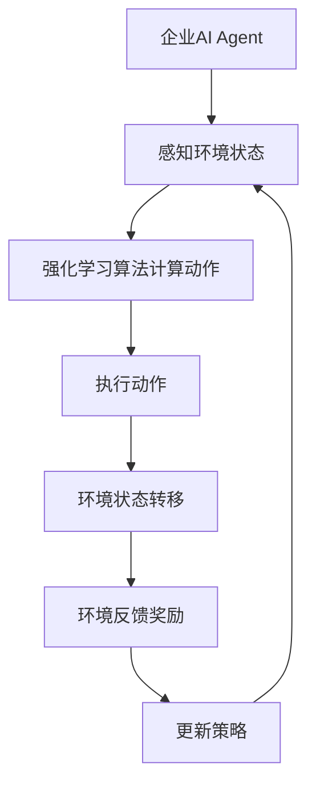

# 企业AI Agent的强化学习在动态资源分配中的应用

> 关键词：企业AI Agent、强化学习、动态资源分配、马尔可夫决策过程、智能决策

> 摘要：本文深入探讨了企业AI Agent的强化学习在动态资源分配中的应用。首先介绍了相关背景，包括目的、预期读者等内容。接着阐述了核心概念与联系，详细解释了企业AI Agent、强化学习和动态资源分配的原理及架构，并给出了相应的示意图和流程图。通过Python源代码详细讲解了核心算法原理和具体操作步骤，同时给出了相关的数学模型和公式，并举例说明。在项目实战部分，提供了开发环境搭建、源代码实现及解读。还分析了实际应用场景，推荐了学习资源、开发工具框架和相关论文著作。最后总结了未来发展趋势与挑战，提供了常见问题解答和扩展阅读参考资料，旨在为企业在动态资源分配中运用强化学习提供全面的技术指导。

## 1. 背景介绍 
### 1.1 目的和范围
在当今竞争激烈的商业环境中，企业面临着复杂多变的资源分配问题。动态资源分配涉及到在不同的时间点和不同的业务需求下，合理地分配有限的资源，如人力、物力、财力等，以实现企业的效益最大化。传统的资源分配方法往往难以适应快速变化的市场环境和业务需求，而强化学习作为一种能够在动态环境中进行自主学习和决策的技术，为企业动态资源分配提供了新的解决方案。

本文的目的是深入探讨企业AI Agent的强化学习在动态资源分配中的应用，详细介绍相关的技术原理、算法实现、实际应用场景等内容，为企业管理者、技术开发者和研究人员提供全面的参考。文章的范围涵盖了强化学习的基本概念、动态资源分配的问题建模、核心算法的实现、项目实战案例以及未来发展趋势等方面。

### 1.2 预期读者
本文的预期读者包括以下几类人群：
- 企业管理者：希望了解如何利用强化学习技术优化企业的资源分配决策，提高企业的运营效率和竞争力。
- 技术开发者：对强化学习算法和企业应用开发感兴趣，希望学习如何将强化学习应用到企业动态资源分配系统中。
- 研究人员：从事人工智能、运筹学等相关领域的研究，关注强化学习在企业管理中的应用研究进展。

### 1.3 文档结构概述
本文的结构如下：
- 核心概念与联系：介绍企业AI Agent、强化学习和动态资源分配的核心概念，以及它们之间的联系，并给出相应的原理和架构示意图。
- 核心算法原理 & 具体操作步骤：详细讲解强化学习的核心算法原理，并用Python源代码阐述具体的操作步骤。
- 数学模型和公式 & 详细讲解 & 举例说明：给出强化学习在动态资源分配中的数学模型和公式，并进行详细讲解和举例说明。
- 项目实战：代码实际案例和详细解释说明：提供一个企业动态资源分配的项目实战案例，包括开发环境搭建、源代码实现和代码解读。
- 实际应用场景：分析强化学习在企业动态资源分配中的实际应用场景。
- 工具和资源推荐：推荐相关的学习资源、开发工具框架和论文著作。
- 总结：未来发展趋势与挑战：总结强化学习在企业动态资源分配中的未来发展趋势和面临的挑战。
- 附录：常见问题与解答：解答读者在学习和应用过程中常见的问题。
- 扩展阅读 & 参考资料：提供相关的扩展阅读材料和参考资料。

### 1.4 术语表
#### 1.4.1 核心术语定义
- 企业AI Agent：指在企业环境中，能够感知环境信息、进行自主学习和决策，并采取行动以实现企业目标的智能体。
- 强化学习：一种机器学习方法，智能体通过与环境进行交互，根据环境反馈的奖励信号来学习最优的行为策略。
- 动态资源分配：在动态变化的环境中，根据不同的时间点和业务需求，合理地分配有限的资源，以实现特定的目标。
- 马尔可夫决策过程（MDP）：一种用于描述强化学习问题的数学模型，由状态、动作、奖励和状态转移概率组成。
- 策略：智能体在每个状态下选择动作的规则。

#### 1.4.2 相关概念解释
- 状态：表示环境在某一时刻的特征，智能体根据当前状态来选择动作。
- 动作：智能体在某个状态下可以采取的行为。
- 奖励：环境根据智能体的动作反馈给智能体的一个数值，用于评估动作的好坏。
- 状态转移概率：描述在某个状态下采取某个动作后，环境转移到下一个状态的概率。

#### 1.4.3 缩略词列表
- MDP：马尔可夫决策过程（Markov Decision Process）
- Q - learning：Q学习算法（Q - learning Algorithm）
- DQN：深度Q网络（Deep Q - Network）

## 2. 核心概念与联系 

### 2.1 核心概念原理
#### 2.1.1 企业AI Agent
企业AI Agent是一种能够在企业环境中自主运行的智能体。它可以通过传感器、数据接口等方式感知企业的各种环境信息，如市场需求、资源状态、业务流程等。然后，根据这些信息进行分析和决策，选择合适的动作来实现企业的目标，如提高生产效率、降低成本、增加利润等。企业AI Agent通常具有学习能力，能够在与环境的交互过程中不断优化自己的决策策略。

#### 2.1.2 强化学习
强化学习是一种机器学习范式，它的核心思想是智能体通过与环境进行交互，不断尝试不同的动作，并根据环境反馈的奖励信号来学习最优的行为策略。在强化学习中，智能体在每个时间步观察环境的状态，选择一个动作执行，然后环境根据智能体的动作转移到下一个状态，并给予智能体一个奖励。智能体的目标是最大化长期累积奖励。

#### 2.1.3 动态资源分配
动态资源分配是指在动态变化的环境中，根据不同的时间点和业务需求，合理地分配有限的资源。在企业中，资源可以包括人力、物力、财力等。动态资源分配需要考虑资源的可用性、需求的变化、目标的优先级等因素，以实现资源的最优配置。

### 2.2 架构的文本示意图
企业AI Agent的强化学习在动态资源分配中的架构可以用以下文本描述：

企业AI Agent作为核心，与企业的动态资源分配环境进行交互。环境包括资源状态、业务需求等信息，AI Agent通过感知模块获取这些信息，得到当前的环境状态。然后，AI Agent根据强化学习算法计算出在当前状态下的最优动作，通过执行模块将动作应用到环境中。环境根据动作进行状态转移，并反馈给AI Agent一个奖励信号。AI Agent根据奖励信号更新自己的策略，不断优化决策过程。

### 2.3 Mermaid流程图


这个流程图展示了企业AI Agent在动态资源分配中的工作流程。首先，AI Agent感知环境状态，然后使用强化学习算法计算出要执行的动作。接着，执行动作，环境根据动作进行状态转移并反馈奖励。最后，AI Agent根据奖励更新策略，继续下一轮的交互。

## 3. 核心算法原理 & 具体操作步骤 

### 3.1 强化学习核心算法 - Q - learning
Q - learning是一种无模型的强化学习算法，它通过学习一个Q函数来估计在某个状态下采取某个动作的长期累积奖励。Q函数表示为 $Q(s,a)$，其中 $s$ 是状态，$a$ 是动作。Q - learning的目标是找到一个最优的Q函数 $Q^*(s,a)$，使得在每个状态下选择具有最大Q值的动作能够最大化长期累积奖励。

#### 3.1.1 Q - learning算法原理
Q - learning算法使用以下更新公式来更新Q函数：

$$Q(s_t,a_t) \leftarrow Q(s_t,a_t) + \alpha [r_{t+1} + \gamma \max_{a} Q(s_{t+1},a) - Q(s_t,a_t)]$$

其中：
- $s_t$ 是当前状态
- $a_t$ 是当前动作
- $r_{t+1}$ 是执行动作 $a_t$ 后获得的奖励
- $s_{t+1}$ 是执行动作 $a_t$ 后转移到的下一个状态
- $\alpha$ 是学习率，控制每次更新的步长
- $\gamma$ 是折扣因子，用于权衡当前奖励和未来奖励

#### 3.1.2 Python源代码实现
```python
import numpy as np

# 定义Q - learning类
class QLearningAgent:
    def __init__(self, num_states, num_actions, learning_rate=0.1, discount_factor=0.9):
        self.num_states = num_states
        self.num_actions = num_actions
        self.learning_rate = learning_rate
        self.discount_factor = discount_factor
        # 初始化Q表
        self.q_table = np.zeros((num_states, num_actions))

    def choose_action(self, state, epsilon=0.1):
        if np.random.uniform(0, 1) < epsilon:
            # 探索：随机选择一个动作
            action = np.random.choice(self.num_actions)
        else:
            # 利用：选择Q值最大的动作
            action = np.argmax(self.q_table[state, :])
        return action

    def update_q_table(self, state, action, reward, next_state):
        # 根据Q - learning更新公式更新Q表
        max_q_next = np.max(self.q_table[next_state, :])
        self.q_table[state, action] += self.learning_rate * (reward + self.discount_factor * max_q_next - self.q_table[state, action])
```

#### 3.1.3 具体操作步骤
1. **初始化**：初始化Q表，将所有的Q值初始化为0。设置学习率 $\alpha$ 和折扣因子 $\gamma$。
2. **循环训练**：
    - 选择一个初始状态 $s_t$。
    - 使用 $\epsilon$-贪心策略选择一个动作 $a_t$。
    - 执行动作 $a_t$，观察环境反馈的奖励 $r_{t+1}$ 和下一个状态 $s_{t+1}$。
    - 根据Q - learning更新公式更新Q表。
    - 将下一个状态 $s_{t+1}$ 作为新的当前状态，重复上述步骤，直到达到终止条件。

## 4. 数学模型和公式 & 详细讲解 & 举例说明 

### 4.1 马尔可夫决策过程（MDP）模型
动态资源分配问题可以用马尔可夫决策过程（MDP）来建模。一个MDP可以用一个五元组 $(S,A,P,R,\gamma)$ 表示，其中：
- $S$ 是状态集合，表示环境的所有可能状态。
- $A$ 是动作集合，表示智能体可以采取的所有动作。
- $P(s_{t+1}|s_t,a_t)$ 是状态转移概率，表示在状态 $s_t$ 下采取动作 $a_t$ 后转移到状态 $s_{t+1}$ 的概率。
- $R(s_t,a_t)$ 是奖励函数，表示在状态 $s_t$ 下采取动作 $a_t$ 后获得的即时奖励。
- $\gamma$ 是折扣因子，用于权衡当前奖励和未来奖励。

### 4.2 最优策略和价值函数
#### 4.2.1 价值函数
价值函数用于评估在某个状态下的长期累积奖励。状态价值函数 $V^\pi(s)$ 表示在策略 $\pi$ 下，从状态 $s$ 开始的长期累积奖励的期望值：

$$V^\pi(s) = \mathbb{E}_\pi \left[\sum_{t=0}^{\infty} \gamma^t r_{t+1} | s_0 = s \right]$$

动作价值函数 $Q^\pi(s,a)$ 表示在策略 $\pi$ 下，从状态 $s$ 采取动作 $a$ 开始的长期累积奖励的期望值：

$$Q^\pi(s,a) = \mathbb{E}_\pi \left[\sum_{t=0}^{\infty} \gamma^t r_{t+1} | s_0 = s, a_0 = a \right]$$

#### 4.2.2 最优策略
最优策略 $\pi^*$ 是使得所有状态的价值函数最大的策略。最优状态价值函数 $V^*(s)$ 和最优动作价值函数 $Q^*(s,a)$ 分别定义为：

$$V^*(s) = \max_{\pi} V^\pi(s)$$

$$Q^*(s,a) = \max_{\pi} Q^\pi(s,a)$$

### 4.3 举例说明
假设一个企业有两种资源：人力和设备，需要分配到两个项目中。状态可以用人力和设备在两个项目中的分配情况来表示，例如 $(h_1,h_2,e_1,e_2)$，其中 $h_1$ 和 $h_2$ 分别是分配到项目1和项目2的人力数量，$e_1$ 和 $e_2$ 分别是分配到项目1和项目2的设备数量。

动作可以是增加或减少某个项目的人力或设备分配，例如 $(+1,0,+1,0)$ 表示给项目1增加1个人力和1个设备。

奖励函数可以根据项目的完成进度和利润来定义，例如如果项目1的完成进度提高了，并且利润增加了，就给予一个正的奖励。

通过将这个问题建模为MDP，可以使用强化学习算法来找到最优的资源分配策略。

## 5. 项目实战：代码实际案例和详细解释说明 

### 5.1  开发环境搭建
#### 5.1.1 安装Python
首先需要安装Python，建议使用Python 3.7及以上版本。可以从Python官方网站（https://www.python.org/downloads/）下载安装包进行安装。

#### 5.1.2 安装必要的库
在命令行中使用以下命令安装必要的库：
```sh
pip install numpy
```

### 5.2  源代码详细实现和代码解读
#### 5.2.1 定义环境类
```python
import numpy as np

class ResourceAllocationEnv:
    def __init__(self, num_resources=2, num_projects=2):
        self.num_resources = num_resources
        self.num_projects = num_projects
        # 初始化资源总量
        self.total_resources = np.array([10, 10])
        # 初始化资源分配状态
        self.state = np.zeros((num_projects, num_resources))

    def reset(self):
        # 重置环境状态
        self.state = np.zeros((self.num_projects, self.num_resources))
        return self.state.flatten()

    def step(self, action):
        # 解析动作
        project_idx = action // self.num_resources
        resource_idx = action % self.num_resources
        # 尝试分配资源
        if self.total_resources[resource_idx] > 0:
            self.state[project_idx, resource_idx] += 1
            self.total_resources[resource_idx] -= 1
            # 简单的奖励函数：根据资源分配的均衡性给予奖励
            reward = -np.var(self.state[:, resource_idx])
        else:
            reward = -1  # 资源不足，给予负奖励
        # 检查是否达到终止条件
        done = np.sum(self.total_resources) == 0
        return self.state.flatten(), reward, done, {}
```

#### 5.2.2 主程序
```python
# 创建环境和Q - learning智能体
env = ResourceAllocationEnv()
num_states = np.prod(env.state.shape)
num_actions = env.num_projects * env.num_resources
agent = QLearningAgent(num_states, num_actions)

# 训练智能体
num_episodes = 1000
for episode in range(num_episodes):
    state = env.reset()
    state_idx = np.ravel_multi_index(np.unravel_index(np.argmax(state), state.shape), state.shape)
    done = False
    while not done:
        action = agent.choose_action(state_idx)
        next_state, reward, done, _ = env.step(action)
        next_state_idx = np.ravel_multi_index(np.unravel_index(np.argmax(next_state), next_state.shape), next_state.shape)
        agent.update_q_table(state_idx, action, reward, next_state_idx)
        state_idx = next_state_idx
```

### 5.3  代码解读与分析
#### 5.3.1 环境类
`ResourceAllocationEnv` 类定义了一个简单的资源分配环境。`__init__` 方法初始化了资源总量和资源分配状态。`reset` 方法用于重置环境状态，返回初始状态。`step` 方法根据智能体的动作更新环境状态，计算奖励，并判断是否达到终止条件。

#### 5.3.2 主程序
主程序中创建了环境和Q - learning智能体。然后进行了1000个回合的训练，每个回合中，智能体从初始状态开始，根据Q表选择动作，执行动作后更新环境状态和Q表，直到达到终止条件。

## 6. 实际应用场景 
### 6.1 云计算资源分配
在云计算环境中，企业需要将计算资源（如CPU、内存、存储等）分配给不同的用户或任务。由于用户的需求和任务的负载是动态变化的，传统的静态资源分配方法往往无法满足需求。使用企业AI Agent的强化学习可以根据实时的资源使用情况和用户需求，动态地分配云计算资源，提高资源利用率和服务质量。

### 6.2 供应链管理
在供应链管理中，企业需要合理地分配原材料、生产设备和运输资源等。供应链的需求和供应情况是动态变化的，受到市场需求、供应商交货时间、运输成本等因素的影响。通过强化学习，企业AI Agent可以学习到最优的资源分配策略，减少库存成本，提高供应链的响应速度和灵活性。

### 6.3 项目管理
在项目管理中，企业需要将人力资源和物力资源分配到不同的项目任务中。项目的进度、优先级和资源需求是动态变化的，使用强化学习可以帮助企业AI Agent根据项目的实时情况，合理地分配资源，确保项目按时完成，提高项目的成功率。

## 7. 工具和资源推荐
### 7.1 学习资源推荐
#### 7.1.1 书籍推荐
- 《强化学习：原理与Python实现》：本书详细介绍了强化学习的基本原理和常用算法，并给出了Python实现代码，适合初学者学习。
- 《Reinforcement Learning: An Introduction》：这是强化学习领域的经典教材，由Richard S. Sutton和Andrew G. Barto所著，全面系统地介绍了强化学习的理论和方法。

#### 7.1.2 在线课程
- Coursera上的“Reinforcement Learning Specialization”：由阿尔伯塔大学的教授授课，涵盖了强化学习的基础知识、算法和应用。
- edX上的“Introduction to Reinforcement Learning”：介绍了强化学习的基本概念和算法，适合初学者。

#### 7.1.3 技术博客和网站
- OpenAI博客（https://openai.com/blog/）：OpenAI发布的关于人工智能和强化学习的最新研究成果和应用案例。
- DeepMind博客（https://deepmind.com/blog/）：DeepMind发布的关于强化学习和人工智能的前沿研究和技术文章。

### 7.2 开发工具框架推荐
#### 7.2.1 IDE和编辑器
- PyCharm：一款功能强大的Python集成开发环境，提供了代码编辑、调试、版本控制等功能。
- Jupyter Notebook：一个交互式的开发环境，适合进行数据探索、算法实现和可视化。

#### 7.2.2 调试和性能分析工具
- TensorBoard：TensorFlow提供的可视化工具，可以用于监控训练过程、查看模型性能等。
- cProfile：Python内置的性能分析工具，可以帮助分析代码的执行时间和资源消耗。

#### 7.2.3 相关框架和库
- OpenAI Gym：一个用于开发和比较强化学习算法的工具包，提供了各种环境和基准测试。
- Stable Baselines：一个基于TensorFlow的强化学习库，提供了多种预训练的强化学习算法和模型。

### 7.3 相关论文著作推荐
#### 7.3.1 经典论文
- “Q - learning”：由Christopher J. C. H. Watkins和Peter Dayan发表的论文，首次提出了Q - learning算法。
- “Human - level control through deep reinforcement learning”：由DeepMind团队发表的论文，介绍了深度Q网络（DQN）算法，并在Atari游戏上取得了人类水平的表现。

#### 7.3.2 最新研究成果
- 关注NeurIPS、ICML、AAAI等顶级人工智能会议上关于强化学习在企业应用的最新研究成果。

#### 7.3.3 应用案例分析
- 可以参考一些企业的技术博客和研究报告，了解强化学习在实际企业资源分配中的应用案例和经验分享。

## 8. 总结：未来发展趋势与挑战
### 8.1 未来发展趋势
- **与深度学习的融合**：将强化学习与深度学习相结合，利用深度学习强大的特征提取能力，处理复杂的高维状态和动作空间，提高强化学习的性能和应用范围。
- **多智能体强化学习**：在企业环境中，多个AI Agent可能需要协同工作来完成资源分配任务。多智能体强化学习可以研究多个智能体之间的协作和竞争关系，实现更高效的资源分配。
- **实时决策和自适应学习**：随着企业环境的快速变化，强化学习需要具备实时决策和自适应学习的能力，能够快速响应环境的变化，调整资源分配策略。

### 8.2 挑战
- **数据获取和标注**：强化学习需要大量的交互数据来进行训练，而在企业环境中，数据的获取和标注可能比较困难，需要解决数据隐私和安全等问题。
- **计算资源和时间成本**：强化学习算法通常需要大量的计算资源和时间来进行训练，如何在有限的计算资源和时间内实现高效的训练是一个挑战。
- **策略的可解释性**：在企业决策中，需要对资源分配策略进行解释和理解。强化学习算法生成的策略往往比较复杂，难以解释，如何提高策略的可解释性是一个重要的问题。

## 9. 附录：常见问题与解答
### 9.1 强化学习在动态资源分配中的收敛性如何保证？
强化学习的收敛性与算法的选择、参数的设置和环境的特性有关。对于一些经典的强化学习算法，如Q - learning，在满足一定条件下（如学习率逐渐减小、探索率逐渐减小等）可以保证收敛到最优策略。在实际应用中，可以通过调整参数、增加训练步数等方法来提高收敛的可能性。

### 9.2 如何选择合适的奖励函数？
奖励函数的设计需要根据具体的动态资源分配问题来确定。奖励函数应该能够反映企业的目标，如最大化利润、提高资源利用率等。同时，奖励函数的设计应该尽量简单易懂，避免过于复杂导致训练不稳定。可以通过实验和调优来确定合适的奖励函数。

### 9.3 强化学习算法在处理大规模状态和动作空间时会遇到什么问题？
在处理大规模状态和动作空间时，强化学习算法可能会遇到计算复杂度高、收敛速度慢等问题。可以采用一些方法来解决这些问题，如使用函数逼近（如神经网络）来表示价值函数和策略，采用分层强化学习等技术来降低问题的复杂度。

## 10. 扩展阅读 & 参考资料
### 10.1 扩展阅读
- 《Deep Reinforcement Learning Hands - On》：本书介绍了深度强化学习的实践方法和应用案例，适合进一步深入学习。
- 《Multi - Agent Systems: Algorithmic, Game - Theoretic, and Logical Foundations》：关于多智能体系统的经典著作，对于理解多智能体强化学习有很大帮助。

### 10.2 参考资料
- Sutton, R. S., & Barto, A. G. (2018). Reinforcement Learning: An Introduction. MIT press.
- Watkins, C. J., & Dayan, P. (1992). Q - learning. Machine learning, 8(3 - 4), 279 - 292.
- Mnih, V., et al. (2015). Human - level control through deep reinforcement learning. Nature, 518(7540), 529 - 533.

作者：AI天才研究院/AI Genius Institute & 禅与计算机程序设计艺术 /Zen And The Art of Computer Programming