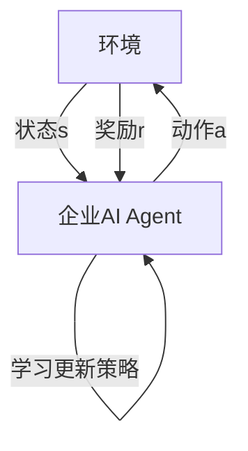

# 企业AI Agent的强化学习在智能建筑管理中的节能应用

> 关键词：企业AI Agent、强化学习、智能建筑管理、节能应用、环境感知

> 摘要：本文聚焦于企业AI Agent的强化学习在智能建筑管理节能方面的应用。首先介绍了相关背景，包括目的范围、预期读者等。接着阐述了核心概念及联系，详细讲解了强化学习和企业AI Agent的原理与架构。通过Python代码深入剖析核心算法原理和具体操作步骤，并给出相应数学模型和公式。结合项目实战，展示代码实际案例并进行解读。分析了该技术在智能建筑管理中的实际应用场景，推荐了学习资源、开发工具框架以及相关论文著作。最后总结未来发展趋势与挑战，解答常见问题，并提供扩展阅读和参考资料，旨在为智能建筑节能领域的研究和实践提供全面且深入的指导。

## 1. 背景介绍 
### 1.1 目的和范围
随着全球能源问题日益严峻，建筑能耗在总能耗中占据相当大的比例。智能建筑管理系统旨在通过先进的技术手段实现建筑能源的高效利用，降低能耗成本。本研究的目的是探讨企业AI Agent的强化学习在智能建筑管理节能方面的应用，通过智能决策和自适应控制，优化建筑的能源消耗。研究范围涵盖了智能建筑中的空调系统、照明系统、通风系统等主要能耗设备的控制与管理。

### 1.2 预期读者
本文预期读者包括智能建筑领域的工程师、研究人员，对强化学习和人工智能在节能应用方面感兴趣的学者，以及从事企业级智能系统开发的技术人员。同时，也适合建筑管理人员和能源管理专家了解如何利用先进技术提升建筑的节能效果。

### 1.3 文档结构概述
本文将按照以下结构展开：首先介绍相关核心概念及联系，包括强化学习和企业AI Agent的原理与架构；接着详细阐述核心算法原理和具体操作步骤，并给出相应的数学模型和公式；通过项目实战展示代码实际案例并进行解读；分析该技术在智能建筑管理中的实际应用场景；推荐学习资源、开发工具框架以及相关论文著作；最后总结未来发展趋势与挑战，解答常见问题，并提供扩展阅读和参考资料。

### 1.4 术语表
#### 1.4.1 核心术语定义
- **企业AI Agent**：一种具有自主决策能力的智能体，能够感知企业环境信息，根据预设的目标和策略进行行动，以实现企业的特定任务和目标。
- **强化学习**：一种机器学习方法，智能体通过与环境进行交互，根据环境反馈的奖励信号来学习最优的行为策略，以最大化长期累积奖励。
- **智能建筑管理**：利用先进的信息技术和自动化控制技术，对建筑的设备、系统进行智能化管理和控制，以提高建筑的运行效率、舒适度和节能效果。
- **节能应用**：通过采用各种技术和措施，降低建筑的能源消耗，提高能源利用效率，实现节能减排的目标。

#### 1.4.2 相关概念解释
- **环境感知**：企业AI Agent通过传感器等设备获取建筑环境的各种信息，如温度、湿度、光照强度等，以便做出合理的决策。
- **奖励机制**：在强化学习中，环境根据智能体的行为给予相应的奖励或惩罚，智能体通过学习奖励信号来调整自己的行为策略。
- **策略优化**：智能体通过不断与环境交互，根据奖励信号更新自己的行为策略，以提高长期累积奖励。

#### 1.4.3 缩略词列表
- **RL**：强化学习（Reinforcement Learning）
- **AI**：人工智能（Artificial Intelligence）
- **HVAC**：供热、通风与空调系统（Heating, Ventilation, and Air Conditioning）

## 2. 核心概念与联系 
### 2.1 强化学习原理
强化学习是一种通过智能体与环境进行交互来学习最优行为策略的机器学习方法。智能体在每个时间步 $t$ 观察环境的状态 $s_t$，并根据当前的策略 $\pi$ 选择一个动作 $a_t$ 执行。环境根据智能体的动作转移到下一个状态 $s_{t+1}$，并给予智能体一个奖励 $r_{t+1}$。智能体的目标是通过学习最大化长期累积奖励 $R = \sum_{t=0}^{T} \gamma^t r_{t+1}$，其中 $\gamma$ 是折扣因子，用于权衡当前奖励和未来奖励的重要性。

强化学习的核心是策略迭代和值函数估计。策略迭代通过不断更新策略来提高智能体的性能，而值函数估计则用于评估不同状态和动作的价值。常见的值函数包括状态值函数 $V(s)$ 和动作值函数 $Q(s,a)$，分别表示在状态 $s$ 下的期望累积奖励和在状态 $s$ 执行动作 $a$ 的期望累积奖励。

### 2.2 企业AI Agent架构
企业AI Agent通常由感知模块、决策模块和执行模块组成。感知模块负责获取建筑环境的各种信息，如温度、湿度、光照强度等，并将这些信息转换为智能体可以理解的状态表示。决策模块根据感知模块提供的状态信息，利用强化学习算法选择最优的动作。执行模块将决策模块选择的动作转换为实际的控制指令，发送给建筑设备进行执行。

以下是企业AI Agent架构的文本示意图：

```plaintext
+---------------------+
|  感知模块           |
|  (环境信息采集)     |
+---------------------+
         |
         v
+---------------------+
|  决策模块           |
|  (强化学习算法)     |
+---------------------+
         |
         v
+---------------------+
|  执行模块           |
|  (控制指令发送)     |
+---------------------+
```

### 2.3 强化学习与企业AI Agent的联系
强化学习为企业AI Agent提供了一种有效的决策方法，使智能体能够在复杂的建筑环境中自适应地调整自己的行为策略。企业AI Agent通过强化学习不断学习环境的动态变化和奖励机制，从而找到最优的节能策略。同时，企业AI Agent的感知和执行能力为强化学习提供了与环境进行交互的接口，使得强化学习算法能够在实际应用中得到有效的实现。

### 2.4 Mermaid流程图


## 3. 核心算法原理 & 具体操作步骤 
### 3.1 Q - learning算法原理
Q - learning是一种无模型的强化学习算法，用于估计动作值函数 $Q(s,a)$。其核心思想是通过不断更新 $Q$ 值来逼近最优动作值函数 $Q^*$。在每个时间步 $t$，智能体根据当前的 $Q$ 值选择动作 $a_t$，并执行该动作。环境根据智能体的动作转移到下一个状态 $s_{t+1}$，并给予智能体一个奖励 $r_{t+1}$。然后，智能体根据以下更新公式更新 $Q$ 值：

$$Q(s_t,a_t) \leftarrow Q(s_t,a_t) + \alpha [r_{t+1} + \gamma \max_{a} Q(s_{t+1},a) - Q(s_t,a_t)]$$

其中，$\alpha$ 是学习率，用于控制每次更新的步长；$\gamma$ 是折扣因子，用于权衡当前奖励和未来奖励的重要性。

### 3.2 Python代码实现
```python
import numpy as np

class QLearningAgent:
    def __init__(self, state_size, action_size, learning_rate=0.1, discount_factor=0.9):
        self.state_size = state_size
        self.action_size = action_size
        self.learning_rate = learning_rate
        self.discount_factor = discount_factor
        self.q_table = np.zeros((state_size, action_size))

    def choose_action(self, state, epsilon=0.1):
        if np.random.uniform(0, 1) < epsilon:
            # 探索：随机选择动作
            action = np.random.choice(self.action_size)
        else:
            # 利用：选择Q值最大的动作
            action = np.argmax(self.q_table[state, :])
        return action

    def update_q_table(self, state, action, reward, next_state):
        # Q - learning更新公式
        max_q_next = np.max(self.q_table[next_state, :])
        self.q_table[state, action] += self.learning_rate * (reward + self.discount_factor * max_q_next - self.q_table[state, action])


# 示例使用
state_size = 10
action_size = 4
agent = QLearningAgent(state_size, action_size)

# 模拟环境交互
state = np.random.randint(0, state_size)
action = agent.choose_action(state)
next_state = np.random.randint(0, state_size)
reward = np.random.randn()

agent.update_q_table(state, action, reward, next_state)
```

### 3.3 具体操作步骤
1. **初始化**：初始化 $Q$ 表 $Q(s,a)$ 为全零矩阵，设置学习率 $\alpha$、折扣因子 $\gamma$ 和探索率 $\epsilon$。
2. **环境交互**：智能体在每个时间步 $t$ 观察环境的状态 $s_t$，根据当前的 $Q$ 表和探索策略选择动作 $a_t$，执行动作并观察下一个状态 $s_{t+1}$ 和奖励 $r_{t+1}$。
3. **更新 $Q$ 表**：根据 $Q$ - learning更新公式更新 $Q$ 表中的 $Q(s_t,a_t)$ 值。
4. **重复步骤2和3**：不断与环境进行交互，更新 $Q$ 表，直到达到预设的训练步数或收敛条件。

## 4. 数学模型和公式 & 详细讲解 & 举例说明 
### 4.1 马尔可夫决策过程（MDP）
强化学习可以用马尔可夫决策过程（MDP）来建模。一个MDP由一个四元组 $(S,A,P,R)$ 组成，其中：
- $S$ 是状态空间，表示环境的所有可能状态。
- $A$ 是动作空间，表示智能体可以执行的所有可能动作。
- $P(s_{t+1}|s_t,a_t)$ 是状态转移概率，表示在状态 $s_t$ 执行动作 $a_t$ 后转移到状态 $s_{t+1}$ 的概率。
- $R(s_t,a_t,s_{t+1})$ 是奖励函数，表示在状态 $s_t$ 执行动作 $a_t$ 转移到状态 $s_{t+1}$ 时获得的奖励。

智能体的目标是找到一个最优策略 $\pi^*$，使得长期累积奖励 $R = \sum_{t=0}^{T} \gamma^t r_{t+1}$ 最大化。

### 4.2 状态值函数和动作值函数
状态值函数 $V^\pi(s)$ 表示在策略 $\pi$ 下，从状态 $s$ 开始的期望累积奖励：

$$V^\pi(s) = \mathbb{E}_\pi \left[ \sum_{t=0}^{\infty} \gamma^t r_{t+1} | s_0 = s \right]$$

动作值函数 $Q^\pi(s,a)$ 表示在策略 $\pi$ 下，从状态 $s$ 执行动作 $a$ 开始的期望累积奖励：

$$Q^\pi(s,a) = \mathbb{E}_\pi \left[ \sum_{t=0}^{\infty} \gamma^t r_{t+1} | s_0 = s, a_0 = a \right]$$

最优状态值函数 $V^*(s)$ 和最优动作值函数 $Q^*(s,a)$ 分别表示所有策略下的最大状态值和最大动作值：

$$V^*(s) = \max_\pi V^\pi(s)$$

$$Q^*(s,a) = \max_\pi Q^\pi(s,a)$$

### 4.3 Bellman方程
Bellman方程描述了状态值函数和动作值函数之间的递归关系。对于状态值函数，Bellman方程为：

$$V^\pi(s) = \sum_{a \in A} \pi(a|s) \sum_{s' \in S} P(s'|s,a) [R(s,a,s') + \gamma V^\pi(s')]$$

对于动作值函数，Bellman方程为：

$$Q^\pi(s,a) = \sum_{s' \in S} P(s'|s,a) [R(s,a,s') + \gamma \sum_{a' \in A} \pi(a'|s') Q^\pi(s',a')]$$

最优Bellman方程为：

$$V^*(s) = \max_{a \in A} \sum_{s' \in S} P(s'|s,a) [R(s,a,s') + \gamma V^*(s')]$$

$$Q^*(s,a) = \sum_{s' \in S} P(s'|s,a) [R(s,a,s') + \gamma \max_{a' \in A} Q^*(s',a')]$$

### 4.4 举例说明
假设一个简单的智能建筑管理场景，状态空间 $S = \{s_1, s_2\}$ 表示室内温度的高低，动作空间 $A = \{a_1, a_2\}$ 表示开启或关闭空调。状态转移概率和奖励函数如下：

- $P(s_1|s_1,a_1) = 0.8$，$P(s_2|s_1,a_1) = 0.2$
- $P(s_1|s_1,a_2) = 0.2$，$P(s_2|s_1,a_2) = 0.8$
- $P(s_1|s_2,a_1) = 0.2$，$P(s_2|s_2,a_1) = 0.8$
- $P(s_1|s_2,a_2) = 0.8$，$P(s_2|s_2,a_2) = 0.2$

- $R(s_1,a_1,s_1) = -1$，$R(s_1,a_1,s_2) = -2$
- $R(s_1,a_2,s_1) = 1$，$R(s_1,a_2,s_2) = -3$
- $R(s_2,a_1,s_1) = -2$，$R(s_2,a_1,s_2) = -1$
- $R(s_2,a_2,s_1) = -3$，$R(s_2,a_2,s_2) = 1$

假设折扣因子 $\gamma = 0.9$，我们可以使用Bellman方程来计算最优状态值函数和最优动作值函数。

首先，初始化 $V^*(s)$ 和 $Q^*(s,a)$ 为全零向量。然后，迭代更新：

$$V^*(s) \leftarrow \max_{a \in A} \sum_{s' \in S} P(s'|s,a) [R(s,a,s') + \gamma V^*(s')]$$

$$Q^*(s,a) \leftarrow \sum_{s' \in S} P(s'|s,a) [R(s,a,s') + \gamma \max_{a' \in A} Q^*(s',a')]$$

经过多次迭代，我们可以得到收敛的最优状态值函数和最优动作值函数，从而确定最优策略。

## 5. 项目实战：代码实际案例和详细解释说明 
### 5.1  开发环境搭建
#### 5.1.1 安装Python
首先，确保你已经安装了Python 3.x版本。可以从Python官方网站（https://www.python.org/downloads/）下载并安装适合你操作系统的Python版本。

#### 5.1.2 安装必要的库
使用以下命令安装所需的Python库：
```sh
pip install numpy
```
`numpy` 是一个用于科学计算的Python库，在强化学习中用于处理数组和矩阵运算。

### 5.2  源代码详细实现和代码解读
```python
import numpy as np

# 定义智能建筑环境类
class SmartBuildingEnv:
    def __init__(self):
        # 状态空间：假设室内温度有5个离散状态
        self.state_size = 5
        # 动作空间：假设可以选择3种不同的空调功率
        self.action_size = 3
        # 初始化当前状态
        self.state = np.random.randint(0, self.state_size)

    def step(self, action):
        # 模拟状态转移
        # 这里简单假设状态转移是随机的，实际应用中需要根据具体的物理模型
        next_state = np.random.randint(0, self.state_size)
        # 定义奖励函数，奖励与节能和舒适度有关
        if action == 0:  # 低功率
            if next_state == 2:  # 舒适温度
                reward = 1
            else:
                reward = -0.5
        elif action == 1:  # 中功率
            if next_state == 2:
                reward = 0.5
            else:
                reward = -0.2
        else:  # 高功率
            if next_state == 2:
                reward = 0
            else:
                reward = -1
        # 更新当前状态
        self.state = next_state
        return next_state, reward

    def reset(self):
        # 重置环境到初始状态
        self.state = np.random.randint(0, self.state_size)
        return self.state


# 定义Q - learning智能体类
class QLearningAgent:
    def __init__(self, state_size, action_size, learning_rate=0.1, discount_factor=0.9):
        self.state_size = state_size
        self.action_size = action_size
        self.learning_rate = learning_rate
        self.discount_factor = discount_factor
        # 初始化Q表
        self.q_table = np.zeros((state_size, action_size))

    def choose_action(self, state, epsilon=0.1):
        if np.random.uniform(0, 1) < epsilon:
            # 探索：随机选择动作
            action = np.random.choice(self.action_size)
        else:
            # 利用：选择Q值最大的动作
            action = np.argmax(self.q_table[state, :])
        return action

    def update_q_table(self, state, action, reward, next_state):
        # Q - learning更新公式
        max_q_next = np.max(self.q_table[next_state, :])
        self.q_table[state, action] += self.learning_rate * (reward + self.discount_factor * max_q_next - self.q_table[state, action])


# 主训练循环
if __name__ == "__main__":
    # 创建环境和智能体
    env = SmartBuildingEnv()
    agent = QLearningAgent(env.state_size, env.action_size)

    # 训练参数
    num_episodes = 1000
    for episode in range(num_episodes):
        # 重置环境
        state = env.reset()
        total_reward = 0
        done = False
        while not done:
            # 选择动作
            action = agent.choose_action(state)
            # 执行动作，获取下一个状态和奖励
            next_state, reward = env.step(action)
            # 更新Q表
            agent.update_q_table(state, action, reward, next_state)
            # 更新状态
            state = next_state
            total_reward += reward
            # 这里简单假设每个回合固定步数
            if total_reward > 100 or total_reward < -100:
                done = True
        print(f"Episode {episode}: Total Reward = {total_reward}")
```

### 5.3  代码解读与分析
#### 5.3.1 智能建筑环境类 `SmartBuildingEnv`
- `__init__` 方法：初始化环境的状态空间和动作空间，并随机选择一个初始状态。
- `step` 方法：模拟环境的状态转移和奖励计算。根据选择的动作和下一个状态，计算相应的奖励。
- `reset` 方法：重置环境到初始状态，并返回初始状态。

#### 5.3.2 Q - learning智能体类 `QLearningAgent`
- `__init__` 方法：初始化智能体的状态空间、动作空间、学习率、折扣因子和Q表。
- `choose_action` 方法：根据当前状态和探索率选择动作。以一定的概率进行探索（随机选择动作），否则选择Q值最大的动作。
- `update_q_table` 方法：根据Q - learning更新公式更新Q表中的Q值。

#### 5.3.3 主训练循环
在主训练循环中，创建环境和智能体，进行多个回合的训练。每个回合开始时重置环境，智能体不断选择动作、执行动作、更新Q表，直到达到终止条件。记录每个回合的总奖励并打印输出。

通过这个项目实战，我们可以看到如何使用Q - learning算法训练一个智能体来控制智能建筑的空调系统，以实现节能和提高舒适度的目标。

## 6. 实际应用场景 
### 6.1 空调系统控制
在智能建筑中，空调系统是主要的能耗设备之一。企业AI Agent的强化学习可以根据室内外温度、湿度、人员密度等环境信息，实时调整空调的运行模式和温度设置，以达到节能的目的。例如，当室内人员较少且室外温度适宜时，智能体可以降低空调的功率或关闭空调；当室内人员较多且温度较高时，智能体可以提高空调的功率，以保证室内的舒适度。

### 6.2 照明系统控制
强化学习可以应用于智能建筑的照明系统控制。智能体可以根据室内光照强度、人员活动情况等信息，自动调整照明设备的亮度和开关状态。例如，当室内光照充足且无人活动时，智能体可以关闭部分或全部照明设备；当室内光照不足或有人活动时，智能体可以打开照明设备并调整到合适的亮度。

### 6.3 通风系统控制
通风系统对于保持室内空气质量和舒适度至关重要。企业AI Agent的强化学习可以根据室内空气质量、二氧化碳浓度、人员密度等信息，实时调整通风系统的运行参数，如风机转速、新风量等。例如，当室内二氧化碳浓度过高时，智能体可以提高通风系统的运行功率，增加新风量；当室内空气质量良好时，智能体可以降低通风系统的运行功率，以节约能源。

### 6.4 能源管理与调度
除了单个设备的控制，强化学习还可以应用于智能建筑的能源管理与调度。智能体可以根据建筑的用电需求、电价波动、可再生能源发电情况等信息，优化建筑的能源消耗和能源采购策略。例如，在电价低谷期，智能体可以增加建筑的储能设备充电量；在可再生能源发电充足时，智能体可以优先使用可再生能源，减少对电网的依赖。

## 7. 工具和资源推荐
### 7.1 学习资源推荐
#### 7.1.1 书籍推荐
- 《强化学习：原理与Python实现》：本书系统地介绍了强化学习的基本原理、算法和应用，并提供了大量的Python代码示例，适合初学者入门。
- 《深度学习》：虽然主要介绍深度学习，但其中也包含了一些与强化学习相关的内容，如深度Q网络（DQN）等，对于深入理解强化学习有很大帮助。
- 《智能建筑：原理、设计与应用》：该书全面介绍了智能建筑的相关知识，包括智能建筑管理系统、节能技术等，对于了解智能建筑领域的应用场景和需求非常有帮助。

#### 7.1.2 在线课程
- Coursera上的“强化学习专项课程”：由顶尖高校的教授授课，内容涵盖了强化学习的基础理论、算法和应用，提供了丰富的实践项目和作业。
- edX上的“智能建筑系统与技术”：该课程介绍了智能建筑的系统架构、传感器技术、自动化控制等方面的知识，适合对智能建筑管理感兴趣的学习者。
- 网易云课堂上的“Python实战强化学习”：通过实际项目案例，详细讲解了如何使用Python实现强化学习算法，对于提高实践能力非常有帮助。

#### 7.1.3 技术博客和网站
- OpenAI官方博客：OpenAI是强化学习领域的领先研究机构，其官方博客会发布最新的研究成果和技术文章，对于了解强化学习的前沿动态非常有帮助。
- 知乎上的强化学习相关话题：知乎上有很多关于强化学习的讨论和分享，包括算法解读、应用案例、学习经验等，可以从中获取很多有价值的信息。
- 智能建筑行业网站：如中国智能建筑网、智能建筑资讯网等，这些网站提供了智能建筑领域的最新资讯、技术文章、项目案例等，有助于了解智能建筑的发展趋势和应用情况。

### 7.2 开发工具框架推荐
#### 7.2.1 IDE和编辑器
- PyCharm：是一款专业的Python集成开发环境，提供了丰富的代码编辑、调试、分析等功能，适合开发Python强化学习项目。
- Jupyter Notebook：是一个交互式的开发环境，支持Python代码的实时运行和可视化展示，非常适合进行算法实验和数据分析。
- Visual Studio Code：是一款轻量级的代码编辑器，支持多种编程语言和插件扩展，可用于开发强化学习项目和智能建筑管理系统。

#### 7.2.2 调试和性能分析工具
- TensorBoard：是TensorFlow的可视化工具，可用于监控强化学习训练过程中的各种指标，如损失函数、奖励曲线等，帮助分析模型的性能和收敛情况。
- Py-Spy：是一个Python性能分析工具，可用于分析Python代码的性能瓶颈，找出耗时较长的函数和代码段，提高代码的运行效率。
- GDB：是一个通用的调试器，可用于调试Python程序，帮助定位和解决代码中的错误。

#### 7.2.3 相关框架和库
- OpenAI Gym：是一个用于开发和比较强化学习算法的工具包，提供了各种经典的强化学习环境，如CartPole、MountainCar等，方便进行算法实验和验证。
- Stable Baselines：是一个基于TensorFlow和PyTorch的强化学习库，提供了多种预训练的强化学习算法和模型，可用于快速开发和部署强化学习应用。
- TensorFlow和PyTorch：是两个流行的深度学习框架，可用于实现深度强化学习算法，如深度Q网络（DQN）、策略梯度算法等。

### 7.3 相关论文著作推荐
#### 7.3.1 经典论文
- “Q - learning”：由Watkins和Dayan在1992年发表的论文，首次提出了Q - learning算法，是强化学习领域的经典之作。
- “Playing Atari with Deep Reinforcement Learning”：由Mnih等人在2013年发表的论文，提出了深度Q网络（DQN）算法，开创了深度强化学习的先河。
- “Policy Gradient Methods for Reinforcement Learning with Function Approximation”：由Sutton等人在2000年发表的论文，提出了策略梯度算法，为解决连续动作空间的强化学习问题提供了有效的方法。

#### 7.3.2 最新研究成果
- 近年来，强化学习在智能建筑管理中的应用受到了广泛关注，相关的研究成果不断涌现。可以通过IEEE Xplore、ACM Digital Library等学术数据库搜索最新的研究论文，了解该领域的最新进展。

#### 7.3.3 应用案例分析
- 一些国际知名的智能建筑项目会发布相关的技术报告和案例分析，介绍如何使用强化学习等先进技术实现建筑的节能和智能化管理。可以通过查阅这些案例分析，了解实际应用中的挑战和解决方案。

## 8. 总结：未来发展趋势与挑战
### 8.1 未来发展趋势
#### 8.1.1 深度强化学习的应用
随着深度学习技术的不断发展，深度强化学习将在智能建筑管理中得到更广泛的应用。深度强化学习可以处理更复杂的环境信息和动作空间，提高智能体的决策能力和学习效率。例如，使用卷积神经网络（CNN）处理图像信息，实现对建筑环境的视觉感知；使用循环神经网络（RNN）处理序列数据，如时间序列的能源消耗数据。

#### 8.1.2 多智能体系统的协同
在智能建筑中，可能存在多个不同类型的智能体，如空调控制智能体、照明控制智能体、通风控制智能体等。未来的发展趋势是实现多智能体系统的协同工作，通过智能体之间的通信和协作，共同优化建筑的能源消耗和运行效率。例如，空调控制智能体可以与照明控制智能体进行信息交互，根据室内人员的分布情况和光照需求，协同调整空调和照明设备的运行状态。

#### 8.1.3 与物联网技术的融合
物联网技术为智能建筑管理提供了丰富的传感器数据和设备控制接口。未来，强化学习将与物联网技术深度融合，实现对建筑设备的实时监测和智能控制。通过物联网传感器收集建筑环境的各种信息，如温度、湿度、光照强度、人员活动等，强化学习智能体可以根据这些信息做出更准确的决策，实现建筑的精细化管理和节能优化。

#### 8.1.4 节能与舒适度的平衡优化
未来的智能建筑管理不仅要关注节能效果，还要兼顾用户的舒适度。强化学习可以通过设计合理的奖励函数，实现节能与舒适度的平衡优化。例如，在保证室内温度、湿度、空气质量等环境参数在舒适范围内的前提下，尽可能降低能源消耗。

### 8.2 挑战
#### 8.2.1 数据质量和安全性
智能建筑管理中需要大量的传感器数据来支持强化学习算法的训练和决策。然而，数据质量和安全性是一个重要的挑战。传感器数据可能存在噪声、缺失值等问题，影响算法的性能。同时，建筑的能源管理数据涉及到用户的隐私和商业机密，需要采取有效的安全措施来保护数据的安全。

#### 8.2.2 环境模型的不确定性
建筑环境是一个复杂的动态系统，存在很多不确定性因素，如天气变化、人员活动的随机性等。强化学习算法需要建立准确的环境模型来进行决策，但环境模型的不确定性会导致算法的性能下降。如何处理环境模型的不确定性，提高算法的鲁棒性，是一个亟待解决的问题。

#### 8.2.3 算法的可解释性
深度强化学习算法通常是基于神经网络的黑盒模型，其决策过程难以解释。在智能建筑管理中，用户和管理人员需要了解智能体的决策依据，以便进行监督和调整。如何提高强化学习算法的可解释性，是一个重要的研究方向。

#### 8.2.4 系统的可扩展性
随着智能建筑规模的不断扩大和功能的不断增加，强化学习系统需要具备良好的可扩展性。如何设计高效的算法和架构，使得系统能够处理大规模的状态空间和动作空间，是一个挑战。

## 9. 附录：常见问题与解答
### 9.1 强化学习在智能建筑管理中的节能效果如何评估？
可以从多个方面评估强化学习在智能建筑管理中的节能效果。一是能源消耗数据的对比，比较使用强化学习控制前后建筑的能源消耗总量和单位面积能耗；二是节能率的计算，通过计算能源消耗的减少比例来评估节能效果；三是舒适度指标的监测，在保证室内舒适度（如温度、湿度、空气质量等）满足一定标准的前提下，评估节能效果。同时，可以结合经济指标，如能源成本的降低来综合评估节能效果。

### 9.2 如何选择合适的强化学习算法应用于智能建筑管理？
选择合适的强化学习算法需要考虑多个因素。首先是问题的复杂度，如果状态空间和动作空间较小，可以选择传统的基于表格的算法，如Q - learning；如果状态空间和动作空间较大，需要使用深度强化学习算法，如深度Q网络（DQN）、策略梯度算法等。其次是算法的收敛速度和稳定性，不同的算法在收敛速度和稳定性上可能存在差异，需要根据实际情况进行选择。此外，还需要考虑算法的可解释性和计算资源的需求。

### 9.3 强化学习智能体在实际应用中如何处理环境的动态变化？
强化学习智能体可以通过不断与环境进行交互，实时更新自己的策略来处理环境的动态变化。当环境发生变化时，智能体可以根据新的状态和奖励信息，使用强化学习算法更新Q表或神经网络参数，以适应新的环境。此外，可以采用一些自适应的策略，如动态调整学习率、探索率等，提高智能体的适应性。

### 9.4 如何解决强化学习在智能建筑管理中的数据不足问题？
可以采用以下方法解决数据不足问题。一是数据增强技术，通过对已有的数据进行变换和扩充，生成更多的训练数据。例如，对传感器数据进行噪声添加、平移、缩放等操作。二是迁移学习，利用在其他类似环境中训练好的模型，将其知识迁移到当前的智能建筑管理任务中，减少对大量数据的依赖。三是模拟环境训练，构建智能建筑的模拟环境，在模拟环境中生成大量的训练数据，对智能体进行预训练，然后将其应用到实际环境中。

## 10. 扩展阅读 & 参考资料
### 10.1 扩展阅读
- 《强化学习精要：核心算法与TensorFlow实现》：进一步深入学习强化学习的算法原理和实现细节，了解如何使用TensorFlow实现各种强化学习算法。
- 《智能建筑技术与应用》：详细介绍智能建筑的各种技术和应用案例，包括智能建筑管理系统的设计、开发和实施。
- 《能源管理与节能技术》：学习能源管理的基本原理和节能技术，了解如何在智能建筑中应用这些技术实现节能目标。

### 10.2 参考资料
- IEEE Transactions on Smart Grid：该期刊发表了大量关于智能电网和智能建筑管理的研究论文，提供了最新的技术和研究成果。
- ACM Transactions on Intelligent Systems and Technology：涵盖了人工智能和智能系统领域的研究，包括强化学习在智能建筑管理中的应用。
- 国际智能建筑协会（IIBA）的官方网站：提供了智能建筑领域的行业标准、技术报告和最佳实践案例。

作者：AI天才研究院/AI Genius Institute & 禅与计算机程序设计艺术 /Zen And The Art of Computer Programming